# Production case studies, by topic

The same landscape of shipped LLM systems that the broad indexes catalog
(crediting the [Evidently AI ML system design database](https://www.evidentlyai.com/ml-system-design)),
re-organized into this repo's own use-case taxonomy.

Each category is not just a link list: it opens with a **similarities and
differences** synthesis, a **Mermaid diagram of where the real designs diverge**,
a **choices side-by-side table**, the **math that separates the approaches**, and
where useful a **tradeoff quadrant plot**, all read from the underlying engineering
writeups. Then the systems themselves. For the full per-case teardown of any one,
see [CASE-TEARDOWNS.md](CASE-TEARDOWNS.md); browse the same systems
[by company](CASE-STUDIES-BY-COMPANY.md) or [by industry](CASE-STUDIES-BY-INDUSTRY.md).

209 systems across the taxonomy, and growing.

---
### [RAG serving](topics/01-rag-serving.md) · 22 systems

**What they share.** Every team embeds the query, retrieves candidate context from an index, assembles a tight grounded prompt, and lets the LLM answer so knowledge updates without retraining; they diverge on the retrieval unit (chunk, query API, graph community, table) and on how hard they push fusion, reranking, and eval.

**The reference pipeline.** Before the divergences, fix the skeleton every design starts from. Online, a query is embedded, matched against the index, reranked down to a short shortlist, packed into a grounded context, and generated with citations. Offline, the corpus is chunked, embedded, and indexed on a freshness loop that re-embeds only changed documents. Everything below is a variation on which stage gets the investment.

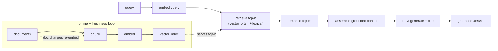

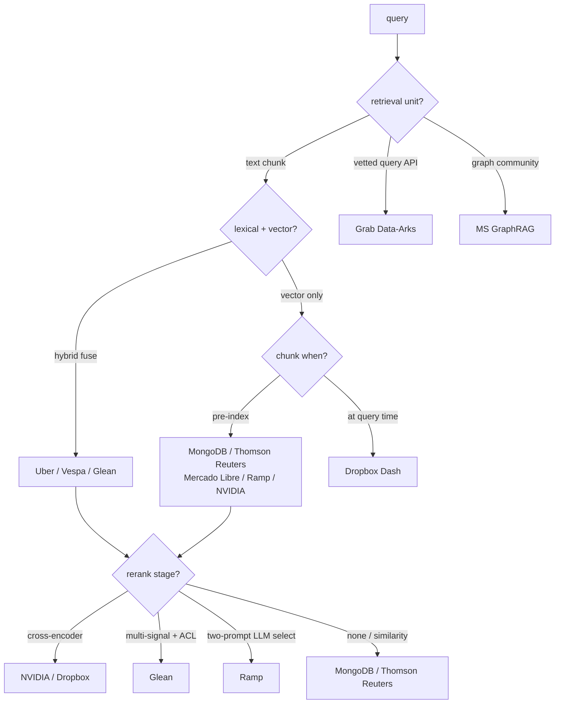

**The choices, side by side.**

| Decision | Options (who) | What decides it |
| --- | --- | --- |
| Retrieval strategy | vector-only (MongoDB, Thomson Reuters, Mercado Libre, Ramp, NVIDIA); hybrid vec+BM25 (Uber, Vespa, Glean, Dropbox); query-API RAG (Grab); knowledge graph (MS, Glean) | whether exact terms and jargon matter, and if the corpus is docs, queries, or entities |
| Chunking and freshness | pre-index chunks (MongoDB, Thomson Reuters, Mercado Libre, Ramp); query-time chunk (Dropbox); sync + webhooks (Dropbox); non-parametric store updated live (Thomson Reuters); LLM-enriched offline (Uber) | index churn vs query latency, and how fast source data changes |
| Reranking | none / similarity-only (MongoDB, Thomson Reuters); cross-encoder (NVIDIA, Dropbox); two-prompt LLM select (Ramp); multi-signal permission-aware (Glean); community summaries (MS) | cost budget per query and how noisy first-stage recall is |
| Grounding and eval | verify-before-use (MongoDB); provenance citations (Thomson Reuters, MS); LLM-as-judge (Uber, Dropbox); accuracy@k tuning (Ramp, Vespa); stakeholder approval (Mercado Libre); source P/R/F1 (Dropbox, Glean) | regulated domains need provenance; open-ended needs a judge; enumerable labels use accuracy@k |

**The math that separates them.**

$$\text{recall@}k = \frac{1}{|Q|}\sum_{q \in Q}\frac{|R_q^{k}\cap G_q|}{|G_q|}$$

$$\text{RRF}(d) = \sum_{r\in\lbrace \text{bm25}, \text{vec}\rbrace }\frac{1}{k_{\text{rrf}} + \text{rank}_r(d)}$$

$$F_1^{\text{source}} = \frac{2 P R}{P+R},\qquad P = \frac{\text{relevant retrieved}}{\text{retrieved}},\quad R = \frac{\text{relevant retrieved}}{\text{relevant}}$$

$$C_{\text{rerank}} \approx \frac{1}{75} C_{\text{gen}} \ \Rightarrow\ \text{keep top-}m \ll n \text{ candidates before generation}$$

$$\text{sim}(q, d) = \frac{\langle e_q, e_d \rangle}{\Vert e_q \Vert \ \Vert e_d \Vert}, \qquad R_q^{k} = \text{top-}k \ \text{by} \ \text{sim}(q, \cdot)$$

$$n_{\text{chunks}} = \left\lceil \frac{L}{s - o} \right\rceil, \qquad T_{\text{prompt}} \approx m \cdot s + T_{\text{query}}$$

$$Q_{\text{e2e}} \ \le \ \text{recall@}k \ \times \ Q_{\text{gen} \mid \text{retrieved}}$$

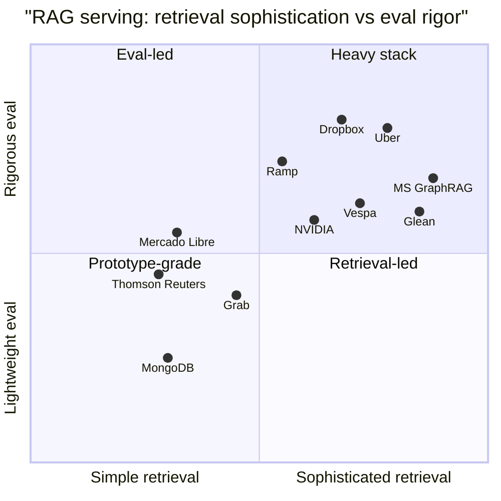

**Interview watch-outs.** The questions that recur across these systems, and the answer that separates a shallow pass from a real one.

- **Retrieval recall is the ceiling, not the generator.** Trap: "recall is low, so we need a stronger LLM." Wrong: swap the generator or turn up its context window and hope. Right: recall@k upper-bounds end-to-end quality ($Q_{\text{e2e}} \le \text{recall@}k \times Q_{\text{gen}}$), so if the right chunk was never retrieved, no generator recovers it. Look at chunking and the embedding model first, and measure retrieval recall separately from answer correctness (Dropbox source F1, NVIDIA two-stage).

- **Chunking is a design decision, not a default.** Trap: "fixed 512-token chunks" stated in one breath. Wrong: split mid-sentence or mid-table, destroying the embedding and the answer. Right: chunk on structure first (headings, paragraphs, code, tables), size-cap second, add overlap so boundary-spanning answers survive, and state the tradeoff: smaller chunks raise precision but need more of them, larger chunks dilute the vector and inflate prompt cost ($T_{\text{prompt}} \approx m \cdot s$). Uber tags table-bearing chunks so the splitter cannot cut a table mid-row.

- **Lost in the middle: more context is not more quality.** Trap: "just stuff the top 50 chunks in, the model will find it." Wrong: a long prompt buries the relevant passage, raises latency and cost, and can lower accuracy. Right: rerank hard and keep a tight top-m; a cross-encoder over the shortlist costs roughly one seventy-fifth of the generator per passage ($C_{\text{rerank}} \approx \tfrac{1}{75} C_{\text{gen}}$), so fewer, higher-precision chunks cut cost and dilution at once (NVIDIA, Dropbox).

- **Grounding and abstention beat confident wrong.** Trap: always answer. Wrong: return a fluent answer even when the top rerank score is weak, inviting hallucination. Right: abstain below a score threshold, instruct the model to cite chunk IDs, and verify each cited chunk actually appears in the assembled prompt before returning. Treat retrieved text as data, not instructions (prompt-injection from a wiki page is a real attack surface).

- **Eval is two evals, wired to a regression gate.** Trap: "we tried some queries and it looked good." Wrong: report one end-to-end accuracy number. Right: build a retrieval eval (recall@k against labeled query-doc pairs) and an answer eval (groundedness and correctness, LLM-as-judge plus a human sample), and gate any change to chunking, embedding, or prompt on both. Open-ended sensemaking needs multi-axis grading (MS GraphRAG: comprehensiveness, diversity, faithfulness), not a single scalar.

- **Access control constrains retrieval, so enforce it inside search.** Trap: filter permissions after retrieval. Wrong: post-filter the top-k, which both leaks and empties results when the visible set is small. Right: push per-user ACLs into the vector search so results come back pre-authorized (Glean permission-aware ranking); the scariest RAG bug is a correct, well-cited answer sourced from a document the asker should never see.

**The systems**

- **Ramp** [From RAG to Richness: How Ramp Revamped Industry Classification](https://builders.ramp.com/post/industry_classification): Embedding-model selection plus two-prompt retrieval over NAICS codes, with precomputed embeddings. *(product design)*
- **Uber** [Enhanced Agentic-RAG: near-human precision for chatbots](https://www.uber.com/blog/enhanced-agentic-rag/): Pre-retrieval query agents, doc loaders, metadata enrichment, and LLM-as-judge eval. *(deployment)*
- **Microsoft Research** [GraphRAG: unlocking LLM discovery on narrative private data](https://www.microsoft.com/en-us/research/blog/graphrag-unlocking-llm-discovery-on-narrative-private-data/): Knowledge-graph retrieval beats vector-only RAG on multi-hop private-data queries. *(product design)*
- **DoorDash** [Path to high-quality LLM-based Dasher support automation](https://careersatdoordash.com/blog/large-language-modules-based-dasher-support-automation/): RAG support bot with an LLM guardrail and judge; 90% fewer hallucinations. *(eval bar)*
- **Dropbox** [Building Dash: how RAG and AI agents meet business needs](https://dropbox.tech/machine-learning/building-dash-rag-multi-step-ai-agents-business-users): Hybrid lexical plus chunking plus rerank retrieval balancing latency, freshness, cost. *(deployment)*
- **Vespa** [Embedding Tradeoffs, Quantified](https://blog.vespa.ai/embedding-tradeoffs-quantified/): INT8 and binary quantization plus hybrid BM25 quality-vs-latency tradeoffs. *(eval bar)*
- **Vespa** [Asymmetric Retrieval: spend on docs, embed queries for free](https://blog.vespa.ai/asymmetric-retrieval-spend-on-docs-queries-for-free/): A big model for docs, a tiny local model for queries, to cut serving cost. *(deployment)*
- **NVIDIA** [How a reranking microservice improves retrieval accuracy and cost](https://developer.nvidia.com/blog/how-using-a-reranking-microservice-can-improve-accuracy-and-costs-of-information-retrieval/): Two-stage embed-then-rerank; fewer chunks to the LLM cuts cost. *(eval bar)*
- **Glean** [Why vector search isn't enough for enterprise RAG](https://www.glean.com/blog/hybrid-vs-rag-vector): Enterprise RAG needs hybrid search plus knowledge graph and permissions. *(product design)*
- **Databricks** [Creating High Quality RAG Applications with Databricks](https://www.databricks.com/blog/building-high-quality-rag-applications-databricks): Real-time serving, model selection and eval, and quality monitoring for RAG. *(deployment)*
- **LinkedIn** [Improving Post Search at LinkedIn](https://www.linkedin.com/blog/engineering/search/improving-post-search-at-linkedin): Layered first and second-pass rankers with separate relevance, quality, freshness models. *(deployment)*
- **Pinterest** [How we built Text-to-SQL at Pinterest](https://medium.com/pinterest-engineering/how-we-built-text-to-sql-at-pinterest-30bad30dabff): RAG table retrieval grounds LLM SQL generation over thousands of warehouse tables. *(product design)*
- **Cloudflare** [Introducing AutoRAG: managed RAG on Cloudflare](https://blog.cloudflare.com/introducing-autorag-on-cloudflare/): A managed pipeline: async indexing, Vectorize storage, query-time retrieval plus generation. *(deployment)*
- **Vimeo** [Unlocking knowledge sharing for videos with RAG](https://medium.com/vimeo-engineering-blog/unlocking-knowledge-sharing-for-videos-with-rag-810ab496ae59): Video Q&A over transcript chunking, multi-size context windows, and vector retrieval. *(product design)*
- **Elastic** [RAG pipelines in production](https://www.elastic.co/search-labs/blog/rag-in-production): Operationalizing RAG with hybrid retrieval, reranking, monitoring, and benchmarking. *(deployment)*
- **Anyscale** [Building RAG-based LLM Applications for Production](https://www.anyscale.com/blog/a-comprehensive-guide-for-building-rag-based-llm-applications-part-1): End-to-end RAG built, evaluated, and served at scale with Ray Serve. *(deployment)*
- **GitHub** [What is retrieval-augmented generation?](https://github.blog/ai-and-ml/generative-ai/what-is-retrieval-augmented-generation-and-what-does-it-do-for-generative-ai/): How Copilot Enterprise grounds answers via internal code search and semantic retrieval. *(product design)*
- **Google / ETH Zurich** [RAGO: systematic performance optimization for RAG serving](https://arxiv.org/abs/2503.14649): A serving framework raising QPS per chip 2x and cutting time-to-first-token 55%. *(deployment)*
- **MongoDB** [Taking RAG to Production with the MongoDB Documentation AI Chatbot](https://www.mongodb.com/developer/products/atlas/taking-rag-to-production-documentation-ai-chatbot/): Atlas Vector Search docs chatbot, chunking and embedding-model choices, moved from prototype to production. *(deployment)*
- **Grab** [Leveraging RAG-powered LLMs for Analytical Tasks](https://engineering.grab.com/transforming-the-analytics-landscape-with-RAG-powered-LLM): Data-Arks middleware retrieves context to ground report-generation and fraud-investigation bots for analysts. *(product design)*
- **Mercado Libre** [Beyond the Hype: Real-World Lessons from Working with Large Language Models](https://medium.com/mercadolibre-tech/beyond-the-hype-real-world-lessons-and-insights-from-working-with-large-language-models-6d637e39f8f8): RAG over technical docs plus table-doc generation and structured extraction; raw LLMs need context and iteration. *(eval bar)*
- **Thomson Reuters** [Better Customer Support Using Retrieval-Augmented Generation (RAG) at Thomson Reuters](https://medium.com/tr-labs-ml-engineering-blog/better-customer-support-using-retrieval-augmented-generation-rag-at-thomson-reuters-4d140a6044c3): RAG over domain knowledge to ground customer-support answers in a regulated domain. *(deployment)*

---

### [Semantic search and embeddings](topics/08-semantic-search-and-embeddings.md) · 21 systems

**What they share.** Every system runs the same skeleton: offline, embed the corpus and build an ANN index; online, embed the query, retrieve approximate neighbors, and rescore a shortlist at higher precision. The divergence is not the spine but four knobs: which ANN structure, how hard vectors are compressed, whether a lexical channel runs alongside, and how heavy the final rerank is.

**The reference pipeline.** The spine every writeup here instantiates: encode once offline into an index, then at query time embed, retrieve approximate neighbors, optionally fuse a lexical channel, and rescore the shortlist at full precision. Compression lives at the index build; the rescore exists precisely because compressed first-phase scores are approximate.

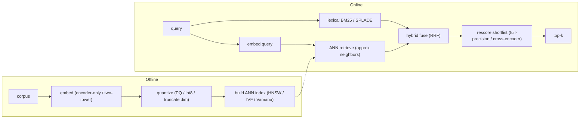

**The choices, side by side.**

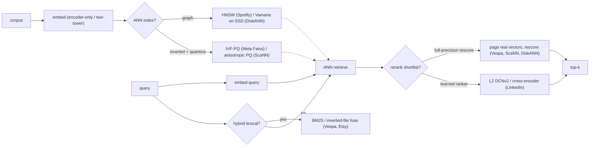

**The choices, in a table.**

| Decision | Options (who) | What decides it |
| --- | --- | --- |
| ANN index | `HNSW` (Spotify) vs `IVF-PQ` (Meta) vs `ScaNN` anisotropic (Google) vs `Vamana`/`DiskANN` (Microsoft) vs `HNSW-IF` (Vespa) | Does the corpus fit in RAM? Graph if yes; inverted-file plus SSD if billion-scale on a budget |
| quantization | `E4M3 8-bit float` (Spotify) vs `int8` (Vespa) vs `PQ 20-byte codes` (Meta) vs `anisotropic learned PQ` (Google) vs `4-bit PQ` (Etsy) vs `8-bit custom scaling` (Dropbox) | RAM budget per vector; MIPS ranking wants parallel-error penalty, not uniform reconstruction |
| hybrid/rerank | dense-only (Spotify) vs `HNSW + BM25/inverted-file` (Vespa, Etsy, Walmart) vs `SPLADE` sparse-neural (Faire); rescore: full-precision (Vespa depth 4000, ScaNN, DiskANN) vs learned `DCNv2` (LinkedIn) | Do exact-term / rare-token queries matter? Compressed first-phase scores are approximate, so rescore recovers precision |
| dimensionality | `fixed full dim` (Dropbox, to bound cosine error) vs `Matryoshka` nested (LinkedIn: 2048 retrieve, 4096 rank) vs multi-embedding fan-out (Pinterest, Instacart) | Dim sets index RAM and search time linearly; Matryoshka serves both stages from one training run |

**The math that separates them.**

$$\textbf{index memory (uncompressed)} = n_{vectors} \times dim \times bytes_{per\ elem}$$

$$\textbf{PQ code size (bytes/vector)} = m \times \lceil b/8 \rceil, \quad m\ \text{subspaces},\ b\ \text{bits/code}$$

$$\textbf{PQ compression ratio} = \frac{dim \times 4}{m \times \lceil b/8 \rceil}, \quad \text{vs float32 baseline}$$

$$\textbf{ScaNN anisotropic loss} = \eta \lVert r_{\parallel} \rVert^{2} + \lVert r_{\perp} \rVert^{2}, \quad r = x - \tilde{x},\ \eta > 1$$

$$\textbf{recall vs latency (graph)} = f(ef,\ M) \uparrow \ \Rightarrow\ recall \uparrow,\ latency \uparrow$$

$$\textbf{IVF probe cost} \approx nprobe \times \frac{n_{vectors}}{n_{lists}} \times cost_{per\ code}, \quad nprobe \uparrow \Rightarrow recall \uparrow,\ latency \uparrow$$

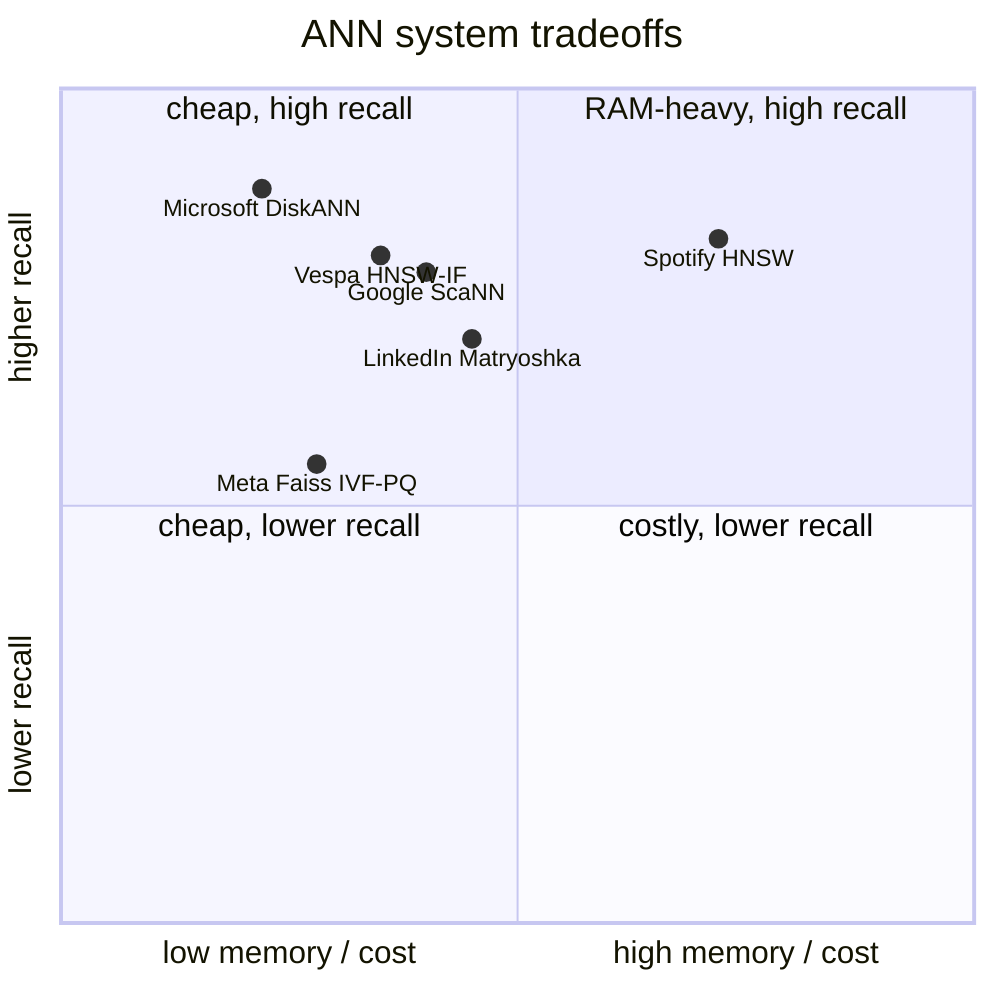

**Interview watch-outs.**

- **Pick the index for the memory regime, not by reputation.** `HNSW` is best recall-at-latency but stores the graph plus full vectors in RAM, so it fits when the corpus fits. `IVF-PQ` clusters then compresses, trading recall for a large RAM cut at billion scale. `ScaNN` wins CPU-bound recall-vs-QPS by tuning quantization to the inner-product ranking goal. `DiskANN` (Vamana on SSD) holds a billion vectors on one box by routing with DRAM-resident codes and hitting SSD only for final candidates. Naming the four and their regimes is the senior signal.
- **Quantization costs recall, so always name the rescore.** PQ, int8, and 4-bit codes make first-phase scores approximate; the fix is a full-precision (or cross-encoder) rescore over the top few hundred. Claiming compression is free is the classic miss.
- **Hybrid is the expected unprompted answer.** Pure dense misses exact matches (SKUs, error codes, rare tokens); fuse a lexical channel (BM25 or SPLADE) with reciprocal rank fusion. Hybrid reliably beats either alone.
- **MIPS is not Euclidean nearest neighbor.** For two-tower inner-product search, minimizing average reconstruction error is the wrong objective; ScaNN penalizes error parallel to the vector to preserve the high inner products that decide ranking. Reusing a Euclidean-tuned quantizer for MIPS quietly loses recall.
- **Matryoshka serves two stages from one model.** Nested embeddings let a 2048-dim prefix drive cheap ANN retrieval and the full 4096-dim vector feed the ranker, no separate models to train or keep aligned. Truncating dimension is a recall-vs-cost knob without re-embedding.
- **Model upgrades are a full re-index, not a mix.** Change the embedding model and every vector must be re-embedded; old and new vectors cannot share one space. Multi-version embedders multiply storage linearly, so a swap is a storage-and-cost event. Build the new index alongside, dual-read, then cut over.

**The systems**

- **Spotify** [Introducing Voyager: Spotify new nearest-neighbor search library](https://engineering.atspotify.com/2023/10/introducing-voyager-spotifys-new-nearest-neighbor-search-library): HNSW ANN library: recall versus speed versus memory tradeoffs, 8-bit compression. *(deployment)*
- **Vespa** [Billion-scale vector search using hybrid HNSW-IF](https://blog.vespa.ai/vespa-hybrid-billion-scale-vector-search/): In-memory HNSW plus disk-backed inverted files for 90% recall under 50ms, cheaply. *(deployment)*
- **LinkedIn** [Semantic Search for AI Agents at Scale](https://www.linkedin.com/blog/engineering/ai/semantic-search-for-ai-agents-at-scale-retrieval-and-ranking-for-linkedins-hiring-assistant): Two-stage ANN retrieval plus ranker over 1B+ profiles using Matryoshka embeddings. *(deployment)*
- **Pinterest** [Advancements in Embedding-Based Retrieval at Pinterest Homefeed](https://medium.com/pinterest-engineering/advancements-in-embedding-based-retrieval-at-pinterest-homefeed-d7d7971a409e): Two-tower embedding retrieval with multi-embedding ANN and interest filters. *(deployment)*
- **Meta** [Faiss: a library for efficient similarity search](https://engineering.fb.com/2017/03/29/data-infrastructure/faiss-a-library-for-efficient-similarity-search/): A GPU-accelerated billion-scale similarity search library powering retrieval. *(deployment)*
- **Google Research** [Announcing ScaNN: efficient vector similarity search](https://research.google/blog/announcing-scann-efficient-vector-similarity-search/): Anisotropic quantization wins recall-vs-QPS on ann-benchmarks. *(eval bar)*
- **Microsoft Research** [DiskANN: vector search for all](https://www.microsoft.com/en-us/research/project/project-akupara-approximate-nearest-neighbor-search-for-large-scale-semantic-search/): SSD-backed ANN: billion vectors, 95% recall, about 5ms latency. *(deployment)*
- **Meta** [Embedding-based Retrieval in Facebook Search](https://arxiv.org/abs/2006.11632): A unified embedding framework for personalized social search. *(product design)*
- **Instacart** [How Instacart uses embeddings to improve search relevance](https://company.instacart.com/how-its-made/how-instacart-uses-embeddings-to-improve-search-relevance): A two-tower items model served via FAISS ANN with daily indices. *(deployment)*
- **Etsy** [Unified Embedding Based Personalized Retrieval in Etsy Search](https://arxiv.org/abs/2306.04833): Graph, transformer, and term embeddings with HNSW and 4-bit PQ. *(product design)*
- **Airbnb** [Applying Embedding-Based Retrieval to Airbnb Search](https://arxiv.org/abs/2601.06873): EBR for a two-sided marketplace, A/B-tested booking gains. *(who it serves)*
- **Uber Eats** [Scaling Multilingual Semantic Search in Uber Eats](https://arxiv.org/abs/2603.06586): Multilingual retrieval across stores, dishes, grocery in six markets. *(deployment)*
- **Walmart** [Semantic Retrieval at Walmart](https://arxiv.org/abs/2412.04637): Hybrid inverted-index plus neural retrieval for tail product queries. *(product design)*
- **Dropbox** [Selecting a model for semantic search at Dropbox scale](https://dropbox.tech/machine-learning/selecting-model-semantic-search-dropbox-ai): Benchmarking 11 embedding models on MTEB to pick multilingual-e5-large for retrieval. *(eval bar)*
- **GitHub** [Inside Copilot's new code embedding model](https://github.blog/news-insights/product-news/copilot-new-embedding-model-vs-code/): A custom code embedding model lifting Copilot retrieval quality 37.6% at lower latency. *(eval bar)*
- **Faire** [Beyond BM25 and dense embeddings: smart, interpretable retrieval](https://craft.faire.com/beyond-bm25-and-dense-embeddings-841a7b18ce27): SPLADE sparse neural retrieval giving interpretable semantics over Elasticsearch. *(product design)*
- **Snap** [Embedding-based Retrieval with Two-Tower Models in Spotlight](https://eng.snap.com/embedding-based-retrieval): Two-tower user/video embeddings for real-time short-form recommendation retrieval. *(deployment)*
- **Yelp** [Yelp Content As Embeddings](https://engineeringblog.yelp.com/2023/04/yelp-content-as-embeddings.html): Shared low-dimensional embeddings of reviews, businesses, and photos as a ranking baseline. *(deployment)*
- **Stack Overflow** [Vector databases in generative AI applications](https://stackoverflow.blog/2023/10/09/from-prototype-to-production-vector-databases-in-generative-ai-applications/): A self-hosted Weaviate vector database on Azure for production semantic search. *(deployment)*
- **Mercari** [Domain-Aware Text Embeddings for C2C Marketplaces](https://arxiv.org/abs/2512.21021): Domain-aware text embeddings improving search for Japan's largest C2C marketplace. *(product design)*
- **Amazon** [Semantic Product Search](https://arxiv.org/abs/1907.00937): A KDD 2019 two-tower model with kNN retrieval over precomputed catalog embeddings. *(product design)*

---

### [Long-context and the KV cache](topics/02-long-context-and-kv-cache.md) · 20 systems

**What they share.** Every system runs one two-phase loop: prefill builds a KV cache once, then decode reuses that cache one token at a time, memory-bandwidth bound. All the divergence is in how each entry is shrunk, reused, or dropped against the same `kv_bytes` formula.

**The reference pipeline.** Prefill is compute-bound: it processes the whole prompt in parallel and fills the cache in one pass, setting first-token latency. Decode is memory-bandwidth-bound: each step reads the entire model plus the whole cache to emit one token, then appends one K and one V entry, so the cache grows by one slot per step and inter-token latency tracks cache size.

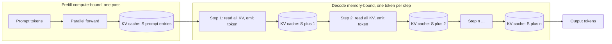

**How they diverge.**

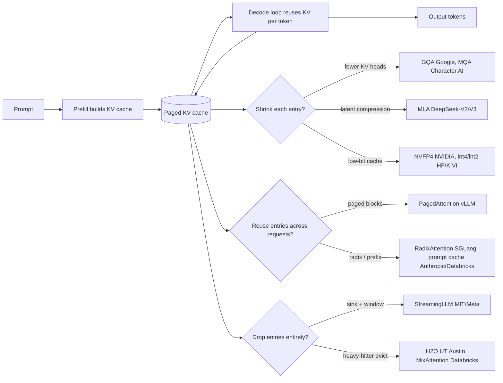

**The choices, side by side.**

| Decision | Options (who) | What decides it |
| --- | --- | --- |
| attention KV sharing | `MHA` (baseline) vs `GQA` (Google, Llama-3) vs `MLA` (DeepSeek) vs `MQA` (Character.AI) | how much of the `kv_heads` term you cut vs quality floor; MLA is train-time, GQA converts cheaply, MQA is most aggressive |
| memory management | `paged` (vLLM) vs `radix/prefix cache` (SGLang, Anthropic, Databricks) vs `eviction` (StreamingLLM, H2O) | reuse across requests when prefixes repeat; drop when the middle is expendable; page when fragmentation is the wall |
| quantization | `NVFP4 4-bit` (NVIDIA) vs `int8 native` (Character.AI) vs `int4/int2 per-token` (HF, KIVI) | memory headroom vs eval-gated quality; native-int8 needs custom kernels, PTQ needs per-channel scales |
| cross-layer / window sharing | `sliding window` (Databricks MixAttention, Character.AI 5-of-6) vs `cross-layer KV reuse` (Character.AI 2-3x, MA-Pairs) vs `full attention` (MHA) | long-range recall vs cache size; keep full-attention layers deep, cap sharing or reading-comprehension regresses |

**The math that separates them.**

**KV cache bytes (the term everyone attacks):**
$$ \mathrm{kv\_bytes} \approx 2 \cdot L \cdot S \cdot h_{kv} \cdot d_{head} \cdot b \cdot B $$
where `L` is layers, `S` is sequence length, `h_kv` is KV heads, `d_head` is head dim, `b` is bytes per element, `B` is batch. Worked example: `L=32`, `S=100000`, `h_kv=8`, `d_head=128`, `b=2` (FP16), `B=1` gives about `2 x 32 x 100000 x 8 x 128 x 2 = 13.1` GB for a single 100k-token sequence, which is why long context, not weights, fills the GPU.

**GQA sharing ratio (32 query, 8 KV heads):**
$$ r_{GQA} = \frac{h_{kv}}{h_{q}} = \frac{8}{32} = \frac{1}{4} $$
so the cache drops to one quarter of MHA; the group size `h_q / h_kv = 4` is the direct quality-versus-memory dial.

**MLA latent compression (cache `d_c`, not K and V):**
$$ r_{MLA} = \frac{d_{c}}{2 \cdot h_{kv} \cdot d_{head}} \approx 0.07 \quad (\text{about } 93\% \text{ smaller}) $$

**Low-bit KV vs FP8 (NVFP4 halves memory):**
$$ r_{quant} = \frac{b_{lo}}{b_{hi}} = \frac{4}{8} = \frac{1}{2} \Rightarrow 2\times \text{ context, batch, concurrency} $$

**Decode arithmetic intensity (why decode is memory-bound):**
$$ I_{decode} = \frac{\mathrm{FLOPs}}{\mathrm{bytes\ read}} \approx \frac{2 \cdot N_{active}}{2 \cdot N_{active} + \mathrm{kv\_bytes}} \ll I_{roofline} $$
Per decode step you read every active weight (`N_active` params) and the whole KV cache but do only about `2` FLOPs per byte read, far below the hundreds of FLOPs per byte a modern GPU needs to be compute-bound. Prefill amortizes the same weight read across `S` tokens at once, so its intensity is roughly `S` times higher and it lands compute-bound. That gap is the entire reason KV-cache size, not raw compute, sets decode cost.

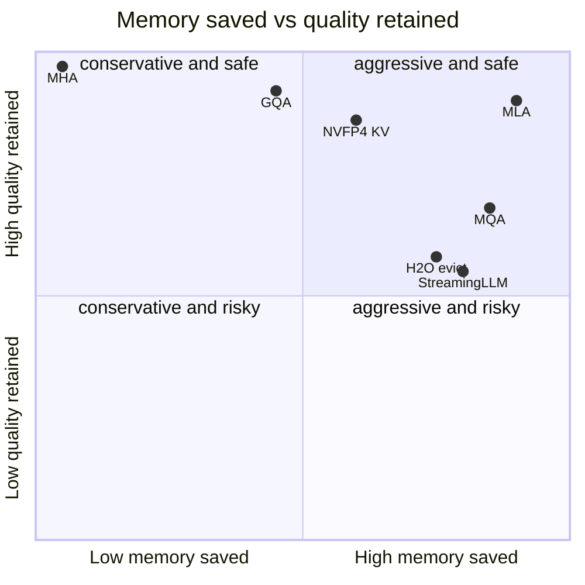

**Interview watch-outs.**

- **Decode is memory-bound, prefill is compute-bound.** Say this explicitly and back it with the arithmetic-intensity ratio above: decode reads the whole model plus cache to emit one token (about 2 FLOPs per byte), prefill amortizes that read across the whole prompt. The fix you pick depends on which phase is the wall, so profile prefill versus decode before optimizing.
- **KV cache, not weights, dominates long context.** Plug real numbers into `kv_bytes`; a single 100k-token sequence can cost more than 10 GB. Interviewers want to see you reach for `h_kv`, `d_head`, and `b` (GQA, MLA, quantization) rather than shrinking the model.
- **Paged attention raises concurrency, not single-request latency.** PagedAttention kills fragmentation so more sequences pack into HBM; it buys aggregate tokens per second, and the win only materializes when there are queued requests to fill the freed memory. Do not claim it speeds one request.
- **Quantization tradeoffs are eval-gated, and format and target matter.** NVFP4 halves memory versus FP8 and dequantizes to FP8 before the attention math to hold accuracy; low-bit formats differ (NVFP4 beats MXFP4 by finer block scaling), keys are often more sensitive than values, and low-bit schemes keep a full-precision recent window. Never ship 4-bit KV on vibes; gate on your own long-context eval.
- **Prefix and prompt caching skip prefill, so they help long-prompt short-output shapes.** Exact-prefix matching means one differing early token misses the whole cache, so put the stable system prompt and shared docs first; multi-tenant caches must be isolated and are volatile, so hit rate is workload-dependent (a 30% hit can still yield large throughput gains).
- **Eviction and windowing trade recall for a fixed budget.** StreamingLLM sinks plus a sliding window stream to millions of tokens but genuinely lose the middle; H2O keeps recent plus heavy-hitters; MixAttention needs full-attention layers placed deep. All of these can regress on reading comprehension and retrieval, so validate on those tasks, not just commonsense.

**The systems**

- **vLLM (UC Berkeley)** [Efficient Memory Management for LLM Serving with PagedAttention](https://arxiv.org/abs/2309.06180): OS-style KV-cache paging cuts fragmentation, boosting throughput 2x to 4x. *(deployment)*
- **Character.AI** [Optimizing AI Inference at Character.AI](https://blog.character.ai/optimizing-ai-inference-at-character-ai-2/): MQA, hybrid local/global attention, and cross-layer KV-sharing cut cost 33x. *(deployment)*
- **DeepSeek** [DeepSeek-V2: a strong, economical, efficient MoE language model](https://arxiv.org/abs/2405.04434): Multi-head Latent Attention compresses the KV cache into a latent vector, shrinking it 93%. *(product design)*
- **Google Research** [GQA: Training Generalized Multi-Query Transformer Models](https://arxiv.org/abs/2305.13245): Grouped-query attention trades KV heads for speed at near-MHA quality. *(product design)*
- **NVIDIA** [5x faster time to first token with TensorRT-LLM KV cache early reuse](https://developer.nvidia.com/blog/5x-faster-time-to-first-token-with-nvidia-tensorrt-llm-kv-cache-early-reuse/): Early KV reuse, flexible block sizing, and smart eviction cut TTFT. *(deployment)*
- **NVIDIA** [Optimizing inference with NVFP4 KV cache](https://developer.nvidia.com/blog/optimizing-inference-for-long-context-and-large-batch-sizes-with-nvfp4-kv-cache/): 4-bit KV cache halves memory vs FP8, doubling context with under 1% loss. *(deployment)*
- **Databricks** [Inference-Friendly Models with MixAttention](https://www.databricks.com/blog/mixattention): Cross-layer KV sharing plus sliding-window attention shrinks the cache. *(product design)*
- **Databricks** [Accelerating LLM inference with prompt caching](https://www.databricks.com/blog/accelerating-llm-inference-prompt-caching-open-source-models-databricks): Automatic prefix KV reuse: 2.5x throughput, 3x lower P50 latency. *(deployment)*
- **llm-d** [KV-Cache wins you can see: prefix caching to distributed scheduling](https://llm-d.ai/blog/kvcache-wins-you-can-see): Single-instance prefix caching breaks in clusters; cache-aware scheduling fixes it. *(deployment)*
- **LMSYS / SGLang** [Fast and expressive LLM inference with RadixAttention](https://www.lmsys.org/blog/2024-01-17-sglang/): A radix-tree KV cache enables automatic cross-request prefix reuse. *(deployment)*
- **Together AI** [Serving MiniMax-M3: 1M-token context without regrets](https://www.together.ai/blog/serving-minimax-m3-for-efficient-inference-unlocking-1m-token-context-and-multimodality-without-regrets): Paged sparse attention and KV-block-major kernels make 1M-token serving practical. *(deployment)*
- **Hugging Face** [Unlocking longer generation with KV cache quantization](https://huggingface.co/blog/kv-cache-quantization): Per-token int4 KV quantization yields about 2.5x memory savings. *(product design)*
- **KIVI** [A tuning-free asymmetric 2-bit quantization for KV cache](https://arxiv.org/abs/2402.02750): Per-channel keys and per-token values enable 2-bit KV compression. *(product design)*
- **MIT / Meta** [Efficient Streaming Language Models with Attention Sinks](https://arxiv.org/abs/2309.17453): The attention-sink insight lets fixed-window LLMs stream to millions of tokens. *(product design)*
- **Anthropic** [Prompt caching with Claude](https://claude.com/blog/prompt-caching): Caches reused context across API calls, cutting cost up to 90% and latency 85%. *(product design)*
- **Colfax / Together** [FlashAttention-3: fast, accurate attention with asynchrony and low precision](https://arxiv.org/abs/2407.08608): Hopper-optimized attention via warp-specialization and FP8, 1.5-2x faster. *(deployment)*
- **UT Austin / Stanford** [H2O: Heavy-Hitter Oracle for efficient generative inference](https://arxiv.org/abs/2306.14048): KV-cache eviction keeping recent plus heavy-hitter tokens, up to 29x throughput. *(deployment)*
- **UIUC / Cohere** [SnapKV: LLM knows what you are looking for before generation](https://arxiv.org/abs/2404.14469): Fine-tuning-free KV compression via observation-window clustering, 3.6x faster decode. *(product design)*
- **Fireworks AI** [FireAttention V2: long contexts practical for online inference](https://fireworks.ai/blog/fireattention-v2-long-context-inference): Production long-context kernels with FP8 prefill and multi-host deployment. *(deployment)*
- **Microsoft** [MInference 1.0: accelerating pre-filling via dynamic sparse attention](https://arxiv.org/abs/2407.02490): Dynamic sparse attention cuts long-context prefill latency up to 10x. *(deployment)*

---

### [Inference serving at scale](topics/04-inference-serving-at-scale.md) · 16 systems

**What they share.** Every stack lands a request on a router, feeds a continuous (iteration-level) batching scheduler that reshapes the batch each token step, runs prefill then memory-bandwidth-bound decode, and streams tokens back while an SLO-driven autoscaler adds or drops replicas. What differs is only which stage each team pushed hardest.

**The reference pipeline.** Strip the branding and every system is the same skeleton: a request lands on a router, joins a continuous-batching scheduler that reshapes the batch every token step, runs a compute-bound prefill that fills the KV cache, then loops the bandwidth-bound decode that reads weights plus the growing KV cache once per token, and streams tokens out. The KV cache is the shared spine every optimization touches (paging, sharing, quantizing, offloading, or handing it off between disaggregated pools).

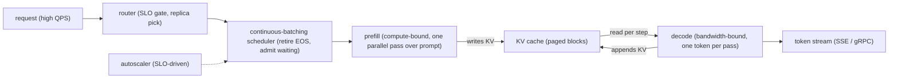

**The divergence.** Same skeleton, but each team pushed one stage hardest. This is where the systems split.

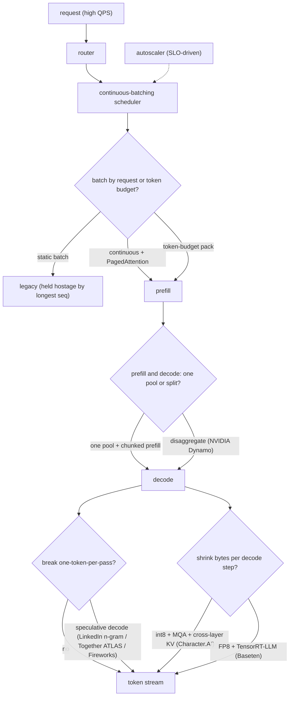

**The choices, side by side.**

| Decision | Options (who) | What decides it |
| --- | --- | --- |
| batching | `continuous` + PagedAttention (vLLM/Anyscale) vs `static` vs `token-budget pack` (Baseten BEI) | Output-length variance: high variance rewards iteration-level scheduling; variable prompt length rewards packing to a token budget over a request count |
| latency lever | `speculative decoding` (LinkedIn n-gram, Together ATLAS, Fireworks) vs `disaggregated prefill/decode` (NVIDIA Dynamo) | Draft acceptance rate vs whether prefill and decode SLOs genuinely conflict; disaggregation needs fast interconnect for the KV handoff |
| parallelism | TP (in-node, per-layer all-reduce) vs PP (across nodes, stage boundaries) vs EP (MoE expert sharding) | TP for latency and to fit the model on fast links; PP to scale past a node; EP once experts outnumber a GPU |
| quantization | `int8` weight + KV (Character.AI) vs `FP8` on H100 (Baseten, Modal) vs `4-bit` for fit / cold-start | Decode is bandwidth-bound so fewer bytes read = more tokens/s; every precision drop passes a quality eval (Baseten holds cosine similarity over 99%) |

**The math that separates them.**

$$\textbf{arithmetic intensity} = \frac{\text{FLOPs performed}}{\text{bytes moved from HBM}}$$

$$\textbf{roofline tokens/s} = \min\!\left(\frac{\text{peak FLOPs}}{\text{FLOPs per token}},\ \frac{\text{HBM bandwidth}}{\text{bytes read per token}}\right)$$

Prefill has high arithmetic intensity (one parallel pass over many prompt tokens amortizes the weight read) so it sits on the compute side of the roofline. Decode has intensity near 1 (it reads the whole model to emit a single token) so it sits on the bandwidth side. That single fact drives every lever below.

$$\textbf{decode step time} \approx \frac{P \cdot b_w + N \cdot \text{KV}_{\text{bytes}}}{\text{HBM bandwidth}} \qquad \text{tokens/s} = \frac{1}{\text{decode step time}}$$

$$\textbf{weight-read floor} = \frac{P \cdot b_w}{\text{HBM bandwidth}} \quad \text{(per step, paid even at batch size 1)}$$

$$\textbf{KV-cache bytes per token} = 2 \cdot L \cdot n_{kv} \cdot d_{head} \cdot b_{kv}$$

$$\textbf{expected tokens per target pass} = \frac{1 - \alpha^{k+1}}{1 - \alpha}$$

$$\textbf{speculative speedup} = \frac{1 - \alpha^{k+1}}{(1 - \alpha)\,(1 + c\,k)}$$

where $P$ = weight params, $b_w$ = weight bytes/param, $N$ = batched sequences, $L$ = layers, $n_{kv}$ = KV heads (MQA drives to 1), $d_{head}$ = head dim, $b_{kv}$ = KV bytes/element, $\alpha$ = draft acceptance rate, $k$ = draft length, $c$ = per-token verify overhead as a fraction of a target step. The weight-read floor is why batching helps: it is amortized across all $N$ sequences in the batch, so throughput climbs with batch size until the KV term or compute catches up. Speculative speedup goes net-negative when $\alpha$ is low enough that $(1 + c\,k)$ outweighs the tokens gained (Fireworks measured a generic draft at $\alpha \approx 0.29$ slowing inference $1.5\times$).

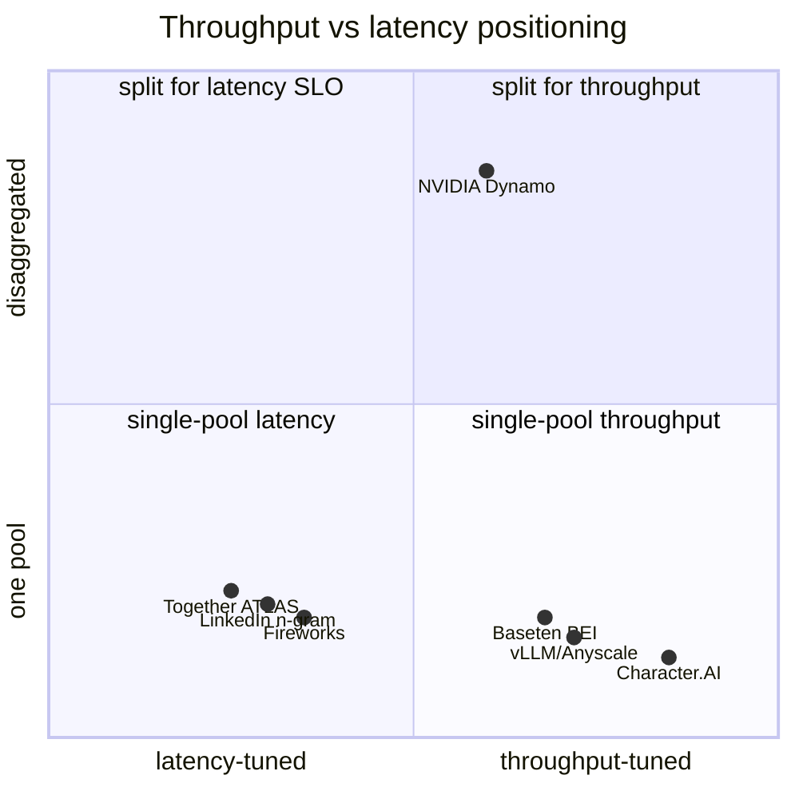

**Interview watch-outs.**

- **Throughput and latency are one knob, not two.** Tokens/sec/GPU is the cost metric; p99 TTFT and p99 TPOT are the SLO metrics, and bigger batches trade the second for the first. Say which one the question optimizes before you reach for a lever, and quote goodput (requests that met SLO) rather than raw throughput when there is a latency ceiling.
- **Continuous batching is the scheduling win, PagedAttention is the memory win.** Do not fold them into one "23x" claim: iteration-level scheduling gets roughly 8x by retiring finished sequences and admitting waiting ones every token step; PagedAttention adds the non-contiguous KV blocks that cut memory waste below 4%. Against optimized static batching the honest number is closer to 5-6x.
- **Speculative decoding is a latency optimization, never a quality trade.** Correct rejection-sampling verification reproduces the target distribution exactly, so the win is entirely in the acceptance rate. It shines at low-to-moderate batch and can go net-negative at high batch (the GPU is already saturated, so verify overhead outweighs saved steps) or on novel text where drafts miss. Break-even is roughly where accepted tokens exceed $(1 + c\,k)$.
- **Disaggregate only when prefill and decode SLOs genuinely conflict.** Splitting the pools lets each phase pick its own parallelism (prefill low TP and compute-bound, decode high TP and bandwidth-bound) and stops prefill bursts from spiking TPOT, but it moves the KV cache between machines. Name the handoff cost: without NVLink or a fast fabric it becomes the new bottleneck. For one small model at moderate QPS, a single pool with chunked prefill is simpler and usually enough.
- **Quantization pays because decode is bandwidth-bound, not because it is "smaller."** Fewer weight bytes read per step is directly more tokens/s, and KV quantization additionally raises the batch size continuous batching can sustain. Every precision drop goes behind a quality eval before it ships (Baseten gates FP8 at cosine similarity over 99%), never on assumption.
- **Under overload, shed load rather than admit everything.** Reserve KV-cache budget per admitted sequence so a new admission cannot OOM the running ones, and return a 429-style signal with a retry hint so the tail stays bounded. Trying to serve every request is how p99 explodes for everyone; controlled rejection protects the ones already admitted.

**The systems**

- **Anyscale** [How continuous batching enables 23x throughput in LLM inference](https://www.anyscale.com/blog/continuous-batching-llm-inference): Iteration-level scheduling plus PagedAttention beat static batching up to 23x. *(deployment)*
- **Character.AI** [Optimizing AI Inference at Character.AI](https://blog.character.ai/optimizing-ai-inference-at-character-ai/): MQA, cross-layer KV sharing, and int8 quant cut serving cost 13.5x. *(deployment)*
- **LinkedIn** [Accelerating LLM inference with speculative decoding](https://www.linkedin.com/blog/engineering/ai/accelerating-llm-inference-with-speculative-decoding-lessons-from-linkedins-hiring-assistant): N-gram speculative decoding gave 4x throughput and 66% lower P90 latency. *(eval bar)*
- **Baseten** [How we built BEI: high-throughput embedding, reranker, classifier inference](https://www.baseten.co/blog/how-we-built-bei-high-throughput-embedding-inference/): Batching, backpressure, FP8, and TensorRT-LLM for 2x higher-throughput serving. *(deployment)*
- **NVIDIA** [NVIDIA Dynamo: a low-latency distributed inference framework](https://developer.nvidia.com/blog/introducing-nvidia-dynamo-a-low-latency-distributed-inference-framework-for-scaling-reasoning-ai-models/): Disaggregated serving with prefill and decode separation and routing. *(deployment)*
- **Together AI** [ATLAS: runtime-learning speculative decoding](https://www.together.ai/blog/adaptive-learning-speculator-system-atlas): Speculative decoding that adapts to live traffic for large speedups. *(product design)*
- **Fireworks AI** [FireOptimizer: customizing latency and quality](https://fireworks.ai/blog/fireoptimizer): Adaptive speculative decoding and per-workload config tuning. *(product design)*
- **Modal** [High-performance LLM inference](https://modal.com/docs/guide/high-performance-llm-inference): Engine choice, quantization, CUDA graphs, and snapshots for throughput. *(deployment)*
- **Databricks** [LLM inference performance engineering: best practices](https://www.databricks.com/blog/llm-inference-performance-engineering-best-practices): Prefill and decode, batching, hardware selection, and latency metrics. *(eval bar)*
- **Google** [Fast inference from transformers via speculative decoding](https://arxiv.org/abs/2211.17192): Draft-then-verify decoding: 2-3x speedup with identical outputs. *(product design)*
- **Baseten** [The Baseten inference stack](https://www.baseten.co/resources/guide/the-baseten-inference-stack/): Multi-cloud autoscaling, routing, custom kernels, and speculation. *(deployment)*
- **Moonshot AI** [Mooncake: a KVCache-centric disaggregated architecture](https://arxiv.org/abs/2407.00079): Kimi's prefill/decode-disaggregated serving with a pooled CPU/DRAM/SSD KV cache. *(deployment)*
- **Microsoft** [Splitwise: efficient generative LLM inference using phase splitting](https://arxiv.org/abs/2311.18677): Splits prefill and decode onto separate machines for cost and throughput. *(deployment)*
- **Peking University / UCSD** [DistServe: disaggregating prefill and decoding](https://arxiv.org/abs/2401.09670): Disaggregates prefill and decode across GPUs to optimize goodput under SLOs. *(deployment)*
- **Microsoft Research** [Sarathi-Serve: taming the throughput-latency tradeoff](https://arxiv.org/abs/2403.02310): Chunked-prefills and stall-free scheduling balance throughput against latency. *(deployment)*
- **Snowflake** [Arctic Inference with Shift Parallelism](https://www.snowflake.com/en/blog/engineering/arctic-inference-shift-parallelism/): A vLLM plugin with dynamic shift parallelism adapting to real traffic. *(deployment)*

---

### [Realtime streaming chat](topics/10-realtime-streaming-chat.md) · 17 systems

**What they share.** Every system carries the same spine: an LLM emits tokens, a transport streams them out, the client renders incrementally, and session memory feeds history back into the next turn. The forks are transport, whether the medium is text or voice, and how each fights per-hop latency.

**The reference pipeline.** Text chat and voice differ mostly in what wraps the LLM. Text streams tokens straight over SSE or WebSocket to an incremental renderer. Voice bolts an STT front end and a TTS back end onto the same LLM, with a turn-detection stage deciding when the user has stopped so the model can start. Both loops read from and write back to session memory each turn.

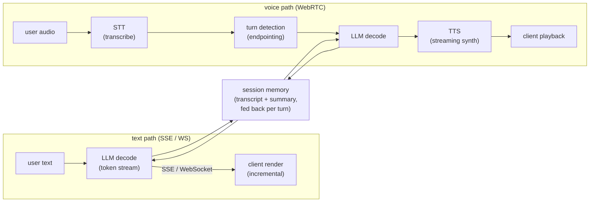

**Where they diverge.**

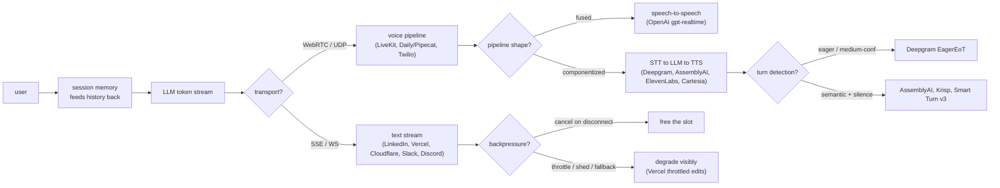

**The choices, side by side.**

| Decision | Options (who) | What decides it |
| --- | --- | --- |
| transport | `SSE` (Vercel/OpenAI text) vs `WebSocket` (Cloudflare DO, Slack, Discord) vs `WebRTC/UDP` (LiveKit, Daily/Pipecat) | Text tolerates ordered TCP; voice cannot, because a 200ms TCP retransmit stalls all buffered audio (head-of-line blocking) |
| pipeline | `text stream` (LinkedIn, Vercel) vs `fused speech-to-speech` (OpenAI gpt-realtime-mini) vs `componentized STT-LLM-TTS` (Deepgram/AssemblyAI/ElevenLabs/Cartesia) | Fused = lowest latency, black-box turn detect, no inspectable transcript; componentized = debuggable, tunable, more hops to add up |
| turn detection | model-side (OpenAI) vs eager medium-confidence (Deepgram) vs semantic+acoustic+silence (AssemblyAI ~300ms, Krisp 6M-weight CPU, Smart Turn v3 12ms CPU) | Silence-only gives awkward pauses; eager cuts latency but misfires on half-utterances; semantic detects true end-of-turn |
| session/memory | shared prompt templates (LinkedIn) vs Durable Object per-connection UUID (Cloudflare) vs Redis/PostgreSQL locks+kv (Vercel) vs stateful channel servers (Slack 500ms, Discord GenServer 5M concurrent) | Sticky routing to the replica holding cached KV; without stickiness every turn is a full-prefill cache miss |
| backpressure/degradation | cancel on disconnect + continuous batching (generic) vs throttled edit-loop fallback (Vercel) vs queue/shed/fall-back-to-smaller-model (generic) | Each stream holds an inference slot for its whole generation, so orphaned streams silently eat capacity |

**The math that separates them.**

$$\textbf{End-to-end text latency:}\quad T_{\text{felt}} = T_{\text{TTFT}} + (N-1)\cdot t_{\text{inter}}$$

where `N` is tokens generated and `t_inter` is the inter-token gap. Users judge `T_TTFT`; the tail rides on the per-token term.

$$\textbf{Inter-token step time:}\quad t_{\text{inter}} = \frac{1}{\text{tok/sec}} = t_{\text{decode}} + t_{\text{transport}}$$

so a stream feels smooth only when the decode step plus one transport hop stays under the human reading rate (roughly 20 to 40 ms per token feels fluid).

$$\textbf{Voice pipeline latency sum:}\quad L_{\text{voice}} = L_{\text{STT}} + L_{\text{turn}} + L_{\text{LLM}} + L_{\text{TTS}} + L_{\text{net}}$$

componentized voice adds every stage, so a 300 ms endpoint plus a 200 ms STT plus a 400 ms first-token plus a 135 ms TTS first-byte already crowds a 1 second conversational budget before network.

$$\textbf{Eager speculation cost tradeoff:}\quad C_{\text{LLM}} = C_{\text{base}}\cdot(1 + p_{\text{resume}}),\quad p_{\text{resume}} \approx 0.5 \text{ to } 0.7$$

$$\textbf{Per-turn prefill grows with history:}\quad T_{\text{prefill}} \propto (1 - h_{\text{cache}})\cdot L_{\text{ctx}}$$

as context `L_ctx` grows each turn, only the prefix-cache hit rate `h_cache` (which needs sticky routing) keeps prefill from climbing with it.

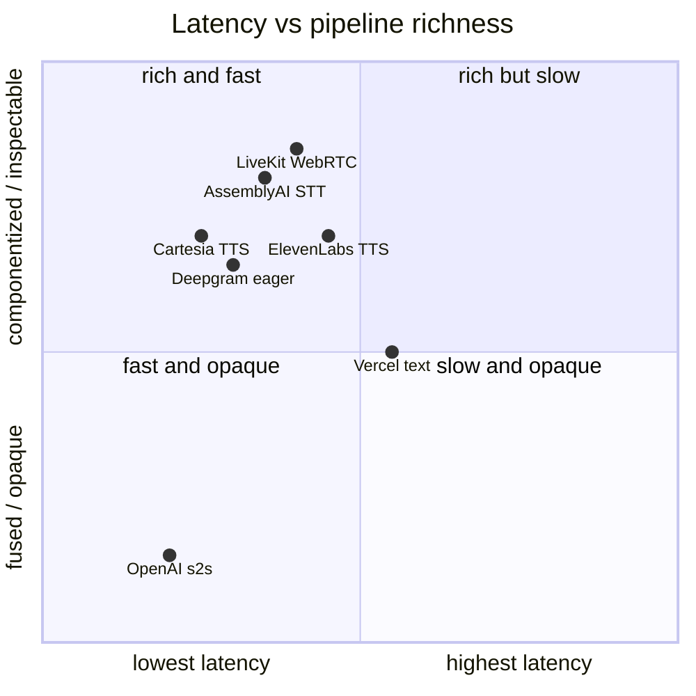

**Interview watch-outs.**

- **Transport: SSE vs WebSocket vs WebRTC.** Default to SSE for text (one-directional tokens over plain HTTP); reach for WebSocket only when you need duplex mid-stream signaling (live interrupts, multiplexed streams, auth via subprotocol); switch to WebRTC/UDP for voice, because ordered TCP stalls all buffered audio on a single lost packet (head-of-line blocking). Naming WebSocket for audio is the classic trap.
- **Session memory and the growing-context bill.** Every turn re-processes the whole transcript in prefill, so turn five costs more than turn one. State where memory lives (stateless client transcript vs server session store), then cut cost with prefix caching plus summarization or truncation. If you claim prefix caching, say the sticky-routing requirement in the same breath.
- **Sticky routing or the cache never hits.** Prefix caching only helps if the follow-up turn lands on the replica holding the cached KV. Route sessions consistently, but keep the cache best-effort so a hot session can still migrate under load.
- **Backpressure and cancellation are capacity, not hygiene.** Each stream pins an inference slot for its whole generation. Propagate user cancel and client disconnect to the engine and free the slot immediately; orphaned streams silently eat GPU. Bound buffering for slow consumers.
- **Voice latency budget.** Componentized STT-LLM-TTS sums every hop, so you cannot spend independently; a conversational feel needs the whole chain under roughly one second. Know each stage's floor (AssemblyAI ~300ms endpoint, Cartesia ~135ms TTS first-byte) and where fused speech-to-speech trades tunability for a shorter sum.
- **Eager end-of-turn trades tokens for latency.** Starting the LLM on a medium-confidence transcript shaves hundreds of ms but throws away 50 to 70 percent more calls when the user resumes, so the LLM (and downstream TTS) call must be genuinely cancelable. Graceful degradation under overload (queue, shed, fall back to a smaller model) should degrade visibly, never hang.

**The systems**

- **LinkedIn** [Musings on building a Generative AI product](https://www.linkedin.com/blog/engineering/generative-ai/musings-on-building-a-generative-ai-product): End-to-end token streaming and progressive parsing to cut perceived latency. *(deployment)*
- **Cloudflare** [Durable Objects for WebSockets and auth in AI Gateway](https://blog.cloudflare.com/do-it-again/): Scaling persistent WebSocket connections for concurrent AI inference streams. *(deployment)*
- **Vercel** [Chat SDK brings agents to your users](https://vercel.com/blog/chat-sdk-brings-agents-to-your-users): Streaming responses cross-platform via native streaming versus a throttled fallback. *(product design)*
- **OpenAI** [Updates for developers building with voice](https://developers.openai.com/blog/updates-audio-models): New audio model snapshots for STT, TTS, and realtime speech-to-speech. *(product design)*
- **LiveKit** [Why WebRTC beats WebSockets for realtime voice AI](https://livekit.com/blog/why-webrtc-beats-websockets-for-voice-ai-agents): WebRTC handles packet loss, jitter, and congestion better than TCP. *(deployment)*
- **LiveKit** [Why you shouldn't build voice agents directly on model APIs](https://livekit.com/blog/real-time-voice-agents-vs-model-apis): Model APIs lack transport, echo cancellation, and turn detection. *(deployment)*
- **Deepgram** [Optimize voice agent latency with eager end of turn](https://developers.deepgram.com/docs/flux/voice-agent-eager-eot): Start the LLM on medium-confidence transcripts to overlap with speech. *(deployment)*
- **AssemblyAI** [Universal-Streaming: ultra-fast speech-to-text for voice agents](https://www.assemblyai.com/blog/introducing-universal-streaming): Immutable streaming transcripts in about 300ms with intelligent endpointing. *(eval bar)*
- **ElevenLabs** [Enhancing conversational AI latency with efficient TTS](https://elevenlabs.io/blog/enhancing-conversational-ai-latency-with-efficient-tts-pipelines): Reducing streaming TTS time-to-first-byte for responsive conversation. *(deployment)*
- **Daily** [Benchmarking LLMs for voice agent use cases](https://www.daily.co/blog/benchmarking-llms-for-voice-agent-use-cases/): An open benchmark for latency, tool calling, and instruction adherence in voice. *(eval bar)*
- **Cartesia** [Announcing Sonic: a low-latency voice model](https://cartesia.ai/blog/sonic): A state-space TTS hitting 135ms model latency for streaming voice agents. *(product design)*
- **Krisp** [A 6M-weight turn-taking model for voice AI agents](https://krisp.ai/blog/turn-taking-for-voice-ai/): A tiny CPU turn-detection model deciding when agents speak, listen, or wait. *(product design)*
- **Twilio** [Introducing Media Streams](https://www.twilio.com/en-us/blog/media-streams-public-beta): Forks raw call audio over WebSockets for real-time bidirectional voice apps. *(deployment)*
- **Vapi** [How we built Vapi's voice AI pipeline (part 2)](https://vapi.ai/blog/how-we-built-vapi-s-voice-ai-pipeline-part-2): VAD, endpointing, streaming STT, and inference coordination for low-latency voice. *(deployment)*
- **Daily (Pipecat)** [Smart Turn v3, with CPU inference in 12ms](https://www.daily.co/blog/announcing-smart-turn-v3-with-cpu-inference-in-just-12ms/): An open-source semantic-VAD turn-detection model, 8MB, 23 languages, CPU-friendly. *(product design)*
- **Slack** [Real-time Messaging](https://slack.engineering/real-time-messaging/): A stateful WebSocket gateway and channel servers deliver messages globally in 500ms. *(deployment)*
- **Discord** [How Discord Scaled Elixir to 5,000,000 Concurrent Users](https://discord.com/blog/how-discord-scaled-elixir-to-5-000-000-concurrent-users): Elixir GenServer sessions and Manifold fan-out for millions of concurrent WebSockets. *(deployment)*

---

### [Cost optimization and model routing](topics/11-cost-optimization-and-model-routing.md) · 9 systems

**What they share.** Every lever moves a query left on one quality-cost frontier by matching cheap paths to easy work and reserving the frontier model for the hard tail. All sit upstream of the model call in a gateway, and all live or die on one knob calibrated against a quality eval.

**The reference pipeline.** Every design below is a specialization of one request path: a gateway fronts the providers, a cache short-circuits repeats, a router or cascade picks a tier, and only the surviving hard queries reach the frontier model. Read each teardown as swapping in one box on this spine.

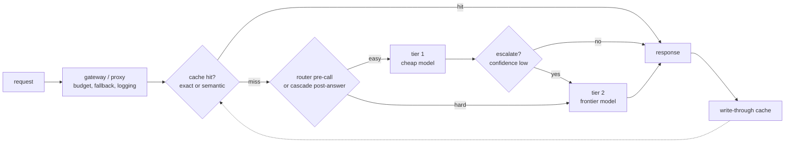

**Where they diverge.** The same spine forks on four independent choices, each with its own deciding constraint.

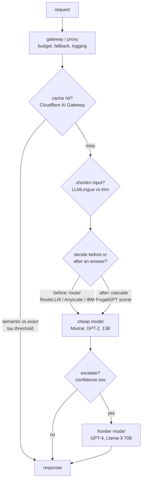

**The choices, side by side.**

| Decision | Options (who) | What decides it |
| --- | --- | --- |
| routing | `difficulty router` blind, pre-call (RouteLLM, Anyscale, IBM) vs `cascade` scores its own answer (FrugalGPT) | Latency budget: a two-model path needs slack; router decides once, cascade catches its own mistake |
| caching | `semantic cache` embed + threshold vs `exact` hash(model, body) (Cloudflare) | Free-text repeats: exact rarely fires, semantic catches paraphrases but a loose tau leaks wrong answers |
| prompt compression | `LLMLingua` perplexity token-drop vs `context trim` top-k rerank vs none | Input tokens must dominate and context be long, verbose, redundant; else the small-LM pass is pure overhead |
| model right-sizing / quant | `fine-tuned small` per task + `FP8` self-host (Anyscale, Baseten) vs one frontier model | Task narrowness and QPS: FP8 helps only models you host above the QPS where fixed GPU beats API price |

**The math that separates them.**

$$\textbf{Cascade expected cost:}\quad \mathbb{E}[C] = c_1 + (1-p_1) c_2 + (1-p_1)(1-p_2) c_3$$

where $c_i$ is the cost of stage $i$ and $p_i$ is the probability its answer is accepted.

$$\textbf{Router expected savings:}\quad S = f_{\text{weak}} (c_{\text{big}} - c_{\text{small}}) - c_{\text{router}}$$

where $f_{\text{weak}}$ is the fraction of traffic the weak model handles at bar.

$$\textbf{Cache serve when:}\quad \max_{k}\ \cos(e_q, e_k) \ge \tau,\quad \tau \in (0,1)$$

$$\textbf{Prompt compression ratio:}\quad \rho = \frac{n_{\text{orig}}}{n_{\text{comp}}},\quad \text{net win iff } c_{\text{big}} (n_{\text{orig}}-n_{\text{comp}}) > c_{\text{small}} n_{\text{orig}}$$

$$\textbf{Cache effective cost:}\quad \mathbb{E}[C_{\text{cache}}] = h\, c_{\text{hit}} + (1-h)(c_{\text{embed}} + c_{\text{model}})$$

where $h$ is the hit rate; caching pays only when $h\, (c_{\text{model}} - c_{\text{hit}}) > c_{\text{embed}}$, so the break-even hit rate is:

$$\textbf{Cache-hit break-even:}\quad h^{*} = \frac{c_{\text{embed}}}{c_{\text{model}} - c_{\text{hit}}}$$

$$\textbf{Blended cost across tiers:}\quad \mathbb{E}[C_{\text{route}}] = c_{\text{router}} + \sum_{i} f_i\, c_i,\quad \sum_{i} f_i = 1$$

where $f_i$ is the fraction of traffic sent to tier $i$; right-sizing shifts mass to small $c_i$ without crossing the quality bar.

$$\textbf{Self-host vs API break-even:}\quad Q^{*} = \frac{c_{\text{gpu/hour}}}{3600\, \cdot\, t_{\text{tok}}\, \cdot\, c_{\text{api/tok}}}$$

above QPS $Q^{*}$ the fixed GPU beats per-token API price, where $t_{\text{tok}}$ is tokens per request and $c_{\text{api/tok}}$ is the API price per token.

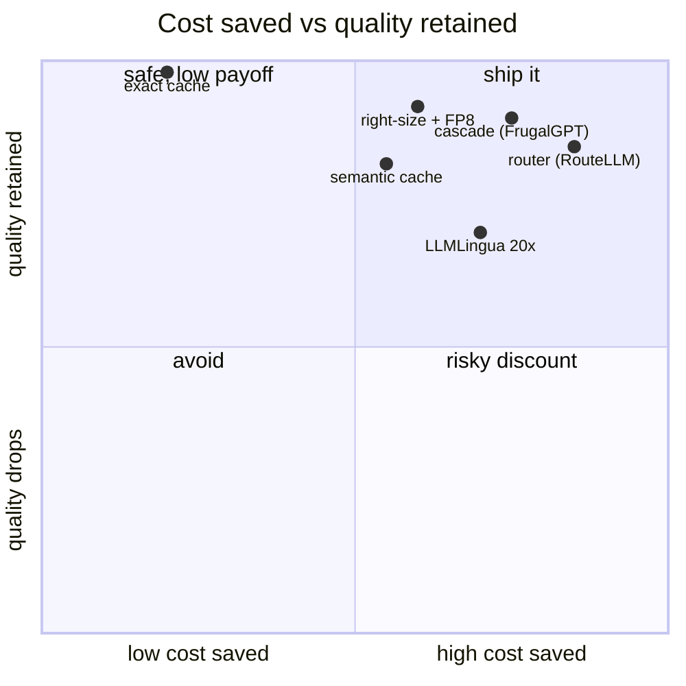

**Interview watch-outs.**

- **Routing vs cascade is a latency trade, not a quality trade.** A router decides once, blind, before any generation, so it fits a tight SLO but cannot know it mis-routed; a cascade sees a real answer before spending more, catching its own mistakes at the cost of a first call plus a scorer. Say which constraint forces the choice; if you have slack, route first then cascade within a bucket.
- **Semantic cache staleness and scope are the silent killers.** A loose $\tau$ returns a near-neighbor's answer to a different question (confidently, cheaply wrong), and no TTL serves a moved fact forever. Never share-cache personalized or tenant-scoped answers; that is a data leak, not a cost win. Tune $\tau$ on labeled should-hit / should-not pairs, not by eyeballing hit rate.
- **A cost number without a paired quality number is meaningless.** "The bill dropped 40%" is unanswerable without per-bucket quality tracking; a green cost dashboard is the exact signature of a router dumping newly-hard queries on the small model. Always quote cost saved and quality retained together, and load the eval set with the hard tail.
- **The right-sizing knob is where the money actually is.** Most bills are one frontier model wired in for simplicity doing classification, routing, extraction, and embeddings it never needed. Match model size to task before reaching for clever caching or compression; the blended-cost formula moves most when you shift traffic mass, not when you shave a few tokens.
- **Compression and quantization only pay in their regime.** LLMLingua nets out only when input tokens dominate and context is redundant; FP8 and batching only help models you host above the break-even QPS. On a per-token API your levers are routing, caching, compression, and right-sizing, nothing that changes tokens-per-GPU.
- **Every knob drifts.** Route threshold, cascade cutoff, cache $\tau$, and compression ratio are all optimal once and wrong later as traffic shifts. Re-sweep the frontier periodically and alert on per-bucket quality, not aggregate spend; the router and the scorer are themselves models that regress.

**The systems**

- **Stanford** [FrugalGPT: Using LLMs While Reducing Cost and Improving Performance](https://arxiv.org/abs/2305.05176): An LLM cascade defers to pricier models only when the cheap response scores unreliable. *(eval bar)*
- **LMSYS** [RouteLLM: an open framework for cost-effective LLM routing](https://www.lmsys.org/blog/2024-07-01-routellm/): A preference-data router splits queries between strong and weak models, about 85% cost cut. *(product design)*
- **Anyscale** [Building an LLM Router for High-Quality and Cost-Effective Responses](https://www.anyscale.com/blog/building-an-llm-router-for-high-quality-and-cost-effective-responses): A fine-tuned classifier routes by query complexity between closed and open models. *(eval bar)*
- **IBM Research** [LLM routing for quality, low-cost responses](https://research.ibm.com/blog/LLM-routers): A real-time router sends each query to the best-value model, cutting cost up to 85%. *(product design)*
- **Microsoft Research** [LLMLingua: prompt compression for LLM efficiency](https://www.microsoft.com/en-us/research/blog/llmlingua-innovating-llm-efficiency-with-prompt-compression/): Removes unimportant tokens for up to 20x prompt compression with little loss. *(product design)*
- **Databricks** [Simple, Fast, Scalable Batch LLM Inference](https://www.databricks.com/blog/introducing-simple-fast-and-scalable-batch-llm-inference-mosaic-ai-model-serving): Governed batch inference over large datasets for cost-efficient bulk processing. *(deployment)*
- **Baseten** [33% faster LLM inference with FP8 quantization](https://www.baseten.co/blog/33-faster-llm-inference-with-fp8-quantization/): FP8 quantization gives a 33% throughput gain and 24% lower cost per token. *(deployment)*
- **Cloudflare** [Caching in AI Gateway](https://developers.cloudflare.com/ai-gateway/features/caching/): The gateway serves identical requests from cache, cutting billable provider calls and latency. *(deployment)*
- **Uber** [Uber's GenAI Gateway](https://www.uber.com/blog/genai-gateway/): A unified multi-vendor gateway with usage and budget management across teams, plus fallbacks. *(deployment)*

---

### [Agent orchestration](topics/03-agent-orchestration.md) · 22 systems

**What they share.** Every system turns a user goal into a plan, then runs a tool-calling loop that acts, observes, and revises with managed context, bolting on a verification pass before the answer ships. They split on whether one context holds the whole job or an orchestrator fans work to parallel subagents.

**The reference pipeline.** Strip away the vendor names and every design is the same four-beat loop: plan the approach, call a tool, observe the result, reflect on whether it moved the goal, then either loop again or answer. Verification wraps the exit, and a hard step cap wraps the whole thing so a wandering loop cannot run forever.

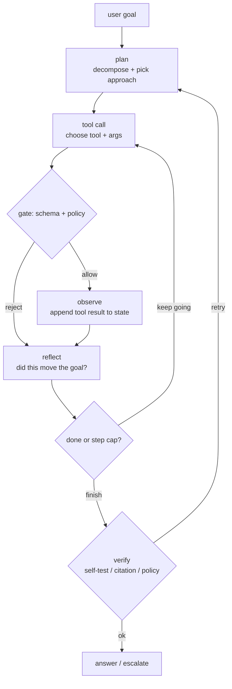

**The choices, side by side.** Where the reference loop stays fixed, the productionized systems diverge on topology, planning style, tool interface, and memory.

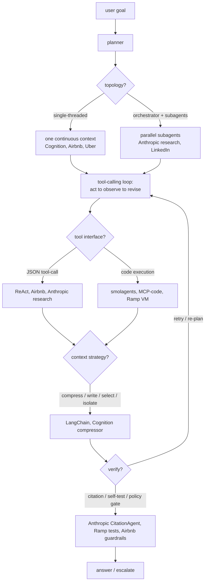

**The choices in a table.**

| Decision | Options (who) | What decides it |
| --- | --- | --- |
| topology | `single-agent loop` (Cognition, Airbnb, Uber) vs `orchestrator + parallel subagents` (Anthropic research, LinkedIn) vs `escalate-when-needed` (OpenAI guide) | Can one context hold the job? Separable subtasks needing isolated windows favor fan-out; coherent decision chains favor single-threaded. |
| planning | `ReAct` reactive next-step (Yao et al.) vs `Reflexion` self-critique retry (Shinn et al.) vs `plan-then-execute` (Anthropic lead agent, Airbnb CoT loop) | Known task shape and cost predictability favor plan-first; open-ended favors reactive; a clear success signal to learn from favors Reflexion. |
| tool / verification | `JSON tool-calls + gate` (Airbnb Tool Manager, ReAct) vs `code execution in sandbox` (smolagents E2B, Ramp Modal VM, Anthropic MCP-code) vs `citation pass` (Anthropic CitationAgent) | Many tools or large results waste tokens on JSON round-trips, so code wins; state-changing writes need a deterministic policy gate, not a prompt. |
| memory / context | `compress` (Cognition distiller, Claude Code auto-compact) vs `write + select` external memory (LangChain, Uber RAG) vs `isolate` separate windows (Anthropic subagents, LinkedIn siloed stores) | Transcript nearing the limit forces compression; recurring facts favor external write-then-retrieve; token-heavy blobs favor isolation. |

**The math that separates them.**

$$\textbf{context growth per turn:}\quad T_n = T_0 + \sum_{i=1}^{n}\bigl(a_i + o_i\bigr)$$

where $T_0$ is the system prompt plus goal, $a_i$ is the model's action tokens on step $i$, and $o_i$ is the observed tool-result tokens. The sum is why every step re-pays for the whole history at prefill.

$$\textbf{per-turn context cost:}\quad C_n = p\cdot T_{n-1} + p\cdot a_n^{in} + g\cdot a_n^{out}$$

with prefill price $p$ and generation price $g$: the $p\cdot T_{n-1}$ term grows linearly in $n$, so a long loop is dominated by re-reading its own transcript unless you compress or prefix-cache.

$$\textbf{per-task cost:}\quad C = \sum_{s=1}^{S}\Bigl(p\,(T_{s-1} + I_s) + g\,O_s\Bigr)$$

summed over $S$ loop steps, with $I_s$ input and $O_s$ output tokens for step $s$: this is the number an interviewer wants bounded by a step cap.

$$\textbf{multi-agent token multiple:}\quad \frac{C_{multi}}{C_{single}} \approx k \cdot \bar{r} \quad(\text{Anthropic: about } 15\times)$$

for $k$ subagents each doing $\bar{r}$ relative work: parallel fan-out buys wall-clock latency, not tokens.

$$\textbf{MoE active fraction:}\quad f_{active} = \frac{\text{top-}k}{E},\qquad C_{token} \propto f_{active}$$

a cheaper per-token reasoning step (top-$k$ of $E$ experts) compounds across every call in the loop.

$$\textbf{verified success:}\quad P_{ship} = P_{task}\cdot\bigl(1 - (1 - P_{catch})^{R}\bigr)$$

task success $P_{task}$ times the chance one of $R$ verification retries catches the error ($P_{catch}$ per pass): more retries raise ship quality but multiply cost by roughly $R$.

$$\textbf{error compounding:}\quad P_{ok}(n) = \prod_{i=1}^{n} q_i \le q^{\,n}$$

with per-step success $q_i$ (bounded above by the worst step $q$): an $n$-step loop at $q = 0.95$ per step lands near $0.95^{n}$, so a 10-step task is already below $0.60$ without gates that stop a bad step from propagating.

```mermaid
quadrantChart
  title Autonomy vs reliability
  x-axis "low autonomy" --> "high autonomy"
  y-axis "lower reliability" --> "higher reliability"
  quadrant-1 "autonomous + verified"
  quadrant-2 "guarded + gated"
  quadrant-3 "simple baselines"
  quadrant-4 "fragile / drift risk"
  "ReAct baseline": [0.55, 0.25]
  "Reflexion": [0.6, 0.5]
  "Airbnb v2 (gated)": [0.4, 0.8]
  "Cognition single-thread": [0.55, 0.72]
  "Ramp self-test VM": [0.82, 0.78]
  "Anthropic multi-agent": [0.85, 0.55]
```

**Interview watch-outs.**
- **Single vs multi-agent is a judgment signal.** Default to one well-tooled agent and reach for an orchestrator only when subtasks are genuinely separable or need isolated context windows. Saying "multi-agent" reflexively reads as hype; naming the 15x token multiple and the hard-to-debug join step reads as experience.
- **Error compounding is the reason loops fail, not model quality.** Per-step success below 1 multiplies out ($q^{n}$), so a long horizon quietly rots. The fix is gates and checkpoints between steps so one bad step cannot propagate, plus a step cap as the runaway backstop.
- **Cost is steps times growing transcript, not a flat per-call price.** The prefill term $p\cdot T_{n-1}$ rises every turn. Control it with summarization / compression, prefix caching of the system prompt, and model tiering (cheap model for routing, expensive one only for the hard decision).
- **Latency and cost are different knobs.** Parallel tool calls and subagent fan-out cut wall-clock time but raise tokens; compression and tiering cut tokens. Do not conflate "faster" with "cheaper" in the same breath.
- **Verification must be code where money moves.** A policy gate in deterministic code (schema, limit, authorization) beats a prompt that says "only refund under $50", because tool results are untrusted and prompt injection rides in through them. Self-tests and citation passes cover correctness; the gate covers safety.
- **Bound everything and make it auditable.** A hard step cap and token budget per task are non-negotiable, and every step (reasoning, proposed call, gate decision, result) should be logged so the loop is debuggable and the eval can score end-to-end task success plus per-step tool choice.

**The systems**

- **Anthropic** [Building effective agents](https://www.anthropic.com/research/building-effective-agents): When to use workflows versus agents, and five composable orchestration patterns. *(product design)*
- **Anthropic** [How we built our multi-agent research system](https://www.anthropic.com/engineering/multi-agent-research-system): Orchestrator-worker pattern with parallel subagents; +90.2% over a single agent. *(deployment)*
- **Cognition** [Don't Build Multi-Agents](https://cognition.com/blog/dont-build-multi-agents): The counter-case: single-threaded agents win, and why parallel subagents are fragile. *(product design)*
- **Ramp** [Why We Built Our Own Background Agent](https://builders.ramp.com/post/why-we-built-our-background-agent): Closed-loop coding agent on sandboxed Modal VMs with verification. *(deployment)*
- **LangChain** [Context Engineering for Agents](https://www.langchain.com/blog/context-engineering-for-agents): Write, select, compress, and isolate context to control token cost and latency. *(product design)*
- **OpenAI** [A practical guide to building agents](https://cdn.openai.com/business-guides-and-resources/a-practical-guide-to-building-agents.pdf): Orchestration patterns, guardrails, and single vs multi-agent from deployments. *(product design)*
- **Anthropic** [Writing effective tools for agents, with agents](https://www.anthropic.com/engineering/writing-tools-for-agents): Designing and evaluating tool definitions to raise agent task success. *(product design)*
- **Anthropic** [Code execution with MCP: building more efficient agents](https://www.anthropic.com/engineering/code-execution-with-mcp): Code execution over MCP cuts tokens and latency at scale. *(product design)*
- **Uber** [Genie: Uber's Gen AI on-call copilot](https://www.uber.com/en-US/blog/genie-ubers-gen-ai-on-call-copilot/): A production RAG on-call copilot serving 45k engineer questions monthly. *(deployment)*
- **Block** [Introducing codename goose: an open framework for AI agents](https://block.xyz/inside/block-open-source-introduces-codename-goose): An open extensible agent running local multi-step tasks via MCP. *(product design)*
- **Sourcegraph** [Agentic Coding: a practical guide for big code](https://sourcegraph.com/blog/agentic-coding): Running agent loops with tools across large enterprise codebases. *(who it serves)*
- **Replit** [Enabling Agent 3 to self-test at scale with REPL verification](https://replit.com/blog/automated-self-testing): REPL plus browser verification lets the agent self-test autonomously. *(eval bar)*
- **GitHub** [Evaluating the Copilot agentic harness across models and tasks](https://github.blog/ai-and-ml/github-copilot/evaluating-performance-and-efficiency-of-the-github-copilot-agentic-harness-across-models-and-tasks/): Benchmarking a multi-model agent harness on resolution and token cost. *(eval bar)*
- **Salesforce** [Inside Agentforce: the Atlas Reasoning Engine](https://engineering.salesforce.com/inside-the-brain-of-agentforce-revealing-the-atlas-reasoning-engine/): A model-agnostic reasoning and planning engine driving enterprise agent actions. *(deployment)*
- **Airbnb** [Automation Platform v2: improving conversational AI](https://medium.com/airbnb-engineering/automation-platform-v2-improving-conversational-ai-at-airbnb-d86c9386e0cb): An LLM reasoning engine with chain-of-thought tool orchestration, context, and guardrails. *(deployment)*
- **LinkedIn** [The LinkedIn GenAI tech stack: extending to build AI agents](https://www.linkedin.com/blog/engineering/generative-ai/the-linkedin-generative-ai-application-tech-stack-extending-to-build-ai-agents): Multi-agent orchestration over messaging infra: agent registry, lifecycle, observability. *(deployment)*
- **Hugging Face** [Introducing smolagents](https://huggingface.co/blog/smolagents): The case for code-writing agents over JSON tool calls for multi-step tool use. *(product design)*
- **Stripe** [Can AI agents build real Stripe integrations?](https://stripe.com/blog/can-ai-agents-build-real-stripe-integrations): A benchmark of 11 challenges scoring agents on integration, testing, and error recovery. *(eval bar)*
- **Yao et al.** [ReAct: synergizing reasoning and acting in language models](https://arxiv.org/abs/2210.03629): The foundational pattern interleaving reasoning traces with tool actions. *(product design)*
- **Shinn et al.** [Reflexion: language agents with verbal reinforcement learning](https://arxiv.org/abs/2303.11366): Agents self-reflect on feedback to improve future actions without weight updates. *(eval bar)*
- **Wang et al.** [Voyager: an open-ended embodied agent with LLMs](https://arxiv.org/abs/2305.16291): A lifelong Minecraft agent with an auto curriculum, skill library, and self-verification. *(product design)*
- **Wu et al.** [AutoGen: next-gen LLM apps via multi-agent conversation](https://arxiv.org/abs/2308.08155): A framework for multi-agent systems via customizable conversable agents. *(deployment)*

---

### [Multimodal serving](topics/09-multimodal-serving.md) · 19 systems

**What they share.** Every vision-language system is the same spine: a modality encoder turns an image into a feature grid, a connector maps those features into the LLM embedding space, and one decoder generates over an interleaved text-plus-image token sequence. They differ almost entirely in the connector and in how many tokens an image is allowed to become.

**The reference pipeline.** Read the spine left to right before arguing about any single design: the encoder is a bounded, batchable pass that runs once per image; the projector is where the token budget is set; the decoder is the autoregressive, memory-bound stage where every image token lands in prefill and the KV cache. Most design decisions are just different answers to "how big is the block the projector hands the decoder."

```mermaid
flowchart LR
  IMG["image"] --> ENC["modality encoder (ViT)<br/>feature grid, runs once per image"]
  ENC --> PROJ["projector / connector<br/>sets image-token budget"]
  TXT["text"] --> TOK["tokenizer"]
  TOK --> TT["text tokens"]
  PROJ --> ITOK["image tokens"]
  ITOK --> SEQ["interleaved sequence"]
  TT --> SEQ
  SEQ --> DEC["LLM decoder<br/>prefill + KV cache + autoregressive decode"]
  DEC --> OUT["answer"]
```

```mermaid
flowchart LR
  IMG["image / video / audio"] --> ENC["modality encoder (ViT)"]
  ENC --> CONN["connector"]
  CONN --> DEC["LLM decoder<br/>interleaved tokens"]
  TXT["text"] --> DEC
  DEC --> OUT["answer"]

  CONN -. "projector: variable, resolution-scaled<br/>LLaVA, Qwen2-VL, Pixtral" .- D1{{"connector type?"}}
  CONN -. "resampler / cross-attn: fixed few tokens<br/>Flamingo, BLIP-2, Idefics2" .- D1
  ENC -. "resolution?<br/>fixed 336px (LLaVA) vs native dynamic (Qwen2-VL, Pixtral)" .- D2{{"how many img tokens?"}}
  ENC -. "tiling + tile-tags for OCR<br/>NVLM, Idefics2 split" .- D2
  DEC -. "serving split?<br/>encoder cache + prefix cache (vLLM), DP encoder / TP decoder (ROCm)" .- D3{{"serve one server or two tiers?"}}
```

**The choices, side by side.**

| Decision | Options (who) | What decides it |
| --- | --- | --- |
| projector | `MLP` (LLaVA, Qwen2-VL, Pixtral) vs `cross-attn` (Flamingo, NVLM option) vs `resampler` (BLIP-2 Q-Former, Idefics2, Flamingo perceiver) | MLP passes a variable resolution-scaled block so detail scales with cost; resampler / cross-attn compress to a fixed few so cost is bounded but detail is capped |
| resolution | `fixed` (LLaVA CLIP ViT-L/14 336px) vs `tiling/dynamic` (Qwen2-VL native, Pixtral native, NVLM tiles) | Task detail: OCR and dense docs need high resolution; "what is in this picture" does not |
| image-token budget | `variable, scales with pixels` (Qwen2-VL, Pixtral) vs `fixed cap` (BLIP-2 = 32, Idefics2 = 64 or 320, Flamingo few) | Whether per-request cost/latency must be bounded vs whether fine detail must survive |
| serving split | `one server` vs `separate encoder tier + prefix/embedding cache` (Red Hat vLLM V1) vs `DP encoder + TP decoder` (AMD ROCm) | Encoder is bounded, batchable, cacheable by image hash; decoder is autoregressive and memory-bound; scale each independently and route text-only past the encoder |

**The math that separates them.**

$$\textbf{image tokens} \ =\ \left\lfloor \frac{H}{p} \right\rfloor \left\lfloor \frac{W}{p} \right\rfloor \quad (\text{Pixtral: } 1024^2, \ p{=}16 \ \Rightarrow\ 4096)$$

$$\textbf{tiled token count} \ =\ T \cdot \frac{H_t \, W_t}{p^2} \ +\ \text{tags} \quad (\text{grows linearly in tiles } T)$$

$$\textbf{sequence length} \ =\ n \ =\ n_\text{text} + n_\text{img}, \quad n_\text{img} \ \gg\ n_\text{text} \ \text{ for a high-res image}$$

$$\textbf{prefill compute is quadratic} \ =\ O\big((n_\text{text}+n_\text{img})^2 \, d\big) \quad (\text{image tokens dominate first-token latency})$$

$$\textbf{KV bytes} \ =\ 2 \cdot L \cdot (n_\text{text}+n_\text{img}) \cdot d_\text{kv} \cdot b_\text{prec} \quad (\text{image tokens inflate every layer's cache})$$

$$\textbf{multi-image cost} \ =\ \sum_{i=1}^{k} n_{\text{img},i} \quad (\text{k images stack linearly into prefill and KV})$$

```mermaid
quadrantChart
  title connector: recoverable detail vs image-token cost
  x-axis "few tokens (cheap)" --> "many tokens (costly)"
  y-axis "detail capped" --> "detail preserved"
  quadrant-1 "high detail, high cost"
  quadrant-2 "high detail, low cost"
  quadrant-3 "low detail, low cost"
  quadrant-4 "low detail, high cost"
  "BLIP-2 Q-Former (32)": [0.10, 0.20]
  "Flamingo perceiver": [0.18, 0.28]
  "Idefics2 (64/320)": [0.35, 0.45]
  "LLaVA MLP (336px)": [0.45, 0.40]
  "Qwen2-VL dynamic": [0.75, 0.80]
  "Pixtral native": [0.80, 0.85]
  "NVLM tiled + tags": [0.88, 0.90]
```

**Interview watch-outs.**

- **Projector design is the whole answer.** MLP passes a variable resolution-scaled block (detail scales with cost); resampler / cross-attn (Q-Former, perceiver) compress to a fixed few (cost bounded, detail capped). Name the tradeoff, do not just name the connector.
- **Image-token budget, not model size, drives cost.** A single 1024x1024 image is 4096 tokens in Pixtral; those tokens hit prefill (quadratic) and the KV cache (every layer). "An image costs many tokens in the priciest stage" is the line that scores.
- **Resolution and tiling are a quality-cost knob, not a default.** Tiling recovers OCR-level detail but multiplies tokens, and unordered tiles need tile-tags (NVLM) to preserve spatial layout. Max resolution only when the task needs it.
- **Fixed-cap connectors bound cost but lose detail.** BLIP-2 (32 tokens) and Idefics2 (64/320) cap per-request cost; call out that dense documents and OCR are exactly where that cap hurts.
- **Serving is two workloads, not one.** The encoder is bounded, batchable, and cacheable by image hash (vLLM V1 embedding + prefix cache; ROCm DP encoder + TP decoder); the decoder is autoregressive and memory-bound. Scale each independently and route text-only requests past the encoder.
- **Variable token counts break naive batching.** Dynamic-resolution models (Qwen2-VL, Pixtral) make requests heterogeneous in size, so continuous batching and KV planning must handle variable-length visual blocks, and worst-case large images still need a cap.

**The systems**

- **Red Hat (vLLM)** [vLLM V1: accelerating multimodal inference](https://developers.redhat.com/articles/2025/02/27/vllm-v1-accelerating-multimodal-inference-large-language-models): Encoder caching, per-image prefix caching, and async CPU/GPU for faster multimodal serving. *(deployment)*
- **AMD (ROCm)** [Accelerating Multimodal Inference in vLLM](https://rocm.blogs.amd.com/software-tools-optimization/vllm-dp-vision/README.html): Batch-level data parallelism for vision encoders cuts sync overhead. *(deployment)*
- **Alibaba (Qwen)** [Qwen2-VL: enhancing vision-language perception at any resolution](https://arxiv.org/abs/2409.12191): Dynamic resolution turns any image into variable visual tokens, with an MLP projector and M-RoPE. *(product design)*
- **Mistral AI** [Pixtral 12B](https://arxiv.org/abs/2410.07073): A custom ViT trained from scratch ingests native resolution with a flexible image token budget. *(product design)*
- **Microsoft (LLaVA)** [Visual Instruction Tuning](https://arxiv.org/abs/2304.08485): The MLP projector connecting a frozen CLIP vision encoder to the LLM embedding space. *(product design)*
- **Dropbox** [Creating a modern OCR pipeline using CV and deep learning](https://dropbox.tech/machine-learning/creating-a-modern-ocr-pipeline-using-computer-vision-and-deep-learning): Productionizing a deep-learning OCR and document-scan pipeline. *(deployment)*
- **Hugging Face** [Introducing Idefics2: a powerful 8B vision-language model](https://huggingface.co/blog/idefics2): Vision encoder plus projector plus perceiver resampler design choices. *(product design)*
- **NVIDIA** [NVLM: open frontier-class multimodal LLMs](https://research.nvidia.com/labs/adlr/NVLM-1/): Decoder-only vs cross-attention connector tradeoffs, plus tile-tagging for OCR. *(deployment)*
- **DeepMind** [Flamingo: a visual language model for few-shot learning](https://arxiv.org/abs/2204.14198): Bridging frozen vision and language models with interleaved input. *(product design)*
- **Ai2** [Molmo and PixMo: open weights and open data for VLMs](https://arxiv.org/abs/2409.17146): An open VLM family with curated data rivaling proprietary models. *(eval bar)*
- **OpenGVLab** [InternVL 2.5: model, data, and test-time scaling](https://arxiv.org/abs/2412.05271): Scaling an open multimodal model across model, data, and inference-time. *(eval bar)*
- **Alibaba Qwen** [Qwen2-Audio Technical Report](https://arxiv.org/abs/2407.10759): An audio-language model with voice-chat and audio-analysis modes. *(who it serves)*
- **NVIDIA** [Accelerating VLM inference with TensorRT Edge-LLM](https://developer.nvidia.com/blog/accelerating-llm-and-vlm-inference-for-automotive-and-robotics-with-nvidia-tensorrt-edge-llm/): A C++ runtime for low-latency on-device VLM inference on embedded. *(deployment)*
- **Apple** [MM1: methods, analysis, and insights from multimodal LLM pre-training](https://arxiv.org/abs/2403.09611): Ablations on image-token count, connector design, and data mix for building VLMs. *(product design)*
- **Meta** [Chameleon: mixed-modal early-fusion foundation models](https://arxiv.org/abs/2405.09818): A single transformer over interleaved image/text tokens; a stable early-fusion recipe. *(product design)*
- **Roblox** [Running AI Inference at Scale in the Hybrid Cloud](https://about.roblox.com/newsroom/2024/09/running-ai-inference-at-scale-in-the-hybrid-cloud): vLLM, Ray, and a custom feature store serving 250 ML pipelines across hybrid cloud. *(deployment)*
- **Google** [PaLI-X: on scaling up a multilingual vision-language model](https://arxiv.org/abs/2305.18565): Scaling VLM components and task mix advances 25+ vision-language benchmarks. *(eval bar)*
- **Microsoft** [Florence-2: a unified representation for vision tasks](https://arxiv.org/abs/2311.06242): A prompt-based seq2seq VLM unifying caption, detection, grounding, and segmentation. *(product design)*
- **Salesforce** [BLIP-2: bootstrapping with frozen image encoders and LLMs](https://arxiv.org/abs/2301.12597): A lightweight Q-Former projector bridges a frozen vision encoder to a frozen LLM. *(product design)*

---

### [Post-training pipeline](topics/05-post-training-pipeline.md) · 19 systems

**What they share.** Every team rides one post-training spine (base to curated data to SFT to optional preference tuning to eval gate to serve) and differs only in which knobs the task forced them to turn. Most ship SFT alone; DPO/RLHF appears only where a quality axis SFT could not capture actually mattered.

**The reference pipeline.** The canonical shape is a loop, not a line: curate a small clean dataset, supervised fine-tune (usually a LoRA/QLoRA adapter), optionally align with DPO or RLHF, then gate every candidate on a held-out eval before it reaches a user. Production output feeds the next dataset version. Preference tuning is optional and comes after SFT, never instead of it.

```mermaid
flowchart TD
  BASE["base model<br/>open or vendor weights"] --> CUR["data curation<br/>production logs + human labels + synthetic<br/>dedup, filter, decontaminate, version"]
  CUR --> SFT["SFT (supervised fine-tuning)<br/>LoRA / QLoRA adapter on (prompt, response)"]
  SFT --> ALIGN{"align beyond SFT?"}
  ALIGN -->|"format / tone / skill only"| GATE
  ALIGN -->|"prefer one valid answer, safety"| PREF["preference tuning<br/>DPO on (chosen, rejected) pairs<br/>or RLHF: reward model + KL-penalized RL"]
  PREF --> GATE{"eval gate<br/>offline quality + safety + regression vs prod"}
  GATE -->|"pass"| SERVE["serve<br/>base + hot-swappable adapters"]
  GATE -->|"fail"| CUR
  SERVE -->|"production logs (flywheel)"| CUR
```

**Where they diverge.** Given that spine, the real decisions are adaptation depth, whether to align past SFT, and the label source.

```mermaid
flowchart TD
  BASE["open base<br/>Llama / Mistral / Qwen / Gemma / FLAN-T5"] --> CUR["data curation"]
  CUR --> D1{"adaptation depth?"}
  D1 -->|"small behavior nudge, many tenants"| LORA["LoRA / QLoRA<br/>Mercari, Cloudflare, Grab (warm-start)"]
  D1 -->|"big shift or LoRA drifts OOD"| FULL["full fine-tune<br/>Anyscale, Shopify Flow, Grab (final)"]
  LORA --> D2{"align beyond SFT?"}
  FULL --> D2
  D2 -->|"format / tone / skill only"| SFTONLY["SFT only<br/>Grammarly, Mercari, Shopify, Grab"]
  D2 -->|"prefer one valid answer"| PREF["DPO / RLHF<br/>Anyscale (DPO), Spotify (RSFT+DPO), LinkedIn (RLHF+DPO)"]
  SFTONLY --> D3{"label source?"}
  PREF --> D3
  D3 -->|"human labels"| HUM["human gold"]
  D3 -->|"synthetic + judge"| SYN["LLM-as-judge<br/>Anyscale, Shopify flywheel"]
  HUM --> GATE{"eval gate<br/>offline + safety + regression vs prod"}
  SYN --> GATE
  GATE -->|"pass"| SERVE["serve<br/>multi-LoRA edge: Cloudflare"]
  GATE -->|"fail"| CUR
  SERVE -->|"production logs"| CUR
```

**The choices, side by side.**

| Decision | Options (who) | What decides it |
| --- | --- | --- |
| adaptation | `full FT` (Anyscale, Shopify Flow) vs `LoRA` (Cloudflare, Grab warm-start) vs `QLoRA` (Mercari) | Behavior-shift size and serving economics: small nudge or many tenants goes LoRA/QLoRA; big shift or LoRA drifting OOD forces full FT. |
| alignment | `SFT only` (Grammarly, Mercari, Shopify, Grab) vs `DPO` (Anyscale, Spotify) vs `RLHF+DPO` (LinkedIn) | Is there a quality axis SFT cannot capture (prefer one valid answer, safety, tone)? If no, stop at SFT. |
| data curation | `dense human instruction set` (Grammarly) vs `templated pairs` (Mercari) vs `synthetic + LLM judge` (Anyscale, Shopify) vs `proprietary graph/domain` (LinkedIn, Grab) | Whether real production data exists yet, and whether the task axis can be scored automatically. |
| eval gate | `human pref vs generalist` (Grammarly) vs `BLEU vs API` (Mercari) vs `1% live activation rate` (Shopify) vs `Q&A accuracy + compression` (Anyscale) | Offline metrics overstate readiness; gate on the real product metric (live slice) before scaling traffic. |
| serving | `one tuned model` (Anyscale, Shopify) vs `4-bit PTQ small model` (Mercari) vs `multi-LoRA shared base` (Cloudflare) | Tenant count and cost target: many customers/domains push toward one warm base plus swappable adapters. |

**The math that separates them.**

**LoRA low-rank weight update:**

$$W = W_0 + \frac{\alpha}{r} B A, \quad B \in \mathbb{R}^{d \times r},\ A \in \mathbb{R}^{r \times k},\ r \ll \min(d,k)$$

The base $W_0$ is frozen; only $B$ and $A$ train. Trainable parameters drop from $d k$ to $r(d+k)$, so at $r \ll \min(d,k)$ an adapter touches well under 1 percent of the matrix.

**DPO preference loss (Anyscale, Spotify):**

$$\mathcal{L}_{DPO} = -\mathbb{E}_{(x,y_w,y_l)} \left[ \log \sigma \left( \beta \log \frac{\pi_\theta(y_w \mid x)}{\pi_{ref}(y_w \mid x)} - \beta \log \frac{\pi_\theta(y_l \mid x)}{\pi_{ref}(y_l \mid x)} \right) \right]$$

A classification-style loss over (chosen $y_w$, rejected $y_l$) pairs, no separate reward model. The $\beta$ term controls how far the policy $\pi_\theta$ may move from the reference $\pi_{ref}$; small $\beta$ (Anyscale used 0.03) keeps it close and stable.

**RLHF KL-penalized objective (LinkedIn):**

$$\max_{\pi_\theta}\ \mathbb{E}_{x, y \sim \pi_\theta}\big[ r_\phi(x,y) \big] - \beta \, \mathrm{KL}\left[ \pi_\theta(y \mid x)\ \Vert \ \pi_{ref}(y \mid x) \right]$$

Maximize a learned reward $r_\phi$ while the KL penalty pins the policy near the SFT reference $\pi_{ref}$. Drop the KL term and the policy reward-hacks $r_\phi$ into degenerate text; this is the same $\pi_{ref}$-anchoring DPO folds into its loss in closed form.

**QLoRA memory (Mercari, 4-bit frozen base):**

$$M \approx \underbrace{4\text{-bit} \cdot N_{base}}_{\text{frozen, }\sim 0.5\text{ byte/param}} + \underbrace{16\text{-bit} \cdot 2 r (d+k) L}_{\text{trainable adapter} \ll N_{base}}$$

Quantizing the frozen base to roughly 0.5 byte per parameter is what fits a billions-parameter model plus its adapter on a single GPU.

```mermaid
quadrantChart
  title Training cost vs alignment strength
  x-axis "Cheap train" --> "Heavy train"
  y-axis "SFT only" --> "Strong alignment"
  quadrant-1 "Full FT + preference"
  quadrant-2 "Light + aligned"
  quadrant-3 "Light + SFT"
  quadrant-4 "Heavy + SFT"
  "Mercari QLoRA": [0.15, 0.15]
  "Grammarly CoEdIT": [0.30, 0.20]
  "Cloudflare LoRA": [0.12, 0.10]
  "Spotify RSFT+DPO": [0.40, 0.70]
  "Grab full FT": [0.75, 0.22]
  "Shopify Flow FFT": [0.80, 0.25]
  "Anyscale iter-DPO": [0.78, 0.72]
  "LinkedIn RLHF+DPO": [0.85, 0.85]
```

**Interview watch-outs.**

- **Rank is not the knob you think.** LoRA rank $r$ bounds adapter capacity, but raising it rarely fixes a bad result; Anyscale's rank-64 LoRA lost to full fine-tune not for lack of rank but because the constrained subspace pushed token likelihoods out of distribution. Reach for full FT when the behavior shift is large, not for a bigger rank.
- **SFT overfits and forgets.** Over-training on a narrow set degrades general ability (catastrophic forgetting). Keep learning rates modest, epochs few (one to three), and mix in some general data; a small adapter perturbs the base less than a full re-train.
- **The KL / beta term is load-bearing.** In RLHF the KL penalty (and in DPO the $\beta$) is what stops the policy from drifting off the reference and reward-hacking into gibberish. Too small a $\beta$ over-steers into sycophancy or evasiveness; know that DPO's $\beta$ plays the same anchoring role as RLHF's explicit KL.
- **Data quality dominates volume.** A few thousand curated examples beat tens of thousands of scraped ones; the model imitates exactly what you show it, mistakes included. Dedup, balance, and decontaminate so the eval set never leaks into training, or the numbers are fiction.
- **Preference tuning can regress safety.** DPO/RLHF shifts what the model is willing to say, so re-run safety and refusal eval after alignment, not just task accuracy. Do not propose RLHF for a format-and-tone problem; that is over-engineering, and good SFT alone usually wins.
- **The flywheel can collapse.** Training on the model's own unfiltered output narrows diversity over time. Keep a human-labeled core, quarantine low-quality production logs through a calibrated judge, and gate every candidate on a held-out set before it ships.

**The systems**

- **Grammarly** [CoEdIT: state-of-the-art text editing with fewer parameters](https://www.grammarly.com/blog/engineering/coedit-text-editing/): Dense task-specific instruction tuning beats generalist LLMs at 12x to 60x fewer params. *(product design)*
- **Anyscale** [Fine-Tuning LLMs: LoRA or Full-Parameter?](https://www.anyscale.com/blog/fine-tuning-llms-lora-or-full-parameter-an-in-depth-analysis-with-llama-2): LoRA versus full fine-tune accuracy tradeoffs, broken down per task type. *(eval bar)*
- **Anyscale** [Direct Preference Optimization with Synthetic Data](https://www.anyscale.com/blog/direct-preference-optimization-with-synthetic-data): Iterative DPO: synthetic prefs, async reference model, judge-aligned eval. *(deployment)*
- **Hugging Face** [Preference Tuning LLMs with Direct Preference Optimization Methods](https://huggingface.co/blog/pref-tuning): Empirical DPO versus IPO versus KTO; the beta parameter drives outcomes. *(eval bar)*
- **Databricks** [A Practical Guide to LLM Fine Tuning](https://www.databricks.com/blog/llm-fine-tuning): End-to-end lifecycle: metrics, data quality, LoRA-first, and retrain cadence. *(deployment)*
- **Shopify** [Flow generation through natural language: an agentic modeling approach](https://shopify.engineering/fine-tuning-agent-shopify-flow): A fine-tuned Qwen3-32B agent with a weekly LLM-judge retraining flywheel. *(product design)*
- **Shopify** [Leveraging multimodal LLMs for the global catalogue](https://shopify.engineering/leveraging-multimodal-llms): Fine-tunes small VLMs for catalogue extraction at 40M inferences per day. *(deployment)*
- **Meta** [How to fine-tune: focus on effective datasets](https://ai.meta.com/blog/how-to-fine-tune-llms-peft-dataset-curation/): Data-curation rules for SFT and PEFT; quality over quantity. *(product design)*
- **GitHub** [Building a faster, smarter Copilot with a custom model](https://github.blog/ai-and-ml/github-copilot/the-road-to-better-completions-building-a-faster-smarter-github-copilot-with-a-new-custom-model/): A mid-training plus SFT (fill-in-middle) plus RL pipeline. *(deployment)*
- **Replit** [Replit Code v1.5 on Hugging Face](https://replit.com/blog/replit-code-v1_5): Trained and fine-tuned a code model on Replit user code. *(product design)*
- **Grab** [A custom vision LLM to improve document processing](https://engineering.grab.com/custom-vision-llm-at-grab): LoRA then full fine-tune of Qwen2-VL for OCR and key-info extraction. *(who it serves)*
- **Nubank** [Fine-Tuning Transaction User Models](https://building.nubank.com/fine-tuning-transaction-user-models/): SFT of transaction foundation models with joint fusion. *(product design)*
- **LinkedIn** [How we built domain-adapted foundation GenAI models](https://www.linkedin.com/blog/engineering/generative-ai/how-we-built-domain-adapted-foundation-genai-models-to-power-our-platform): Llama-based EON models via instruction tuning plus RLHF/DPO, 75x cheaper than GPT-4. *(deployment)*
- **Cloudflare** [Running fine-tuned models on Workers AI with LoRAs](https://blog.cloudflare.com/fine-tuned-inference-with-loras/): Serving customer LoRA adapters on shared base models across edge inference. *(deployment)*
- **Uber** [Open Source and In-House: How Uber Optimizes LLM Training](https://www.uber.com/us/en/blog/open-source-and-in-house-how-uber-optimizes-llm-training/): An in-house stack using LoRA/QLoRA, full fine-tuning, and continued pre-training. *(deployment)*
- **Thomson Reuters** [Scaling LLM research with Amazon SageMaker HyperPod](https://aws.amazon.com/blogs/machine-learning/scaling-thomson-reuters-language-model-research-with-amazon-sagemaker-hyperpod/): Domain-adapted legal LLMs (7B-30B) trained to beat general models on legal tasks. *(who it serves)*
- **Mercari** [Fine-Tuning an LLM to Extract Dynamically Specified Attributes](https://engineering.mercari.com/en/blog/entry/20240913-fine-tuning-an-llm-to-extract-dynamically-specified-attributes/): A QLoRA-tuned 2B model beats GPT-3.5 on attribute extraction at 14x lower cost. *(eval bar)*
- **Yelp** [An AI pipeline for inappropriate-language detection in reviews](https://engineeringblog.yelp.com/2024/03/ai-pipeline-inappropriate-language-detection.html): A fine-tuned LLM classifier flags inappropriate reviews; blocked 23,600+ in 2023. *(product design)*
- **Spotify** [Optimizing Query Expansions via LLM Preference Alignment](https://research.atspotify.com/2025/7/optimizing-query-expansions-via-llm-preference-alignment): Rejection-sampling SFT plus DPO aligns a query-expansion LLM, 70% faster. *(product design)*

---

### [Evaluation system](topics/06-evaluation-system.md) · 18 systems

**What they share.** Every system runs the same two-loop skeleton: an offline suite (checkable task metrics plus an LLM-as-judge) gates the change, then an online loop checks the gate was honest and feeds back to recalibrate the judge. The judge is trusted only after it is validated against human labels.

**The reference pipeline.** Strip away the vendor names and one loop remains: a golden suite scores every candidate, a human-calibrated judge covers the open-ended cases, a regression gate blocks anything that drops below the baseline per slice, and only survivors reach an online A/B whose real outcome recalibrates the offline score.

```mermaid
flowchart TD
  A["candidate<br/>(model + prompt + config)"] --> B["offline golden suite<br/>versioned inputs + refs"]
  B --> C1["task metric<br/>(exact / F1 / pass-fail)"]
  B --> C2["LLM-as-judge<br/>(open-ended, rubric)"]
  C2 --> V{"judge validated<br/>vs human labels?"}
  V -->|"kappa below bar"| RB["fix rubric, do not gate"]
  V -->|"kappa above bar"| C3["trusted judge score"]
  C1 --> D["aggregate + slice by segment"]
  C3 --> D
  D --> G{"regression gate<br/>per-slice score >= baseline - eps?"}
  G -->|"fail"| R["block deploy / roll back"]
  G -->|"pass"| H["ship to canary"]
  H --> J["online A/B<br/>candidate vs control"]
  J --> K["outcome + guardrail metrics<br/>(completion, edits, latency, cost)"]
  K --> L{"outcome ok and<br/>guardrails hold?"}
  L -->|"no"| R
  L -->|"yes"| S["full rollout"]
  K -.->|"offline-online gap<br/>recalibrate"| D
```

**The choices, side by side.**

Below the shared skeleton, four decisions fork.

```mermaid
flowchart TD
  A["candidate<br/>(model + prompt)"] --> B["offline suite<br/>golden set + LLM-as-judge"]
  B --> P1{"offline signal?<br/>checkable task metric vs judge"}
  P1 -->|"executable pass/fail"| Q1["GitHub Copilot<br/>(broken-repo unit tests)"]
  P1 -->|"open-ended judge"| Q2["Spotify, GitLab Duo<br/>Booking.com"]
  Q1 --> C
  Q2 --> C
  C{"judge calibration?<br/>vs human labels"}
  C -->|"validated (kappa / exact-match)"| D1["Pinterest 73.7%<br/>Thomson Reuters, DoorDash"]
  C -->|"confidence-scored"| D2["Uber uReview<br/>(grader model)"]
  D1 --> E
  D2 --> E
  E{"online proof?<br/>A/B vs shadow vs canary"}
  E -->|"live A/B"| F1["Spotify, Pinterest"]
  E -->|"shadow / canary"| F2["Ramp (shadow)<br/>GitHub (Hubbers canary)"]
  E -->|"human sign-off"| F3["Thomson Reuters<br/>(Trust Team A/B)"]
  F1 --> G["recalibrate offline<br/>on offline-online gap"]
  F2 --> G
  F3 --> G
  G -.-> B
```

| Decision | Options (who) | What decides it |
| --- | --- | --- |
| offline signal | `golden set + task metric` (GitHub broken-repo pass/fail, GitLab Cosine/Cross similarity) vs `LLM-as-judge` (Spotify, Booking.com, Uber) | Is the answer checkable? Executable / labeled task uses a metric; open-ended (relevance, tone, faithfulness) needs a judge |
| judge calibration | `validated vs human` (Pinterest 73.7% exact-match, DoorDash, Thomson Reuters) vs `confidence-scored` (Uber uReview grader) vs `uncalibrated` (anti-pattern) | Failure cost and gate authority: high-stakes gating demands measured judge-human agreement before trust |
| online | `A/B` (Spotify, Pinterest) vs `shadow` (Ramp) vs `canary` (GitHub Hubbers) | Can the action run silently? Shadow needs mirrored traffic and yields no user signal; A/B needs throughput; canary needs a safe internal cohort |
| gating | `CI regression gate` (GitHub daily vs prod, GitLab daily CEF) vs `confidence threshold` (Uber, per assistant/lang/category) vs `human sign-off` (Thomson Reuters Trust Team) | Change cadence and blast radius: daily prompt edits need automated gates; irreversible legal output needs a human arbiter |

**The math that separates them.**

**Judge-human agreement (Cohen's kappa)**

Here `p_o` is the observed agreement rate between judge and human labels, and `p_e` is the agreement expected by chance from the label marginals. A judge is trusted for gating only once kappa clears a bar (Pinterest reports 73.7 percent exact match as its analog).

$$\kappa = \frac{p_o - p_e}{1 - p_e}$$

**Retrieval quality (precision, recall, F1)**

With `tp` true positives, `fp` false positives, `fn` false negatives at cutoff k, precision is the fraction of returned docs that are relevant and recall is the fraction of relevant docs returned. F1 is their harmonic mean, which stays low unless both are high.

$$\text{precision} = \frac{tp}{tp + fp}, \qquad \text{recall} = \frac{tp}{tp + fn}$$

$$F_1 = 2 \cdot \frac{\text{precision} \cdot \text{recall}}{\text{precision} + \text{recall}}$$

**Position-bias averaging (both orderings)**

Here `j(A before B)` is the judge probability that A wins when A is shown first. Averaging the score with the flipped ordering cancels the judge's fixed preference for whichever answer comes first.

$$s(A,B) = \tfrac{1}{2}\big[ j(A \prec B) + \big(1 - j(B \prec A)\big) \big]$$

**Per-slice regression gate inequality**

The candidate ships only if no segment `g` drops more than the tolerance `eps` below its baseline. Gating on the worst slice, not the average, is what stops a change that lifts the mean while tanking one segment. Set `eps` from the judge's measured variance `sigma`, never by guessing.

$$\text{ship} \iff \min_{g \in \text{segments}} \big( s_g^{\text{cand}} - s_g^{\text{base}} \big) \ge - \epsilon, \qquad \epsilon \sim \sigma_{\text{judge}}$$

```mermaid
quadrantChart
  title Eval method: cost vs fidelity to user value
  x-axis "Low cost" --> "High cost"
  y-axis "Low fidelity" --> "High fidelity"
  quadrant-1 "gate here when you can"
  quadrant-2 "final arbiter"
  quadrant-3 "coarse filter only"
  quadrant-4 "expensive, use sparingly"
  "Public benchmarks": [0.18, 0.28]
  "Task metric / unit test": [0.30, 0.72]
  "LLM-as-judge (validated)": [0.52, 0.60]
  "Confidence-gated judge": [0.45, 0.50]
  "Shadow mode": [0.68, 0.66]
  "Online A/B": [0.82, 0.90]
  "Human expert A/B": [0.92, 0.95]
```

**Interview watch-outs.**

- **LLM-judge verbosity bias.** Judges reward longer, more confident-sounding answers even when they are not better. Optimizing hard against the judge (Goodhart) produces padded outputs the judge loves and users do not. Control for length in the rubric and keep the online edit/thumbs rate as the real tiebreaker.
- **No ground truth online.** Offline scores are a prediction, not proof. Name the online outcome metrics a judge is structurally blind to (task completion, user edits, session length, retention) and treat a large offline-online gap as the signal to recalibrate the suite, not to trust the judge harder.
- **Uncalibrated judge.** An LLM judge is a measurement instrument, and an uncalibrated instrument lies. Say you would collect a few hundred human labels and report judge-human agreement (Cohen's kappa) before gating anything, and fix the rubric first if it misses.
- **Contamination.** If eval cases or near-duplicates leaked into a model's training data, it looks great offline and fails in production. This is why a private, freshly-sampled golden set beats a famous public benchmark for gating your own feature, and why stage-one public benchmarks stay a coarse capability filter only.
- **Regression gates that only watch the average.** A single aggregate metric hides a segment that fell off a cliff. Gate per slice (language, length, tier, query type), keep a held-out set you never tune on, and set the tolerance from the judge's measured variance so noise does not flap the build.
- **Judge drift and position bias.** The judge is a hosted model that can change under you and favors whichever answer is shown first. Pin the judge model version, version the judge prompt, re-score a fixed calibration set to detect drift, and run both orderings averaged to cancel position bias.

**The systems**

- **DoorDash** [A Simulation and Evaluation Flywheel to Develop LLM Chatbots at Scale](https://careersatdoordash.com/blog/doordash-simulation-evaluation-flywheel-to-develop-llm-chatbots-at-scale/): Simulated multi-turn conversations graded by an LLM judge calibrated to humans before release. *(eval bar)*
- **DoorDash** [How DoorDash leverages LLMs to evaluate search result pages](https://careersatdoordash.com/blog/doordash-llms-to-evaluate-search-result-pages/): AutoEval: fine-tuned LLM raters with a human in the loop for whole-page relevance. *(eval bar)*
- **Thomson Reuters** [Efficiently evaluating LLMs for legal tasks](https://legal.thomsonreuters.com/blog/evaluating-llms-legal-tasks/): Three-stage gate: public benchmarks, semi-automated task eval, then human A/B. *(eval bar)*
- **Uber** [uReview: scalable, trustworthy GenAI for code review](https://www.uber.com/us/en/blog/ureview/): An LLM grader scores generated comments; confidence thresholds gate what gets posted. *(deployment)*
- **Uber** [From Predictive to Generative: how Michelangelo accelerates Uber AI](https://www.uber.com/blog/from-predictive-to-generative-ai/): Michelangelo's eval framework compares models, prompts, and fine-tunes across iterations. *(deployment)*
- **Discord** [Developing Rapidly with Generative AI](https://discord.com/blog/developing-rapidly-with-generative-ai): A critic-LLM AI-assisted eval of prompts before A/B rollout. *(eval bar)*
- **Honeycomb** [So we shipped an AI product. Did it work?](https://www.honeycomb.io/blog/we-shipped-ai-product): Post-launch product eval via activation and adoption metrics. *(eval bar)*
- **GitHub** [How we evaluate AI models and LLMs for GitHub Copilot](https://github.blog/ai-and-ml/generative-ai/how-we-evaluate-models-for-github-copilot/): 4000+ offline tests plus manual and safety gates before deploy. *(eval bar)*
- **Spotify** [Better experiments with LLM evals: a funnel, not a fork](https://engineering.atspotify.com/2026/5/better-experiments-with-llm-evals-a-funnel-not-a-fork): Offline evals calibrated against online A/B as a funnel. *(deployment)*
- **Spotify** [Profile-aware LLM-as-a-Judge for Podcasts](https://research.atspotify.com/2025/9/profile-aware-llm-as-a-judge-for-podcasts-a-better-middle-ground-between): An LLM judge bridging offline metrics and costly A/B tests. *(eval bar)*
- **Booking.com** [LLM Evaluation: practical tips at Booking.com](https://booking.ai/llm-evaluation-practical-tips-at-booking-com-1b038a0d6662): LLM-as-judge plus golden datasets for production monitoring. *(eval bar)*
- **Pinterest** [LLM-Powered Relevance Assessment for Pinterest Search](https://medium.com/pinterest-engineering/llm-powered-relevance-assessment-for-pinterest-search-b846489e358d): Fine-tuned LLM judges label search relevance to evaluate ranking A/B experiments. *(deployment)*
- **Instacart** [Scaling Catalog Attribute Extraction with Multi-modal LLMs](https://company.instacart.com/tech-innovation/scaling-catalog-attribute-extraction-with-multi-modal-llms): LLM-as-judge auto-eval monitors attribute-extraction quality alongside human auditors. *(eval bar)*
- **Ramp** [How Ramp Fixes Merchant Matches with AI](https://builders.ramp.com/post/fixing-merchant-classifications-with-ai): Shadow mode plus an LLM judge evaluate agent classifications against humans pre-rollout. *(deployment)*
- **Microsoft** [LLM-Rubric: a multidimensional, calibrated approach to automated evaluation](https://www.microsoft.com/en-us/research/publication/llm-rubric-a-multidimensional-calibrated-approach-to-automated-evaluation-of-natural-language-texts/): A calibrated multi-dimension rubric judge predicts human satisfaction for a dialogue system. *(eval bar)*
- **LinkedIn** [How we engineered LinkedIn's Hiring Assistant](https://www.linkedin.com/blog/engineering/ai/how-we-engineered-linkedins-hiring-assistant): A quality framework pairs product policy with LLM judges scoring coherence and factuality. *(product design)*
- **GitLab** [Developing GitLab Duo: validating and testing AI models at scale](https://about.gitlab.com/blog/developing-gitlab-duo-how-we-validate-and-test-ai-models-at-scale/): A central eval framework with an LLM judge runs daily regression at scale. *(deployment)*
- **Wayfair** [How AI understands what you're looking for](https://www.aboutwayfair.com/careers/tech-blog/smarter-shopping-starts-here-how-ai-understands-what-youre-looking-for): LLM-as-judge validation tasks periodically evaluate AI-generated customer interests offline. *(eval bar)*

---

### [Safety and guardrails](topics/07-safety-and-guardrails.md) · 19 systems

**What they share.** Every system wraps the model in a layered pipeline: untrusted input hits an input guard, the model runs, then output guards inspect the generation, with classifiers trained on the enforced policy and the highest-risk cases routed to humans. The differences are in where the effort concentrates, not in the skeleton.

**The reference pipeline.** Strip the branding and the same three-stage spine appears: an input filter scores the request, the model generates, an output filter scores the generation, and a policy router turns each verdict into refuse, safe-complete, escalate, or log. Deterministic checks run before the model-based ones so the expensive classifier only sees what survives the cheap tier.

```mermaid
flowchart LR
  U["untrusted input<br/>(user, docs, tool output)"] --> CH["cheap tier<br/>(regex, blocklist, PII)"]
  CH --> IF["input filter<br/>(guard classifier)"]
  IF -->|block| PR
  IF -->|pass| L["LLM"]
  L --> OF["output filter<br/>(moderation, grounding, PII)"]
  OF -->|block| PR
  OF -->|pass| PR{"policy router"}
  PR -->|clearly disallowed| RF["refuse"]
  PR -->|mixed request| SC["safe-complete"]
  PR -->|high-stakes ambiguity| HR["escalate to human"]
  PR -->|low-risk borderline| LG["log and allow"]
  RF --> USR["user"]
  SC --> USR
  LG --> USR
```

**Where the systems diverge.**

```mermaid
flowchart LR
  U["untrusted input<br/>(user, docs, tool output)"] --> IG["input guard"]
  IG --> D1{"guard model?"}
  D1 -->|small distilled classifier| A1["Roblox, Cloudflare edge"]
  D1 -->|guard-LLM 7B| A2["Meta Llama Guard,<br/>Google ShieldGemma, NVIDIA NeMo"]
  D1 -->|trained on synthetic policy| A3["Anthropic<br/>Constitutional Classifiers"]
  IG --> L["LLM"]
  L --> OG["output guard"]
  OG --> D2{"safety as..."}
  D2 -->|classification: score text| B1["Anthropic, Roblox, Meta,<br/>Google, Cloudflare"]
  D2 -->|structure: isolate + gate in code| B2["Microsoft MSRC,<br/>Salesforce, Thomson Reuters"]
  OG --> D3{"placement + timing"}
  D3 -->|input-only, edge| C1["Cloudflare"]
  D3 -->|both, streaming token-level| C2["Anthropic"]
  D3 -->|both, async race| C3["OpenAI cookbook"]
  D2 --> HR["human review<br/>(high-risk / appeals)"]
```

**The choices, side by side.**

| Decision | Options (who) | What decides it |
| --- | --- | --- |
| guard model | `small distilled classifier` (Roblox 750k RPS, Cloudflare) vs `guard-LLM 7B` (Meta Llama Guard, Google ShieldGemma, NVIDIA NeMo) vs `synthetic-policy classifier` (Anthropic) | request volume and latency budget: billions/day forces distilled; taxonomy flexibility favors instruction-tuned 7B |
| placement | `input filter` (Cloudflare edge) vs `output filter` (Thomson Reuters grounding) vs `both` (Anthropic, Meta, Microsoft, Salesforce, NeMo) | trust boundary: input-only misses unsafe generations; RAG/agents need output grounding too |
| jailbreak / injection defense | `trained classifier` (Anthropic 86% to 4.4%) vs `spotlighting + code gates` (Microsoft) vs `PII masking + prompt defense` (Salesforce) vs `input blocklist-free zero-shot` (Cloudflare) | direct jailbreak yields to output classifiers; indirect injection needs structural isolation and least-privilege action gates |
| policy routing | `hard block` vs `safe-complete` vs `graded score` (OpenAI G-Eval 1-5, Grab likelihood tier) vs `escalate to human` (Roblox, Thomson Reuters) | stakes and false-positive cost: graded scores enable rewrite; regulated domains escalate ambiguity |
| latency hiding | `cascade cheap-to-expensive` (Grab, Meta) vs `async race vs generation` (OpenAI) vs `separate batched vLLM tier` (NeMo, Cloudflare 2s timeout) | critical-path budget; async leaks tokens before block fires, so it needs side-effect-free generation |

**The math that separates them.**

$$\textbf{Cascade expected cost: } \ \mathbb{E}[C] = c_{\text{cheap}} + p_{\text{escalate}} \cdot c_{\text{guardLLM}}$$

Most traffic clears on the cheap tier, so the expensive guard-LLM cost is paid only on the small escalated fraction. Roblox flags roughly 0.01 percent of messages, which is why a distilled front tier dominates the economics.

$$\textbf{Recall at fixed FPR operating point: } \ \text{Recall}@\text{FPR}=0.01 = \frac{TP}{TP+FN} \ \ \text{s.t.} \ \ \frac{FP}{FP+TN}=0.01$$

$$\textbf{Precision at a recall floor: } \ \text{Precision}@\text{Recall}=r_0 = \frac{TP}{TP+FP} \ \ \text{s.t.} \ \ \frac{TP}{TP+FN} \ge r_0$$

Fixing a recall floor (catch at least a fraction r0 of violations) and reading off precision tells you the over-block cost of that safety guarantee: low precision at the floor means most blocks are false alarms.

$$\textbf{Attack success under layered defense: } \ \text{ASR} = \prod_{i=1}^{L}\bigl(1 - r_i\bigr) \ \ \Rightarrow\ \ 0.86 \to 0.044$$

$$\textbf{KL-anchored refusal objective: } \ \max_{\pi} \ \mathbb{E}_{x \sim D}\bigl[R_{\text{safe}}(x, \pi)\bigr] - \beta \cdot \text{KL}\bigl(\pi \ \| \ \pi_{\text{ref}}\bigr)$$

The refusal reward pushes the policy to decline unsafe prompts, while the KL term to the reference model penalizes drift; a large beta keeps benign behavior intact, which is how Anthropic held the production refusal delta near 0.38 percent while cutting jailbreaks.

$$\textbf{Async race adds no wall clock: } \ T_{\text{total}} = \max\bigl(T_{\text{guard}}, T_{\text{gen}}\bigr) \ \ \text{vs series } \ T_{\text{guard}} + T_{\text{gen}}$$

```mermaid
quadrantChart
  title Guard placement: added latency vs coverage
  x-axis "low added latency" --> "high added latency"
  y-axis "narrow coverage" --> "full coverage"
  quadrant-1 "thorough, costly"
  quadrant-2 "ideal"
  quadrant-3 "cheap, partial"
  quadrant-4 "slow, partial"
  "Roblox distilled": [0.18, 0.62]
  "Cloudflare edge input": [0.22, 0.35]
  "Meta Llama Guard 7B": [0.68, 0.7]
  "Anthropic in+out": [0.72, 0.9]
  "OpenAI async race": [0.3, 0.75]
  "Microsoft spotlighting+gates": [0.55, 0.82]
```

**Interview watch-outs.**

- **Classifier vs guard-LLM independence.** A trained classifier is a separate decision, so talking the base model out of its rules does not move the verdict. An LLM-judge guardrail (OpenAI cookbook, Meta Llama Guard) inherits the base model's persuadability, so do not claim independence for a guard that shares the same failure modes.
- **Jailbreak vs injection are different threats.** A jailbreak talks the model out of its safety behavior and yields to output classifiers plus refusal training. Indirect prompt injection rides in untrusted content and needs structural isolation plus code-side action gates. Saying "no prompt fully prevents injection, so I shrink the blast radius" is the signal.
- **Latency budget shapes the whole design.** Every guard is time on the critical path. Reach for a cascade (cheap tier first, guard-LLM only on ambiguous inputs), an async race, or a separate batched vLLM tier. State a budget (for example under 100ms p50 for the fast checks) rather than stacking model calls in series.
- **Async can leak side effects.** Racing the guard against generation only hides latency when generation has no side effects before the block fires. If the model can act mid-stream, parallelism can leak an unsafe action or surface unsafe tokens before the verdict lands.
- **Over-refusal is a real failure.** Report the benign refusal-rate delta, not just the adversarial catch rate; the 86 percent to 4.4 percent headline is on an adversarial set, and the 0.38 percent production refusal change is what proves low over-blocking. Aggressive thresholds route legitimate users around the product.
- **Fail closed, and log.** A guard that errors and silently allows the request is worse than no guard; default risky paths to caution on error. A 2s edge timeout returning partial results is a deliberate fail-open choice that must be intentional, and every block decision needs an audit trail to tune thresholds and defend the system.

**The systems**

- **Roblox** [How Roblox Uses AI to Moderate Content on a Massive Scale](https://about.roblox.com/newsroom/2025/07/roblox-ai-moderation-massive-scale): Multi-model text, voice, and PII moderation at 750k requests per second with real-time prevention. *(deployment)*
- **Anthropic** [Constitutional Classifiers: defending against universal jailbreaks](https://www.anthropic.com/research/constitutional-classifiers): Input/output classifiers trained on a synthetic constitution cut jailbreaks from 86% to 4.4%. *(eval bar)*
- **Microsoft (MSRC)** [How Microsoft defends against indirect prompt injection attacks](https://www.microsoft.com/en-us/msrc/blog/2025/07/how-microsoft-defends-against-indirect-prompt-injection-attacks): Defense in depth: spotlighting, Prompt Shields detection, permission-based mitigation. *(deployment)*
- **NVIDIA** [Content Moderation and Safety Checks with NeMo Guardrails](https://developer.nvidia.com/blog/content-moderation-and-safety-checks-with-nvidia-nemo-guardrails/): Wiring LlamaGuard plus fact-check rails into RAG apps via NeMo Guardrails config. *(product design)*
- **Roblox** [Deploying ML for Voice Safety](https://about.roblox.com/newsroom/2024/07/deploying-ml-for-voice-safety): Machine-labeled data trains a fast quantized voice-abuse classifier at 2000 requests per second. *(deployment)*
- **Meta** [Llama Guard: LLM-based input-output safeguard](https://arxiv.org/abs/2312.06674): An instruction-tuned classifier moderating prompts and responses by taxonomy. *(product design)*
- **Google** [ShieldGemma: generative AI content moderation](https://arxiv.org/abs/2407.21772): Gemma-based safety classifiers benchmarked above Llama Guard. *(eval bar)*
- **Meta** [Llama Prompt Guard 2](https://developer.meta.com/ai/docs/model-cards-and-prompt-formats/prompt-guard/): A lightweight binary classifier flagging prompt injection and jailbreaks. *(product design)*
- **OpenAI** [How to implement LLM guardrails](https://developers.openai.com/cookbook/examples/how_to_use_guardrails): Async input and output guardrail patterns with latency tradeoffs. *(deployment)*
- **Cloudflare** [Block unsafe prompts with Firewall for AI](https://blog.cloudflare.com/block-unsafe-llm-prompts-with-firewall-for-ai/): An edge proxy using Llama Guard to block harmful prompts across 13 categories. *(deployment)*
- **Salesforce** [Inside the Einstein Trust Layer](https://developer.salesforce.com/blogs/2023/10/inside-the-einstein-trust-layer): PII masking, toxicity scoring, and prompt-injection defense around LLM calls. *(deployment)*
- **Grab** [How LLMs make content moderation more precise](https://www.grab.com/inside-grab/stories/how-large-language-models-help-us-make-more-precise-content-moderation-decisions/): Two-tier moderation routing content by an LLM violation-likelihood score. *(product design)*
- **Slack** [Securing the Agentic Enterprise](https://slack.com/blog/transformation/securing-the-agentic-enterprise): Multi-layered AI guardrails enforcing user permissions and real-time prompt-injection defense. *(deployment)*
- **Databricks** [Implementing LLM Guardrails for Safe GenAI Deployment](https://www.databricks.com/blog/implementing-llm-guardrails-safe-and-responsible-generative-ai-deployment-databricks): Safety filters on the Foundation Model API blocking unsafe inputs/outputs, logged for audit. *(deployment)*
- **Thomson Reuters** [Inside CoCounsel's guardrails](https://legal.thomsonreuters.com/blog/why-your-legal-ai-needs-more-than-the-open-web-a-look-inside-cocounsels-guardrails/): Grounding legal AI in trusted sources with attorney review and nightly 1,500-test benchmarks. *(eval bar)*
- **Wealthsimple** [Our LLM Gateway for secure, reliable generative AI](https://engineering.wealthsimple.com/get-to-know-our-llm-gateway-and-how-it-provides-a-secure-and-reliable-space-to-use-generative-ai): An internal gateway redacting PII and tracking external data for safe employee GenAI use. *(deployment)*
- **LinkedIn** [Defending Against Abuse at LinkedIn's Scale](https://www.linkedin.com/blog/engineering/trust-and-safety/defending-against-abuse-at-linkedins-scale): Real-time abuse defense at 4M+ transactions/sec using ML models and statistical rules. *(deployment)*
- **Pinterest** [How Pinterest built its Trust & Safety team](https://medium.com/pinterest-engineering/how-pinterest-built-its-trust-safety-team-8d6c026dd4b9): Building moderation infrastructure, policies, real-time signals, and ML before scaling. *(product design)*
- **Discord** [Our Approach to Content Moderation](https://discord.com/safety/our-approach-to-content-moderation): Layered human plus ML moderation including AutoMod filters and CSAM detection. *(product design)*

---

### [Production monitoring and observability](topics/12-production-monitoring-and-observability.md) · 7 systems

**What they share.** Every system emits a cheap synchronous trace per request (inputs, retrieved context, output, latency, tokens, cost) then fans expensive quality checks off that stream asynchronously and sampled, so serving is never taxed. The dividing lines are what quality signal they trust, how fast it detects, and whether they build the judge or adopt a platform.

**The reference pipeline.** Strip the vendor names and every design is the same loop: serve and answer the user on the hot path, emit a trace with spans off to the side, then run the expensive checks (online judge, grounding, drift) asynchronously on a sample of that stream, roll the results into rates, and alert on the delta after any model or prompt change. Human labels loop back to calibrate the judge rather than dead-ending as an audit.

```mermaid
flowchart TD
  U["user request"] --> S["serving chain<br/>retrieve, prompt, generate, tools"]
  S --> R["response to user"]
  S --> T["emit trace + spans<br/>context, output, latency, tokens, cost"]
  R --> FB["user feedback<br/>thumbs + implicit"]
  FB --> T
  T --> Q["trace store / log pipeline"]
  Q --> M["cheap metrics on all traffic<br/>latency, TTFT, cost, error rate"]
  Q --> J["async LLM-judge on a sample<br/>faithfulness, relevance"]
  Q --> G["grounding / contradiction check<br/>answer vs retrieved context"]
  Q --> DR["drift monitor<br/>input embeddings vs reference window"]
  Q --> HR["sampled human-review queue"]
  M --> A["rate + delta alerts, dashboards"]
  J --> A
  G --> A
  DR --> A
  HR --> L["human labels"]
  L -.->|"recalibrate"| J
  A --> RE["frozen eval replay<br/>on every model / prompt change"]
```

**How they diverge.**

```mermaid
flowchart TD
  U["user request"] --> S["serving chain<br/>retrieve, prompt, generate, tools"]
  S --> R["response to user"]
  S --> T["emit trace + spans<br/>context, output, latency, tokens, cost"]
  R --> FB["user feedback<br/>thumbs + implicit"]
  FB --> T
  T --> B1{"trace granularity?"}
  B1 -->|span per step, OTel| G1["Honeycomb / Grafana OpenLIT"]
  B1 -->|request + feedback log| G2["Uber Genie / Twilio Segment"]
  T --> B2{"quality signal?"}
  B2 -->|online LLM-judge| G3["Datadog / LangChain / Uber"]
  B2 -->|grounding vs context| G4["Datadog RAG detector"]
  B2 -->|drift vs reference window| G5["embedding-distance monitor"]
  T --> B3{"build or adopt?"}
  B3 -->|build custom judge| G6["Datadog / Uber Michelangelo"]
  B3 -->|adopt SDK + dashboards| G7["Grafana OpenLIT / Segment SDK"]
  B2 --> D["dashboards + alerts on rate/delta"]
  B3 --> D
```

**The choices, side by side.**

| Decision | Options (who) | What decides it |
| --- | --- | --- |
| trace granularity | `span/trace` OTel per step (Honeycomb, Grafana OpenLIT) vs `request+feedback log` (Uber Genie via Kafka/Hive, Twilio Segment) | Agents and multi-hop RAG need step-level spans to localize failure; single-shot copilots can log per-message and stitch on a conversation id |
| quality signal | `online LLM-judge` faithfulness/relevance (Datadog, LangChain, Uber) vs `grounding check` answer-vs-context (Datadog RAG) vs `drift` on embeddings | Judge is the workhorse but biased and costly; grounding is exact only when the answer should be grounded; drift predicts but confirms nothing alone |
| detection latency | immediate-but-read (traces) / minutes (metrics, guardrail rates) / minutes-to-hours (judge, grounding, async) / hours-to-days (drift trends) | Cost of a bad answer: a 3am page justifies fast sampled judging; a bland chat reply lives on a weekly drift dashboard |
| build vs adopt | `build` custom two-stage judge + ETL (Datadog GPT-4o judge, Uber Michelangelo) vs `adopt` auto-instrument SDK (Grafana OpenLIT, Twilio Segment SDK) | Domain-specific faithfulness bar and provider-agnostic control push toward build; low-effort coverage and GenAI semantic conventions push toward adopt |
| coverage vs cost | all-traffic cheap (traces, metrics, guardrail logs) vs sampled expensive (judge, grounding, human review) | Whether the check costs an extra model call per request; only cheap span-derived metrics run on 100 percent |

**The math that separates them.**

$$\textbf{judge-human agreement (Cohen kappa):}\quad \kappa=\frac{p_o-p_e}{1-p_e}$$

where p_o is the observed agree rate between judge and human and p_e is the agree rate expected by chance. kappa = 1 is perfect, kappa = 0 is chance; alert only on a judge whose kappa clears your bar.

$$\textbf{judge quality against human labels:}\quad F_1=\frac{2\,P\,R}{P+R},\qquad P=\frac{TP}{TP+FP},\quad R=\frac{TP}{TP+FN}$$

with TP a hallucination the judge and human both flag, FP a clean answer the judge wrongly flags. Datadog reports 0.810 F1 on HaluBench and RAGTruth; the honest number is the human-labeled set, not the synthetic one.

$$\textbf{faithfulness = grounded claim fraction:}\quad G(a)=\frac{1}{|C(a)|}\sum_{c\in C(a)}\mathbf{1}[\,\text{context}\models c\,]$$

C(a) is the set of atomic claims in answer a; the indicator is 1 when the retrieved context entails claim c. Ungrounded rate per response is 1 minus G(a).

$$\textbf{cosine input-drift score:}\quad d_t=1-\frac{\bar{e}_t\cdot \bar{e}_{\text{ref}}}{\lVert \bar{e}_t\rVert\,\lVert \bar{e}_{\text{ref}}\rVert}$$

e-bar_t is the mean embedding of the current window, e-bar_ref the reference window; d_t near 0 is no drift, d_t rising means traffic is moving under you.

$$\textbf{hallucination-spike detection (rate z-score):}\quad z_t=\frac{r_t-r_{\text{ref}}}{\sqrt{\,r_{\text{ref}}(1-r_{\text{ref}})/n_t\,}}$$

r_t is the ungrounded rate in the current window of n_t judged traces, r_ref the baseline rate; page when z_t exceeds your threshold, so you alert on the delta and not a single flagged event. Smaller n_t (heavier sampling) widens the denominator and demands a larger true jump before it is visible.

$$\textbf{sampling rate sets cost and detection latency:}\quad \mathbb{E}[\text{cost}_{\text{obs}}]=s\cdot \lambda\cdot c_{\text{judge}},\qquad t_{\text{detect}}\approx\frac{k}{s\,\lambda\,r_{\text{fail}}}$$

s is the sampled fraction, lambda the request rate, c_judge the per-call judge cost, r_fail the failure rate, and k the count of failures needed for confidence. Cost is linear in s while detection latency is inverse in s: halving the sample halves the bill but doubles the time to catch a regression.

```mermaid
quadrantChart
  title detection latency vs coverage
  x-axis "narrow (sampled)" --> "full traffic"
  y-axis "slow to detect" --> "fast to detect"
  quadrant-1 "cheap, all-traffic, fast"
  quadrant-2 "sampled but fast"
  quadrant-3 "sampled and slow"
  quadrant-4 "broad but lagging"
  "Traces (diagnostic)": [0.80, 0.35]
  "Metrics dashboards": [0.90, 0.82]
  "Guardrail-rate logging": [0.85, 0.70]
  "Online LLM-judge": [0.28, 0.45]
  "Grounding check": [0.35, 0.48]
  "Drift detection": [0.75, 0.18]
```

**Interview watch-outs.**

- Online eval has no labels, so quality is estimated from proxies (LLM-judge faithfulness, grounding against retrieved context, implicit user signals); say up front that accuracy the pre-ship way does not exist online, and that any proxy is a number that lies until it is calibrated against a rolling human sample (report kappa or F1, not just a raw score).
- Detect a hallucination spike on a trended rate, never a single event: score groundedness per response against the logged context, compute the z-score of the ungrounded rate versus baseline, and alert on the delta after any retrieval or model change. A single flagged answer is noise; a rate shift is the signal.
- Tracing granularity is a real decision, not a default: agents and multi-hop RAG need a span per tool call (args, result, error) to localize failure, while a single-shot copilot can log per message and stitch on a conversation id. Too coarse and you cannot find where it broke; too fine and log volume and retention explode. The retrieved context is the single load-bearing field, drop it and grounding is unrecoverable after the fact.
- Cost is the constraint that shapes the whole design: judging every request roughly doubles the bill, so expensive checks are sampled and run async off the hot path while only cheap span-derived metrics run on 100 percent of traffic. Be ready to trade sampling rate against detection latency (cost is linear in s, latency is inverse in s) and to reach for a small fine-tuned encoder when an LLM judge is too costly per sampled trace.
- Sample the tail, not uniformly: stratify and oversample the risky slice (negative or no feedback, high edit or retry rate, low judge or retrieval score, guardrail near-misses, new input clusters) plus a uniform baseline. Uniform random spends the human budget on easy common cases and misses the rare failure that is burning.
- Watch the signals quality metrics miss: a rising refusal or block rate is silent degradation because blocked answers never get scored, and a "drop-in better" model that doubles TTFT or triples cost is a regression even if answers improve. Track guardrail firing rates, latency percentiles (p50/p95/p99, not the mean), TTFT, and cost per request as first-class, and remember the observability store is your largest pool of unredacted user data, so redact and gate access.

**The systems**

- **Datadog** [Detect hallucinations in your RAG LLM applications](https://www.datadoghq.com/blog/llm-observability-hallucination-detection/): Flags ungrounded or contradictory outputs against retrieved context in production RAG apps. *(product design)*
- **Datadog** [Detecting hallucinations with LLM-as-a-judge](https://www.datadoghq.com/blog/ai/llm-hallucination-detection/): How they built and benchmarked an LLM-as-judge faithfulness detector. *(eval bar)*
- **Honeycomb** [Improving LLMs in Production With Observability](https://www.honeycomb.io/blog/improving-llms-production-observability): Spans capture input, output, errors, latency, tokens, and user feedback for their Query Assistant. *(deployment)*
- **Uber** [Genie: Uber's Gen AI On-Call Copilot](https://www.uber.com/us/en/blog/genie-ubers-gen-ai-on-call-copilot/): A production copilot streaming user-feedback ratings, hallucination and relevancy evals to dashboards. *(product design)*
- **Grafana Labs** [Monitor LLMs in production with Grafana Cloud, OpenLIT, and OpenTelemetry](https://grafana.com/blog/ai-observability-llms-in-production/): Dashboards for token usage, per-call cost, latency percentiles, and time-to-first-token. *(deployment)*
- **LangChain** [The agent improvement loop starts with a trace](https://www.langchain.com/blog/traces-start-agent-improvement-loop): Collecting and enriching production traces of agent tool calls to find failures and prevent regressions. *(deployment)*
- **Twilio Segment** [Instrumenting User Insights for your AI Copilot](https://www.twilio.com/en-us/blog/insights/ai/instrumenting-user-insights-for-your-ai-copilot/): Instruments prompts, responses, and engagement signals into product analytics for a live copilot. *(product design)*
