# Production case studies, by topic

The same landscape of shipped LLM systems that the broad indexes catalog
(crediting the [Evidently AI ML system design database](https://www.evidentlyai.com/ml-system-design)),
re-organized into this repo's own use-case taxonomy.

Each category is not just a link list: it opens with a **similarities and
differences** synthesis, a **Mermaid diagram of where the real designs diverge**,
a **choices side-by-side table**, the **math that separates the approaches**, and
where useful a **tradeoff quadrant plot**, all read from the underlying engineering
writeups. Then the systems themselves. For the full per-case teardown of any one,
see [CASE-TEARDOWNS.md](CASE-TEARDOWNS.md); browse the same systems
[by company](CASE-STUDIES-BY-COMPANY.md) or [by industry](CASE-STUDIES-BY-INDUSTRY.md).

208 systems across the taxonomy, and growing.

---
### [RAG serving](topics/01-rag-serving.md) · 21 systems

**What they share.** Every team embeds the query, retrieves candidate context from an index, assembles a tight grounded prompt, and lets the LLM answer so knowledge updates without retraining; they diverge on the retrieval unit (chunk, query API, graph community, table) and on how hard they push fusion, reranking, and eval.

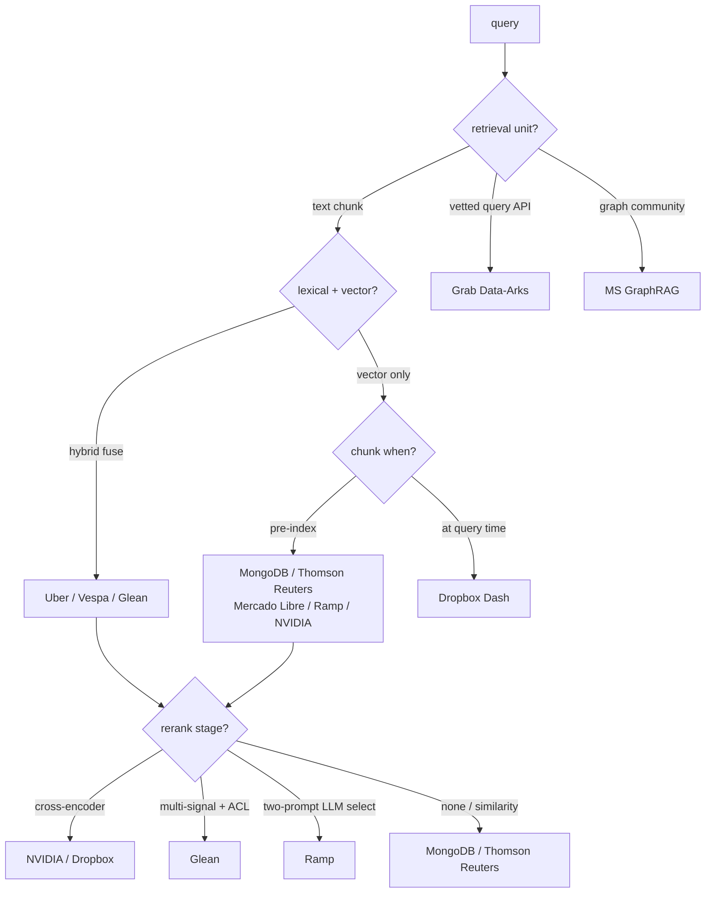
```mermaid
flowchart TD
  Q["query"] --> D1{"retrieval unit?"}
  D1 -->|"text chunk"| D2{"lexical + vector?"}
  D1 -->|"vetted query API"| GRAB["Grab Data-Arks"]
  D1 -->|"graph community"| MSFT["MS GraphRAG"]
  D2 -->|"vector only"| D3{"chunk when?"}
  D2 -->|"hybrid fuse"| HY["Uber / Vespa / Glean"]
  D3 -->|"pre-index"| PV["MongoDB / Thomson Reuters<br/>Mercado Libre / Ramp / NVIDIA"]
  D3 -->|"at query time"| DBX["Dropbox Dash"]
  HY --> RR{"rerank stage?"}
  PV --> RR
  RR -->|"cross-encoder"| NV["NVIDIA / Dropbox"]
  RR -->|"multi-signal + ACL"| GL["Glean"]
  RR -->|"two-prompt LLM select"| RAMP["Ramp"]
  RR -->|"none / similarity"| SIM["MongoDB / Thomson Reuters"]
```

**The choices, side by side.**

| Decision | Options (who) | What decides it |
| --- | --- | --- |
| Retrieval strategy | vector-only (MongoDB, Thomson Reuters, Mercado Libre, Ramp, NVIDIA); hybrid vec+BM25 (Uber, Vespa, Glean, Dropbox); query-API RAG (Grab); knowledge graph (MS, Glean) | whether exact terms and jargon matter, and if the corpus is docs, queries, or entities |
| Chunking and freshness | pre-index chunks (MongoDB, Thomson Reuters, Mercado Libre, Ramp); query-time chunk (Dropbox); sync + webhooks (Dropbox); non-parametric store updated live (Thomson Reuters); LLM-enriched offline (Uber) | index churn vs query latency, and how fast source data changes |
| Reranking | none / similarity-only (MongoDB, Thomson Reuters); cross-encoder (NVIDIA, Dropbox); two-prompt LLM select (Ramp); multi-signal permission-aware (Glean); community summaries (MS) | cost budget per query and how noisy first-stage recall is |
| Grounding and eval | verify-before-use (MongoDB); provenance citations (Thomson Reuters, MS); LLM-as-judge (Uber, Dropbox); accuracy@k tuning (Ramp, Vespa); stakeholder approval (Mercado Libre); source P/R/F1 (Dropbox, Glean) | regulated domains need provenance; open-ended needs a judge; enumerable labels use accuracy@k |

**The math that separates them.**

$$\text{recall@}k = \frac{1}{|Q|}\sum_{q \in Q}\frac{|R_q^{k}\cap G_q|}{|G_q|}$$

$$\text{RRF}(d) = \sum_{r\in\{\text{bm25},\,\text{vec}\}}\frac{1}{k_{\text{rrf}} + \text{rank}_r(d)}$$

$$F_1^{\text{source}} = \frac{2\,P\,R}{P+R},\qquad P = \frac{\text{relevant retrieved}}{\text{retrieved}},\quad R = \frac{\text{relevant retrieved}}{\text{relevant}}$$

$$C_{\text{rerank}} \approx \frac{1}{75}\,C_{\text{gen}} \;\Rightarrow\; \text{keep top-}m \ll n \text{ candidates before generation}$$

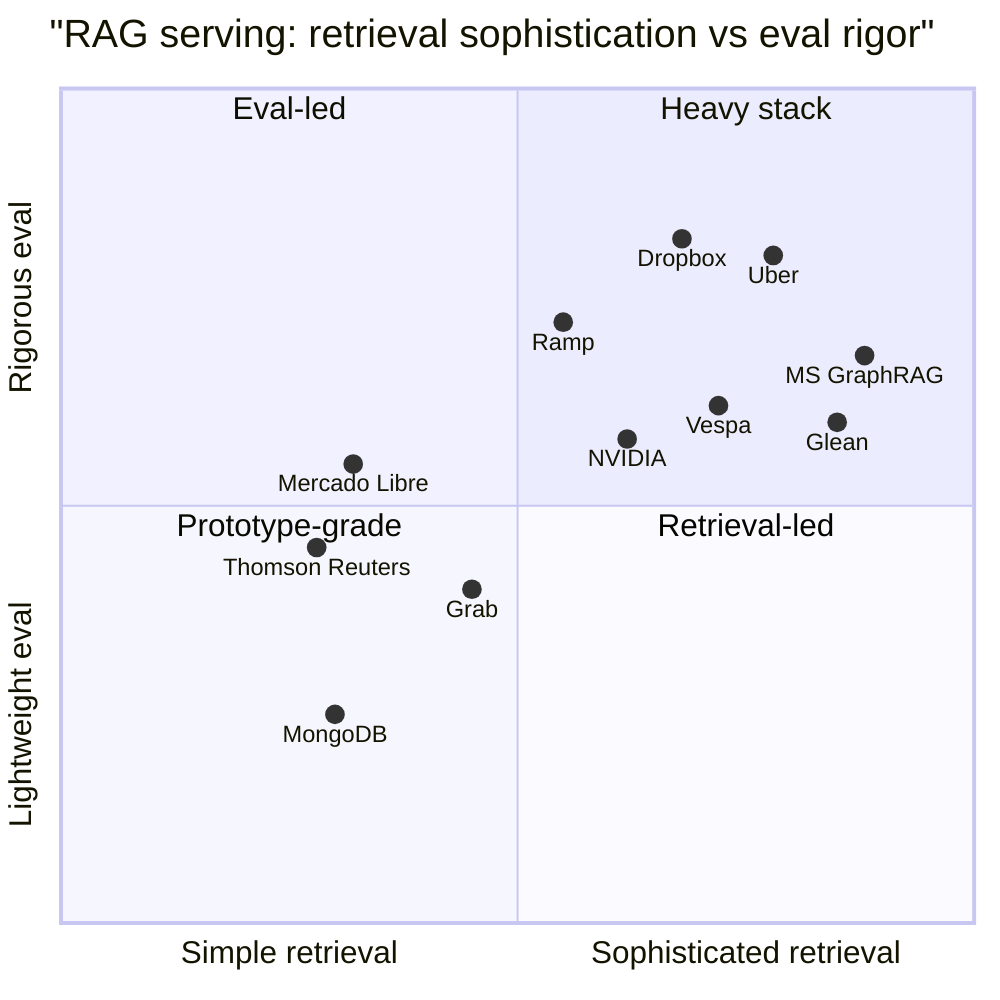
```mermaid
quadrantChart
  title "RAG serving: retrieval sophistication vs eval rigor"
  x-axis "Simple retrieval" --> "Sophisticated retrieval"
  y-axis "Lightweight eval" --> "Rigorous eval"
  quadrant-1 "Heavy stack"
  quadrant-2 "Eval-led"
  quadrant-3 "Prototype-grade"
  quadrant-4 "Retrieval-led"
  "MongoDB": [0.30, 0.25]
  "Thomson Reuters": [0.28, 0.45]
  "Mercado Libre": [0.32, 0.55]
  "Grab": [0.45, 0.40]
  "Ramp": [0.55, 0.72]
  "Dropbox": [0.68, 0.82]
  "Uber": [0.78, 0.80]
  "NVIDIA": [0.62, 0.58]
  "Vespa": [0.72, 0.62]
  "Glean": [0.85, 0.60]
  "MS GraphRAG": [0.88, 0.68]
```

**The systems**

- **Ramp** [From RAG to Richness: How Ramp Revamped Industry Classification](https://builders.ramp.com/post/industry_classification): Embedding-model selection plus two-prompt retrieval over NAICS codes, with precomputed embeddings. *(product design)*
- **Uber** [Enhanced Agentic-RAG: near-human precision for chatbots](https://www.uber.com/blog/enhanced-agentic-rag/): Pre-retrieval query agents, doc loaders, metadata enrichment, and LLM-as-judge eval. *(deployment)*
- **Microsoft Research** [GraphRAG: unlocking LLM discovery on narrative private data](https://www.microsoft.com/en-us/research/blog/graphrag-unlocking-llm-discovery-on-narrative-private-data/): Knowledge-graph retrieval beats vector-only RAG on multi-hop private-data queries. *(product design)*
- **DoorDash** [Path to high-quality LLM-based Dasher support automation](https://careersatdoordash.com/blog/large-language-modules-based-dasher-support-automation/): RAG support bot with an LLM guardrail and judge; 90% fewer hallucinations. *(eval bar)*
- **Dropbox** [Building Dash: how RAG and AI agents meet business needs](https://dropbox.tech/machine-learning/building-dash-rag-multi-step-ai-agents-business-users): Hybrid lexical plus chunking plus rerank retrieval balancing latency, freshness, cost. *(deployment)*
- **Vespa** [Embedding Tradeoffs, Quantified](https://blog.vespa.ai/embedding-tradeoffs-quantified/): INT8 and binary quantization plus hybrid BM25 quality-vs-latency tradeoffs. *(eval bar)*
- **Vespa** [Asymmetric Retrieval: spend on docs, embed queries for free](https://blog.vespa.ai/asymmetric-retrieval-spend-on-docs-queries-for-free/): A big model for docs, a tiny local model for queries, to cut serving cost. *(deployment)*
- **NVIDIA** [How a reranking microservice improves retrieval accuracy and cost](https://developer.nvidia.com/blog/how-using-a-reranking-microservice-can-improve-accuracy-and-costs-of-information-retrieval/): Two-stage embed-then-rerank; fewer chunks to the LLM cuts cost. *(eval bar)*
- **Glean** [Why vector search isn't enough for enterprise RAG](https://www.glean.com/blog/hybrid-vs-rag-vector): Enterprise RAG needs hybrid search plus knowledge graph and permissions. *(product design)*
- **Databricks** [Creating High Quality RAG Applications with Databricks](https://www.databricks.com/blog/building-high-quality-rag-applications-databricks): Real-time serving, model selection and eval, and quality monitoring for RAG. *(deployment)*
- **LinkedIn** [Improving Post Search at LinkedIn](https://www.linkedin.com/blog/engineering/search/improving-post-search-at-linkedin): Layered first and second-pass rankers with separate relevance, quality, freshness models. *(deployment)*
- **Pinterest** [How we built Text-to-SQL at Pinterest](https://medium.com/pinterest-engineering/how-we-built-text-to-sql-at-pinterest-30bad30dabff): RAG table retrieval grounds LLM SQL generation over thousands of warehouse tables. *(product design)*
- **Cloudflare** [Introducing AutoRAG: managed RAG on Cloudflare](https://blog.cloudflare.com/introducing-autorag-on-cloudflare/): A managed pipeline: async indexing, Vectorize storage, query-time retrieval plus generation. *(deployment)*
- **Vimeo** [Unlocking knowledge sharing for videos with RAG](https://medium.com/vimeo-engineering-blog/unlocking-knowledge-sharing-for-videos-with-rag-810ab496ae59): Video Q&A over transcript chunking, multi-size context windows, and vector retrieval. *(product design)*
- **Elastic** [RAG pipelines in production](https://www.elastic.co/search-labs/blog/rag-in-production): Operationalizing RAG with hybrid retrieval, reranking, monitoring, and benchmarking. *(deployment)*
- **Anyscale** [Building RAG-based LLM Applications for Production](https://www.anyscale.com/blog/a-comprehensive-guide-for-building-rag-based-llm-applications-part-1): End-to-end RAG built, evaluated, and served at scale with Ray Serve. *(deployment)*
- **GitHub** [What is retrieval-augmented generation?](https://github.blog/ai-and-ml/generative-ai/what-is-retrieval-augmented-generation-and-what-does-it-do-for-generative-ai/): How Copilot Enterprise grounds answers via internal code search and semantic retrieval. *(product design)*
- **Google / ETH Zurich** [RAGO: systematic performance optimization for RAG serving](https://arxiv.org/abs/2503.14649): A serving framework raising QPS per chip 2x and cutting time-to-first-token 55%. *(deployment)*
- **MongoDB** [Taking RAG to Production with the MongoDB Documentation AI Chatbot](https://www.mongodb.com/developer/products/atlas/taking-rag-to-production-documentation-ai-chatbot/): Atlas Vector Search docs chatbot, chunking and embedding-model choices, moved from prototype to production. *(deployment)*
- **Grab** [Leveraging RAG-powered LLMs for Analytical Tasks](https://engineering.grab.com/transforming-the-analytics-landscape-with-RAG-powered-LLM): Data-Arks middleware retrieves context to ground report-generation and fraud-investigation bots for analysts. *(product design)*
- **Mercado Libre** [Beyond the Hype: Real-World Lessons from Working with Large Language Models](https://medium.com/mercadolibre-tech/beyond-the-hype-real-world-lessons-and-insights-from-working-with-large-language-models-6d637e39f8f8): RAG over technical docs plus table-doc generation and structured extraction; raw LLMs need context and iteration. *(eval bar)*

---

### [Semantic search and embeddings](topics/08-semantic-search-and-embeddings.md) · 21 systems

**What they share.** Every system runs the same skeleton: offline, embed the corpus and build an ANN index; online, embed the query, retrieve approximate neighbors, and rescore a shortlist at higher precision. The divergence is not the spine but four knobs: which ANN structure, how hard vectors are compressed, whether a lexical channel runs alongside, and how heavy the final rerank is.

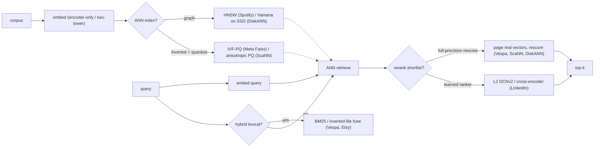
```mermaid
flowchart LR
  D["corpus"] --> E["embed (encoder-only / two-tower)"]
  E --> IDX{"ANN index?"}
  IDX -->|"graph"| G["HNSW (Spotify) / Vamana on SSD (DiskANN)"]
  IDX -->|"inverted + quantize"| P["IVF-PQ (Meta Faiss) / anisotropic PQ (ScaNN)"]
  Q["query"] --> EQ["embed query"]
  EQ --> RET["ANN retrieve"]
  G -.-> RET
  P -.-> RET
  Q --> HYB{"hybrid lexical?"}
  HYB -->|"yes"| LX["BM25 / inverted-file fuse (Vespa, Etsy)"]
  HYB -->|"no"| RET
  RET --> RR{"rerank shortlist?"}
  RR -->|"full-precision rescore"| RS["page real vectors, rescore (Vespa, ScaNN, DiskANN)"]
  RR -->|"learned ranker"| LR["L2 DCNv2 / cross-encoder (LinkedIn)"]
  RS --> RES["top-k"]
  LR --> RES
```

**The choices, side by side.**

| Decision | Options (who) | What decides it |
| --- | --- | --- |
| ANN index | `HNSW` (Spotify) vs `IVF-PQ` (Meta) vs `ScaNN` anisotropic (Google) vs `Vamana`/`DiskANN` (Microsoft) vs `HNSW-IF` (Vespa) | Does the corpus fit in RAM? Graph if yes; inverted-file plus SSD if billion-scale on a budget |
| quantization | `E4M3 8-bit float` (Spotify) vs `int8` (Vespa) vs `PQ 20-byte codes` (Meta) vs `anisotropic learned PQ` (Google) vs `4-bit PQ` (Etsy) vs `8-bit custom scaling` (Dropbox) | RAM budget per vector; MIPS ranking wants parallel-error penalty, not uniform reconstruction |
| hybrid/rerank | dense-only (Spotify) vs `HNSW + BM25/inverted-file` (Vespa, Etsy, Walmart) vs `SPLADE` sparse-neural (Faire); rescore: full-precision (Vespa depth 4000, ScaNN, DiskANN) vs learned `DCNv2` (LinkedIn) | Do exact-term / rare-token queries matter? Compressed first-phase scores are approximate, so rescore recovers precision |
| dimensionality | `fixed full dim` (Dropbox, to bound cosine error) vs `Matryoshka` nested (LinkedIn: 2048 retrieve, 4096 rank) vs multi-embedding fan-out (Pinterest, Instacart) | Dim sets index RAM and search time linearly; Matryoshka serves both stages from one training run |

**The math that separates them.**

$$\textbf{index memory (uncompressed)} = n_{vectors} \times dim \times bytes_{per\ elem}$$

$$\textbf{PQ compression ratio} = \frac{dim \times 4}{m \times \lceil b/8 \rceil}, \quad m\ \text{subspaces},\ b\ \text{bits/code}$$

$$\textbf{ScaNN anisotropic loss} = \eta \, \lVert r_{\parallel} \rVert^{2} + \lVert r_{\perp} \rVert^{2}, \quad r = x - \tilde{x},\ \eta > 1$$

$$\textbf{recall vs latency (graph)} = f(ef,\ M) \uparrow \ \Rightarrow\ recall \uparrow,\ latency \uparrow$$

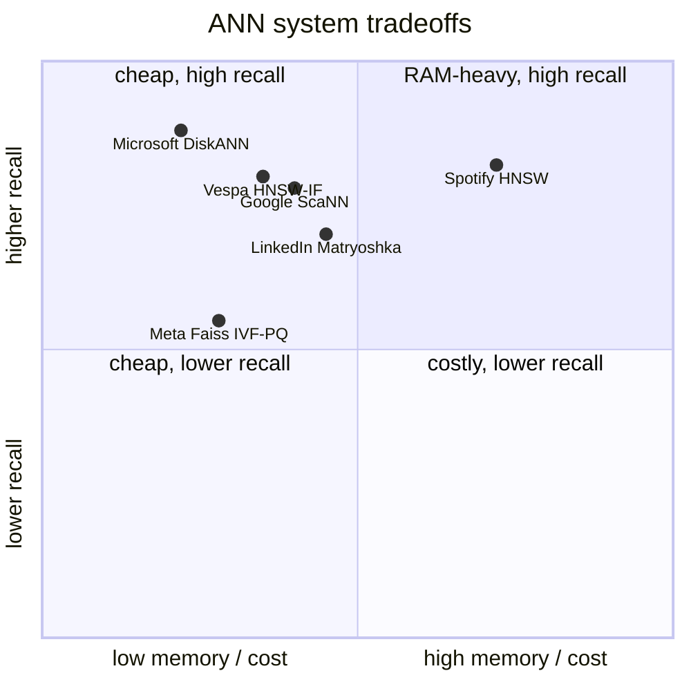
```mermaid
quadrantChart
  title ANN system tradeoffs
  x-axis "low memory / cost" --> "high memory / cost"
  y-axis "lower recall" --> "higher recall"
  quadrant-1 "RAM-heavy, high recall"
  quadrant-2 "cheap, high recall"
  quadrant-3 "cheap, lower recall"
  quadrant-4 "costly, lower recall"
  Spotify HNSW: [0.72, 0.82]
  Vespa HNSW-IF: [0.35, 0.80]
  Meta Faiss IVF-PQ: [0.28, 0.55]
  Google ScaNN: [0.40, 0.78]
  Microsoft DiskANN: [0.22, 0.88]
  LinkedIn Matryoshka: [0.45, 0.70]
```

**The systems**

- **Spotify** [Introducing Voyager: Spotify new nearest-neighbor search library](https://engineering.atspotify.com/2023/10/introducing-voyager-spotifys-new-nearest-neighbor-search-library): HNSW ANN library: recall versus speed versus memory tradeoffs, 8-bit compression. *(deployment)*
- **Vespa** [Billion-scale vector search using hybrid HNSW-IF](https://blog.vespa.ai/vespa-hybrid-billion-scale-vector-search/): In-memory HNSW plus disk-backed inverted files for 90% recall under 50ms, cheaply. *(deployment)*
- **LinkedIn** [Semantic Search for AI Agents at Scale](https://www.linkedin.com/blog/engineering/ai/semantic-search-for-ai-agents-at-scale-retrieval-and-ranking-for-linkedins-hiring-assistant): Two-stage ANN retrieval plus ranker over 1B+ profiles using Matryoshka embeddings. *(deployment)*
- **Pinterest** [Advancements in Embedding-Based Retrieval at Pinterest Homefeed](https://medium.com/pinterest-engineering/advancements-in-embedding-based-retrieval-at-pinterest-homefeed-d7d7971a409e): Two-tower embedding retrieval with multi-embedding ANN and interest filters. *(deployment)*
- **Meta** [Faiss: a library for efficient similarity search](https://engineering.fb.com/2017/03/29/data-infrastructure/faiss-a-library-for-efficient-similarity-search/): A GPU-accelerated billion-scale similarity search library powering retrieval. *(deployment)*
- **Google Research** [Announcing ScaNN: efficient vector similarity search](https://research.google/blog/announcing-scann-efficient-vector-similarity-search/): Anisotropic quantization wins recall-vs-QPS on ann-benchmarks. *(eval bar)*
- **Microsoft Research** [DiskANN: vector search for all](https://www.microsoft.com/en-us/research/project/project-akupara-approximate-nearest-neighbor-search-for-large-scale-semantic-search/): SSD-backed ANN: billion vectors, 95% recall, about 5ms latency. *(deployment)*
- **Meta** [Embedding-based Retrieval in Facebook Search](https://arxiv.org/abs/2006.11632): A unified embedding framework for personalized social search. *(product design)*
- **Instacart** [How Instacart uses embeddings to improve search relevance](https://company.instacart.com/how-its-made/how-instacart-uses-embeddings-to-improve-search-relevance): A two-tower items model served via FAISS ANN with daily indices. *(deployment)*
- **Etsy** [Unified Embedding Based Personalized Retrieval in Etsy Search](https://arxiv.org/abs/2306.04833): Graph, transformer, and term embeddings with HNSW and 4-bit PQ. *(product design)*
- **Airbnb** [Applying Embedding-Based Retrieval to Airbnb Search](https://arxiv.org/abs/2601.06873): EBR for a two-sided marketplace, A/B-tested booking gains. *(who it serves)*
- **Uber Eats** [Scaling Multilingual Semantic Search in Uber Eats](https://arxiv.org/abs/2603.06586): Multilingual retrieval across stores, dishes, grocery in six markets. *(deployment)*
- **Walmart** [Semantic Retrieval at Walmart](https://arxiv.org/abs/2412.04637): Hybrid inverted-index plus neural retrieval for tail product queries. *(product design)*
- **Dropbox** [Selecting a model for semantic search at Dropbox scale](https://dropbox.tech/machine-learning/selecting-model-semantic-search-dropbox-ai): Benchmarking 11 embedding models on MTEB to pick multilingual-e5-large for retrieval. *(eval bar)*
- **GitHub** [Inside Copilot's new code embedding model](https://github.blog/news-insights/product-news/copilot-new-embedding-model-vs-code/): A custom code embedding model lifting Copilot retrieval quality 37.6% at lower latency. *(eval bar)*
- **Faire** [Beyond BM25 and dense embeddings: smart, interpretable retrieval](https://craft.faire.com/beyond-bm25-and-dense-embeddings-841a7b18ce27): SPLADE sparse neural retrieval giving interpretable semantics over Elasticsearch. *(product design)*
- **Snap** [Embedding-based Retrieval with Two-Tower Models in Spotlight](https://eng.snap.com/embedding-based-retrieval): Two-tower user/video embeddings for real-time short-form recommendation retrieval. *(deployment)*
- **Yelp** [Yelp Content As Embeddings](https://engineeringblog.yelp.com/2023/04/yelp-content-as-embeddings.html): Shared low-dimensional embeddings of reviews, businesses, and photos as a ranking baseline. *(deployment)*
- **Stack Overflow** [Vector databases in generative AI applications](https://stackoverflow.blog/2023/10/09/from-prototype-to-production-vector-databases-in-generative-ai-applications/): A self-hosted Weaviate vector database on Azure for production semantic search. *(deployment)*
- **Mercari** [Domain-Aware Text Embeddings for C2C Marketplaces](https://arxiv.org/abs/2512.21021): Domain-aware text embeddings improving search for Japan's largest C2C marketplace. *(product design)*
- **Amazon** [Semantic Product Search](https://arxiv.org/abs/1907.00937): A KDD 2019 two-tower model with kNN retrieval over precomputed catalog embeddings. *(product design)*

---

### [Long-context and the KV cache](topics/02-long-context-and-kv-cache.md) · 20 systems

**What they share.** Every system runs one two-phase loop: prefill builds a KV cache once, then decode reuses that cache one token at a time, memory-bandwidth bound. All the divergence is in how each entry is shrunk, reused, or dropped against the same `kv_bytes` formula.

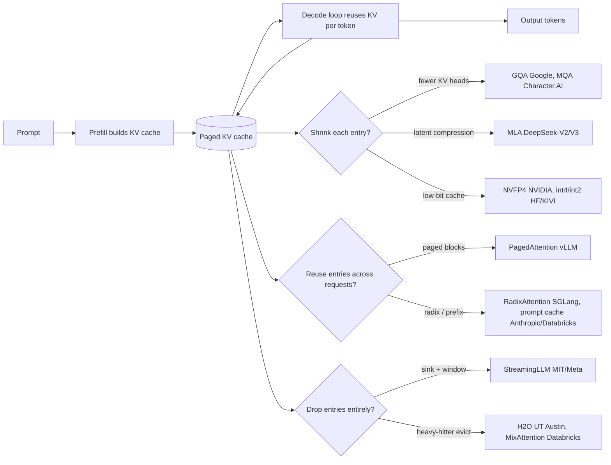
```mermaid
flowchart LR
  P[Prompt] --> PF[Prefill builds KV cache]
  PF --> KV[(Paged KV cache)]
  KV --> D[Decode loop reuses KV per token]
  D --> KV
  D --> O[Output tokens]

  KV --> B1{Shrink each entry?}
  B1 -->|fewer KV heads| GQA[GQA Google, MQA Character.AI]
  B1 -->|latent compression| MLA[MLA DeepSeek-V2/V3]
  B1 -->|low-bit cache| QNT[NVFP4 NVIDIA, int4/int2 HF/KIVI]

  KV --> B2{Reuse entries across requests?}
  B2 -->|paged blocks| PAG[PagedAttention vLLM]
  B2 -->|radix / prefix| RDX[RadixAttention SGLang, prompt cache Anthropic/Databricks]

  KV --> B3{Drop entries entirely?}
  B3 -->|sink + window| STR[StreamingLLM MIT/Meta]
  B3 -->|heavy-hitter evict| H2O[H2O UT Austin, MixAttention Databricks]
```

**The choices, side by side.**

| Decision | Options (who) | What decides it |
| --- | --- | --- |
| attention KV sharing | `MHA` (baseline) vs `GQA` (Google, Llama-3) vs `MLA` (DeepSeek) vs `MQA` (Character.AI) | how much of the `kv_heads` term you cut vs quality floor; MLA is train-time, GQA converts cheaply, MQA is most aggressive |
| memory management | `paged` (vLLM) vs `radix/prefix cache` (SGLang, Anthropic, Databricks) vs `eviction` (StreamingLLM, H2O) | reuse across requests when prefixes repeat; drop when the middle is expendable; page when fragmentation is the wall |
| quantization | `NVFP4 4-bit` (NVIDIA) vs `int8 native` (Character.AI) vs `int4/int2 per-token` (HF, KIVI) | memory headroom vs eval-gated quality; native-int8 needs custom kernels, PTQ needs per-channel scales |
| cross-layer / window sharing | `sliding window` (Databricks MixAttention, Character.AI 5-of-6) vs `cross-layer KV reuse` (Character.AI 2-3x, MA-Pairs) vs `full attention` (MHA) | long-range recall vs cache size; keep full-attention layers deep, cap sharing or reading-comprehension regresses |

**The math that separates them.**

**KV cache bytes (the term everyone attacks):**
$$ \mathrm{kv\_bytes} \approx 2 \cdot L \cdot S \cdot h_{kv} \cdot d_{head} \cdot b \cdot B $$

**GQA sharing ratio (32 query, 8 KV heads):**
$$ r_{GQA} = \frac{h_{kv}}{h_q} = \frac{8}{32} = \frac{1}{4} $$

**MLA latent compression (cache $d_c$, not K and V):**
$$ r_{MLA} = \frac{d_c}{2 \cdot h_{kv} \cdot d_{head}} \approx 0.07 \quad (\text{about } 93\% \text{ smaller}) $$

**Low-bit KV vs FP8 (NVFP4 halves memory):**
$$ r_{quant} = \frac{b_{lo}}{b_{hi}} = \frac{4}{8} = \frac{1}{2} \Rightarrow 2\times \text{ context, batch, concurrency} $$

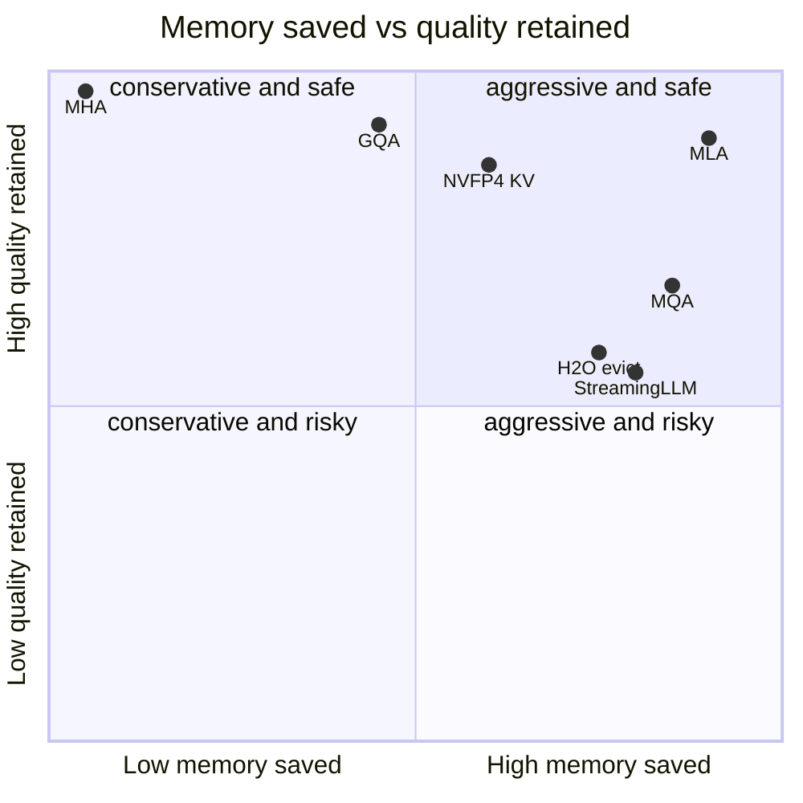
```mermaid
quadrantChart
  title Memory saved vs quality retained
  x-axis Low memory saved --> High memory saved
  y-axis Low quality retained --> High quality retained
  quadrant-1 aggressive and safe
  quadrant-2 conservative and safe
  quadrant-3 conservative and risky
  quadrant-4 aggressive and risky
  MHA: [0.05, 0.97]
  GQA: [0.45, 0.92]
  MLA: [0.9, 0.9]
  NVFP4 KV: [0.6, 0.86]
  MQA: [0.85, 0.68]
  StreamingLLM: [0.8, 0.55]
  H2O evict: [0.75, 0.58]
```

**The systems**

- **vLLM (UC Berkeley)** [Efficient Memory Management for LLM Serving with PagedAttention](https://arxiv.org/abs/2309.06180): OS-style KV-cache paging cuts fragmentation, boosting throughput 2x to 4x. *(deployment)*
- **Character.AI** [Optimizing AI Inference at Character.AI](https://blog.character.ai/optimizing-ai-inference-at-character-ai-2/): MQA, hybrid local/global attention, and cross-layer KV-sharing cut cost 33x. *(deployment)*
- **DeepSeek** [DeepSeek-V2: a strong, economical, efficient MoE language model](https://arxiv.org/abs/2405.04434): Multi-head Latent Attention compresses the KV cache into a latent vector, shrinking it 93%. *(product design)*
- **Google Research** [GQA: Training Generalized Multi-Query Transformer Models](https://arxiv.org/abs/2305.13245): Grouped-query attention trades KV heads for speed at near-MHA quality. *(product design)*
- **NVIDIA** [5x faster time to first token with TensorRT-LLM KV cache early reuse](https://developer.nvidia.com/blog/5x-faster-time-to-first-token-with-nvidia-tensorrt-llm-kv-cache-early-reuse/): Early KV reuse, flexible block sizing, and smart eviction cut TTFT. *(deployment)*
- **NVIDIA** [Optimizing inference with NVFP4 KV cache](https://developer.nvidia.com/blog/optimizing-inference-for-long-context-and-large-batch-sizes-with-nvfp4-kv-cache/): 4-bit KV cache halves memory vs FP8, doubling context with under 1% loss. *(deployment)*
- **Databricks** [Inference-Friendly Models with MixAttention](https://www.databricks.com/blog/mixattention): Cross-layer KV sharing plus sliding-window attention shrinks the cache. *(product design)*
- **Databricks** [Accelerating LLM inference with prompt caching](https://www.databricks.com/blog/accelerating-llm-inference-prompt-caching-open-source-models-databricks): Automatic prefix KV reuse: 2.5x throughput, 3x lower P50 latency. *(deployment)*
- **llm-d** [KV-Cache wins you can see: prefix caching to distributed scheduling](https://llm-d.ai/blog/kvcache-wins-you-can-see): Single-instance prefix caching breaks in clusters; cache-aware scheduling fixes it. *(deployment)*
- **LMSYS / SGLang** [Fast and expressive LLM inference with RadixAttention](https://www.lmsys.org/blog/2024-01-17-sglang/): A radix-tree KV cache enables automatic cross-request prefix reuse. *(deployment)*
- **Together AI** [Serving MiniMax-M3: 1M-token context without regrets](https://www.together.ai/blog/serving-minimax-m3-for-efficient-inference-unlocking-1m-token-context-and-multimodality-without-regrets): Paged sparse attention and KV-block-major kernels make 1M-token serving practical. *(deployment)*
- **Hugging Face** [Unlocking longer generation with KV cache quantization](https://huggingface.co/blog/kv-cache-quantization): Per-token int4 KV quantization yields about 2.5x memory savings. *(product design)*
- **KIVI** [A tuning-free asymmetric 2-bit quantization for KV cache](https://arxiv.org/abs/2402.02750): Per-channel keys and per-token values enable 2-bit KV compression. *(product design)*
- **MIT / Meta** [Efficient Streaming Language Models with Attention Sinks](https://arxiv.org/abs/2309.17453): The attention-sink insight lets fixed-window LLMs stream to millions of tokens. *(product design)*
- **Anthropic** [Prompt caching with Claude](https://claude.com/blog/prompt-caching): Caches reused context across API calls, cutting cost up to 90% and latency 85%. *(product design)*
- **Colfax / Together** [FlashAttention-3: fast, accurate attention with asynchrony and low precision](https://arxiv.org/abs/2407.08608): Hopper-optimized attention via warp-specialization and FP8, 1.5-2x faster. *(deployment)*
- **UT Austin / Stanford** [H2O: Heavy-Hitter Oracle for efficient generative inference](https://arxiv.org/abs/2306.14048): KV-cache eviction keeping recent plus heavy-hitter tokens, up to 29x throughput. *(deployment)*
- **UIUC / Cohere** [SnapKV: LLM knows what you are looking for before generation](https://arxiv.org/abs/2404.14469): Fine-tuning-free KV compression via observation-window clustering, 3.6x faster decode. *(product design)*
- **Fireworks AI** [FireAttention V2: long contexts practical for online inference](https://fireworks.ai/blog/fireattention-v2-long-context-inference): Production long-context kernels with FP8 prefill and multi-host deployment. *(deployment)*
- **Microsoft** [MInference 1.0: accelerating pre-filling via dynamic sparse attention](https://arxiv.org/abs/2407.02490): Dynamic sparse attention cuts long-context prefill latency up to 10x. *(deployment)*

---

### [Inference serving at scale](topics/04-inference-serving-at-scale.md) · 16 systems

**What they share.** Every stack lands a request on a router, feeds a continuous (iteration-level) batching scheduler that reshapes the batch each token step, runs prefill then memory-bandwidth-bound decode, and streams tokens back while an SLO-driven autoscaler adds or drops replicas. What differs is only which stage each team pushed hardest.

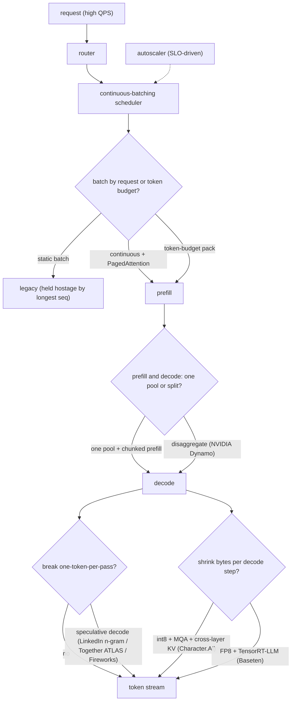
```mermaid
flowchart TD
  REQ["request (high QPS)"] --> RT["router"]
  RT --> SCH["continuous-batching scheduler"]
  SCH --> B1{"batch by request or token budget?"}
  B1 -->|"static batch"| LEGACY["legacy (held hostage by longest seq)"]
  B1 -->|"continuous + PagedAttention"| PRE["prefill"]
  B1 -->|"token-budget pack"| PRE
  PRE --> B2{"prefill and decode: one pool or split?"}
  B2 -->|"one pool + chunked prefill"| DEC["decode"]
  B2 -->|"disaggregate (NVIDIA Dynamo)"| DEC
  DEC --> B3{"break one-token-per-pass?"}
  B3 -->|"no"| OUT["token stream"]
  B3 -->|"speculative decode (LinkedIn n-gram / Together ATLAS / Fireworks)"| OUT
  DEC --> B4{"shrink bytes per decode step?"}
  B4 -->|"int8 + MQA + cross-layer KV (Character.AI)"| OUT
  B4 -->|"FP8 + TensorRT-LLM (Baseten)"| OUT
  AUTO["autoscaler (SLO-driven)"] -.-> SCH
```

**The choices, side by side.**

| Decision | Options (who) | What decides it |
| --- | --- | --- |
| batching | `continuous` + PagedAttention (vLLM/Anyscale) vs `static` vs `token-budget pack` (Baseten BEI) | Output-length variance: high variance rewards iteration-level scheduling; variable prompt length rewards packing to a token budget over a request count |
| latency lever | `speculative decoding` (LinkedIn n-gram, Together ATLAS, Fireworks) vs `disaggregated prefill/decode` (NVIDIA Dynamo) | Draft acceptance rate vs whether prefill and decode SLOs genuinely conflict; disaggregation needs fast interconnect for the KV handoff |
| parallelism | TP (in-node, per-layer all-reduce) vs PP (across nodes, stage boundaries) vs EP (MoE expert sharding) | TP for latency and to fit the model on fast links; PP to scale past a node; EP once experts outnumber a GPU |
| quantization | `int8` weight + KV (Character.AI) vs `FP8` on H100 (Baseten, Modal) vs `4-bit` for fit / cold-start | Decode is bandwidth-bound so fewer bytes read = more tokens/s; every precision drop passes a quality eval (Baseten holds cosine similarity > 99%) |

**The math that separates them.**

$$\textbf{decode step time} \approx \frac{P \cdot b_w + N \cdot \text{KV}_{\text{bytes}}}{\text{HBM bandwidth}}$$

$$\textbf{KV-cache bytes per token} = 2 \cdot L \cdot n_{kv} \cdot d_{head} \cdot b_{kv}$$

$$\textbf{speculative acceptance speedup} = \frac{1 - \alpha^{k+1}}{(1 - \alpha)\,(1 + c\,k)}$$

$$\textbf{arithmetic intensity vs roofline} \;\Rightarrow\; \text{tokens/s} = \min\!\left(\frac{\text{FLOPs}}{\text{op count}},\; \frac{\text{bandwidth}}{\text{bytes moved}}\right)$$

where $P$ = weight params, $b_w$ = weight bytes/param, $N$ = batched sequences, $L$ = layers, $n_{kv}$ = KV heads (MQA drives to 1), $b_{kv}$ = KV bytes/element, $\alpha$ = draft acceptance rate, $k$ = draft length, $c$ = per-token verify overhead.

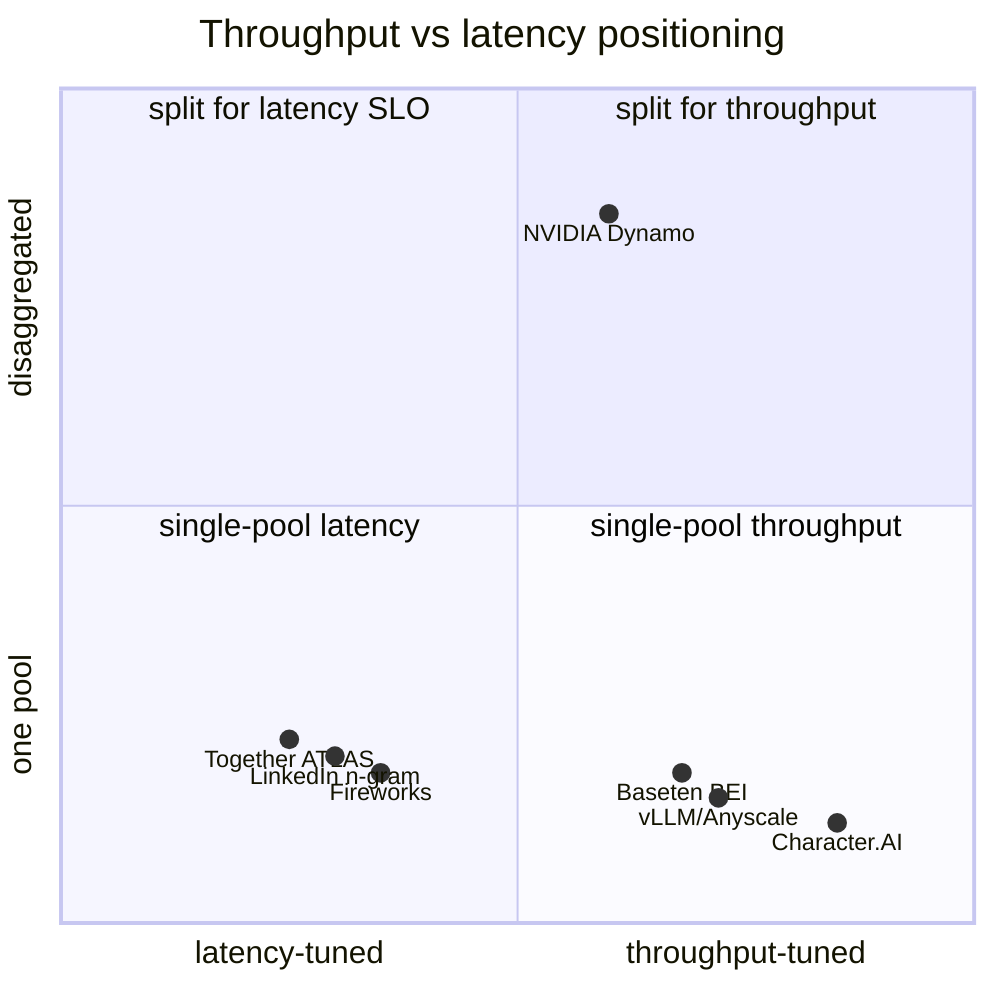
```mermaid
quadrantChart
  title Throughput vs latency positioning
  x-axis "latency-tuned" --> "throughput-tuned"
  y-axis "one pool" --> "disaggregated"
  quadrant-1 "split for throughput"
  quadrant-2 "split for latency SLO"
  quadrant-3 "single-pool latency"
  quadrant-4 "single-pool throughput"
  "vLLM/Anyscale": [0.72, 0.15]
  "Character.AI": [0.85, 0.12]
  "Baseten BEI": [0.68, 0.18]
  "LinkedIn n-gram": [0.30, 0.20]
  "Together ATLAS": [0.25, 0.22]
  "Fireworks": [0.35, 0.18]
  "NVIDIA Dynamo": [0.60, 0.85]
```

**The systems**

- **Anyscale** [How continuous batching enables 23x throughput in LLM inference](https://www.anyscale.com/blog/continuous-batching-llm-inference): Iteration-level scheduling plus PagedAttention beat static batching up to 23x. *(deployment)*
- **Character.AI** [Optimizing AI Inference at Character.AI](https://blog.character.ai/optimizing-ai-inference-at-character-ai/): MQA, cross-layer KV sharing, and int8 quant cut serving cost 13.5x. *(deployment)*
- **LinkedIn** [Accelerating LLM inference with speculative decoding](https://www.linkedin.com/blog/engineering/ai/accelerating-llm-inference-with-speculative-decoding-lessons-from-linkedins-hiring-assistant): N-gram speculative decoding gave 4x throughput and 66% lower P90 latency. *(eval bar)*
- **Baseten** [How we built BEI: high-throughput embedding, reranker, classifier inference](https://www.baseten.co/blog/how-we-built-bei-high-throughput-embedding-inference/): Batching, backpressure, FP8, and TensorRT-LLM for 2x higher-throughput serving. *(deployment)*
- **NVIDIA** [NVIDIA Dynamo: a low-latency distributed inference framework](https://developer.nvidia.com/blog/introducing-nvidia-dynamo-a-low-latency-distributed-inference-framework-for-scaling-reasoning-ai-models/): Disaggregated serving with prefill and decode separation and routing. *(deployment)*
- **Together AI** [ATLAS: runtime-learning speculative decoding](https://www.together.ai/blog/adaptive-learning-speculator-system-atlas): Speculative decoding that adapts to live traffic for large speedups. *(product design)*
- **Fireworks AI** [FireOptimizer: customizing latency and quality](https://fireworks.ai/blog/fireoptimizer): Adaptive speculative decoding and per-workload config tuning. *(product design)*
- **Modal** [High-performance LLM inference](https://modal.com/docs/guide/high-performance-llm-inference): Engine choice, quantization, CUDA graphs, and snapshots for throughput. *(deployment)*
- **Databricks** [LLM inference performance engineering: best practices](https://www.databricks.com/blog/llm-inference-performance-engineering-best-practices): Prefill and decode, batching, hardware selection, and latency metrics. *(eval bar)*
- **Google** [Fast inference from transformers via speculative decoding](https://arxiv.org/abs/2211.17192): Draft-then-verify decoding: 2-3x speedup with identical outputs. *(product design)*
- **Baseten** [The Baseten inference stack](https://www.baseten.co/resources/guide/the-baseten-inference-stack/): Multi-cloud autoscaling, routing, custom kernels, and speculation. *(deployment)*
- **Moonshot AI** [Mooncake: a KVCache-centric disaggregated architecture](https://arxiv.org/abs/2407.00079): Kimi's prefill/decode-disaggregated serving with a pooled CPU/DRAM/SSD KV cache. *(deployment)*
- **Microsoft** [Splitwise: efficient generative LLM inference using phase splitting](https://arxiv.org/abs/2311.18677): Splits prefill and decode onto separate machines for cost and throughput. *(deployment)*
- **Peking University / UCSD** [DistServe: disaggregating prefill and decoding](https://arxiv.org/abs/2401.09670): Disaggregates prefill and decode across GPUs to optimize goodput under SLOs. *(deployment)*
- **Microsoft Research** [Sarathi-Serve: taming the throughput-latency tradeoff](https://arxiv.org/abs/2403.02310): Chunked-prefills and stall-free scheduling balance throughput against latency. *(deployment)*
- **Snowflake** [Arctic Inference with Shift Parallelism](https://www.snowflake.com/en/blog/engineering/arctic-inference-shift-parallelism/): A vLLM plugin with dynamic shift parallelism adapting to real traffic. *(deployment)*

---

### [Realtime streaming chat](topics/10-realtime-streaming-chat.md) · 17 systems

**What they share.** Every system carries the same spine: an LLM emits tokens, a transport streams them out, the client renders incrementally, and session memory feeds history back into the next turn. The forks are transport, whether the medium is text or voice, and how each fights per-hop latency.

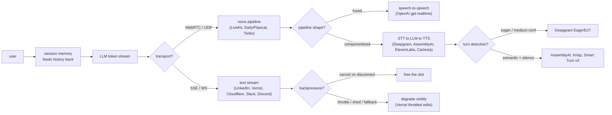
```mermaid
flowchart LR
  U["user"] --> MEM["session memory<br/>feeds history back"]
  MEM --> LLM["LLM token stream"]
  LLM --> D1{"transport?"}
  D1 -->|"SSE / WS"| TX["text stream<br/>(LinkedIn, Vercel, Cloudflare, Slack, Discord)"]
  D1 -->|"WebRTC / UDP"| VO["voice pipeline<br/>(LiveKit, Daily/Pipecat, Twilio)"]
  VO --> D2{"pipeline shape?"}
  D2 -->|"fused"| S2S["speech-to-speech<br/>(OpenAI gpt-realtime)"]
  D2 -->|"componentized"| CMP["STT to LLM to TTS<br/>(Deepgram, AssemblyAI, ElevenLabs, Cartesia)"]
  CMP --> D3{"turn detection?"}
  D3 -->|"eager / medium-conf"| EAG["Deepgram EagerEoT"]
  D3 -->|"semantic + silence"| SEM["AssemblyAI, Krisp, Smart Turn v3"]
  TX --> D4{"backpressure?"}
  D4 -->|"cancel on disconnect"| BP["free the slot"]
  D4 -->|"throttle / shed / fallback"| DEG["degrade visibly<br/>(Vercel throttled edits)"]
```

**The choices, side by side.**

| Decision | Options (who) | What decides it |
| --- | --- | --- |
| transport | `SSE` (Vercel/OpenAI text) vs `WebSocket` (Cloudflare DO, Slack, Discord) vs `WebRTC/UDP` (LiveKit, Daily/Pipecat) | Text tolerates ordered TCP; voice cannot, because a 200ms TCP retransmit stalls all buffered audio (head-of-line blocking) |
| pipeline | `text stream` (LinkedIn, Vercel) vs `fused speech-to-speech` (OpenAI gpt-realtime-mini) vs `componentized STT-LLM-TTS` (Deepgram/AssemblyAI/ElevenLabs/Cartesia) | Fused = lowest latency, black-box turn detect, no inspectable transcript; componentized = debuggable, tunable, more hops to add up |
| turn detection | model-side (OpenAI) vs eager medium-confidence (Deepgram) vs semantic+acoustic+silence (AssemblyAI ~300ms, Krisp 6M-weight CPU, Smart Turn v3 12ms CPU) | Silence-only gives awkward pauses; eager cuts latency but misfires on half-utterances; semantic detects true end-of-turn |
| session/memory | shared prompt templates (LinkedIn) vs Durable Object per-connection UUID (Cloudflare) vs Redis/PostgreSQL locks+kv (Vercel) vs stateful channel servers (Slack 500ms, Discord GenServer 5M concurrent) | Sticky routing to the replica holding cached KV; without stickiness every turn is a full-prefill cache miss |
| backpressure/degradation | cancel on disconnect + continuous batching (generic) vs throttled edit-loop fallback (Vercel) vs queue/shed/fall-back-to-smaller-model (generic) | Each stream holds an inference slot for its whole generation, so orphaned streams silently eat capacity |

**The math that separates them.**

$$\textbf{End-to-end text latency:}\quad T_{\text{felt}} = T_{\text{TTFT}} + (N-1)\cdot t_{\text{inter}}$$

$$\textbf{Voice pipeline latency sum:}\quad L_{\text{voice}} = L_{\text{STT}} + L_{\text{turn}} + L_{\text{LLM}} + L_{\text{TTS}} + L_{\text{net}}$$

$$\textbf{Eager speculation cost tradeoff:}\quad C_{\text{LLM}} = C_{\text{base}}\cdot(1 + p_{\text{resume}}),\quad p_{\text{resume}} \approx 0.5 \text{ to } 0.7$$

$$\textbf{Per-turn prefill grows with history:}\quad T_{\text{prefill}} \propto (1 - h_{\text{cache}})\cdot L_{\text{ctx}}$$

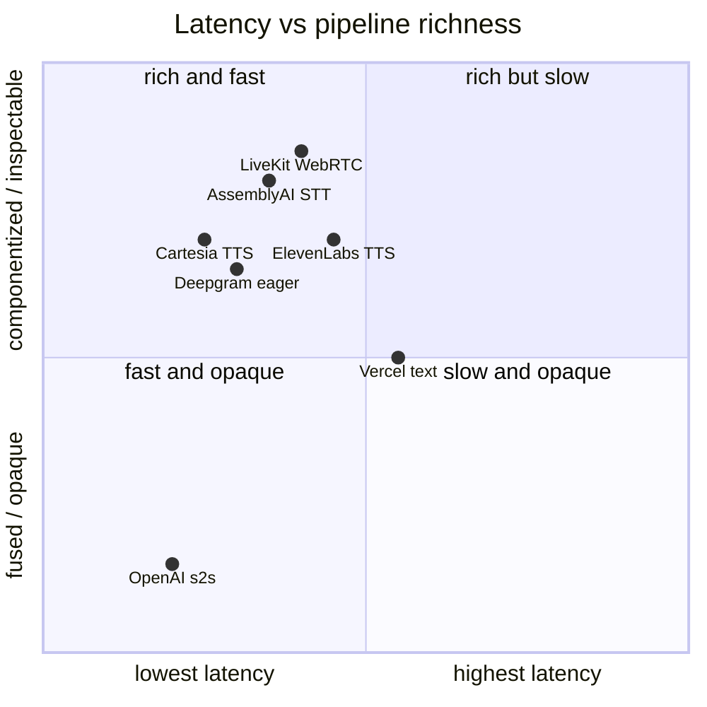
```mermaid
quadrantChart
  title Latency vs pipeline richness
  x-axis "lowest latency" --> "highest latency"
  y-axis "fused / opaque" --> "componentized / inspectable"
  quadrant-1 "rich but slow"
  quadrant-2 "rich and fast"
  quadrant-3 "fast and opaque"
  quadrant-4 "slow and opaque"
  OpenAI s2s: [0.2, 0.15]
  Cartesia TTS: [0.25, 0.7]
  AssemblyAI STT: [0.35, 0.8]
  Deepgram eager: [0.3, 0.65]
  ElevenLabs TTS: [0.45, 0.7]
  LiveKit WebRTC: [0.4, 0.85]
  Vercel text: [0.55, 0.5]
```

**The systems**

- **LinkedIn** [Musings on building a Generative AI product](https://www.linkedin.com/blog/engineering/generative-ai/musings-on-building-a-generative-ai-product): End-to-end token streaming and progressive parsing to cut perceived latency. *(deployment)*
- **Cloudflare** [Durable Objects for WebSockets and auth in AI Gateway](https://blog.cloudflare.com/do-it-again/): Scaling persistent WebSocket connections for concurrent AI inference streams. *(deployment)*
- **Vercel** [Chat SDK brings agents to your users](https://vercel.com/blog/chat-sdk-brings-agents-to-your-users): Streaming responses cross-platform via native streaming versus a throttled fallback. *(product design)*
- **OpenAI** [Updates for developers building with voice](https://developers.openai.com/blog/updates-audio-models): New audio model snapshots for STT, TTS, and realtime speech-to-speech. *(product design)*
- **LiveKit** [Why WebRTC beats WebSockets for realtime voice AI](https://livekit.com/blog/why-webrtc-beats-websockets-for-voice-ai-agents): WebRTC handles packet loss, jitter, and congestion better than TCP. *(deployment)*
- **LiveKit** [Why you shouldn't build voice agents directly on model APIs](https://livekit.com/blog/real-time-voice-agents-vs-model-apis): Model APIs lack transport, echo cancellation, and turn detection. *(deployment)*
- **Deepgram** [Optimize voice agent latency with eager end of turn](https://developers.deepgram.com/docs/flux/voice-agent-eager-eot): Start the LLM on medium-confidence transcripts to overlap with speech. *(deployment)*
- **AssemblyAI** [Universal-Streaming: ultra-fast speech-to-text for voice agents](https://www.assemblyai.com/blog/introducing-universal-streaming): Immutable streaming transcripts in about 300ms with intelligent endpointing. *(eval bar)*
- **ElevenLabs** [Enhancing conversational AI latency with efficient TTS](https://elevenlabs.io/blog/enhancing-conversational-ai-latency-with-efficient-tts-pipelines): Reducing streaming TTS time-to-first-byte for responsive conversation. *(deployment)*
- **Daily** [Benchmarking LLMs for voice agent use cases](https://www.daily.co/blog/benchmarking-llms-for-voice-agent-use-cases/): An open benchmark for latency, tool calling, and instruction adherence in voice. *(eval bar)*
- **Cartesia** [Announcing Sonic: a low-latency voice model](https://cartesia.ai/blog/sonic): A state-space TTS hitting 135ms model latency for streaming voice agents. *(product design)*
- **Krisp** [A 6M-weight turn-taking model for voice AI agents](https://krisp.ai/blog/turn-taking-for-voice-ai/): A tiny CPU turn-detection model deciding when agents speak, listen, or wait. *(product design)*
- **Twilio** [Introducing Media Streams](https://www.twilio.com/en-us/blog/media-streams-public-beta): Forks raw call audio over WebSockets for real-time bidirectional voice apps. *(deployment)*
- **Vapi** [How we built Vapi's voice AI pipeline (part 2)](https://vapi.ai/blog/how-we-built-vapi-s-voice-ai-pipeline-part-2): VAD, endpointing, streaming STT, and inference coordination for low-latency voice. *(deployment)*
- **Daily (Pipecat)** [Smart Turn v3, with CPU inference in 12ms](https://www.daily.co/blog/announcing-smart-turn-v3-with-cpu-inference-in-just-12ms/): An open-source semantic-VAD turn-detection model, 8MB, 23 languages, CPU-friendly. *(product design)*
- **Slack** [Real-time Messaging](https://slack.engineering/real-time-messaging/): A stateful WebSocket gateway and channel servers deliver messages globally in 500ms. *(deployment)*
- **Discord** [How Discord Scaled Elixir to 5,000,000 Concurrent Users](https://discord.com/blog/how-discord-scaled-elixir-to-5-000-000-concurrent-users): Elixir GenServer sessions and Manifold fan-out for millions of concurrent WebSockets. *(deployment)*

---

### [Cost optimization and model routing](topics/11-cost-optimization-and-model-routing.md) · 9 systems

**What they share.** Every lever moves a query left on one quality-cost frontier by matching cheap paths to easy work and reserving the frontier model for the hard tail. All sit upstream of the model call in a gateway, and all live or die on one knob calibrated against a quality eval.

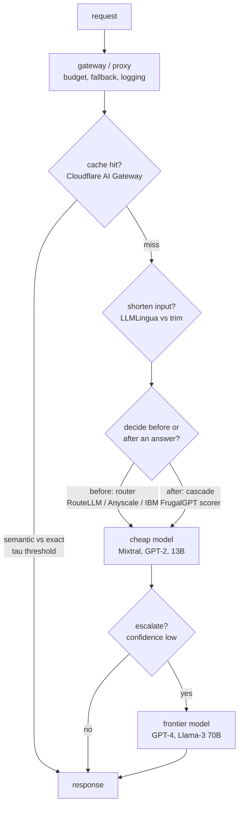
```mermaid
flowchart TD
  REQ["request"] --> GW["gateway / proxy<br/>budget, fallback, logging"]
  GW --> D1{"cache hit?<br/>Cloudflare AI Gateway"}
  D1 -->|"semantic vs exact<br/>tau threshold"| OUT["response"]
  D1 -->|"miss"| D2{"shorten input?<br/>LLMLingua vs trim"}
  D2 --> D3{"decide before or<br/>after an answer?"}
  D3 -->|"before: router<br/>RouteLLM / Anyscale / IBM"| SMALL["cheap model<br/>Mixtral, GPT-2, 13B"]
  D3 -->|"after: cascade<br/>FrugalGPT scorer"| SMALL
  SMALL --> D4{"escalate?<br/>confidence low"}
  D4 -->|"yes"| BIG["frontier model<br/>GPT-4, Llama-3 70B"]
  D4 -->|"no"| OUT
  BIG --> OUT
```

**The choices, side by side.**

| Decision | Options (who) | What decides it |
| --- | --- | --- |
| routing | `difficulty router` blind, pre-call (RouteLLM, Anyscale, IBM) vs `cascade` scores its own answer (FrugalGPT) | Latency budget: a two-model path needs slack; router decides once, cascade catches its own mistake |
| caching | `semantic cache` embed + threshold vs `exact` hash(model, body) (Cloudflare) | Free-text repeats: exact rarely fires, semantic catches paraphrases but a loose tau leaks wrong answers |
| prompt compression | `LLMLingua` perplexity token-drop vs `context trim` top-k rerank vs none | Input tokens must dominate and context be long, verbose, redundant; else the small-LM pass is pure overhead |
| model right-sizing / quant | `fine-tuned small` per task + `FP8` self-host (Anyscale, Baseten) vs one frontier model | Task narrowness and QPS: FP8 helps only models you host above the QPS where fixed GPU beats API price |

**The math that separates them.**

$$\textbf{Cascade expected cost:}\quad \mathbb{E}[C] = c_1 + (1-p_1)\,c_2 + (1-p_1)(1-p_2)\,c_3$$

$$\textbf{Router expected savings:}\quad S = f_{\text{weak}}\,(c_{\text{big}} - c_{\text{small}}) - c_{\text{router}}$$

$$\textbf{Cache serve when:}\quad \max_{k}\ \cos(e_q, e_k) \ge \tau,\quad \tau \in (0,1)$$

$$\textbf{Prompt compression ratio:}\quad \rho = \frac{n_{\text{orig}}}{n_{\text{comp}}},\quad \text{net win iff } c_{\text{big}}\,(n_{\text{orig}}-n_{\text{comp}}) > c_{\text{small}}\,n_{\text{orig}}$$

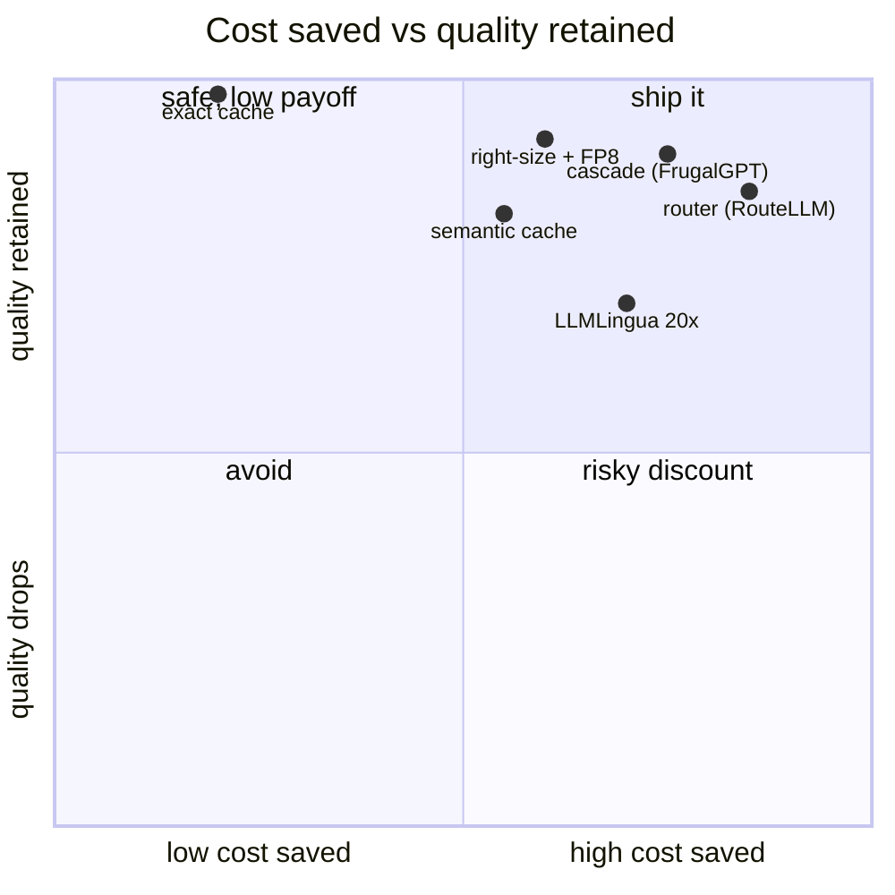
```mermaid
quadrantChart
  title Cost saved vs quality retained
  x-axis "low cost saved" --> "high cost saved"
  y-axis "quality drops" --> "quality retained"
  quadrant-1 "ship it"
  quadrant-2 "safe, low payoff"
  quadrant-3 "avoid"
  quadrant-4 "risky discount"
  "exact cache": [0.2, 0.98]
  "semantic cache": [0.55, 0.82]
  "cascade (FrugalGPT)": [0.75, 0.9]
  "router (RouteLLM)": [0.85, 0.85]
  "right-size + FP8": [0.6, 0.92]
  "LLMLingua 20x": [0.7, 0.7]
```

**The systems**

- **Stanford** [FrugalGPT: Using LLMs While Reducing Cost and Improving Performance](https://arxiv.org/abs/2305.05176): An LLM cascade defers to pricier models only when the cheap response scores unreliable. *(eval bar)*
- **LMSYS** [RouteLLM: an open framework for cost-effective LLM routing](https://www.lmsys.org/blog/2024-07-01-routellm/): A preference-data router splits queries between strong and weak models, about 85% cost cut. *(product design)*
- **Anyscale** [Building an LLM Router for High-Quality and Cost-Effective Responses](https://www.anyscale.com/blog/building-an-llm-router-for-high-quality-and-cost-effective-responses): A fine-tuned classifier routes by query complexity between closed and open models. *(eval bar)*
- **IBM Research** [LLM routing for quality, low-cost responses](https://research.ibm.com/blog/LLM-routers): A real-time router sends each query to the best-value model, cutting cost up to 85%. *(product design)*
- **Microsoft Research** [LLMLingua: prompt compression for LLM efficiency](https://www.microsoft.com/en-us/research/blog/llmlingua-innovating-llm-efficiency-with-prompt-compression/): Removes unimportant tokens for up to 20x prompt compression with little loss. *(product design)*
- **Databricks** [Simple, Fast, Scalable Batch LLM Inference](https://www.databricks.com/blog/introducing-simple-fast-and-scalable-batch-llm-inference-mosaic-ai-model-serving): Governed batch inference over large datasets for cost-efficient bulk processing. *(deployment)*
- **Baseten** [33% faster LLM inference with FP8 quantization](https://www.baseten.co/blog/33-faster-llm-inference-with-fp8-quantization/): FP8 quantization gives a 33% throughput gain and 24% lower cost per token. *(deployment)*
- **Cloudflare** [Caching in AI Gateway](https://developers.cloudflare.com/ai-gateway/features/caching/): The gateway serves identical requests from cache, cutting billable provider calls and latency. *(deployment)*
- **Uber** [Uber's GenAI Gateway](https://www.uber.com/blog/genai-gateway/): A unified multi-vendor gateway with usage and budget management across teams, plus fallbacks. *(deployment)*

---

### [Agent orchestration](topics/03-agent-orchestration.md) · 22 systems

**What they share.** Every system turns a user goal into a plan, then runs a tool-calling loop that acts, observes, and revises with managed context, bolting on a verification pass before the answer ships. They split on whether one context holds the whole job or an orchestrator fans work to parallel subagents.

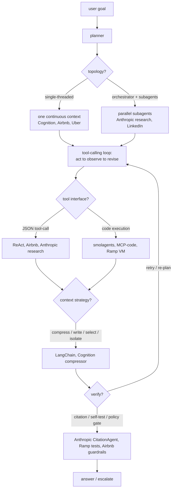
```mermaid
flowchart TD
  G["user goal"] --> P["planner"]
  P --> D1{"topology?"}
  D1 -->|single-threaded| ST["one continuous context<br/>Cognition, Airbnb, Uber"]
  D1 -->|orchestrator + subagents| MA["parallel subagents<br/>Anthropic research, LinkedIn"]
  ST --> LOOP["tool-calling loop:<br/>act to observe to revise"]
  MA --> LOOP
  LOOP --> D2{"tool interface?"}
  D2 -->|JSON tool-call| J["ReAct, Airbnb, Anthropic research"]
  D2 -->|code execution| CX["smolagents, MCP-code, Ramp VM"]
  J --> D3{"context strategy?"}
  CX --> D3
  D3 -->|compress / write / select / isolate| CTX["LangChain, Cognition compressor"]
  CTX --> V{"verify?"}
  V -->|citation / self-test / policy gate| VOK["Anthropic CitationAgent, Ramp tests, Airbnb guardrails"]
  V -->|retry / re-plan| LOOP
  VOK --> OUT["answer / escalate"]
```

**The choices, side by side.**

| Decision | Options (who) | What decides it |
| --- | --- | --- |
| topology | `single-agent loop` (Cognition, Airbnb, Uber) vs `orchestrator + parallel subagents` (Anthropic research, LinkedIn) vs `escalate-when-needed` (OpenAI guide) | Can one context hold the job? Separable subtasks needing isolated windows favor fan-out; coherent decision chains favor single-threaded. |
| planning | `ReAct` reactive next-step (Yao et al.) vs `Reflexion` self-critique retry (Shinn et al.) vs `plan-then-execute` (Anthropic lead agent, Airbnb CoT loop) | Known task shape and cost predictability favor plan-first; open-ended favors reactive; a clear success signal to learn from favors Reflexion. |
| tool / verification | `JSON tool-calls + gate` (Airbnb Tool Manager, ReAct) vs `code execution in sandbox` (smolagents E2B, Ramp Modal VM, Anthropic MCP-code) vs `citation pass` (Anthropic CitationAgent) | Many tools or large results waste tokens on JSON round-trips, so code wins; state-changing writes need a deterministic policy gate, not a prompt. |
| memory / context | `compress` (Cognition distiller, Claude Code auto-compact) vs `write + select` external memory (LangChain, Uber RAG) vs `isolate` separate windows (Anthropic subagents, LinkedIn siloed stores) | Transcript nearing the limit forces compression; recurring facts favor external write-then-retrieve; token-heavy blobs favor isolation. |

**The math that separates them.**

$$\textbf{context growth per turn:}\quad T_n = T_0 + \sum_{i=1}^{n}\bigl(o_i + a_i\bigr)$$

$$\textbf{per-ticket cost:}\quad C = \sum_{s=1}^{S} p\,(T_{s-1} + I_s) + g\,O_s$$

$$\textbf{multi-agent token multiple:}\quad \frac{C_{multi}}{C_{single}} \approx k \cdot \bar{r} \;\;(\text{Anthropic: about }15\times)$$

$$\textbf{MoE active fraction:}\quad f_{active} = \frac{\text{top-}k}{E},\qquad C_{token} \propto f_{active}$$

$$\textbf{verified success:}\quad P_{ship} = P_{task}\cdot\bigl(1 - (1 - P_{catch})^{R}\bigr)$$

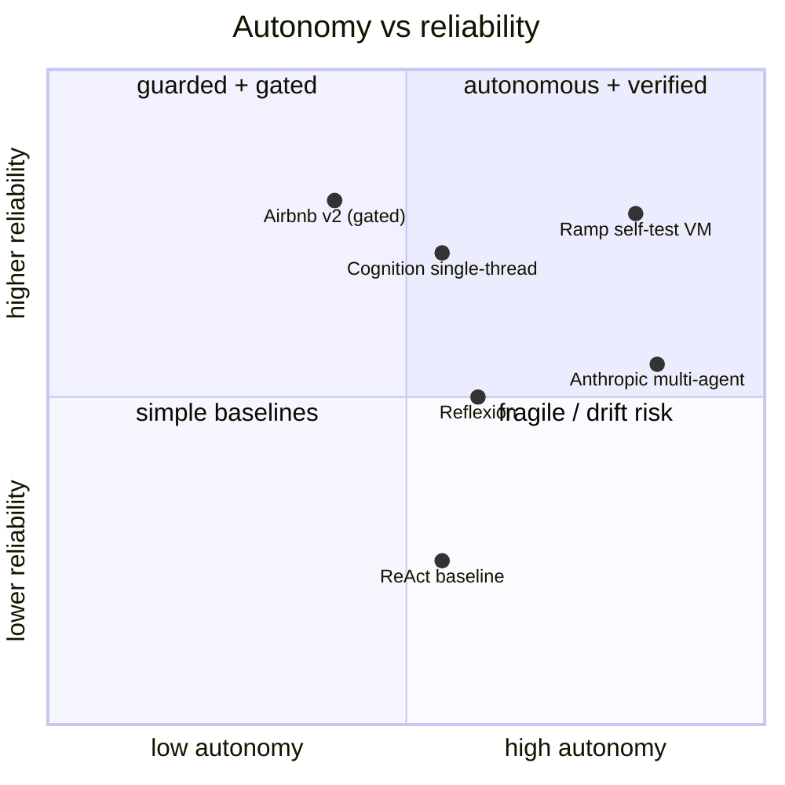
```mermaid
quadrantChart
  title Autonomy vs reliability
  x-axis "low autonomy" --> "high autonomy"
  y-axis "lower reliability" --> "higher reliability"
  quadrant-1 "autonomous + verified"
  quadrant-2 "guarded + gated"
  quadrant-3 "simple baselines"
  quadrant-4 "fragile / drift risk"
  "ReAct baseline": [0.55, 0.25]
  "Reflexion": [0.6, 0.5]
  "Airbnb v2 (gated)": [0.4, 0.8]
  "Cognition single-thread": [0.55, 0.72]
  "Ramp self-test VM": [0.82, 0.78]
  "Anthropic multi-agent": [0.85, 0.55]
```

**The systems**

- **Anthropic** [Building effective agents](https://www.anthropic.com/research/building-effective-agents): When to use workflows versus agents, and five composable orchestration patterns. *(product design)*
- **Anthropic** [How we built our multi-agent research system](https://www.anthropic.com/engineering/multi-agent-research-system): Orchestrator-worker pattern with parallel subagents; +90.2% over a single agent. *(deployment)*
- **Cognition** [Don't Build Multi-Agents](https://cognition.com/blog/dont-build-multi-agents): The counter-case: single-threaded agents win, and why parallel subagents are fragile. *(product design)*
- **Ramp** [Why We Built Our Own Background Agent](https://builders.ramp.com/post/why-we-built-our-background-agent): Closed-loop coding agent on sandboxed Modal VMs with verification. *(deployment)*
- **LangChain** [Context Engineering for Agents](https://www.langchain.com/blog/context-engineering-for-agents): Write, select, compress, and isolate context to control token cost and latency. *(product design)*
- **OpenAI** [A practical guide to building agents](https://cdn.openai.com/business-guides-and-resources/a-practical-guide-to-building-agents.pdf): Orchestration patterns, guardrails, and single vs multi-agent from deployments. *(product design)*
- **Anthropic** [Writing effective tools for agents, with agents](https://www.anthropic.com/engineering/writing-tools-for-agents): Designing and evaluating tool definitions to raise agent task success. *(product design)*
- **Anthropic** [Code execution with MCP: building more efficient agents](https://www.anthropic.com/engineering/code-execution-with-mcp): Code execution over MCP cuts tokens and latency at scale. *(product design)*
- **Uber** [Genie: Uber's Gen AI on-call copilot](https://www.uber.com/en-US/blog/genie-ubers-gen-ai-on-call-copilot/): A production RAG on-call copilot serving 45k engineer questions monthly. *(deployment)*
- **Block** [Introducing codename goose: an open framework for AI agents](https://block.xyz/inside/block-open-source-introduces-codename-goose): An open extensible agent running local multi-step tasks via MCP. *(product design)*
- **Sourcegraph** [Agentic Coding: a practical guide for big code](https://sourcegraph.com/blog/agentic-coding): Running agent loops with tools across large enterprise codebases. *(who it serves)*
- **Replit** [Enabling Agent 3 to self-test at scale with REPL verification](https://replit.com/blog/automated-self-testing): REPL plus browser verification lets the agent self-test autonomously. *(eval bar)*
- **GitHub** [Evaluating the Copilot agentic harness across models and tasks](https://github.blog/ai-and-ml/github-copilot/evaluating-performance-and-efficiency-of-the-github-copilot-agentic-harness-across-models-and-tasks/): Benchmarking a multi-model agent harness on resolution and token cost. *(eval bar)*
- **Salesforce** [Inside Agentforce: the Atlas Reasoning Engine](https://engineering.salesforce.com/inside-the-brain-of-agentforce-revealing-the-atlas-reasoning-engine/): A model-agnostic reasoning and planning engine driving enterprise agent actions. *(deployment)*
- **Airbnb** [Automation Platform v2: improving conversational AI](https://medium.com/airbnb-engineering/automation-platform-v2-improving-conversational-ai-at-airbnb-d86c9386e0cb): An LLM reasoning engine with chain-of-thought tool orchestration, context, and guardrails. *(deployment)*
- **LinkedIn** [The LinkedIn GenAI tech stack: extending to build AI agents](https://www.linkedin.com/blog/engineering/generative-ai/the-linkedin-generative-ai-application-tech-stack-extending-to-build-ai-agents): Multi-agent orchestration over messaging infra: agent registry, lifecycle, observability. *(deployment)*
- **Hugging Face** [Introducing smolagents](https://huggingface.co/blog/smolagents): The case for code-writing agents over JSON tool calls for multi-step tool use. *(product design)*
- **Stripe** [Can AI agents build real Stripe integrations?](https://stripe.com/blog/can-ai-agents-build-real-stripe-integrations): A benchmark of 11 challenges scoring agents on integration, testing, and error recovery. *(eval bar)*
- **Yao et al.** [ReAct: synergizing reasoning and acting in language models](https://arxiv.org/abs/2210.03629): The foundational pattern interleaving reasoning traces with tool actions. *(product design)*
- **Shinn et al.** [Reflexion: language agents with verbal reinforcement learning](https://arxiv.org/abs/2303.11366): Agents self-reflect on feedback to improve future actions without weight updates. *(eval bar)*
- **Wang et al.** [Voyager: an open-ended embodied agent with LLMs](https://arxiv.org/abs/2305.16291): A lifelong Minecraft agent with an auto curriculum, skill library, and self-verification. *(product design)*
- **Wu et al.** [AutoGen: next-gen LLM apps via multi-agent conversation](https://arxiv.org/abs/2308.08155): A framework for multi-agent systems via customizable conversable agents. *(deployment)*

---

### [Multimodal serving](topics/09-multimodal-serving.md) · 19 systems

**What they share.** Every vision-language system is the same spine: a modality encoder turns an image into a feature grid, a connector maps those features into the LLM embedding space, and one decoder generates over an interleaved text-plus-image token sequence. They differ almost entirely in the connector and in how many tokens an image is allowed to become.

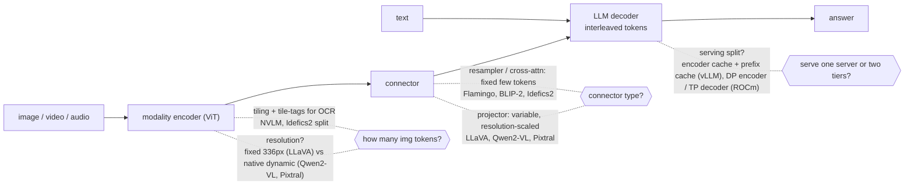
```mermaid
flowchart LR
  IMG["image / video / audio"] --> ENC["modality encoder (ViT)"]
  ENC --> CONN["connector"]
  CONN --> DEC["LLM decoder<br/>interleaved tokens"]
  TXT["text"] --> DEC
  DEC --> OUT["answer"]

  CONN -. "projector: variable, resolution-scaled<br/>LLaVA, Qwen2-VL, Pixtral" .- D1{{"connector type?"}}
  CONN -. "resampler / cross-attn: fixed few tokens<br/>Flamingo, BLIP-2, Idefics2" .- D1
  ENC -. "resolution?<br/>fixed 336px (LLaVA) vs native dynamic (Qwen2-VL, Pixtral)" .- D2{{"how many img tokens?"}}
  ENC -. "tiling + tile-tags for OCR<br/>NVLM, Idefics2 split" .- D2
  DEC -. "serving split?<br/>encoder cache + prefix cache (vLLM), DP encoder / TP decoder (ROCm)" .- D3{{"serve one server or two tiers?"}}
```

**The choices, side by side.**

| Decision | Options (who) | What decides it |
| --- | --- | --- |
| projector | `MLP` (LLaVA, Qwen2-VL, Pixtral) vs `cross-attn` (Flamingo, NVLM option) vs `resampler` (BLIP-2 Q-Former, Idefics2, Flamingo perceiver) | MLP passes a variable resolution-scaled block so detail scales with cost; resampler / cross-attn compress to a fixed few so cost is bounded but detail is capped |
| resolution | `fixed` (LLaVA CLIP ViT-L/14 336px) vs `tiling/dynamic` (Qwen2-VL native, Pixtral native, NVLM tiles) | Task detail: OCR and dense docs need high resolution; "what is in this picture" does not |
| image-token budget | `variable, scales with pixels` (Qwen2-VL, Pixtral) vs `fixed cap` (BLIP-2 = 32, Idefics2 = 64 or 320, Flamingo few) | Whether per-request cost/latency must be bounded vs whether fine detail must survive |
| serving split | `one server` vs `separate encoder tier + prefix/embedding cache` (Red Hat vLLM V1) vs `DP encoder + TP decoder` (AMD ROCm) | Encoder is bounded, batchable, cacheable by image hash; decoder is autoregressive and memory-bound; scale each independently and route text-only past the encoder |

**The math that separates them.**

$$\textbf{image tokens} \;=\; \left\lfloor \tfrac{H}{p} \right\rfloor \left\lfloor \tfrac{W}{p} \right\rfloor \quad (\text{Pixtral: } 1024^2, p{=}16 \Rightarrow 4096)$$

$$\textbf{tiled token count} \;=\; T \cdot \tfrac{H_t W_t}{p^2} \;+\; \text{tags} \quad (\text{grows linearly in tiles } T)$$

$$\textbf{prefill compute is quadratic} \;=\; O\!\big((n_\text{text}+n_\text{img})^2 \, d\big)$$

$$\textbf{KV bytes} \;=\; 2 \cdot L \cdot (n_\text{text}+n_\text{img}) \cdot d_\text{kv} \cdot b_\text{prec}$$

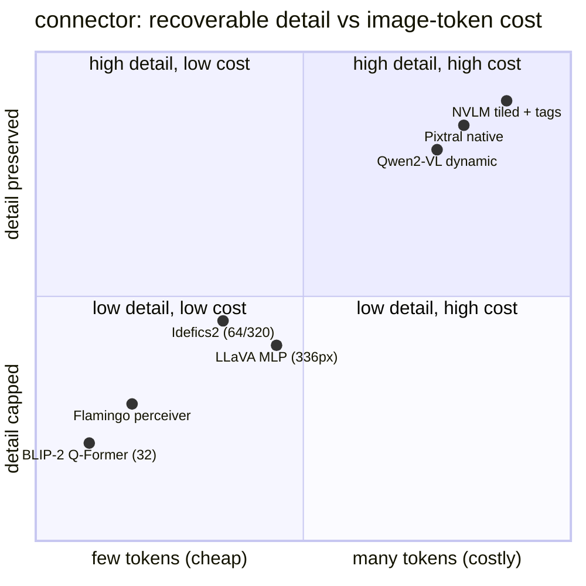
```mermaid
quadrantChart
  title connector: recoverable detail vs image-token cost
  x-axis "few tokens (cheap)" --> "many tokens (costly)"
  y-axis "detail capped" --> "detail preserved"
  quadrant-1 "high detail, high cost"
  quadrant-2 "high detail, low cost"
  quadrant-3 "low detail, low cost"
  quadrant-4 "low detail, high cost"
  "BLIP-2 Q-Former (32)": [0.10, 0.20]
  "Flamingo perceiver": [0.18, 0.28]
  "Idefics2 (64/320)": [0.35, 0.45]
  "LLaVA MLP (336px)": [0.45, 0.40]
  "Qwen2-VL dynamic": [0.75, 0.80]
  "Pixtral native": [0.80, 0.85]
  "NVLM tiled + tags": [0.88, 0.90]
```

**The systems**

- **Red Hat (vLLM)** [vLLM V1: accelerating multimodal inference](https://developers.redhat.com/articles/2025/02/27/vllm-v1-accelerating-multimodal-inference-large-language-models): Encoder caching, per-image prefix caching, and async CPU/GPU for faster multimodal serving. *(deployment)*
- **AMD (ROCm)** [Accelerating Multimodal Inference in vLLM](https://rocm.blogs.amd.com/software-tools-optimization/vllm-dp-vision/README.html): Batch-level data parallelism for vision encoders cuts sync overhead. *(deployment)*
- **Alibaba (Qwen)** [Qwen2-VL: enhancing vision-language perception at any resolution](https://arxiv.org/abs/2409.12191): Dynamic resolution turns any image into variable visual tokens, with an MLP projector and M-RoPE. *(product design)*
- **Mistral AI** [Pixtral 12B](https://arxiv.org/abs/2410.07073): A custom ViT trained from scratch ingests native resolution with a flexible image token budget. *(product design)*
- **Microsoft (LLaVA)** [Visual Instruction Tuning](https://arxiv.org/abs/2304.08485): The MLP projector connecting a frozen CLIP vision encoder to the LLM embedding space. *(product design)*
- **Dropbox** [Creating a modern OCR pipeline using CV and deep learning](https://dropbox.tech/machine-learning/creating-a-modern-ocr-pipeline-using-computer-vision-and-deep-learning): Productionizing a deep-learning OCR and document-scan pipeline. *(deployment)*
- **Hugging Face** [Introducing Idefics2: a powerful 8B vision-language model](https://huggingface.co/blog/idefics2): Vision encoder plus projector plus perceiver resampler design choices. *(product design)*
- **NVIDIA** [NVLM: open frontier-class multimodal LLMs](https://research.nvidia.com/labs/adlr/NVLM-1/): Decoder-only vs cross-attention connector tradeoffs, plus tile-tagging for OCR. *(deployment)*
- **DeepMind** [Flamingo: a visual language model for few-shot learning](https://arxiv.org/abs/2204.14198): Bridging frozen vision and language models with interleaved input. *(product design)*
- **Ai2** [Molmo and PixMo: open weights and open data for VLMs](https://arxiv.org/abs/2409.17146): An open VLM family with curated data rivaling proprietary models. *(eval bar)*
- **OpenGVLab** [InternVL 2.5: model, data, and test-time scaling](https://arxiv.org/abs/2412.05271): Scaling an open multimodal model across model, data, and inference-time. *(eval bar)*
- **Alibaba Qwen** [Qwen2-Audio Technical Report](https://arxiv.org/abs/2407.10759): An audio-language model with voice-chat and audio-analysis modes. *(who it serves)*
- **NVIDIA** [Accelerating VLM inference with TensorRT Edge-LLM](https://developer.nvidia.com/blog/accelerating-llm-and-vlm-inference-for-automotive-and-robotics-with-nvidia-tensorrt-edge-llm/): A C++ runtime for low-latency on-device VLM inference on embedded. *(deployment)*
- **Apple** [MM1: methods, analysis, and insights from multimodal LLM pre-training](https://arxiv.org/abs/2403.09611): Ablations on image-token count, connector design, and data mix for building VLMs. *(product design)*
- **Meta** [Chameleon: mixed-modal early-fusion foundation models](https://arxiv.org/abs/2405.09818): A single transformer over interleaved image/text tokens; a stable early-fusion recipe. *(product design)*
- **Roblox** [Running AI Inference at Scale in the Hybrid Cloud](https://about.roblox.com/newsroom/2024/09/running-ai-inference-at-scale-in-the-hybrid-cloud): vLLM, Ray, and a custom feature store serving 250 ML pipelines across hybrid cloud. *(deployment)*
- **Google** [PaLI-X: on scaling up a multilingual vision-language model](https://arxiv.org/abs/2305.18565): Scaling VLM components and task mix advances 25+ vision-language benchmarks. *(eval bar)*
- **Microsoft** [Florence-2: a unified representation for vision tasks](https://arxiv.org/abs/2311.06242): A prompt-based seq2seq VLM unifying caption, detection, grounding, and segmentation. *(product design)*
- **Salesforce** [BLIP-2: bootstrapping with frozen image encoders and LLMs](https://arxiv.org/abs/2301.12597): A lightweight Q-Former projector bridges a frozen vision encoder to a frozen LLM. *(product design)*

---

### [Post-training pipeline](topics/05-post-training-pipeline.md) · 19 systems

**What they share.** Every team rides one post-training spine (base to curated data to SFT to optional preference tuning to eval gate to serve) and differs only in which knobs the task forced them to turn. Most ship SFT alone; DPO/RLHF appears only where a quality axis SFT could not capture actually mattered.

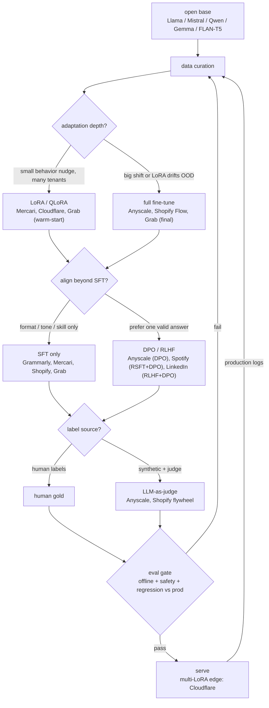
```mermaid
flowchart TD
  BASE["open base<br/>Llama / Mistral / Qwen / Gemma / FLAN-T5"] --> CUR["data curation"]
  CUR --> D1{"adaptation depth?"}
  D1 -->|"small behavior nudge, many tenants"| LORA["LoRA / QLoRA<br/>Mercari, Cloudflare, Grab (warm-start)"]
  D1 -->|"big shift or LoRA drifts OOD"| FULL["full fine-tune<br/>Anyscale, Shopify Flow, Grab (final)"]
  LORA --> D2{"align beyond SFT?"}
  FULL --> D2
  D2 -->|"format / tone / skill only"| SFTONLY["SFT only<br/>Grammarly, Mercari, Shopify, Grab"]
  D2 -->|"prefer one valid answer"| PREF["DPO / RLHF<br/>Anyscale (DPO), Spotify (RSFT+DPO), LinkedIn (RLHF+DPO)"]
  SFTONLY --> D3{"label source?"}
  PREF --> D3
  D3 -->|"human labels"| HUM["human gold"]
  D3 -->|"synthetic + judge"| SYN["LLM-as-judge<br/>Anyscale, Shopify flywheel"]
  HUM --> GATE{"eval gate<br/>offline + safety + regression vs prod"}
  SYN --> GATE
  GATE -->|"pass"| SERVE["serve<br/>multi-LoRA edge: Cloudflare"]
  GATE -->|"fail"| CUR
  SERVE -->|"production logs"| CUR
```

**The choices, side by side.**

| Decision | Options (who) | What decides it |
| --- | --- | --- |
| adaptation | `full FT` (Anyscale, Shopify Flow) vs `LoRA` (Cloudflare, Grab warm-start) vs `QLoRA` (Mercari) | Behavior-shift size and serving economics: small nudge or many tenants goes LoRA/QLoRA; big shift or LoRA drifting OOD forces full FT. |
| alignment | `SFT only` (Grammarly, Mercari, Shopify, Grab) vs `DPO` (Anyscale, Spotify) vs `RLHF+DPO` (LinkedIn) | Is there a quality axis SFT cannot capture (prefer one valid answer, safety, tone)? If no, stop at SFT. |
| data curation | `dense human instruction set` (Grammarly) vs `templated pairs` (Mercari) vs `synthetic + LLM judge` (Anyscale, Shopify) vs `proprietary graph/domain` (LinkedIn, Grab) | Whether real production data exists yet, and whether the task axis can be scored automatically. |
| eval gate | `human pref vs generalist` (Grammarly) vs `BLEU vs API` (Mercari) vs `1% live activation rate` (Shopify) vs `Q&A accuracy + compression` (Anyscale) | Offline metrics overstate readiness; gate on the real product metric (live slice) before scaling traffic. |
| serving | `one tuned model` (Anyscale, Shopify) vs `4-bit PTQ small model` (Mercari) vs `multi-LoRA shared base` (Cloudflare) | Tenant count and cost target: many customers/domains push toward one warm base plus swappable adapters. |

**The math that separates them.**

**LoRA low-rank weight update:**

$$W = W_0 + \frac{\alpha}{r} B A, \quad B \in \mathbb{R}^{d \times r},\ A \in \mathbb{R}^{r \times k},\ r \ll \min(d,k)$$

**DPO preference loss (Anyscale, Spotify):**

$$\mathcal{L}_{DPO} = -\mathbb{E}_{(x,y_w,y_l)} \left[ \log \sigma \left( \beta \log \frac{\pi_\theta(y_w \mid x)}{\pi_{ref}(y_w \mid x)} - \beta \log \frac{\pi_\theta(y_l \mid x)}{\pi_{ref}(y_l \mid x)} \right) \right]$$

**RLHF KL-penalized objective (LinkedIn):**

$$\max_{\pi_\theta}\ \mathbb{E}_{x,\, y \sim \pi_\theta}\big[ r_\phi(x,y) \big] - \beta\, \mathrm{KL}\!\left[ \pi_\theta(y \mid x)\ \|\ \pi_{ref}(y \mid x) \right]$$

**QLoRA memory (Mercari, 4-bit frozen base):**

$$M \approx \underbrace{4\text{-bit} \cdot N_{base}}_{\text{frozen, }\sim 0.5\text{ byte/param}} + \underbrace{16\text{-bit} \cdot 2 r (d+k) L}_{\text{trainable adapter} \ll N_{base}}$$

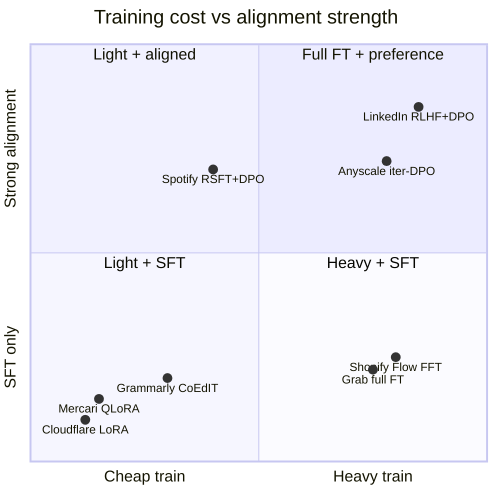
```mermaid
quadrantChart
  title Training cost vs alignment strength
  x-axis "Cheap train" --> "Heavy train"
  y-axis "SFT only" --> "Strong alignment"
  quadrant-1 "Full FT + preference"
  quadrant-2 "Light + aligned"
  quadrant-3 "Light + SFT"
  quadrant-4 "Heavy + SFT"
  "Mercari QLoRA": [0.15, 0.15]
  "Grammarly CoEdIT": [0.30, 0.20]
  "Cloudflare LoRA": [0.12, 0.10]
  "Spotify RSFT+DPO": [0.40, 0.70]
  "Grab full FT": [0.75, 0.22]
  "Shopify Flow FFT": [0.80, 0.25]
  "Anyscale iter-DPO": [0.78, 0.72]
  "LinkedIn RLHF+DPO": [0.85, 0.85]
```

**The systems**

- **Grammarly** [CoEdIT: state-of-the-art text editing with fewer parameters](https://www.grammarly.com/blog/engineering/coedit-text-editing/): Dense task-specific instruction tuning beats generalist LLMs at 12x to 60x fewer params. *(product design)*
- **Anyscale** [Fine-Tuning LLMs: LoRA or Full-Parameter?](https://www.anyscale.com/blog/fine-tuning-llms-lora-or-full-parameter-an-in-depth-analysis-with-llama-2): LoRA versus full fine-tune accuracy tradeoffs, broken down per task type. *(eval bar)*
- **Anyscale** [Direct Preference Optimization with Synthetic Data](https://www.anyscale.com/blog/direct-preference-optimization-with-synthetic-data): Iterative DPO: synthetic prefs, async reference model, judge-aligned eval. *(deployment)*
- **Hugging Face** [Preference Tuning LLMs with Direct Preference Optimization Methods](https://huggingface.co/blog/pref-tuning): Empirical DPO versus IPO versus KTO; the beta parameter drives outcomes. *(eval bar)*
- **Databricks** [A Practical Guide to LLM Fine Tuning](https://www.databricks.com/blog/llm-fine-tuning): End-to-end lifecycle: metrics, data quality, LoRA-first, and retrain cadence. *(deployment)*
- **Shopify** [Flow generation through natural language: an agentic modeling approach](https://shopify.engineering/fine-tuning-agent-shopify-flow): A fine-tuned Qwen3-32B agent with a weekly LLM-judge retraining flywheel. *(product design)*
- **Shopify** [Leveraging multimodal LLMs for the global catalogue](https://shopify.engineering/leveraging-multimodal-llms): Fine-tunes small VLMs for catalogue extraction at 40M inferences per day. *(deployment)*
- **Meta** [How to fine-tune: focus on effective datasets](https://ai.meta.com/blog/how-to-fine-tune-llms-peft-dataset-curation/): Data-curation rules for SFT and PEFT; quality over quantity. *(product design)*
- **GitHub** [Building a faster, smarter Copilot with a custom model](https://github.blog/ai-and-ml/github-copilot/the-road-to-better-completions-building-a-faster-smarter-github-copilot-with-a-new-custom-model/): A mid-training plus SFT (fill-in-middle) plus RL pipeline. *(deployment)*
- **Replit** [Replit Code v1.5 on Hugging Face](https://replit.com/blog/replit-code-v1_5): Trained and fine-tuned a code model on Replit user code. *(product design)*
- **Grab** [A custom vision LLM to improve document processing](https://engineering.grab.com/custom-vision-llm-at-grab): LoRA then full fine-tune of Qwen2-VL for OCR and key-info extraction. *(who it serves)*
- **Nubank** [Fine-Tuning Transaction User Models](https://building.nubank.com/fine-tuning-transaction-user-models/): SFT of transaction foundation models with joint fusion. *(product design)*
- **LinkedIn** [How we built domain-adapted foundation GenAI models](https://www.linkedin.com/blog/engineering/generative-ai/how-we-built-domain-adapted-foundation-genai-models-to-power-our-platform): Llama-based EON models via instruction tuning plus RLHF/DPO, 75x cheaper than GPT-4. *(deployment)*
- **Cloudflare** [Running fine-tuned models on Workers AI with LoRAs](https://blog.cloudflare.com/fine-tuned-inference-with-loras/): Serving customer LoRA adapters on shared base models across edge inference. *(deployment)*
- **Uber** [Open Source and In-House: How Uber Optimizes LLM Training](https://www.uber.com/us/en/blog/open-source-and-in-house-how-uber-optimizes-llm-training/): An in-house stack using LoRA/QLoRA, full fine-tuning, and continued pre-training. *(deployment)*
- **Thomson Reuters** [Scaling LLM research with Amazon SageMaker HyperPod](https://aws.amazon.com/blogs/machine-learning/scaling-thomson-reuters-language-model-research-with-amazon-sagemaker-hyperpod/): Domain-adapted legal LLMs (7B-30B) trained to beat general models on legal tasks. *(who it serves)*
- **Mercari** [Fine-Tuning an LLM to Extract Dynamically Specified Attributes](https://engineering.mercari.com/en/blog/entry/20240913-fine-tuning-an-llm-to-extract-dynamically-specified-attributes/): A QLoRA-tuned 2B model beats GPT-3.5 on attribute extraction at 14x lower cost. *(eval bar)*
- **Yelp** [An AI pipeline for inappropriate-language detection in reviews](https://engineeringblog.yelp.com/2024/03/ai-pipeline-inappropriate-language-detection.html): A fine-tuned LLM classifier flags inappropriate reviews; blocked 23,600+ in 2023. *(product design)*
- **Spotify** [Optimizing Query Expansions via LLM Preference Alignment](https://research.atspotify.com/2025/7/optimizing-query-expansions-via-llm-preference-alignment): Rejection-sampling SFT plus DPO aligns a query-expansion LLM, 70% faster. *(product design)*

---

### [Evaluation system](topics/06-evaluation-system.md) · 18 systems

**What they share.** Every system runs the same two-loop skeleton: an offline suite (checkable task metrics plus an LLM-as-judge) gates the change, then an online loop checks the gate was honest and feeds back to recalibrate the judge. The judge is trusted only after it is validated against human labels.

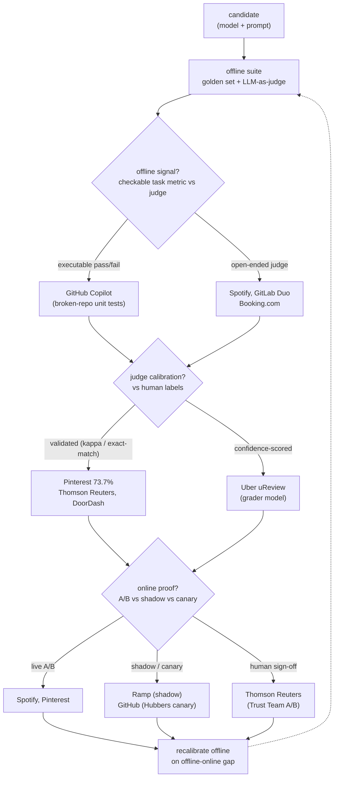
```mermaid
flowchart TD
  A["candidate<br/>(model + prompt)"] --> B["offline suite<br/>golden set + LLM-as-judge"]
  B --> P1{"offline signal?<br/>checkable task metric vs judge"}
  P1 -->|"executable pass/fail"| Q1["GitHub Copilot<br/>(broken-repo unit tests)"]
  P1 -->|"open-ended judge"| Q2["Spotify, GitLab Duo<br/>Booking.com"]
  Q1 --> C
  Q2 --> C
  C{"judge calibration?<br/>vs human labels"}
  C -->|"validated (kappa / exact-match)"| D1["Pinterest 73.7%<br/>Thomson Reuters, DoorDash"]
  C -->|"confidence-scored"| D2["Uber uReview<br/>(grader model)"]
  D1 --> E
  D2 --> E
  E{"online proof?<br/>A/B vs shadow vs canary"}
  E -->|"live A/B"| F1["Spotify, Pinterest"]
  E -->|"shadow / canary"| F2["Ramp (shadow)<br/>GitHub (Hubbers canary)"]
  E -->|"human sign-off"| F3["Thomson Reuters<br/>(Trust Team A/B)"]
  F1 --> G["recalibrate offline<br/>on offline-online gap"]
  F2 --> G
  F3 --> G
  G -.-> B
```

**The choices, side by side.**

| Decision | Options (who) | What decides it |
| --- | --- | --- |
| offline signal | `golden set + task metric` (GitHub broken-repo pass/fail, GitLab Cosine/Cross similarity) vs `LLM-as-judge` (Spotify, Booking.com, Uber) | Is the answer checkable? Executable / labeled task uses a metric; open-ended (relevance, tone, faithfulness) needs a judge |
| judge calibration | `validated vs human` (Pinterest 73.7% exact-match, DoorDash, Thomson Reuters) vs `confidence-scored` (Uber uReview grader) vs `uncalibrated` (anti-pattern) | Failure cost and gate authority: high-stakes gating demands measured judge-human agreement before trust |
| online | `A/B` (Spotify, Pinterest) vs `shadow` (Ramp) vs `canary` (GitHub Hubbers) | Can the action run silently? Shadow needs mirrored traffic and yields no user signal; A/B needs throughput; canary needs a safe internal cohort |
| gating | `CI regression gate` (GitHub daily vs prod, GitLab daily CEF) vs `confidence threshold` (Uber, per assistant/lang/category) vs `human sign-off` (Thomson Reuters Trust Team) | Change cadence and blast radius: daily prompt edits need automated gates; irreversible legal output needs a human arbiter |

**The math that separates them.**

**Judge-human agreement (Cohen's kappa)**
$$\kappa = \frac{p_o - p_e}{1 - p_e}$$

**Retrieval / precision-recall (F1)**
$$F_1 = 2 \cdot \frac{\text{precision} \cdot \text{recall}}{\text{precision} + \text{recall}}$$

**Position-bias averaging (both orderings)**
$$s(A,B) = \tfrac{1}{2}\big[\, j(A \prec B) + \big(1 - j(B \prec A)\big) \,\big]$$

**Per-slice regression gate inequality**
$$\text{ship} \iff \min_{g \in \text{segments}} \big( s_g^{\text{cand}} - s_g^{\text{base}} \big) \ge -\,\epsilon, \quad \epsilon \sim \sigma_{\text{judge}}$$

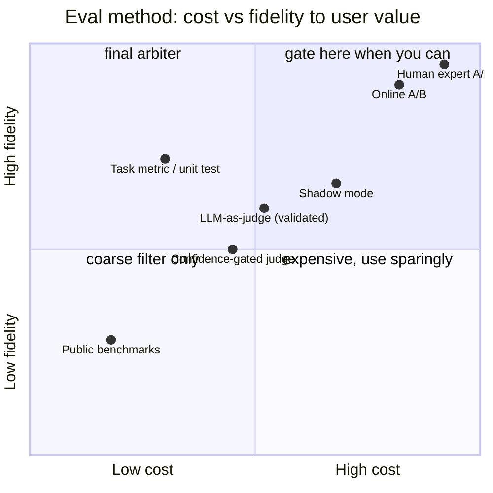
```mermaid
quadrantChart
  title Eval method: cost vs fidelity to user value
  x-axis "Low cost" --> "High cost"
  y-axis "Low fidelity" --> "High fidelity"
  quadrant-1 "gate here when you can"
  quadrant-2 "final arbiter"
  quadrant-3 "coarse filter only"
  quadrant-4 "expensive, use sparingly"
  "Public benchmarks": [0.18, 0.28]
  "Task metric / unit test": [0.30, 0.72]
  "LLM-as-judge (validated)": [0.52, 0.60]
  "Confidence-gated judge": [0.45, 0.50]
  "Shadow mode": [0.68, 0.66]
  "Online A/B": [0.82, 0.90]
  "Human expert A/B": [0.92, 0.95]
```

**The systems**

- **DoorDash** [A Simulation and Evaluation Flywheel to Develop LLM Chatbots at Scale](https://careersatdoordash.com/blog/doordash-simulation-evaluation-flywheel-to-develop-llm-chatbots-at-scale/): Simulated multi-turn conversations graded by an LLM judge calibrated to humans before release. *(eval bar)*
- **DoorDash** [How DoorDash leverages LLMs to evaluate search result pages](https://careersatdoordash.com/blog/doordash-llms-to-evaluate-search-result-pages/): AutoEval: fine-tuned LLM raters with a human in the loop for whole-page relevance. *(eval bar)*
- **Thomson Reuters** [Efficiently evaluating LLMs for legal tasks](https://legal.thomsonreuters.com/blog/evaluating-llms-legal-tasks/): Three-stage gate: public benchmarks, semi-automated task eval, then human A/B. *(eval bar)*
- **Uber** [uReview: scalable, trustworthy GenAI for code review](https://www.uber.com/us/en/blog/ureview/): An LLM grader scores generated comments; confidence thresholds gate what gets posted. *(deployment)*
- **Uber** [From Predictive to Generative: how Michelangelo accelerates Uber AI](https://www.uber.com/blog/from-predictive-to-generative-ai/): Michelangelo's eval framework compares models, prompts, and fine-tunes across iterations. *(deployment)*
- **Discord** [Developing Rapidly with Generative AI](https://discord.com/blog/developing-rapidly-with-generative-ai): A critic-LLM AI-assisted eval of prompts before A/B rollout. *(eval bar)*
- **Honeycomb** [So we shipped an AI product. Did it work?](https://www.honeycomb.io/blog/we-shipped-ai-product): Post-launch product eval via activation and adoption metrics. *(eval bar)*
- **GitHub** [How we evaluate AI models and LLMs for GitHub Copilot](https://github.blog/ai-and-ml/generative-ai/how-we-evaluate-models-for-github-copilot/): 4000+ offline tests plus manual and safety gates before deploy. *(eval bar)*
- **Spotify** [Better experiments with LLM evals: a funnel, not a fork](https://engineering.atspotify.com/2026/5/better-experiments-with-llm-evals-a-funnel-not-a-fork): Offline evals calibrated against online A/B as a funnel. *(deployment)*
- **Spotify** [Profile-aware LLM-as-a-Judge for Podcasts](https://research.atspotify.com/2025/9/profile-aware-llm-as-a-judge-for-podcasts-a-better-middle-ground-between): An LLM judge bridging offline metrics and costly A/B tests. *(eval bar)*
- **Booking.com** [LLM Evaluation: practical tips at Booking.com](https://booking.ai/llm-evaluation-practical-tips-at-booking-com-1b038a0d6662): LLM-as-judge plus golden datasets for production monitoring. *(eval bar)*
- **Pinterest** [LLM-Powered Relevance Assessment for Pinterest Search](https://medium.com/pinterest-engineering/llm-powered-relevance-assessment-for-pinterest-search-b846489e358d): Fine-tuned LLM judges label search relevance to evaluate ranking A/B experiments. *(deployment)*
- **Instacart** [Scaling Catalog Attribute Extraction with Multi-modal LLMs](https://company.instacart.com/tech-innovation/scaling-catalog-attribute-extraction-with-multi-modal-llms): LLM-as-judge auto-eval monitors attribute-extraction quality alongside human auditors. *(eval bar)*
- **Ramp** [How Ramp Fixes Merchant Matches with AI](https://builders.ramp.com/post/fixing-merchant-classifications-with-ai): Shadow mode plus an LLM judge evaluate agent classifications against humans pre-rollout. *(deployment)*
- **Microsoft** [LLM-Rubric: a multidimensional, calibrated approach to automated evaluation](https://www.microsoft.com/en-us/research/publication/llm-rubric-a-multidimensional-calibrated-approach-to-automated-evaluation-of-natural-language-texts/): A calibrated multi-dimension rubric judge predicts human satisfaction for a dialogue system. *(eval bar)*
- **LinkedIn** [How we engineered LinkedIn's Hiring Assistant](https://www.linkedin.com/blog/engineering/ai/how-we-engineered-linkedins-hiring-assistant): A quality framework pairs product policy with LLM judges scoring coherence and factuality. *(product design)*
- **GitLab** [Developing GitLab Duo: validating and testing AI models at scale](https://about.gitlab.com/blog/developing-gitlab-duo-how-we-validate-and-test-ai-models-at-scale/): A central eval framework with an LLM judge runs daily regression at scale. *(deployment)*
- **Wayfair** [How AI understands what you're looking for](https://www.aboutwayfair.com/careers/tech-blog/smarter-shopping-starts-here-how-ai-understands-what-youre-looking-for): LLM-as-judge validation tasks periodically evaluate AI-generated customer interests offline. *(eval bar)*

---

### [Safety and guardrails](topics/07-safety-and-guardrails.md) · 19 systems

**What they share.** Every system wraps the model in a layered pipeline: untrusted input hits an input guard, the model runs, then output guards inspect the generation, with classifiers trained on the enforced policy and the highest-risk cases routed to humans.

```mermaid
flowchart LR
  U["untrusted input<br/>(user, docs, tool output)"] --> IG["input guard"]
  IG --> D1{"guard model?"}
  D1 -->|small distilled classifier| A1["Roblox, Cloudflare edge"]
  D1 -->|guard-LLM 7B| A2["Meta Llama Guard,<br/>Google ShieldGemma, NVIDIA NeMo"]
  D1 -->|trained on synthetic policy| A3["Anthropic<br/>Constitutional Classifiers"]
  IG --> L["LLM"]
  L --> OG["output guard"]
  OG --> D2{"safety as..."}
  D2 -->|classification: score text| B1["Anthropic, Roblox, Meta,<br/>Google, Cloudflare"]
  D2 -->|structure: isolate + gate in code| B2["Microsoft MSRC,<br/>Salesforce, Thomson Reuters"]
  OG --> D3{"placement + timing"}
  D3 -->|input-only, edge| C1["Cloudflare"]
  D3 -->|both, streaming token-level| C2["Anthropic"]
  D3 -->|both, async race| C3["OpenAI cookbook"]
  D2 --> HR["human review<br/>(high-risk / appeals)"]
```

**The choices, side by side.**

| Decision | Options (who) | What decides it |
| --- | --- | --- |
| guard model | `small distilled classifier` (Roblox 750k RPS, Cloudflare) vs `guard-LLM 7B` (Meta Llama Guard, Google ShieldGemma, NVIDIA NeMo) vs `synthetic-policy classifier` (Anthropic) | request volume and latency budget: billions/day forces distilled; taxonomy flexibility favors instruction-tuned 7B |
| placement | `input filter` (Cloudflare edge) vs `output filter` (Thomson Reuters grounding) vs `both` (Anthropic, Meta, Microsoft, Salesforce, NeMo) | trust boundary: input-only misses unsafe generations; RAG/agents need output grounding too |
| jailbreak / injection defense | `trained classifier` (Anthropic 86%→4.4%) vs `spotlighting + code gates` (Microsoft) vs `PII masking + prompt defense` (Salesforce) vs `input blocklist-free zero-shot` (Cloudflare) | direct jailbreak yields to output classifiers; indirect injection needs structural isolation and least-privilege action gates |
| policy routing | `hard block` vs `safe-complete` vs `graded score` (OpenAI G-Eval 1-5, Grab likelihood tier) vs `escalate to human` (Roblox, Thomson Reuters) | stakes and false-positive cost: graded scores enable rewrite; regulated domains escalate ambiguity |
| latency hiding | `cascade cheap-to-expensive` (Grab, Meta) vs `async race vs generation` (OpenAI) vs `separate batched vLLM tier` (NeMo, Cloudflare 2s timeout) | critical-path budget; async leaks tokens before block fires, so it needs side-effect-free generation |

**The math that separates them.**

$$\textbf{Cascade expected cost: } \; \mathbb{E}[C] = c_{\text{cheap}} + p_{\text{escalate}} \cdot c_{\text{guardLLM}}$$

$$\textbf{Recall at fixed FPR operating point: } \; \text{Recall}@\text{FPR}=0.01 = \frac{TP}{TP+FN} \;\; \text{s.t.} \;\; \frac{FP}{FP+TN}=0.01$$

$$\textbf{Attack success under layered defense: } \; \text{ASR} = \prod_{i=1}^{L}\bigl(1 - r_i\bigr) \;\;\Rightarrow\;\; 0.86 \to 0.044$$

$$\textbf{Async race adds no wall clock: } \; T_{\text{total}} = \max\bigl(T_{\text{guard}},\, T_{\text{gen}}\bigr) \;\; \text{vs series } \; T_{\text{guard}} + T_{\text{gen}}$$

```mermaid
quadrantChart
  title Guard placement: added latency vs coverage
  x-axis "low added latency" --> "high added latency"
  y-axis "narrow coverage" --> "full coverage"
  quadrant-1 "thorough, costly"
  quadrant-2 "ideal"
  quadrant-3 "cheap, partial"
  quadrant-4 "slow, partial"
  "Roblox distilled": [0.18, 0.62]
  "Cloudflare edge input": [0.22, 0.35]
  "Meta Llama Guard 7B": [0.68, 0.7]
  "Anthropic in+out": [0.72, 0.9]
  "OpenAI async race": [0.3, 0.75]
  "Microsoft spotlighting+gates": [0.55, 0.82]
```

**The systems**

- **Roblox** [How Roblox Uses AI to Moderate Content on a Massive Scale](https://about.roblox.com/newsroom/2025/07/roblox-ai-moderation-massive-scale): Multi-model text, voice, and PII moderation at 750k requests per second with real-time prevention. *(deployment)*
- **Anthropic** [Constitutional Classifiers: defending against universal jailbreaks](https://www.anthropic.com/research/constitutional-classifiers): Input/output classifiers trained on a synthetic constitution cut jailbreaks from 86% to 4.4%. *(eval bar)*
- **Microsoft (MSRC)** [How Microsoft defends against indirect prompt injection attacks](https://www.microsoft.com/en-us/msrc/blog/2025/07/how-microsoft-defends-against-indirect-prompt-injection-attacks): Defense in depth: spotlighting, Prompt Shields detection, permission-based mitigation. *(deployment)*
- **NVIDIA** [Content Moderation and Safety Checks with NeMo Guardrails](https://developer.nvidia.com/blog/content-moderation-and-safety-checks-with-nvidia-nemo-guardrails/): Wiring LlamaGuard plus fact-check rails into RAG apps via NeMo Guardrails config. *(product design)*
- **Roblox** [Deploying ML for Voice Safety](https://about.roblox.com/newsroom/2024/07/deploying-ml-for-voice-safety): Machine-labeled data trains a fast quantized voice-abuse classifier at 2000 requests per second. *(deployment)*
- **Meta** [Llama Guard: LLM-based input-output safeguard](https://arxiv.org/abs/2312.06674): An instruction-tuned classifier moderating prompts and responses by taxonomy. *(product design)*
- **Google** [ShieldGemma: generative AI content moderation](https://arxiv.org/abs/2407.21772): Gemma-based safety classifiers benchmarked above Llama Guard. *(eval bar)*
- **Meta** [Llama Prompt Guard 2](https://developer.meta.com/ai/docs/model-cards-and-prompt-formats/prompt-guard/): A lightweight binary classifier flagging prompt injection and jailbreaks. *(product design)*
- **OpenAI** [How to implement LLM guardrails](https://developers.openai.com/cookbook/examples/how_to_use_guardrails): Async input and output guardrail patterns with latency tradeoffs. *(deployment)*
- **Cloudflare** [Block unsafe prompts with Firewall for AI](https://blog.cloudflare.com/block-unsafe-llm-prompts-with-firewall-for-ai/): An edge proxy using Llama Guard to block harmful prompts across 13 categories. *(deployment)*
- **Salesforce** [Inside the Einstein Trust Layer](https://developer.salesforce.com/blogs/2023/10/inside-the-einstein-trust-layer): PII masking, toxicity scoring, and prompt-injection defense around LLM calls. *(deployment)*
- **Grab** [How LLMs make content moderation more precise](https://www.grab.com/inside-grab/stories/how-large-language-models-help-us-make-more-precise-content-moderation-decisions/): Two-tier moderation routing content by an LLM violation-likelihood score. *(product design)*
- **Slack** [Securing the Agentic Enterprise](https://slack.com/blog/transformation/securing-the-agentic-enterprise): Multi-layered AI guardrails enforcing user permissions and real-time prompt-injection defense. *(deployment)*
- **Databricks** [Implementing LLM Guardrails for Safe GenAI Deployment](https://www.databricks.com/blog/implementing-llm-guardrails-safe-and-responsible-generative-ai-deployment-databricks): Safety filters on the Foundation Model API blocking unsafe inputs/outputs, logged for audit. *(deployment)*
- **Thomson Reuters** [Inside CoCounsel's guardrails](https://legal.thomsonreuters.com/blog/why-your-legal-ai-needs-more-than-the-open-web-a-look-inside-cocounsels-guardrails/): Grounding legal AI in trusted sources with attorney review and nightly 1,500-test benchmarks. *(eval bar)*
- **Wealthsimple** [Our LLM Gateway for secure, reliable generative AI](https://engineering.wealthsimple.com/get-to-know-our-llm-gateway-and-how-it-provides-a-secure-and-reliable-space-to-use-generative-ai): An internal gateway redacting PII and tracking external data for safe employee GenAI use. *(deployment)*
- **LinkedIn** [Defending Against Abuse at LinkedIn's Scale](https://www.linkedin.com/blog/engineering/trust-and-safety/defending-against-abuse-at-linkedins-scale): Real-time abuse defense at 4M+ transactions/sec using ML models and statistical rules. *(deployment)*
- **Pinterest** [How Pinterest built its Trust & Safety team](https://medium.com/pinterest-engineering/how-pinterest-built-its-trust-safety-team-8d6c026dd4b9): Building moderation infrastructure, policies, real-time signals, and ML before scaling. *(product design)*
- **Discord** [Our Approach to Content Moderation](https://discord.com/safety/our-approach-to-content-moderation): Layered human plus ML moderation including AutoMod filters and CSAM detection. *(product design)*

---

### [Production monitoring and observability](topics/12-production-monitoring-and-observability.md) · 7 systems

**What they share.** Every system emits a cheap synchronous trace per request (inputs, retrieved context, output, latency, tokens, cost) then fans expensive quality checks off that stream asynchronously and sampled, so serving is never taxed. The dividing lines are what quality signal they trust, how fast it detects, and whether they build the judge or adopt a platform.

```mermaid
flowchart TD
  U["user request"] --> S["serving chain<br/>retrieve, prompt, generate, tools"]
  S --> R["response to user"]
  S --> T["emit trace + spans<br/>context, output, latency, tokens, cost"]
  R --> FB["user feedback<br/>thumbs + implicit"]
  FB --> T
  T --> B1{"trace granularity?"}
  B1 -->|span per step, OTel| G1["Honeycomb / Grafana OpenLIT"]
  B1 -->|request + feedback log| G2["Uber Genie / Twilio Segment"]
  T --> B2{"quality signal?"}
  B2 -->|online LLM-judge| G3["Datadog / LangChain / Uber"]
  B2 -->|grounding vs context| G4["Datadog RAG detector"]
  B2 -->|drift vs reference window| G5["embedding-distance monitor"]
  T --> B3{"build or adopt?"}
  B3 -->|build custom judge| G6["Datadog / Uber Michelangelo"]
  B3 -->|adopt SDK + dashboards| G7["Grafana OpenLIT / Segment SDK"]
  B2 --> D["dashboards + alerts on rate/delta"]
  B3 --> D
```

**The choices, side by side.**

| Decision | Options (who) | What decides it |
| --- | --- | --- |
| trace granularity | `span/trace` OTel per step (Honeycomb, Grafana OpenLIT) vs `request+feedback log` (Uber Genie via Kafka/Hive, Twilio Segment) | Agents and multi-hop RAG need step-level spans to localize failure; single-shot copilots can log per-message and stitch on a conversation id |
| quality signal | `online LLM-judge` faithfulness/relevance (Datadog, LangChain, Uber) vs `grounding check` answer-vs-context (Datadog RAG) vs `drift` on embeddings | Judge is the workhorse but biased and costly; grounding is exact only when the answer should be grounded; drift predicts but confirms nothing alone |
| detection latency | immediate-but-read (traces) / minutes (metrics, guardrail rates) / minutes-to-hours (judge, grounding, async) / hours-to-days (drift trends) | Cost of a bad answer: a 3am page justifies fast sampled judging; a bland chat reply lives on a weekly drift dashboard |
| build vs adopt | `build` custom two-stage judge + ETL (Datadog GPT-4o judge, Uber Michelangelo) vs `adopt` auto-instrument SDK (Grafana OpenLIT, Twilio Segment SDK) | Domain-specific faithfulness bar and provider-agnostic control push toward build; low-effort coverage and GenAI semantic conventions push toward adopt |
| coverage vs cost | all-traffic cheap (traces, metrics, guardrail logs) vs sampled expensive (judge, grounding, human review) | Whether the check costs an extra model call per request; only cheap span-derived metrics run on 100 percent |

**The math that separates them.**

$$\textbf{judge-human agreement (kappa):}\quad \kappa=\frac{p_o-p_e}{1-p_e}$$

$$\textbf{faithfulness = grounded claim fraction:}\quad G(a)=\frac{1}{|C(a)|}\sum_{c\in C(a)}\mathbf{1}[\,\text{context}\models c\,]$$

$$\textbf{cosine input-drift score:}\quad d_t=1-\frac{\bar{e}_t\cdot \bar{e}_{\text{ref}}}{\lVert \bar{e}_t\rVert\,\lVert \bar{e}_{\text{ref}}\rVert}$$

$$\textbf{sampling rate sets observing cost:}\quad \mathbb{E}[\text{cost}_{\text{obs}}]=s\cdot \lambda\cdot c_{\text{judge}},\qquad t_{\text{detect}}\approx \frac{k}{s\,\lambda\,r_{\text{fail}}}$$

```mermaid
quadrantChart
  title detection latency vs coverage
  x-axis "narrow (sampled)" --> "full traffic"
  y-axis "slow to detect" --> "fast to detect"
  quadrant-1 "cheap, all-traffic, fast"
  quadrant-2 "sampled but fast"
  quadrant-3 "sampled and slow"
  quadrant-4 "broad but lagging"
  "Traces (diagnostic)": [0.80, 0.35]
  "Metrics dashboards": [0.90, 0.82]
  "Guardrail-rate logging": [0.85, 0.70]
  "Online LLM-judge": [0.28, 0.45]
  "Grounding check": [0.35, 0.48]
  "Drift detection": [0.75, 0.18]
```

**The systems**

- **Datadog** [Detect hallucinations in your RAG LLM applications](https://www.datadoghq.com/blog/llm-observability-hallucination-detection/): Flags ungrounded or contradictory outputs against retrieved context in production RAG apps. *(product design)*
- **Datadog** [Detecting hallucinations with LLM-as-a-judge](https://www.datadoghq.com/blog/ai/llm-hallucination-detection/): How they built and benchmarked an LLM-as-judge faithfulness detector. *(eval bar)*
- **Honeycomb** [Improving LLMs in Production With Observability](https://www.honeycomb.io/blog/improving-llms-production-observability): Spans capture input, output, errors, latency, tokens, and user feedback for their Query Assistant. *(deployment)*
- **Uber** [Genie: Uber's Gen AI On-Call Copilot](https://www.uber.com/us/en/blog/genie-ubers-gen-ai-on-call-copilot/): A production copilot streaming user-feedback ratings, hallucination and relevancy evals to dashboards. *(product design)*
- **Grafana Labs** [Monitor LLMs in production with Grafana Cloud, OpenLIT, and OpenTelemetry](https://grafana.com/blog/ai-observability-llms-in-production/): Dashboards for token usage, per-call cost, latency percentiles, and time-to-first-token. *(deployment)*
- **LangChain** [The agent improvement loop starts with a trace](https://www.langchain.com/blog/traces-start-agent-improvement-loop): Collecting and enriching production traces of agent tool calls to find failures and prevent regressions. *(deployment)*
- **Twilio Segment** [Instrumenting User Insights for your AI Copilot](https://www.twilio.com/en-us/blog/insights/ai/instrumenting-user-insights-for-your-ai-copilot/): Instruments prompts, responses, and engagement signals into product analytics for a live copilot. *(product design)*
