# Case teardowns

The [case studies index](CASE-STUDIES.md) lists the shipped systems and links
their engineering writeups. This document goes one level deeper: each entry is a
teardown of how a real team actually built the system, read from their own
writeup and presented as a diagram of their design, the interview questions that
design invites, the non-obvious tricks it gets right, and the common mistakes on
that kind of system with concrete fixes.

Every teardown is faithful to a first-party engineering source. Diagrams are
Mermaid and render on GitHub. Organized by the same taxonomy as the rest of the repo.

---
## RAG serving

### Ramp: RAG industry classification into NAICS codes ([source](https://builders.ramp.com/post/industry_classification))

Ramp built an online RAG pipeline that classifies businesses into standardized NAICS codes. It embeds business attributes and NAICS-code descriptions, precomputes the knowledge-base embeddings in ClickHouse for fast similarity retrieval, and pulls top-k candidate codes. A two-prompt LLM stage then narrows the shortlist: the first prompt selects among many terse candidates, the second re-scores a smaller set with richer descriptions to pick the final code. They tuned which attributes to embed and which embedding model to use via accuracy@k curves, gaining up to 60% accuracy@k and 5 to 15% fuzzy accuracy.

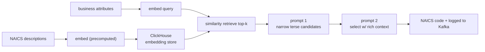

**Interview questions this design invites**
- Why precompute knowledge-base embeddings and store them in a columnar DB rather than embed at query time?
- How does a two-prompt selection stage manage context budget versus a single large prompt?
- What is accuracy@k and why tune the embedding model against it instead of picking the largest model?
- How would you design a "fuzzy accuracy" metric for a hierarchical label space like NAICS?
- How does this classification RAG differ from open-ended question-answering RAG?
- Where do you log intermediate results and why does that matter for debugging retrieval?

**Tricks and gotchas**
- Retrieval over a fixed, enumerable label set (NAICS codes) lets you precompute every candidate embedding once.
- The first prompt deliberately omits long descriptions to fit more candidates; richness is spent only on the finalists.
- accuracy@k curves reveal that a smaller, cheaper encoder can match a larger one on your specific data.
- Hierarchical labels reward partial correctness, so a plain exact-match metric understates real quality.

**Common mistakes and how to fix them**
- Defaulting to the biggest embedding model: profile accuracy@k and pick the cheapest model on the plateau.
- Stuffing all candidate descriptions into one prompt: split into narrow-then-select to control context size and cost.
- Scoring only exact matches: add a hierarchy-aware fuzzy metric so near-misses are visible.
- Embedding the wrong business fields: treat "which attributes to embed" as a tunable hyperparameter, not a given.

### Uber: Enhanced Agentic-RAG for the Genie on-call copilot ([source](https://www.uber.com/blog/enhanced-agentic-rag/))

Uber upgraded Genie, an internal on-call Slack copilot for security and privacy questions, into an agentic RAG (EAg-RAG). The offline path uses a custom Google Docs loader that recursively extracts paragraphs, tables, and the table of contents, with an LLM converting tables into markdown and tagging table-bearing chunks so they are not split badly; each chunk is enriched with an LLM-generated summary, FAQ set, and keywords. Online, a Query Optimizer agent rewrites and decomposes questions and a Source Identifier agent narrows the document scope before hybrid vector plus BM25 retrieval; a Post-Processor agent dedups and reorders chunks by document position. LLM-as-judge (0 to 5) cut eval from weeks to minutes; they report a 27% relative lift in acceptable answers and 60% fewer incorrect answers.

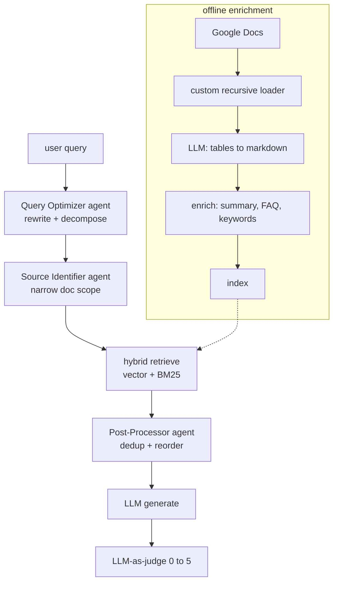

**Interview questions this design invites**
- What does an "agentic" pre-retrieval stage add over embedding the raw user query directly?
- Why enrich chunks with LLM-generated summaries, FAQs, and keywords before indexing?
- How does a Source Identifier agent narrow scope, and what artifact does it read to do so?
- Why does table extraction need special handling in the loader and chunker?
- How do you keep an LLM-as-judge eval trustworthy while running it in minutes?
- What are the failure modes of query decomposition into subqueries?

**Tricks and gotchas**
- Standard PDF loaders lose table structure; a format-aware loader plus LLM markdown conversion preserves it.
- Tagging table-containing chunks prevents the chunker from splitting a table mid-row.
- Metadata enrichment does double duty: it improves both retrieval recall and the source-narrowing agent.
- Reordering retrieved chunks by original document position gives the generator coherent context.

**Common mistakes and how to fix them**
- Feeding raw noisy queries into retrieval: add a query optimizer that rewrites and decomposes first.
- Naive PDF-to-text that flattens tables: build a structural loader and convert tables to markdown.
- Vector-only retrieval missing exact terms: merge vector with BM25 for broader coverage.
- Manual multi-week eval blocking iteration: automate with an LLM judge scored against SME ground truth.

### Microsoft Research: GraphRAG over narrative private data ([source](https://www.microsoft.com/en-us/research/blog/graphrag-unlocking-llm-discovery-on-narrative-private-data/))

GraphRAG replaces vector-only retrieval with a knowledge graph the LLM builds from the corpus: it extracts entities (people, places, organizations) and their relationships, then applies bottom-up hierarchical clustering into semantic communities and pre-summarizes each community. At query time it uses the graph structure and community summaries to populate the context window, which lets it connect disparate facts and answer multi-hop and whole-corpus "what are the themes" questions that baseline RAG misses. Evaluation is qualitative pairwise grading on comprehensiveness, diversity, and human enfranchisement (provision of source material), with SelfCheckGPT for faithfulness and per-response citation links.

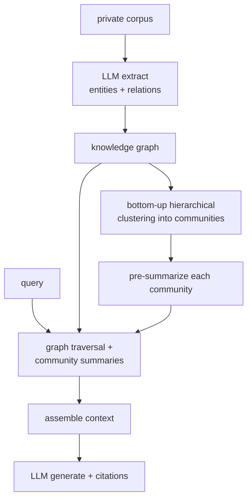

**Interview questions this design invites**
- When does knowledge-graph retrieval beat vector similarity, and when is it overkill?
- How does an LLM build a knowledge graph from unstructured text, and what errors creep in?
- Why does hierarchical community summarization enable whole-corpus (global) questions?
- How would you evaluate comprehensiveness and diversity without gold answers?
- What is SelfCheckGPT measuring here and why measure faithfulness separately?
- What is the offline cost of graph construction and how does it scale with corpus size?

**Tricks and gotchas**
- Multi-hop questions need traversal across shared entities, which flat top-k vector search cannot do.
- Pre-computed community summaries let the system answer "themes across everything" without reading everything at query time.
- Entity extraction quality caps graph quality; a noisy extractor poisons downstream retrieval.
- Pairwise human grading is used because single-answer scoring is unreliable for open-ended questions.

**Common mistakes and how to fix them**
- Using vector-only RAG for global sensemaking questions: build a graph and summarize communities.
- Trusting LLM-extracted entities blindly: add consistency checks and provenance so bad nodes are traceable.
- Reporting a single accuracy number: grade comprehensiveness, diversity, and faithfulness as separate axes.
- Ignoring graph-build cost: budget the offline LLM passes, since construction dominates the compute.

### Dropbox: Dash hybrid RAG for business users ([source](https://dropbox.tech/machine-learning/building-dash-rag-multi-step-ai-agents-business-users))

Dropbox Dash pairs a lexical (IR) search system with embedding-based rerankers and does chunking at query time rather than pre-indexing, so only relevant sections are cut and reranked by a larger embedding model. Freshness is handled with periodic data syncs plus webhooks where available, deliberately avoiding real-time API latency. The team framed the build around explicit tensions (latency vs quality, freshness vs scalability, budget vs UX), landing on hybrid retrieval that hits high quality within 2 seconds for 95% of queries. Evaluation uses LLM judges for answer correctness and completeness plus source precision, recall, and F1.

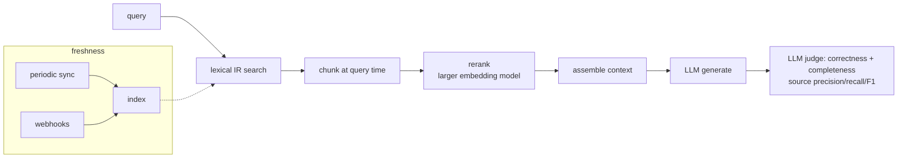

**Interview questions this design invites**
- Why chunk at query time instead of pre-chunking and pre-embedding the whole corpus?
- What does a lexical-first retrieval plus embedding reranker buy over pure semantic search?
- How do you decide between real-time API calls, periodic syncs, and webhooks for freshness?
- What is source F1 and why measure retrieval separately from answer correctness?
- How do you hold a 2-second p95 latency budget while reranking with a large model?
- Which of the stated tensions (latency, freshness, budget) would you relax first and why?

**Tricks and gotchas**
- Query-time chunking means you only ever cut the documents you actually retrieved, saving index cost.
- Webhooks give near-real-time freshness only where the source supports them; syncs cover the rest.
- A larger embedding model is affordable as a reranker because it runs on a short candidate list, not the corpus.
- Source-level precision/recall/F1 catches retrieval regressions that answer-only judging would hide.

**Common mistakes and how to fix them**
- Pre-chunking everything up front: defer chunking to query time to cut index churn and irrelevant splits.
- Polling APIs in real time for freshness: use periodic syncs plus webhooks to avoid the latency penalty.
- Judging only the final answer: add source precision/recall/F1 to isolate retrieval quality.
- Committing to pure lexical or pure semantic: combine them so exact terms and meaning both count.

### Vespa: Embedding tradeoffs quantified ([source](https://blog.vespa.ai/embedding-tradeoffs-quantified/))

Vespa benchmarked embedding quantization and hybrid retrieval to quantify quality-versus-latency-versus-storage tradeoffs. INT8 quantization runs 2.7 to 3.4x faster on CPUs while keeping 94 to 98% quality, but 4 to 5x slower on GPUs (use FP16 there for ~2x speedup at negligible loss). For 100M 768-dim vectors, storage drops from 307 GB (FP32) to 154 GB (bfloat16, zero quality loss) to 9.6 GB (binary, 32x). Binary resilience is model-dependent: GTE ModernBERT holds 98% while E5-small-v2 falls to 87%. Hybrid BM25 plus vector (via RRF or score normalization) beat semantic-only by 3 to 5 points for every model tested.

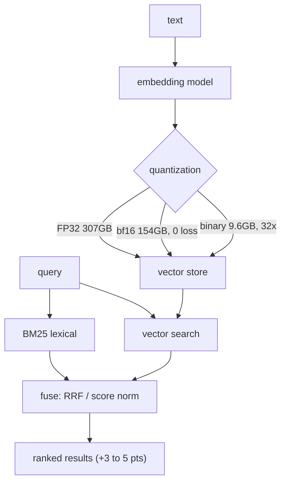

**Interview questions this design invites**
- Why does INT8 speed up CPU inference but slow down GPU inference?
- How do you choose between FP32, bfloat16, and binary vectors for a 100M-vector index?
- Why is binary-quantization quality so model-dependent, and how would you test it before shipping?
- How do RRF and score normalization fuse BM25 and vector scores?
- Given a fixed memory budget, how do quantization and hybrid retrieval interact?
- Where does bfloat16 fit as a "free" optimization and why?

**Tricks and gotchas**
- INT8 is a CPU win but a GPU loss; the right precision depends on the serving hardware.
- bfloat16 halves storage with zero measured quality loss, so it is close to a free win.
- Binary quantization gives 32x storage savings but only some model families survive it (ModernBERT yes, E5 less so).
- Hybrid retrieval adds 3 to 5 points with no architecture change, just a fusion step.

**Common mistakes and how to fix them**
- Applying INT8 uniformly across hardware: use INT8 on CPU, FP16 on GPU.
- Assuming binarization is safe for any encoder: benchmark quality per model before enabling it.
- Storing FP32 vectors by default: switch to bfloat16 for a free 2x storage cut.
- Shipping semantic-only search: add BM25 and fuse for a cheap, consistent quality gain.

### NVIDIA: Reranking microservice for two-stage retrieval ([source](https://developer.nvidia.com/blog/how-using-a-reranking-microservice-can-improve-accuracy-and-costs-of-information-retrieval/))

NVIDIA describes a two-stage retrieve-then-rerank pipeline packaged as NeMo Retriever NIM microservices. Stage one uses an embedding model to narrow millions of passages to tens; stage two uses a cross-encoder reranker that jointly scores each query-passage pair to keep roughly five. Because the reranker costs about 75x less than running Llama 3.1 8B over the same passages, sending fewer, better chunks to the generator cuts LLM token cost while holding or improving accuracy. They outline three operating points (maximize accuracy at net-zero cost, maximize savings, or balanced) and report about 21.5% cost savings from reduced LLM token processing.

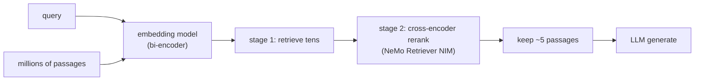

**Interview questions this design invites**
- What is the difference between a bi-encoder retriever and a cross-encoder reranker?
- Why is it cheaper to rerank tens of passages than to let the LLM read all of them?
- How do you set the candidate count for stage one versus the keep count for stage two?
- What are the three cost-accuracy operating points and when would you pick each?
- Why does feeding fewer chunks sometimes improve accuracy, not just cost?
- How would you deploy the reranker as a separate autoscaling microservice?

**Tricks and gotchas**
- The cross-encoder is expensive per pair but only runs on a short shortlist, so total cost stays low.
- Reranking is roughly 75x cheaper than the generator per passage, so it is a cost lever, not just a quality lever.
- You can hold cost flat by swapping one base-retrieval chunk for one reranked chunk.
- Fewer, higher-precision chunks reduce the lost-in-the-middle dilution in the generator.

**Common mistakes and how to fix them**
- Dumping all retrieved chunks into the LLM: add a reranker and trim to the top few.
- Treating reranking as pure accuracy spend: use it to cut generator token cost too.
- Fixing candidate and keep counts arbitrarily: tune them along the accuracy-cost curve.
- Coupling the reranker into the app process: run it as an independent, autoscaled microservice.

### Glean: Hybrid search plus knowledge graph for enterprise RAG ([source](https://www.glean.com/blog/hybrid-vs-rag-vector))

Glean argues vector search alone is insufficient for enterprise RAG and combines it with lexical search to marry precision with semantic understanding. Around that hybrid core they add an enterprise knowledge graph (signals and anchors linking people, docs, and activity), a permission-aware crawler that ingests content with access rules intact, and LLM integration tuned to handle retrieval gaps gracefully. The knowledge graph supplies organizational context that disambiguates queries: a plain RAG system answered "Scholastic" with a book publisher, while Glean correctly resolved it to an internal system. Ranking is multi-signal and permission-aware so results are both relevant and legally visible to the asking user.

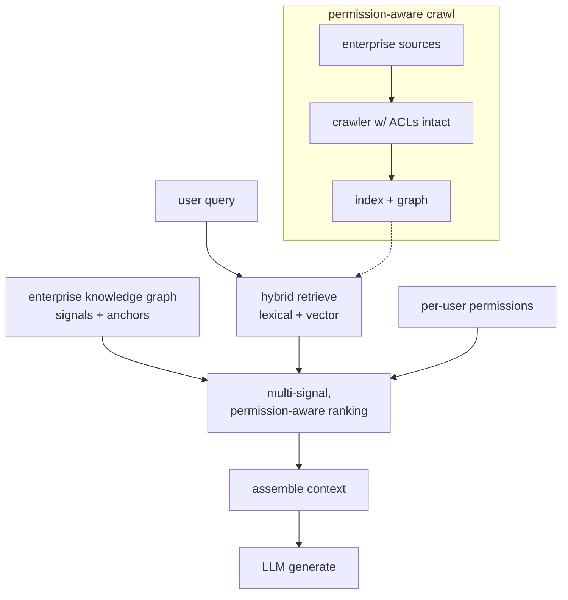

**Interview questions this design invites**
- Why is vector similarity insufficient to disambiguate enterprise-specific terms?
- How does a knowledge graph of signals and anchors add organizational context to ranking?
- What does permission-aware retrieval require, and why enforce access at retrieval time?
- How do you fuse lexical, semantic, and graph signals into one ranking?
- How do you keep the crawler's access rules synchronized with the source systems?
- What happens when retrieval finds nothing, and how should the LLM respond?

**Tricks and gotchas**
- Enterprise jargon collides with public meanings; graph context resolves "Scholastic" to the internal system.
- Permissions must travel with the content through the crawler, or the index leaks documents.
- Multi-signal ranking blends relevance with recency, authorship, and activity, not just cosine similarity.
- The LLM layer must degrade gracefully when retrieval is weak rather than fabricate.

**Common mistakes and how to fix them**
- Relying on embeddings alone in the enterprise: add lexical search and a knowledge graph for context.
- Filtering permissions after retrieval: enforce ACLs inside the search so results are pre-authorized.
- Ranking on similarity only: combine multiple signals for enterprise relevance.
- Ignoring the empty-retrieval case: design graceful gap handling instead of hallucinated answers.

_Not reachable: DoorDash_

---

## Semantic search and embeddings

### Spotify: Voyager, an HNSW nearest-neighbor library ([source](https://engineering.atspotify.com/2023/10/introducing-voyager-spotifys-new-nearest-neighbor-search-library))

Spotify built Voyager as the successor to Annoy, a nearest-neighbor library powering recommendation features like Discover Weekly and Home without live ML inference. It wraps hnswlib (the HNSW graph algorithm) and reports more than 10x Annoy's speed at equal recall, or up to 50% more accuracy at equal speed. Vectors are compressed with E4M3 8-bit floats for up to 4x less memory than Annoy, and indexes deploy as in-memory, stateless Kubernetes services with fault-tolerant, corruption-checked index files. It ships Python and Java bindings with identical interfaces so the same index serves both the data-science and JVM-backend sides.

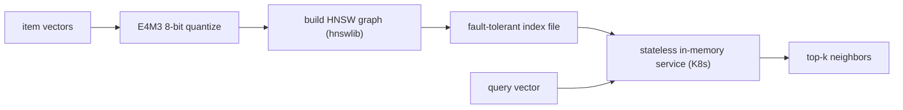

**Interview questions this design invites**
- Why replace Annoy's random-projection trees with an HNSW graph, and what changes in the recall-vs-memory curve?
- How does E4M3 8-bit quantization affect recall, and why quantize at all if HNSW already stores full graphs?
- Why run stateless in-memory index services on Kubernetes instead of a vector database?
- How do you keep the index fresh when a stateless service holds it entirely in RAM?
- What breaks if Python and Java bindings drift in their distance math?
- How do you tune HNSW ef and M for a latency-vs-cost target per recommendation surface?

**Tricks and gotchas**
- E4M3 8-bit floats cut memory roughly 4x versus Annoy but the quantization is lossy, so recall must be measured after compression, not before.
- Stateless in-memory serving trades zero database maintenance for a full re-load of the index on every deploy or scale-up.
- Corruption detection on index files matters because a single bad byte in a memory-mapped graph can silently poison neighbor results.
- Identical Python and Java bindings avoid the classic bug where offline eval and online serving compute distances differently.

**Common mistakes and how to fix them**
- Assuming HNSW is memory-cheap: the graph plus vectors is RAM-heavy, so quantize (E4M3) and budget RAM per index copy.
- Picking one ef for all traffic: expose ef per query class so precision-sensitive surfaces can pay more latency.
- Treating the index as durable state: it is a stateless artifact rebuilt from vectors, so keep the source vectors as the system of record.

### Vespa: billion-scale hybrid HNSW plus inverted-file search ([source](https://blog.vespa.ai/vespa-hybrid-billion-scale-vector-search/))

Vespa's HNSW-IF design splits 1 billion 100-dimensional int8 vectors into two tiers: about 20% are chosen as centroids and indexed with in-memory HNSW (max-links-per-node 18) on high-RAM nodes, while the other 80% live in a disk-backed inverted index that maps each centroid to a posting list of nearby vector IDs (each vector associated with its 12 closest centroids). A query first retrieves centroids from HNSW in 2-3ms, gathers candidate IDs via a dotProduct multivalued operator weighted by transitive closeness, then a second phase pages the actual vectors from SSD and rescores at full precision (tested to depth 4000). The result is 90% recall@10 just under 50ms end to end, at roughly $6,000/month, with full CRUD for incremental updates.


**Interview questions this design invites**
- Why split into an in-memory centroid graph plus a disk-backed posting list instead of one flat HNSW?
- How does associating each vector with its 12 closest centroids affect recall versus storage?
- Why does the second-phase rescore need full-precision vectors paged from SSD if the first phase already ranked candidates?
- What happens to recall when you delete many centroids, and why is deleting non-centroids cheaper?
- How do you pick the rescore depth (why 4000) against the 50ms budget?
- How does int8 vector storage change the recall and memory math versus float32?

**Tricks and gotchas**
- Deleting centroids degrades recall because posting lists lose their routing anchors; deleting non-centroids barely matters.
- Transitive closeness scoring prunes candidates before any SSD read, so disk I/O is the real budget, not compute.
- Storing only vector IDs (not vectors) in posting lists avoids duplicating vector data across the 12 centroid associations.
- Multi-version embedder models multiply storage linearly, so a model upgrade is a storage-and-cost event, not just a re-embed.

**Common mistakes and how to fix them**
- Putting all billion vectors in RAM: only the centroid tier needs memory, so push the 80% majority to SSD-backed posting lists.
- Skipping the full-precision rescore: int8 first-phase scores are approximate, so page real vectors and rescore the shortlist.
- Ignoring cluster drift on updates: incremental upserts work, but periodic re-clustering keeps posting lists balanced.

### Meta: Faiss, GPU-accelerated billion-scale similarity search ([source](https://engineering.fb.com/2017/03/29/data-infrastructure/faiss-a-library-for-efficient-similarity-search/))

Faiss is Meta's C++/Python library for approximate nearest-neighbor search over billion-vector datasets, built around composite IVF-PQ indexes (notation like OPQ20_80,IMI2x14,PQ20): OPQ rotates vectors so quantization is more effective, IMI (inverted multi-index) partitions the space into buckets to shrink the search set, and PQ compresses each vector into a 20-byte code by quantizing subspaces independently. On Deep1B (1B vectors) it hits 40% 1-recall@1 in under 2ms per query (about 500 QPS single-core), roughly 8.5x faster than the prior state of the art. GPU kernels add 5-10x over CPU (20x+ on P100) via a register-resident k-selection kernel and float16 storage, and building the index meant k-means clustering 67M 120-dim vectors to 262,144 centroids in 139 minutes on four GPUs.

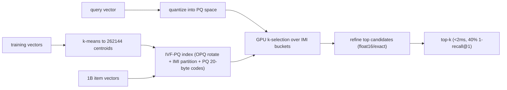

**Interview questions this design invites**
- What does each stage of OPQ, IMI, and PQ contribute, and why compose them rather than use HNSW?
- Why does product quantization split a vector into subspaces, and how does that set the memory-vs-recall knob?
- When does GPU acceleration pay off, and what is the k-selection kernel doing that a naive sort cannot?
- How do you choose the number of centroids (why 262,144) relative to dataset size?
- What is 1-recall@1 measuring, and why report it instead of recall@10?
- How does float16 storage and compute affect accuracy versus the memory saved?

**Tricks and gotchas**
- PQ codes are lossy, so IVF-PQ needs a refine/rescore step on the top candidates to recover precision.
- OPQ's rotation before quantization is what makes PQ subspaces roughly independent; skipping it hurts recall.
- GPU k-selection keeps all state in registers to avoid memory round-trips, which is why it approaches peak bandwidth.
- Training k-means can stream vectors to GPU without fitting the whole training set in memory, so training scale is not bounded by GPU RAM.

**Common mistakes and how to fix them**
- Storing full float32 vectors at billion scale: use PQ codes (about 20-30 bytes/vector) to fit in a fixed RAM budget.
- Under-training the coarse quantizer: too few centroids makes buckets huge and search slow, so scale centroids with N.
- Trusting compressed distances alone: keep a refine stage that rescores the shortlist with higher precision.

### Google Research: ScaNN, anisotropic vector quantization ([source](https://research.google/blog/announcing-scann-efficient-vector-similarity-search/))

ScaNN targets maximum inner product search (MIPS) for two-tower retrieval, where queries and items map to a shared space and you want the highest inner products. Its core idea is anisotropic vector quantization: instead of minimizing average reconstruction error uniformly, it penalizes quantization error parallel to the original vector, accepting worse reconstruction of low inner products in exchange for preserving the high ones that actually determine ranking. The pipeline partitions vectors into codebook cells, scores candidates using the compressed codes, then rescores the top candidates with exact inner products. On glove-100-angular it beat eleven tuned libraries, serving roughly twice the QPS at a given accuracy.

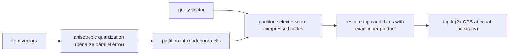

**Interview questions this design invites**
- Why is minimizing average quantization error the wrong objective for MIPS ranking?
- What does penalizing parallel (versus orthogonal) error do to the preserved inner products?
- How does the partition-score-rescore pipeline trade recall against QPS at each stage?
- Why does MIPS (inner product) behave differently from Euclidean nearest neighbor for quantization?
- How would you tune the number of partitions and rescore depth for a latency target?
- What does the ann-benchmarks glove-100 result tell you, and where might it not transfer to your data?

**Tricks and gotchas**
- The loss is directional: parallel error hurts high-inner-product items most, so the quantizer is tuned to the ranking goal, not reconstruction fidelity.
- Compressed scoring is approximate, so the exact rescore of the shortlist is what recovers top-k precision.
- Benchmark wins are dataset-specific (glove-100-angular); the anisotropic advantage depends on your embedding distribution.

**Common mistakes and how to fix them**
- Reusing a Euclidean-tuned quantizer for inner-product search: switch the loss to penalize parallel error for MIPS.
- Trusting compressed scores as final: add an exact-inner-product rescore over the top candidates.
- Over-fitting parameters to one benchmark: retune partitions and rescore depth on your own labeled queries.

### Microsoft Research: DiskANN, SSD-backed billion-vector ANN ([source](https://www.microsoft.com/en-us/research/project/project-akupara-approximate-nearest-neighbor-search-for-large-scale-semantic-search/))

DiskANN indexes up to a billion vectors on a single machine at 95% search accuracy with about 5ms latency by pairing a Vamana graph with hybrid SSD-plus-DRAM storage, fitting 5-10x more points per machine than DRAM-only ANN systems. The streaming variant, FreshDiskANN, indexes over a billion points on a workstation with an SSD and limited memory while sustaining thousands of concurrent real-time inserts, deletes, and searches per second. The design keeps a compressed representation resident in DRAM to route graph traversal and reads full-precision vectors from SSD only for the candidates that need exact scoring, so a commodity box handles what previously needed a cluster.

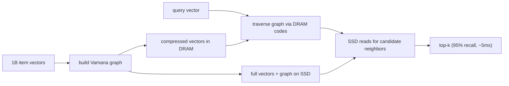

**Interview questions this design invites**
- Why does SSD-backed storage let one machine hold 5-10x more vectors than a DRAM-only index?
- What role does the DRAM-resident compressed representation play during graph traversal?
- How does the Vamana graph differ from HNSW, and why choose it for a disk-backed layout?
- How does FreshDiskANN support concurrent inserts and deletes without a full rebuild?
- What sets the roughly 5ms latency floor, and how do SSD reads factor into it?
- How would you shard DiskANN across machines if the corpus outgrew one SSD?

**Tricks and gotchas**
- SSD random-read latency, not compute, dominates the query budget, so minimizing per-query SSD reads is the whole game.
- Keeping compressed vectors in DRAM to route traversal means full vectors are read only for final candidates, cutting I/O.
- Streaming inserts and deletes need careful graph maintenance so recall does not decay as the graph churns.

**Common mistakes and how to fix them**
- Assuming billion-scale ANN needs a cluster: a single SSD-backed box can serve it at 95% recall, so right-size the hardware.
- Reading full vectors during traversal: route with DRAM-resident compressed codes and hit SSD only for candidates.
- Treating a graph index as static: use a streaming design (FreshDiskANN) when inserts and deletes are continuous.

### Instacart: ITEMS two-tower search over FAISS ([source](https://company.instacart.com/how-its-made/how-instacart-uses-embeddings-to-improve-search-relevance))

Instacart's ITEMS (Instacart Transformer-based Embedding Model for Search) is a two-tower bi-encoder that maps queries and products into a shared space, so a product embedding is fixed regardless of query and can be precomputed. Positive pairs come from post-search cart-adds, trained with in-batch negatives plus self-adversarial reweighting, and a cascade scheme warms up on noisier data then fine-tunes on stricter conversion signals; product inputs concatenate metadata with special tokens ([PN], [PBN], [PCS], [PAS]) and multi-task heads predict brand and category to cluster the space. Serving precomputes product embeddings daily into a FAISS ANN index and caches embeddings for over 95% of queries in a FeatureStore (computing novel queries on the fly) to hold sub-8ms latency. EBR complements keyword and category matching for long or ambiguous queries and lifted cart-adds-per-search 4.1% in A/B tests.

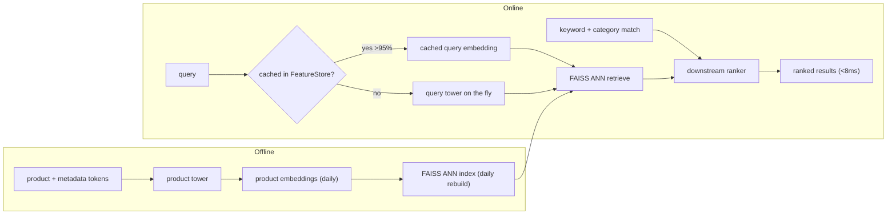

**Interview questions this design invites**
- Why does a bi-encoder let you precompute product embeddings, and what does that buy at serving time?
- How do in-batch negatives with self-adversarial reweighting shape what the model learns?
- Why cache embeddings for 95% of queries, and how do you keep the long tail under the 8ms budget?
- Why rebuild the FAISS index daily instead of streaming upserts, and when would that break?
- What do the multi-task brand/category heads add over the main retrieval objective?
- Why does EBR help most on long or ambiguous queries versus short exact ones?

**Tricks and gotchas**
- Bi-encoder embeddings are query-independent, which is exactly what makes daily precomputation and caching possible.
- More training data hurt past a noise threshold, so the cascade warms up on noisy pairs then fine-tunes on clean conversions.
- Special tokens that structure product metadata ([PN]/[PBN]/[PCS]/[PAS]) feed the tower more signal than raw text.
- Human eval tracked relevance better than raw clickthrough because CTR carries popularity bias.

**Common mistakes and how to fix them**
- Dumping all logged pairs into training: filter by conversion quality, since noisy pairs past a threshold degrade the model.
- Computing every query embedding live: cache the frequent 95% and only compute the novel tail to hold latency.
- Using EBR alone: fuse it with keyword and category matching and feed a downstream ranker for final ordering.

### Dropbox: selecting an embedding model via MTEB ([source](https://dropbox.tech/machine-learning/selecting-model-semantic-search-dropbox-ai))

Facing over a trillion documents and a keyword system that missed synonyms and multilingual queries, Dropbox ran a model-selection study rather than jumping to an index. They adapted the MTEB benchmark (8 task types, 56 datasets) with in-house inference adapters, per-document multi-embedding (overlapping chunks), 32-to-8-bit precision experiments, and custom datasets built from anonymized search logs. Testing 11 models across English, Japanese, Spanish, Korean, and German, multilingual-e5-large won (English MRR 0.5044 vs 0.3299 runner-up). A 4KB per-document metadata cap drove the serving shape: two embeddings per document (path and content), 8-bit quantization with a custom scaling scheme, a 512-token content window, and full dimensionality kept to minimize cosine-similarity error. Rollout cut zero-result sessions 17%.

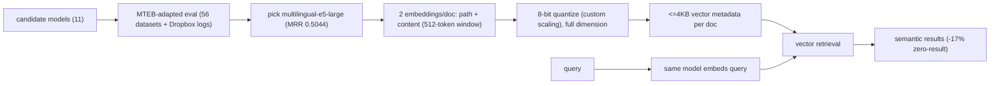

**Interview questions this design invites**
- Why start with a model-selection benchmark instead of picking an index first?
- How do you adapt a public benchmark like MTEB to your own multilingual, domain-specific corpus?
- Why embed path and content separately rather than one embedding per document?
- What does the 4KB per-document metadata cap force in the dimension and precision choices?
- Why keep full dimensionality but drop to 8-bit precision, rather than truncating dimensions?
- How do you build labeled eval data from anonymized search logs without leaking user content?

**Tricks and gotchas**
- The storage cap (4KB/doc) is the real design constraint: it sets how many embeddings, what dimension, and what precision you can afford.
- Full dimension plus 8-bit precision was chosen to bound cosine-similarity error; truncating dimension would have cost more recall.
- Multilingual retrieval is a distinct axis: the winner beat English-only models by a wide MRR margin on non-English queries.
- Custom scaling for 8-bit quantization matters because a naive linear scale can blow up similarity error on outlier dims.

**Common mistakes and how to fix them**
- Picking the top MTEB leaderboard model blindly: re-rank candidates on your own domain and languages before committing.
- Embedding whole documents: chunk with overlap or split path and content so long docs do not wash out the signal.
- Truncating dimension to save space first: try precision reduction (8-bit) with careful scaling, which kept recall here.

### LinkedIn: two-stage retrieval plus ranker with Matryoshka embeddings ([source](https://www.linkedin.com/blog/engineering/ai/semantic-search-for-ai-agents-at-scale-retrieval-and-ranking-for-linkedins-hiring-assistant))

LinkedIn's Hiring Assistant searches 1B+ member profiles in two stages: an L1 embedding retrieval scans precomputed profile vectors with IVFPQ ANN (returning hundreds of candidates, post-filtered by attribute-based matching), then an L2 DCNv2 learning-to-rank stage rescores for recruiter engagement. The MUSE embedding model is a dual-tower Siamese encoder trained with a Matryoshka-equipped InfoNCE loss, producing nested vectors truncatable at different sizes: 2048 dims for fast ANN retrieval and the full 4096 dims for ranking, with coarse signals (title, seniority, location) in the low dimensions and fine qualification reasoning in the high ones. A weekly batch layer runs full LLM inference over all profiles to build the IVFPQ index and a Venice key-value store, a daily speed layer uses change-data-capture delta inference for freshness, and a single query LLM call embeds in under 100ms at p95.

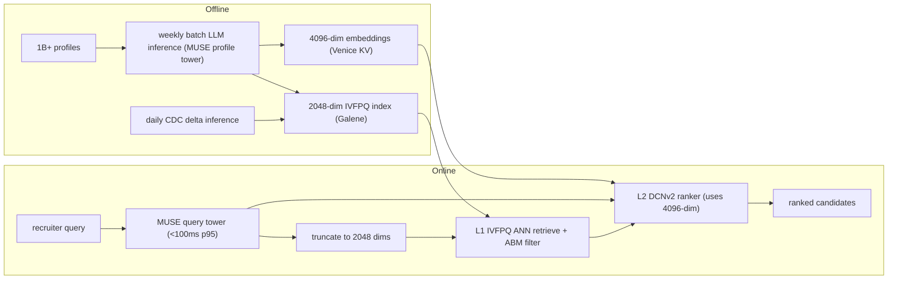

**Interview questions this design invites**
- Why split retrieval (L1) from ranking (L2), and what does each stage optimize for?
- How do Matryoshka embeddings let one model serve 2048 dims for search and 4096 dims for ranking?
- Why use a smaller dimension for ANN retrieval but the full dimension for the ranker?
- How does the batch-plus-speed-layer (lambda-style) design keep a 1B-profile index fresh?
- Why does a DCNv2 ranker with Hadamard crossing beat cosine similarity for final ordering?
- How does attribute-based filtering combine with ANN without breaking recall?

**Tricks and gotchas**
- Matryoshka nesting means the 2048-dim retrieval vector is a prefix of the 4096-dim ranking vector, so one training run serves both, no separate models.
- The ranker reuses the same embeddings as its strongest feature group, so retrieval quality directly transfers to engagement prediction.
- Inline ABM filtering skips distance math for excluded profiles, saving compute inside the ANN scan.
- A weekly full rebuild plus daily CDC delta inference balances index cost against freshness for slowly-changing profiles.

**Common mistakes and how to fix them**
- Training separate models per dimension: use a Matryoshka loss so one encoder yields all truncation levels.
- Ranking on retrieval scores alone: add an L2 learned ranker with feature crossing for the top candidates.
- Rebuilding a billion-vector index for every update: keep a batch base index and layer CDC delta inference for freshness.

_Not reachable: Faire (Beyond BM25 and dense embeddings) - redirected to a login wall on the single fetch attempt._

---

## Long-context and the KV cache

### vLLM (UC Berkeley): OS-style paged KV-cache management ([source](https://arxiv.org/abs/2309.06180))

vLLM is a serving system built around PagedAttention, an attention kernel that manages the KV cache in fixed-size blocks like operating-system virtual-memory pages instead of one contiguous buffer per sequence. Because the cache grows and shrinks dynamically during decode, contiguous allocation wastes memory to internal and external fragmentation; paging drives that toward near-zero waste and lets blocks be shared within and across requests. The extra packing means more concurrent sequences fit in the same GPU memory, delivering 2x to 4x throughput over prior systems like FasterTransformer and Orca at matched latency. The gains are largest for long sequences, big models, and parallel-sampling decode strategies where memory pressure is worst.

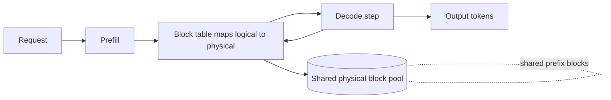

**Interview questions this design invites**

- Why does a contiguous per-sequence KV buffer waste memory, and which fragmentation type dominates?
- How does a block table translate logical token positions to physical blocks?
- What block size trades internal fragmentation against table overhead?
- How does copy-on-write let parallel samples share a prompt's KV blocks?
- Why do throughput gains grow with sequence length and batch size?
- What is the memory-versus-latency relationship once you can pack more sequences?

**Tricks and gotchas**

- Paging adds an indirection per attention access, so the kernel must be written to gather non-contiguous blocks without killing bandwidth.
- Block size is a real tuning knob: too large wastes the tail block, too small bloats the block table.
- Sharing blocks across requests needs reference counting and copy-on-write to stay correct when one sequence diverges.
- Throughput wins depend on there being enough queued requests to fill the freed memory.

**Common mistakes and how to fix them**

- Assuming paging speeds up a single request. It raises concurrency and throughput, not per-token latency; measure aggregate tokens per second.
- Forgetting the block-table lookup cost. Fuse it into the attention kernel rather than doing it in Python per step.
- Setting block size by intuition. Sweep it against your real sequence-length distribution.
- Ignoring reference counting on shared prefixes. Leaked or prematurely freed blocks corrupt other sequences; instrument the pool.

### Character.AI: MQA plus hybrid attention, cross-layer KV sharing, and int8 ([source](https://blog.character.ai/optimizing-ai-inference-at-character-ai-2/))

Character.AI cut KV-cache size by more than 20x by stacking three architectural changes: Multi-Query Attention (roughly 8x smaller than GQA), hybrid local/global attention with sliding windows on 5 of every 6 layers, and KV sharing across neighboring layers for another 2x to 3x. They train models natively in int8 (weights, activations, and the KV cache) rather than post-training quantizing, which needs custom matmul and attention kernels. A stateful inter-turn prefix cache, an LRU tree indexed by rolling hash, hits about 95% across the fleet because the average conversation carries 180 messages of history. Together these cut serving cost 33x since late 2022, at over 20,000 queries per second.

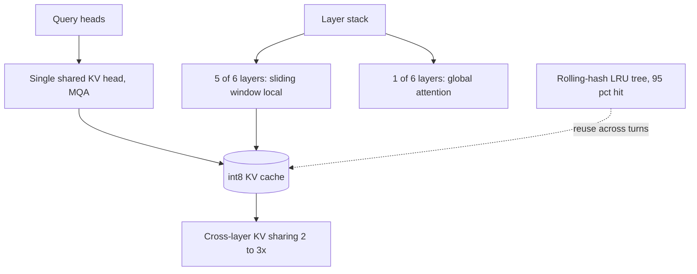

**Interview questions this design invites**

- Why does MQA give a larger cache cut than GQA, and what quality risk does it carry?
- How does a 5-of-6 local/global layer pattern preserve long-range information cheaply?
- What makes native int8 training different from post-training quantization for the KV cache?
- How does a rolling hash key the prefix cache across dialogue turns?
- Why does a 95% hit rate matter more when average history is 180 messages?
- Where does cross-layer KV sharing lose quality, and how do you bound it?

**Tricks and gotchas**

- Native int8 requires custom kernels; you cannot bolt it on with a stock stack.
- Sliding-window local layers need at least some global layers or long-range recall collapses.
- Rolling-hash prefix keys must handle turn boundaries and tokenizer edges or hit rate degrades silently.
- Cross-layer sharing couples layers, so a bad share pattern hurts quality unevenly.

**Common mistakes and how to fix them**

- Treating MQA as free. It is aggressive; validate quality on your task before shipping, and fall back to GQA if it regresses.
- Post-quantizing to int8 and expecting Character.AI's numbers. They trained in int8; PTQ needs its own eval and per-channel scales.
- Building a flat prefix cache. Use a tree keyed by hashed prefixes so multi-turn history reuses shared ancestors.
- Sharing KV across arbitrary layers. Place shared and full layers deliberately, keeping enough independent global layers.

### DeepSeek (V2): Multi-head Latent Attention compresses KV into a latent ([source](https://arxiv.org/abs/2405.04434))

DeepSeek-V2 introduces Multi-head Latent Attention, which does not cache full keys and values at all; it down-projects each token into a small latent vector, caches only that latent, and up-projects back to per-head keys and values at attention time. This shrinks the KV cache about 93.3% versus the dense predecessor while keeping quality high. It pairs with DeepSeekMoE, activating only 21B of 236B parameters per token, so both cache memory and per-token compute stay low. RoPE does not commute cleanly with the compression, so DeepSeek splits the head dimension into a positional RoPE-carrying part and a compressed latent part.

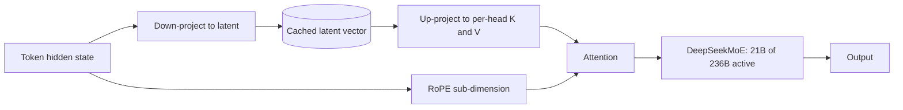

**Interview questions this design invites**

- How does MLA differ from GQA in what actually shrinks the cache formula?
- Why can you store a latent and reconstruct K and V instead of caching them?
- Why does RoPE break naive latent compression, and how does splitting the head fix it?
- What compute cost does the up-projection add per decode step?
- How do MLA and MoE attack different terms of the serving bill?
- When would MLA beat GQA despite its extra complexity?

**Tricks and gotchas**

- The RoPE-versus-latent head split is the detail most diagrams get wrong; both parts must be concatenated per head.
- The up-projection matmul is paid every step, so it must be cheap relative to the memory saved.
- MoE keeps all experts resident in memory even though only a few activate, so weight memory rises.
- Latent width is a quality knob: too small and reconstruction loses information.

**Common mistakes and how to fix them**

- Claiming MLA shrinks kv_heads like GQA. It replaces cached K and V with a latent; describe the mechanism, not the head count.
- Applying RoPE to the whole latent. Split the head so only the positional sub-dimension carries RoPE.
- Assuming MoE cuts memory. It cuts active compute per token but needs all experts in HBM; budget for that.
- Picking latent dims by feel. Sweep the down-projection width against quality on long-context evals.

### Google Research (GQA): trade KV heads for speed at near-MHA quality ([source](https://arxiv.org/abs/2305.13245))

Grouped-Query Attention sits between Multi-Head Attention (one KV head per query head) and Multi-Query Attention (a single shared KV head) by using an intermediate number of KV heads, each shared across a group of query heads. This directly shrinks the kv_heads term of the cache formula while keeping quality close to MHA. The paper also gives a recipe to uptrain existing MHA checkpoints into GQA (and MQA) using about 5% of original pre-training compute, so you convert a trained model rather than retrain from scratch. The result reaches quality close to MHA at speed comparable to MQA, which is why GQA is the current default.

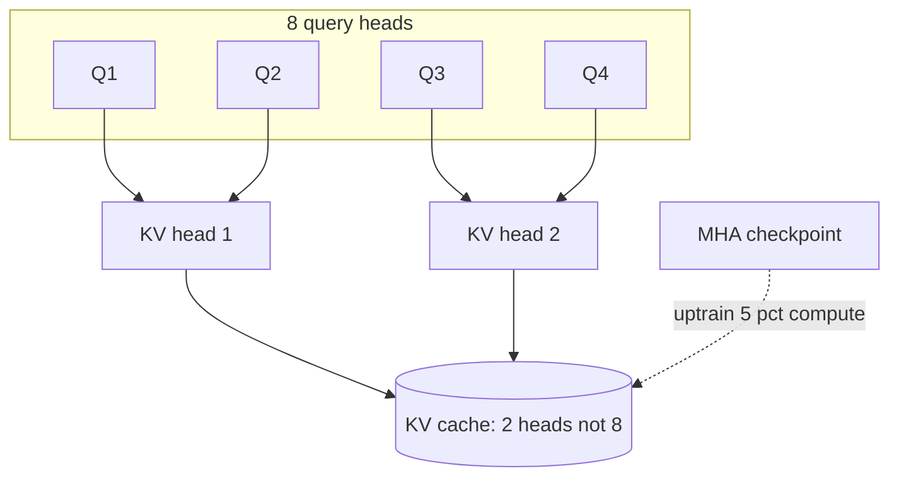

**Interview questions this design invites**

- How does GQA interpolate between MHA and MQA, and what does the group size control?
- Why does GQA lose less quality than MQA for the same cache saving?
- How does uptraining convert an MHA checkpoint into GQA cheaply?
- What is the cache-reduction factor for 32 query heads and 8 KV heads?
- Why is GQA the safe default over MLA for most deployments?
- How do you pick the number of KV groups for a target memory budget?

**Tricks and gotchas**

- Uptraining still costs about 5% of pretraining compute; it is cheap, not free.
- Group size is a direct quality-versus-memory dial; too few KV heads approaches MQA's quality risk.
- Mean-pooling the original KV heads when initializing groups matters for uptraining quality.
- GQA shrinks the cache but leaves head_dim and layer count untouched.

**Common mistakes and how to fix them**

- Conflating GQA and MQA. GQA keeps several KV heads; MQA keeps one. State the group count.
- Expecting free conversion. Budget the 5% uptraining compute and re-evaluate quality after.
- Setting one KV head to maximize savings. Keep enough groups to stay near MHA quality on your evals.
- Assuming GQA fixes long-context memory alone. Combine with paging, quantization, or prefix caching.

### NVIDIA: TensorRT-LLM KV-cache early reuse ([source](https://developer.nvidia.com/blog/5x-faster-time-to-first-token-with-nvidia-tensorrt-llm-kv-cache-early-reuse/))

TensorRT-LLM lets shared prefixes (system prompts) be reused as their KV cache is being built rather than only after the whole computation finishes, which cuts redundant prefill during traffic surges. It adds flexible block sizing, letting developers chop KV blocks into sizes from 64 down to 2 tokens so short sequences waste less cache and reuse more precisely. Its eviction algorithm traces dependency trees and evicts dependent (child) blocks before their source (parent) blocks, so reusable prefixes survive under pressure. This yields up to 5x faster time-to-first-token for system-prompt-heavy workloads and about 7% additional speedup from block sizing on LLaMA-70B on H100.

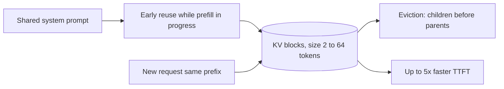

**Interview questions this design invites**

- What does early reuse buy over reuse that waits for full prefill completion?
- How does variable block size reduce wasted cache for short sequences?
- Why must eviction evict dependent blocks before their source blocks?
- Where does the 5x TTFT gain come from, and for which workloads?
- What is the failure mode if a parent prefix block is evicted first?
- How does this compare to vLLM's fixed-block paging?

**Tricks and gotchas**

- Smaller blocks improve reuse granularity but increase block-table and management overhead.
- Early reuse only helps when prefixes genuinely repeat, such as a fixed system prompt under a surge.
- Dependency-aware eviction is essential; naive LRU can evict a shared parent and force recompute for everyone.
- The 7% block-sizing gain is model and shape specific, not universal.

**Common mistakes and how to fix them**

- Using one large block size everywhere. Match block size to your sequence-length distribution.
- Treating eviction as plain LRU. Track block dependencies so shared prefixes are evicted last.
- Expecting TTFT gains without shared prefixes. The win is prefix-reuse; measure your prefix hit rate first.
- Ignoring management overhead of tiny blocks. Profile the crossover where smaller blocks stop helping.

### NVIDIA: NVFP4 4-bit KV cache ([source](https://developer.nvidia.com/blog/optimizing-inference-for-long-context-and-large-batch-sizes-with-nvfp4-kv-cache/))

NVFP4 is a 4-bit floating-point format for the KV cache that cuts KV memory roughly 50% versus an FP8 cache, effectively doubling the context length, batch size, and concurrency that fit in HBM. Values are dequantized from NVFP4 up to FP8 before the attention math to hold accuracy, and its finer block scaling gives about 5% higher accuracy than MXFP4. Measured accuracy loss is under 1% across LiveCodeBench, MMLU-PRO, MBPP, and Ruler 64K. It optimizes for memory bandwidth and long-context/large-batch serving, reporting up to 3x prefill improvement from higher cache-hit rates and freeing HBM for weights and parallelism.

```mermaid
flowchart LR
  KV[K and V tensors] --> QN[Quantize to NVFP4 4-bit]
  QN --> STORE[(NVFP4 KV cache, ~50 pct of FP8)]
  STORE --> DQ[Dequantize to FP8]
  DQ --> ATT[Attention compute]
  STORE --> CAP[2x context, batch, concurrency]
```

**Interview questions this design invites**

- Why quantize the KV cache rather than only the weights for long-context serving?
- Why dequantize NVFP4 to FP8 before attention instead of computing in 4-bit?
- What does finer block scaling buy over MXFP4?
- How does halving KV memory translate into doubled context or batch?
- How would you gate a 4-bit KV format behind an accuracy eval?
- Why does a smaller cache also help decode bandwidth, not just capacity?

**Tricks and gotchas**

- Block scaling granularity drives the accuracy gap; coarser scales lose more than the headline 1%.
- The dequant-to-FP8 step is what protects accuracy; skipping it to compute in raw 4-bit degrades quality.
- Sub-1% loss is benchmark-dependent; your task may be more sensitive, especially at very long context.
- Freed HBM only helps if you actually raise batch size or context to use it.

**Common mistakes and how to fix them**

- Shipping 4-bit KV on vibes. Gate behind an eval on your own long-context tasks, as the CLAUDE guidance insists.
- Assuming all 4-bit formats are equal. NVFP4's block scaling beats MXFP4 by about 5%; pick the format deliberately.
- Quantizing keys and values identically without checking. Keys are often more sensitive; validate per-tensor behavior.
- Cutting memory but not raising throughput. Deliberately increase batch or context to convert savings into gains.

### Databricks: MixAttention (cross-layer KV sharing plus sliding window) ([source](https://www.databricks.com/blog/mixattention))

MixAttention shrinks the KV cache by combining sliding-window attention (queries attend to only the last 1024 tokens) on most layers, a few retained standard full-attention layers for long-range ability, and KV-cache sharing where multiple layers reuse one layer's KV tensors. Their ablations found that keeping standard attention in the deeper layers matters more for long-context ability than keeping it in the first few layers, and that sharing among sliding-window layers should not be overdone. The best variants (MA-Offset and MA-Pairs) place full-attention layers deep and limit sharing. On a single H100 at 32K context this gives faster inference and larger batch sizes, with quality preserved on commonsense and world knowledge but some regression on reading comprehension.

```mermaid
flowchart TB
  IN[Input] --> SW1[Sliding-window layer, last 1024 tokens]
  SW1 --> SW2[Sliding-window layer]
  SW2 --> ST[Deep standard full-attention layer]
  ST --> SH[Layers reuse shared KV]
  SW1 --> KV[(Reduced KV cache)]
  ST --> KV
  SH --> KV
  KV --> OUT[Output]
```

**Interview questions this design invites**

- Why does placing full-attention layers deep help long context more than placing them early?
- How does a 1024-token sliding window bound the per-layer cache?
- What does cross-layer KV sharing save, and what does it cost in quality?
- Why does MixAttention regress on reading comprehension but not commonsense?
- How would you search the space of which layers are full versus windowed versus shared?
- What is the memory reduction when every l layers share one KV?

**Tricks and gotchas**

- Over-sharing among sliding-window layers hurts quality more than sharing across mixed layers.
- Long-context ability is sensitive to where the full-attention layers sit, not just how many there are.
- Reading-comprehension-style tasks are the canary for too aggressive windowing.
- Gains are reported at 32K on one H100; different context lengths shift the tradeoff.

**Common mistakes and how to fix them**

- Putting the full-attention layers up front. Their ablation says deep placement preserves long context; move them deeper.
- Sharing KV across as many layers as possible. Cap sharing and keep independent full layers.
- Validating only on commonsense benchmarks. Add reading-comprehension and retrieval evals to catch the regression.
- Assuming the window size is free. Sweep window length against your long-range task needs.

### Databricks: automatic prompt (prefix) caching for open models ([source](https://www.databricks.com/blog/accelerating-llm-inference-prompt-caching-open-source-models-databricks))

Databricks added automatic prompt caching that reuses the KV cache whenever an identical prompt prefix reappears across requests, with no user configuration; matching a cached prefix lets the expensive prefill stage be skipped entirely. In production on GPT-OSS models this delivered 2.5x higher per-replica input-token throughput and 3x lower P50 latency, and notably at only a 30% cache hit ratio. Caches are volatile and isolated per tenant, never persisted to storage. It targets repeated-prefix workloads: large shared system prompts, real-time chat, batch document processing, and agent deployments, across GPT-OSS, Gemma 3, and Llama 3.x models.

```mermaid
flowchart LR
  REQ[Request with prefix] --> LK{Prefix in cache?}
  LK -- hit --> SKIP[Skip prefill, reuse KV]
  LK -- miss --> PF[Prefill and cache prefix]
  SKIP --> DEC[Decode]
  PF --> DEC
  PF --> C[(Volatile per-tenant KV cache)]
  C --> LK
```

**Interview questions this design invites**

- Why can matching a prefix skip the entire prefill stage?
- How can a 30% hit rate still yield 2.5x throughput and 3x lower P50?
- What isolation guarantees must a multi-tenant prefix cache enforce?
- Which workloads have naturally high prefix reuse?
- How does automatic prefix matching differ from an explicit prompt-cache API?
- Why report P50 latency here rather than P99?

**Tricks and gotchas**

- Exact-prefix matching means a single differing early token misses the whole cache; prompt structure matters.
- Volatile caches vanish on eviction or restart, so hit rate is workload-dependent, not guaranteed.
- Multi-tenant isolation is mandatory; a leaked prefix cache would cross user boundaries.
- The 30%-hit result is specific to those models and prompts; measure your own reuse.

**Common mistakes and how to fix them**

- Placing variable content before the shared prefix. Put the stable system prompt and shared docs first so the prefix matches.
- Assuming caching helps decode-heavy work. It skips prefill, so it helps long-prompt short-output shapes most.
- Ignoring tenant isolation. Key caches per tenant and never persist them.
- Expecting a fixed hit rate. Instrument real prefix reuse before promising latency numbers.

_Not reachable: none_

---

## Inference serving at scale

### Anyscale (vLLM): continuous batching plus PagedAttention for 23x throughput ([source](https://www.anyscale.com/blog/continuous-batching-llm-inference))

Anyscale shows that the throughput wall in LLM serving is static batching, where the whole batch is held hostage by its longest-generating member and the GPU idles as members finish. Continuous batching schedules at the iteration level: when a sequence emits its end-of-sequence token, its slot is freed immediately and a waiting request is admitted. vLLM stacks PagedAttention on top, allocating the KV cache in fixed-size blocks instead of one contiguous buffer, cutting memory waste under 4 percent. On Meta OPT-13B on an A100-40GB, the ladder runs naive static batching at baseline, FasterTransformer at 4x, plain continuous batching at 8x, and vLLM at 23x, with the biggest wins when output lengths vary a lot.

```mermaid
flowchart TD
  REQ["incoming requests"] --> SCHED["iteration-level scheduler"]
  SCHED --> BATCH["current batch (dynamic membership)"]
  BATCH --> STEP["one decode step (all seqs)"]
  STEP --> DONE{"sequence hit EOS?"}
  DONE -->|"yes: retire, free slot"| SCHED
  DONE -->|"no: keep"| BATCH
  BATCH --> PAGED["PagedAttention KV blocks (non-contiguous, JIT allocated)"]
  STEP --> OUT["streamed tokens"]
```

**Interview questions this design invites**
- Why does static batching leave the GPU idle, and how does iteration-level scheduling fix it?
- What problem does PagedAttention solve that continuous batching alone does not?
- Why do high-variance output lengths produce the biggest throughput gain?
- How does block-based KV allocation drive memory waste below 4 percent?
- Where does the waiting_served_ratio knob trade prefill against decode?
- What is the throughput ceiling once the KV cache, not compute, is the bottleneck?

**Tricks and gotchas**
- The 23x is versus naive static batching; the honest comparison against optimized static (FasterTransformer) is closer to 5-6x.
- PagedAttention needs a custom attention kernel; you cannot just bolt it onto a stock attention path.
- Admitting a new sequence still consumes KV blocks, so a full batch can OOM if you do not reserve cache budget.
- Gains are workload-shaped: uniform short outputs see far less than high-variance chat traffic.

**Common mistakes and how to fix them**
- Claiming continuous batching alone gives 23x; separate the scheduling win (8x) from the PagedAttention memory win.
- Assuming bigger batches always help; past the KV-cache limit you thrash, so size batches to the cache budget.
- Forgetting prefill interference; a long prompt still stalls the batch step, so add chunked prefill.
- Treating PagedAttention as free; the block table and kernel add bookkeeping you must account for.

### Character.AI: MQA, cross-layer KV sharing, and int8 for 13.5x cheaper serving ([source](https://blog.character.ai/optimizing-ai-inference-at-character-ai/))

Character.AI serves consumer chat at roughly 20,000 queries per second, about 20 percent of Google Search volume, at under one cent per conversation hour. They attack the KV cache directly: multi-query attention collapses the KV heads, cross-layer KV sharing reuses cache across layers, and int8 quantization shrinks the bytes read per decode step. Inter-turn caching keeps a conversation's prefix resident across turns so repeated chat context is not recomputed. The combined result is serving cost cut at least 33x since 2022 launch and about 13.5x cheaper than using leading commercial APIs. The public post emphasizes the economics; the named attention and quantization details live in their companion technical writeup.

```mermaid
flowchart TD
  REQ["chat turn"] --> CACHE{"prefix in inter-turn cache?"}
  CACHE -->|"hit"| DEC["decode (reuse cached KV)"]
  CACHE -->|"miss"| PRE["prefill"]
  PRE --> DEC
  DEC --> MQA["MQA: shared KV heads"]
  DEC --> XLAYER["cross-layer KV sharing"]
  DEC --> INT8["int8 weight + KV"]
  DEC --> OUT["token stream"]
```

**Interview questions this design invites**
- How does multi-query attention shrink the KV cache, and what quality risk does it carry?
- What is cross-layer KV sharing and why is it safe to reuse cache across layers?
- Why is inter-turn (prefix) caching especially valuable for a chat product?
- How does int8 quantization convert to serving cost, given decode is bandwidth-bound?
- What does 20,000 QPS at under a cent per hour imply about batch sizes per GPU?
- Where does aggressive KV reduction start to hurt output quality?

**Tricks and gotchas**
- MQA and cross-layer sharing both trade model expressivity for cache size; they must be trained in, not switched on at serving.
- The 13.5x is versus commercial APIs, a different baseline than versus their own earlier stack (33x).
- Inter-turn caching needs sticky routing so a returning turn lands on the GPU holding its prefix.
- int8 is only a win if kernels actually read fewer bytes; a dequant-on-load path can erase it.

**Common mistakes and how to fix them**
- Conflating MQA with GQA; state that MQA is the extreme (one KV head) and GQA is the tunable middle.
- Assuming prefix caching is automatic; it requires cache-aware routing and eviction policy.
- Quoting the cost multiple without the baseline; always say versus what.
- Ignoring quality gating; every KV or precision cut goes behind an eval before it ships.

### LinkedIn: n-gram speculative decoding for 4x throughput and 66 percent lower P90 ([source](https://www.linkedin.com/blog/engineering/ai/accelerating-llm-inference-with-speculative-decoding-lessons-from-linkedins-hiring-assistant))

LinkedIn's Hiring Assistant emits text that quotes job descriptions and candidate profiles verbatim, so its output is highly predictable from the prompt. They exploit this with n-gram (prompt-lookup) speculative decoding: instead of hosting a separate draft model, they draft the next few tokens straight from patterns already in the input, then verify them in one parallel pass on the target model. Because scoring several tokens costs about the same as scoring one, high acceptance turns into real speed. They report nearly 4x throughput at the same QPS and latency ceiling and a 66 percent average reduction in P90 end-to-end latency, with no quality loss. It runs on their vLLM stack tuned with num_speculative_tokens, prompt_lookup_max, and prompt_lookup_min.

```mermaid
flowchart TD
  PROMPT["prompt (job desc + profile)"] --> LOOKUP["n-gram lookup: draft next k tokens from input patterns"]
  LOOKUP --> VERIFY["target model verifies k tokens in one parallel pass"]
  VERIFY --> ACC{"accepted?"}
  ACC -->|"yes"| EMIT["emit accepted tokens"]
  ACC -->|"first reject"| FALL["fall back to target token"]
  EMIT --> LOOKUP
  FALL --> LOOKUP
```

**Interview questions this design invites**
- Why does n-gram drafting need no separate draft model, and what does it give up?
- What property of the Hiring Assistant workload makes acceptance rate high?
- Why is verifying k tokens roughly as cheap as verifying one?
- How do prompt_lookup_min and prompt_lookup_max trade acceptance against draft waste?
- Why report both throughput (4x) and P90 latency (66 percent) rather than one number?
- When would n-gram speculation actively hurt, and how would you detect it?

**Tricks and gotchas**
- Prompt-lookup only wins when output echoes the prompt; free-form creative generation kills acceptance.
- Setting num_speculative_tokens too high wastes verification compute when drafts miss.
- The latency win concentrates at low-to-moderate batch sizes; at very large batches the GPU is already saturated.
- prompt_lookup_min too low triggers speculation on weak matches, dragging acceptance down.

**Common mistakes and how to fix them**
- Believing speculation changes outputs; correct verification preserves the target distribution exactly, so measure parity.
- Tuning one knob in isolation; min, max, and num_speculative_tokens interact and must be swept together.
- Assuming the technique generalizes; validate acceptance rate per workload before enabling it.
- Enabling it at huge batch sizes; measure that verification overhead does not outweigh the saved steps.

### Baseten (BEI): batching, backpressure, FP8, and TensorRT-LLM for 2x embedding throughput ([source](https://www.baseten.co/blog/how-we-built-bei-high-throughput-embedding-inference/))

Baseten built BEI, a runtime for embedding, reranker, and classifier models, reaching up to 2.05x throughput over vLLM and TEI. The core is NVIDIA TensorRT-LLM (XQA attention, layer fusion) for at least a 15 percent speedup, plus FP8 on H100 for 50 percent-plus more throughput while retaining over 99 percent cosine similarity to the unquantized outputs. The server is four parts: a Rust frontend for I/O, a multi-core tokenizer, a token-based batch manager that packs to a token budget rather than a request count (so variable inputs up to 32K tokens do not OOM), and the C++ TensorRT-LLM engine. Backpressure plus Baseten's traffic-based autoscaling lets it hold 1000-plus concurrent connections.

```mermaid
flowchart TD
  REQ["requests (up to 1000+ concurrent)"] --> FE["Rust frontend (I/O)"]
  FE --> BP{"backpressure gate"}
  BP -->|"admit"| TOK["multi-core tokenizer"]
  BP -->|"shed"| REJ["backpressure signal"]
  TOK --> BATCH["token-based batch manager (pack to token budget)"]
  BATCH --> ENG["TensorRT-LLM engine (FP8, XQA, layer fusion)"]
  ENG --> OUT["embeddings / scores"]
```

**Interview questions this design invites**
- Why pack a batch by token budget rather than request count for variable-length inputs?
- How does FP8 give 50 percent throughput while keeping over 99 percent output similarity?
- What role does backpressure play when 1000-plus clients connect at once?
- Why put the frontend in Rust and the engine in C++ rather than one runtime?
- How do XQA and layer fusion contribute the base 15 percent speedup?
- What is different about serving embeddings/rerankers versus autoregressive decode?

**Tricks and gotchas**
- Embedding inference is prefill-only (no decode loop), so the batching math differs from chat serving.
- Token-based packing prevents OOM but needs a max-token cap sized to the 32K input ceiling.
- FP8 must be quality-gated per model; cosine similarity over 99 percent is the eval bar, not an assumption.
- Backpressure without a clear client retry signal just moves the collapse to the caller.

**Common mistakes and how to fix them**
- Batching by request count; switch to token budgets so a few 32K inputs cannot blow memory.
- Assuming a decode-oriented stack fits embeddings; strip the decode loop and optimize the single forward pass.
- Shipping FP8 blind; verify cosine similarity against bf16 before enabling.
- Ignoring the frontend cost; a slow tokenizer or I/O layer caps throughput before the GPU does.

### NVIDIA Dynamo: disaggregated prefill/decode with a KV-aware smart router ([source](https://developer.nvidia.com/blog/introducing-nvidia-dynamo-a-low-latency-distributed-inference-framework-for-scaling-reasoning-ai-models/))

Dynamo is an open-source distributed serving framework built for reasoning models, reporting up to 30x throughput on DeepSeek-R1 671B on GB200 NVL72 and 2x-plus on Llama 70B on Hopper. It disaggregates prefill (compute-bound, low tensor parallelism) from decode (memory-bound, high tensor parallelism) so each phase gets its own parallelism. A Smart Router tracks KV cache across the fleet with a radix tree, scoring prefix overlap to route a request to the worker that already holds the most relevant blocks and minimize recompute. A distributed KV cache manager offloads cold blocks to CPU memory, local disk, or networked object storage (up to petabytes cheaply), a Dynamic GPU Planner shifts capacity between prefill and decode against the SLO, and NIXL provides a uniform data-movement API across the memory tiers.

```mermaid
flowchart TD
  REQ["request"] --> ROUTER["smart router (radix tree KV overlap score)"]
  ROUTER --> PRE["prefill pool (low TP)"]
  PRE -->|"KV handoff via NIXL"| DEC["decode pool (high TP)"]
  DEC --> OUT["token stream"]
  KVM["distributed KV manager (CPU / disk / object store, tiered offload)"] -.-> PRE
  KVM -.-> DEC
  PLAN["dynamic GPU planner (SLO-driven)"] -.-> PRE
  PLAN -.-> DEC
```

**Interview questions this design invites**
- Why give prefill low tensor parallelism and decode high tensor parallelism?
- How does a radix tree over KV blocks let the router cut recompute?
- What does the KV handoff cost, and why does it need NIXL / a fast fabric?
- When does disaggregation pay off versus a single pool with chunked prefill?
- How does the Dynamic GPU Planner decide to move a GPU from prefill to decode?
- Why is tiered KV offload (CPU/disk/object) worth petabytes of cheap storage?

**Tricks and gotchas**
- Disaggregation only wins if the prefill-to-decode transfer rides fast interconnect; a slow link becomes the new bottleneck.
- Phase-specific parallelism means two engine configs to tune and keep in sync, not one.
- The 30x headline is on Blackwell NVL72 with fast fabric; commodity nodes will not reproduce it.
- Router prefix scoring helps only when traffic shares prefixes (system prompts, shared docs).

**Common mistakes and how to fix them**
- Disaggregating a small model at moderate QPS; a single pool with chunked prefill is simpler and usually enough.
- Ignoring transfer latency; size the interconnect first or the hand-off eats the win.
- Static prefill/decode split; use an SLO-driven planner so a decode-heavy shift does not starve one pool.
- Offloading hot KV to slow storage; keep active sequences on GPU and only tier cold blocks.

### Together AI (ATLAS): runtime-learning speculative decoding that adapts to live traffic ([source](https://www.together.ai/blog/adaptive-learning-speculator-system-atlas))

ATLAS keeps the speculative-decoding speedup from degrading when traffic drifts. It pairs a static heavyweight speculator that gives a consistent baseline on any workload with a lightweight adaptive speculator that learns from live traffic in real time, and a confidence-aware controller picks between them and tunes lookahead depth, drafting further when confidence is high and pulling back when it drops. Built on Together Turbo, it reports up to 500 TPS on DeepSeek-V3.1 and 460 TPS on Kimi-K2, roughly 4x baseline with no manual configuration, and a 401 percent speedup over the FP8 baseline on DeepSeek (105 to 501 TPS at batch size 1 on 4 B200 GPUs). Because it learns online, it specializes to the current session, for example a specific code file during a development session.

```mermaid
flowchart TD
  REQ["live request"] --> CTRL["confidence-aware controller (pick speculator, set lookahead)"]
  CTRL --> STATIC["static heavyweight speculator (baseline)"]
  CTRL --> ADAPT["lightweight adaptive speculator (learns online)"]
  STATIC --> VERIFY["target model parallel verify"]
  ADAPT --> VERIFY
  VERIFY --> OUT["token stream"]
  OUT -->|"live traffic signal"| ADAPT
```

**Interview questions this design invites**
- Why does a static speculator lose acceptance as the workload drifts?
- How does the controller decide between the static and adaptive speculators?
- What signal trains the adaptive speculator online, and what is the feedback loop risk?
- Why does lookahead depth need to track confidence rather than stay fixed?
- How does online specialization help a long coding session specifically?
- What is the baseline behind the 401 percent number (FP8, batch 1, 4 B200)?

**Tricks and gotchas**
- Online learning adds a training loop on the serving path; it must not stall decode.
- Adaptive gains are session-shaped; a cold or highly varied stream sees less than a focused one.
- The big multiples are at batch size 1; at high batch the GPU is already saturated and speculation helps less.
- A confidently wrong adaptive speculator wastes verification, so the confidence estimate itself must be calibrated.

**Common mistakes and how to fix them**
- Assuming a once-trained speculator stays optimal; measure acceptance over time and adapt if it decays.
- Reporting batch-1 speedups as fleet throughput; separate latency wins from aggregate throughput.
- Letting the adaptive model overfit a session and hurt the next; keep the static baseline as a floor.
- Skipping output-parity checks; adaptation changes drafts, never the verified distribution, so prove it.

### Fireworks AI (FireOptimizer): adaptive speculative execution with workload-trained draft models ([source](https://fireworks.ai/blog/fireoptimizer))

FireOptimizer is Fireworks' adaptation engine that tailors inference to a customer's specific traffic, with adaptive speculative execution as the headline giving up to 3x lower latency. Rather than a generic draft model, it automatically trains and deploys a draft model on the customer's own data (traced production traffic or a sample set), because the higher the draft hit rate the larger the latency win. Their case study is the sharp lesson: a generic draft model hit only 29 percent and actually slowed inference 1.5x, while the specialized draft reached 76 percent and delivered a 2x speedup. Beyond speculation it layers customizable quantization, adaptive caching, and hardware mapping, all profile-driven with no manual hyperparameter tuning, currently on enterprise reserved deployments.

```mermaid
flowchart TD
  DATA["customer data (traced prod or sample)"] --> TRAIN["auto-train specialized draft model"]
  TRAIN --> DRAFT["workload-specific draft model"]
  REQ["request"] --> DRAFT
  DRAFT --> VERIFY["target model parallel verify"]
  VERIFY --> OUT["token stream"]
  TUNE["profile-driven tuning (quant, caching, hardware map)"] -.-> VERIFY
```

**Interview questions this design invites**
- Why does a customized draft model beat a generic one on latency?
- How can a bad draft model (29 percent hit) make inference slower, not faster?
- What hit rate is the rough break-even where speculation starts paying off?
- Why train the draft on traced production data rather than a public corpus?
- How do quantization, caching, and hardware mapping compose with speculation?
- What deployment shape (reserved vs on-demand) does per-workload training imply?

**Tricks and gotchas**
- A low-acceptance draft is net-negative: you pay draft compute and still fall back, so measure before shipping.
- Training on production traces raises data-handling and privacy questions you must answer.
- The 3x is a ceiling; the realized number tracks the customer's actual hit rate.
- Per-workload draft models mean one model per customer to train, deploy, and keep fresh as traffic drifts.

**Common mistakes and how to fix them**
- Reusing one generic draft across workloads; specialize per workload or acceptance collapses.
- Ignoring the slowdown risk; gate any draft behind a measured hit rate before enabling.
- Treating the draft as static; retrain as the customer's traffic distribution shifts.
- Stacking quant and speculation without eval; verify quality after each layer, not just the final stack.

### Modal: engine choice, quantization, CUDA graphs, and snapshots for throughput ([source](https://modal.com/docs/guide/high-performance-llm-inference))

Modal's guide is the serverless-serving angle: pick the engine to the workload (vLLM for throughput thanks to its prefill/decode scheduling, SGLang for latency-sensitive decode because of lower host overhead), then tune precision and cold starts. FP8 on H100/H200 is the default precision win while immature FP4 is avoided, and for cold-start-bound cases aggressive quantization (even integer or ternary) helps by shrinking bytes to load even when it does not speed inference. CUDA graph capture and JIT compilation raise steady-state throughput but are tricky to cache and add tens of seconds per boot. Modal's headline lever is Memory Snapshots, which serialize a warmed container (GPU snapshots claim 10x cold-start reduction), backed by loading weights from Modal Volumes at 1-2 GB/s, roughly a second per gigabyte.

```mermaid
flowchart TD
  REQ["request"] --> ENGINE{"engine choice"}
  ENGINE -->|"throughput"| VLLM["vLLM (prefill/decode scheduling)"]
  ENGINE -->|"latency"| SGL["SGLang (low host overhead)"]
  VLLM --> QUANT["FP8 quantization (H100/H200)"]
  SGL --> QUANT
  QUANT --> GRAPH["CUDA graphs + JIT (steady-state throughput)"]
  COLD["cold start"] --> SNAP["memory snapshot (10x faster boot)"]
  SNAP --> VOL["weights from Modal Volume (1-2 GB/s)"]
  VOL --> ENGINE
  GRAPH --> OUT["token stream"]
```

**Interview questions this design invites**
- When do you pick vLLM over SGLang, and what property drives the choice?
- Why can aggressive quantization help cold starts even without a decode speedup?
- What is the tradeoff of CUDA graphs and JIT: throughput up, but what cost?
- How do memory snapshots cut cold-start time by roughly 10x?
- Why does weight-load bandwidth (1-2 GB/s) set a floor on boot time?
- On serverless GPU, when is scale-to-zero acceptable and when is it not?

**Tricks and gotchas**
- CUDA graphs and JIT are hard to cache, so their throughput win can be undone by boot-time penalties on a spiky workload.
- Snapshotting a warmed process needs code changes to the inference server; it is not transparent.
- Weight load is bandwidth-bound at about a second per gigabyte, so a multi-GB model still costs real seconds even snapshotted.
- FP4 support is immature; reaching for it early buys instability, not speed.

**Common mistakes and how to fix them**
- Enabling CUDA graphs on a scale-to-zero hot path; measure boot cost, or keep a warm buffer instead.
- Using scale-to-zero for latency-sensitive traffic; reserve it for cold, rarely-used models.
- Assuming one engine fits all; match vLLM/SGLang to the throughput-vs-latency SLO.
- Ignoring weight-load bandwidth in the cold-start budget; stream from a fast Volume and size the model down.

_Not reachable: none_

---

## Realtime streaming chat

### LinkedIn: end-to-end streaming generative AI assistant with progressive parsing ([source](https://www.linkedin.com/blog/engineering/generative-ai/musings-on-building-a-generative-ai-product))

LinkedIn built their assistant on a three-step RAG pattern: a routing step classifies the query and picks an agent, a retrieval step calls internal RPC APIs (wrapped as LLM-friendly "skills") plus external services like Bing, and a generation step synthesizes the answer. They cut perceived latency with end-to-end token streaming and progressive parsing, firing downstream API calls the moment their parameters appear in the LLM output rather than waiting for the full response. They used small models for routing and retrieval and bigger models for generation, and preferred YAML over JSON in schemas to save tokens. Quality was the hard part: one month to reach 80 percent, four more months to pass 95 percent, backed by a layered eval pipeline with linguist annotation of about 500 daily conversations.

```mermaid
flowchart LR
  U["user query"] --> R["routing<br/>(small model)"]
  R --> RET["retrieval<br/>(internal APIs + Bing)"]
  RET --> G["generation<br/>(large model)"]
  G -->|"token stream"| C["client render"]
  G -->|"progressive parse"| SK["fire skill calls<br/>as params appear"]
  SK --> RET
```

**Interview questions this design invites**
- Why route with a small model and generate with a big one instead of one model for both?
- How does progressive parsing of the LLM output reduce end-to-end latency, and what breaks if the partial parse is wrong?
- How do you expose proprietary internal APIs to an LLM safely as "skills"?
- Why did quality take four extra months when 80 percent came in one, and what does that say about eval-driven development?
- How would you detect and bound hallucination in a chat product at scale?
- Chain-of-thought adds hidden reasoning tokens the user never sees; how do you plan capacity for that?

**Tricks and gotchas**
- Progressive parsing means you fire side-effecting API calls before the model has finished; a later token can contradict an early one.
- Defensive parsing matters: initial LLM format-error rate was about 10 percent, driven to roughly 0.01 percent with hardening.
- YAML instead of JSON for schemas measurably cuts token cost on high-volume prompts.
- Reasoning tokens are invisible latency; time-to-first-token can look fine while total generation balloons.

**Common mistakes and how to fix them**
- Waiting for the full LLM response before acting: parse and dispatch incrementally instead.
- One giant model for every stage: split routing/retrieval (cheap, fast) from generation (expensive, high quality).
- Trusting LLM output format: add tolerant parsing and repair, not strict schema rejection.
- Treating eval as an afterthought: stand up human plus model-based eval early or the last 15 percent of quality never lands.

### Cloudflare: Durable Objects for persistent WebSockets and auth in AI Gateway ([source](https://blog.cloudflare.com/do-it-again/))

Cloudflare added a WebSocket API to AI Gateway so clients hold a single persistent connection for many inference requests instead of reopening HTTP connections, backed by Durable Objects that reuse the existing Universal Endpoint code. Because WebSocket traffic is asynchronous and multiple streaming inferences can be in flight at once, they tag every message with an eventId so the client can attribute each chunk to the right request. Auth runs either through Cloudflare API tokens in a cf-aig-authorization header or, for browsers that cannot set custom headers, through the sec-websocket-protocol header. Each connection gets a UUID, and streaming requests send initial metadata, then live chunks, then a completion message, at the scale of 3-plus billion daily logs.

```mermaid
flowchart LR
  C["client"] -->|"persistent WebSocket"| DO["Durable Object<br/>(per connection UUID)"]
  DO --> AUTH["auth<br/>(cf-aig-authorization<br/>or sec-websocket-protocol)"]
  AUTH --> UE["Universal Endpoint<br/>(shared code)"]
  UE --> INF["AI inference provider"]
  INF -->|"chunks tagged eventId"| DO
  DO -->|"stream"| C
```

**Interview questions this design invites**
- Why multiplex many inference requests over one WebSocket instead of one connection per request?
- How does eventId solve response attribution when several streams share a duplex socket?
- Why do browsers need the sec-websocket-protocol header trick for auth?
- What does a Durable Object give you that a stateless Worker does not for a long-lived connection?
- How do you clean up a Durable Object when a client disconnects mid-stream?
- How would you rate-limit or bill per-request when everything rides one socket?

**Tricks and gotchas**
- Async duplex sockets make responses ambiguous without an explicit correlation id on every message.
- Browsers cannot set arbitrary headers on a WebSocket handshake, so auth has to ride the subprotocol field.
- Reusing the HTTP Universal Endpoint code inside the Durable Object avoids a divergent second code path.
- A single persistent connection concentrates state, so connection lifecycle and cleanup become the reliability surface.

**Common mistakes and how to fix them**
- Assuming ordered request/response like HTTP: add an eventId and demultiplex on the client.
- Opening a new connection per inference: reuse one persistent socket to cut handshake overhead.
- Forgetting browser header limits: fall back to sec-websocket-protocol for the token.
- Leaking connection state: pin state to a Durable Object with a UUID and tear it down on close.

### Vercel: Chat SDK for cross-platform agent streaming ([source](https://vercel.com/blog/chat-sdk-brings-agents-to-your-users))

Vercel's Chat SDK is a TypeScript library that runs one agent codebase across Slack, Teams, Google Chat, Discord, Telegram, WhatsApp, GitHub, and Linear. It pipes AI SDK text streams straight into each platform through adapters: Slack renders formatting natively in real time, while platforms without live streaming use a throttled fallback that repeatedly edits the message, running streamed text through each adapter's markdown-to-native converter at every intermediate edit. The adapter layer also normalizes channel and user names, link previews, referenced posts, and image context, and it handles platform limits like WhatsApp's 24-hour messaging window. State persists in Redis or PostgreSQL, supporting distributed locks and key-value cache across bot instances.

```mermaid
flowchart LR
  LLM["AI SDK text stream"] --> AD["adapter layer<br/>(markdown to native)"]
  AD -->|"native streaming"| SL["Slack (live edits)"]
  AD -->|"throttled fallback<br/>(repeated edits)"| OT["Teams / Telegram /<br/>WhatsApp / Discord"]
  ST["Redis / PostgreSQL<br/>(locks, kv state)"] --> AD
```

**Interview questions this design invites**
- Why is a throttled edit-loop fallback needed when a platform lacks native streaming?
- What are the tradeoffs of re-editing one message repeatedly versus appending new messages?
- How do you keep one agent codebase portable across platforms with different formatting models?
- Why put distributed locks in front of shared bot state, and what race do they prevent?
- How does a 24-hour messaging window (WhatsApp) change how you queue outbound tokens?
- Where does session memory live so a conversation survives across bot instances?

**Tricks and gotchas**
- The throttled fallback re-runs markdown-to-native conversion at each intermediate edit, so conversion cost is paid many times per message.
- Rapid message edits can hit platform rate limits; throttling is a correctness constraint, not just polish.
- Different platforms have different native format targets (Block Kit, GFM, code blocks), so one output has many renders.
- Distributed locks are required because multiple instances may touch the same conversation state.

**Common mistakes and how to fix them**
- Assuming every platform streams like Slack: detect capability and fall back to throttled edits.
- Editing on every token: throttle the edit rate to stay under platform limits.
- Keeping bot state in process memory: move to Redis or PostgreSQL so instances share it.
- Ignoring platform send windows: buffer and respect constraints like the 24-hour window.

### OpenAI: realtime speech-to-speech and audio model snapshots for voice ([source](https://developers.openai.com/blog/updates-audio-models))

OpenAI shipped updated audio model snapshots aimed at production voice apps: gpt-realtime-mini for native speech-to-speech over the Realtime API, gpt-audio-mini for speech-to-speech in Chat Completions, plus a mini TTS and a mini transcribe model. The realtime model improved instruction-following by 18.6 percent and tool-calling accuracy by 12.9 percent, the TTS model dropped word error rates by about 35 percent, and the transcribe model cut hallucinations by roughly 90 percent versus Whisper v2 in noisy audio and during silence. Turn detection is handled model-side in the speech-to-speech path rather than by an external endpointer, and pricing stayed flat so existing integrations can migrate by snapshot.

```mermaid
flowchart LR
  U["user audio"] --> RT["gpt-realtime-mini<br/>(speech-to-speech,<br/>model-side turn detect)"]
  RT --> OUT["audio out"]
  subgraph componentized["componentized path"]
    A["audio in"] --> STT["gpt-4o-mini-transcribe"]
    STT --> L["LLM"]
    L --> TTS["gpt-4o-mini-tts"]
    TTS --> A2["audio out"]
  end
```

**Interview questions this design invites**
- When do you pick native speech-to-speech over a componentized STT plus LLM plus TTS pipeline?
- What does model-side turn detection buy you versus a separate endpointing model?
- Why do transcription hallucinations spike during silence or background noise, and how do you measure it?
- How do you evaluate instruction-following and tool-calling accuracy for a voice model specifically?
- What is the migration risk of pinning to a dated model snapshot versus a floating alias?
- How does a unified speech-to-speech model change your latency budget versus a three-stage pipeline?

**Tricks and gotchas**
- Native speech-to-speech folds turn detection into the model, removing a tunable external endpointer you might want control over.
- Transcription models hallucinate words during silence; a 90 percent reduction still is not zero.
- Snapshot-pinned models keep behavior stable but require deliberate migration to get gains.
- Speech-to-speech and componentized paths have different debuggability; you cannot inspect an intermediate transcript in the fused model.

**Common mistakes and how to fix them**
- Reaching for a componentized pipeline by default: use native speech-to-speech when you need lowest latency and do not need the intermediate transcript.
- Ignoring silence handling: pick a transcribe model hardened against hallucination in noise, and gate on confidence.
- Floating on an unpinned model: pin a snapshot and test before migrating.
- Assuming tool calls work in voice: measure tool-calling accuracy separately, since it lags text.

### LiveKit: WebRTC over WebSockets for realtime voice agents ([source](https://livekit.com/blog/why-webrtc-beats-websockets-for-voice-ai-agents))

LiveKit argues WebSockets are the wrong transport for voice because they run on TCP, which guarantees ordered delivery by retransmitting lost packets, causing head-of-line blocking: audio that arrived fine sits buffered and unplayed until the gap is filled, and a 200ms retransmit stall destroys conversational flow. WebRTC instead uses UDP with RTP, favoring timing over perfect reliability, so a single lost 20ms frame is barely noticeable. WebRTC also ships adaptive jitter buffers, media-aware congestion control (like Google Congestion Control) that lowers bitrate before loss occurs, built-in echo cancellation and noise suppression, and NAT traversal via ICE, STUN, and TURN. A Selective Forwarding Unit routes media without decoding, and multi-region SFUs let users hit the nearest node to trim latency across the STT, LLM, and TTS pipeline.

```mermaid
flowchart LR
  U["user"] -->|"UDP / RTP<br/>(WebRTC)"| SFU["Selective Forwarding Unit<br/>(multi-region)"]
  SFU --> JB["jitter buffer +<br/>congestion control"]
  JB --> STT["STT"] --> LLM["LLM"] --> TTS["TTS"]
  TTS -->|"RTP"| U
```

**Interview questions this design invites**
- What is head-of-line blocking and why does it hurt voice more than text?
- Why is dropping a 20ms audio frame better than a 200ms retransmit stall?
- What does WebRTC give you out of the box that you would otherwise build (jitter buffer, echo cancel, congestion control)?
- What is an SFU and why forward media without decoding?
- Why keep WebSockets for signaling even when media rides WebRTC?
- How does multi-region SFU placement change the end-to-end latency budget?

**Tricks and gotchas**
- TCP reliability is a liability for audio: retransmission stalls the whole stream, not just the lost frame.
- Congestion control that reacts to loss is too late; WebRTC predicts congestion and lowers bitrate first.
- NAT traversal (ICE/STUN/TURN) is non-trivial and is a reason people wrongly default to WebSockets.
- An SFU forwards without transcoding, so it scales far better than a decode-re-encode mixer.

**Common mistakes and how to fix them**
- Defaulting to WebSockets for audio: use WebRTC/UDP so packet loss does not stall playback.
- Building your own jitter buffer and echo cancellation: use the WebRTC media pipeline that already has them.
- Transcoding media at the server: use an SFU to forward without decoding.
- Ignoring geography: deploy multi-region SFUs so users connect to the nearest node.

### Deepgram: eager end-of-turn to overlap the LLM with speech ([source](https://developers.deepgram.com/docs/flux/voice-agent-eager-eot))

Deepgram's Flux fires an EagerEndOfTurn event when it reaches moderate confidence that the user has stopped speaking, letting the agent start LLM generation on a medium-confidence transcript instead of waiting for the high-confidence EndOfTurn, which can shave hundreds of milliseconds off response time. Two thresholds tune the behavior: eager_eot_threshold triggers speculation earlier at the risk of false starts, and eot_threshold governs the reliable finalization. If the user keeps talking after the eager event, a TurnResumed event cancels the speculation, and the agent discards the draft response and waits for the next turn. The tradeoff is roughly 50 to 70 percent more LLM calls in exchange for lower latency.

```mermaid
flowchart LR
  SP["user speech"] --> STT["Flux STT"]
  STT -->|"medium confidence"| EE["EagerEndOfTurn"]
  EE --> LLM["start LLM (speculative)"]
  STT -->|"user keeps talking"| TR["TurnResumed<br/>(discard draft)"]
  TR --> STT
  STT -->|"high confidence"| EOT["EndOfTurn"]
  EOT --> RESP["commit response"]
```

**Interview questions this design invites**
- Why start the LLM before you are sure the user finished speaking?
- What happens to the speculative response when TurnResumed fires?
- How do eager_eot_threshold and eot_threshold trade speed against false starts?
- What is the cost of speculation (50 to 70 percent more LLM calls) and when is it worth it?
- How do you make LLM calls cancellable so a discarded draft frees resources?
- How does this interact with barge-in, where the user interrupts the agent?

**Tricks and gotchas**
- Eager triggering is speculation: some fraction of LLM calls are thrown away when the user resumes.
- Lowering the eager threshold cuts latency but raises false-start rate; the two thresholds must be tuned together.
- Discarded drafts still cost tokens and slots, so the LLM call must be genuinely cancelable.
- Overlapping generation with speech only helps if downstream (TTS) can also start and cancel cleanly.

**Common mistakes and how to fix them**
- Waiting for high-confidence end-of-turn before starting: start eagerly on medium confidence and cancel if wrong.
- Firing eager too aggressively: raise eager_eot_threshold if false starts hurt quality.
- Not canceling speculative work: wire TurnResumed to abort the LLM call and free the slot.
- Ignoring the extra LLM spend: budget for 50 to 70 percent more calls before enabling it.

### AssemblyAI: Universal-Streaming immutable transcripts with semantic endpointing ([source](https://www.assemblyai.com/blog/introducing-universal-streaming))

AssemblyAI's Universal-Streaming is a speech-to-text model built for voice agents that emits immutable transcripts in about 300ms: every word is final on first emission and never revised, unlike traditional streaming that emits changeable partials then finals. They report 307ms latency versus a competitor's 516ms, 91 percent word accuracy, and 21 percent fewer errors on alphanumeric data like confirmation codes. Endpointing combines acoustic and semantic features with traditional silence detection rather than relying on silence alone, so the agent detects true end-of-turn without awkward pauses. The service scales from 5 to 50,000-plus concurrent streams, prices at 0.15 dollars per hour of session duration, and drops into LiveKit, Pipecat, Daily, and Vapi.

```mermaid
flowchart LR
  A["user audio"] --> US["Universal-Streaming STT"]
  US -->|"immutable words (~300ms)"| T["transcript (never revised)"]
  US --> EP["endpointing<br/>(acoustic + semantic + silence)"]
  EP --> TURN["end-of-turn signal"]
  T --> LLM["downstream LLM"]
  TURN --> LLM
```

**Interview questions this design invites**
- Why do immutable transcripts simplify a downstream LLM pipeline versus revisable partials?
- What is lost by never revising a word, and how do you handle a genuine mistake?
- Why combine acoustic and semantic features with silence for endpointing instead of silence alone?
- How does pricing by session duration rather than audio length change capacity planning?
- What does 300ms latency buy you in an interactive voice loop?
- How do you validate 91 percent accuracy on hard cases like alphanumeric confirmation codes?

**Tricks and gotchas**
- Immutable means the model must be confident on first emission; there is no take-back if it is wrong.
- Silence-only endpointing produces awkward pauses; semantic features detect end-of-turn earlier and more naturally.
- Latency numbers are competitive claims (307ms vs 516ms); measure on your own audio.
- Billing on session duration, not audio length, means idle-but-open streams still cost money.

**Common mistakes and how to fix them**
- Reprocessing revisable partials downstream: use immutable transcripts so the LLM never re-reads changed text.
- Endpointing on silence alone: add acoustic plus semantic signals to cut false and late turn detection.
- Assuming accuracy is uniform: test alphanumeric and domain-specific inputs separately.
- Leaving streams open idle: close sessions promptly since billing tracks session duration.

### ElevenLabs: low-latency streaming TTS pipelines for conversational AI ([source](https://elevenlabs.io/blog/enhancing-conversational-ai-latency-with-efficient-tts-pipelines))

ElevenLabs frames low latency as the defining feature of good conversational AI and argues you should stream audio during generation rather than synthesizing a whole response first, so users hear speech before the full sentence is synthesized. They recommend adaptive buffering that adjusts preload to network conditions to avoid gaps and stalls, and parallelizing text preprocessing, synthesis, and audio rendering rather than running them in series. They also advise matching the TTS model to the use case instead of always deploying the heaviest model, trading unnecessary complexity for responsiveness where quality allows.

```mermaid
flowchart LR
  TXT["LLM text stream"] --> PRE["text preprocessing"]
  PRE --> SYN["TTS synthesis<br/>(streaming chunks)"]
  SYN --> BUF["adaptive buffer<br/>(network-aware)"]
  BUF --> PLAY["client playback<br/>(starts before full sentence)"]
  PRE -.parallel.-> SYN
  SYN -.parallel.-> REN["audio rendering"]
```

**Interview questions this design invites**
- Why stream TTS audio chunks instead of synthesizing the full response first?
- What is time-to-first-byte for TTS and why does it dominate perceived latency?
- How does adaptive buffering trade off stall risk against latency?
- When is a lighter TTS model the right call over the highest-quality one?
- How do you parallelize preprocessing, synthesis, and rendering without audio artifacts?
- How does TTS latency compose with STT and LLM latency in the full voice loop?

**Tricks and gotchas**
- Too little buffer causes gaps on jitter; too much buffer adds latency, so buffering must adapt to the network.
- Streaming TTS lets playback begin before the sentence is done, but chunk boundaries can create audible seams.
- Always using the heaviest model needlessly inflates latency; match model to use case.
- Serial preprocess-then-synthesize-then-render wastes time; overlap the stages.

**Common mistakes and how to fix them**
- Synthesizing the whole utterance before playback: stream chunks so users hear the first words immediately.
- Fixed buffer sizes: use adaptive buffering that tracks network conditions.
- Defaulting to the biggest TTS model: pick the lightest model that meets the quality bar.
- Running the pipeline serially: parallelize preprocessing, synthesis, and rendering.

_Not reachable: none_

---

## Cost optimization and model routing

### Stanford: FrugalGPT, an LLM cascade that defers to pricier models only when the cheap answer looks unreliable ([source](https://arxiv.org/abs/2305.05176))

FrugalGPT tackles the fact that LLM APIs vary in price by up to two orders of magnitude, so paying frontier rates on every query wastes money on the easy majority. It instantiates an LLM cascade: queries hit a chain of models ordered cheap to expensive, and a learned scorer judges whether the current model's answer is reliable enough to return or whether to escalate. By learning which model combinations to use per query, it matches GPT-4 quality at up to 98% lower cost, or lifts accuracy 4% over GPT-4 at the same spend. The scorer, trained to predict answer reliability, is the load-bearing piece: it lets the system stop as soon as a cheap model is trustworthy.

```mermaid
flowchart TD
  Q["query"] --> M1["model 1<br/>cheapest"]
  M1 --> S1{"scorer<br/>answer reliable?"}
  S1 -->|"yes"| OUT["return answer"]
  S1 -->|"no, escalate"| M2["model 2<br/>pricier"]
  M2 --> S2{"scorer<br/>reliable?"}
  S2 -->|"yes"| OUT
  S2 -->|"no, escalate"| M3["model 3<br/>frontier"]
  M3 --> OUT
```

**Interview questions this design invites**
- How do you train the reliability scorer, and what labels does it need?
- What happens to end-to-end latency when a query walks the whole cascade?
- How do you order the models in the chain, and does order affect cost?
- How is the accept/escalate threshold calibrated, and how often re-calibrated?
- What tasks make the scorer trustworthy versus where does it break down?
- How do you keep the scorer's own cost from eating the savings?

**Tricks and gotchas**
- The scorer looks at an actual generated answer, unlike a router that decides blind, so it can catch the cheap model's own mistakes.
- A miscalibrated cutoff is the killer: too eager to accept quietly drops quality, too eager to escalate pays for multiple models on everything.
- Verifiable tasks (does the SQL run, does code compile) give a much cleaner escalation signal than open-ended generation.
- Savings depend on the price gap between cascade stages, so pair a genuinely cheap first stage with an expensive last one.

**Common mistakes and how to fix them**
- Reporting only cost while quality silently regresses on the hard tail: track quality per bucket, not just aggregate spend.
- Using model-reported confidence (log-probs) as if it were calibrated truth: prefer a trained scorer or a real verifier where you have ground truth.
- Setting one global threshold and never revisiting it as traffic drifts: re-check on held-out data periodically.

### LMSYS: RouteLLM, a preference-data router that splits traffic between a strong and a weak model ([source](https://www.lmsys.org/blog/2024-07-01-routellm/))

RouteLLM is an open framework that routes each query to either a cheap weak model or an expensive strong one, deciding before any generation. It trains routers on 55k human preference comparisons from Chatbot Arena, learning to predict which model would win on a given prompt and sending only the queries the weak model would likely lose to the strong model. Four router flavors were built: a similarity-weighted Elo ranker, a matrix-factorization model, a BERT classifier, and a causal-LLM classifier. On MT Bench it hits 95% of GPT-4 quality while making GPT-4 calls on only 14% of traffic (about 85% cost cut in the headline case), and the routers transfer to unseen model pairs like Claude 3 Opus and Llama 3 8B without retraining.

```mermaid
flowchart TD
  Q["query"] --> R["router<br/>predict weak-model win prob"]
  R --> D{"strong model<br/>needed?"}
  D -->|"low win prob<br/>hard query"| STRONG["strong model<br/>GPT-4 class"]
  D -->|"high win prob<br/>easy query"| WEAK["weak model<br/>Mixtral class"]
  STRONG --> OUT["response"]
  WEAK --> OUT
  PREF["Chatbot Arena<br/>55k preference pairs"] -.->|"train"| R
```

**Interview questions this design invites**
- Router versus cascade: why decide blind here instead of scoring an answer first?
- How does a preference-trained router generalize to model pairs it never saw?
- Where do you set the routing threshold, and what curve do you sweep to pick it?
- Which of the four router architectures would you ship, and why?
- What does the router cost per call, and how do you keep it from eating savings?
- How do you detect when the router mis-routes newly-hard queries?

**Tricks and gotchas**
- A router decides once, blind, before seeing any answer, so it cannot know it was wrong; that is exactly what a cascade fixes.
- Preference data lets the router learn transferable "hard versus easy" structure, so it survives model swaps without retraining.
- The router must be strictly cheaper than the models it gates; never make a frontier call just to route.
- Cost savings are quality-conditional: quoting the cost cut without the paired quality number is meaningless.

**Common mistakes and how to fix them**
- Training on stale traffic and never re-sweeping: traffic drift moves the frontier, so re-measure and alert on per-bucket quality.
- Optimizing the router purely for cost so it dumps hard queries on the weak model: load the eval set with the hard tail so this shows as a regression.
- Assuming one benchmark's savings transfer everywhere (MT Bench cut differs from MMLU): measure on your own traffic distribution.

### Anyscale: a fine-tuned complexity classifier routing between an open and a closed model ([source](https://www.anyscale.com/blog/building-an-llm-router-for-high-quality-and-cost-effective-responses))

Anyscale built a router that sends each query to either Mixtral-8x7B (cheap, open) or GPT-4 (expensive, closed) based on predicted difficulty, hitting baseline quality with up to a 70% cost cut on MT Bench. The router is a causal-LLM classifier fine-tuned from Llama3-8B, and a key finding was that plain binary labels gave too weak a training signal, so they trained a 5-way classifier predicting how well the open model would score on a query (1 low to 5 high). Queries the open model is predicted to handle well (score at or above 4) go to Mixtral; the rest go to GPT-4. Training labels came from an LLM-as-a-judge pipeline where GPT-4 graded Mixtral responses against its own reference answers across 109,101 queries.

```mermaid
flowchart TD
  Q["query text only"] --> C["Llama3-8B classifier<br/>predict open-model score 1-5"]
  C --> T{"predicted score >= 4?"}
  T -->|"yes, open model likely fine"| WEAK["Mixtral-8x7B<br/>cheap open"]
  T -->|"no, hard query"| STRONG["GPT-4<br/>expensive closed"]
  WEAK --> OUT["response"]
  STRONG --> OUT
  J["GPT-4 judge vs reference<br/>109k queries"] -.->|"label training data"| C
```

**Interview questions this design invites**
- Why did binary labels fail, and how does a 5-way score fix the signal?
- What are the risks of labeling training data with an LLM-as-a-judge?
- How do you pick the score cutoff between open and closed models?
- The classifier sees query text only: what quality does that leave on the table?
- How would you keep the Llama3-8B router cheaper than the models it gates?
- How do you monitor for the router mis-scoring newly-hard queries?

**Tricks and gotchas**
- A finer-grained score (1 to 5) carries more gradient than a hard easy/hard bit, giving a more robust router.
- The judge is GPT-4 grading against its own answers, so its blind spots become the router's blind spots.
- The score cutoff is a cost/quality knob: raising it sends more traffic to the cheap model and trades quality for savings.
- A fine-tuned small model beats a giant general one on this narrow routing task at a fraction of the cost.

**Common mistakes and how to fix them**
- Trusting judge labels as ground truth: spot-check against human labels, especially on the hard tail.
- Freezing the cutoff and never re-sweeping as traffic drifts: re-measure the frontier and alert per bucket.
- Assuming the 70% MT Bench cut transfers to every workload (GSM8K numbers differ): validate on your own traffic.

### IBM Research: a predictive best-value router across a library of models ([source](https://research.ibm.com/blog/LLM-routers))

IBM built a real-time router that acts as an "air traffic controller" for an ensemble of models, predicting before inference which one gives the best accuracy-to-cost ratio for a query and dispatching there. The routing algorithm is trained on public benchmark data to learn each model's strengths and weaknesses, so it can send routine work to small cheap models and reserve large models for hard, high-value queries without running several models at once. On HELM and RouterBench, an 11-model ensemble behind the router beat every individual model operating alone and even slightly edged GPT-4 on some tasks. The result is up to 85% inference cost reduction, roughly 5 cents saved per query, exploiting the fact that some 13B models beat Llama-2 70B on specific tasks.

```mermaid
flowchart TD
  Q["query"] --> R["predictive router<br/>estimate best accuracy-to-cost model"]
  R --> P{"pick from model library"}
  P -->|"routine"| SMALL["small 13B model"]
  P -->|"specialized"| MID["task-specialist model"]
  P -->|"hard / high value"| BIG["large model"]
  SMALL --> OUT["response"]
  MID --> OUT
  BIG --> OUT
  BENCH["benchmark data<br/>HELM / RouterBench"] -.->|"train"| R
```

**Interview questions this design invites**
- How do you route across many models rather than a simple strong/weak pair?
- Why can a benchmark-trained router beat every single model in the ensemble?
- How do you keep an 11-model library evaluated and from silently drifting?
- What does "best value" mean, and how do you weigh price against accuracy?
- How does routing on benchmark data generalize to live production queries?
- How do you add or retire a model from the library without retraining everything?

**Tricks and gotchas**
- Specialization beats size on narrow tasks: a well-matched 13B model can outscore a 70B general model, which is what the router monetizes.
- Predicting best-value before inference avoids the cost of racing models, unlike a cascade that pays for a first call.
- More models means more surfaces to evaluate and keep from drifting; the operational cost is real.
- Training on benchmarks risks a gap with production traffic; the benchmark distribution may not match live intent.

**Common mistakes and how to fix them**
- Assuming benchmark-trained routing holds on live traffic: shadow-evaluate a sample and monitor per-model quality.
- Ignoring model drift across a big library: schedule periodic re-evaluation of each model's strengths.
- Chasing headline cost cuts without a per-query quality floor: track cost per successful request, not raw spend.

### Microsoft Research: LLMLingua, prompt compression that strips low-information tokens ([source](https://www.microsoft.com/en-us/research/blog/llmlingua-innovating-llm-efficiency-with-prompt-compression/))

LLMLingua cuts the input-token bill by removing unimportant tokens from a prompt before it reaches the big model, using a small LM (GPT-2 small or LLaMA-7B) to score token importance by perplexity. It works in two stages: a coarse pass drops whole low-value sentences, then a fine pass compresses remaining tokens individually while preserving coherence, with a distribution-alignment step that instruction-tunes the small model to match the target LLM's patterns. On reasoning benchmarks (GSM8K, BBH) it reaches up to 20x compression with about a 1.5-point performance loss and 20 to 30% lower latency. It ships integrated into LlamaIndex for RAG.

```mermaid
flowchart TD
  P["long verbose prompt"] --> SM["small LM<br/>GPT-2 / LLaMA-7B<br/>perplexity token scoring"]
  SM --> C1["coarse pass<br/>drop low-value sentences"]
  C1 --> C2["fine pass<br/>drop low-value tokens"]
  C2 --> SHORT["compressed prompt<br/>up to 20x shorter"]
  SHORT --> BIG["target big model"]
  BIG --> OUT["answer"]
  ALIGN["distribution alignment<br/>tune small LM to target"] -.-> SM
```

**Interview questions this design invites**
- When does prompt compression pay off, given the small-LM pass has its own cost?
- How do you keep compression from dropping the one load-bearing token?
- Why a two-stage coarse-then-fine approach instead of one pass?
- How do you set and gate the compression ratio against a quality bar?
- On which tasks would you refuse to compress at all?
- How does distribution alignment help the compressed prompt survive a model swap?

**Tricks and gotchas**
- Compression only pays when input tokens dominate and context is long and redundant; on short prompts the small-LM pass is pure overhead.
- It is lossy: aggressive ratios can remove the exact detail the answer hinged on.
- Back off on exact extraction, legal, and code where every token matters.
- Trimming (send top 3 chunks not top 20) is the blunt safe move to try before compression.

**Common mistakes and how to fix them**
- Applying one fixed ratio everywhere: gate the ratio behind the same quality eval as any other lever.
- Compressing output-heavy workloads where input is not the cost driver: profile where the money goes first.
- Ignoring the compressor model's own token cost in the savings math: net it out before claiming a win.

### Databricks: governed batch LLM inference over warehouse data via ai_query ([source](https://www.databricks.com/blog/introducing-simple-fast-and-scalable-batch-llm-inference-mosaic-ai-model-serving))

Databricks added batch LLM inference to Mosaic AI Model Serving so teams can run models over millions or billions of tokens directly where governed data lives, with no data movement. The interface is a single SQL function, ai_query, callable from notebooks, SQL editors, or scheduled Delta Live Tables pipelines, so analysts run bulk inference without standing up serving infrastructure. Governance flows through Unity Catalog for lineage and security, and the platform auto-scales to the workload, batches whole datasets instead of row-by-row, and adds fault tolerance with automatic retries. This is the batch-versus-online cost lever: bulk work with no latency SLO runs at maximum batch size for far less than interactive pricing.

```mermaid
flowchart TD
  T["governed table<br/>Unity Catalog"] --> Q["ai_query(model, prompt)<br/>SQL interface"]
  Q --> SCALE["auto-scaled batch serving<br/>max batch size, no SLO"]
  SCALE --> MODEL["base / fine-tuned model"]
  MODEL --> RETRY{"fault tolerant<br/>auto retry"}
  RETRY -->|"ok"| RES["results table"]
  RETRY -->|"transient fail"| SCALE
  PIPE["notebook / DLT pipeline"] -.-> Q
```

**Interview questions this design invites**
- Which traffic is truly offline and belongs on a batch endpoint, not the sync one?
- Why does batching whole datasets cost less per token than online serving?
- How does keeping inference next to governed data reduce compliance risk?
- What latency do you trade away for the batch discount, and when is that acceptable?
- How does auto-scaling plus retries change the cost and reliability profile?
- How would you decide batch API versus saturated self-host for a bulk job?

**Tricks and gotchas**
- A lot of "LLM bill" is bulk work accidentally sitting on the interactive endpoint; spotting it is the design win.
- No tail-latency constraint means the GPU can run at max batch size, which online serving never achieves.
- Keeping data in place avoids export/compliance overhead that would otherwise erode the savings.
- Auto-retry matters at scale: a single transient failure in a billion-token job should not restart everything.

**Common mistakes and how to fix them**
- Running summarization/classification backfills on the online endpoint at online prices: move them to batch.
- Assuming batch means unbounded delay: right-size the job so results land inside the business deadline.
- Skipping governance on bulk jobs over sensitive tables: route through Unity Catalog for lineage and access control.

### Baseten: FP8 quantization for cheaper, faster self-hosted inference ([source](https://www.baseten.co/blog/33-faster-llm-inference-with-fp8-quantization/))

Baseten quantized Mistral 7B to FP8 (8-bit float) using an NVIDIA library compatible with TensorRT-LLM, targeting H100 and Ada/Hopper GPUs that support the format natively. FP8 halves parameter width from 16-bit to 8-bit, dropping VRAM from 16GB to 7GB and, unlike the INT8 they tried before, keeps enough dynamic range to quantize weights, activations, and KV cache without hurting quality. Versus FP16 on H100 they measured a 33% gain in output tokens per second, 31% higher total throughput, 8.5% lower time to first token, and 24% lower cost per million tokens. Quality held: perplexity matched FP16 (near-zero delta) and manual side-by-side across recall, coding, and creative writing showed only minor stylistic variation. This is a self-hosting-only lever; it changes tokens-per-GPU, not per-token API pricing.

```mermaid
flowchart TD
  M16["Mistral 7B FP16<br/>16GB VRAM"] --> Q["FP8 quantization<br/>NVIDIA + TensorRT-LLM"]
  Q --> M8["FP8 model<br/>7GB VRAM<br/>weights + activations + KV cache"]
  M8 --> SERVE["H100 serving<br/>batched decode"]
  SERVE --> R["+33% tokens/s<br/>-24% cost/token"]
  Q --> V{"perplexity + manual eval<br/>quality held?"}
  V -->|"yes, near-zero delta"| M8
```

**Interview questions this design invites**
- Why does FP8 speed up decode, and why is decode bandwidth-bound?
- Why did FP8 beat INT8 for this workload despite the same bit width?
- How do you validate that quantization did not silently degrade quality?
- Why is this lever useless on a per-token API and only real when self-hosting?
- At what QPS does fixed GPU cost beat per-token API pricing?
- Why does FP8 help more on long input sequences with heavy prefill?

**Tricks and gotchas**
- FP8's wider dynamic range versus INT8 is what lets you quantize activations and KV cache, not just weights.
- Gains depend on batch size and sequence length; the headline number is one operating point (batch 32, 80/100 tokens).
- Perplexity parity plus manual eval catches regressions a single metric would miss.
- The lever only exists for models you host; on an API your levers are routing, caching, compression, right-sizing.

**Common mistakes and how to fix them**
- Quoting a throughput gain from one batch/sequence config as if universal: report the operating point and sweep it.
- Shipping a quantized model on perplexity alone: add manual side-by-side on real task categories.
- Self-hosting below the QPS where fixed GPU cost pays off: stay on the API until volume justifies idle-GPU cost.

### Cloudflare: AI Gateway response caching to skip billable provider calls ([source](https://developers.cloudflare.com/ai-gateway/features/caching/))

Cloudflare AI Gateway sits in front of provider APIs and serves identical requests from cache instead of re-hitting the origin, cutting both latency and the number of paid provider calls. The cache key is a hash of provider, endpoint, model, auth headers, and the full request body, so it is exact-match: any variation creates a new entry. Three per-request headers give control: cf-aig-skip-cache bypasses the cache, cf-aig-cache-ttl sets expiry from 60 seconds to a month, and cf-aig-cache-key customizes what counts as identical. It covers text and image responses today, with semantic caching noted as planned to lift hit rates beyond exact match. The cache is volatile, so two simultaneous identical requests may not both hit.

```mermaid
flowchart TD
  REQ["request"] --> GW["AI Gateway"]
  GW --> K["cache key = hash(provider,<br/>endpoint, model, auth, body)"]
  K --> HIT{"exact match<br/>in cache?"}
  HIT -->|"hit, within TTL"| CACHED["cached response<br/>no provider call"]
  HIT -->|"miss"| PROV["provider API"]
  PROV --> STORE["store with TTL<br/>60s to 1 month"]
  STORE --> OUT["response"]
  CACHED --> OUT
```

**Interview questions this design invites**
- Why does an exact-match cache rarely fire on free-text prompts?
- What goes into the cache key, and why include auth headers and full body?
- How would you extend this to a semantic cache, and what new risk appears?
- How do you choose a TTL, and which content should never be cached?
- Why is caching scoped or personalized responses into a shared cache dangerous?
- How do concurrent identical requests interact with a volatile cache?

**Tricks and gotchas**
- Exact-match is zero-risk but low hit rate; the real hit rate lives in paraphrases a semantic cache would catch.
- Including the full request body and params in the key means one trivial difference misses the cache entirely.
- TTL is the staleness control: cache stable content (policies, definitions), TTL things that move.
- Never share-cache personalized or tenant-scoped answers; that is a data leak, not a cost win.

**Common mistakes and how to fix them**
- Expecting big savings from exact-match on free text: layer a tuned semantic cache for paraphrase hits.
- Caching volatile facts without a TTL: set expiry so moved facts do not serve stale.
- Sharing a cache across users/tenants for scoped answers: scope the cache key or skip caching those requests.

_Not reachable: none_

---

## Agent orchestration

### Anthropic: Building effective agents, five composable orchestration patterns ([source](https://www.anthropic.com/research/building-effective-agents))

Anthropic draws a hard line between workflows (LLMs and tools orchestrated through predefined code paths) and agents (LLMs that dynamically direct their own process and tool use). They recommend starting with the simplest thing that works and only reaching for an autonomous loop when the task genuinely needs it. The writeup catalogs five composable patterns: prompt chaining, routing, parallelization (sectioning and voting), orchestrator-workers, and evaluator-optimizer. They stress that the agent-computer interface (ACI) deserves as much design care as a human-computer interface, with clear tool docs, poka-yoke arguments, and sandboxed testing against explicit success criteria.

```mermaid
flowchart TD
  IN["input task"] --> R{"router: classify"}
  R -->|simple| CHAIN["prompt chain<br/>step 1 -> gate -> step 2"]
  R -->|parallel| PAR["parallelization<br/>sectioning / voting"]
  R -->|open-ended| ORCH["orchestrator"]
  ORCH --> W1["worker 1"]
  ORCH --> W2["worker 2"]
  W1 --> SYN["synthesize"]
  W2 --> SYN
  CHAIN --> EVAL{"evaluator"}
  PAR --> EVAL
  SYN --> EVAL
  EVAL -->|needs work| ORCH
  EVAL -->|ok| OUT["output"]
```

**Interview questions this design invites**
- When do you pick a fixed workflow over an autonomous agent, and what signal tips you over?
- How does orchestrator-workers differ from parallelization when both fan out?
- What makes evaluator-optimizer worth the extra calls, and when does it not pay off?
- How do you design a tool so the model cannot misuse it (poka-yoke)?
- Which pattern minimizes latency for a task with independent subtasks?
- How do gates in prompt chaining bound error accumulation across steps?

**Tricks and gotchas**
- Sectioning splits distinct subtasks; voting runs the same task many times for confidence. They look alike but solve different problems.
- Orchestrator subtasks are decided at runtime, not predefined, which is the whole point versus parallelization.
- Evaluator-optimizer only helps when evaluation criteria are crisp enough for an LLM to judge improvement.
- Simplicity first: composing patterns adds calls, latency, and failure surface.

**Common mistakes and how to fix them**
- Reaching for a full agent loop when a chain would do. Fix: default to the least-dynamic pattern that solves it.
- Treating tool docs as an afterthought. Fix: invest in the ACI, add examples, test tool descriptions like prompts.
- Skipping the gate between chain steps. Fix: insert programmatic checkpoints so a bad step does not propagate.
- No sandbox before real tool access. Fix: validate against success criteria in isolation first.

### Anthropic: Multi-agent research system, orchestrator plus parallel subagents ([source](https://www.anthropic.com/engineering/multi-agent-research-system))

A lead agent decomposes a research query, plans an approach using extended thinking, and spawns specialized subagents that search in parallel, each with its own context window. Subagents use interleaved thinking to judge result quality and refine their searches, then return findings to the lead, which synthesizes and decides whether more research is needed. A separate CitationAgent then maps every claim in the report back to its source. The multi-agent shape beat a single agent by 90.2% on their internal eval, but at roughly 15x the tokens of a normal chat, so they gate it behind explicit scaling rules (simple query gets one agent and a few tool calls; complex research gets 10-plus subagents).

```mermaid
flowchart TD
  Q["user research query"] --> LEAD["lead agent<br/>plan + decompose"]
  LEAD --> S1["subagent A<br/>own context"]
  LEAD --> S2["subagent B<br/>own context"]
  LEAD --> S3["subagent C<br/>own context"]
  S1 --> SYN["lead: synthesize"]
  S2 --> SYN
  S3 --> SYN
  SYN -->|more needed| LEAD
  SYN -->|done| CITE["CitationAgent<br/>map claims to sources"]
  CITE --> REP["final report"]
```

**Interview questions this design invites**
- Why give each subagent a separate context window instead of one shared transcript?
- How does the lead agent decide how many subagents to spawn?
- Where does the 15x token cost come from, and when is it justified?
- Why run citation as a separate agent rather than inline in the writer?
- How would you prevent two subagents from redundantly researching the same thing?
- What eval setup lets you claim a 90.2% lift with confidence?

**Tricks and gotchas**
- Parallel fan-out cuts wall-clock latency but multiplies tokens; the win is time, not cost.
- Scaling rules are embedded in the prompt so the lead does not over-spawn on trivial queries.
- Separate context windows keep any one subagent from exhausting the 200k limit.
- Interleaved thinking after tool results is what lets subagents self-correct mid-search.

**Common mistakes and how to fix them**
- Fanning out on every query. Fix: gate multi-agent behind complexity heuristics; single agent for simple asks.
- Letting the lead pass thin instructions to subagents. Fix: give each a clear objective, output format, and boundaries.
- Trusting synthesized claims without provenance. Fix: a dedicated citation pass over the final document.
- Assuming parallel means cheaper. Fix: budget tokens explicitly and cap subagent count.

### Cognition: Don't build multi-agents, single-threaded on purpose ([source](https://cognition.com/blog/dont-build-multi-agents))

Cognition argues that parallel multi-agent systems are fragile in production because subagents make conflicting implicit decisions that the coordinator cannot reconcile. Their two principles: share full context and full agent traces (not just individual messages), and remember that every action carries implicit decisions, so conflicting actions produce incoherent results. A Flappy Bird example shows two subagents building a bird and background in mismatched styles because neither saw the other's choices. Their recommendation is a single-threaded linear agent for most work, and for long tasks a dedicated compression model that distills the history into key decisions and events to stay under the context limit.

```mermaid
flowchart TD
  G["user goal"] --> A["single-threaded agent<br/>full continuous context"]
  A --> ACT["act (tool call)"]
  ACT --> OBS["observe"]
  OBS --> A
  A -->|context near limit| C["compression model<br/>distill decisions + events"]
  C --> A
  A -->|done| OUT["result"]
```

**Interview questions this design invites**
- Why do parallel subagents produce conflicting outputs even with the same task text?
- What does share full traces mean beyond copying the original task?
- How does a compression model differ from naive truncation of history?
- When, if ever, would you accept multi-agent fragility for the latency win?
- How do you detect that context compression dropped a load-bearing decision?
- What capability would need to improve before multi-agent collaboration works?

**Tricks and gotchas**
- Copying the task to subagents is not sharing context; the nuance lives in the full trace.
- Conflicts are implicit: no subagent announces its assumption, so the coordinator inherits an impossible merge.
- Compression is a specialized LLM step, not a heuristic trim, so decision coherence survives.
- The argument is about today's models; the author expects it to soften as agents improve.

**Common mistakes and how to fix them**
- Splitting a coherent task across agents for speed. Fix: keep it single-threaded unless context truly cannot hold the job.
- Handing subagents only their slice. Fix: share the full agent trace so decisions stay consistent.
- Letting the transcript overflow. Fix: insert a compression pass that preserves decisions and events.
- Assuming a coordinator can reconcile divergent styles. Fix: prevent divergence upstream, do not patch it downstream.

### Ramp: Inspect background coding agent on sandboxed Modal VMs ([source](https://builders.ramp.com/post/why-we-built-our-background-agent))

Ramp built Inspect so the agent can close the loop on verifying its own work with all the context and tools a Ramp engineer would have. Backend tasks run tests and review telemetry; frontend tasks are visually verified with screenshots and live previews. Sessions run in isolated Modal VMs with a full dev environment, and repo images are pre-built every 30 minutes so sessions launch from cached snapshots instead of cold. OpenCode is the agent backbone, Cloudflare Durable Objects give each session its own SQLite for parallel execution and token streaming, and users drive it from Slack, web, a Chrome extension, or GitHub PRs with multiplayer sessions and per-contributor attribution.

```mermaid
flowchart TD
  U["user via Slack / web / GitHub"] --> API["Durable Object session<br/>own SQLite"]
  API --> VM["Modal sandbox VM<br/>from 30-min cached snapshot"]
  VM --> AGENT["OpenCode agent loop"]
  AGENT --> EDIT["edit code"]
  EDIT --> VERIFY{"verify"}
  VERIFY -->|backend| T["run tests + telemetry"]
  VERIFY -->|frontend| SS["screenshots + live preview"]
  T --> AGENT
  SS --> AGENT
  AGENT -->|verified| PR["open PR with user's GitHub token"]
```

**Interview questions this design invites**
- Why does self-verification matter more than raw model quality for a coding agent?
- What does pre-building repo snapshots every 30 minutes buy you?
- How do per-session SQLite databases enable safe parallel execution?
- Why open PRs with the user's token rather than a service account?
- How would you verify a frontend change automatically and cheaply?
- What isolates one runaway session from affecting others?

**Tricks and gotchas**
- Snapshot caching moves dependency install off the critical path, cutting session start latency.
- The agent is bounded by model intelligence, not missing tools, because the VM has the full toolchain.
- Multiplayer sessions need attribution so changes are traceable to a person.
- Using the user's GitHub token keeps merge authority with humans, not the agent.

**Common mistakes and how to fix them**
- Letting an agent claim done without proof. Fix: give it the tools to test and visually verify, then require it.
- Cold-booting a full dev env per task. Fix: cache repo images on a schedule and launch from snapshot.
- Shared mutable state across sessions. Fix: isolate each session (its own VM and SQLite).
- Auto-merging agent output. Fix: stop at PR, keep a human approval gate.

### LangChain: Context engineering for agents, write / select / compress / isolate ([source](https://www.langchain.com/blog/context-engineering-for-agents))

LangChain frames context engineering as filling the context window with just the right information for the next step, and names four strategies. Write context saves information outside the window (scratchpads within a session, memories across sessions). Select context pulls the relevant pieces back in via retrieval, including using embeddings or a knowledge graph to fetch the right tools out of a large set. Compress context summarizes or trims history, as Claude Code's auto-compact does near the limit, to fight context poisoning and distraction. Isolate context splits work across sub-agents or sandboxes so token-heavy objects and separate subtasks each live in their own window. Together they lower token cost and latency and prevent degradation as context grows.

```mermaid
flowchart TD
  STATE["agent working context"] --> W["write<br/>scratchpad + memory outside window"]
  STATE --> S["select<br/>retrieve relevant notes / tools / memories"]
  STATE --> C["compress<br/>summarize + trim history"]
  STATE --> I["isolate<br/>sub-agents / sandboxes, separate windows"]
  W --> STEP["next step with lean context"]
  S --> STEP
  C --> STEP
  I --> STEP
```

**Interview questions this design invites**
- What is the difference between writing context and selecting context back in?
- How would you retrieve the right subset of tools when there are hundreds?
- What is context poisoning and which strategy addresses it?
- When does isolation via sub-agents help versus just adding failure surface?
- How do you decide when to compress rather than keep the full transcript?
- Which strategy most directly reduces prefill cost per step, and why?

**Tricks and gotchas**
- Scratchpads are within-session; memories persist across sessions. Do not conflate them.
- Tool selection is itself a retrieval problem once the tool count is large.
- Auto-compact style summarization must preserve decisions, not just recent messages.
- Isolation moves token-heavy blobs (images, audio) out of the window until needed.

**Common mistakes and how to fix them**
- Stuffing everything into one window. Fix: write to external memory and select back only what the step needs.
- Exposing all tools every turn. Fix: retrieve a relevant tool subset per step.
- Truncating oldest messages blindly. Fix: compress with a summarizer that keeps load-bearing facts.
- Over-isolating into many agents. Fix: isolate only when one context genuinely cannot hold the job.

### Uber: Genie, an on-call RAG copilot in Slack ([source](https://www.uber.com/en-US/blog/genie-ubers-gen-ai-on-call-copilot/))

Genie answers roughly 45,000 on-call questions a month across Uber Slack channels using retrieval-augmented generation rather than fine-tuning, to ship fast. An offline ETL built on Spark scrapes internal sources (Engwiki, Stack Overflow, engineering docs), chunks them with LangChain, embeds with OpenAI embeddings, and stores vectors in Sia, Uber's in-house vector database. At serving time a Knowledge Service embeds the user question, retrieves relevant chunks, feeds them as context to the LLM, and returns an answer with source URLs attached to curb hallucination. User feedback (Resolved / Helpful / Not Helpful / Not Relevant) flows through Kafka into eval pipelines with LLM-as-judge scoring for hallucination, relevancy, and document quality.

```mermaid
flowchart TD
  subgraph ETL["offline ETL (Spark)"]
    SRC["Engwiki / Stack Overflow / docs"] --> CH["chunk (LangChain)"]
    CH --> EMB["OpenAI embeddings"]
    EMB --> VDB["Sia vector DB"]
  end
  U["engineer asks in Slack"] --> KS["Knowledge Service<br/>embed query"]
  KS --> RET["retrieve chunks"]
  VDB --> RET
  RET --> LLM["LLM: answer + source URLs"]
  LLM --> ANS["reply in channel"]
  ANS --> FB["feedback -> Kafka -> eval (LLM-as-judge)"]
```

**Interview questions this design invites**
- Why choose RAG over fine-tuning for an internal-docs copilot?
- How do source URLs on every answer reduce hallucination risk?
- What keeps sensitive internal data from leaking into answers?
- How do you turn thumbs-up/down signals into a real eval loop?
- How would you keep the vector index fresh as docs change daily?
- What does a 48.9% helpfulness rate tell you, and how would you raise it?

**Tricks and gotchas**
- Citations are a product feature and a safety mechanism at once; they let engineers verify.
- Pre-curating widely-accessible sources sidesteps most data-leakage risk before retrieval.
- LLM-as-judge scores hallucination and relevancy so eval scales past manual review.
- Serving in Slack meets engineers where they already ask, driving adoption.

**Common mistakes and how to fix them**
- Answering without provenance. Fix: require the LLM to cite source URLs for every response.
- Indexing sensitive or stale docs. Fix: restrict ingestion to curated, accessible sources and refresh on a schedule.
- No feedback capture. Fix: wire in-channel reactions to a metrics pipeline (Kafka) and eval jobs.
- Treating helpfulness rate as fixed. Fix: use per-answer eval signals to target retrieval and prompt fixes.

### Airbnb: Automation Platform v2, an LLM reasoning engine with CoT tool orchestration ([source](https://medium.com/airbnb-engineering/automation-platform-v2-improving-conversational-ai-at-airbnb-d86c9386e0cb))

Airbnb's v1 ran predefined step-by-step workflows that were inflexible and hard to scale. v2 puts an LLM at the center as the decision-maker while keeping a hybrid design because production still needs low latency and hallucination control. A chain-of-thought engine loops: assemble context and prompt, ask the LLM to reason about the next step, execute the chosen tool or workflow, process the outcome, and repeat until resolution. Supporting pieces include a CoT IO Handler for prompt assembly and preprocessing, a Tool Manager with retry logic, an LLM Adapter for model portability, and a Context Loader pulling history, intent, and trip details. A guardrails layer runs content moderation and tool-validation checks in parallel to catch hallucination and jailbreak attempts.

```mermaid
flowchart TD
  MSG["user message"] --> CL["Context Loader<br/>history + intent + trip"]
  CL --> IO["CoT IO Handler<br/>assemble prompt"]
  IO --> LLM["LLM: reason about next step"]
  LLM --> TM["Tool Manager<br/>execute + retry"]
  TM --> OUT["process outcome"]
  OUT -->|not resolved| IO
  OUT -->|resolved| REPLY["reply"]
  LLM -.-> GR["guardrails (parallel)<br/>moderation + tool validation"]
  TM -.-> GR
  GR -.->|block| REPLY
```

**Interview questions this design invites**
- Why keep a hybrid of workflows and LLM reasoning instead of going fully agentic?
- Where do guardrails sit so they can block a bad tool call before it runs?
- Why does the Tool Manager own retry logic instead of the LLM?
- What does the LLM Adapter buy you across model vendors?
- How do you bound the CoT loop so it does not run forever?
- How would you keep latency acceptable when each turn is multi-step?

**Tricks and gotchas**
- CoT here is a control loop, not a single prompt: reason, act, observe, repeat.
- Guardrails run in parallel so safety checks do not serialize onto the critical path.
- The Context Loader is what grounds decisions in trip and intent data, not generic memory.
- Keeping v1 workflows for known shapes avoids paying LLM cost where determinism is fine.

**Common mistakes and how to fix them**
- Ripping out all deterministic workflows at once. Fix: hybrid, let the LLM orchestrate but keep workflows for fixed paths.
- Putting retries in the prompt. Fix: handle retry and backoff in the Tool Manager, deterministically.
- Hard-coding one model vendor. Fix: an LLM Adapter layer so models are swappable.
- Trusting the model to police itself. Fix: an independent guardrails layer that can block moderation and tool violations.

### LinkedIn: GenAI tech stack extended for multi-agent orchestration ([source](https://www.linkedin.com/blog/engineering/generative-ai/the-linkedin-generative-ai-application-tech-stack-extending-to-build-ai-agents))

LinkedIn extended its existing GenAI platform to build agents by reusing its messaging infrastructure rather than writing orchestration from scratch. Agents are defined with a standard gRPC proto3 schema and registered in a skill registry, a central service that tracks available agents, their metadata, and how to invoke them for discovery. Orchestration rides on the messaging platform, which gives FIFO delivery, message-history lookup, persistent retries, and cross-region scale; an agent lifecycle service adapts between the gRPC contracts and the messaging layer. Agent-to-agent communication supports synchronous streaming, incremental responses, and async messaging. Memory is siloed by design for privacy, and observability spans LangSmith tracing pre-production and OpenTelemetry in production, linked to eval datasets.

```mermaid
flowchart TD
  DEV["agent defined via gRPC proto3"] --> REG["skill registry<br/>metadata + invocation"]
  ORCH["orchestrator"] --> REG
  REG --> LC["agent lifecycle service<br/>gRPC <-> messaging adapter"]
  LC --> MSG["messaging platform<br/>FIFO + retries + cross-region"]
  MSG --> A1["agent 1"]
  MSG --> A2["agent 2"]
  A1 --> MEM["siloed memory stores"]
  A2 --> MEM
  A1 --> OBS["observability<br/>LangSmith / OpenTelemetry -> eval"]
  A2 --> OBS
```

**Interview questions this design invites**
- Why reuse a messaging platform for agent orchestration instead of a new bus?
- What does a skill registry solve that hard-coded agent calls do not?
- Why sit an agent lifecycle service between gRPC contracts and messaging?
- How do FIFO delivery and persistent retries change agent reliability?
- Why silo memory stores by design, and what does policy-driven sharing look like?
- How does linking OpenTelemetry spans to eval datasets close the loop?

**Tricks and gotchas**
- Messaging FIFO plus retries gives durability that a naive request/response loop lacks.
- The registry makes agents discoverable and invocable in a standard way, enabling composition.
- Different response modes (streaming, incremental, async) fit different client needs on one substrate.
- Pre-production tracing and production telemetry are different tools serving one eval story.

**Common mistakes and how to fix them**
- Building bespoke orchestration plumbing. Fix: reuse battle-tested messaging infra for delivery and retries.
- Wiring agents point-to-point. Fix: a registry so agents are discovered and invoked by contract.
- Sharing one memory pool across agents. Fix: silo stores by design with explicit policy-driven sharing.
- Observability only in prod. Fix: trace in pre-production too and link spans to eval datasets.

_Not reachable: OpenAI, A practical guide to building agents (PDF returned as binary)_

---

## Multimodal serving

### Red Hat (vLLM): encoder caching and per-image prefix caching in vLLM V1 ([source](https://developers.redhat.com/articles/2025/02/27/vllm-v1-accelerating-multimodal-inference-large-language-models))

vLLM V1 keeps the decoder-only backbone but adds a dedicated encoder path: an image or audio clip is turned into embeddings by its encoder, then those embeddings are merged with text embeddings and fed to the decoder. Three optimizations attack the multimodal cost: multimodal embeddings are computed once and cached on the GPU (with an encoder-aware scheduler that tracks embedding positions so cached data is reused instead of recomputed), prefix caching folds an image hash into the cache key so identical placeholder tokens for different images no longer collide, and input processing is split so a CPU process handles raw-data conversion while a separate GPU process runs the forward pass without stalling. This matters because a single image can explode into thousands of embeddings (Pixtral yields 4,096 for a 1024x1024 image). Offline on 4 H100s, V1 delivers roughly 40 percent higher throughput than V0, with much larger gains on repeated requests once caching is on.

```mermaid
flowchart LR
  IMG["image / audio"] --> ENC["modality encoder"]
  ENC --> EMB["embeddings"]
  EMB --> CACHE["GPU embedding cache<br/>keyed by image hash"]
  CACHE --> MERGE["merge with text embeddings"]
  TXT["text prompt"] --> MERGE
  MERGE --> DEC["decoder LM"]
  DEC --> OUT["answer"]
  CPU["CPU: input conversion"] -.async.-> ENC
  PREFIX["prefix cache<br/>image-hash aware"] -.reuse.-> MERGE
```

**Interview questions this design invites**
- Why does a placeholder-token prefix cache produce wrong answers for multimodal input, and how does an image hash fix it?
- What do you cache: raw image bytes, encoder output embeddings, or decoder KV, and why?
- How does the encoder-aware scheduler know which cached embeddings belong to which request position?
- What breaks if CPU input conversion and the GPU forward pass are not decoupled?
- When does encoder caching help little or nothing (unique images every request)?
- How do you size the GPU embedding cache against KV-cache memory pressure?

**Tricks and gotchas**
- Prefix caching on multimodal input silently corrupts results unless the cache key includes image content, because placeholder tokens are identical across different images.
- A single high-resolution image can become thousands of embeddings, so encoder output caching is a memory decision, not just a speed one.
- The CPU-to-GPU handoff is a real stall source; async pipelining is what recovers the throughput.

**Common mistakes and how to fix them**
- Assuming text prefix caching just works for images. Fix: key the cache on image hash plus position, not token IDs alone.
- Recomputing encoder output on every turn of a multi-turn chat about one image. Fix: cache encoder embeddings on-GPU and reuse across turns.
- Benchmarking only single requests. Fix: measure repeated-image and high-QPS traffic where the caching wins actually show up.

### AMD (ROCm): batch-level data parallelism for vision encoders in vLLM ([source](https://rocm.blogs.amd.com/software-tools-optimization/vllm-dp-vision/README.html))

Standard tensor parallelism (TP) shards every weight matrix, including the vision encoder, and pays an all-reduce after every transformer block. But vision encoders are tiny relative to the language model (0.2 to 2.3 percent of parameters), so sharding them buys almost no compute while incurring 58 to 126 synchronization points per forward pass. The fix, enabled with `--mm-encoder-tp-mode data`, runs the vision encoder in data-parallel mode: each GPU holds a full copy of the encoder weights and processes a different batch of images independently, with a single all-gather at the end instead of per-layer all-reduces, while the language model keeps using TP. On 8 AMD MI300X GPUs this gave up to plus 43.6 percent throughput on step3 and plus 44.9 percent on InternVL3.5-241B, with the largest wins at medium-to-high resolution (512 to 1024 px) and deeper encoders; a model with a shallow 0.2 percent encoder (Qwen3-VL-235B) gained only about 6 percent.

```mermaid
flowchart LR
  subgraph Vision["vision encoder (data parallel)"]
    G0["GPU0: full encoder<br/>image batch A"]
    G1["GPU1: full encoder<br/>image batch B"]
  end
  G0 --> AG["single all-gather"]
  G1 --> AG
  AG --> LLM["language model (tensor parallel)"]
  LLM --> OUT["output"]
```

**Interview questions this design invites**
- Why is tensor parallelism a poor fit for a component that is 1 percent of the parameters?
- What is the communication cost difference between per-layer all-reduce and one final all-gather?
- When would you NOT switch the encoder to data parallelism (memory, very shallow encoder)?
- How does mixing DP encoder and TP decoder affect where images sit in memory before the decoder reads them?
- Why do deeper encoders and higher resolution amplify the win?
- What determines the crossover point where DP stops helping?

**Tricks and gotchas**
- Data parallelism replicates encoder weights on every GPU, so you trade memory for eliminated per-layer sync.
- The win scales with encoder depth and image resolution; a shallow encoder barely moves.
- Batch composition matters: gains were largest at 1 to 3 images per request at medium-high resolution.

**Common mistakes and how to fix them**
- Applying one parallelism strategy uniformly across encoder and decoder. Fix: pick TP vs DP per component by its parameter share and sync cost.
- Assuming sharding always speeds things up. Fix: for tiny modules, sharding adds communication without compute benefit.
- Ignoring resolution when benchmarking. Fix: test across resolutions and image counts, since the benefit is workload-dependent.

### Alibaba (Qwen): Qwen2-VL, native dynamic resolution and variable visual tokens ([source](https://arxiv.org/abs/2409.12191))

Qwen2-VL's central idea is Naive Dynamic Resolution: instead of forcing every image to a fixed input size, it processes images at varying resolutions into different numbers of visual tokens, so a small image becomes few tokens and a large one becomes many. An MLP projector maps vision features into the language embedding space, and Multimodal Rotary Position Embedding (M-RoPE) encodes position jointly across text, image, and video in one unified paradigm, letting the same pipeline handle stills and video. The series probes scaling laws at 2B, 8B, and 72B parameters; the 72B variant reaches results comparable to GPT-4o and Claude 3.5 Sonnet across multimodal benchmarks and beats other generalist models.

```mermaid
flowchart LR
  IMG["image / video<br/>native resolution"] --> VE["ViT encoder"]
  VE --> VF["variable visual tokens<br/>(count scales with resolution)"]
  VF --> MLP["MLP projector"]
  TXT["text"] --> TT["text tokens"]
  MLP --> SEQ["interleaved sequence + M-RoPE"]
  TT --> SEQ
  SEQ --> DEC["LLM decoder"]
  DEC --> OUT["answer"]
```

**Interview questions this design invites**
- What does variable token count per image buy you over a fixed budget, and what does it cost in batching?
- Why does joint text/image/video position encoding (M-RoPE) matter for video?
- How do you bound worst-case cost if token count grows with resolution?
- How does dynamic resolution interact with KV-cache sizing and prefill latency?
- What changes when you extend the same pipeline from images to video frames?
- How would you cap the token count for a huge image without discarding needed detail?

**Tricks and gotchas**
- Variable token count means requests are heterogeneous in size, which complicates continuous batching and memory planning.
- Dynamic resolution is a quality-cost knob: it lets small images be cheap but does not by itself cap large-image blowup.
- Video reuses the image pipeline, so per-frame token counts multiply fast across a clip.

**Common mistakes and how to fix them**
- Always maxing resolution. Fix: let token count scale with the image so easy inputs stay cheap.
- Forgetting position encoding across modalities. Fix: use a unified scheme (M-RoPE) so image and video positions are consistent with text.
- Assuming fixed-size batching still applies. Fix: plan batching and KV memory for variable-length visual token blocks.

### Mistral AI: Pixtral 12B, a from-scratch ViT ingesting native resolution ([source](https://arxiv.org/abs/2410.07073))

Pixtral 12B pairs a vision encoder trained from scratch with a projector and a language decoder. The encoder ingests images at their natural resolution and aspect ratio rather than resizing to a square, which lets the user trade off how many tokens each image is allowed to become, and it can hold any number of images inside a 128K-token context window. Despite 12B parameters it beats similar-size open models (Llama-3.2 11B, Qwen2-VL 7B) and even outperforms the much larger Llama-3.2 90B while being 7x smaller. The team also released MM-MT-Bench, an open benchmark for evaluating vision-language models in practical scenarios, and shipped the model under Apache 2.0.

```mermaid
flowchart LR
  IMG["images (native resolution,<br/>native aspect ratio)"] --> VE["custom ViT<br/>trained from scratch"]
  VE --> PROJ["projector"]
  TXT["text"] --> TT["text tokens"]
  PROJ --> SEQ["128K interleaved context<br/>(many images allowed)"]
  TT --> SEQ
  SEQ --> DEC["language decoder"]
  DEC --> OUT["answer"]
```

**Interview questions this design invites**
- Why train a vision encoder from scratch instead of reusing a frozen CLIP ViT?
- What does a flexible per-image token budget let a serving system do at request time?
- How does a 128K context change the multi-image cost story versus a fixed image cap?
- How can a 12B model beat a 90B one; what does that imply about connector and encoder quality?
- Why ship an accompanying benchmark (MM-MT-Bench) with the model?
- How do native aspect ratios affect the encoder's positional handling?

**Tricks and gotchas**
- Native-resolution ingestion avoids crop/resize artifacts but makes token count image-dependent, so cost varies per request.
- A big context window enables many images but each image still lands in prefill and KV, so total cost stacks.
- A flexible token budget is a serving lever only if the API actually exposes it per request.

**Common mistakes and how to fix them**
- Forcing images to a fixed square. Fix: preserve native resolution and aspect ratio to keep detail for OCR-style tasks.
- Treating a 128K window as free capacity for images. Fix: track that each image's tokens hit prefill and KV memory.
- Equating parameter count with capability. Fix: measure on task benchmarks; a smaller model with a better encoder can win.

### Microsoft (LLaVA): an MLP projector bridging frozen CLIP to an LLM ([source](https://arxiv.org/abs/2304.08485))

LLaVA connects a frozen CLIP vision encoder to a language model through a lightweight MLP projector, so the image becomes a block of tokens the LLM reads alongside the text. Its signature contribution is data, not just architecture: it uses language-only GPT-4 to generate multimodal instruction-following examples, the first attempt to carry instruction tuning from the language domain into vision-language with machine-generated data. On a synthetic multimodal instruction-following dataset LLaVA reaches 85.1 percent of GPT-4's relative score, and fine-tuned on Science QA it hits a then-state-of-the-art 92.53 percent, while showing chat behaviors reminiscent of multimodal GPT-4 on unseen images. It was an oral at NeurIPS 2023 with data, model, and code released.

```mermaid
flowchart LR
  IMG["image"] --> CLIP["frozen CLIP<br/>vision encoder"]
  CLIP --> FEAT["image features"]
  FEAT --> MLP["MLP projector"]
  TXT["instruction text"] --> TT["text tokens"]
  MLP --> ITOK["image tokens"]
  ITOK --> SEQ["combined sequence"]
  TT --> SEQ
  SEQ --> LLM["LLM decoder"]
  LLM --> OUT["answer"]
```

**Interview questions this design invites**
- Why freeze the CLIP encoder and train only the projector plus LLM?
- What does an MLP projector actually learn to do between feature space and token space?
- How do you generate multimodal instruction data from a text-only model, and what are the risks?
- Why is a fixed 336px CLIP encoder both simple and a cost ceiling for detail?
- How does the projector choice (MLP vs cross-attention) trade off token count and quality?
- What eval would you trust beyond a synthetic instruction-following score?

**Tricks and gotchas**
- A frozen encoder makes training cheap but locks resolution and image-token count at the encoder's fixed size.
- The MLP projector is small, so most of the multimodal quality rides on encoder features and instruction data.
- GPT-4-generated instruction data can inherit hallucinations, since the text model never saw the images.

**Common mistakes and how to fix them**
- Overweighting architecture and underweighting data. Fix: invest in instruction-tuning data quality, which drove LLaVA's gains.
- Expecting fine detail from a 336px fixed encoder. Fix: use a higher-resolution or tiling encoder for OCR-heavy tasks.
- Trusting synthetic instruction scores alone. Fix: also evaluate grounding and task-specific accuracy on real images.

### Dropbox: a productionized deep-learning OCR pipeline ([source](https://dropbox.tech/machine-learning/creating-a-modern-ocr-pipeline-using-computer-vision-and-deep-learning))

Dropbox split OCR into two stages: a word detector using Maximally Stable Extremal Regions (via OpenCV) to find text regions across thresholds and group them into words and lines, then a word deep net that runs each word crop through a CNN, feeds the visual features to a bidirectional LSTM, and decodes text with Connectionist Temporal Classification. They could not get enough labeled data, so they built a synthetic generator (word corpora including Project Gutenberg, roughly 2,000 fonts weighted by real-world frequency, plus geometric and photometric transforms), produced over 10 million synthetic examples, then fine-tuned on about 20,000 real word images to reach mid-90s accuracy. It shipped behind an abstraction layer wrapping both the new model and a legacy commercial engine, gated by the Stormcrow experiment framework and run shadow-mode until parity, then deployed as a CPU service isolated with LXC, cgroups, namespaces, and seccomp, later adding an Inception-ResNet-v2 orientation predictor for rotated pages.

```mermaid
flowchart LR
  DOC["document image"] --> WD["word detector<br/>(MSER, OpenCV)"]
  WD --> CROPS["word / line crops"]
  CROPS --> CNN["CNN"]
  CNN --> BLSTM["bidirectional LSTM"]
  BLSTM --> CTC["CTC decoder"]
  CTC --> TEXT["recognized text"]
  ORI["orientation predictor<br/>(Inception-ResNet-v2)"] -.rotate.-> WD
```

**Interview questions this design invites**
- Why split detection and recognition into two models instead of one end-to-end network?
- Why is CTC the right decoder for variable-length word images?
- How do you build a training set when real labeled OCR data is scarce?
- What does shadow deployment against a legacy engine buy you before cutover?
- Why jail a CPU OCR service with LXC/seccomp; what is the threat model for untrusted uploads?
- How do you detect and correct page orientation before recognition?

**Tricks and gotchas**
- Synthetic data must match real font frequency and photometric variation, or the model overfits to clean renders.
- A tiny real fine-tuning set (about 20K images) on top of 10M synthetic examples is what closes the accuracy gap.
- Different PDF renderers disagree, so cross-renderer testing (e.g. Apple Preview) is needed to avoid silent corruption.

**Common mistakes and how to fix them**
- Training only on real images. Fix: generate synthetic data at scale, then fine-tune on a small real set.
- Cutting straight over from a legacy system. Fix: run shadow mode and confirm parity before switching traffic.
- Running untrusted document uploads in a shared process. Fix: isolate the CPU OCR service with jails, cgroups, and seccomp.

### Hugging Face (Idefics2): encoder plus perceiver pooling plus MLP projection ([source](https://huggingface.co/blog/idefics2))

Idefics2 is an 8B vision-language model built as a three-stage pipeline: vision encoder, then learned Perceiver pooling that resamples the image tokens, then an MLP projection into the language backbone before concatenation with text. It preserves native resolution and aspect ratio up to 980x980 using the NaViT strategy instead of fixed square crops, and optionally splits very large images into 4 sub-images, yielding either 64 or 320 tokens per image depending on mode. The big change from Idefics1 is dropping gated cross-attention for the simpler pool-then-project approach, which, combined with better backbones and stronger OCR training data, let a model 10x smaller (8B vs 80B) jump in performance: 43.5 percent MMMU, 51.6 percent MathVista, 73.0 percent TextVQA, 74.0 percent DocVQA, rivaling models 4 to 34x larger.

```mermaid
flowchart LR
  IMG["image (native res, up to 980x980)"] --> VE["vision encoder"]
  VE --> POOL["perceiver pooling<br/>(resamples tokens)"]
  POOL --> MLP["MLP projection"]
  TXT["text"] --> TT["text tokens"]
  MLP --> SEQ["concatenated sequence<br/>(64 or 320 img tokens)"]
  TT --> SEQ
  SEQ --> LLM["language backbone"]
  LLM --> OUT["answer"]
  SPLIT["optional 4-way image split"] -.large images.-> VE
```

**Interview questions this design invites**
- Why replace gated cross-attention with perceiver pooling plus MLP; what is the tradeoff?
- How does resampling to a fixed 64 or 320 tokens bound cost regardless of input size?
- What does the NaViT native-resolution strategy fix versus square cropping?
- When do you enable 4-way image splitting, and what does it cost in tokens?
- How can an 8B model match models 34x larger; what carried the gains?
- Why does OCR performance depend heavily on training-data quality here?

**Tricks and gotchas**
- Perceiver pooling caps image tokens at a fixed count, which bounds cost but can lose detail on dense images.
- Sub-image splitting recovers detail but multiplies token count (up to 320), so it is a per-request decision.
- Simpler connectors can beat fancier ones when backbones and data improve, so do not assume cross-attention is superior.

**Common mistakes and how to fix them**
- Cropping images to a square. Fix: keep native resolution and aspect ratio (NaViT) to preserve information.
- Always splitting large images. Fix: split only when the task needs fine detail, since it raises token count sharply.
- Assuming a heavier connector always wins. Fix: benchmark; pool-then-project matched cross-attention with better data.

### NVIDIA (NVLM): comparing MLP vs cross-attention connectors, with tile-tagging for OCR ([source](https://research.nvidia.com/labs/adlr/NVLM-1/))

NVLM runs a head-to-head comparison of decoder-only multimodal LLMs (LLaVA-style, image tokens spliced into the sequence via an MLP) against cross-attention-based models (Flamingo-style), then designs an architecture that borrows strengths of both to improve training efficiency and reasoning. Its key serving idea is a 1-D tile-tagging design for tile-based dynamic high-resolution images, which tags each tile so the model knows the spatial layout, sharply improving OCR and multimodal reasoning. The released NVLM-D-72B posts state-of-the-art OCRBench and VQAv2 and matches or beats GPT-4o on MathVista, ChartQA, and DocVQA. Notably, after multimodal training the model actually improves on text-only math and coding by 4.3 average points rather than regressing.

```mermaid
flowchart LR
  IMG["high-res image"] --> TILE["dynamic tiling"]
  TILE --> TAG["1-D tile-tagging<br/>(spatial tags per tile)"]
  TAG --> VE["vision encoder"]
  VE --> CONN["connector:<br/>MLP (decoder-only) or cross-attn"]
  TXT["text"] --> TT["text tokens"]
  CONN --> SEQ["decoder input"]
  TT --> SEQ
  SEQ --> DEC["LLM decoder"]
  DEC --> OUT["answer"]
```

**Interview questions this design invites**
- What are the training-efficiency and quality tradeoffs between MLP splicing and cross-attention connectors?
- Why does tiling a high-resolution image need explicit tile tags for OCR to work?
- How does tile-tagging encode spatial layout that the raw tiles lose?
- Why might multimodal training improve, not degrade, text-only math and coding?
- How do you decide tile count per image against the token-budget cost?
- What would you measure to pick a connector for an OCR-heavy product?

**Tricks and gotchas**
- Tiling recovers fine detail but scrambles spatial order unless each tile carries a position tag.
- Decoder-only vs cross-attention is a real tradeoff, not a settled choice; the right pick depends on efficiency and task mix.
- Multimodal training done well can lift text-only skills, so do not assume it always taxes language ability.

**Common mistakes and how to fix them**
- Tiling without tagging. Fix: add tile-position tags so the model can reconstruct layout for OCR and charts.
- Picking a connector by fashion. Fix: compare MLP and cross-attention on your training-efficiency and reasoning targets.
- Fearing multimodal training will hurt text skills. Fix: measure; a good recipe can improve text-only benchmarks.

_Not reachable: none_

---

## Post-training pipeline

### Grammarly: CoEdIT, task-specific instruction tuning that beats generalists at a fraction of the params ([source](https://www.grammarly.com/blog/engineering/coedit-text-editing/))

CoEdIT fine-tunes FLAN-T5 (L 770M, XL 3B, XXL 11B) purely with instruction tuning on a dense text-editing dataset. The team took the IteraTeR+ edit corpus, translated its edit categories (Fluency, Coherence, Clarity, Style) into natural-language instructions, and added instruction paraphrases so the model handles varied phrasings of the same intent. No preference tuning is used; SFT alone carries it. Human evaluators preferred CoEdIT-XL (3B) over GPT3-Edit (175B) 64% of the time versus 10%, and CoEdIT-L beats larger instruction-tuned baselines at 12x to 60x fewer parameters while generalizing to unseen adjacent tasks like sentence compression and politeness transfer.

```mermaid
flowchart TD
  BASE["FLAN-T5 base (770M / 3B / 11B)"] --> DATA["IteraTeR+ edit data<br/>categories to NL instructions<br/>plus instruction paraphrases"]
  DATA --> SFT["instruction fine-tune (SFT)<br/>instruction plus input to edited output"]
  SFT --> EVAL{"eval: benchmarks plus human pref<br/>vs generalist LLMs"}
  EVAL -->|"win at 12x-60x fewer params"| SERVE["CoEdIT editing model"]
  EVAL -->|"gap"| DATA
```

**Interview questions this design invites**
- Why does a dense, single-domain instruction set let a 3B model beat a 175B generalist on editing?
- How do you turn an edit-category taxonomy into instruction data without overfitting to phrasing?
- What role do instruction paraphrases play, and what breaks if you omit them?
- How would you measure "meaning preservation" in an edit task beyond automated metrics?
- When does the small-model-plus-narrow-data bet stop paying off?
- Why choose an encoder-decoder (T5) base for editing rather than a decoder-only LLM?

**Tricks and gotchas**
- Editing is a behavior/format skill, not a knowledge gap, so SFT alone is the correct and sufficient lever.
- Paraphrasing instructions is what buys robustness to real user phrasing; the model learns the template as hard as the content.
- Human preference eval matters here because automated editing metrics under-credit fluency and tone.
- Generalization to adjacent tasks is a signal the model learned the edit operation, not memorized the dataset.

**Common mistakes and how to fix them**
- Reaching for a giant generalist when a small tuned model wins: match model scale to a narrow task and tune it.
- Training on one instruction phrasing per task: add paraphrases so production wording does not fall out of distribution.
- Trusting only benchmark scores: add human pairwise preference to catch meaning-preservation regressions.
- Assuming preference tuning is needed: for a bounded edit task, well-curated SFT is the whole job.

### Anyscale: iterative DPO on synthetic preferences with a judge-aligned objective ([source](https://www.anyscale.com/blog/direct-preference-optimization-with-synthetic-data))

Starting from the weak Mistral-7B-Instruct-v0.1, Anyscale skips heavy human labeling and manufactures preferences: sample 10 summaries per article across 20,000 CNN articles at temperature 0.8, then use Llama-3-70B as an LLM judge that writes five multiple-choice questions per article and answers them from each summary alone. The preference rule ("if both summaries answer 3 or more questions correctly, prefer the shorter one, else prefer the more accurate") makes the training signal identical to the eval axis. Full-parameter DPO (learning rate 1e-7, beta 0.03) beat LoRA rank 64, which drifted out of distribution; a second on-policy round regenerating data with the improved model added a 10-plus-percent win-rate boost. Ray runs the frozen reference model on separate nodes (A10G) from the training GPUs (A100) so reference scoring does not idle training hardware.

```mermaid
flowchart TD
  BASE["Mistral-7B-Instruct-v0.1"] --> GEN["sample 10 summaries/article<br/>20k CNN articles, temp 0.8"]
  GEN --> JUDGE["Llama-3-70B judge<br/>5 MCQs, answer from summary"]
  JUDGE --> PREF["pref rule: both 3+ correct then shorter<br/>else higher accuracy"]
  PREF --> DPO["full-param DPO<br/>lr 1e-7, beta 0.03<br/>reference model on separate Ray nodes"]
  DPO --> EVAL{"eval: QandA accuracy plus compression"}
  EVAL -->|"dominates pareto vs GPT-4o"| DONE["aligned summarizer"]
  EVAL -->|"regenerate on-policy"| GEN
```

**Interview questions this design invites**
- Why does aligning the preference rule to the eval metric matter, and how could it backfire?
- Why did full fine-tune beat LoRA rank 64 for DPO here when LoRA usually suffices?
- What does the beta parameter control in DPO, and why is 0.03 low?
- Why run the reference model on separate nodes, and what does that cost or save?
- What makes a second on-policy DPO round help, and when does iterating stop helping?
- How do you trust an LLM judge as both label source and evaluator without circularity?

**Tricks and gotchas**
- LLM-as-judge replaces human preference labels, but training and eval sharing the judge risks optimizing the judge, not real quality.
- Tiny learning rates (1e-7) are load-bearing for DPO stability; too high yields gibberish and off-topic drift.
- LoRA's constrained parameter space pushed problematic token likelihoods up, causing out-of-distribution outputs.
- Decoupling reference-model scoring onto cheaper GPUs removes idle time on the expensive training node.
- On-policy iteration mimics production multi-round DPO (Llama 3.1 style) but needs stability checks each round.

**Common mistakes and how to fix them**
- Assuming LoRA always matches full fine-tune: for preference tuning on a weak base, validate against full fine-tune before committing.
- Setting an aggressive DPO learning rate: keep it very small and watch for OOD generation.
- SFT on chosen-only data and expecting DPO-level gains: chosen-only discards the rejected-sample signal.
- Reusing one judge for labels and eval without a human-anchored check: periodically calibrate the judge to humans.

### Shopify: a fine-tuned Qwen3-32B Flow agent with a weekly LLM-judge retraining flywheel ([source](https://shopify.engineering/fine-tuning-agent-shopify-flow))

Shopify full-fine-tunes Qwen3-32B with FSDP across two H200 nodes (a 12-hour cycle, enabling weekly retrains). With no pre-launch production conversations, they reverse-engineered training data: sample validated production workflows (live 7-plus days, from merchants with multiple workflows), use stronger LLMs to write plausible natural-language requests, and build multi-turn tool-call sequences of ideal behavior. The key move was representing workflows in Python rather than Flow's native JSON DSL, shifting the task in-distribution and lifting syntactic correctness 22 points and semantic correctness 13 points on identical data. A 1% deployment exposed a 35% activation-rate gap versus synthetic scores, which the flywheel closes: an LLM judge calibrated to human labels and activation rates scores production conversations, routes good ones into training and quarantines bad ones, and retrains weekly. The agent now serves most traffic at 68% lower cost than the frontier model it replaced.

```mermaid
flowchart TD
  PROD["validated production workflows<br/>live 7+ days, multi-workflow merchants"] --> SYN["reverse-engineer synthetic data<br/>LLM writes NL requests<br/>multi-turn tool-call sequences<br/>workflows as Python, not JSON DSL"]
  SYN --> SFT["full fine-tune Qwen3-32B<br/>FSDP, 2x H200, 12h cycle"]
  SFT --> EVAL{"eval: benchmarks then 1% traffic<br/>activation rate vs frontier"}
  EVAL -->|"pass"| SERVE["serve majority traffic<br/>68% cheaper than frontier"]
  SERVE --> JUDGE["weekly LLM judge<br/>calibrated to human labels<br/>route good, quarantine bad"]
  JUDGE --> SYN
```

**Interview questions this design invites**
- Why does representing workflows as Python instead of the native JSON DSL move the task in-distribution?
- How do you bootstrap training data for an agent with zero pre-launch production conversations?
- Why did offline benchmarks look ready while 1% traffic showed a 35% activation gap?
- How do you calibrate an LLM judge to human labels and to a product metric like activation rate?
- What quality filters keep the weekly flywheel from ingesting bad conversations?
- Why full fine-tune a 32B model here instead of LoRA?

**Tricks and gotchas**
- Output-format representation (Python vs JSON DSL) can matter more than data volume for correctness.
- The model is sensitive to formatting minutiae: tool naming, ordering, JSON field order, system-prompt alignment; training must mirror production exactly.
- Offline eval overstates readiness; a small live slice is the real gate.
- The flywheel's quarantine step is what prevents low-quality production data from poisoning the next model.

**Common mistakes and how to fix them**
- Training in the native serialization because it is "correct": pick the representation the base model handles best, even if it needs translation at serve time.
- Trusting synthetic-scenario benchmarks as a promotion gate: gate on live activation rate before scaling traffic.
- Letting training and production formatting drift: pin tool naming, field ordering, and prompts identically across both.
- Feeding all production logs back unfiltered: route by a calibrated judge and quarantine low-quality examples.

### Mercari: a QLoRA-tuned 2B model that beats GPT-3.5 on attribute extraction at 14x lower cost ([source](https://engineering.mercari.com/en/blog/entry/20240913-fine-tuning-an-llm-to-extract-dynamically-specified-attributes/))

Mercari fine-tunes gemma-2b-it with QLoRA (4-bit base) on a single A100 to extract dynamically specified attributes from marketplace listings. Data is templated prompt-response pairs (listing description, extraction instruction, target attribute keys, extracted values), focused on the 20 highest-volume product categories. After training they apply 4-bit post-training quantization (q4_k_m via llama.cpp), cutting model size roughly 95% versus the base. The tuned 2B model beats gpt-3.5-turbo-0125 by more than 5 BLEU points, controls hallucination better than prompt engineering alone, and is estimated more than 14x cheaper than the commercial API.

```mermaid
flowchart TD
  BASE["gemma-2b-it (4-bit, QLoRA)"] --> DATA["templated pairs<br/>listing + instruction + target keys to values<br/>top 20 categories"]
  DATA --> SFT["QLoRA SFT on single A100"]
  SFT --> QUANT["4-bit PTQ (q4_k_m, llama.cpp)<br/>~95% size cut"]
  QUANT --> EVAL{"eval: BLEU vs GPT-3.5-turbo"}
  EVAL -->|"+5 BLEU, ~14x cheaper"| SERVE["attribute extractor"]
  EVAL -->|"gap"| DATA
```

**Interview questions this design invites**
- Why is a 2B QLoRA model a good fit for structured attribute extraction versus a large API model?
- How does templating the prompt-response format improve extraction reliability?
- Is BLEU a sound metric for attribute extraction, and what would you add?
- Why quantize to 4-bit after training, and what accuracy risk does q4_k_m carry?
- Why start with only the top 20 categories, and how do you expand coverage safely?
- Where does fine-tuning beat prompt engineering for hallucination control here?

**Tricks and gotchas**
- QLoRA plus a small base makes single-GPU tuning feasible and serving cheap.
- Templated, consistent formatting is what teaches the extraction skill; the model learns the template hard.
- Post-training 4-bit quantization compounds the cost win but must be eval-checked for quality loss.
- "Dynamically specified attributes" means the instruction carries the target keys at inference; training must reflect that variability.

**Common mistakes and how to fix them**
- Defaulting to a commercial API for a narrow extraction task: a small tuned model can beat it at a fraction of cost.
- Relying on BLEU alone: add exact-match or field-level accuracy for structured outputs.
- Quantizing without re-evaluating: run the eval gate on the quantized artifact, not just the fp checkpoint.
- Inconsistent prompt templates: standardize one template so the model does not learn spurious variation.

### Grab: LoRA then full fine-tune of Qwen2-VL for multilingual document OCR ([source](https://engineering.grab.com/custom-vision-llm-at-grab))

Grab builds a custom vision LLM on Qwen2-VL 2B for OCR and key-information extraction on onboarding documents. LoRA worked for Latin scripts but underperformed on Thai and Vietnamese because open vision encoders lacked non-Latin visual training, so they switched to full fine-tuning in two stages: continual pre-training on synthetic OCR data, then full-parameter fine-tuning on task documents, yielding +70pp accuracy on Thai and +40pp on Vietnamese. To cut cost they then built a 1B model pairing Qwen2-VL's vision encoder with a Qwen2.5 0.5B decoder, trained in four stages (projector alignment, vision enhancement, language-specific visual training, task fine-tuning); the 1B matches the 2B's accuracy at lower latency. Data is synthetic OCR images (Bahasa, Thai, Vietnamese, English from Common Crawl) plus real ID cards and licenses auto-labeled via the internal Documint platform. The models serve live eKYC onboarding for merchants, drivers, and users.

```mermaid
flowchart TD
  BASE["Qwen2-VL 2B (vision LLM)"] --> LORA["LoRA attempt<br/>ok for Latin, weak on Thai/Vietnamese"]
  LORA --> CPT["continual pre-train<br/>synthetic OCR (Bahasa/Thai/Viet/Eng)"]
  CPT --> FFT["full fine-tune on real docs<br/>Documint auto-labeled ID/licenses<br/>+70pp Thai, +40pp Vietnamese"]
  FFT --> DISTILL["custom 1B: Qwen2-VL encoder + Qwen2.5 0.5B decoder<br/>4-stage training"]
  DISTILL --> EVAL{"eval: extraction accuracy, latency"}
  EVAL -->|"1B matches 2B, lower latency"| SERVE["live eKYC onboarding"]
```

**Interview questions this design invites**
- Why did LoRA fail on Thai and Vietnamese while working on Latin scripts?
- When is continual pre-training justified before task fine-tuning for a vision model?
- How do you build a smaller 1B model that matches a 2B one, and what are the four training stages doing?
- What is the role of synthetic OCR data versus real labeled documents?
- How do you evaluate OCR and key-info extraction accuracy across scripts?
- What privacy and labeling controls does auto-labeling ID documents require?

**Tricks and gotchas**
- LoRA cannot add capability a frozen vision encoder never learned; missing non-Latin visual coverage needs full training or continual pre-training.
- Two-stage (continual pre-train then full fine-tune) separates learning to see the script from learning the extraction task.
- Composing a smaller model from an existing encoder plus a small decoder recovers most accuracy at lower latency.
- Synthetic images from a broad corpus supply script coverage that real document volume alone cannot.

**Common mistakes and how to fix them**
- Assuming LoRA suffices for multimodal domain shift: test per-script and fall back to full fine-tune where the encoder is weak.
- Skipping continual pre-training on new scripts: add it when the base encoder lacks visual coverage.
- Optimizing only the large model: distill or recompose into a smaller model to hit latency and cost targets.
- Labeling sensitive ID docs ad hoc: use a controlled auto-labeling pipeline with privacy handling.

### LinkedIn: EON, Llama-based domain foundation models via instruction tuning plus RLHF/DPO ([source](https://www.linkedin.com/blog/engineering/generative-ai/how-we-built-domain-adapted-foundation-genai-models-to-power-our-platform))

LinkedIn adapts open Llama 3.1 8B and 70B into its EON models through multi-task instruction tuning on roughly 200M tokens of diverse instructions enriched with reasoning traces, plus prompt-simplification strategies that cut prompt size 30%. A second alignment phase applies RLHF and DPO for preference and safety, including synthetically generated safe outputs for harmful-content scenarios. Domain knowledge comes from LinkedIn's proprietary Economic Graph (jobs, candidates, skills, professional interactions). The 8B variant improved candidate-job matching accuracy, beating GPT-4o mini and Llama-3-8B-instruct by 4 and 30 absolute points respectively, and EON-8B is 75x cheaper than GPT-4 and 6x cheaper than GPT-4o. EON powers the Hiring Assistant, where nearly 90% of LLM calls flow through an EON-based evaluation agent scoring candidate-job fit.

```mermaid
flowchart TD
  BASE["Llama 3.1 8B / 70B"] --> IT["multi-task instruction tuning<br/>~200M tokens + reasoning traces<br/>prompt simplification (-30% size)"]
  IT --> ALIGN["alignment: RLHF + DPO<br/>preference + safety<br/>synthetic safe outputs"]
  ALIGN --> DOM["Economic Graph domain data<br/>jobs, candidates, skills"]
  DOM --> EVAL{"eval: candidate-job matching accuracy"}
  EVAL -->|"beats GPT-4o mini +4pp, 75x cheaper than GPT-4"| SERVE["Hiring Assistant eval agent<br/>~90% of LLM calls"]
  EVAL -->|"gap"| IT
```

**Interview questions this design invites**
- Why layer RLHF and DPO on top of instruction tuning rather than SFT alone here?
- How does a proprietary knowledge graph inject domain adaptation without baking stale facts?
- What does prompt simplification buy, and how does it cut 30% of prompt size?
- Why measure against both a smaller GPT-4o mini and an open Llama baseline?
- How do reasoning traces in the instruction data change model behavior?
- What safety re-evaluation is required after preference tuning?

**Tricks and gotchas**
- Preference and safety alignment can shift what the model will say, so safety eval must re-run after DPO/RLHF, not just task accuracy.
- Synthetic safe outputs for harmful prompts are a deliberate safety-alignment data source.
- A 75x cost gap versus GPT-4 is the business case for domain foundation models over frontier APIs at platform scale.
- Routing 90% of calls through one evaluation agent makes that model's quality and cost the dominant lever.

**Common mistakes and how to fix them**
- Adding RLHF/DPO without a safety regression check: always re-run safety and quality eval after alignment.
- Baking domain facts into weights: keep churny knowledge in a graph or retrieval, tune behavior.
- Benchmarking against only one baseline: compare to both a cheap frontier model and the open base.
- Ignoring prompt bloat: simplify and standardize prompts to cut token cost before scaling.

### Cloudflare: multi-LoRA edge serving of customer adapters on shared bases ([source](https://blog.cloudflare.com/fine-tuned-inference-with-loras/))

Cloudflare's Workers AI keeps base models (Llama 2, Mistral, Gemma) always warm on GPUs and dynamically loads and swaps customer LoRA adapters against them, so many fine-tuned requests run on one foundation copy. It uses the Punica kernel's Segmented Gather Matrix-Vector Multiplication (SGMV) to store a single base copy while batching requests across different adapters. LoRA A and B matrices load on demand from R2 or cache, with hot adapters kept local; switching adapters is a millisecond-scale add/subtract of weight matrices. Four base variants accept LoRAs (llama-2-7b-chat, mistral-7b-instruct-v0.2, gemma-2b-it, gemma-7b-it). In open beta, adapters must be under 100MB and rank at most 8, quantized bases are unsupported, and there is a 30-adapter-per-account limit.

```mermaid
flowchart TD
  REQ["request + adapter id"] --> ROUTE["route to base + adapter"]
  BASE["shared base always warm<br/>Llama 2 / Mistral / Gemma"] --> ROUTE
  STORE["adapter A/B matrices in R2/cache<br/><100MB, rank <=8"] -->|"load on demand, hot cached"| ROUTE
  ROUTE --> SGMV["Punica SGMV kernel<br/>single base copy, batch across adapters"]
  SGMV --> OUT["fine-tuned inference at edge<br/>ms-scale adapter swap"]
```

**Interview questions this design invites**
- How does multi-LoRA serving batch requests that use different adapters against one base?
- What does the Punica SGMV kernel solve that naive per-adapter serving does not?
- Why keep the base always warm, and how does that eliminate cold starts?
- What drives the 100MB and rank-8 limits, and how do they affect adapter quality?
- How do you cache hot adapters while loading cold ones on demand without latency spikes?
- Why are quantized bases unsupported in this serving path?

**Tricks and gotchas**
- One warm base plus many small adapters replaces N full model copies; this is the core multi-LoRA economics.
- Adapter swap is a cheap matrix add/subtract, so rollback and A/B are just route changes.
- On-demand adapter loading from object storage needs a hot-cache tier to avoid per-request download latency.
- Rank and size caps bound memory and batching but limit how much behavior an adapter can encode.

**Common mistakes and how to fix them**
- Serving one full model per customer: share a base and load adapters to cut memory and cost dramatically.
- Assuming any LoRA rank serves at the edge: respect rank and size limits or serving degrades.
- Ignoring cold-adapter latency: cache frequently used adapters and load others asynchronously.
- Mixing quantized bases into the multi-LoRA path: use supported precisions for the shared base.

### Spotify: rejection-sampling SFT plus DPO for preference-aligned query expansion ([source](https://research.atspotify.com/2025/7/optimizing-query-expansions-via-llm-preference-alignment))

Spotify's Aligned Query Expansion (AQE) tackles vocabulary mismatch between user queries and documents. A zero-shot LLM generates multiple expansion candidates, and each is scored by the position of the relevant document when that expansion is issued to the downstream search system (higher rank, higher score), using query-document pairs from click-through data or annotation. Two sequential alignment steps follow: Rejection Sampling Fine-Tuning on the single highest-scored expansion, then DPO on (high-score, low-score) expansion pairs. On Natural Questions, AQE reaches 30.8% top-1 accuracy versus 28.5% for a generate-then-filter baseline, and cuts query-generation compute by roughly 70% because it no longer generates many candidates to re-rank at serve time.

```mermaid
flowchart TD
  BASE["zero-shot LLM<br/>generate expansion candidates"] --> SCORE["score by relevant-doc rank<br/>from downstream search<br/>click-through / annotated pairs"]
  SCORE --> RSFT["Rejection Sampling SFT<br/>train on highest-scored expansion"]
  RSFT --> DPO["DPO on (high-score, low-score) pairs"]
  DPO --> EVAL{"eval: top-1 accuracy, latency"}
  EVAL -->|"30.8% vs 28.5%, ~70% faster"| SERVE["real-time query expansion"]
  EVAL -->|"gap"| SCORE
```

**Interview questions this design invites**
- Why does scoring expansions by downstream retrieval rank give a better signal than an intrinsic metric?
- How do RSFT and DPO complement each other, and why run RSFT first?
- Where does the 70% latency win come from versus generate-then-filter?
- How do you source preference pairs from click-through data without amplifying position bias?
- What eval beyond top-1 accuracy would you add for a production search system?
- How do you keep the expansion model aligned as the document corpus and query mix shift?

**Tricks and gotchas**
- Grounding the preference score in the actual downstream search ranking aligns training with the real objective.
- RSFT on the best candidate warms the model before DPO sharpens the preference between good and bad expansions.
- Removing the generate-many-then-rerank step at serve time is what delivers the 70% compute saving.
- Click-through-derived preferences carry position and popularity bias that can leak into the model.

**Common mistakes and how to fix them**
- Filtering many candidates at inference: bake the preference into the model so it emits a good expansion directly.
- Using an intrinsic scorer detached from search: score by downstream retrieval rank instead.
- Jumping straight to DPO: run rejection-sampling SFT first for a stable starting policy.
- Trusting click data uncritically: debias for position and popularity before building preference pairs.

_Not reachable: none_

---

## Evaluation system

### GitHub Copilot: model evaluation with 4000+ offline tests and broken-repo fixing ([source](https://github.blog/ai-and-ml/generative-ai/how-we-evaluate-models-for-github-copilot/))

GitHub runs more than 4,000 offline tests, most inside an automated CI pipeline, before any model change reaches production. A core suite keeps roughly 100 containerized repositories that pass CI, then intentionally breaks them and checks whether a candidate model can fix the failing tests across languages and frameworks, scoring unit-test pass rate, similarity to known-good baselines, and token efficiency. Copilot Chat answers are scored by an LLM-as-judge over 1,000+ technical questions, with the judge validated against human reviewers and audited regularly. New models are wired through a proxy so they can be swapped without code changes, canaried to a set of internal Hubbers, and re-run daily against production to catch regressions.

```mermaid
flowchart TD
  A["candidate model<br/>(via proxy, no code change)"] --> B["offline CI suite<br/>4000+ tests"]
  B --> C["broken-repo fixing<br/>~100 containerized repos"]
  B --> D["Copilot Chat<br/>LLM-as-judge over 1000+ Qs"]
  C --> E["scores: unit-test pass,<br/>code similarity, token efficiency"]
  D --> F["judge validated<br/>vs human reviewers"]
  E --> G{"CI gate:<br/>pass thresholds?"}
  F --> G
  G -->|"fail"| R["block deploy"]
  G -->|"pass"| H["internal canary<br/>(live Hubbers)"]
  H --> I["daily regression<br/>vs production model"]
  I -.->|"degradation"| R
```

**Interview questions this design invites**
- Why fix deliberately-broken repos instead of scoring free-text code answers?
- How do you validate the chat LLM-judge against human reviewers, and how often?
- What thresholds turn 4,000 test results into a single pass/fail CI gate?
- How does a proxy that swaps models without code changes affect reproducibility of a score?
- What does a daily regression run against production catch that pre-deploy CI does not?
- How do you weigh a quality gain against a latency increase when deciding adoption?

**Tricks and gotchas**
- Broken-repo fixing yields an unfoolable task metric (does the test pass) instead of a fuzzy judge score.
- The LLM-judge is treated as an instrument that is itself audited, not a trusted oracle.
- A proxy layer lets model ids be swapped as versioned artifacts without shipping code.
- Daily prod regression means judge or model drift is caught continuously, not once per release.

**Common mistakes and how to fix them**
- Scoring generated code by similarity alone: add executable unit-test pass as the primary signal.
- Trusting the chat judge unvalidated: measure judge-vs-human agreement before gating on it.
- Treating a model swap as config not code: route it through the same CI gate as a code change.
- Averaging across languages: score per language/framework so one segment's regression still blocks.

### Spotify: LLM evals as a pre-experiment funnel, not a fork ([source](https://engineering.atspotify.com/2026/5/better-experiments-with-llm-evals-a-funnel-not-a-fork))

Spotify frames offline evals and online A/B tests as a sequential funnel rather than competing options: cheap offline LLM-judge evals run first as an upstream quality gate that filters weak candidates and raises the hit rate of the experiments that follow. LLM judges score dimensions previously unmeasurable at scale (relevance, coherence, tone, intent alignment) on test sets and treatment variants before any experiment budget is spent. Surviving candidates go to an A/B test that measures real user outcomes and secondary metrics evals cannot see, such as session length, crash rate, and retention. Post-experiment, eval scores are compared against the A/B outcome, and a large gap flags judge miscalibration that feeds back to improve the judge: "without offline-online signal calibration, our evals are opinions, not evidence."

```mermaid
flowchart TD
  A["candidate<br/>(model + prompt)"] --> B["offline LLM-judge evals<br/>relevance, coherence, tone, intent"]
  B --> C{"pass offline<br/>quality gate?"}
  C -->|"no"| R["drop / iterate<br/>(never reaches A/B)"]
  C -->|"yes"| D["online A/B test"]
  D --> E["user outcome +<br/>secondary metrics<br/>(session, crash, retention)"]
  E --> F["compare eval score<br/>vs A/B outcome"]
  F -->|"large gap"| G["recalibrate judge"]
  G -.-> B
  E --> S["ship winners"]
```

**Interview questions this design invites**
- Why run offline evals as a filter before A/B instead of in parallel?
- What does "raising the hit rate of experiments" mean quantitatively for experiment throughput?
- Which secondary metrics can only be measured online, and why can evals never capture them?
- How large an offline-online gap should trigger judge recalibration versus noise?
- How do you keep the judge from rewarding surface patterns disconnected from user value?
- When can a change ship on the offline gate alone versus requiring a full A/B?

**Tricks and gotchas**
- The funnel makes evals cheap gatekeepers so scarce A/B slots go to promising candidates only.
- The most valuable output of the online loop is a calibration check on the offline judge.
- Secondary metrics (crash rate, retention) are guardrails a judge is structurally blind to.
- Each iteration tightens the offline-to-online mapping so future gates predict reality better.

**Common mistakes and how to fix them**
- Treating evals and A/B as either/or: sequence them as a funnel so each does what it is best at.
- Trusting eval scores absolutely: calibrate them against A/B outcomes every cycle.
- Ignoring secondary metrics because the target metric improved: watch guardrails explicitly.
- Letting a miscalibrated judge persist: use the offline-online gap as the recalibration signal.

### Thomson Reuters: three-stage gate for evaluating LLMs on legal tasks ([source](https://legal.thomsonreuters.com/blog/evaluating-llms-legal-tasks/))

Thomson Reuters evaluates LLMs for high-stakes legal work through a three-stage funnel that minimizes human effort while keeping expert oversight. Stage one filters with automated public benchmarks: over 10,000 prompt-response pairs with ground truth using LegalBench, bar exams, hallucination checks, and contract datasets like CUAD and MAUD, run with generic prompts and no optimization. Stage two applies task-specific semi-automated evaluation where human experts define success criteria per sample and GPT-4 then checks whether responses meet them, so once criteria are set they are reused automatically for all future runs; they found sample-level evaluation more robust than task-level. Stage three is a human A/B where the Trust Team of subject-matter experts rates production versus candidate outputs on Likert scales as the definitive sign-off before deployment.

```mermaid
flowchart TD
  A["candidate model"] --> B["Stage 1: public benchmarks<br/>10000+ pairs, generic prompts<br/>LegalBench, bar exams, CUAD, MAUD"]
  B --> C{"basic capability?"}
  C -->|"no"| R["reject"]
  C -->|"yes"| D["Stage 2: semi-automated task eval<br/>expert-defined per-sample criteria<br/>GPT-4 checks responses"]
  D --> E{"meets reusable criteria?"}
  E -->|"no"| R
  E -->|"yes"| F["Stage 3: human A/B<br/>Trust Team SMEs, Likert scales<br/>candidate vs production"]
  F --> G{"expert sign-off?"}
  G -->|"no"| R
  G -->|"yes"| S["deploy"]
```

**Interview questions this design invites**
- Why order the gates cheapest-and-broadest first and human-A/B last?
- Why is sample-level evaluation more robust than task-level for legal outputs?
- How does encoding expert criteria once let GPT-4 reuse them without repeated human effort?
- What makes generic un-optimized prompts the right choice for the stage-one filter?
- When is human sign-off non-negotiable versus when can automation stand alone?
- How do you keep the stage-one public benchmarks from being contaminated by training data?

**Tricks and gotchas**
- Human effort is spent once to define per-sample criteria, then amortized across all future runs.
- Public benchmarks are only a coarse capability filter, not the quality bar for legal use.
- Sample-level criteria localize failures better than a single task-level score.
- The human A/B stays the final arbiter because failure cost in law is high.

**Common mistakes and how to fix them**
- Gating high-stakes legal output on public benchmarks alone: add task eval plus human A/B.
- Re-running expensive human review every cycle: capture criteria once and automate the check.
- Using a single task-level metric: score at the sample level to expose which cases fail.
- Optimizing prompts during the capability filter: keep stage one generic to compare models fairly.

### Uber uReview: confidence-gated LLM code-review comments ([source](https://www.uber.com/us/en/blog/ureview/))

uReview is a GenAI second reviewer that analyzes over 90% of Uber's roughly 65,000 weekly code changes across six monorepos, returning feedback in a median of 4 minutes in CI. It uses a prompt-chaining pipeline: ingestion filters low-signal targets and builds context-rich prompts, three specialized assistants (standard bugs, Uber best practices, AppSec) generate comments, and a post-processing stage assigns confidence scores, merges semantically overlapping suggestions, and suppresses historically low-value categories. The best configuration paired Claude-4-Sonnet as the comment generator with o4-mini-high as the review grader, and confidence thresholds are tuned per assistant, language, and category so only high-confidence comments post. Online, engineers mark 75% of posted comments useful and 65% are addressed in the same changeset, above the 51% address rate for human comments.

```mermaid
flowchart TD
  A["code change (diff)"] --> B["ingestion + preprocessing<br/>filter low-signal, build context prompts"]
  B --> C1["Standard Assistant<br/>bugs, logic, exceptions"]
  B --> C2["Best Practices Assistant<br/>Uber conventions"]
  B --> C3["AppSec Assistant<br/>security"]
  C1 --> D["LLM grader<br/>confidence score per comment"]
  C2 --> D
  C3 --> D
  D --> E["dedupe overlaps +<br/>suppress low-value categories"]
  E --> F{"confidence >= threshold<br/>(per assistant/lang/category)?"}
  F -->|"no"| X["prune, do not post"]
  F -->|"yes"| G["post to Phabricator"]
  G --> H["developer ratings<br/>-> Kafka"]
  H -.->|"tune thresholds"| F
```

**Interview questions this design invites**
- Why separate the comment generator model from the grader model?
- How are per-assistant, per-language, per-category confidence thresholds calibrated?
- Why optimize for precision (usefulness) over recall in code review specifically?
- How does developer feedback via Kafka close the loop on threshold tuning?
- What stops overlapping or duplicate comments from flooding a diff?
- How do you measure that AI comments beat human comments (address rate)?

**Tricks and gotchas**
- A separate grader model scoring confidence lets a noisy generator stay useful after filtering.
- Thresholds are sliced by assistant, language, and category, not one global cutoff.
- Address rate versus human baseline is the honest online usefulness metric, not raw volume.
- Suppressing historically low-value comment categories fights reviewer fatigue directly.

**Common mistakes and how to fix them**
- Posting every generated comment: gate on a grader confidence threshold to protect precision.
- One global confidence cutoff: tune per assistant, language, and category from feedback data.
- Same model as generator and judge: risks self-preference; use a different grader family.
- No online usefulness metric: track address/useful rates against the human-comment baseline.

### GitLab Duo: central eval framework with daily regression at scale ([source](https://about.gitlab.com/blog/developing-gitlab-duo-how-we-validate-and-test-ai-models-at-scale/))

GitLab validates Duo features through a Centralized Evaluation Framework (CEF) that runs thousands of prompts across dozens of use cases to find behavior patterns rather than relying on anecdotes. A production-representative prompt library of question-answer pairs serves as ground truth without using customer data, and candidate foundation models are scored against it with Cosine Similarity, Cross Similarity, and an LLM judge to set baselines for model selection. During feature development teams run daily re-validation against the full CEF to ensure changes improve behavior instead of regressing it. Refinement is iterative: identify weak patterns, run targeted experiments on focused subsets, validate on the broader dataset, and deploy only when gains hold across all scenarios.

```mermaid
flowchart TD
  A["prompt library<br/>(production-representative Q/A, ground truth)"] --> B["baseline scoring<br/>Cosine + Cross Similarity + LLM judge"]
  B --> C["select foundation model"]
  C --> D["feature development"]
  D --> E["daily re-validation<br/>vs full CEF"]
  E --> F{"regression detected?"}
  F -->|"yes"| G["identify weak patterns<br/>targeted experiment on subset"]
  G --> H["validate on broader dataset"]
  H --> E
  F -->|"no, gains hold"| I["deploy"]
```

**Interview questions this design invites**
- Why build a production-representative prompt library instead of using customer data?
- What do Cosine and Cross Similarity add beyond an LLM judge score?
- How does daily regression against the full framework change developer workflow?
- How do you avoid overfitting when iterating on focused weak-pattern subsets?
- What is the deploy criterion when gains on a subset must hold across all scenarios?
- How do you keep thousands of prompts across dozens of use cases version-controlled and comparable?

**Tricks and gotchas**
- A central framework gives every team one comparable score instead of per-team anecdotes.
- Dual datasets: a focused optimization subset plus a broad regression sample guard against overfit.
- Daily automated regression treats eval like unit tests, catching drift during development.
- Ground-truth Q/A pairs are synthesized to avoid depending on customer data.

**Common mistakes and how to fix them**
- Per-team ad hoc evals: centralize into one framework so scores are comparable across features.
- Tuning on the same subset you score on: validate improvements on a broader held-out dataset.
- Running eval only at release: run daily regression against the full suite during development.
- Single similarity metric: combine similarity metrics with an LLM judge for open-ended output.

### Pinterest: fine-tuned LLM judges for search relevance A/B evaluation ([source](https://medium.com/pinterest-engineering/llm-powered-relevance-assessment-for-pinterest-search-b846489e358d))

Pinterest fine-tunes an open-source model as a relevance judge that scores query-Pin pairs on a 5-level scale using a cross-encoder architecture over rich text features (Pin titles, descriptions, BLIP image captions, page metadata, board titles, query tokens). After testing mBERT, T5, mDeBERTa, XLM-RoBERTa, and Llama-3-8B, they picked XLM-RoBERTa-large for balancing accuracy and cost, labeling 150,000 pairs on a single GPU in 30 minutes. To evaluate ranking A/B experiments, they stratify paired query samples by interest category and popularity, LLM-label top-K results, compute sDCG@K per query, and estimate heterogeneous treatment effects with false-discovery-rate control. LLM labels hit 73.7% exact match with humans (91.7% within one point), and variance reduction from stratification cut the minimum detectable effect from 1.3 to 1.5% down to 0.25%.

```mermaid
flowchart TD
  A["fine-tuned judge<br/>XLM-RoBERTa-large cross-encoder"] --> B["input features<br/>title, desc, BLIP caption,<br/>page meta, board, query"]
  C["A/B: control vs treatment ranker"] --> D["stratified paired sampling<br/>by interest + popularity<br/>(DistilBERT interest model)"]
  D --> E["LLM label top-K per query<br/>5-level relevance"]
  B --> E
  E --> F["compute sDCG at K per query"]
  F --> G["heterogeneous treatment effect<br/>by segment, FDR control"]
  G --> H["ship ranker if relevance lift<br/>is significant"]
  E -.->|"73.7% exact match vs human"| V["judge validated on human labels"]
```

**Interview questions this design invites**
- Why fine-tune a cross-encoder judge instead of prompting a large general LLM?
- How does stratified sampling by interest and popularity reduce the minimum detectable effect?
- What does 73.7% exact match with humans buy you, and is that enough to gate ranking?
- Why sDCG@K per query rather than a single global relevance average?
- How does FDR control prevent false wins when slicing treatment effects by segment?
- What is the cost tradeoff behind choosing XLM-RoBERTa-large over Llama-3-8B?

**Tricks and gotchas**
- Stratification is a variance-reduction lever that shrinks detectable effect from ~1.4% to 0.25%.
- A small fine-tuned cross-encoder can out-price a big general LLM at 150k labels in 30 min/GPU.
- The judge is explicitly validated against human labels before it scores experiments.
- sDCG@K plus per-segment treatment effects localizes which query types a ranker helps or hurts.

**Common mistakes and how to fix them**
- Using an unvalidated judge to call A/B winners: report exact-match and correlation vs human labels first.
- One global relevance metric: compute per-query sDCG@K and slice effects by query segment.
- Naive random sampling: stratify by interest and popularity to cut variance and detect small lifts.
- Multiple-comparison false wins across segments: apply false-discovery-rate control.

_Not reachable: DoorDash (simulation and evaluation flywheel), Booking.com_

---

## Safety and guardrails

### Roblox: multi-model text, voice, and PII moderation at massive scale ([source](https://about.roblox.com/newsroom/2025/07/roblox-ai-moderation-massive-scale))

Roblox runs a proactive, layered moderation stack built on distilled and quantized transformer classifiers (not an LLM-judge) so it can screen content before users ever see it. Text filtering peaks at 750k requests per second across 28 languages, PII detection at 370k RPS (moved from CPU to GPU serving), and voice classification at 8.3k RPS, together covering 6.1 billion chat messages per day. Almost all violating content is prescreened and removed, with roughly 0.01% flagged; the latest voice classifier hit 92% higher recall than v1 at a 1% false-positive rate. Thousands of human experts curate golden sets, review appeals, and red-team, feeding labels back into continuous retraining.

```mermaid
flowchart LR
  UT["text / chat"] --> TF["text classifier<br/>(distilled, quantized)<br/>750k RPS"]
  UP["any input"] --> PII["PII detector<br/>(GPU, 370k RPS)"]
  UV["voice audio"] --> VC["voice classifier<br/>8.3k RPS, under 15s"]
  TF --> BLK["block / remove<br/>(pre-screen)"]
  PII --> BLK
  VC --> NOTE["on-screen notice<br/>(no hard block)"]
  BLK --> USR["user sees content"]
  NOTE --> USR
  HUM["human experts<br/>(golden sets, appeals, red team)"] -.retrain.-> TF
  HUM -.retrain.-> VC
```

**Interview questions this design invites**
- Why distill and quantize classifiers instead of calling a large LLM-judge per message?
- How do you serve a PII detector at 370k RPS, and what forced the CPU-to-GPU move?
- Voice cannot be blocked in real time the way text can; why, and how do you design around a 15-second classification delay?
- How do human appeals feed back into training without creating a labeling bottleneck?
- What false-positive rate is acceptable at 6.1 billion messages per day, and why?
- How do you keep 28 languages at parity rather than English-first?

**Tricks and gotchas**
- Voice is near-real-time (under 15s) but not blocking, so the product uses on-screen notices instead of prevention; latency budget shapes the UX, not just the model.
- Reported quality is recall-at-fixed-false-positive (92% higher recall, 1% FPR), not accuracy; the operating point is the real story.
- Human agreement threshold (80%+ labeler agreement) is the alignment gate, so ambiguous policy needs human consensus before it becomes training signal.
- The 0.01% flag rate means the classifiers spend almost all compute on clearly-safe traffic, which is why cheap distilled models matter.

**Common mistakes and how to fix them**
- Assuming one big multilingual model scales; instead distill per-modality classifiers and serve them on GPU tiers sized to each RPS profile.
- Treating voice like text; accept that you cannot pre-block audio and design a fast-notify plus retroactive-action loop.
- Ignoring the human-in-the-loop cost; budget thousands of reviewers for nuance and appeals, and route their labels back into retraining.
- Optimizing catch rate alone; track false-positive rate explicitly or you over-block legitimate chat at billions-per-day volume.

### Anthropic: Constitutional Classifiers trained on a synthetic constitution ([source](https://www.anthropic.com/research/constitutional-classifiers))

Anthropic wraps the model in input and output classifiers trained on synthetic data generated from a constitution, a list of allowed and disallowed content categories. Claude generates diverse prompts and completions across those classes, then augments them with translations and jailbreak-style transformations so the classifiers generalize to novel attacks. On automated red-team evals, jailbreak success dropped from 86% undefended to 4.4% defended (over 95% of advanced attempts blocked); a 183-person, 3000-hour human red team found no universal jailbreak against the prototype. Overhead was modest: production refusal rate rose only 0.38% (not significant) and compute cost rose 23.7%.

```mermaid
flowchart LR
  CON["constitution<br/>(allowed / disallowed)"] --> SYN["Claude generates<br/>synthetic prompts + completions"]
  SYN --> AUG["augment:<br/>translation + jailbreak transforms"]
  AUG --> TIC["train input classifier"]
  AUG --> TOC["train output classifier"]
  U["user input"] --> IC["input classifier"]
  IC -->|pass| L["Claude"]
  IC -->|block| RF["refuse"]
  L --> OC["output classifier<br/>(streaming, token-level)"]
  OC -->|pass| R["response"]
  OC -->|block| RF
```

**Interview questions this design invites**
- Why train classifiers on synthetic constitution-derived data instead of collected real jailbreaks?
- The input classifier can be evaded by encoding or cipher attacks; why does the output classifier still hold?
- How do you keep an output classifier streaming-friendly so you can block mid-generation?
- What does a 23.7% compute overhead buy you, and when is that not worth it?
- How do you measure that you did not just raise the refusal rate on benign traffic?
- Why does a universal jailbreak matter more than many narrow ones?

**Tricks and gotchas**
- The classifiers are separate decisions from the main model, so talking the model out of its rules does not talk the classifier out of its verdict.
- Data augmentation (translation, jailbreak-style rewrites) is what generalizes to unseen attacks; the raw constitution alone would overfit.
- The headline 86% to 4.4% is on an adversarial eval set, not natural traffic; report both the adversarial catch rate and the benign refusal delta.
- One red-teamer eventually found a universal jailbreak via cipher/encoding plus role-play, so no classifier is final; keep red-teaming continuously.

**Common mistakes and how to fix them**
- Relying on system-prompt refusal training alone; add independent input/output classifiers that do not share the base model's persuadability.
- Reporting only catch rate; also report the production refusal-rate change (here 0.38%) so you prove low over-blocking.
- Forgetting the automated grader can itself refuse to grade (about 1%, up to 10% per question); validate the eval harness, not just the model.
- Shipping and stopping; treat the universal-jailbreak discovery as evidence you need ongoing adversarial testing, not a one-time gate.

### Microsoft (MSRC): defense in depth against indirect prompt injection ([source](https://www.microsoft.com/en-us/msrc/blog/2025/07/how-microsoft-defends-against-indirect-prompt-injection-attacks))

Microsoft treats indirect prompt injection as unsolvable by any single control and layers prevention, detection, and impact mitigation. Prevention uses spotlighting to mark untrusted content in three modes: delimiting with randomized markers, datamarking by interleaving special characters, and encoding via base64 or ROT13 so the model can tell external text from trusted instructions. Detection adds Prompt Shields, a multilingual classifier trained on known injection techniques that flags malicious content at inference and surfaces alerts in Defender XDR. Impact mitigation is deterministic: least-privilege data access via Purview sensitivity labels, blocking exfiltration vectors like markdown image and untrusted link injection, and human approval before high-consequence actions such as sending email or running code.

```mermaid
flowchart TB
  EXT["untrusted content<br/>(docs, web, tool output)"] --> SPOT["spotlighting<br/>(delimit / datamark / encode)"]
  SPOT --> PS["Prompt Shields<br/>(injection classifier)"]
  PS -->|clean| L["LLM"]
  PS -->|flagged| ALERT["Defender XDR alert"]
  L --> ACT{"proposed action"}
  ACT -->|read scoped data| LP["least privilege<br/>(Purview labels)"]
  ACT -->|render output| EXF["exfil blocking<br/>(no markdown img / bad links)"]
  ACT -->|send email / run code| HITL["human approval"]
  HITL --> DONE["execute"]
```

**Interview questions this design invites**
- Why is indirect (content-borne) injection harder than a user jailbreak, and what changes in the defense?
- Compare delimiting vs datamarking vs encoding; what does each cost in downstream task quality?
- How does spotlighting help even when the classifier misses the injection?
- Why gate actions in code rather than trusting a cleaner prompt?
- What is markdown image exfiltration and why block it deterministically?
- Where does least privilege fail, and what backstops it?

**Tricks and gotchas**
- Encoding untrusted text (base64/ROT13) makes the boundary obvious to the model but can degrade the model's ability to use that content; there is a real tradeoff.
- Prompt Shields is a probabilistic detector; the deterministic layers (exfil blocking, approval) are what make a missed detection non-catastrophic.
- Exfiltration often rides on rendering, not on actions, so blocking markdown images and untrusted links closes a channel most designs forget.
- Human-in-the-loop only helps for the small set of high-consequence actions; gating everything trains users to click through.

**Common mistakes and how to fix them**
- Trying to prompt your way out of injection; combine spotlighting plus a trained detector plus code-side gates, and assume each can fail.
- Granting the agent broad data scopes; apply least privilege with sensitivity labels so a fooled model still cannot reach sensitive data.
- Focusing only on action APIs; also block rendered exfiltration vectors like auto-loaded images and links.
- Requiring approval on everything; reserve human consent for genuinely high-stakes actions to avoid approval fatigue.

### NVIDIA: NeMo Guardrails wiring LlamaGuard and fact-check rails into RAG ([source](https://developer.nvidia.com/blog/content-moderation-and-safety-checks-with-nvidia-nemo-guardrails/))

NeMo Guardrails is a declarative, config-file framework that adds input and output rails to a RAG app without changing core code. Input rails run LlamaGuard-7b to check user messages against a safety policy before retrieval, and output rails validate responses through sequential checkpoints before they reach the user. LlamaGuard is registered as a dedicated safety engine with its own taxonomy and runs independently via vLLM, so moderation does not block the main inference. A fact-check rail using AlignScore compares generated text against retrieved chunks to catch hallucinations that are unsafe in a different way, factual inconsistency.

```mermaid
flowchart LR
  U["user query"] --> IR["input rail<br/>(LlamaGuard-7b, vLLM)"]
  IR -->|unsafe| REF["refuse"]
  IR -->|safe| RET["retriever<br/>(RAG chunks)"]
  RET --> L["main LLM"]
  L --> OR["output rail:<br/>LlamaGuard moderation"]
  OR --> FC["fact-check rail<br/>(AlignScore vs chunks)"]
  FC -->|grounded| R["response"]
  FC -->|inconsistent| REF
  CFG["YAML + prompt config"] -.defines.-> IR
  CFG -.defines.-> OR
```

**Interview questions this design invites**
- Why express rails as config (YAML/prompts) instead of inline code?
- How does running LlamaGuard on a separate vLLM engine help throughput and latency?
- What does AlignScore fact-checking catch that a content-safety classifier does not?
- Where in the RAG flow do you place the input rail relative to retrieval, and why?
- How do you keep output rails from serializing into a long latency chain?
- What taxonomy do you give LlamaGuard, and how do you adapt it per app?

**Tricks and gotchas**
- Two different notions of unsafe coexist: policy-violating content (LlamaGuard) and ungrounded content (AlignScore); a RAG app needs both.
- Running the guard as a separate microservice lets it batch and scale independently of the main model, but adds an extra network hop.
- Config-driven rails are easy to change, which cuts both ways: a loose YAML policy silently weakens safety with no code review.
- Output rails in series stack latency; parallelize the independent checks where the framework allows.

**Common mistakes and how to fix them**
- Putting the safety check after retrieval only; run the input rail before retrieval so unsafe queries never touch your corpus or spend tokens.
- Treating hallucination as a quality issue, not safety; add a grounding rail so unsupported claims are blocked, especially in high-stakes domains.
- Co-locating the guard model with the main model; serve it on its own vLLM engine to batch and scale separately.
- Leaving the taxonomy at defaults; tune LlamaGuard categories to the product's actual policy.

### Meta: Llama Guard, an instruction-tuned input-output safeguard ([source](https://arxiv.org/abs/2312.06674))

Llama Guard is a Llama 2-7b model instruction-tuned into a safety classifier that moderates both user prompts and model responses against a structured risk taxonomy. The same model does prompt classification and response classification, emitting a safe/unsafe decision plus the violated categories. Because it is instruction-tuned rather than a fixed head, it supports zero-shot and few-shot prompting with new taxonomies at inference time, so teams can adapt safety definitions without retraining. Trained on a high-quality but low-volume dataset, it matched or beat existing tools on the OpenAI Moderation eval and ToxicChat, and Meta released the weights.

```mermaid
flowchart TB
  TAX["safety taxonomy<br/>(categories, in prompt)"] --> LG["Llama Guard<br/>(Llama 2-7b, instruction-tuned)"]
  UP["user prompt"] --> LG
  MR["model response"] --> LG
  LG --> DEC{"safe / unsafe"}
  DEC -->|safe| PASS["allow"]
  DEC -->|unsafe| CAT["report violated<br/>categories (e.g. S1..Sn)"]
  CAT --> BLK["block / route"]
```

**Interview questions this design invites**
- Why use one instruction-tuned model for both prompt and response moderation instead of two specialized classifiers?
- How does putting the taxonomy in the prompt enable zero-shot adaptation, and what does that cost in reliability?
- A 7B guard on every request is real latency; when do you reach for a smaller distilled classifier instead?
- How do you evaluate a moderation model, and why report per-category rather than aggregate?
- What are the risks of a guard model sharing the same failure modes as the base LLM?
- How would you adapt the taxonomy for a regulated domain?

**Tricks and gotchas**
- Prompt and response need different judgments (a benign prompt can yield an unsafe answer); Llama Guard handles both by conditioning on which role it is scoring.
- Instruction-tuning gives taxonomy flexibility but the guard is still an LLM, so it inherits jailbreak-style vulnerabilities of LLMs.
- High-quality low-volume training data beat larger noisy sets here; label quality dominates label quantity for moderation.
- Category-level output (not just a binary) is what lets policy routing choose refuse vs safe-complete vs escalate.

**Common mistakes and how to fix them**
- Moderating only the input; run the same guard on the output since unsafe generations arise from safe prompts.
- Hardcoding one taxonomy; exploit instruction-tuning to pass a domain-specific taxonomy at inference and avoid retraining.
- Deploying a 7B guard everywhere for latency-sensitive traffic; cascade with a cheap classifier first and reserve the 7B guard for ambiguous cases.
- Trusting the guard because it is a model; red-team it as its own attack surface with LLM-style jailbreaks.

### OpenAI: async input and output guardrail patterns ([source](https://developers.openai.com/cookbook/examples/how_to_use_guardrails))

The OpenAI cookbook shows a guardrails pattern that races detection against generation to hide latency. Input guardrails are topical checks: a separate constrained LLM call returns allowed or not_allowed to catch off-topic queries, jailbreaks, and prompt injection before the main answer is used. Output guardrails apply a G-Eval style LLM-judge that scores the response 1-5 against explicit domain criteria and steps, blocking or rewriting responses at or above a set threshold. The key move is asyncio.create_task to run the guardrail in parallel with the chat completion, canceling the loser, so the guardrail adds little wall-clock time. The cookbook warns that an LLM used as a guardrail inherits the base model's own vulnerabilities.

```mermaid
flowchart LR
  U["user input"] --> RACE["asyncio: run in parallel"]
  RACE --> IG["input guardrail<br/>(topical LLM: allowed?)"]
  RACE --> GEN["main chat completion"]
  IG -->|not_allowed| STOP["cancel gen, refuse"]
  IG -->|allowed| OG["output guardrail<br/>(G-Eval judge, 1-5)"]
  GEN --> OG
  OG -->|score under threshold| R["response"]
  OG -->|score at/over threshold| RW["block / rewrite"]
```

**Interview questions this design invites**
- How does racing the guardrail against generation reduce latency, and what do you do with the wasted generation when the guardrail blocks?
- If the guardrail is itself an LLM, how do you keep it from being jailbroken the same way as the main model?
- Why score output 1-5 with G-Eval instead of a binary block?
- How do you set the blocking threshold, and what data do you need?
- When is a parallel guardrail unsafe (e.g. side effects fire before the block)?
- What is the cost of a second LLM call per request at scale?

**Tricks and gotchas**
- Racing works only when generation has no side effects before the block; if the model can act mid-stream, parallelism can leak an unsafe action.
- An LLM-judge guardrail shares the base model's weaknesses, so it is not an independent decision the way a trained classifier is.
- G-Eval scores need a labeled eval set and confusion matrix to pick a threshold; the 1-5 scale is meaningless without calibration.
- False positives fracture UX and false negatives cause harm; the threshold is a business decision, not a default.

**Common mistakes and how to fix them**
- Running guardrails strictly in series and eating full added latency; race independent checks against generation with async tasks.
- Using the same base model as its own guardrail and assuming independence; prefer a separately trained classifier for adversarial robustness.
- Hard-blocking on a binary; use a graded score so you can rewrite or safe-complete borderline cases instead of refusing.
- Picking thresholds by intuition; build an eval set and tune per category with a confusion matrix.

### Salesforce: Einstein Trust Layer, a secure LLM intermediary ([source](https://developer.salesforce.com/blogs/2023/10/inside-the-einstein-trust-layer))

The Einstein Trust Layer is a secure intermediary that wraps every LLM call in an ordered pipeline. It grounds the prompt from Salesforce records (client- or server-side) and dynamic external data, then masks PII by replacing detected entities with typed placeholders like PERSON_0 while keeping a temporary reverse mapping. It applies instruction-defense post-prompting against injection, sends the secured prompt through an LLM gateway with zero data retention at the provider, scores the response across seven toxicity categories with a hybrid rule-plus-model approach, demasks the PII back in before delivery, and records an audit trail of scores and user accept/modify/reject actions.

```mermaid
flowchart TB
  G["secure data retrieval<br/>+ dynamic grounding"] --> M["data masking<br/>(PII to PERSON_0, mapping kept)"]
  M --> PD["prompt defense<br/>(instruction / injection guard)"]
  PD --> GW["LLM gateway<br/>(zero data retention, TLS)"]
  GW --> TOX["toxicity scoring<br/>(7 categories, rules + model)"]
  TOX --> DM["data demasking<br/>(restore PII)"]
  DM --> R["response to user"]
  R --> AUD["audit trail<br/>(scores, accept/modify/reject)"]
```

**Interview questions this design invites**
- Why mask PII before the LLM call and demask after, rather than trusting the provider?
- What does zero data retention at the provider guarantee, and what does it not?
- Why keep the PII mapping only temporarily, and where does it live?
- How does instruction-defense post-prompting help against injection, and why is it not sufficient alone?
- What belongs in the audit trail for a regulated enterprise, and why log accept/modify/reject?
- How do you order masking, grounding, and defense, and what breaks if you reorder them?

**Tricks and gotchas**
- Masking before the gateway means the third-party model never sees raw PII; demasking after restores it for the user, so the model reasons over placeholders.
- Typed placeholders (PERSON_0, PERSON_1) preserve entity distinctness so the model can still reference them coherently.
- Zero data retention is a contractual/config control at the provider, not something you can technically enforce; the local masking is the real defense.
- Toxicity scoring is hybrid (rules plus model) precisely because pure-model scoring misses obvious cases and pure rules miss nuance.

**Common mistakes and how to fix them**
- Sending raw customer data to a third-party model; mask PII to typed placeholders before the gateway and demask on return.
- Relying on provider promises for privacy; enforce masking and zero-retention config, and keep the mapping in your own trust boundary.
- Skipping the audit trail; log toxicity scores and user accept/modify/reject so compliance and model tuning both have data.
- Treating prompt defense as complete injection protection; combine it with masking and gateway controls so a bypass has limited blast radius.

### Cloudflare: Firewall for AI, an edge proxy using Llama Guard ([source](https://blog.cloudflare.com/block-unsafe-llm-prompts-with-firewall-for-ai/))

Cloudflare's Firewall for AI runs Llama Guard at the network edge, in front of any model (third-party or self-hosted), to detect unsafe prompts before they reach the endpoint. It covers 13 default unsafe categories aligned with OWASP LLM risks, and Llama Guard runs on Workers AI GPUs using zero-shot classification rather than keyword blocklists. The architecture is asynchronous and non-blocking: PII and unsafe-topic modules run concurrently with a hard 2-second timeout that returns partial results rather than stalling the app, and model instances auto-scale across the network. Detection results populate rule fields like cf.llm.prompt.unsafe_topic_detected so teams can log or block per category without touching application code.

```mermaid
flowchart LR
  U["user prompt"] --> EDGE["Cloudflare edge proxy"]
  EDGE --> PAR["async, non-blocking<br/>(2s timeout)"]
  PAR --> LG["Llama Guard on Workers AI<br/>(13 categories, zero-shot)"]
  PAR --> PII["PII detection"]
  LG --> FIELDS["rule fields:<br/>unsafe_topic_detected, S10, S12"]
  PII --> FIELDS
  FIELDS --> RULE{"custom rule"}
  RULE -->|block| DROP["reject before model"]
  RULE -->|log/allow| MODEL["backend LLM<br/>(OpenAI / Gemini / in-house)"]
```

**Interview questions this design invites**
- Why enforce safety at the edge proxy rather than in the application or the model?
- What does a 2-second timeout returning partial results imply for fail-open vs fail-closed behavior?
- Why zero-shot Llama Guard over a keyword blocklist for the 13 categories?
- How does exposing detection as rule fields let teams act without code changes, and what are the risks?
- How do you auto-scale a GPU-backed guard across a global edge under variable load?
- How does a model-agnostic firewall handle providers with different safety behavior?

**Tricks and gotchas**
- Running the guard concurrently with a hard 2s timeout bounds added latency, but the partial-result fallback is a fail-open decision that must be intentional.
- Edge placement means the guard protects every backend model uniformly, but it only sees the prompt, not the retrieval or tool context behind the app.
- Category fields like S10/S12 let one deployment log some categories and block others, so policy is a rule config, not a code change.
- Zero-shot classification understands context that blocklists miss, but it also inherits the guard model's own false positives on edge cases.

**Common mistakes and how to fix them**
- Enforcing safety only inside each app; put a model-agnostic guard at the edge so every backend is covered uniformly.
- Letting a slow guard block the request path; bound it with a timeout, but decide explicitly whether a timeout fails open or closed for your risk level.
- Using keyword blocklists; use a zero-shot classifier so context and paraphrase do not slip through.
- Blocking all 13 categories bluntly; use per-category rule fields to block high-risk topics and log-only the borderline ones while you tune.

_Not reachable: none_

---

## Production monitoring and observability

### Datadog: hallucination detection for production RAG apps ([source](https://www.datadoghq.com/blog/llm-observability-hallucination-detection/))

Datadog ships hallucination detection as an out-of-the-box evaluation in LLM Observability. It compares a generated response against the retrieved context and flags two categories at the span level: contradictions (claims that oppose the context) and unsupported claims (facts not grounded in the context). The detector blends an LLM-as-a-judge with deterministic non-AI checks for higher accuracy, and surfaces the specific hallucinated claim, the conflicting source excerpt, and the request metadata so an on-call engineer can jump straight to the offending span. Aggregate counts and trends live on an Applications page, while the Traces view lets teams filter by model, tool call, and environment.

```mermaid
flowchart TD
  U["user request"] --> RAG["RAG pipeline<br/>(retrieve, prompt, generate)"]
  RAG --> Resp["response to user"]
  RAG --> Sp["emit spans<br/>(retrieved context, output, metadata)"]
  Sp --> Eval["hallucination eval<br/>(LLM judge + deterministic checks)"]
  Eval --> C1["contradiction: opposes context"]
  Eval --> C2["unsupported: absent from context"]
  C1 --> Flag["flag at span level<br/>(claim + conflicting excerpt)"]
  C2 --> Flag
  Flag --> App["Applications page:<br/>counts + trends"]
  Flag --> TV["Traces view:<br/>filter by model / tool / env"]
```

**Interview questions this design invites**
- Why distinguish contradiction from unsupported claim, and how does each map to a different fix?
- Why check against retrieved context rather than against ground truth or the open world?
- Where do the deterministic non-AI checks help that an LLM judge alone would miss?
- How do you avoid the judge itself hallucinating a false positive?
- What span fields must be logged at serving time for this eval to be possible later?
- How would you alert on a hallucination spike versus a single flagged event?

**Tricks and gotchas**
- The retrieved context must be captured verbatim on the span, or the grounding check is impossible after the fact.
- "Unsupported" is not the same as "false": an answer can be true yet ungrounded, which the system still flags.
- Running the eval on every request doubles cost, so it is sampled and runs async off the serving path.
- Quoting the exact hallucinated claim (not the whole answer) is what makes triage fast on long outputs.

**Common mistakes and how to fix them**
- Treating any judge disagreement as a bug rather than calibrating the judge against human labels first.
- Alerting on single events instead of trending the ungrounded rate and alerting on the delta.
- Logging only the final answer and dropping the context, so root cause is unrecoverable; log context per span.
- Assuming a factually correct answer is grounded; score entailment against context, not truth.

### Datadog: benchmarking an LLM-as-a-judge faithfulness detector ([source](https://www.datadoghq.com/blog/ai/llm-hallucination-detection/))

This companion writeup details how Datadog built and validated the judge. They chose a black-box LLM-as-judge (works with any model provider, avoids the cost of perturbation methods) and leaned on the principle that LLMs are better at guided summarization than complex reasoning. The rubric asks the judge to identify disagreement claims, extract supporting quotes from both context and answer, and classify each as contradiction, unsupported, or agreement (so it can back out of a false flag). Two-stage prompting splits free-form reasoning from a second smaller-model call that reformats into structured output, avoiding the accuracy hit of strict format enforcement. On HaluBench and RAGTruth their GPT-4o approach scored 0.810 F1 on both, beating baselines including Patronus Lynx 8B, with the smallest F1 drop between the two benchmarks.

```mermaid
flowchart TD
  In["answer + retrieved context"] --> S1["stage 1: reasoning call<br/>(free-form, no format)<br/>identify disagreements + quotes"]
  S1 --> Cls["classify each claim"]
  Cls --> Con["contradiction"]
  Cls --> Uns["unsupported"]
  Cls --> Agr["agreement (back out)"]
  Con --> S2["stage 2: small model<br/>reformat to structured output"]
  Uns --> S2
  Agr --> S2
  S2 --> Score["faithfulness verdict"]
  Bench["HaluBench + RAGTruth"] -.->|"F1 benchmark"| Score
  Human["human labels"] -.->|"calibrate"| Score
```

**Interview questions this design invites**
- Why split reasoning and formatting into two calls instead of one structured-output prompt?
- Why frame the task as guided summarization with quote extraction rather than open reasoning?
- What does adding an explicit "agreement" class buy you over a binary supported/unsupported?
- How do you interpret an 0.810 F1: is it good enough to alert on, and against what baseline?
- HaluBench is partly synthetic and RAGTruth is human-labeled; why does the gap between them matter?
- How would you keep the judge calibrated as production traffic drifts from the benchmark?

**Tricks and gotchas**
- Strict structured-output constraints degrade reasoning quality, so reasoning runs unconstrained and formatting is a separate cheap pass.
- Extracting supporting quotes keeps the judge grounded in actual text and reduces invented rationales.
- Synthetic benchmark scores overstate real-world performance; the human-labeled RAGTruth gap is the honest number.
- Black-box judging generalizes across providers but forfeits token-probability signals a white-box method could use.

**Common mistakes and how to fix them**
- Trusting one benchmark's F1; report performance on both synthetic and human-labeled sets and watch the drop.
- Forcing one giant structured prompt and blaming the model for weak reasoning; separate the stages.
- Shipping the judge without a "back out" path, so it over-flags; let it reclassify to agreement on reflection.
- Assuming the judge is a fixed instrument; re-benchmark and recalibrate as the domain shifts.

### Honeycomb: observability-driven Query Assistant ([source](https://www.honeycomb.io/blog/improving-llms-production-observability))

Honeycomb wraps their natural-language Query Assistant LLM calls in OpenTelemetry spans, one span around the query-generation function with a nested span for the OpenAI call, adding the instrumentation in roughly one line. Each span carries the user's natural-language input, prompt config (temperature, top_p), schema column count, the raw LLM JSON output, the corrected executed query, thumbs feedback, split input/output token counts, latency, and every error class (API failures, JSON parse errors, query validation failures). They mine this telemetry to spot malformed queries and schema truncation from token limits, and track an SLO of 80 percent success over seven-day windows to guide prompt engineering.

```mermaid
flowchart TD
  U["user NL input"] --> GEN["GenerateQueryFromPrompt span"]
  GEN --> API["nested OpenAI call span"]
  API --> Out["LLM JSON query spec"]
  Out --> Val["validate + correct query"]
  Val --> Exec["executed query + result"]
  GEN --> Attr["span attributes:<br/>input, temp/top_p, tokens in/out,<br/>latency, error class"]
  Exec --> FB["user feedback<br/>(yes / no / not sure)"]
  Attr --> Store["Honeycomb traces"]
  FB --> Store
  Store --> SLO["SLO: 80% success / 7-day window"]
  SLO --> PE["prompt engineering"]
```

**Interview questions this design invites**
- What is the minimum set of span attributes needed to debug a bad NL-to-query generation?
- Why log both the raw LLM output and the corrected executed query separately?
- How do you define "success" for an SLO when there is no ground-truth label on production queries?
- How do error classes (parse vs validation vs API) change where you look for a regression?
- Why is schema column count worth logging as a span attribute?
- How do thumbs feedback and the SLO interact, given feedback is sparse and self-selected?

**Tricks and gotchas**
- Splitting input and output token counts is what lets you catch schema truncation from a context limit.
- The corrected query differs from the raw LLM output; logging only one hides either model errors or fixup logic.
- A seven-day SLO window smooths daily noise but can lag a fast regression; pair it with alerting on error rates.
- One-line span creation is cheap only if you resist logging full verbatim prompts everywhere at scale.

**Common mistakes and how to fix them**
- Logging just latency and status and missing the input/output payloads needed to reproduce a failure.
- Reading thumbs as an accuracy percentage; treat explicit feedback as directional and cross-check with the SLO.
- Ignoring error taxonomy and lumping all failures together; separate parse, validation, and API errors.
- Setting an SLO with no path from breach to action; wire the signal back into prompt iteration.

### Uber: Genie Gen AI on-call copilot ([source](https://www.uber.com/us/en/blog/genie-ubers-gen-ai-on-call-copilot/))

Genie is a Slack-deployed RAG copilot answering engineering on-call questions across 154 channels; it has handled over 70,000 questions at a 48.9 percent helpfulness rate. It ingests internal wikis and Stack Overflow via Spark, embeds chunks with an OpenAI model into Uber's Sia vector store plus Terrablob, retrieves per query, and generates with explicit source-citation instructions and sub-context sections carrying source URLs to curb hallucination. Slack buttons (Resolved, Helpful, Not Helpful, Not Relevant) stream feedback through Kafka into Hive for dashboards, and a separate Michelangelo ETL pipeline runs LLM-as-a-judge hallucination and relevancy evals over stored contexts and responses, plus a document-quality workflow that suggests source-doc improvements.

```mermaid
flowchart TD
  Docs["Engwiki + Stack Overflow"] --> Spark["Spark ingest + chunk"]
  Spark --> Emb["OpenAI embeddings"]
  Emb --> Sia["Sia vector DB + Terrablob"]
  Q["user question in Slack"] --> Ret["retrieve chunks from Sia"]
  Sia --> Ret
  Ret --> Gen["LLM generate<br/>(cite sources, sub-context URLs)"]
  Gen --> Ans["threaded answer + action buttons"]
  Ans --> FB["Slack ratings:<br/>Resolved / Helpful / Not Helpful / Not Relevant"]
  FB --> Kafka["Kafka -> Hive"]
  Kafka --> Dash["dashboards"]
  Gen --> Hive["contexts + responses in Hive"]
  Hive --> Eval["Michelangelo ETL:<br/>LLM-as-judge hallucination + relevancy"]
  Eval --> Dash
  Hive --> DQ["document-quality eval<br/>(improve source docs)"]
```

**Interview questions this design invites**
- Why does Genie stream feedback through Kafka to Hive rather than scoring inline on the serving path?
- What does the four-way rating scheme (Resolved / Helpful / Not Helpful / Not Relevant) capture that thumbs cannot?
- Why run hallucination and relevancy evals in a separate ETL instead of at request time?
- How does a document-quality workflow improve RAG answers without touching the model?
- What does a 48.9 percent helpfulness rate actually tell you, and how would you raise it?
- Why require source-URL citations in the prompt, and how do you verify the model obeyed?

**Tricks and gotchas**
- Storing contexts and responses in Hive is what makes a later offline judge eval possible; without it the eval has no input.
- Retrieval quality is capped by source-doc quality, so a doc-improvement loop is part of the eval, not a side project.
- Slack ratings are self-selected; helpfulness rate is directional, not a clean accuracy metric.
- Sub-context URL injection curbs but does not eliminate hallucination; the judge eval still runs downstream.

**Common mistakes and how to fix them**
- Blocking the user request on eval; decouple via streaming feedback and an async ETL judge pipeline.
- Blaming the model for wrong answers when the source docs are stale; add a document-quality feedback loop.
- Treating a single helpfulness number as the whole story; join it with hallucination and relevancy evals.
- Prompting for citations but never checking them; verify cited sources against the retrieved context.

### Grafana Labs: LLM production dashboards with OpenLIT and OpenTelemetry ([source](https://grafana.com/blog/ai-observability-llms-in-production/))

Grafana Cloud provides AI observability by auto-instrumenting GenAI calls with the OpenLIT SDK, which emits OpenTelemetry traces and metrics following GenAI semantic conventions. An OTLP gateway routes data to managed Prometheus (metrics) and Tempo (traces). The GenAI Observability dashboard tracks request rate, latency percentiles, time-to-first-token, and total and average cost per request via metrics like gen_ai_usage_cost_USD_sum; a GenAI Evaluations dashboard summarizes hallucination, bias, and toxicity flags; further dashboards cover vector DB ops, MCP server health, and GPU. Onboarding is minimal: install the integration, pip install OpenLIT, call openlit.init(), export OTLP credentials, and run.

```mermaid
flowchart TD
  App["app with openlit.init()"] --> OL["OpenLIT SDK<br/>(auto-instrument 50+ tools)"]
  OL --> OTLP["OTLP gateway<br/>(GenAI semantic conventions)"]
  OTLP --> Prom["managed Prometheus (metrics)"]
  OTLP --> Tempo["Tempo (traces)"]
  Prom --> D1["GenAI Observability:<br/>rate, latency p50/p95/p99, TTFT, cost"]
  Prom --> D2["GenAI Evaluations:<br/>hallucination, bias, toxicity"]
  Tempo --> D1
  Prom --> D3["vector DB, MCP, GPU dashboards"]
```

**Interview questions this design invites**
- Why standardize on GenAI semantic conventions rather than ad-hoc span attributes?
- Why report latency percentiles (p50/p95/p99) and TTFT instead of a mean response time?
- How is per-request cost derived from span attributes, and why is it a first-class dashboard?
- What is the split of responsibility between Prometheus metrics and Tempo traces here?
- Why might a "better" model that doubles TTFT or triples cost still be a regression?
- How would you extend auto-instrumentation to a framework OpenLIT does not cover?

**Tricks and gotchas**
- Mean latency hides the tail; users feel p95/p99 and TTFT in a streaming UI, so track those.
- Auto-instrumentation is low-effort but you still choose sampling and retention, or log volume explodes.
- Cost and tokens are span attributes, not a separate billing system; derive dashboards from the trace.
- Semantic conventions are what let traces flow into an existing OTel stack without a bespoke schema.

**Common mistakes and how to fix them**
- Watching mean latency and missing a tail regression; chart percentiles and TTFT separately.
- Judging a model swap on answer quality alone; add cost and latency to the comparison before shipping.
- Emitting custom span names that break dashboards; follow GenAI semantic conventions from the start.
- Instrumenting everything at full fidelity; sample and truncate, keeping full detail only on flagged traces.

### LangChain: the agent improvement loop starting with a trace ([source](https://www.langchain.com/blog/traces-start-agent-improvement-loop))

LangChain frames systematic agent improvement as a loop anchored on production traces: collect traces, enrich them, find failure patterns, make targeted changes, validate offline, ship, repeat. The premise is that code says what an agent is allowed to do while traces show what it actually did. Enrichment combines automated online evaluators (LLM-as-judge for qualitative dimensions, code checks for deterministic behavior) and Insights clustering that surfaces unexpected usage, with human annotation queues for the nuanced failures automated scoring misses. Every encoded failure mode becomes a permanent offline eval, so updated agents run against accumulated datasets before shipping to prevent regressions; online evals watch live drift while offline evals validate fixes.

```mermaid
flowchart TD
  Prod["production agent<br/>(tool calls)"] --> Tr["collect traces<br/>(what the agent did)"]
  Tr --> Enr["enrich"]
  Enr --> Auto["online evaluators:<br/>LLM-judge + code checks"]
  Enr --> Ins["Insights clustering:<br/>usage + failure patterns"]
  Enr --> Ann["human annotation queue"]
  Auto --> Fail["identify failure modes"]
  Ins --> Fail
  Ann --> Fail
  Fail --> Ev["encode as permanent offline eval"]
  Ev --> Chg["targeted change"]
  Chg --> Val["validate vs accumulated datasets"]
  Val --> Ship["ship"]
  Ship --> Prod
```

**Interview questions this design invites**
- Why are traces, not code, the starting point for improving an agent?
- What belongs to an LLM-judge online eval versus a deterministic code check?
- How does clustering (Insights) find failures you did not think to write an eval for?
- Why must every production failure become a permanent offline eval?
- Where do human annotation queues add signal that automated evaluators cannot?
- How do online and offline evals divide the work of catching drift versus validating a fix?

**Tricks and gotchas**
- An agent trace must capture every tool call with args, result, and error, or step-level failures are invisible.
- Offline evals only prevent regressions if failures are added permanently, not fixed and forgotten.
- LLM-judge online evals carry the usual biases; pair with code checks for anything deterministic.
- Clustering surfaces unknown-unknowns, but someone still has to triage clusters into named failure modes.

**Common mistakes and how to fix them**
- Debugging from code alone; read the trace to see what the agent actually did under real inputs.
- Fixing a failure without encoding an eval, so it silently regresses later; add it to the permanent suite.
- Relying only on automated scoring in a specialized domain; route nuanced cases to human annotation.
- Validating a change only online; run it against accumulated offline datasets before shipping.

### Twilio Segment: instrumenting user insights for an AI copilot ([source](https://www.twilio.com/en-us/blog/insights/ai/instrumenting-user-insights-for-your-ai-copilot/))

Twilio Segment instruments its AI copilot with the Node.js SDK against a standardized "AI Copilot spec" that captures the full interaction journey into product analytics. A conversation-start generates a conversation ID (persisted in localStorage) linking all events; user prompts become "Message Sent" events, model replies become "Message Received", and interactions with custom UI components (charts, purchase buttons) log component type and properties, translating UI actions into business events like a stock purchase. Every track call carries a userId or anonymousId for cross-session and cross-device attribution, and the data feeds computed traits and downstream tools like Mixpanel for engagement analysis.

```mermaid
flowchart TD
  Start["conversation start"] --> CID["conversation ID<br/>(localStorage, links events)"]
  CID --> MS["Message Sent<br/>(user prompt + convo id)"]
  MS --> MR["Message Received<br/>(copilot reply)"]
  MR --> Comp["custom component interaction<br/>(chart, purchase button)"]
  Comp --> Biz["business event<br/>(e.g. stock purchase)"]
  MS --> ID["attach userId / anonymousId"]
  MR --> ID
  Comp --> ID
  ID --> Seg["Segment track calls"]
  Seg --> CT["computed traits"]
  Seg --> Mix["Mixpanel + downstream analytics"]
```

**Interview questions this design invites**
- Why standardize on an "AI Copilot spec" of events rather than ad-hoc logging per feature?
- What does a conversation ID buy you over per-message events alone?
- How do implicit engagement signals (component clicks, business events) complement explicit feedback?
- Why attach userId or anonymousId to every event, and what does it enable downstream?
- How would you turn these product-analytics events into a quality signal for the copilot?
- What is the boundary between product analytics here and an LLM trace/observability store?

**Tricks and gotchas**
- A stable conversation ID in localStorage is what stitches multi-message, multi-component sessions together.
- Component and business events are dense implicit signals; they are more honest than sparse thumbs.
- Product-analytics events capture engagement but not grounding or faithfulness; they are not a hallucination check.
- Identity on every call (userId or anonymousId) is required for cross-device attribution, easy to forget client-side.

**Common mistakes and how to fix them**
- Logging messages but not linking them; generate and persist a conversation ID to reconstruct sessions.
- Tracking only explicit feedback; capture implicit engagement (edits, component clicks, retries) which is denser.
- Dropping identity on client-side events; always attach userId or anonymousId for attribution.
- Confusing product analytics with LLM observability; pair engagement events with grounding and judge signals.

_Not reachable: none_
