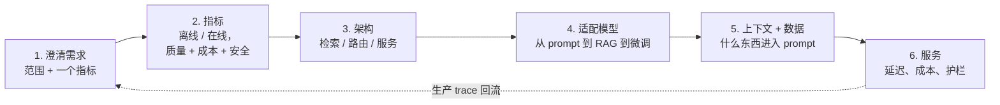

# 0. 方法论：怎么应对 LLM 系统设计面试

本书每一章都是把同一套套路用在一个不同的系统上。这一页讲的是套路本身，目的是让你
面对一道从没见过的题时，手里有一套可以复用的方法，而不是硬记 16 个具体系统。面试官
说"用 LLM 设计一个 X"的时候，按顺序走完下面六步。跳步是强候选人翻车最常见的原因。

## 1. 澄清问题（别直接跳到选模型）

把一个模糊的题目变成一个范围明确的任务。要钉死几件事：用户是谁，输出喂给谁；规模
（QPS、上下文长度、并发）；延迟预算（交互式聊天还是批处理）；以及唯一定义成功的那个
指标。最有力的开场是先判断**到底需不需要训练任何东西**：大多数 LLM 问题靠 prompt 或
检索就能解决，用不着微调。一上来就把这一点说出来（然后再论证什么情况下才会升级到 SFT
或偏好调优），这是资深工程师的信号。把你的定题大声说出来，然后就此定下来。

## 2. 先定指标，再画架构

LLM 系统要同时在三个维度上被评判。能一早就把三个都点出来，说明你真正运营过系统，
而不只是调过 prompt。

|  | 离线（上线前） | 在线（生产环境） |
|---|---|---|
| **质量** | 一套 golden set，用精确匹配、任务指标或校准过的 LLM 裁判打分 | 线上点赞点踩、任务完成率、抽样 trace 的人工审核 |
| **成本** | 每次请求的 token 数、缓存命中率、各档模型的占比 | 每千次请求的美元成本、GPU 利用率 |
| **安全 / 可靠性** | 越狱和注入评测集、有据率 / 幻觉率 | 护栏拦截率、事故率和拒答率 |

这三个维度的意义在于：一个质量高但太贵或不安全的系统是上不了线的。离线测试集用来
快速迭代，但最终决定能否发布的只有在线 A/B 和 trace 审核。

## 3. 画出端到端的架构

把整条请求路径画出来，而不是一次模型调用。大多数 LLM 系统是一条小型管线：可选的
**检索**（对 query 做 embedding，取回上下文并重排）、可选的**路由或级联**（简单请求
送给便宜的模型，难的送给强模型）、**生成**调用，以及输入和输出两端的**护栏**。只要
是有一定规模的服务，还要点名底下的服务基础设施（连续批处理、KV cache、prefill/decode）。
能解释清楚每一级为什么存在（检索是为了时效性和有据可依，路由是为了成本，护栏是为了
安全），方框图才变成了设计。

## 4. 适配模型：只爬到够用的那一级

让模型专用化有一架成本阶梯，只有下面一级到了平台期才往上爬。先是 prompt 和
few-shot；问题出在缺知识或缺时效性时，上**检索增强生成**；问题是模型从上下文里学不
会的某种固定行为或格式时，上**微调**（LoRA/SFT）；问题是比较性的判断时，上**偏好调优**
（DPO/RLHF/GRPO），或者面对一整个新领域时做**继续预训练**。要说清问题落在哪一级，
以及为什么更便宜的那一级不够用。

## 5. 上下文与数据：真正进入 prompt 的是什么

对检索系统来说，这一步是分块、embedding 模型、索引、重排和上下文组装；对微调系统来
说，是指令 / 偏好数据集及其整理（去重、去污染、质量过滤）。两条规则拿走大部分分数：
训练和服务时的 prompt 格式要逐字节一致（不能有模板偏差）；绝不能让评估数据泄漏进训练
或检索（去污染），否则指标全是假的。

## 6. 服务：延迟、成本和护栏都是设计的一部分

一个 LLM 答案要在预算内、安全地服务出去才算完成。把杠杆一一点名：KV cache 和连续
批处理换吞吐，量化和投机解码换延迟和成本，路由和缓存省开销，输入输出护栏保安全。
把服务时的取舍说清楚（更大的模型每个 token 的质量更好，但会把延迟和成本预算撑爆），
这才是生产环境面试真正在考的东西。

## 是一个循环，不是一条直线

这几步是一个循环，不是单向清单。生产 trace（第 2 步）会暴露系统弱在哪里，于是回过头
去改进上下文和数据（第 5 步）、换一级适配方式（第 4 步）、或者找一条更便宜的服务路径
（第 6 步）。用"上线后我会这样根据 trace 迭代"收尾，一个强答案才算完整。

后面的每一章都是这套方法演练一遍。读上几章，这个形状就会变成本能，这正是全部意义所在：
面试奖励的是方法，不是背下来的系统。

每章最后还有一个 capstone，把方法一路跑到结论：上面的每一步都针对本章场景做出一次
明确决定，带容量和成本的算术，同一个系统在另外两组约束下重新推导，再加一个一口气能读
完的可运行参考实现。六步教你该问什么；capstone 展示的是真正做出选择长什么样。
