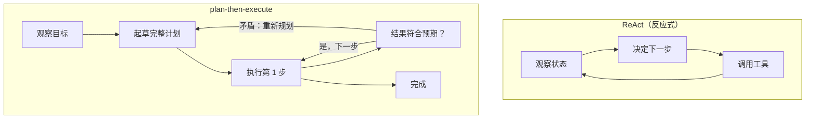

# 3. 规划与工具

## 两种规划风格

搭好循环之后，第一个设计决定就是 agent 怎么决定下一步做什么。主要有两种模式，
选哪种会影响成本、延迟和可靠性。

**反应式（ReAct 风格）。** 模型每一轮只决定下一个单独的动作，依据只有到目前
为止发生了什么。没有事先的计划。对于路径无法预知的开放式目标，这很灵活，但也
容易跑偏：一个拿不准下一步该干嘛的模型，有时会把同一个工具调两遍，或者绕个
远路把步数抬上去。

**Plan-then-execute。** 碰任何工具之前，模型先起草一串步骤。然后逐步执行，
只有当某个工具结果和原计划里的假设相矛盾时才重新规划。成本更可预测，因为总
步数被计划长度框住了。对我们的客服 agent 来说，流程几乎总是有一个已知的形状：
查账户、看订单、判断是否符合条件、执行、回复。plan-then-execute 更合适。

## 更多认知架构

ReAct 和 plan-then-execute 是两个基础循环。当可靠性或者困难的推理有要求时，
还有三种架构可以叠在上面。它们并不互斥：大多数生产环境的 agent 是组合着用的。

| 架构 | 思路 | 什么时候用 |
|---|---|---|
| Reflexion | 一次尝试失败后，agent 把自我批评写进记忆，然后带着这条教训重试 | 有可验证成功信号（测试通过、任务解决）、重试能有改进的任务 |
| Tree of Thoughts（ToT） | 同时探索多条推理分支，打分，扩展有希望的那些（是搜索，不是单条链） | 谜题类问题，单条线性推理链经常出错 |
| Plan-and-Solve | 先起草计划，再逐步求解；plan-then-execute 的轻量、纯 prompt 版近亲 | 有明确计划就受益、但不需要完整工具编排的推理任务 |
| 记忆增强 | 一个由检索支撑的长期记忆，把相关的历史状态喂进每一步 | 长时间运行或跨会话的 agent，必须记住超出上下文窗口的东西 |

**出处。** ReAct（推理和行动交替）来自 Yao et al.（Princeton 和 Google，2022）；
Reflexion 来自 Shinn et al.（2023）；Tree of Thoughts 来自 Yao et al.（Princeton
和 Google DeepMind，2023）；Plan-and-Solve 来自 Wang et al.（2023）。典型的生产
环境 agent 是一个 plan-then-execute 循环，失败时做 Reflexion 风格的重试，再配一个
检索支撑的记忆，而不是任何一种架构的纯粹形态。

结构越多，可靠性越高，代价是更多模型调用。所以只有当基础循环的失败模式（跑偏、
重复调工具、遗忘）真的出现了，才往上加一层。

## 工具 schema

工具就是模型可以按名字、带类型化参数调用的函数。schema 是模型和这个函数之间的
契约：模型读 schema 才知道需要哪些参数、参数是什么类型、这个工具是干什么的。
写得好的 schema 和工具本身一样重要。Anthropic 的生产经验表明，在工具描述上下功夫、
给参数加示例、像测试 prompt 一样测试描述，能显著提高任务成功率。

好的工具 schema 有这些特点：

- **范围窄。** 一个工具只做一件事。`lookup_order` 返回订单状态，不顺带检查退款
  资格。窄工具模型更容易选对，门禁也更容易校验。
- **参数有类型。** 每个参数都有类型，有帮助的话再加一个允许值的枚举。这样门禁里
  的 schema 检查就很简单。
- **防呆参数（poka-yoke）。** 让工具很难被调错。如果退款金额必须用"分"来避免浮点
  问题，schema 里就写明白。
- **失败模式清楚。** 写明工具出错时返回什么，模型才知道怎么处理超时或者查不到的
  结果，而不是靠幻觉编一个。

## 让调用合法：约束解码与修复

schema 告诉模型合法的调用长什么样，但它不能让调用变得合法。规模一大，总有一定
比例的输出是坏掉的 JSON、凭空编了一个参数、漏了必填字段，或者在调用外面裹了一圈
文字，每一种都是一轮失败，要花一次重试。有四个杠杆，而且要按特定顺序叠加。

**1. 约束解码（最强的一个）。** 把采样限制在仍然能补全成合法解析结果的 token 上。
实现上把 schema 或文法编译成一个有限状态机（递归文法则是下推自动机），每一步给
logits 加掩码，非法 token 的概率就是零。值得知道的几个性质：

- 合法性变成结构性的，而不是统计性的：格式错误的输出是不可能出现，而不是不太
  可能出现。
- 编译好之后，掩码在解码时几乎不花时间，但编译复杂的 schema 不是免费的，所以按
  schema 版本缓存编译产物。
- 它约束的是**形式，不是内容**。约束解码器会很乐意生成一个格式完美但参数值错了
  的调用，这就是为什么后面的校验门禁仍然要跑。
- 如果文法和模型的自然分布打架，会伤质量。给一个本来想先推理的模型硬套一个只
  出答案的 JSON schema，是参数变差的常见原因；给它留个思考的地方，然后只约束
  最后那个块。

**2. 服务商原生的结构化输出。** 大多数 API 都提供 JSON 或 schema 模式，在服务端
做同样的事。有就用，机制一样，运维面更小。要注意的是不同模型、不同特性的支持
程度不一样（递归 schema、union、长枚举是各家实现分歧最大的地方），所以要验证，
别假设。

**3. 靠 schema 设计缩小失败面。** 浅优于深，扁平优于嵌套，枚举优于自由字符串，
必填字段要少。带默认值的可选字段比模型必须记住的字段便宜。如果两个工具的 schema
容易混淆，模型就会混淆它们，解法是改名字和收窄范围，而不是把描述写得更长。

**4. 先修复，再重试，顺序不能反。** 真有格式错误的输出漏过来时，先尝试本地修
（把 JSON 块周围的文字裁掉、把没闭合的字符串补上、把数字字符串转成数字），然后
再考虑多花一次模型调用。需要重试的话，把校验器的错误信息作为 prompt 喂回去，
而不是盲目地再问一遍；而且要限制重试次数：一个把结构上不可能成立的调用重试了
三次的 agent，把用户的延迟预算烧在了空气上。

**把它当成一个比率来度量，不是一个轶事。** 指标是**调用合法率**，拆成解析失败、
schema 违规、语义错误但格式合法三桶，按工具、按模型版本分别跟踪。第三桶是最要紧
的，也是约束解码帮不上忙的，所以它就是保留校验门禁的理由。合法率也是模型量化后
第一个会退化的东西，这就是为什么它作为验收测试出现在
[模型压缩一章](../model-compression/08-interview-qa.md)里。

| 选什么 | 什么时候 | 而不是 |
|---|---|---|
| 服务商的结构化输出模式 | 你的模型有这个功能，而且覆盖你的 schema | 自己写一层掩码 |
| 本地约束解码（文法或 FSM） | 自托管，或者需要服务商不支持的文法 | 纯 prompt 指令，它会在统计意义上失败 |
| 纯 prompt 的"请用 JSON 回答" | 原型，或者模型没有约束模式 | 假设它在生产流量下也撑得住 |
| 先修复再重试 | 任何格式错误的输出 | 立刻再花一次完整调用 |
| 带着校验错误重试 | 修复失败，而这次调用又必须完成 | 盲目重问，通常会重复同样的错误 |
| 简化 schema | 某一个具体工具的合法率偏低 | 在一个模型觉得容易混淆的 schema 上继续做 prompt 工程 |

## 单 agent 对比多 agent

多 agent 系统很受关注。诚实的说法是：它们解决了一个真实的问题（确实可分、各自
需要独立上下文的子任务），但也带着真实的代价（token 成倍增加、调试更难）。对于
一次处理一张工单的客服 agent，一个工具配齐的单 agent 几乎总是赢。

Anthropic 的多 agent 研究系统用并行子 agent 做广度优先的研究，跨很多条相互独立
的搜索，每个子 agent 有自己的上下文窗口。这个设计在他们的 benchmark 上比单 agent
好 90%，但 token 成本大约是 15 倍。Cognition 的观点则相反：单线程 agent 更连贯，
因为并行子 agent 会做出一些隐含的决定，协调者没法把它们调和到一起。

对这道客服题，默认用单 agent。只有当一张工单确实能拆出必须并发跑、又不能共享
上下文的独立工作流时，才加编排器加子 agent。这在客服场景里很少见。

## 什么时候用哪个

| 选什么 | 什么时候 | 而不是 |
|---|---|---|
| Plan-then-execute | 任务形状已知，成本可预测很重要 | ReAct，当路径在第一次调工具之前根本无法预知时 |
| 反应式（ReAct） | 目标开放，步骤序列完全取决于工具返回什么 | 先规划，它在每一次意外上都要付重新规划的代价 |
| 工具配齐的单 agent | 一个上下文装得下整个任务，决策形成一条连贯的链 | 多 agent，如果任务不可分，它大约 15 倍的 token 开销什么都换不来 |
| 编排器加并行子 agent | 子任务确实可分，每个都需要独立的上下文窗口，而且墙钟延迟是瓶颈 | 单线程，当扇出只增加 token 和调试复杂度、却不能缩短这个任务的延迟时 |
| 窄的、有类型的工具 | 门禁需要确定性地校验调用 | 接受任意 JSON 的宽工具，校验变成猜测 |
| Reflexion 自我批评 | 有清晰的成功信号，agent 能在多次重试之间从中学习 | 一次性规划，当重试只增加成本、又没有可验证的停止条件时 |

**出处。** 反应式循环是 ReAct（Princeton 和 Google，2022），它交替的"先推理再行动"步骤建立在思维链提示（让模型在给出答案之前写出中间推理步骤）之上（Google，2022）。模型驱动的工具调用可以追溯到 Toolformer（Meta，2023），这里的类型化工具接口遵循 Model Context Protocol（Anthropic，2024）。

**工具。** 两种规划风格在常见的 agent 框架里都能表达：LangGraph 和 LangChain 显式地建模了 plan-then-execute 和 ReAct 循环，LlamaIndex 为两者都提供了 agent runner，带并行子 agent 的多 agent 编排是 AutoGen（Microsoft）和 CrewAI 的核心。工具 schema 通常是 JSON Schema 定义，Model Context Protocol（MCP）是一种向模型暴露类型化工具的通用方式，带着门禁可以校验的描述和枚举。Reflexion 风格的自我批评是叠在上面的一种 prompt 模式，而不是一个单独的库。

**实例。** 一个做企业 RAG 的团队搭客服 agent 时，选了 plan-then-execute 而不是反应式的 ReAct，因为工单有已知的形状（查账户、看订单、判断资格、执行、回复），有界的步数让成本可预测，而 ReAct 有跑偏和把同一个工具调两遍的风险。他们保留一个工具配齐的单 agent，而不是编排器加并行子 agent，因为一张工单很少能拆成可分的并发工作流，扇出大约 15 倍的 token 开销什么都换不来。每个工具都是窄的、有类型的，带枚举，金额用分而不是美元，这样校验门禁能确定性地检查调用，而不是对着任意 JSON 猜。只在有清晰成功信号、能证明重试成本值得的地方，才加 Reflexion 自我批评。
