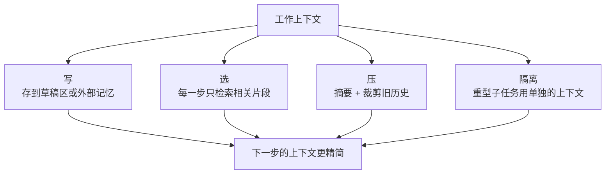

# 4. 记忆与状态

## 上下文窗口是一张资产负债表

上下文窗口里的每一个 token，在之后每一步的 prefill（模型在生成任何东西之前
先把整个 prompt 读一遍）时都要花钱。短期工作状态（工单、到目前为止的工具结果）
必须放在里面，因为模型要靠它来决定下一步。长期事实（客户历史、公司政策、过往
处理记录）默认不该放在里面，因为什么都往里塞会让成本膨胀，还可能用无关的历史
把模型带偏。

## 短期记忆：工作对话记录

工作对话记录是模型的草稿纸。里面有工单、模型的推理、模型发起的每一次工具调用，
以及收到的每一个结果。循环跑起来后它只增不减，因为每一个新动作和新观察都会被
追加进去。

问题在于，模型每一步 prefill 时都要把整份记录重读一遍。一张啰嗦的工单跑 20 步
循环，记录能涨到几万 token，而每一步的 prefill 成本都包含全部历史。不加干预的话，
单步成本随步数线性增长（总任务成本大致按平方增长）。

三种缓解手段：

**摘要 / 压缩。** 到了某个 token 阈值，把记录里最老的部分换成一段压缩摘要，保留
决定和事件，丢掉原始的工具返回体。Claude Code 的 auto-compact 在接近上下文上限
时就是这么做的。专门的压缩模型（Cognition 的做法）比启发式裁剪更忠实。

**前缀缓存。** system prompt 和最初的工单在很多步里都是不变的。如果模型服务商
支持 KV cache 前缀复用（对没变的 prompt 前缀直接复用模型缓存的计算结果），静态
前缀只付一次钱，每一步的增量成本就只有新 token。Anthropic 的扩展 prompt caching
适用于这里；缓存读通常比缓存写便宜得多。

**模型分层。** 便宜的模型每 token 的 prefill 单价更低。把简单的步骤（分发查询、
拼模板回复）路由到小而快的模型，这些步骤的记录成本就压住了。

## 长期记忆：对外部存储做检索

长期记忆存的是比单次对话活得更久的事实：客户的完整订单历史、公司退款政策文档、
过往的处理模式。正确的做法是检索：把事实存在外面，每一步只拉相关的片段进来，
而不是一开始就把整个存储塞进上下文。

这正是 RAG（检索增强生成：从外部存储取出相关文本，加到 prompt 里）用在 agent
层面。对我们的客服 agent 来说，知识库（政策文档、FAQ）就是长期记忆。一张工单
开始时，agent 检索和这类工单相关的政策段落，加进工作上下文。客户历史由
`lookup_account` 工具拉取，范围只限于当前这一步需要的部分。

## 上下文工程的策略

LangChain 的上下文工程框架点名了四种策略，直接适用于这里：

**写：** 把中间结果存到窗口之外的草稿区（会话内）或记忆存储（跨会话），而不是
把原始返回体留在记录里。

**选：** 每一步只检索长期记忆里相关的那一片，而不是预先全部加载。工具集变大以后，
每一步只检索相关的工具子集，而不是每轮把所有工具都暴露出来。

**压：** 上下文快满时对旧的记录做摘要。保留决定和事件，丢掉原始的 API 响应体。

**隔离：** 中间产物很大的子任务（图片数据、长文档正文），放到单独的上下文窗口或
子 agent 里跑，不要把产物加载进主上下文。

## 什么时候用哪个

| 选什么 | 什么时候 | 而不是 |
|---|---|---|
| 短期工作记录 | 模型需要之前的工具结果来决定下一步（agent 永远如此） | 无状态调用，会丢掉推理链 |
| 压缩（摘要） | 记录接近上下文上限，或者单步成本明显在涨 | 盲目截断最老的消息，会丢掉承重的决定 |
| 前缀缓存 | system prompt 和最初的工单在很多步里保持不变 | 每轮对不变的内容付全额 prefill |
| 长期检索（RAG） | 客户历史、政策文档或过往模式，超出了任何单张工单该放进上下文的量 | 一开始把所有历史都塞进去，成本膨胀还可能误导模型 |
| 外部草稿区（写策略） | 中间结果很啰嗦（长 JSON、原始 API 响应） | 把原始返回体留在记录里，每一步重读 |
| 隔离的子上下文 | 某个子任务有 token 很重的产物，或者确实不需要共享上下文 | 把一条连贯的决策链拆成孤立的 agent，连贯性就没了 |

**出处。** 长期检索是 RAG（Meta FAIR，2020）；背后的向量库通常用 HNSW（Malkov 和 Yashunin，2016）或 IVF-PQ（Meta 的 FAISS）建索引。

**工具。** 写、选、压、隔离四种策略对应 LangChain 和 LangGraph 以及 LlamaIndex 里的记忆抽象，它们开箱就带摘要缓冲、草稿区存储和按步选工具；Mem0 是专门的 agent 长期记忆层。长期检索就是普通的 RAG，政策库和历史库用 FAISS（Meta）、Qdrant 或 Weaviate 这类向量索引支撑。前缀缓存是服务商功能（比如 Anthropic 的 prompt caching），稳定前缀只付一次，后续的读比最初的写便宜得多。

**实例。** 一个做企业 RAG 的团队搭客服 agent 时，工作记录放在短期记忆里，因为模型需要之前的工具结果来选下一步，但不预加载客户的完整订单历史。取而代之的是长期检索，从向量库里只拉和当前工单相关的政策段落和账户事实，这样上下文不会被可能误导模型的历史撑大。啰嗦的工具返回体按写策略进外部草稿区，而不是每一步重读；记录接近上下文上限时，把旧历史压成一段摘要，保留决定，丢掉原始 API 响应体。像解析一份很长的附件这种 token 很重的子任务，放在隔离的子上下文里跑，产物永远不进主窗口；前缀缓存则覆盖所有步骤里稳定不变的 system prompt 和工单。
