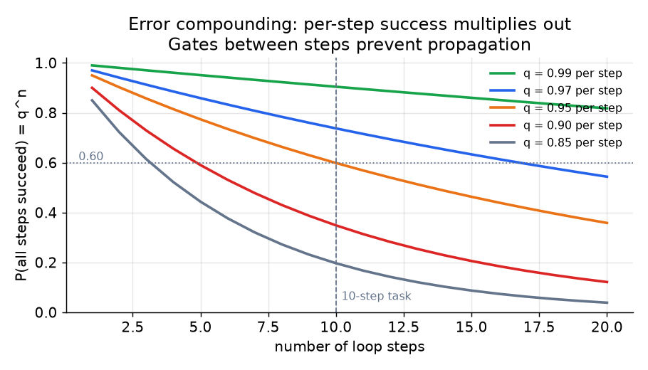
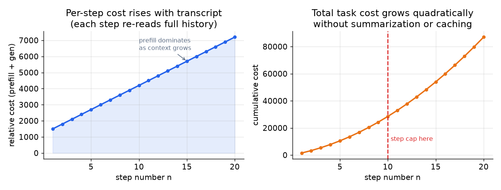
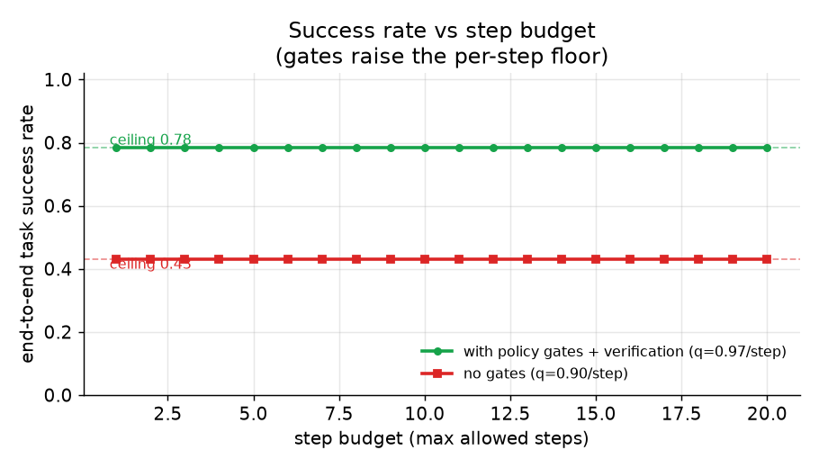
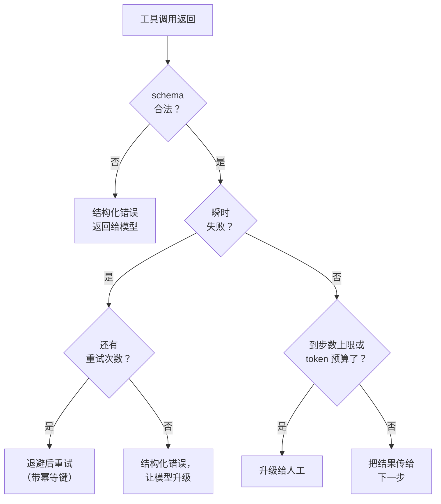

# 5. 可靠性与成本

## 错误叠加：循环为什么会悄悄失败

多步循环最被低估的一个性质是：单步的失败会相乘。如果每一步的成功概率是 $q$，
那么一个 $n$ 步的任务成功的概率是：

$$P_{\text{ok}}(n) = q^{\,n}$$

单步 $q = 0.95$（已经算相当高了），一个 10 步的任务端到端成功率只有 60% 左右：

$$P_{\text{ok}}(10) = 0.95^{10} \approx 0.60$$

```python
def task_success(q, n):    # q = per-step success prob, n = number of steps
    return q ** n          # every one of the n independent steps must succeed
# e.g. task_success(q=0.95, n=10) -> 0.5987369392383787
```

这里的结论不是"少走几步"（任务可能就是需要这么多步），而是"在步骤之间放门禁，
让一个坏结果传不到下一步"。没有门禁，一次错误的查询结果就能污染下游的每一个
决定。



*单步 0.95 时，到第 10 步成功率已经低于 0.60。门禁和验证环节抬高单步的下限，
把曲线整体往上推。示意图。*

## 不断变长的对话记录，成本怎么算

一个跑着的 agent 每一轮的成本不是平的。设 $T_{n-1}$ 是第 $n$ 步开始时上下文里的
总 token 数，$p$ 是每 token 的 prefill 单价，$g$ 是每 token 的生成单价。那么第 $n$
步的成本大约是：

$$C_n = p \cdot T_{n-1} + g \cdot o_n$$

其中 $o_n$ 是生成的输出 token 数。记录每一步大约增长 $a_n + r_n$ 个 token（模型的
动作文本加上工具结果），所以：

$$T_n = T_0 + \sum_{i=1}^{n}(a_i + r_i)$$

代入后，$S$ 步的总任务成本是：

$$C_{\text{total}} = \sum_{s=1}^{S}\Bigl(p\,\bigl(T_0 + \textstyle\sum_{i=1}^{s-1}(a_i + r_i)\bigr) + g\,o_s\Bigr)$$

外层求和套着内层求和，意味着如果不压缩，总成本随 $S$ **按平方增长**。这就是
面试官会追问的成本驱动因素。解法是摘要（压缩记录，去掉旧的原始返回体）和前缀
缓存（稳定前缀只付一次钱）。

```python
def agent_task_cost(growth, out, T0, p, g):   # growth[i]=a_i+r_i tokens added per step; out[i]=output tokens
    T, total = T0, 0.0
    for i in range(len(out)):
        total += p * T + g * out[i]           # prefill re-reads full transcript T, plus generation
        T += growth[i]                        # transcript grows by action + result tokens each step
    return total                              # grows ~quadratically in steps if T is never compressed
# agent_task_cost([100, 100, 100], [50, 50, 50], T0=200, p=1e-6, g=3e-6) -> 0.00135
```



*左图：每一步 prefill 都要重读整份记录，单步成本随步数线性上升。右图：累计
成本在加速。硬性的步数上限加压缩能把两条曲线都框住。示意图。*



*允许更多步数能提高成功率，但上限是单步准确率决定的天花板
（$q^{\text{steps needed}}$）。门禁抬高每一步的 $q$，天花板随之上移。没有门禁
（红线）时，预算再大，天花板也更低。示意图。*

## 硬性上限

两个上限没有商量余地：

**步数上限。** 每张工单最多 $N$ 次工具调用，超了就升级给人工。这是跑偏循环的
最后一道保险。它必须在编排层强制执行，不能写在 prompt 里。对这个客服 agent，
$N = 10$ 是个合理的起始上限：查询（1）、资格检查（1 到 2）、执行（1）、回复（1），
再留一些重试的余地。

**Token 预算。** 单张工单所有步骤加起来的总 token 上限。成本上限 \$0.10，混合
单价大约每百万 token \$10，预算就是 1 万 token 左右。会超出这个数的工单，在
完成之前就升级出去。

## 护栏放在哪里

护栏是防止 agent 做出有害或错误行为的检查。分三层：

1. **调用前（门禁）。** 任何工具执行前先检查 schema 和策略。这是同步的、在
   关键路径上，所以必须快（确定性的代码检查，不是模型调用）。

2. **调用后（输出检查）。** agent 起草好最终回复后，发出去之前用一个轻量检查
   扫一遍有没有违反策略或含禁止内容。Airbnb 把它和回复生成并行跑，避免增加延迟。

3. **异步审计。** 事后由一个单独的任务审阅记录下来的动作，找实时检查可能漏掉的
   模式（比如某个 agent 一直在往退款上限上顶）。这一层不阻塞线上路径。

### 致命三件套

会用工具的 agent 面临的 prompt 注入风险，在三种能力同时出现在一个循环里时最
尖锐，Simon Willison（2025）把这个组合叫做致命三件套（lethal trifecta）：能访问
私密数据、会接触不可信内容、有外泄的能力（任何出站通道：一次工具调用、一次
URL 抓取、一封邮件）。攻击者把指令埋进不可信内容里（工单正文、抓来的网页、
附件文档），就能引导 agent 去读私密数据，再通过外泄通道送出去。再怎么加固
prompt 也堵不牢这个口子，因为注入的文本是作为普通模型输入进来的，模型分不清它
和真正的指令。防御是架构层面的，不是 prompt 层面的：拆掉三条腿里的一条，三件套
就不成立。给工具划定范围，让碰过不可信内容的循环没法再够到出站通道；或者把
每一个出口都放在确定性的调用前策略检查后面，而不是交给模型判断。这就是调用前
门禁要放在代码里的原因：它是 prompt 注入唯一改写不了的一层。

## 重试

工具调用会因为瞬时原因失败（API 超时、网络错误）。重试策略应该放在 Tool Manager
或执行器层，不放在 prompt 里。要不要重试不该由模型决定；模型收到的要么是一个
结果，要么是一个它可以据此行动的结构化错误。

模式：指数退避加固定的重试上限（比如 3 次）。持续失败时，给模型返回一个结构化
错误，让它升级或者换一个备用工具。

```python
def backoff_delays(base, cap, attempts):   # base = first wait (s), cap = max wait (s)
    return [min(cap, base * 2 ** i) for i in range(attempts)]   # double each retry, clamp at cap
# e.g. backoff_delays(base=1.0, cap=10.0, attempts=3) -> [1.0, 2.0, 4.0]
``` 工具超时的时候，模型不能凭幻觉编一个结果出来；它必须承认失败并处理它。

## 模型分层

客服循环里不是每一步都需要同一个模型。把工单分派到某个类别（账单、物流、技术）
是路由任务，便宜快速的模型就能干好。权衡几种相互竞争的政策解释是推理任务，贵的
模型在那里才值回票价。

规则：用能可靠完成这一步的最便宜的模型。每一步用哪个模型由编排器根据步骤类型
分类器来定，不由 agent 自己定。

## 什么时候用哪个

| 选什么 | 什么时候 | 而不是 |
|---|---|---|
| 硬性步数上限（写在代码里） | 永远：失控循环是默认的失败模式 | 一句"10 步之后停下"的 prompt 指令，模型可以无视 |
| 每任务 token 预算 | 永远：每张工单的成本必须有界，经济账才算得过来 | 事后按任务付钱，指望平均下来没事 |
| 代码里的调用前策略门禁 | 任何碰钱、账户或不可逆状态的写操作 | prompt 里的策略提醒，prompt 注入（藏在不可信输入里的恶意指令）能绕过去 |
| 调用后输出检查（并行） | 回复质量和合规必须验证，又不能增加串行延迟 | 串行的事后检查，回复延迟翻倍 |
| 执行器里的指数退避重试 | 瞬时的工具失败（网络、超时） | 让模型决定要不要重试，它处理得并不一致 |
| 模型分层（路由用便宜的，推理用贵的） | 循环里大多数步骤是路由不是推理，分层能压低单步成本 | 每一步都用贵模型，成本上限撑不住 |
| 验证重试（Reflexion 风格） | 存在清晰的端到端成功信号（跑测试、查退款账本） | 没有信号就加重试，成本翻倍，质量没涨 |

**出处。** 确定性策略门禁加输出检查的模式在 NeMo Guardrails（NVIDIA）里有具体实现；门禁背后的内容分类器可以用 Llama Guard（Meta）。

**工具。** 步数上限、token 预算和按步路由模型都放在编排层，LangGraph 和 LlamaIndex 这类框架把它们暴露为显式的图限制和节点级模型选择，而不是 prompt 指令。策略门禁和输出检查用 Guardrails AI 和 NeMo Guardrails（NVIDIA）这类护栏库来搭，它们在模型关键路径之外跑确定性的 schema 和内容检查。瞬时的工具重试由执行器里 tenacity 这样的退避库处理，不由模型处理；验证重试则复用现有的真实成功信号（测试运行器、账本核对）作为停止条件。

**实例。** 一个做企业 RAG 的团队运营客服 agent 时，在代码里强制执行硬性步数上限和每张工单的 token 预算，因为"十步之后停下"这样的 prompt 指令模型可以无视，而经济账要求每张工单的成本有界。任何碰退款或账户的写操作都要过一道以确定性代码检查实现的调用前策略门禁，因为 prompt 里的提醒会被 prompt 注入绕过；调用后的输出检查和回复生成并行跑，合规得到验证，延迟不翻倍。瞬时的 API 超时由执行器用指数退避重试，不让模型做那些不一致的决定。路由步骤走便宜模型，只有真正的策略推理步骤才为贵模型付钱；验证重试只加在有清晰端到端成功信号、能证明额外成本值得的地方。

## 实现和训练里的坑

agent 循环挂在运行时，不是设计时：循环跑偏、记录溢出、某次工具调用格式错误、
或者一场重试风暴把一次瞬时抖动放大成成本尖峰。这里面几乎每一条都靠编排层强制
执行的上限来兜住，而不是靠 prompt 里的请求。

| 问题 | 症状 | 修法 |
|---|---|---|
| 无限或跑偏的循环 | agent 反复调用工具，永远不终止 | 编排器强制执行硬性步数上限，然后升级给人工 |
| 上下文溢出 | 记录超过窗口，质量下降或调用报错 | 对旧轮次做摘要，丢掉原始工具返回体，稳定的开头做前缀缓存 |
| 成本按平方增长 | 随着步数累积，每张工单的成本膨胀 | 每任务 token 预算加记录压缩，因为 prefill 每一步都要重读整个上下文 |
| 格式错误的工具调用 | 参数不符合 schema，工具拒绝调用 | 调用前按工具 schema 校验参数，返回模型能据此纠正的结构化错误 |
| 失败时编造结果 | 工具超时，模型凭空编了个答案 | 返回结构化错误而不是空值，并要求模型承认并处理失败 |
| 重试风暴 | 一次瞬时失败被放大成延迟和成本尖峰 | 执行器里做指数退避加固定的重试上限，不由模型决定 |
| 非幂等的写操作被重试 | 一次重试的退款或订单操作执行了两遍 | 给写工具加幂等键，重试就成了空操作 |
| 错误跨步骤叠加 | 中间某一步的坏结果污染了下游每一个决定 | 在步骤之间放验证门禁，抬高单步成功的下限 |

工具调用返回后，由执行器（不是模型）决定接下来发生什么：



贯穿始终的一条线：agent 的可靠性，就是围绕一个会犯错的模型放一组代码强制执行的
上限和门禁。所以凡是只在 prompt 里要求过的东西，都应该当作没有强制执行。
