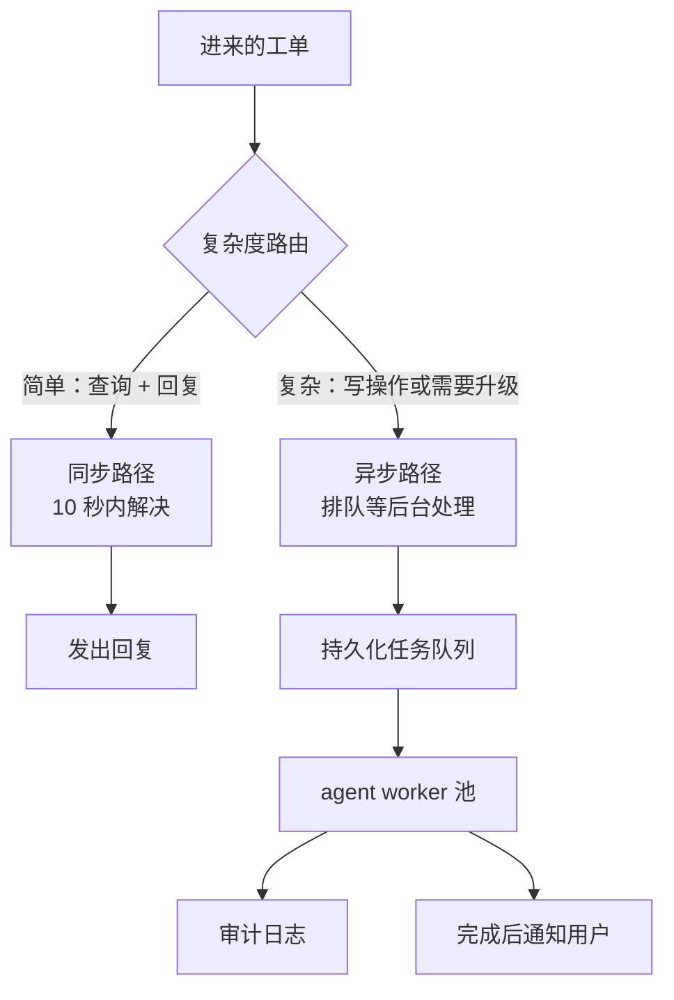

# 6. 服务与扩展

## 两种执行模式：同步和异步

按工单的复杂度，客服 agent 天然分成两条执行路径。

**具体怎么跑。** 进来的工单先过一个复杂度路由，它读一遍请求，决定走哪条路。
简单工单（查一下再回一句）走同步路径，用户等着的这几秒里就解决完，直接把回复
发出去。凡是涉及写操作、或者大概率要升级的，走异步路径：不阻塞调用方，而是
放进一个持久化任务队列，这样一张慢工单永远不会把快路径拖住。一组 agent worker
从队列里取任务，跑完整个循环，再产出两路副产品：每一步都写一条审计日志，做完
之后通知用户。队列就是那条接缝，让快慢两条路径可以各自独立扩容。

复杂度路由本身要么是一次便宜的模型调用，要么是一个基于规则的分类器。它存在的
意义就是保证快路径够快：简单工单不用排在长任务后面干等。

## 并发和模型层的容量

每天 5 万张工单，相当于每分钟 35 张左右，也就是每秒 0.6 张。每张工单最多跑 $N$
步循环。所以模型层在任意时刻要扛住 $0.6 \times N$ 个在途请求，还得留出应对突发
高峰的余量。

有两个吞吐约束在互相牵制：

1. **模型吞吐。** 模型提供方（API 或自建）有每分钟 token 数的上限。一张 10 步的
   工单，每步 1000 token，一共消耗 1 万 token。每天 5 万张工单，所有步骤加起来
   大约每天 5 亿 token。

2. **工具吞吐。** 每次工具调用都会打到某个后端服务（CRM、OMS、政策检索）。
   这些服务的容量要按 agent 制造出来的并发量来配，而不只是按用户的直接流量。

在步骤相互独立时并行调用工具，能压低复杂工单的墙钟延迟。同时去查账户详情和订单
状态，大约省掉一个来回。这是编排器里的调度决策，不是模型的决策。

## 流式输出和中间结果

在同步路径上，用户希望在完整回复出来之前就有反馈。逐 token 流式返回回复
（聊天模型的标准做法）能满足这一点。agent 还可以把中间的"思考"状态
（比如"正在查询您的订单状态……"）作为结构化的进度事件流式推出去，而不是把
原始的模型 token 吐给用户，这样体验更干净，也不暴露内部推理过程。

## 瓶颈

| 瓶颈 | 最早的征兆 | 修法 | 代价 |
|---|---|---|---|
| 模型吞吐打满 | 队列堆积，p99 延迟出现尖峰 | 扩模型层容量；把简单步骤路由到更小更快的模型 | 为了留容量余量，每 token 的成本会上升 |
| 工具后端过载 | 工具调用错误率上升，agent 的重试又把负载推得更高 | 按后端限制 agent 的工具调用速率；给只读工具加缓存（一张工单之内账户查询的结果是稳定的） | 缓存读到旧数据；写操作之后必须失效 |
| 上下文成本占大头 | 工单一复杂，单张工单的成本就冲破预算 | 到达某个 token 阈值就压缩对话记录；给 system prompt 做前缀缓存 | 压缩本身多一次模型调用；前缀缓存需要 API 支持 |
| 还没解决就撞上步数上限 | 中等复杂度工单的升级率上升 | 谨慎调高 $N$（成本会涨）；把相互独立的步骤并行化，在上限之内多做一些事 | 并行调用变多，工具后端的负载也跟着涨 |
| 失控工单（步数上限没有强制执行） | 账单上出现成本异常，某一张工单吃掉不成比例的预算 | 在编排层强制执行上限，不要写在 prompt 里 | 没有代价，这个修法永远是对的 |
| 审计日志的写前瓶颈 | 日志的持久化开始拖高尾延迟 | 在工单关闭之前，把审计事件异步写进一个持久化队列（Kafka） | 进程崩溃时有丢掉最后一条事件的小风险，审计场景可以接受，计费场景不行 |

**再展开一点。** 有两行背后藏着更尖锐的失败模式。工具后端那一行之所以会滚雪球，是因为 agent 的重试是相关的：下游一次超时，会让几乎所有在途工单在同一瞬间发起重试，所以按后端设一个并发上限，比按工单限速更能压住负载。上下文成本那一行的驱动因素是 attention 随序列长度增长，所以压缩的触发阈值应该看累计的 prefill token 数，而不是消息条数；前缀缓存只覆盖 prompt 里稳定的开头部分，缓存边界以上任何一处改动都会让整个缓存前缀作废，逼出一次完整的 prefill。
