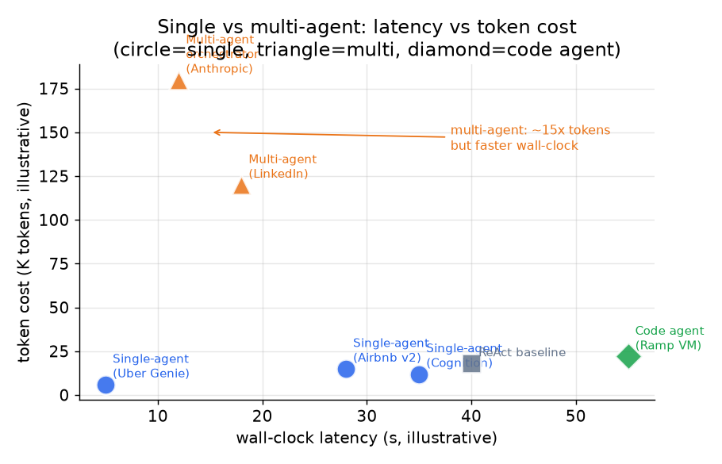

# 7. 真实团队在生产环境里怎么做

所有上了生产的 agent 最后都收敛到同一副循环骨架：拆解目标，调一个工具，观察结果，
更新上下文，重复，直到做完或者撞上硬上限。真正有分歧的，是四个相互正交的决定各家
落在哪一边：**拓扑**（单 agent 还是多 agent）、**规划风格**（边走边想还是先规划）、
**工具接口**（JSON 调用还是执行代码）、**上下文策略**（压缩、检索还是隔离）。

知不知道这些分歧点，是"研究过 agent 的候选人"和"真把 agent 送上线过的候选人"之间的
分水岭。

## 真实设计的分歧在哪里

*多 agent 拓扑（三角）靠并行处理相互独立的子任务压低墙钟延迟，代价是 token 成本
大约是同等单 agent（圆点）的 15 倍。代码型 agent（菱形）用更复杂的环境搭建，换来
工具密集型任务上更少的来回。示意图，依据已公开的数据。*

| 系统 | 拓扑 | 规划风格 | 工具接口 | 上下文策略 | 什么时候占优 | 要留意什么 |
|---|---|---|---|---|---|---|
| Anthropic 多 agent 研究系统 | 编排器加并行 subagent | 主 agent 先用 extended thinking 规划，subagent 边走边想 | JSON 工具调用 | 隔离：每个 subagent 拥有自己的上下文窗口 | 子任务确实能拆开的广度优先研究 | token 花销大约是单 agent 的 15 倍；汇总那一步很难调试；多个 subagent 可能撞在同一份资料上 |
| Cognition 单线程 | 单个，线性 | 隐式的反应式循环 | JSON 工具调用 | 压缩：记录接近上限时，由一个专门的蒸馏模型把它压紧 | 需要一条连贯决策链的任务，各部分之间不会有隐性冲突 | 没有并行；没有压缩器的话，长记录照样会撞上限 |
| Airbnb Automation Platform v2 | 单个（混合：新情况交给 LLM，已知路径走确定性工作流） | 每一轮做一次 chain-of-thought 规划，出现矛盾就重新规划 | 经由 Tool Manager 的 JSON 调用，带重试逻辑 | 选择：Context Loader 每一轮取回账户、意图和行程数据 | 形态已知的客服流程，固定路径沿用旧工作流可以省掉 LLM 成本 | 护栏并行跑以避免串行开销；并行那条道一慢，安全检查就落在动作后面 |
| Ramp Inspect（编码 agent） | 单个，异步闭环 | 反应式：先动手，再自己验证 | 在沙箱化的 Modal VM 里执行代码 | 隔离：每个会话拿到自己的 VM 和 SQLite，结果写进一个 PR | 长时间运行、正确性可以靠跑测试来验证的编码任务 | 每个任务一个 VM 的隔离是实打实的基础设施成本；异步意味着不适合交互式对话 |
| LangChain 上下文工程 | 任意拓扑 | 任意 | 任意 | 四种全用：write、select、compress、isolate，按步骤施加 | 循环一长上下文成本或质量就下滑的场景；这几种策略可以组合 | 过度设计：给一个短程简单 agent 四种全套上，只增加复杂度，没有收益 |
| Uber Genie（on-call RAG） | 单个，每个问题基本是一次性的 | 没有规划：RAG 检索然后生成 | 在向量数据库（Sia）上做检索 | 选择：按问题取回相关的文档片段 | 答案就在现有文档里的大流量只读问答 | 不是真正的循环；Genie 不做动作，只根据检索到的文档回答问题 |
| LinkedIn 多 agent 编排 | 编排器加注册在消息平台上的 subagent | 编排器负责拆解和路由，subagent 边走边想 | gRPC / 消息总线（不是直接的 JSON） | 隔离：每个 agent 一个独立的记忆存储 | 企业规模的多 agent 系统，复用现成的消息基础设施比另铺一套管道便宜 | 注册表和生命周期服务带来运维复杂度；跨 agent 的状态同步需要显式的策略 |
| ReAct 基线（Yao et al.） | 单个 | 完全反应式，一次走一步 | JSON 工具调用 | 内置没有；记录不受控地一直变长 | 工具集小、路径短的简单灵活任务 | 没有步数上限就可能跑偏；没有上下文策略，成本随记录长度增长 |
| Reflexion（Shinn et al.） | 单个，带重试式的多轮尝试 | 针对上一轮的结果做自我批评 | JSON 工具调用 | 每轮隔离，每次重试都从干净的上下文开始 | 有清晰可验证结果、agent 能跨重试从中学到东西的任务 | 每多一轮重试，token 成本就翻一份；反馈信号缺失或者太噪时毫无用处 |

最核心的那条分界线：**当一份上下文就装得下整个任务时，单线程 agent 更便宜、更连贯、
也更好调试。** 只有当子任务确实能拆开、每个都需要自己的上下文窗口、而且墙钟延迟才是
那个真正要命的瓶颈时，多 agent 的扇出才站得住脚。

## 这些系统（一手资料）

- **Anthropic** [Building effective agents](https://www.anthropic.com/research/building-effective-agents)：五种可组合的编排模式（chaining、routing、parallelization、orchestrator-workers、evaluator-optimizer），以及各自的适用场景。
- **Anthropic** [How we built our multi-agent research system](https://www.anthropic.com/engineering/multi-agent-research-system)：orchestrator-worker 模式配并行 subagent，相对单 agent 提升 90.2%，token 大约是 15 倍。
- **Cognition** [Don't build multi-agents](https://cognition.com/blog/dont-build-multi-agents)：站在单线程 agent 一边的反方观点，讲并行 subagent 为什么会产出不连贯的结果，以及一个压缩模型怎么解决上下文上限的问题。
- **Ramp** [Why we built our own background agent](https://builders.ramp.com/post/why-we-built-our-background-agent)：跑在隔离 Modal VM 上的闭环编码 agent，预先构建好的仓库快照压低了会话启动延迟。
- **LangChain** [Context engineering for agents](https://www.langchain.com/blog/context-engineering-for-agents)：write-select-compress-isolate 框架，用来在循环变长时把上下文控制住。
- **OpenAI** [A practical guide to building agents](https://cdn.openai.com/business-guides-and-resources/a-practical-guide-to-building-agents.pdf)：来自生产部署的编排模式、护栏，以及单 agent 与多 agent 的取舍建议。
- **Anthropic** [Writing effective tools for agents, with agents](https://www.anthropic.com/engineering/writing-tools-for-agents)：怎么设计和评估工具定义，把 agent 的任务成功率提上去。
- **Anthropic** [Code execution with MCP](https://www.anthropic.com/engineering/code-execution-with-mcp)：相比 JSON 工具调用的来回，用 MCP 执行代码怎么省下 token 和延迟。
- **Uber** [Genie: Uber's GenAI on-call copilot](https://www.uber.com/en-US/blog/genie-ubers-gen-ai-on-call-copilot/)：基于 RAG 的 copilot，每月服务 4.5 万个工程师提问，评估反馈由 Kafka 承载。
- **Airbnb** [Automation Platform v2](https://medium.com/airbnb-engineering/automation-platform-v2-improving-conversational-ai-at-airbnb-d86c9386e0cb)：以 LLM 为推理引擎，用 chain-of-thought 编排工具，LLM 加工作流的混合设计，以及并行跑的护栏。
- **LinkedIn** [Extending the GenAI tech stack to build AI agents](https://www.linkedin.com/blog/engineering/generative-ai/the-linkedin-generative-ai-application-tech-stack-extending-to-build-ai-agents)：在消息基础设施之上做多 agent 编排，包含 agent 注册表、生命周期服务、独立的记忆存储和 OpenTelemetry 可观测性。
- **Hugging Face** [Introducing smolagents](https://huggingface.co/blog/smolagents)：为什么让 agent 写代码比让它发 JSON 工具调用更好，沙箱执行能减少多步工具使用中的来回。
- **Replit** [Agent 3 self-test at scale with REPL verification](https://replit.com/blog/automated-self-testing)：REPL 加浏览器验证，让 agent 在关掉一个任务之前先自主自测。
- **GitHub** [Evaluating the Copilot agentic harness](https://github.blog/ai-and-ml/github-copilot/evaluating-performance-and-efficiency-of-the-github-copilot-agentic-harness-across-models-and-tasks/)：在多个模型和任务上，按解决率和 token 成本给一套多模型 agent 框架做 benchmark。
- **Salesforce** [Inside the Atlas Reasoning Engine](https://engineering.salesforce.com/inside-the-brain-of-agentforce-revealing-the-atlas-reasoning-engine/)：一个与模型无关的推理与规划引擎，大规模驱动企业级 agent 的动作；它先把每个请求对齐到一个主题和动作的库上，再做规划并打磨这个计划，然后才动手。
- **Yao et al.** [ReAct: synergizing reasoning and acting in language models](https://arxiv.org/abs/2210.03629)：把推理轨迹和工具动作交错起来的奠基性模式。
- **Shinn et al.** [Reflexion: language agents with verbal reinforcement learning](https://arxiv.org/abs/2303.11366)：agent 对反馈做自我反思，不更新权重就能在多次重试中变好。
- **Wu et al.** [AutoGen: next-gen LLM apps via multi-agent conversation](https://arxiv.org/abs/2308.08155)：用可定制的可对话 agent 搭多 agent 系统的框架。
- **Anthropic** [Introducing the Model Context Protocol (MCP)](https://www.anthropic.com/news/model-context-protocol)（2024 年 11 月）：这个开放标准在 2025 年成了连接 agent 与工具、数据的默认方式，用一套协议暴露工具、资源和 prompt，取代了过去每接一个集成就写一坨胶水代码的做法；后来 OpenAI 和 Google 也采纳了。2025 年面试里的信号是：知道工具接线现在是一个协议（MCP），不再是每个工具一个定制适配器。*(产品设计)*
