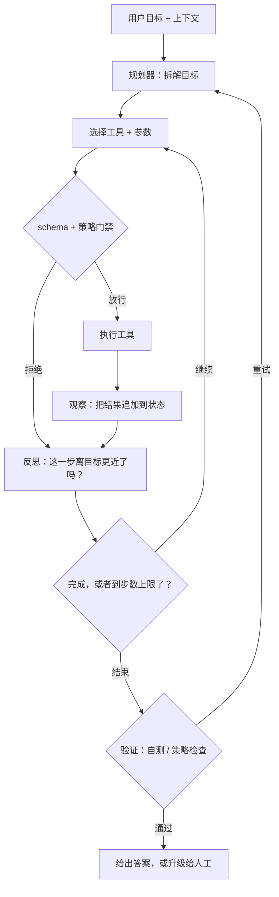

# Agent 编排

> 本章是英文原版的中文译本，原文见 [book/agents/](../../book/agents/)。译文和原文同步维护，发现问题请提 issue。

面试官很少会直接说"设计一个 ReAct agent"。他们会说：**"设计一个系统，读一张客服工单，
查账户，看订单状态，政策允许就退款，然后回复用户；要可靠，成本要有上限。"**
这就是 agent 编排：在一个会调工具的模型外面套一层受控的循环，管理状态，
并且在花钱太多或者做出不可逆的事情之前停下来。

本章把这个系统从头到尾搭一遍，并且展示 Anthropic、Cognition、Airbnb、
Ramp、LinkedIn、Uber 等团队实际是怎么上线的。

## 各节内容

1. [澄清需求](01-clarifying-requirements.md)：一段对话，把自主程度、工具面、
   延迟、成本和失败代价问清楚。
2. [搭出系统骨架](02-frame-the-system.md)：工具调用循环、plan-act-observe、
   输入和输出。
3. [规划与工具](03-planning-and-tools.md)：ReAct 对比 plan-and-execute、
   工具 schema、单 agent 对比多 agent。
4. [记忆与状态](04-memory-and-state.md)：短期与长期记忆、上下文膨胀，
   以及把它压住的几种策略。
5. [可靠性与成本](05-reliability-and-cost.md)：重试、护栏、步数上限、
   成本控制，以及背后的数学。
6. [服务与扩展](06-serving-and-scaling.md)：并发、流式输出，
   以及瓶颈表。
7. [真实团队在生产环境里怎么做](07-how-teams-do-it-in-production.md)：
   各家知名系统的分歧点在哪里，附一手资料链接。
8. [面试问答](08-interview-qa.md)：常问的、有坑的、常答错的问题，
   给出清楚的答案。
9. [小结](09-summary.md)：一页纸回顾、mermaid 图和自测题。
10. [把它们拼起来：完整的方案](10-putting-it-together.md)：一套默认技术栈，
    把场景从头到尾搭起来并算清延迟和成本，同一个系统在三组不同约束下的样子，
    以及一个最小的可运行 agent 循环。

## 一页看懂 agent 循环

第一次读请按顺序读，每一节都建立在前一节之上。
每一节开头都是面试官真正会问的那个问题，然后给出精确的回答。
