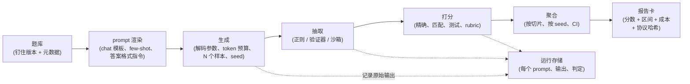

# 3. Harness：数字真正被造出来的地方

## 流水线，逐级过一遍



没人提前规划的那一级是运行存储。把每一条渲染后的 prompt、原始补全、抽取出的答案和每题的判定都留下来，一个出乎意料的结果才有办法调试，这也是"模型拿了 71 分"和"模型拿了 71 分，丢掉的 29 分里有 4 分是截断，不是答错"之间的差别。给存储留预算，它比产生它的算力便宜得多。

## 那些对数字的影响比模型本身还大的旋钮

这张表是整个话题的核心。面试官问"把流水线讲一遍"，其实是在检查你知不知道这里的每一项都存在。

| 旋钮 | 会出什么问题 | 典型波动 | 怎么办 |
|---|---|---|---|
| Chat 模板 | 给 base 模型套上 instruct 模板，或者 instruct 模型没套模板；角色标签错了，或者缺少生成 prompt | 很大，在某些套件上能掉到接近随机 | 用模型自己的模板渲染，从 tokenizer 配置里读，并且把渲染后的完整字符串存下来 |
| System prompt | 某家厂商公布的数字用了一段没写明的"乐于助人的助手"前言，你没用 | 几分 | 钉住它，默认为空，并报告出来 |
| Few-shot 数量和顺序 | 0-shot 和 5-shot 同时改变格式和难度；示例顺序会改变答案 | 几分 | 每个 benchmark 固定 k，用 seed 固定示例池和顺序 |
| 打分模式 | 对选项做对数似然排序，和让模型生成答案再解析，是两种不同的测量 | 很大；一个模型在一种模式下像随机，在另一种下正常 | 每个 benchmark 选一种并报告是哪种；不要在候选之间混用模式 |
| 长度归一化 | 原始对数似然偏爱短选项；按字节长度归一化的准确率是另一个指标 | 几分 | 报告用的是哪种归一化；所有候选保持一致 |
| 答案格式指令 | "把最终答案放进方框里"和什么都不说，改变的是可解析性，不只是格式 | 几分，主要通过解析失败体现 | 统一一条指令；测量解析失败率 |
| 解析器严格度 | 正确答案写成"0.5"，对着"1/2"判错；一次拒答被解析成选项 A | 几分，单向的 | 支持等价性的匹配，外加对一部分解析失败样本做人工审计 |
| 最大输出 token | 推理模型在推导中途被截断，被判成答错 | 在推理套件上非常大 | 设一个能覆盖观测到的分布的预算；报告截断率 |
| Temperature 和 top-p | 一个候选用贪心，另一个用采样；各家推荐的设置每个模型都不一样 | 几分，外加方差 | 每个 benchmark 一套解码策略，对所有候选一视同仁；报告出来 |
| 采样数和 seed 数 | 在 30 题的 benchmark 上只跑一次，就是抛硬币 | 在小的推理集上有两位数的波动 | 多个 seed，报告均值和离散度（[A Sober Look at Progress in Language Model Reasoning](https://arxiv.org/abs/2504.07086)） |
| 推理服务栈和精度 | 不同的推理引擎、量化或 batch 大小会给出不同的 token | 小，但足以翻转接近的比较 | 钉住引擎版本、精度和容器 digest |
| 提供商 | 同一个开放权重模型由两家提供商托管，量化、模板和吞吐都不同 | 几分 | 把提供商当作候选身份的一部分 |
| 工具和沙箱环境 | 网络访问、包版本或时间限制和参考容器不一样 | 在 agent 套件上很大 | 用 benchmark 的官方镜像，按 digest 钉住 |

这一整类问题的经典总结是 LM Evaluation Harness 维护者写的 [Lessons from the Trenches on Reproducible Evaluation of Language Models](https://arxiv.org/abs/2405.14782)，里面记录了在同一批题目上，仅仅 prompt 格式就能让一个模型在接近随机和胜任之间来回移动的案例。对面试回答的实际意义是：**别人的数字和你的对不上时，先验应该是协议差异而不是模型差异，而且你要能按顺序列出六个该查的地方。**

## 打分模式：对数似然还是生成式

多选题有两种打分方式，测的是不同的东西。

**对数似然排序。**给每个选项计算模型在给定题目下输出该选项文本的对数概率，取 argmax。便宜（每个选项一次前向，不用采样）、确定、对解析失败免疫。它需要 token 级的对数概率，而很多 API 模型已经不再暴露；并且它测的是一种产品永远用不到的区分能力。

$$\hat{y} = \arg\max_{o \in \text{options}} \frac{\log p(o \mid x)}{|o|_{\text{bytes}}}$$

分母里的字节长度归一化是一种选择，不是定律：原始对数似然系统性地偏爱短选项，归一化后的对数似然在某些套件上又矫枉过正，同一套 harness 里这两个会以不同的指标名报告（accuracy 和 normalized accuracy）。拿自己归一化后的数字去和别人没归一化的数字比，是一个无声的协议 bug。

**生成式打分。**让模型产出自由文本，抽取答案，和参考答案比对。这和模型实际的用法一致，对纯 API 模型也能用，而且对开放式任务是唯一选项。代价是要采样，还引入了一个解析器，从此它就是你测量仪器的一部分。文献记录的从生成文本里抽取多选题答案的方式不一致，其幅度足以改变模型排名（[Right Answer, Wrong Score](https://arxiv.org/abs/2503.14996)）。

经验法则：凡是你要据此下结论的，都用生成式打分加答案匹配；对数似然打分留给 base 模型上便宜的高频训练遥测；两者之间永远不做比较。

## 推理模型打破了三个假设

带可变思考预算的模型，让建立在单次生成模型上的习惯失效。

1. **Token 预算是一个能力旋钮。**要报告分数随预算变化的曲线，而不是某一个预算下的分数。诚实的产物是一条小曲线：低、中、高三档 effort 下的分数，以及每一档的平均输出 token 数。单个数字掩盖了你给一个候选十倍算力这件事。
2. **截断是头号假阴性。**如果预算把推导切断了，这道题被判错的原因和能力无关。把截断率当作一等指标来跟踪，任何截断率不为零的套件，在修好或披露之前都视为未报告。
3. **各家推荐的解码设置每个模型都不同。**对一个推荐非贪心采样的模型强制贪心解码，是在惩罚它；让每个模型用自己的设置，运行结果又以另一种方式不可比。选定一种策略，说明它，在决策接近时在子集上两种都查一遍。

## 确定性不是免费的，即使 temperature 为零

贪心解码在推理服务系统里并不可复现，因为归一化、矩阵乘法和 attention 的 kernel 不是 batch 不变的：浮点归约的顺序随 batch 的组成而变，所以同一个 prompt 会因为同时在处理什么别的请求而产出不同的 token。Thinking Machines Lab 记录了这个机制，并以吞吐为代价发布了 batch 不变的 kernel，让重复运行的输出逐位一致（[Defeating Nondeterminism in LLM Inference](https://thinkingmachines.ai/blog/defeating-nondeterminism-in-llm-inference/)）；SGLang 基于同样的思路发布了确定性推理支持（[Towards Deterministic Inference in SGLang](https://www.lmsys.org/blog/2025-09-22-sglang-deterministic/)）。

对评估流水线来说，务实的立场是：不要宣称自己证明不了的确定性。要么用 batch 不变的 kernel 跑，并通过重跑一个子集来验证；要么接受运行间方差，并把它测出来，反正[第 6 节](06-statistics-and-leaderboards.md)的统计也需要它。要避免的失败模式是：把单次运行的数字当成精确值报出去，然后在提问的人面前复现不出来。

## 协议记录：必须记下什么

把这当作流水线的验收标准。一次运行的记录包含以下内容，才算可报告：

```text
model:      id, revision or snapshot date, provider, serving engine + version,
            precision / quantization, container digest
protocol:   harness commit, benchmark name + version + item count,
            prompt template hash, system prompt, few-shot k + shot-pool seed,
            answer-format instruction, parser version
decoding:   temperature, top-p, max output tokens, stop sequences,
            samples per item, seeds, reasoning-effort setting
results:    per-item verdict, per-slice score, aggregate score + interval,
            parse-failure rate, truncation rate, refusal rate
cost:       input tokens, output tokens, wall clock, dollars
```

对协议块做哈希，把哈希打印在分数旁边。哈希不同的两个数字不可比，在面试里把这句话说出来，比任何单个指标都值钱。

## 规模化运行

一个 benchmark 配一个模型的时候，harness 是一个脚本。十几个 benchmark 乘十几个候选再乘几个 seed 的时候，它是一个带队列的服务，设计问题就是那些常规的问题。

- **并行。**题目之间相互独立，所以吞吐的上限在 API 候选那边是提供商的速率限制，在自托管那边是 GPU 数量。按题目分片，不要按 benchmark 分片，免得一个慢的套件把整次运行串行化。
- **缓存，键要对。**缓存键是完整的协议哈希加题目 id 加样本序号。只按 prompt 文本做键，模板一改就会悄悄返回过期结果，这是最糟的 bug，因为它看起来像一个"没有变化"的结果。
- **幂等重试，并记账。**提供商 5xx 和容器抖动是常态。可以重试，但要记录多少题重试过：一个 5% 的 agent 题目都重试过的套件，报告的是环境的数字，不是模型的数字。
- **代码和 agent 的沙箱。**不可信的模型输出在 benchmark 自己的容器镜像里执行，除非 benchmark 需要网络否则网络隔离，每题有墙钟时间上限。镜像按 digest 钉住；基础镜像在底下一动，agent 分数就漂。
- **每次运行的成本记账。**输入 token、输出 token、美元和 GPU 小时，存在分数旁边。成本在这里不是开销，它是任何真实的模型选择决策所依赖的两个轴之一。

**工具。**[LM Evaluation Harness](https://github.com/EleutherAI/lm-evaluation-harness)（EleutherAI）是静态套件的参考实现，也是上面那篇 lessons 论文的来源；[HELM](https://crfm.stanford.edu/helm/)（Stanford CRFM）标准化了多场景报告；[Inspect](https://inspect.aisi.org.uk/)（英国 AI Security Institute）为 agent 和安全评估而建，带工具沙箱和 solver 抽象；[simple-evals](https://github.com/openai/simple-evals)（OpenAI）是最小的生成式打分参考，它的价值在于 prompt 和解析器都可读；SWE-bench、LiveCodeBench 和 tau-bench 自带 harness 和容器，应该直接用而不是重新实现。

## 实现上的坑

| 症状 | 可能原因 | 检查方法 |
|---|---|---|
| 分数远低于公开发表的数字 | Chat 模板或 system prompt 不匹配 | 打印一条渲染后的 prompt，和 harness 参考实现对比 |
| 在模型本应通过的套件上分数接近随机 | 在 chat 模型上用了对数似然打分，或者选项顺序的格式 bug | 在 50 道题上换成生成式打分对比 |
| 推理套件意外地弱 | 输出 token 预算截断了推导 | 把输出长度分布画出来对照上限；报告截断率 |
| 同一候选的两次运行结果不同 | 没固定 seed 的采样、batch 不变性导致的非确定性，或者提供商侧更新了模型 | 把 50 题的子集重跑两次；还在动，变量就是服务栈 |
| 基础设施变更后 agent 分数下降 | 基础镜像、包版本或网络策略漂移 | 把容器 digest 和上一次正常运行做 diff |
| 微调只在一个 benchmark 上有提升 | 对那个 benchmark 的答案风格做了格式过拟合 | 用另一种格式跑同一构念（自由生成代替多选） |
| 一次"harness 清理"之后所有分数都涨了 3 分 | 清理改了解析器 | 对比前后的解析失败率；用新解析器给旧输出重新打分 |

最后一行就是要保留原始输出的原因：用新解析器给存下来的补全重新打分很便宜，而且它能把打分的变化和模型的变化分开，不用重跑模型。
