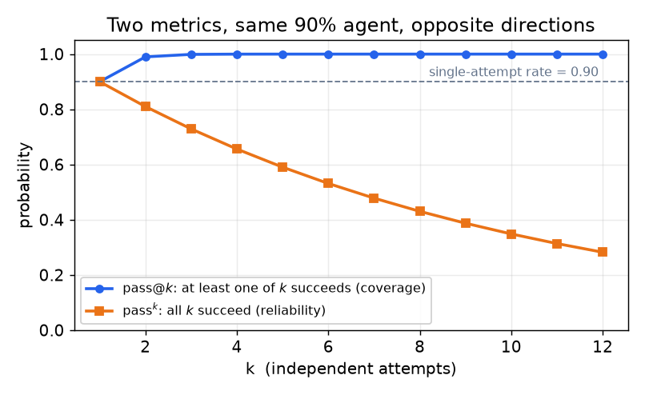
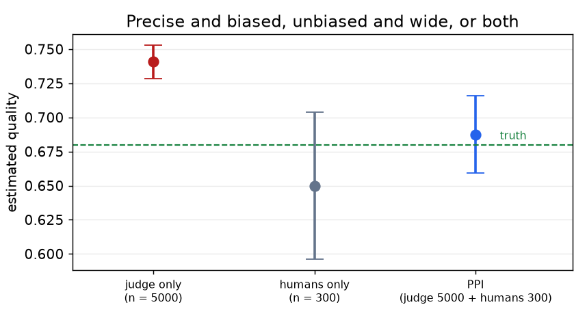

# 5. 打分与 autorater

打分是 benchmark 决定"什么算对"的地方。三个问题：指标是什么，谁来施加它，以及怎么知道施加它的人靠得住。

## 指标从任务出发选，不要凭习惯

| 任务类型 | 默认指标 | 为什么 | 要盯的失败模式 |
|---|---|---|---|
| 闭合形式的短答案（数学、抽取、实体） | 自由生成加支持等价性的答案匹配 | 和模型的实际用法一致；避开选项模式捷径 | 等价性 bug（"1/2" 和 "0.5"、单位、LaTeX）；要测量解析失败率 |
| 多选题（仅为了和旧数字可比） | 准确率，注明归一化方式 | 能和已发表的数字比 | 饱和、对选项顺序敏感、不看题干也能答的题 |
| 代码生成 | 单测通过，以 pass@k 报告 | 可执行，表面上看起来像对糊弄不了它 | 弱测试放过错误代码；不稳定的测试；容器漂移 |
| Agent 轨迹 | 任务成功率加步数、token、美元和一个可靠性指标 | 单一成功率把成本和方差都藏起来了 | 什么都不做被算成成功；部分得分抬高分数 |
| 带专家标准的开放式生成 | 按每题的标准做 rubric 评分 | 把模糊的判断拆成可核对的论断 | Rubric 质量和评分员一致性成为瓶颈 |
| 开放式生成，相对比较 | 认证过的 judge 做成对偏好 | 相对判断比绝对判断稳定 | 位置、冗长和自我偏好偏差（见[评估一章第 4 节](../evaluation/04-llm-as-judge.md)） |
| 长上下文任务 | 每个上下文长度上各自的任务准确率，而不是一个总分 | 退化随长度变化且非单调 | 大海捞针式检索饱和了，真正的聚合却失败（[RULER](https://arxiv.org/abs/2404.06654)、[HELMET](https://arxiv.org/abs/2410.02694)） |
| 指令遵循 | 程序可验证的约束 | 不需要 judge，所以没有 judge 偏差 | 只覆盖能验证的约束（[IFEval](https://arxiv.org/abs/2311.07911)） |

## 答案匹配：闭合形式任务的默认选择

把不带选项的题目给模型，让它生成，然后判断生成的答案是否和参考答案等价。等价性是难点，它是一个有自己错误率的流水线组件：

1. **归一化**（去掉格式、单位规范化、解析 LaTeX）。
2. **符号检查**，在领域允许的情况下（数学用计算机代数比较，查询任务直接运行抽出来的 SQL）。
3. **基于模型的兜底**，只用于第 1、2 步判断不了的情况，用一个小模型，prompt 里带上参考答案。
4. **审计**，人工抽查一部分被接受和被拒绝的答案，并报告匹配器自身的错误率。

第四步是测量和猜测的分界线。如果匹配器在 3% 的题目上和人的判断不一致，那么任何比 3 分更细的比较都站不住，报告的时候应该把这句话明说出来。

## pass@k 和 pass^k 测的是相反的东西

两者都对每个任务抽 $k$ 个样本，回答的却是不同的问题，把它们搞混是 agent 评估里最常见的技术错误之一。

**pass@k** 是覆盖率：$k$ 个样本里*至少一个*正确的概率。当下游有东西能验证并挑选的时候，比如一套测试、一个编译器或一位人工审核者，它是对的指标。在抽取的 $n \ge k$ 个样本里有 $c$ 个通过时的无偏估计量在[评估一章](../evaluation/03-offline-eval.md)里。

**pass^k** 是可靠性：$k$ 次独立尝试*全部*成功的概率，随 tau-bench 一起为工具、agent、用户三方交互引入（[tau-bench](https://arxiv.org/abs/2406.12045)）。当用户只有一次机会、失败就是失败的时候，它是对的指标。

$$\text{pass}^k = p^k \qquad\text{so}\qquad p = 0.9 \implies \text{pass}^8 \approx 0.43$$



*两个指标都从单次尝试的成功率出发，然后朝相反方向走。给一个用户只有一次机会的产品引用 pass@k，等于给一个活在橙色曲线上的系统报告蓝色曲线。*

90% 的成功率看起来很强，其实不然：同一个任务跑八次，agent 八次全对的概率不到一半。从 $n$ 个样本、$c$ 次成功出发的无偏估计量和 pass@k 的那个是镜像的：

```python
from math import comb
def pass_hat_k(n, c, k):      # n trials drawn, c successes, reliability at k
    if c < k:                 # fewer than k successes -> no k-subset is all-success
        return 0.0
    return comb(c, k) / comb(n, k)     # P(all k sampled trials succeeded)
# pass_hat_k(n=10, c=9, k=8) -> 0.2  (a 90% agent is "always right" 8 times in 10 rarely)
```

部署允许重试的时候两个都报，不允许的时候报可靠性那个。不用提示就主动说出这个区别，在 agent 评估的面试里是很强的信号。

## Rubric 评分：开放式任务是怎么变得可测量的

专家级开放式任务的最新做法，是每题一套专家写的 rubric 标准，而不是一个整体的 1 到 10 分。OpenAI 的 HealthBench 是参考设计：每段对话附上医生写的标准，每条标准带一个分值（应该奖励的行为为正，应该惩罚的为负），由一个模型评分器逐条判断回复是否满足（[HealthBench](https://arxiv.org/abs/2505.08775)）。

$$s(\text{response}) = \frac{\sum_{c \in C} w_c \cdot \mathbb{1}[\text{criterion } c \text{ met}]}{\sum_{c \in C, w_c \gt 0} w_c}$$

它为什么胜过整体打分：每条标准都是一个小的、可核对的、几乎二元的论断，正是模型和人容易达成一致的那种判断。Rubric 也是一个可以调试、加版本、交给领域专家的产物。代价是构建它，那是标注工作，靠 prompt engineering 扩不了规模。

同一思路在 agent 评估里以检查清单的形式出现，在后训练里以 rubric 条件化的奖励模型出现；设计上的教训是通用的：**把判断拆解到每一块都可核对，然后用明说的权重聚合。**

## 给 autorater 做认证

一旦由模型来给 benchmark 打分，评分器就是测量仪器的一部分，而未认证的仪器产出的是偏差未知的数字。认证步骤按顺序：

1. **建一个 meta-eval 集。**几百对（题目、回复），带专家标签，刻意在决策边界附近多采样，而不是在容易的两端。
2. **测量一致性**，并报告出来：精确一致率、Cohen's kappa，对成对 judge 还要加上交换一致性。HealthBench 自己的设计就包含医生对模型评分器的 meta-evaluation，正是为了这个。
3. **在已知的难例上给 judge 做 benchmark。**[JudgeBench](https://arxiv.org/abs/2410.12784) 之所以存在，是因为在错误答案听起来更好的客观可核对题对上，强的通用模型当 judge 表现平平。
4. **探测能不能被钻空子。**把退化的基线送进评分器：空答案、常数答案、加长填充的答案，以及一个包含针对评分器指令的答案。这些里任何一个得了高分都是阻塞级缺陷，而常数输出的"空模型"已经被证明在自动 judge benchmark 上能赢下不可忽视的比例。
5. **钉住并定期重新认证。**Judge 的模型版本和 judge 的 prompt 都是带版本的依赖；按计划给一个冻结的校准集重新打分，以检测漂移。

一致性不达标的话，先修 rubric，再动别的。磨尖一条标准换来的一致性，比换个更大的 judge 模型多，而且更便宜。

## 用统计校正 judge，而不是信任它

认证告诉你 judge 有偏，但不能消除偏差。现代的答案是：便宜的 judge 继续跑全集，另外留一个小的人工标注子集，用这个子集来*校正* judge 的估计。这叫 prediction-powered inference（PPI），是本章里最有用的一项近期技术。

设 $f(X_i)$ 是 judge 在第 $i$ 题上的分数，全部 $N$ 题都有；$Y_j$ 是人工标签，只在两者都标注过的 $n \ll N$ 题上有。校正后的估计量是：

$$\hat{\theta}_{\text{PPI}} = \underbrace{\frac{1}{N}\sum_{i=1}^{N} f(X_i)}_{\text{cheap judge estimate}} + \underbrace{\frac{1}{n}\sum_{j=1}^{n}\bigl(Y_j - f(X_j)\bigr)}_{\text{measured judge bias}}$$

第一项用上了每一道 judge 打过分的题；第二项是 judge 系统性误差的无偏估计。结果无论 judge 多差都是无偏的，而且 judge 越准方差越小，所以更好的 judge 换来的是更窄的区间，而不是另一个答案。把人工标注样本按切片分层还能进一步收窄（[Stratified Prediction-Powered Inference for Hybrid Language Model Evaluation](https://arxiv.org/abs/2406.04291)）；同样的校正也可以用 judge 的敏感度和特异度来表述，置信区间同时考虑测试集和校准集两边的不确定性（[How to Correctly Report LLM-as-a-Judge Evaluations](https://arxiv.org/abs/2511.21140)）。

```python
from statistics import mean
def ppi_estimate(judge_all, judge_labeled, human_labeled):
    # judge_all: judge scores on every item (length N)
    # judge_labeled / human_labeled: aligned scores on the human-labeled subset (length n)
    bias = mean(h - j for h, j in zip(human_labeled, judge_labeled))  # systematic judge error
    return mean(judge_all) + bias                                    # rectified, unbiased
# judge says 0.72 overall; on 200 human-labeled items it runs 0.05 high -> corrected 0.67
```



*模拟：一个偏高 6 分的 judge 打了 5,000 题，其中 300 题同时有人工标签。只用 judge 精确但错误，只用人工样本无偏但很宽，校正后的估计无偏且区间大约只有纯人工的一半。示意图。*

有两个推论值得在面试里明说。第一，这**把标注预算的问题**从"我们能不能负担得起全部标注"变成了"多少个标签能换来可接受的区间"，这是一道规模计算题，不是一场经费争夺战。第二，它**让"judge 没校准"不再是借口**：你不再需要 judge 无偏，你需要的是几百个诚实的标签，以及随着分布变化持续收集它们的纪律。

## 什么时候用哪种打分方法

| 选用 | 什么时候 | 而不是 |
|---|---|---|
| 可执行的检查（测试、符号等价、可验证约束） | 任务允许机器可核对的答案 | 一个之后还得认证和维护的 judge |
| 用一个小匹配器模型做答案匹配 | 表面形式多变的短自由答案 | 多选题，它测的构念更窄 |
| 专家 rubric 加认证过的模型评分器 | 整体打分复现不了的开放式专家任务 | 一个没有 rubric、没有 meta-eval 的 1 到 10 分 judge 分数 |
| 认证过的 judge 做成对偏好 | 在开放式质量上给两个候选排序 | 随 rubric 版本漂移的绝对分数 |
| PPI 校正后的 judge 估计 | 任何数字要对外报告的、由 judge 打分的 benchmark | 原始 judge 均值，它把 judge 的偏差直接带进头条数字 |
| pass^k 加成本 | 面向用户的 agent 可靠性 | 只报 pass@k，它测的是允许重试时的覆盖率 |
