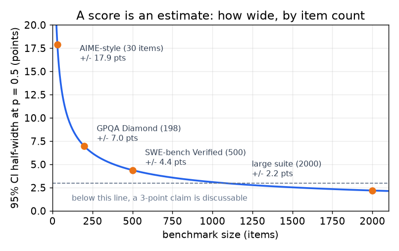
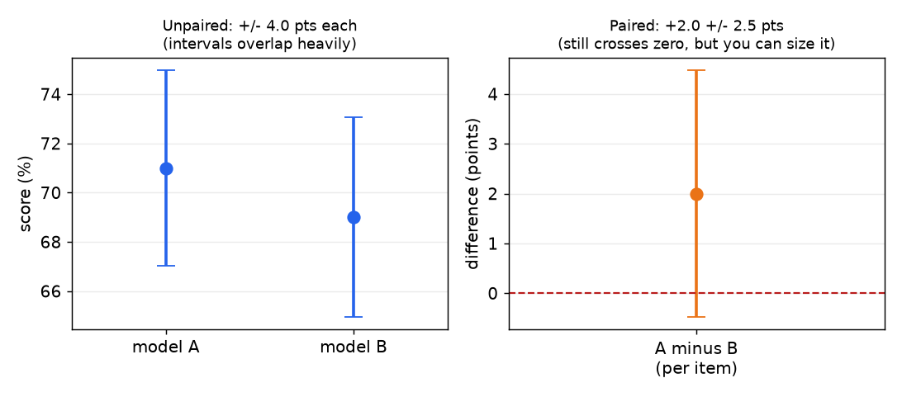

# 6. 统计与排行榜

Benchmark 本质上是实验，可直到最近，几乎没人真把它当实验来分析。把这件事做对的参考论证是 [Adding Error Bars to Evals](https://arxiv.org/abs/2411.00640)（Anthropic，2024），它把标准的实验分析方法搬进了评估报告，并指出：一旦分析做对，不少号称的进步其实都落在误差范围之内。

## 分数是一个估计，所以它有宽度

对 $n$ 道独立题目上的准确率 $\hat p$，标准误和常用区间是：

$$\text{SE}(\hat p) = \sqrt{\frac{\hat p (1 - \hat p)}{n}} \qquad \text{CI}_{95} = \hat p \pm 1.96\,\text{SE}$$

把真实 benchmark 的题量代进去，结论相当不留情面。

| Benchmark 规模 | 例子 | $\hat p = 0.5$ 时 95% 区间的半宽 | 意味着什么 |
|---|---|---|---|
| 30 题 | 竞赛数学题集 | 约 18 分 | 单次运行什么都区分不了；一道题就值 3 分多 |
| 198 题 | GPQA Diamond | 约 7 分 | 模型之间 5 分以内的差距，单次运行分辨不出来 |
| 500 题 | SWE-bench Verified | 约 4.4 分 | 常见的头条差距处在临界线上 |
| 2,000 题 | 大型聚合套件 | 约 2.2 分 | 2 分的说法可以讨论了，但还没定论 |



*单个分数上的区间，由 $\hat p = 0.5$ 处的二项标准误算出。大家最常引用的那些 benchmark 恰好落在曲线最陡的一段：一个 30 题的竞赛题集带着约 18 分的不确定性，198 题的题集约 7 分，所以在它们上面靠单次运行下的结论，根本算不上结论。*

这张图回答的是面试里最常见的追问：*"新模型高 3 分，它是不是更好？"*在一个 200 题的 benchmark 上、只跑一次，诚实的答案是"目前还区分不出来，而要区分出来需要这些条件"。

$n$ 很小的时候不要指望正态近似。有篇立场论文明确反对在几百个数据点以下用中心极限定理（[Don't Use the CLT in LLM Evals With Fewer Than a Few Hundred Datapoints](https://arxiv.org/abs/2503.01747)），改用 Wilson 区间、精确二项区间或者 bootstrap。

```python
def wilson(p_hat, n, z=1.96):                 # better than normal approx at small n / extreme p
    d = 1 + z * z / n
    center = (p_hat + z * z / (2 * n)) / d
    half = z * ((p_hat * (1 - p_hat) / n + z * z / (4 * n * n)) ** 0.5) / d
    return center - half, center + half
# wilson(0.5, 198) -> about (0.431, 0.569); wilson(0.9, 30) -> about (0.741, 0.965)
```

## 永远做配对比较

朴素的比法是把两个模型的分数当成两个独立的比例，再把各自的误差加起来。这等于扔掉了一个事实：两个模型答的是*同一批题*，而这是能拿到的最便宜的一次方差削减。

按题比。设 $b$ 是模型 A 对、B 错的题数，$c$ 是反过来的题数（两边都对或都错的题相互抵消）。于是：

$$\hat\Delta = \frac{b - c}{n}, \qquad \text{SE}(\hat\Delta) \approx \frac{\sqrt{b + c}}{n}, \qquad z = \frac{b - c}{\sqrt{b + c}}$$

最后那个式子就是 McNemar 检验。拿一个 500 题的套件走一遍：A 赢了 25 题，B 赢了 15 题，头条差距是 2 分。不配对的话，每个分数各带约 4.4 分的区间，比较看起来毫无希望。配对之后，$\text{SE} = \sqrt{40}/500 \approx 1.3$ 分，$z = 10/\sqrt{40} \approx 1.6$：仍然不显著，但现在你清楚地知道差多远，也知道解法是加题目，不是加论证。



*同一次 500 题的运行，两种分析方式。左边：每个分数带自己的区间，重叠严重到比较看起来毫无希望。右边：逐题配对的差值，区间大约窄一半，因为一致的题目抵消掉了。它仍然跨过 0，但现在这是一道样本量计算题，不是一场争论。*

样本量估算可以直接跟着推。要在 5% 显著性、80% 功效下检出差距 $\delta$，不一致率为 $d = (b+c)/n$ 时：

$$n \gtrsim d \left(\frac{z_{0.975} + z_{0.80}}{\delta}\right)^{2} \approx d \cdot \frac{7.85}{\delta^{2}}$$

$d = 0.1$、$\delta = 0.02$ 时大约是 2,000 题。这个数字才是"我们得判定一个 2 分的差距"的真实答案：要么找一个几千题的 benchmark，要么把好几个 benchmark 池化，同时接受你现在测的是一个复合构念。

## 大家忘掉的另外三个方差来源

**聚簇。**题目按相关的组抽取时（一篇文章配很多问题、一个仓库配很多任务、一段对话里的多轮），它们并不独立，朴素的 SE 会偏小。要在组这一层算聚簇标准误；有效样本量更接近组数，而不是题数。

**采样方差。**温度大于零时，每道题的得分本身就是随机变量。每题平均 $m$ 个样本能把这部分砍掉 $m$ 倍，题库固定的时候，这往往比加题目更便宜。报告的是样本上的均值，绝不是最好的那个样本：在多次运行里取最大值，等于把 best-of-N 选择用在了自己身上。

**Seed 和运行间的方差。**在小型推理 benchmark 上，这一项盖过其他所有来源。同一个模型换个 seed 重跑，分数能摆动两位数，而建立在单次运行上的比较已经把不大的真实效果报成了很大的效果（[A Sober Look at Progress in Language Model Reasoning](https://arxiv.org/abs/2504.07086)）。要在固定数量的 seed 上报告均值和标准差，并把 seed 数量写在分数旁边。

## 很多模型乘很多 benchmark 是一个多重比较问题

12 个模型乘 15 个 benchmark 是 180 个数字，每个 benchmark 上最多有 990 组两两比较。在 5% 显著性下，你一定会"发现"并不存在的显著差异。两道防线：

- **控制错误发现率**（Benjamini-Hochberg），范围是你实际做的那一族比较，并且要说清楚你控制的是哪一族。
- **预注册比较。**在跑之前就声明哪些 benchmark 用来定结论，哪些只是描述性的。看完整张表格之后才挑出来的比较，是数据生成的假设。

同样的偏差在提交这一侧、在排行榜的尺度上也在起作用。[The Leaderboard Illusion](https://arxiv.org/abs/2504.20879) 记录了公开发布前的私下 best-of-N 测试：厂商评估很多个变体，只公布最好的那个，这违反了排名模型的假设，也抬高了公布的分数；arena 运营方对影响的大小有异议（[LMArena's response](https://lmarena.ai/blog/our-response/)）。不论这个效应多大，对你自己写报告的教训是一样的：**你在公布一个之前试过多少个变体，本身就是结果的一部分。**

## 聚合成一个指数而不撒谎

复合指数比任何单个 benchmark 都更稳健，因为刷一个 eval 几乎撼动不了总分。它也很容易做砸。

- **先归一化再平均。**不同 benchmark 的下限不同（四选一的随机水平是 25%，自由生成是 0%），上限也不同。直接平均原始百分比，等于按量纲加权，而不是按重要性加权。
- **把权重说出来。**不加权的平均本身就是一种加权，权重由"哪些 benchmark 碰巧被收进来了"决定。
- **给聚合结果做 bootstrap。**在每个 benchmark 内部重采样题目，重算指数，报告指数上的区间，更要紧的是报告*名次*上的区间。读者真正消费的是名次的稳定性，而它通常比点估计看起来弱得多。
- **剔掉饱和的分项。**一个所有候选都在 90 分以上的 benchmark 只贡献噪声，外加一种覆盖面很广的错觉。

基于偏好的排名这边，arena 家族在两两投票上拟合 Bradley-Terry 模型，模型 $i$ 战胜模型 $j$ 的概率是 $\sigma(\beta_i - \beta_j)$，$\beta$ 是拟合出来的强度。两点实践提醒：拟合出的强度是带置信区间的，区间重叠就是平局，排序表看起来什么样都不算数；另外偏好投票有一部分是在跟着风格走，所以现在的 arena 会另外公布做了风格控制的版本，把回复长度和排版格式回归掉。一个在风格控制下赢、不控制就输的模型（或者反过来），是在告诉你一个单一名次说不出的东西。

## 报质量必须同时报成本，否则这不叫比较

测试时计算让质量变成了一条曲线。一个花了五倍输出 token 的候选，不该拿去和不花的比，至少不能不加说明地比。可报告的单位是前沿曲线上的一个点：

| 候选 | 分数 | 95% CI | 每题输出 token | 每千题成本 | 延迟 p50 |
|---|---|---|---|---|---|
| Model A，低算力档 | 61.2 | +/- 3.4 | 480 | \$4.10 | 3.1 s |
| Model A，高算力档 | 68.9 | +/- 3.2 | 4,900 | \$38.60 | 27 s |
| Model B，默认 | 66.4 | +/- 3.3 | 1,100 | \$11.20 | 7.4 s |

当成一张分数表来读，A 的高算力档赢了。当成一条前沿来读，B 才是更好的默认选项，A 的高算力档是难题上的兜底，而后者才是产品真正需要的那个决策。METR 的 time-horizon 方法把同一个想法推得更远：用人类完成任务所需的时长、而不是百分点来表达能力，拟合出模型成功率降到一半时对应的任务时长（[Measuring AI Ability to Complete Long Software Tasks](https://arxiv.org/abs/2503.14499)）。

## 判定规则

| 情况 | 该报的结论 |
|---|---|
| 预注册的 benchmark 上，差值的配对 CI 不含 0 | 更好，并附上区间 |
| 配对 CI 含 0 | 在这个样本量下区分不出来；说明需要多大样本量 |
| 有的 benchmark 赢、有的输，且全都落在区间内 | 平局；按成本、延迟或者内部 benchmark 定 |
| 赢了聚合指数但输了内部 benchmark | 以内部 benchmark 为准，并说明理由：它对得上构念，而且没法被污染 |
| 只有在给了更多测试时计算之后才赢 | 报成成本对齐下的输、算力档对齐下的赢 |

在这一章里，能坦然说出"区分不出来"是最有资深味道的一件事，而对大家最常引用的那些小型公开 benchmark 来说，它几乎总是统计上正确的结论。
