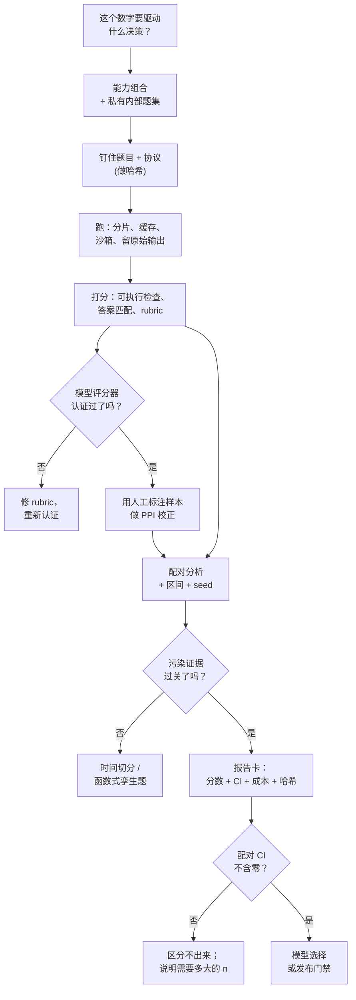

# 9. 小结

## 一页纸回顾

- **一个 benchmark 分数由构念、题目总体和协议三样东西构成。** 关于分数的争论，大多其实是关于这三样里某一样的争论。争数字之前，先说清楚争的是哪一样。

- **协议对数字的影响比模型还大。** chat 模板、system prompt、few-shot 数量、打分模式、长度归一化、答案格式指令、解析器的严格程度、输出 token 预算、解码参数、seed、服务栈、服务商，每一项都会挪动结果，其中好几项的幅度超过一代模型的差距。把它们钉住、做哈希，并把哈希印在分数旁边。

- **每一条基线都自己重跑。** 已发表的数字来自另一条流水线，通常是一条对它有利的流水线。一套 harness、一套协议、所有候选，逐题配对比较。

- **污染有五种，去重只抓得住一种。** 逐字重复、近重复、格式、蒸馏，以及选择性泄漏。可核实的防线都是黑盒的：cutoff 之后的时间切分、live 与时间切分的 benchmark、函数式孪生题，以及一个"没泄漏"能被证明的私有内部题集。

- **坏题给你的测量能力设了上限。** 经典多选套件上的标签错误，和 agent 套件上薄弱的结果验证，都会抬高或者搅乱排名。发布任何 agent 数字之前，先人工审计一批判为通过的轨迹。

- **打分是一件有自身错误率的仪器。** 优先用可执行检查，短的自由答案用答案匹配，开放式用专家 rubric。由模型来打分时，拿人工标签给它做认证，用退化输入探它，然后用 prediction-powered inference 校正它残留的偏差，而不是选择相信它。

- **像分析实验一样分析评估。** 配对差值、$n$ 小的时候用 Wilson 区间或 bootstrap、题目成组时用聚簇误差、推理套件上跑多个 seed、在整张表格上做错误发现率控制。在一个 200 题的 benchmark 上，单次运行得到的 3 分差距分辨不出来，而把这句话说出口就是正确答案。

- **报质量要连成本一起报。** 测试时计算让质量变成一条曲线。分数、区间、token、美元、延迟和算力档要一起走，否则这场比较就是在悄悄奖励花得更多的那一方。

- **Benchmark 用来选模型，永远不用来给功能做门禁。** 功能门禁是[评估一章](../evaluation/)里的 golden set、认证过的 judge 和在线闭环。

## 一页纸看懂这个系统

## 自测

答案是折叠的。每一题都先自己答一遍再展开。

1. 某厂商报告在一个 benchmark 上得 78 分；你的 harness 在同一个 benchmark 上给同一个模型打 66 分。列出你会按什么顺序做哪些检查，并说明为什么是这个顺序。

   

答案

   按典型效应大小从大到小，因为目标是找到那个能解释 12 分差距的旋钮，不是把所有东西审计一遍（[3](03-the-harness.md)）。**第一，chat 模板和 system prompt**：套错模板，或者漏掉厂商用的前置说明，在某些套件上能把模型打到接近随机。**第二，打分模式**：在选项上做对数似然排序和生成加解析器是两种不同的测量，一个 chat 模型用对数似然来打分可能看起来近乎随机。**第三，输出 token 预算**：查截断率，因为一个推理模型在推导中途被截断，是因为和能力无关的原因被判错的。**第四，few-shot 的数量和顺序，以及答案格式指令**，它们同时改变难度和可解析性。**第五，解码参数和样本数**，然后才是 **benchmark 版本和题目子集**。有一个诊断动作能绕过其中大半：把一条渲染后的 prompt 和一条原始输出打出来读一遍，bug 通常肉眼可见。结论不是去和已发表的数字对齐，而是在你自己的协议下把每个候选（含基线）重跑一遍（[1](01-clarifying-requirements.md)）。

   

2. 两个模型在一个 500 题的 benchmark 上：A 得 71.0，B 得 69.0。逐题看，A 赢了 25 题是 B 输的，B 赢了 15 题是 A 输的。A 更好吗？

   

答案

   不成立。配对差值是 $(25-15)/500 = 2$ 分，标准误 $\sqrt{25+15}/500 \approx 1.3$ 分，所以 McNemar 的 $z = 10/\sqrt{40} \approx 1.6$，过不了 1.96（[6](06-statistics-and-leaderboards.md)）。注意配对带来了多大的收益：光看每个分数不配对的区间约 4.4 分，会让这场比较显得毫无希望，而配对之后只是"还不能定论"，并且你能精确算出怎样才能定论。在不一致率 $40/500 = 0.08$、目标 2 分的情况下，$n \approx 0.08 \cdot 7.85 / 0.02^2 \approx 1{,}570$ 题。所以正确的报告是"在这个样本量下区分不出来，大约需要 1,600 题"，再加上一次 seed 方差的检查，在小套件上它常常超过正在讨论的那个效果。

   

3. 你的评分器是一个模型。你有 300 个人工标签的预算，而 benchmark 有 5,000 题。这 300 个标签怎么用？为什么这比"标 300 题然后就报这 300 题"更好？

   

答案

   把它们当成 prediction-powered 估计里的校正项，而不是一份独立样本（[5](05-scoring-and-autoraters.md)）。让评分器跑完全部 5,000 题，人工标注其中评分器也打过分的 300 题，然后报告 $\hat\theta = \text{mean}(\text{judge over } 5{,}000) + \text{mean}(\text{human} - \text{judge over } 300)$。第二项是评分器系统性误差的无偏估计，所以无论评分器偏得多厉害，结果都是无偏的，而第一项贡献了 5,000 题带来的精度。只报那 300 题等于扔掉另外 4,700 题，区间会宽得多；只报评分器则是精确而有偏。这 300 题要按切片分层，而不是均匀采样；如果同时还在给评分器做认证，就在决策边界附近多采一些。随之而来的是两条纪律：报出评分器自身的错误率，因为比它更细的比较都撑不住；以及在分布发生变化时重新收集标签。

   

4. 你接手的一套 benchmark 套件给一个 agent 打出 68% 的任务通过率。在这个数字传出这间屋子之前，你会检查什么？

   

答案

   四件事，按顺序（[4](04-contamination-and-validity.md)、[3](03-the-harness.md)）。**结果验证**：人工审计一批判为通过的轨迹，因为对广泛使用的 agent benchmark 做的审计发现，有的测试套件弱到能接受错误的解，有的判定标准会把"什么都没做"算成成功，这会显著抬高分数。**环境来源**：容器是不是按 digest 钉住的、网络策略是不是这个 benchmark 自己的、有多少题需要重试；一个重试率不可忽略的套件报的是基础设施。**指标**：如果用户只有一次机会，每次尝试 68% 并不等于体验到的 68%，所以要把 pass^k 一起报，并且提一句 $0.68^3$ 大约是 31%。**成本**：每个任务的步数、token 和美元，毕竟一个靠暴力打 200 次工具调用才成功的 agent，和一个 8 步就成功的 agent，是两个不同的产品决策。

   

5. 管理层想要一个横跨 15 个 benchmark 的头条数字。你会建什么，又拒绝什么？

   

答案

   建一个归一化的、权重明说的指数，在指数和名次上都带 bootstrap 区间，剔掉饱和的分项，并把每个 benchmark 的明细表摆在旁边（[6](06-statistics-and-leaderboards.md)）。拒绝对原始百分比做朴素平均：随机下限不同（四选一是 25%，自由生成是 0%），上限也不同，所以它按量纲加权而不是按重要性加权，而且它掩盖了到底是哪项能力动了。同样要拒绝不带名次区间就发布指数，因为读者消费的是名次的稳定性，而它通常比点估计看起来弱得多。对管理层诚实的说法是：指数是一个筛选装置，正式的决策依据是内部 benchmark。

   

6. 有人提议在训练过程中每周在测试集上评估一次，然后挑分数最高的 checkpoint。哪里不对？你会提出什么替代方案？

   

答案

   这是选择性泄漏：训练数据里什么都没进去，但报出来的数字变成了多次窥视之后的最大值，而不是无偏估计，而且窥视次数越多偏差越大（[4](04-contamination-and-validity.md)）。替代方案是把标准的三分法搬到评估上：一个可以随便查的开发集用于挑 checkpoint，另加一个密封切片，带明确的查询预算并记录日志，每看一次都记账，在它上面挑一个 checkpoint 就消耗一次窥视。最终数字从密封切片上报，并附上查询次数。这和让排行榜上的 best-of-N 提交成为一个已知偏差的，是同一条纪律（[The Leaderboard Illusion](https://arxiv.org/abs/2504.20879)）：公布一个之前试了多少个变体，本身就是结果的一部分。

   

## 延伸阅读

- 收官：[完整的方案](10-putting-it-together.md)，在那里整条流水线被一次性定下来、算清成本、在三组约束下重新推导，并压缩成一份可运行的统计参考实现。
- 可复现性与协议：[Lessons from the Trenches on Reproducible Evaluation of Language Models](https://arxiv.org/abs/2405.14782)。
- 统计：[Adding Error Bars to Evals](https://arxiv.org/abs/2411.00640) 和 [Don't Use the CLT in LLM Evals With Fewer Than a Few Hundred Datapoints](https://arxiv.org/abs/2503.01747)。
- 推理套件的方差：[A Sober Look at Progress in Language Model Reasoning](https://arxiv.org/abs/2504.07086)。
- 污染：[Recent Advances in LLM Benchmarks against Data Contamination](https://arxiv.org/abs/2502.17521) 和 [A Careful Examination of LLM Performance on Grade School Arithmetic](https://arxiv.org/abs/2405.00332)。
- Agent 的严谨性：[Establishing Best Practices for Building Rigorous Agentic Benchmarks](https://arxiv.org/abs/2507.02825)。
- Judge 校正：[Stratified Prediction-Powered Inference](https://arxiv.org/abs/2406.04291) 和 [How to Correctly Report LLM-as-a-Judge Evaluations](https://arxiv.org/abs/2511.21140)。
- 格式效度：[Answer Matching Outperforms Multiple Choice](https://arxiv.org/abs/2507.02856)。
- 产品侧的姊妹篇：[LLM 系统评估](../evaluation/)。
