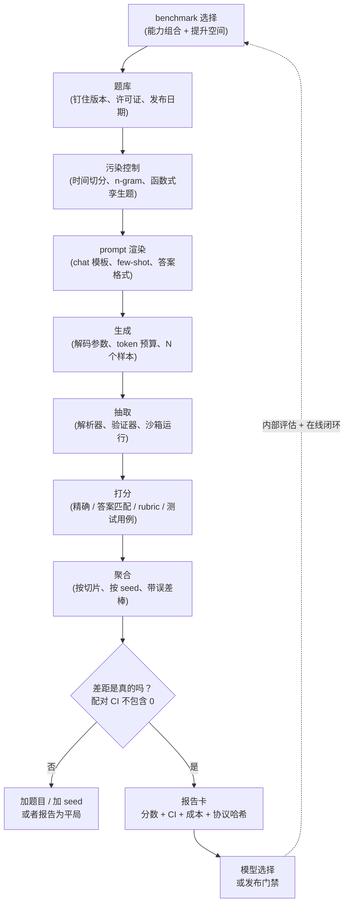

# 给模型做 Benchmark：端到端的评估流水线

> 本章是英文原版的中文译本，原文见 [book/benchmark-eval/](../../book/benchmark-eval/)。译文和原文同步维护，发现问题请提 issue。

姊妹篇[评估一章](../evaluation/)回答的是"我的*功能*好不好"。本章回答的是实验室和平台团队真正会被问到的另一个问题：**"这儿有个模型，给我一个能拿来押注发布决策的数字，并且为得出这个数字的每一步辩护。"**

面试官很少直说"设计一个 benchmark harness"。他们通常这么问：**"我们在三个候选模型里挑一个，还自己微调了一个。把整套评估流水线讲一遍，你怎么知道这些数字有意义？"** 追问永远是那三句：*你的数字为什么和论文里公布的不一样，你怎么知道 2 分的差距是真的，你怎么知道模型没有提前见过测试集。*

这是一个系统问题，不是指标问题。一个 benchmark 分数是一条流水线的输出，这条流水线上大约有十几个旋钮，其中大多数对分数的影响都超过你想测的模型之间的差距。

## 各节内容

1. [澄清需求](01-clarifying-requirements.md)：一段对话，弄清这个数字要驱动什么决策，以及由此推出的两个结论。
2. [搭出 benchmark 的骨架](02-frame-the-benchmark.md)：构念、题目总体、协议；2026 年的 benchmark 家族；饱和、提升空间与构念效度。
3. [Harness](03-the-harness.md)：把整条流水线的机制过一遍：prompt 渲染、解码、答案抽取、打分、来源记录、确定性，以及大规模运行。
4. [污染与题目效度](04-contamination-and-validity.md)：泄漏的类型、检测方法（n-gram、Min-K%、时间切分、函数式孪生题）、live benchmark，以及坏题。
5. [打分与 autorater](05-scoring-and-autoraters.md)：答案匹配和多选题、rubric 评分、pass@k 和 pass^k、给模型评分器做认证，以及偏差校正估计。
6. [统计与排行榜](06-statistics-and-leaderboards.md)：误差棒、配对检验、seed 方差、多重比较、聚合、arena 排名，以及成本对齐的比较。
7. [真实团队在生产环境里怎么做](07-how-teams-do-it-in-production.md)：真实评估栈在哪些地方分道扬镳；带一手链接的具名比较。
8. [面试问答](08-interview-qa.md)：常被问到的、有坑的、常答错的。
9. [小结](09-summary.md)：一页纸回顾、mermaid 图、自测题、延伸阅读。
10. [把它们拼起来：完整的方案](10-putting-it-together.md)：一套默认技术栈、算清成本的完整一次运行、同一系统在三组约束下的形态，以及一段零依赖可运行的统计参考实现。

## 一页纸看懂流水线

图里每一根箭头都是数字可能出错的地方，面试考的是箭头，不是方框。

## 相关章节

- [LLM 系统评估](../evaluation/)是产品侧的闭环：golden set、LLM-as-judge 校准、回归门禁、在线 A/B。Benchmark 喂给它上游的*模型选择*这一步，永远不用来给功能做门禁。
- [数据整理与预训练](../data-and-pretraining/)负责训练侧的去污染，那是唯一能真正修掉污染的地方。
- [中期训练：继续预训练与长上下文](../mid-training/)讲的是扩展模型上下文时的长上下文评估。
- 经典 ML 的姊妹书在[实验](https://github.com/neurarch-ai/awesome-ml-system-design/tree/main/book/experimentation/)一章里讲在线比较的统计。
