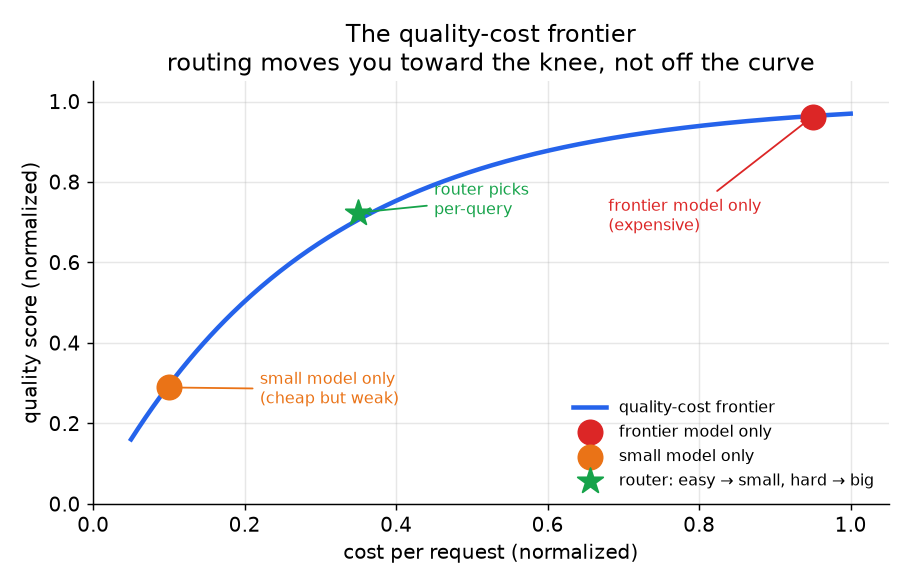

# 1. 澄清需求

动手设计之前，先把系统必须做到什么定下来。下面是一段典型的对话。每一个问题要么砍掉一部分工作，要么改变我们该去拉的杠杆。

**候选人：** 这是一个交互式产品（用户在等回答），还是像每晚跑一遍摘要那样的批量任务？
**面试官：** 交互式聊天。用户期望两秒内看到回复。

**候选人：** 我们现在有质量指标吗，还是凭感觉？
**面试官：** 有一套 LLM-as-a-judge 的评测集（由 LLM 而不是人来给每个回答的质量打分），大概 500 条带标注的样本，附有期望的回答质量分。

**候选人：** 钱现在花在哪儿？账单是被长输入 prompt、长生成，还是纯粹的请求量推高的？
**面试官：** 主要是输入 token（token 是 API 计费用的子词单位）。我们做 RAG（检索增强生成：把文档塞进 prompt），每条 prompt 都拉 20 个检索到的 chunk，其中大部分最后发现并不相关。

**候选人：** 流量是均匀的，还是有些查询明显需要前沿模型、另一些用小模型就够了？
**面试官：** 非常混杂。按数量算，简单查找和打招呼占大头；长尾是推理和代码生成类查询，那些是真难。

**候选人：** 为了在简单的大多数上省钱，可以接受多大的质量回退？
**面试官：** 如果难的长尾能稳住，简单查询掉 2 分（满分 100）我们可以接受。难的长尾一点都不能退，那是带来收入的场景。

**候选人：** 加模型或加基础设施有什么限制吗？我们是走 API 计费还是自建？
**面试官：** 目前只走 API 计费。没有 GPU 要管。

总结一下。**我们要在一个意图混杂的交互式 RAG 产品上，把输入 token 的账单降下来。** 成本驱动因素是输入，这说明上下文裁剪和 prompt 压缩是第一优先的杠杆。意图混杂的流量说明需要一个路由器或级联，把简单查询导向便宜模型。延迟 SLO（service level objective，我们承诺的响应时间目标）排除了在热路径上做两次调用的级联，除非第一次调用足够快；调用前路由可能更合适。只走 API 计费意味着量化（用更少的比特存每个权重）和 batching 都不在选项里：能用的杠杆是路由、缓存、压缩和 right-sizing。

有两个结论马上就能推出来，而且早早说出口就是这道面试题里最主要的信号：

- **不测质量，就没法调质量旋钮。** 每个杠杆都有一个阈值，每个阈值都在某个点上拿成本换质量，而这个点只能靠评测集找到。这套系统在任何路由、缓存之前，最先需要的就是那个质量数字。这里我们已经有了；如果没有，第一个交付物就是把它建出来。
- **占主导的成本驱动因素决定先试哪个杠杆。** 输入很重的 RAG（长 prompt、冗余 chunk）先靠裁剪和压缩省钱，路由带来的收益反而在其后。输出很重的生成（长回答）靠模型大小省钱。高 QPS 的分类任务靠 right-sizing 省钱。先看账单，再设计修法。

*质量-成本前沿。每个杠杆都是把一条查询沿着前沿向左移（同样质量、更低成本），而不是移出前沿。路由点就在拐点上：简单查询去便宜模型，难查询去前沿模型，混合之后比单用任何一个模型都好。示意图。*
