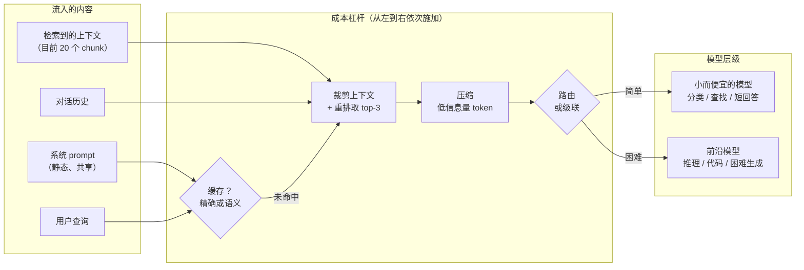

# 2. 搭出系统骨架

## token 和钱都花在了哪里

LLM API 账单由三项构成。哪一项占大头，决定了先拉哪个杠杆。

| 成本驱动因素 | 含义 | 谁受影响最大 | 第一个杠杆 |
|---|---|---|---|
| 输入 token | prompt 里的 token：系统消息、检索到的上下文、对话历史 | RAG 系统（检索 chunk 很长）、多轮对话（历史越滚越长）、agent（工具输出很长） | 裁剪上下文、压缩 prompt、缓存整条响应 |
| 输出 token | 响应里生成的 token | 长文生成、写代码或写计划的 agent | 短回答用更小的模型、流式截断、结构化输出 |
| 请求数 | API 调用次数，与长短无关 | 高 QPS 的分类、每次请求都重新算的 embedding | 路由到更小的模型、缓存精确或语义命中、batching |

先看账单。输出占大头的时候去优化输入，或者账单由请求量推高的时候去优化输出，都是白干一场，一分钱省不下来。

## 一张图看整个系统



**它是怎么工作的。** 从左边流入四样东西：静态共享的系统 prompt、检索到的上下文、对话历史和用户查询。它们会经过一叠从左到右依次施加的成本杠杆，每一层都在下一层运行前把 token 账单再压小一点。最先查的是缓存，键是稳定的 prompt 加查询；命中就短路后面所有环节，直接返回存好的响应，未命中则继续往下，把检索到的上下文重排后裁到 top-3。裁完的 prompt 再压缩一遍，丢掉低信息量的 token，到这时才轮到路由器或级联决定去哪个层级。简单流量落到小而便宜的模型，难流量落到前沿模型，所以等任何一个 token 真正跨过 API 边界时，它的量已经在前面每一级被削过了。

有意思的决策全都在**模型调用的上游**：要不要直接回缓存里的响应，有多少 token 会送到模型，以及送到哪个模型。token 一旦跨过 API 边界，钱就已经花出去了。

## 一个实用的成本模型

设每条请求的期望成本为：

$$\mathbb{E}[C] = h \cdot c_{\text{hit}} + (1-h)\bigl(c_{\text{embed}} + f_{\text{small}} \cdot c_{\text{small}} + f_{\text{big}} \cdot c_{\text{big}}\bigr)$$

其中 $h$ 是缓存命中率，$c_{\text{hit}}$ 是一次缓存查找的（极小的）成本，$c_{\text{embed}}$ 是未命中时计算查询 embedding（用一个数值向量代表查询的语义）的成本，$f_{\text{small}} +
f_{\text{big}} = 1 - h$ 描述剩余流量在两个层级之间怎么分。

```python
def expected_cost(h, c_hit, c_embed, f_small, c_small, f_big, c_big):
    # h: cache hit rate; a hit pays only the tiny lookup cost c_hit
    # on a miss (prob 1-h) we embed the query, then split across the two tiers
    miss = c_embed + f_small * c_small + f_big * c_big
    return h * c_hit + (1 - h) * miss
# f_small + f_big must equal 1 - h; e.g. expected_cost(0.5, 0.25, 0.5, 0.25, 2.0, 0.25, 8.0) -> 1.625
```

这个公式给出了下手的顺序：先提高 $h$（缓存），再调 $f_{\text{small}}$（路由），等路由比例调好了，再去降 $c_{\text{small}}$ 或 $c_{\text{big}}$（压缩、right-sizing）。

## 本章接下来要搭什么

接下来四节各讲一个杠杆，顺序就是实际应用时通常的先后：

1. **路由与级联**（第 03 节）：在昂贵层级被触发之前，先把简单查询送去便宜层级。
2. **缓存与压缩**（第 04 节）：在任何模型看到 prompt 之前，先把它消掉或缩短。
3. **Right-sizing**（第 05 节）：通过选模型、量化或蒸馏，确保"便宜层级"对这个任务来说已经便宜到头了。
4. **服务与网关**（第 06 节）：让上面这些在生产环境里可强制执行、可观测、有韧性。

它们是叠加的。一条请求先撞缓存，再被压缩，然后被路由；每一步都把比例压小，最后前沿模型只碰那条难的长尾。
