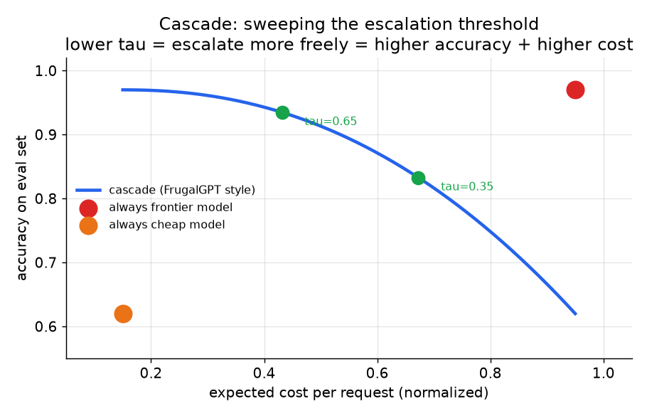
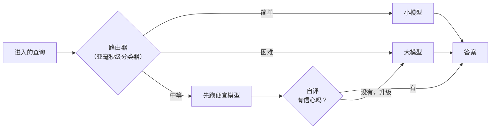

# 3. 路由与级联

路由器和级联是同一个想法在两个不同时间点上的应用：把简单查询送给便宜模型，只在难查询上花前沿模型的钱。区别在于**什么时候**做决定：在任何生成发生之前（路由器），还是在便宜模型已经试过一次之后（级联）。

## 路由器：调用前盲判

路由器是在任何昂贵模型调用之前做的一次小而快的预测。它把进来的查询分成简单或困难（或者映射到某个层级），然后据此分发。有三种做法，各自对数据的要求不同：

- **启发式 / 正则层。** 打招呼、精确查找、固定模板的请求，靠模式匹配直接送给小模型。零训练成本；模式之外的东西一碰就碎。
- **分类器路由器。** 先用一个微调过的小模型（或者一条 LLM-as-a-judge 流水线）给训练集标上难度或类别，再训练一个轻量分类器把查询文本映射到层级。Anyscale 用的就是一个微调过的分类器，按查询复杂度在闭源和开源模型之间路由。
- **偏好路由器。** 在人类偏好数据上训练（哪条查询上人们更喜欢哪个模型），预测便宜模型的胜率。RouteLLM 是标准例子：它只把一小部分流量路由到强模型，同时保住了强模型的大部分质量，成本削减约 85%。

路由器带来的期望节省是：

$$S = f_{\text{weak}} \cdot (c_{\text{big}} - c_{\text{small}}) - c_{\text{router}}$$

其中 $f_{\text{weak}}$ 是弱模型在质量线之上能处理的流量比例，$c_{\text{router}}$ 是路由器自身每次调用的成本。路由器必须比它把关的最便宜的模型还要严格更便宜；为了路由而调一次前沿模型，省下的钱就都吃掉了。

```python
def router_savings(f_weak, c_big, c_small, c_router):
    # f_weak: fraction of traffic the weak model handles at the quality bar
    # savings = big-vs-small gap captured on that fraction, minus router overhead
    return f_weak * (c_big - c_small) - c_router
# router cost must stay well below c_small; e.g. router_savings(0.5, 10.0, 2.0, 0.25) -> 3.75
```

路由器**诚实的局限**在于：它只判一次，而且是在看到任何答案之前盲判，所以它不知道自己什么时候判错了。一个在旧流量上调好的路由器，会悄无声息地把新出现的难查询路由错：成本看起来很漂亮，质量却恰好在最要紧的那些查询上悄悄下滑。

## 级联：便宜模型答完再决定

级联先跑便宜模型，给它自己的答案打一个可靠性分，只有分数低的时候才升级到更贵的模型。和路由器不同，它在决定多花钱之前看到的是一个真实答案，所以能抓住自己的错误。FrugalGPT 这篇论文实现的正是这个思路：训练一个打分器来预测答案的可靠性，做到和 GPT-4 质量持平，成本最多低 98%。

两级级联的期望成本：

$$\mathbb{E}[C] = c_1 + (1 - p_1) \cdot c_2$$

其中 $c_1$ 是便宜模型的调用成本，$p_1$ 是它的答案通过打分器的概率，$c_2$ 是前沿模型的成本。三级级联再加一项：$(1-p_1)(1-p_2) c_3$。

```python
def cascade_cost(costs, pass_probs):    # costs[i]: stage i call cost; pass_probs[i]: P(stage i answer accepted)
    total, reach = 0.0, 1.0             # reach = probability we run this stage
    for i, c in enumerate(costs):
        total += reach * c              # pay for stage i only if we reached it
        reach *= (1 - pass_probs[i])    # continue only if stage i's answer was rejected
    return total
# cascade_cost([1.0, 10.0], [0.7, 1.0]) -> 4.0  (= c1 + (1 - p1) * c2 = 1 + 0.3 * 10)
```



*扫描升级阈值 tau。tau 低就会大方地升级（质量高、成本高）；tau 高则更常接受便宜模型的答案（成本低，难长尾上质量更低）。拐点就是该上线的工作点。示意图。*

级联里承重的部件是**置信度信号**。大致按可信程度排序：

1. **可验证的 ground truth。** SQL 能跑吗？代码能编译吗？引用真的存在吗？这是货真价实的检验，所以升级很精准。可验证的任务是级联最擅长的地方。
2. **训练出来的可靠性打分器。** 一个专门训练来预测便宜答案是否正确的模型（FrugalGPT 训的就是这个）。比裸的 log-probability 好。
3. **模型自洽或自我批评。** 让便宜模型采样两次再比对；一致性低说明置信度低。信号偏软。
4. **Log-probability。**（模型自己给出的 token 级置信度，即每个预测 token 的概率取对数。）模型会报告，但在开放式文本上经常校准不准。最弱的信号，谨慎对待。

失败模式是截断阈值校准不准：太急着接受会悄悄拉低质量；太急着升级则每条查询都要为两个模型付钱。在留出数据上校准，流量变了就重新检查。

## 路由器 vs 级联：延迟上的取舍

| | 路由器 | 级联 |
|---|---|---|
| 何时决定 | 任何生成之前 | 便宜模型答完之后 |
| 延迟 | 单个模型的延迟（便宜） | 便宜模型 + 打分器，再视情况加前沿模型 |
| 能否抓住自己的错误 | 不能：盲判 | 能：给真实答案打分 |
| 最适合 | 延迟 SLO 很紧、有真实的难度信号 | 延迟有余量；任务可验证 |
| 主要失败模式 | 悄悄路由错新出现的难查询 | 截断校准不准，每条都要付两个模型的钱 |

两者可以叠加。先路由，把流量分到几个桶里，再在路由信号最弱的"中等难度"桶里跑级联。简单查询直接去便宜模型；难查询直接升级；中间那段交给级联，用真实证据来决定。



*只在信号强的地方路由（简单和困难）；多出来的那次级联调用只花在拿不准的中间桶上。*

## 什么时候用哪个

| 选用 | 适用场景 | 而不是 |
|---|---|---|
| 启发式 / 正则路由器 | 流量里有清晰、稳定的模式类别（打招呼、查找、模板） | 分类器：模式很简单时训练成本不值 |
| 分类器路由器（Anyscale、IBM） | 流量能清楚地分成简单和困难，手头有标注或有 judge 流水线 | 偏好路由器：需要你可能没有的偏好数据 |
| 偏好路由器（RouteLLM） | 有对比式的偏好数据（Chatbot Arena 那种），而且需要泛化到新的模型对 | 分类器：每换一对模型就得重训 |
| 级联打分器（FrugalGPT） | 延迟有余量，任务可验证或可打分 | 盲判路由器：当你需要抓出便宜模型的错误答案时 |
| 先路由再级联 | 混合流量里有一个路由拿不准的中等难度桶 | 到处都上级联（简单查询调两次纯属浪费） |

**出处。** 这些方法的来历就写在表格里：分类器路由器是 Anyscale 和 IBM 那条线，偏好路由器是 RouteLLM，级联打分器是 FrugalGPT。它们是系统层的路由技术，不是模型架构方法，所以不存在基础模型层面的归属。

**工具。** RouteLLM 是参考级的开源偏好路由器，自带训练好的矩阵分解路由器和基于 BERT 的路由器。LiteLLM 及其代理在一个 API 后面提供跨供应商的模型路由、回退和分层分发，是挂启发式或分类器路由器的顺手位置。分类器路由器通常是基于 Hugging Face Transformers 做的小型微调，启发式层往往就是正则加一个规则引擎，摆在同一个网关前面。FrugalGPT 一路的级联打分器一般是定制训练的可靠性模型；对可验证任务而言，"打分器"就是那个真实的检查本身（执行一次 SQL、跑一遍编译器、跑一遍测试），而不是一个学出来的模型。

**实例。** 一个聊天产品收到大量打招呼和固定 FAQ 查找，中间混着一条真正困难的推理问题长尾，而且必须在很紧的延迟 SLO 内作答。因为简单类别稳定、有明显模式，团队在前面放了一个启发式正则路由器，把打招呼和模板请求零训练成本地直接送到小模型，没有去训一个分类器，因为对这么简单的模式训练开销说不过去。对剩下的模糊流量，他们加了一个分类器路由器，因为可以用 judge 流水线标难度，而没有选偏好路由器，那需要他们并不收集的对比数据。热路径上他们没有上级联，因为延迟预算容不下"便宜模型再加打分器"的一趟往返；级联只留给一条离线批处理队列，那里有一个可验证的代码生成任务，能用真实的"编译或运行"信号来升级。

## 实现与训练中的坑

路由器和级联是省钱机制，所以它们的失败表现为钱和悄悄的质量损失，不是报错。反复出现的陷阱有：路由器花的比省的多、阈值校准一次之后再也没查过、以及依赖一个模型其实信不过的信号来升级。

| 问题 | 症状 | 修法 |
|---|---|---|
| 路由器花的比省的多 | 扣掉路由器开销后节省变成负数 | 让路由器比它把关的最便宜模型严格更便宜（启发式或小分类器） |
| 级联截断校准不准 | 要么质量下降，要么每条都付两个模型的钱 | 在留出数据上校准升级阈值，流量变了就重查 |
| 路由器因漂移过时 | 成本很漂亮，质量在新出现的难查询上悄悄下滑 | 按切片监控质量，用新流量重训路由器 |
| 过度信任 log-probability | 看起来很自信的便宜答案其实是错的，却没有升级 | 优先用可验证检查或训练出来的可靠性打分器，而不是裸 log-probability |
| 在简单流量上跑级联 | 极简单的查询调两次，浪费钱 | 简单和困难直接路由，只对拿不准的中间桶做级联 |
| 自洽采样成本爆炸 | 采样 N 次让开销翻 N 倍，质量却几乎没涨 | 只在有真实成功信号支撑的地方加重复采样 |
| 没有单请求成本上限 | 一条病态查询把每一级都以最高成本跑一遍 | 给每条请求设总花费上限，到顶就回退或截断 |
| 在饱和的信号上升级 | logprob 或自洽在难长尾上是平的 | 任务允许的话用 ground truth 验证（SQL 能不能跑、代码能不能编译） |

贯穿始终的一条线：路由器或级联只有在自身的决策比它把关的模型更便宜、校准更好时才真的省钱，所以要把净节省和按切片的质量放在一起衡量，绝不能只看总成本这一个数字。
