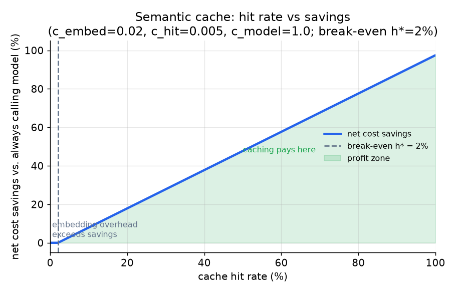
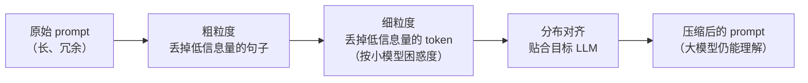
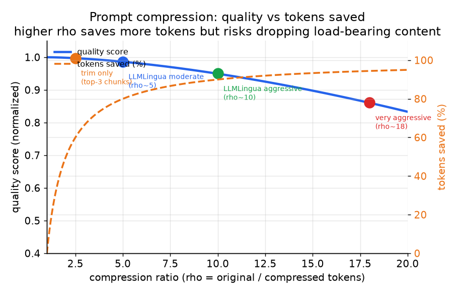

# 4. 缓存与压缩

最便宜的 LLM 调用是根本没发生的那次。缓存消掉调用；压缩缩小调用。两者都作用在模型上游，而且能和路由叠加。

## 语义缓存

**精确缓存**以归一化后的 prompt 字符串（加上模型和参数）为键，命中就返回存好的响应。风险为零（输入完全一样，答案完全一样），但在自由文本输入上命中率接近零：用户很少把同一句话打两遍。

**语义缓存**用一个小的 embedding 模型把进来的请求嵌入成向量，取 embedding 空间里最近的那条存好的响应，前提是余弦相似度（两个向量夹角的余弦：1 表示方向完全相同，0 表示不相关）过了阈值 $\tau$：

$$\text{serve cached response} \iff \max_k \cos(e_q, e_k) \ge \tau, \quad \tau \in (0,1)$$

```python
import numpy as np
def should_serve_cached(e_q, keys, tau):
    # e_q: query embedding; keys: stored key embeddings (one per row); tau: threshold
    sims = keys @ e_q / (np.linalg.norm(keys, axis=1) * np.linalg.norm(e_q))
    return bool(sims.max() >= tau)   # serve the nearest stored answer only if it clears tau
# e.g. should_serve_cached(np.array([1., 0.]), np.array([[0.9, 0.1], [0., 1.]]), 0.95) -> True
```

这样能抓住换了说法的同一个问题（"你们的退货政策是什么"和"我要怎么退货"），真正的命中率就藏在这里。阈值 $\tau$ 就是全部的关键。太松，会把另一个问题的答案端出去（自信地、便宜地答错）。太紧，命中率就塌回精确匹配。

### 缓存的账

设 $h$ 为命中率，$c_{\text{hit}}$ 为一次缓存查找的成本（小 embedding 加一次索引查询），$c_{\text{embed}}$ 为未命中时的 embedding 成本，$c_{\text{model}}$ 为完整模型调用的成本。每条请求的期望成本：

$$\mathbb{E}[C_{\text{cache}}] = h \cdot c_{\text{hit}} + (1-h)(c_{\text{embed}} + c_{\text{model}})$$

只要省下的钱超过 embedding 的开销，缓存就划算，也就是命中率过了盈亏平衡点：

$$h^{\ast} = \frac{c_{\text{embed}}}{c_{\text{model}} - c_{\text{hit}}}$$

如果 $c_{\text{model}} = 1$、$c_{\text{hit}} = 0.005$、$c_{\text{embed}} =
0.02$，那么 $h^* \approx 2\%$。命中率不高缓存也划算；问题在于语义阈值能不能在不拉低质量的前提下把命中率做出来。

```python
def cache_expected_cost(h, c_hit, c_embed, c_model):
    # h: hit rate; a hit pays only c_hit, a miss pays embedding + the full model call
    return h * c_hit + (1 - h) * (c_embed + c_model)
def cache_breakeven(c_hit, c_embed, c_model):
    return c_embed / (c_model - c_hit)   # hit rate above which caching nets positive
# e.g. cache_breakeven(0.005, 0.02, 1.0) -> 0.020100502512562814  (about 2%)
```



*净节省随命中率变化。盈亏平衡命中率 $h^{\ast}$ 很低（按典型的 embedding 与模型成本比大约 2%），所以命中率不高缓存也划算。盈利区大致线性增长；约束在阈值质量，不在盈亏平衡的算术。示意图。*

### 什么不该缓存

- **个性化或按租户隔离的答案。** 一个只用查询文本做键的共享缓存，会把用户 A 的响应端给用户 B。给缓存键加上作用域，或者对任何含私有上下文的响应干脆不缓存。
- **易变的事实。** "今天的股价是多少？"的 TTL 应该是 0。缓存稳定内容（定义、政策）；对易变内容的 TTL 下手要狠。
- **松阈值下的长尾自由文本。** $\tau$ 松到能抓住换说法的问题，就也松到会把近邻的答案回给一个真正不同的问题。用带标注的"该命中 / 不该命中"样本对来调 $\tau$，而不是看裸命中率。

## 前缀（prompt）缓存

语义缓存复用的是整条响应；前缀缓存复用的是模型在一段共享且不变的 prompt 前缀上的内部计算。很多请求都以同一段很长的系统 prompt、工具 schema、few-shot 块或文档开头时，供应商可以把这段前缀算出来的 key-value 张量存一次，后续调用直接复用，于是只有新的后缀需要 prefill。Anthropic 把这项能力叫 prompt caching，其他几家供应商也有对应的功能。它是在 token 前缀上做精确匹配，不是语义匹配，所以它和语义响应缓存是叠加关系，不是替代关系。

划不划算由两个性质决定。第一，定价是不对称的：写缓存（第一次把它填上的那次调用）通常比普通输入 token 更贵，读缓存则便宜得多，所以要在缓存的存活时间内有足够多次对同一前缀的复用，才能把写入的成本摊平。第二，也是工程师常漏掉的一点，顺序是承重的：缓存从 prompt 开头开始匹配，靠前的任何改动（每条请求的时间戳、插进系统 prompt 里的用户 id、顺序变了的工具列表）都会让它后面的全部失效。把稳定内容放前面（系统 prompt、schema、静态上下文），每条请求各不相同的易变内容放最后，否则命中率会悄悄塌掉，而输出里看不出任何异常。

## 对比：语义缓存 vs 前缀（KV）缓存

两者都叫"缓存"，都靠复用之前的工作来省钱，都悄无声息地站在模型前面，所以设计里经常把它们搞混。它们复用的东西在性质上不同：一个复用的是已经完成的答案，另一个复用的是模型在它见过的 token 上的内部计算。

| 维度 | 语义缓存 | 前缀（KV）缓存 |
|---|---|---|
| 靠复用之前的工作省钱 | 是 | 是 |
| 需要重复流量才划算 | 是（重复的问题） | 是（重复的 prompt 前缀） |
| 复用的是什么 | 存下来的响应文本 | prefill 期间算出的 key-value 张量 |
| 匹配规则 | 近似：embedding 相似度超过阈值 | 精确：从 prompt 开头逐 token 匹配 |
| 命中时的模型调用 | 完全跳过 | 照样运行；只跳过共享前缀的 prefill |
| 会不会答错 | 会，如果阈值放进了一个近邻问题 | 不会；token 变了就是未命中，重新计算 |
| 什么会让它失效 | 存下的答案背后的内容过期或个性化 | prompt 里靠前位置的任何改动（时间戳、用户 id、工具顺序） |

这个区别会在决定"每条请求哪些部分会变"时改变设计：整个问题以不同说法反复出现、而答案稳定时，语义缓存赢；每条请求都独一无二、但共享一段很长的固定头部时，前缀缓存赢；而且因为一个匹配语义、一个匹配 token，标准设计是把两者串联起来用，而不是二选一。

## Prompt 压缩

按 token 付费，模型用不到的 token 就是烧掉的钱。有两招，各适用于不同的情形。

### 上下文裁剪

粗但安全的一招：少送几个检索到的 chunk。大多数 RAG 流水线检索得太多（默认 top-20），后面 17 个 chunk 加的是噪声，不是信号。一个好的重排器（按与查询的真实相关性给检索到的 chunk 重新打分的模型；这里是 cross-encoder 或 ColBERT）给 20 个检索结果打分，只留最相关的 3 个。这在质量上往往没有代价，成本上直接就便宜了，因为答案本来就在排名靠前的 chunk 里，剩下的都是填充。先试裁剪，再考虑任何压缩算法：它零风险，而且省的可以很多（如果检索真的多到那个程度，17/20 个 chunk 等于上下文减少 85%）。

### LLMLingua 式的 token 压缩

更锋利的工具：用一个小语言模型给每个 token 按困惑度（小模型看到这个 token 时有多惊讶）打分，丢掉低信息量的 token，得到一条更短、但大模型仍然能读懂的 prompt。Microsoft Research 的 LLMLingua 先做一遍粗粒度处理（整句），再做一遍细粒度处理（单个 token），并加一步分布对齐来贴合目标 LLM 的语言模式。在 RAG benchmark 上它最高做到 20 倍压缩，质量损失约 1.5 分。





*压缩比升高时质量与省下 token 的关系。裁剪（rho 大约 2 到 3）是安全的；中等程度的 LLMLingua 压缩（rho 大约 5）拿到了大部分节省；激进压缩（rho \gt 10）有丢掉承重 token 的风险。示意图。*

净赚的条件：只有当输入 token 主导账单，并且上下文长且冗余到小模型这一遍的成本低于它删掉的 token 时，压缩才划算：

$$\text{net win iff} \quad c_{\text{big}} \cdot (n_{\text{orig}} - n_{\text{comp}}) \gt c_{\text{small}} \cdot n_{\text{orig}}$$

化简之后就是：删掉 token 带来的单 token 节省，必须超过压缩这一遍的单 token 成本，再按有多少 token 存活下来加权。在短 prompt 或输出主导的负载上，小模型这一遍纯属额外开销。

```python
def compression_net_win(c_big, c_small, n_orig, n_comp):
    # gain: big-model cost of the tokens removed; cost: small-LM pass over the FULL prompt
    gain = c_big * (n_orig - n_comp)
    cost = c_small * n_orig
    return gain > cost
# e.g. compression_net_win(10.0, 1.0, 1000, 200) -> True
```

### 什么永远不要压缩

只要某个任务里丢一个 token 就会改变答案，压缩就要退让：精确抽取、法律或合规文本、代码、引用。压缩是有损的，激进的压缩比可能恰好删掉答案所依赖的那个细节。把压缩比放在和其他所有杠杆同一套质量评测后面把关。

## 什么时候用哪个

| 选用 | 适用场景 | 而不是 |
|---|---|---|
| 精确缓存（对请求体做哈希） | 完全相同的请求反复出现（固定 prompt、共享系统消息）；对近邻错误零容忍 | 语义缓存：当你需要它更广的覆盖面、也负担得起调阈值时才用 |
| 语义缓存（embedding + 阈值） | 稳定内容（定义、政策）上的自由文本重复或换说法 | 只用精确缓存：在多变的自然语言上几乎从不命中 |
| 上下文裁剪（更少的 chunk） | RAG 流水线检索的 chunk 太多，靠后的都是噪声 | LLMLingua：简单的 top-k 重排已经解决问题时它是杀鸡用牛刀 |
| LLMLingua 压缩 | 输入 token 主导，上下文长、啰嗦、冗余（不是短 prompt 或输出为主） | 只做裁剪：当问题出在每个 chunk 内部啰嗦冗余的文本时 |
| 不缓存 | 个性化、有作用域或易变的答案 | 跨用户 / 租户共享一个缓存来存有作用域的内容（数据泄露） |

**出处。** 语义缓存的查找用的是和检索同一类向量索引：HNSW（Malkov and Yashunin, 2016）或 IVF-PQ（Meta 的 FAISS）。上下文裁剪的重排器可以是 ColBERT（Stanford, 2020）这种后期交互模型，基于困惑度丢 token 的做法来自 LLMLingua（Microsoft Research），见下面的工具说明。

**工具。** GPTCache 是参考级的开源语义缓存层，同时支持精确键哈希和"embedding 加阈值"的查找，向量存储可插拔；一个普通的 Redis 或进程内字典、以归一化 prompt 为键，就能覆盖精确缓存的场景。语义路径的 embedding 来自 sentence-transformers 或托管的 embedding API，后面接 FAISS（Meta）这类向量索引或托管存储。压缩方面，LLMLingua 和 LLMLingua-2（Microsoft Research）实现了基于困惑度、由粗到细的 token 删除，上下文裁剪则只是对检索到的 chunk 做一步重排，用 Hugging Face Transformers 里的 cross-encoder 或 ColBERT 重排器即可。

**实例。** 一个文档 AI 团队回答关于公司政策 PDF 的问题，同样那几条政策会被用很多种说法问到。精确缓存几乎从不命中，因为用户总在换说法，于是他们加了语义缓存，用一个 embedding 模型加调好的相似度阈值，把"退货期限是多久"和"我有多长时间可以寄回去"匹配到一起，并且把缓存键按租户隔离，一个客户的答案绝不会泄露给另一个。他们的 RAG 阶段检索了二十个 chunk，检索过量，所以在碰任何压缩算法之前先用重排器裁到前几个，这一步零风险又更便宜，因为答案本来就在靠前的 chunk 里。只有裁剪之后仍然存活的那些少见的、冗长的合同段落，他们才动用 LLMLingua 压缩，而在精确条款抽取上则完全关掉它，因为那里丢一个 token 就会改变答案。
