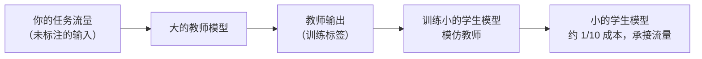

# 5. Right-sizing

大多数系统里最大的成本错误，是因为最容易搭起来，就把一个前沿模型接进了每一个子任务，然后围着它做优化。真实流水线里的大部分流量根本不需要前沿模型。让模型和任务匹配，账单里的大头在路由或缓存跑起来之前就已经消失了。

## 让模型大小和任务匹配

把流水线想成一个漏斗。每往下一级，目标更窄，任务更容易处理；一个更小、更专门的模型能比通用前沿模型做得更好、更便宜。

| 流水线阶段 | 需要什么 | 合适的大小 |
|---|---|---|
| 意图分类 / 路由 | 一个标签（简单 / 困难 / 类别） | 微调过的分类器，1B 或更小；或者一个正则 / 关键词层 |
| Embedding（用于缓存、RAG、搜索） | 一个稠密向量 | 专用 embedding 模型（例如 all-MiniLM-L6，22M 参数） |
| 对检索到的 chunk 重排 | 一个相关性分数，不是文本 | 小 cross-encoder，100M 量级 |
| 短回答 / 查找 / 抽取 | 受限的、套路化的响应 | 微调过的小模型（7 到 13B）或一次结构化输出调用 |
| 推理、代码、长生成 | 开放式、复杂的输出 | 前沿模型（只有这些才走到这里） |

在窄任务上微调过的小模型，常常在那个任务上打败巨大的通用模型，成本只是零头。Anyscale 发现一个 Llama-3 8B 分类器在路由质量上超过了用 GPT-4 做路由器；IBM 展示了一个匹配得当的 13B 专才模型在特定 benchmark 任务上胜过 Llama-2 70B。收益来自针对任务的微调，不是来自模型大小。

## 量化：更高吞吐、更低的单 token 成本

量化减少每个模型参数占的字节数，而 decode 阶段受显存带宽限制（每生成一个 token 都要从显存读一遍权重），所以这直接转化为同一张 GPU 上每秒更多的 token。Baseten 在 H100 上部署 Mistral 7B，测得 FP8（8 位浮点）相比 FP16 每秒 token 数提高 33%，每百万 token 成本降低 24%，困惑度几乎没有变化。INT4 走得更远，质量风险也更大。

这是**只有自建才有的杠杆**。走按 token 计费的 API 时，价格由供应商定，他们那边的量化已经算进去了。自建与 API 的盈亏平衡点是：

$$Q^{\ast} = \frac{c_{\text{gpu/hour}}}{3600 \cdot t_{\text{tok}} \cdot c_{\text{api/tok}}}$$

其中 $t_{\text{tok}}$ 是每条请求的 token 数，$c_{\text{api/tok}}$ 是 API 的单 token 价格。QPS 高于 $Q^{\ast}$ 时，固定的 GPU 成本胜过按 token 计费的 API；低于它时 API 更划算，自建等于在为闲置的 GPU 时间付钱。自建之前先把这笔账算一遍。

```python
def selfhost_breakeven_qps(c_gpu_hour, t_tok, c_api_tok):
    # QPS above which one GPU/hour is cheaper than paying the API per token
    return c_gpu_hour / (3600 * t_tok * c_api_tok)   # 3600 converts per-hour to per-second
# e.g. selfhost_breakeven_qps(3.0, 500, 2e-6) -> 0.8333333333333334
```

## 蒸馏：把前沿模型的知识烤进小模型

知识蒸馏训练一个小的学生模型，在你自己的任务分布上模仿大的教师模型的输出。在定义清楚、稳定的任务上（分类、模板填充、受限抽取），学生往往能达到教师 95% 到 98% 的质量，成本只有十分之一。


前期投入是一份带标注的数据集（教师在你的流量上的输出）和一次训练；QPS 高的话，持续的节省可以很可观。

蒸馏在这些条件下值得做：任务稳定（教师的行为不会一周一变），QPS 高到足以为一次训练买单，而且质量能测得足够精确，能知道学生什么时候退步了。

## 不只给模型，也给供应商做 right-sizing

选定了能过质量线的最小模型之后，还有第二个零成本的杠杆：**由哪家供应商来跑它。** 对一个不是自己托管的模型，同一份权重在不同托管供应商那里的单 token 价格和输出速度能差好几倍，因为各家跑的引擎、batching、量化和硬件都不一样。所以 right-sizing 有两个轴，模型和托管方，你要在价格和速度的前沿上挑一个满足延迟 SLO 的点。做决定时拿的应该是**每家供应商在滚动窗口内的中位数（p50）价格和速度**，不是一次带噪声的采样；[Artificial Analysis](https://artificialanalysis.ai/) 这类独立追踪站按供应商公布的正是这个数据，而且前沿在移动，所以要定期复查。

## 模型越多，运维成本越高

系统里每多一个模型都有维护成本：要评测、要部署、要监控悄无声息的质量回退，任务分布漂移了还要更新。一个包含分类器路由器、embedding 模型、重排器、小生成模型和前沿模型的系统，有五个质量面，每一个都可能悄悄退步。子任务稳定、每个模型的质量评测都自动化了的时候，right-sizing 策略效果最好。

## 什么时候用哪个

| 选用 | 适用场景 | 而不是 |
|---|---|---|
| 微调过的小模型（1 到 13B） | 窄且稳定的任务（分类、抽取、打标签），有针对任务的训练数据 | 每个子任务都用前沿模型：正确但贵 |
| 专用 embedding 模型 | 任何需要向量 embedding 的地方（缓存、RAG、语义搜索） | 用生成式前沿模型调用来产 embedding（贵得多，也不更好） |
| 小 cross-encoder 重排器 | 给检索到的候选短名单（50 到 100 条）按相关性重排 | 用完整的生成模型逐个给 chunk 打分 |
| 量化（FP8、INT8、INT4） | 自建模型且 QPS 高于盈亏平衡点 $Q^{\ast}$，固定 GPU 成本胜过 API 价格 | API 计费：这个杠杆在你这边不存在 |
| 蒸馏 | 高 QPS 的稳定任务，调用量足以为一次训练买单 | 一次性或低 QPS 的任务：训练投入永远收不回来 |
| Mixture-of-Experts（Mixtral 那种） | 想要大模型的容量，又能掌控自己的服务：每个 token 只触发 2 到 3 个 expert（按 token 选取的专门子网络） | 稠密模型：每个参数都为每个 token 付一遍钱 |
| Batch API（供应商侧） | 没有用户在等的批量工作（回填、每晚摘要、离线评测生成） | 交互式端点：为离线工作付在线价格 |

**出处。** 小模型微调通常用 LoRA（Microsoft, 2021）adapter；重排器可以是 ColBERT（Stanford, 2020）这种后期交互模型；Mixtral 式的稀疏路由源自 GShard 和 Switch Transformer 的 MoE（Google）。

**工具。** 小型微调和蒸馏出来的学生模型建立在 PyTorch（Meta）和 Hugging Face Transformers 之上，常配 PEFT/LoRA adapter 做便宜的任务专用训练。Embedding 来自 sentence-transformers（all-MiniLM 家族），重排器是同一生态里的 cross-encoder 或 ColBERT。自建量化用 GPTQ、AWQ 或 llama.cpp/GGUF，通过 vLLM 或 TensorRT-LLM（NVIDIA）提供服务，Mixtral 式 MoE 则由 vLLM 和 SGLang 提供服务。供应商侧的 batch 和按 token 计费这两个杠杆，通过 LiteLLM 这样的网关来触达。

**实例。** 一个内容平台跑着一条审核加摘要的流水线，目前几乎每条请求都打到同一个前沿模型。团队沿漏斗走了一遍：意图分类换成在自家标签上微调的小模型，不再为一个标签付前沿模型的价钱；缓存和搜索用专用 embedding 模型，不再走生成式调用；加一个小 cross-encoder 来重排检索到的段落，不再用大模型逐个给 chunk 打分。前沿模型只留在漏斗尖端的开放式摘要生成上。因为每晚的摘要回填没有用户在等，他们把这部分量走供应商的 batch API 而不是交互式端点；只有当某个子任务的 QPS 过了固定 GPU 成本胜过按 token 计费的盈亏平衡点之后，才考虑自建量化。
