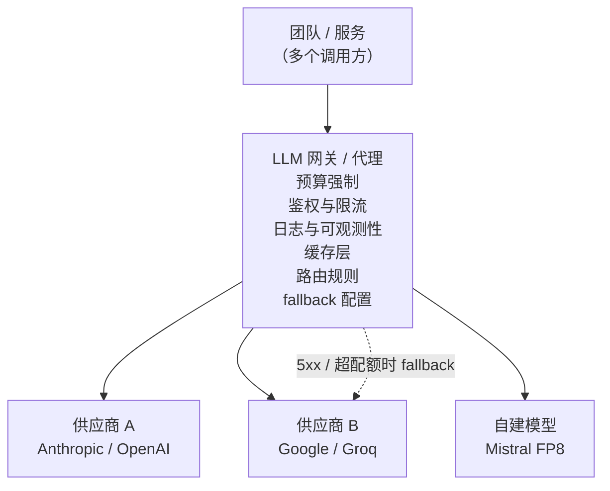

# 6. 服务与扩展

单个杠杆（路由、缓存、压缩、right-sizing）各自都能省钱。而网关模式的作用，是让它们在生产环境里真正强制生效、可观测，并且能叠加起来用。

## 网关：唯一的控制点

每条请求在到达任何供应商之前，都应该先过同一个代理。没有网关，成本优化就只能靠猜：钱花到哪儿去了查不出来，预算管不住，供应商挂了也没法平滑降级。

网关换来的东西：

- **按团队 / 租户切预算。** 一个跑飞了的循环烧不掉整个月的预算。财务能在同一套系统里按归属方看开支。
- **Fallback。** 主供应商超配额、超时或者返回 5xx 的时候，网关把流量切到备用的。功能是平滑降级而不是直接死掉。要对 fallback 率报警：悄无声息的 fallback 会掩盖故障，还可能把流量路由到一个安全行为不一样的模型上。
- **统一的缓存和路由。** 在网关上做一次就够，不用每个服务各实现一遍。绕过网关的服务，同时也绕过了这些管控。
- **日志。** 每次调用的模型、token 数、成本和延迟都汇总在一处。没有这个，连钱花在哪里都查不出来。

Uber 的 GenAI Gateway 和 Cloudflare 的 AI Gateway 就是这套东西的生产形态：一个中心代理，把成本优化从"建议"变成"强制"。

## 为省钱而做的 batching

Batching（把多条请求打包进同一个 GPU step）能大幅提升自建模型的吞吐和单 token 成本。在本章里它有两层含义：

- **自建模型上的连续批处理。** 现代推理运行时（vLLM、TGI）会把新请求插进已经在跑的序列的 decode 步骤里，让 GPU 利用率接近 100%，而不是停留在单请求的基线上。这是自建推理里"每张 GPU 能出多少吞吐"的杠杆。
- **供应商的 batch API。** 供应商（Anthropic、OpenAI）提供批处理端点，几小时内处理完任务，单 token 价格大约是一半。等得起的批量工作（回填、每晚分类、离线评测）应该走这里。很多所谓的"LLM 账单"，其实是批量工作误打误撞跑在了同步端点上。

这里关键的设计判断，是认出哪些流量真的是离线的：这部分通常比团队自己以为的要多。

## 必须要有的监控

成本降下来了却没有一个质量数字跟着，那就是一次还没被发现的悄悄降质。这几个指标要一起看：

| 指标 | 能抓到什么 |
|---|---|
| 每条成功请求的成本 | 又便宜又错的答案不算成功；这个指标追的是真实的单位经济 |
| 每个路由分桶的质量 | 小模型那一桶退步了，总体质量数字还是绿的 |
| 缓存命中率与命中答案的质量 | 阈值放松带来的高命中率，可能大部分是错答案 |
| 升级率（级联） | 升级率飙升说明分界点漂了，或者流量变难了 |
| Fallback 率（网关） | 持续 fallback 说明主供应商出了问题，不是偶发抖动 |
| 路由器漂移报警 | 定期重扫质量-成本前沿；分桶质量一动就报警 |

## 指标矩阵：质量、成本、安全（离线与在线）

成本优化是本章讲的那条轴，但一次成本上的胜利从来不能只靠自己这个数字就上线。它落在三条轴上（质量、成本、安全），每条轴都有一个上线前先测的离线代理指标，和一个在真实流量上确认的在线信号。一条更便宜、却悄悄返回错答案的路径不是节省，是一次藏起来的降质。

| 轴 | 离线 | 在线 |
| --- | --- | --- |
| 质量 | 改阈值或换模型之前，在 golden set 上测每个路由分桶的评测分数和缓存命中答案的质量 | 线上流量的每条成功请求成本、升级率、输出被编辑的比例、点赞 / 点踩 |
| 成本 | 各路由分桶下的预估单请求成本、缓存的盈亏平衡命中率 $h^{\ast}$、batch API 与同步端点的价差 | 按团队或租户的实际开支、缓存命中率、batch 与在线的流量配比、网关这一跳增加的延迟 |
| 安全 | 在安全评测集上确认 fallback 或更便宜的模型仍然遵守既有策略行为 | Fallback 率和拒答率的漂移，因为一次悄无声息的 fallback 可能把流量路由到安全行为不一样的模型上 |

一条更便宜但会返回错答案、或者会 fallback 到不安全模型的路径不能上线，所以三条轴一起卡发布，不是只看成本。

## 瓶颈一览表

| 瓶颈 | 最早的征兆 | 怎么修 | 代价 |
|---|---|---|---|
| 每条请求都打前沿模型 | 账单被一个模型主导，连简单查询也是 | 把简单流量路由到便宜模型；给子任务做 right-sizing | 要维护、评测、防漂移的模型变多了 |
| 路由器把自己省的钱吃掉了 | 路由器的成本和模型成本是一个量级 | 用亚毫秒级分类器或极小模型；绝不用前沿模型调用来做路由 | 模型更简单，路由准确率会降一些 |
| 语义缓存命中率低 | 调了半天命中率还是在盈亏平衡点 $h^{\ast}$ 以下 | 把阈值稍微放宽；改进查询归一化 | 阈值一松就有返回错答案的风险 |
| 输入 token 的开销占大头 | Profiling 显示大头是输入成本而不是输出 | 先用重排器收敛到 top-3 chunk，还高就上 LLMLingua | 有损压缩会拖累抽取类任务的答案质量 |
| 批量工作在按在线价付钱 | 离线任务跑在同步端点上 | 走供应商的 batch API，或者跑满自建实例 | 延迟以小时计；交互式流量受不了 |
| 开支到账单出来才看得见 | 直连供应商，没有网关 | 所有调用都走网关 | 网关是新增的一跳延迟（通常低于 5ms） |
| 阈值当时最优，后来就不对了 | 分桶质量在几周里逐渐变差，成本却是平的 | 定期重扫质量-成本前沿，加上自动报警 | 评测集要持续维护 |

**再展开一点。** 有两行背后的机制更值得说清楚。缓存命中率低那一行本质是精确率和召回率的权衡：语义缓存是在 HNSW（Malkov and Yashunin, 2016）这类向量索引上做最近邻查找，所以把相似度阈值放宽会抬高召回（命中更多），同时压低精确率（更多擦边命中的错答案）。所以这个修法必须以缓存命中答案的质量为闸门，而不是只看命中率。路由器吃掉自己省下的钱那一行，在路由器本身就是一次 LLM 调用时最严重；路由决策的成本必须只占下游最便宜那个模型的一小部分，所以只有亚毫秒级的分类器或 embedding 查找，才能在流量涨上去之后仍然养得活自己。
