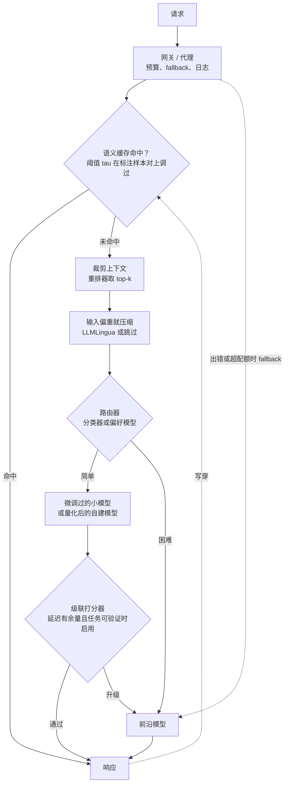

# 9. 小结

## 一页回顾

- **先找到成本大头，再设计怎么修。** 输入偏重的 RAG（prompt 很长、检索过多）该用裁剪和压缩。输出偏重的生成该缩小模型。高 QPS 的负载该上缓存和 right-sizing。把错的杠杆用在错的成本大头上，是白干一场，什么也省不下来。
- **每个杠杆都有一个旋钮，每个旋钮都在拿成本换质量。** 只有测了质量，旋钮才拧得动。质量没被测过（凭感觉，没有评测集）的话，第一个要交付的是评测集，不是路由器。
- **路由和级联换的是更便宜的模型。** 路由器盲判，而且在生成之前判（对延迟友好，但抓不住自己的错误）；级联给自己的答案打分，只在拿不准的时候升级（能抓住错误，代价是多一次首轮调用）。延迟紧就用路由器；不紧而且任务可验证就用级联。
- **缓存消掉这次调用，压缩让这次调用变小。** 阈值设对的语义缓存，是重复多、同义改写多的流量上杠杆率最高的一招。上下文裁剪（少检索几个 chunk）是 RAG 里安全的第一步。LLMLingua 那类压缩是把利器，适合输入 token 占大头、而且上下文又啰嗦又冗余的场景。
- **钱真正在的地方是 right-sizing。** 最贵的账单都来自把同一个前沿模型接进了每一个子任务：分类、embedding、重排、查找。把每一个都挪到能胜任的最便宜模型上，成本地板会明显下降。QPS 过了盈亏平衡点之后自建，还能多出量化这一个杠杆。
- **网关让上面这些都能被强制执行。** 没有一个统一代理：开支要到账单出来才看得见，预算只是建议，fallback 变成各服务事后补的补丁，路由则被每个团队各自（而且互不一致地）重新实现一遍。
- **没有配套质量数字的成本数字毫无意义。** 成本看板一片绿，正是路由器把难查询甩给小模型的特征。要追踪每条成功请求的成本、每个路由分桶的质量（尤其是难长尾）、缓存命中答案的质量，以及升级率。

## 一页看完整个系统

## 自测

答案是折叠的。每题都先自己答一遍再展开。

1. 一个 RAG 产品的 LLM 账单被输入 token 主导。第一个该试的杠杆是什么，它在质量上的风险代价是什么？

   

答案

   **上下文裁剪**：先对检索到的 chunk 做重排、只留最靠前的几个，再去考虑任何压缩算法。本章的场景是每条 prompt 都塞进 20 个 chunk，其中大部分其实不相关，所以一个只留 top-3 的 cross-encoder 会去掉 20 个里的 17 个，大约减少 85% 的上下文；[10](10-putting-it-together.md) 里的实战推演把这一步算清楚了：在任何路由之前，输入从约 8,500 token 降到约 1,700 token，单次查询从 \$0.024 降到约 \$0.0068。质量风险接近于零，因为重排器打的相关性分数本来就是检索流水线通常会算的，而且留下来的文本一个字没动：答案本来就在靠前的 chunk 里，其余的是填充。剩下的风险是重排器把答案所依赖的那个 chunk 排错了位置，表现为跨多个 chunk 的问题上召回率下降，所以保留几个 chunk 这个数要对着评测集定，不能凭感觉。只有在裁剪之后输入 token 仍然占大头时，LLMLingua 那类压缩才划算，因为它那一趟小语言模型要给完整原始上下文里的每个 token 打分（见 [4](04-caching-and-compression.md) 和 [2](02-frame-the-system.md) 两节）。

   

2. 一个路由器把账单砍了 40%，但难长尾的质量检查被跳过了。为什么这是个问题，你会埋哪些指标来发现这种失效？

   

答案

   这 40% 是个没被验证的数字：它既可能来自一次真正的胜利，也同样可能来自路由器把新变难的查询甩给了小模型。这个盲区是结构性的，不是偶然的。总体质量指标被占多数的简单流量主导，所以一个集中在很小一块难长尾切片上的回退，几乎不会让均值动一下，这也正是为什么**成本看板一片绿恰恰是这种失效的特征**，而不是它没发生的证据。按顺序埋四样东西：在一份固定的、在评测集里过采样的难长尾切片上测每个路由分桶的质量；每条成功请求的成本，因为便宜的错答案不算成功，只有这个比值才追得住真实的单位经济；有级联的话还要看升级率；再加一个路由器漂移报警，随着流量变化定期重扫质量-成本前沿。目标函数也要改：路由器应该在**每个分桶的质量下限作为硬约束**的前提下最小化成本，因为一个没有约束的目标会朝着它能廉价观测到的那一项漂，也就是成本。在这些数字出来之前，诚实的回答是你并不知道质量有没有保住（见 [6](06-serving-and-scaling.md) 和 [8](08-interview-qa.md) 两节）。

   

3. 一个语义缓存以阈值 $\tau = 0.90$ 上线了。用户反馈偶尔会收到"答的是另一个问题"的正确答案。哪里出了问题，怎么在不打死命中率的前提下修？

   

答案

   阈值太松了，最近邻查找把一个近邻存的答案返回给了一个其实完全不同的问题：又自信、又便宜、又错。这是语义缓存最典型的失效，本质是向量索引上的精确率-召回率权衡，所以把 tau 调低会让命中率和错答案率一起涨。修法是**在一份标好"应该命中"和"不该命中"的样本对集合上重新调 tau**，而不是盯着裸命中率，挑那个在把错邻居返回控制在质量容忍度以内的前提下命中最多的点。为了不让覆盖率为此买单，被牺牲的命中要从不可能出错的层里补回来，而不是靠放松阈值：embedding 之前把查询归一化做得更好，并且**串一层前缀（KV）缓存**，它做的是 token 精确匹配，最坏也只是未命中重算，绝不会返回另一个问题的答案。既然动到这里了，顺手把缓存 key 按租户分范围，给易变的事实设上激进的 TTL，因为共享缓存和过期缓存会因为不同的原因产生同样的"错答案，很便宜"症状。之后要把缓存命中答案的质量和命中率一起监控，因为光看命中率是看不见这件事的（见 [4](04-caching-and-compression.md) 和 [6](06-serving-and-scaling.md) 两节）。

   

4. 什么时候级联能在同等成本下比路由器质量更好，什么时候路由器能在同等质量下比级联延迟更低？

   

答案

   在**延迟有余量、而且有一个可信的置信度信号**（最好是可验证的：SQL 跑不跑得通、代码编不编得过、引用存不存在）时，级联在每块钱能买到多少质量上占优。它是在看过一个真实答案之后才决定要不要多花钱，所以比盲策略多掌握了信息，前沿模型的预算也就集中到了真正需要它的查询上。[10](10-putting-it-together.md) 里的模拟器把这一点算得很实：tau = 0.6 时级联在成本 4.42 下达到 0.952 准确率，而"永远用强模型"是成本 10.00 下的 0.956；tau = 0.8 时级联是 7.85 成本下的 0.967，在两条轴上都严格压过"永远用强模型"。而当 SLO 很紧、并且事前确实存在一个难度信号时，路由器在同等质量下延迟更低，因为它用一个亚毫秒级分类器判一次，只付一个模型的延迟，而一条要升级的级联要串行地付掉便宜调用加打分器加前沿调用。这也是为什么本章那个两秒的交互 SLO 把级联挡在了主路径之外。级联那一侧的信号是有梯队的：先是可验证的 ground truth，然后是训练出来的可靠性打分器，再然后是自一致性，最后才是裸的对数概率，因为一个没校准好的分界点要么拖垮质量，要么让每条请求都付两个模型的钱。两者也能叠：简单和困难直接路由，只对拿不准的中间那一桶做级联（见 [3](03-routing-and-cascades.md) 一节）。

   

5. FP8 量化让一个自建模型的吞吐提升了 33%。在什么条件下这完全不会降低成本？

   

答案

   量化**只是自建才有的杠杆**，所以在三种情况下它什么也买不到。第一种也是最常见的，你走的是按 token 计费的 API（本章的场景）：价格是供应商定的，他们自己的量化早就算进价格里了，他们拿到的任何效率收益都进了自己的毛利而不是你的账单。第二种，你自建了，但 QPS 在盈亏平衡点 $Q^{\ast} = c_{\text{gpu/hour}} / (3600 \cdot t_{\text{tok}} \cdot c_{\text{api/tok}})$ 以下：低于这个点你就是在为闲置的 GPU 时间付钱，而一张更快的闲置 GPU 仍然是闲置的，所以不管什么精度，API 都会更便宜。第三种，每秒多出来的 33% token 只有被你兑现了才变成钱，也就是缩小机队规模，或者用同样的 GPU 接住更多流量；机队规模和利用率都不变的话，GPU 小时的账单一分没少。Baseten 实测的数字（H100 上 FP8 的 Mistral 7B，token/s 高 33%，每百万 token 成本低 24%，困惑度几乎没变）是真的，但那是每 GPU 秒的数字，只有在 GPU 秒是你自己在付的时候才会走到账单上（见 [5](05-right-sizing.md)、[7](07-how-teams-do-it-in-production.md) 和 [8](08-interview-qa.md) 三节）。

   

6. 有人往交互式端点上加了一个新的批量摘要任务。成本和延迟会受到什么影响，它应该放到哪里去？

   

答案

   你在为离线工作付在线价格，而延迟的账由交互流量来还。成本上，供应商的 **batch API 大约是同步端点单 token 价格的一半**，所以跑在交互端点上的每一条批量摘要，花的钱大约是它该花的两倍；任何一份让人意外的"LLM 账单"里，都有很大一块是批量工作误打误撞留在了同步端点上。延迟上，这个任务和用户请求抢同一份供应商配额和同一份网关容量，于是在一个两秒的 SLO 面前引发限流、排队和配额触发的 fallback，而你最先会在网关 fallback 率的持续上升里看到它。它还顺带继承了一套围绕延迟预算设计的交互路由逻辑，而这个任务根本没有这个预算，等于白白被约束了一遍。把它挪到供应商的 batch API，或者等它的 QPS 过了 $Q^{\ast}$ 之后挪到一个开着连续批处理、跑满最大 batch 的自建模型上；那个一半的价格是 batching 这个机制在账单上的体现，不是随便给的折扣，这也正是为什么同样的取舍对交互流量不可接受。再给这个任务单独切一份网关预算，这样一次跑飞的回填烧不掉整个月（见 [5](05-right-sizing.md)、[6](06-serving-and-scaling.md) 和 [8](08-interview-qa.md) 三节）。

   

## 延伸阅读

- 实战推演：[把它们拼起来：完整的方案](10-putting-it-together.md)，本章的每一个选择都在那里针对场景拍板一次、算清成本、在另外两组约束下重搭一遍，并浓缩成一个可运行的单文件路由加级联。
- 高密度参考（全部数学、案例研究、象限图）：[topics/11-cost-optimization-and-model-routing.md](../../topics/11-cost-optimization-and-model-routing.md)。
- 对比与拆解：[tools/comparisons/11.md](../../tools/comparisons/11.md) 和 [tools/teardowns/11.md](../../tools/teardowns/11.md)。
- 相关专题：推理服务与连续批处理见 [topics/04-inference-serving-at-scale.md](../../topics/04-inference-serving-at-scale.md)；KV cache 与前缀缓存见 [topics/02-long-context-and-kv-cache.md](../../topics/02-long-context-and-kv-cache.md)；用于上下文裁剪的重排器见 [topics/08-semantic-search-and-embeddings.md](../../topics/08-semantic-search-and-embeddings.md)。
