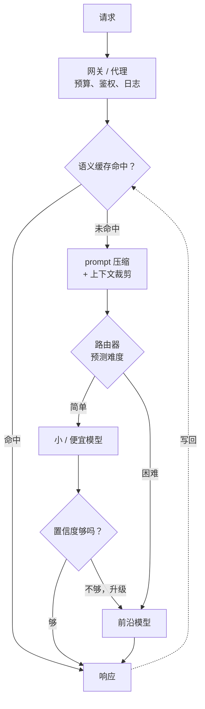

# 成本优化与模型路由

> 本章是英文原版的中文译本，原文见 [book/cost-optimization/](../../book/cost-optimization/)。译文和原文同步维护，发现问题请提 issue。

面试官很少会直接说"把 LLM 账单砍下来"。他们会这样开场：**"我们的 LLM 功能上线了，用户很喜欢，但每个月付给模型供应商的钱已经成了基础设施里最大的一项开支，财务那边开始追问。最直接的办法是把所有人都降到便宜模型，可这样一来难查询的质量就崩了。说说你会怎么在用户察觉不到质量下降的前提下把账单降下来。"**

这就是本章要讲的题目。答案不是某一个技巧，而是给每条查询匹配一条最便宜、同时又能过质量线的路径：靠路由、缓存、压缩和模型 right-sizing。后面每一节搭这套系统的一块，生产环境拆解那一节则展示 Stanford、LMSYS、Anyscale、IBM、Microsoft、Databricks、Baseten、Cloudflare 和 Uber 各自是怎么真正落地的。

## 各节

1. [澄清需求](01-clarifying-requirements.md)：一段划定问题范围、把质量-成本前沿摆到台面上的对话。
2. [搭出系统骨架](02-frame-the-system.md)：token 和钱到底花在了哪里；输入、输出，以及每种成本驱动因素对应的杠杆。
3. [路由与级联](03-routing-and-cascades.md)：把简单查询送给小模型；能给自己答案打分的级联。
4. [缓存与压缩](04-caching-and-compression.md)：语义缓存、prompt 压缩，以及各自在什么情况下划算。
5. [Right-sizing](05-right-sizing.md)：模型大小与质量的关系、量化、蒸馏，以及什么时候该自建。
6. [服务与扩展](06-serving-and-scaling.md)：网关模式、为省钱而做的 batching，以及瓶颈一览表。
7. [真实团队在生产环境里怎么做](07-how-teams-do-it-in-production.md)：有名有姓的系统，附一手资料链接和分歧对照表。
8. [面试问答](08-interview-qa.md)：常考的、有坑的、经常被答错的问题，配上清楚的答案。
9. [小结](09-summary.md)：一页回顾、mermaid 图、自测题和延伸阅读。
10. [把它们拼起来：完整的方案](10-putting-it-together.md)：一套默认技术栈，把题目场景从头到尾搭一遍并算清省下多少钱，同一套系统在三组不同约束下的变体，以及一个最小可运行的路由加级联。

## 一页看完整个系统

第一次读请按顺序读；每一节都先给出面试官真正会问的问题，再作答。

## 配套章节

本章的 right-sizing 一节讲到"换更小的模型或量化模型"就停了。[模型压缩](../model-compression/)从那里接着讲：哪个杠杆动的是哪种资源，为什么模型小 4 倍却快不了 4 倍，硬件能用得上的剪枝形状，没有预训练预算时怎么用"先剪枝再蒸馏"造一个小模型，以及怎样验收一个压缩后的模型，而不是在同一个 benchmark 分数背后偷偷换了一个模型。
