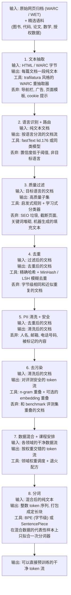
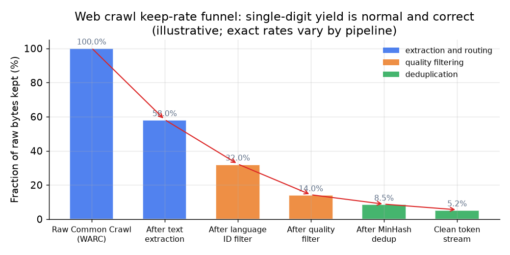

# 2. 数据流水线

这条流水线是一个漏斗，而且顺序很要紧。每一级都在减少数据量、提高质量；顺序错了，既浪费算力，结果也更差。训练循环吃的就是漏斗底部流出来的东西，所以数据里每一处质量缺陷，最后都会变成模型的质量天花板。

## 总览：输入、变换、输出





*一条典型的流水线在每一级都只保留原始字节的一小部分。最终个位数的保留率是对的：互联网上大部分低质量内容不值得拿来训练，把全部算力花在干净 token 上，胜过花在脏数据上。*

## 各阶段说明

**文本抽取。** 网页数据从 Common Crawl 拿到手时是 WARC（原始 HTTP 响应）或 WET（预先抽好的纯文本）归档。WET 省事但有损：它的通用抽取器会把导航栏、页面模板和 cookie 横幅一起留下来。在质量上舍得投入的流水线（FineWeb、RefinedWeb）会直接从 WARC 重新抽取，用专门打造的 HTML 转文本抽取器，去掉模板噪声、保住正文。抽取质量是承重的一环：抽取环节出来的垃圾会虚增重复计数、误导质量过滤器，把下游每一步的结果都拉低。

**语言识别与路由。** 用 fastText 风格的语言分类器给每篇文档打标签。置信度低于阈值的文档丢掉，其余的按语言分流。正是这一步让多语言流水线跑得起来：之后过滤器、去重阈值和质量分类器都能按语言单独调，而不是让高资源语言定的阈值把其他语言淹没（这是 CCNet 的洞见）。

**质量过滤。** 抽取和语言过滤之后，剩下的大部分内容质量依然很低：SEO 垃圾、关键词堆砌、截断页面、机器生成的填充文本。两类过滤器配合使用来解决这个问题（第 3 节详细展开）。

**去重。** 互联网上近乎相同的文档占了大头。在某一次 Common Crawl 快照里出现的文档，多半会带着小改动出现在很多其他快照里。去重能减少记忆化、堵住最主要的评测泄漏渠道，还能省下花在重复 token 上的算力。两种方法都需要（第 3 节详细展开）。

**PII 清洗与安全。** 用命名实体识别器和模式匹配把人名、邮箱、电话号码和其他个人信息（PII，personally identifiable information）标出来删除或打码。模型从没见过的东西就不可能吐出来，这既是产品安全要求，也是法律要求。

**去污染。** 只要 benchmark 的题目或段落混进了训练数据，报出来的每个数字就都成了小说。去污染就是把和评测集重叠的训练文档删掉。这一步是整条流水线的诚信闸门，必须在生成第一个训练 token 之前完成（第 3 节详细展开）。

**数据混合与课程安排。** 语料不是一大堆混在一起的东西。网页文本、代码、图书、论文、数学各有各的特点，每个领域分配一个领域权重。价值高但稀缺的领域（代码、数学、论文）会上采样到高于自然频率；嘈杂的网页文本则下采样。训练接近尾声时，把混合比例退火（逐渐偏移）到质量最高、最贴合目标的数据上，能低成本地在后训练之前把基础模型磨得更锋利。这段尾巴现在已经是一个有名字、有独立预算和独立评测的阶段，叫中期训练，混合比例重新加权、微退火、能力注入和长上下文扩展都在这里发生：见[中期训练阶段](../mid-training/03-the-mid-training-phase.md)。

具体说，"领域权重"就是下一篇文档从各个领域抽取的概率，可以用一次加权抽样实现：

```python
import random
random.seed(0)

def sample_domain(weights):            # weights: {domain: sampling probability}, must sum to 1
    r = random.random()                # draw a point in [0, 1)
    cumulative = 0.0
    for domain, w in weights.items():  # walk the weighted intervals in order
        cumulative += w
        if r < cumulative:             # r landed in this domain's interval
            return domain
# upsample scarce high-value domains above natural frequency:
# sample_domain({"web": 0.6, "code": 0.25, "math": 0.15}) -> "code"  (with seed 0)
```

**分词。** 分词器在任何预训练开始之前，在最终混合数据的代表性样本上只拟合一次。之后再改就意味着从头重训。它把原始文本映射成整数 token 序列；这些序列打包成定长块（带文档边界掩码，防止注意力跨文档串扰），写到磁盘供训练循环读取。词表大小和算法在第 4 节讲。
