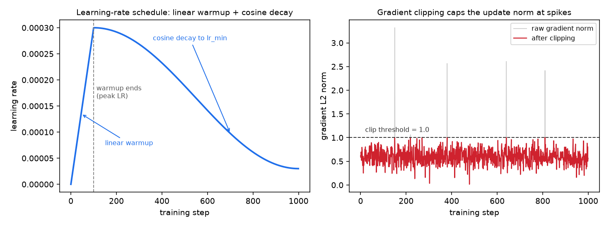
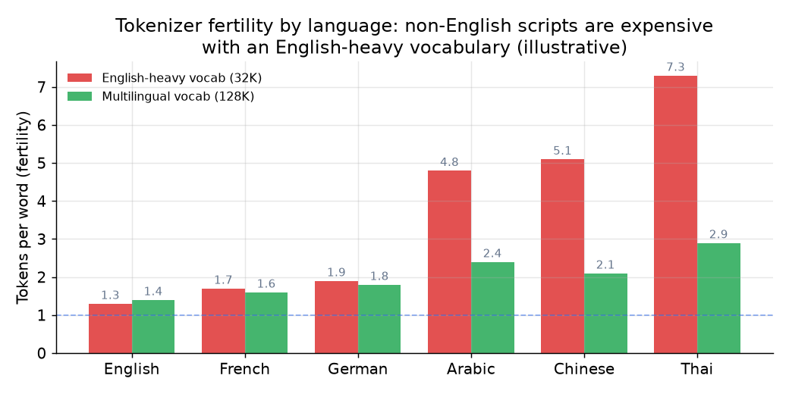
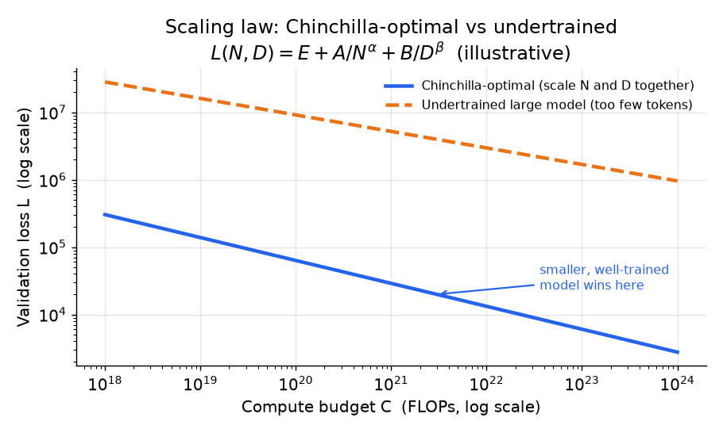
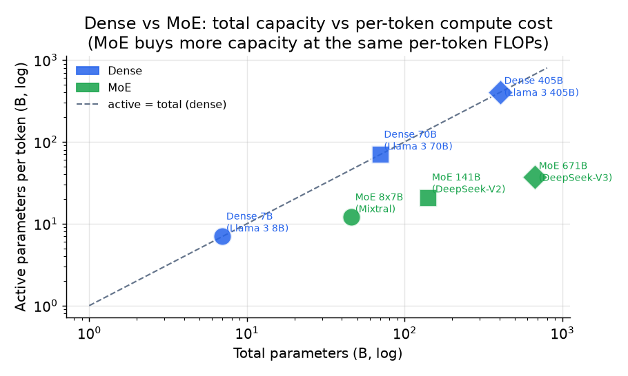
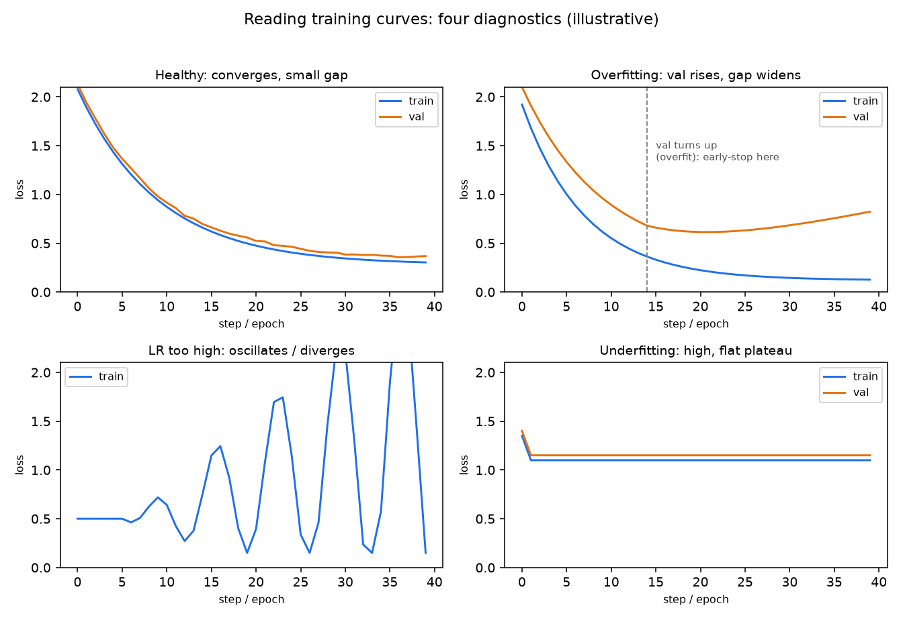

# 4. 预训练的选择

有了干净的 token 流之后，架构和算力分配相比数据质量都是二阶决策。但它们仍然是后果沉重的决策：分词器词表、注意力变体、架构类型，这些一旦定下来，不重训就没法便宜地撤回。

## 预训练目标

训练目标只有一行。decoder-only 的 transformer 把序列概率按自回归方式分解，最小化按 token 平均的负对数似然：

$$p_{\theta}(x) = \prod_{t=1}^{T} p_{\theta}(x_t \mid x_{\lt t}), \qquad \mathcal{L}(\theta) = -\frac{1}{T} \sum_{t=1}^{T} \log p_{\theta}(x_t \mid x_{\lt t})$$

文档被打包成定长序列，带文档边界掩码，防止注意力跨越不相关的文档。训练在 token 预算上跑一遍（或少数几遍）。所有难的部分都在喂给这个目标的数据，以及跑它的系统。

## 学习率调度：warmup、余弦衰减、梯度裁剪

上面这一行目标背后藏着一套每个基础模型都在用的训练稳定性配方，面试官爱问它，因为它能把"读过论文"和"跑过训练任务"区分开。学习率不是常数：先在最初一小段 step 里**从零线性 warmup**，然后**按余弦衰减**到一个很小的下限。

$$\eta(t) = \begin{cases} \eta_{\max}\dfrac{t}{t_{\text{warm}}} & t < t_{\text{warm}} \\ \eta_{\min} + \tfrac{1}{2}(\eta_{\max}-\eta_{\min})\left(1 + \cos\dfrac{\pi (t - t_{\text{warm}})}{t_{\text{total}} - t_{\text{warm}}}\right) & t \ge t_{\text{warm}} \end{cases}$$

warmup 存在的原因是：最初几步的梯度又大又噪，权重还是随机初始化的，这时直接用满学习率会发散。余弦衰减存在的原因是：训练后期需要小步长，才能稳稳落进一个极小值。在调度之上，**梯度裁剪**会把全局 L2 范数超过阈值（通常是 1.0）的更新按比例缩回去，这是防止 loss 尖峰的便宜保险，否则一个坏 batch 就可能把尖峰变成发散。



*左：线性 warmup 到峰值学习率，再余弦衰减到一个小下限。右：梯度裁剪对正常步长不做任何改动，只把偶尔出现的尖峰压到阈值，这样一个异常 batch 就炸不掉整个训练。数值仅为示意。*

峰值学习率不需要、也不应该在全尺寸模型上搜。**最大更新参数化（muP）**按宽度重新缩放初始化和学习率，让在小代理模型上找到的最优超参能直接迁移到大模型，于是可以便宜地调参、一次性放大（Yang et al., Microsoft, [arXiv:2203.03466](https://arxiv.org/abs/2203.03466)）。它现在是给昂贵预训练任务降风险的标准技巧。

## 分词器：BPE、SentencePiece 与词表大小

分词器在预训练之前、在最终混合数据的代表性样本上拟合好。之后再改就意味着从头重训。

**字节级 BPE**（byte-pair encoding，字节对编码，反复合并最常见的相邻字符对来构造 token；GPT-2 之后成为主流）从原始字节出发，贪心地合并最频繁的相邻对，直到达到目标词表大小。因为起点是字节，它能表示任何字符串，永远不会出现词表外的 token，这就是它成为英文为主模型默认选择的原因。

"贪心地合并最频繁的对"这一步值得看个具体例子。从字符出发，BPE 反复找出语料中最频繁的相邻对，把它加成一个新 token，学到一份有序的合并规则列表：

```text
corpus:  l o w   l o w   l o w e r   n e w e s t   w i d e s t
merge 1: (e, s) -> es        ...  n e w es t   w i d es t
merge 2: (es, t) -> est      ...  n e w est    w i d est
merge 3: (l, o) -> lo        lo w   lo w   lo w e r  ...
merge 4: (lo, w) -> low      low   low   low e r  ...
```

编码时按顺序重放学到的合并规则，所以 "lowest" 会被切成 `low` + `est`，而不是六个字符。合并次数越多，词表越大，每个词的 token 数越少（fertility 越低），这就是接下来几段要量化的取舍。

**SentencePiece**（BPE 或 unigram 语言模型）把输入当成包含空白符在内的原始字符流，用一个元符号来编码空格。这让它可逆且与语言无关，不依赖按空白符做预分词。它是多语言模型和没有空格分隔的语言（中文、日文、泰文）的默认选择。

### 对比：字节级 BPE 与 SentencePiece unigram

这两者常被混为一谈，因为从外面看它们一模一样：都从语料样本学一个指定大小的子词词表，都把任意文本映射成一串 id，都在预训练前只拟合一次。区别在于词表怎么构造，以及编码时字符串怎么切分。

| 维度 | 字节级 BPE | SentencePiece unigram |
|---|---|---|
| 从语料样本学一个固定大小的子词词表 | 是 | 是 |
| 覆盖任意输入 | 是，从字节出发天然保证 | 是，需要开启字符或字节回退 |
| 词表构造 | 自底向上：从字节开始，贪心地加入最频繁的相邻合并 | 自顶向下：从一个大候选集开始，剪掉对语料似然贡献最小的 token |
| 编码一个字符串 | 按顺序确定性地重放学到的合并规则 | 按每个 token 的概率选最可能的切分（Viterbi） |
| 一个字符串只有一种切分？ | 是，输出永远相同 | 否；存在其他切分方式，而且可以采样 |
| token 概率 | 没有；合并规则不带分数 | 每个 token 有学到的概率，可以做子词正则化 |

当你希望分词成为一种训练信号而不只是固定的预处理步骤时，这个差异会改变设计：unigram 能对同一个词采样不同的切分（子词正则化），相当于一种数据增强，对低资源语言有帮助；BPE 的确定性贪心合并做不到这一点，但编码简单、可复现。

**词表大小是 fertility 的取舍，不是白捡的便宜。** 词表越大，每个 token 覆盖的文本越多，序列就越短，每篇文档的训练和推理成本下降，有效上下文也变长。但词表越大，embedding 矩阵（把每个 token id 映射到向量的查找表）和输出 softmax 也越大（参数量和计算量都随词表大小增长），稀有 token 训练不充分，遇到没见过的字符串时回退效果也更差。



*主要在英文上训练的词表，会把其他文字切成多得多的 token。同样的内容，在英文为主的词表下，泰文或阿拉伯文要花更多算力和更多上下文窗口。要按语言检查 fertility，不能只看总词表大小。多语言和代码密集的模型会把词表推到 128K 甚至更大，把 fertility 压下来。*

现代基础模型的词表在 32K 到 256K 之间；多语言和代码密集的模型往更大推。**要按语言报告 fertility**（每个词的 token 数），不能只报词表大小。perplexity 只在共用同一个分词器的模型之间可比；更大的词表让每句话产生更少的 token，perplexity 看起来更漂亮，但模型并没有更好。bits-per-byte 能消掉这个假象。

## 规模扩展：算力分配与 Chinchilla 结论

在选模型大小或架构之前，先在纸上把算力预算花掉。训练 FLOPs 可以用下式很好地近似：

$$C \approx 6 N D$$

```python
def training_flops(N, D):              # N: non-embedding params, D: training tokens
    return 6 * N * D                   # ~6 FLOPs per parameter per token (forward + backward)
# Chinchilla-optimal sets D ~ 20 * N; e.g. training_flops(7e9, 20 * 7e9) -> 5.88e21
```

其中 $N$ 是非 embedding 参数量，$D$ 是训练 token 数。可达到的 loss 对两者都服从幂律：

$$L(N, D) = E + \frac{A}{N^{\alpha}} + \frac{B}{D^{\beta}}$$

这里 $E$ 是不可约的 loss（文本本身的熵，任何模型都无法突破）。在固定算力 $C$ 下最小化 $L$，就得到 Chinchilla 的结论：$N$ 和 $D$ 应该一起增长，且 $D^{\ast} \approx 20 N^{\ast}$。一个 7B 模型在算力最优点上大约需要 140B token。



*Chinchilla 最优是让参数量和 token 数同步扩大。Chinchilla 之前的模型是"训练不足的大模型"（橙色）：参数太多，token 太少。Chinchilla 最优前沿（蓝色）用更少的算力达到同样的 loss，而且一个更小、训练充分的模型服务起来也更便宜。*

**资深的补充：Chinchilla 最优是训练最优，不是部署最优。** 如果模型会被调用几十亿次，就应该刻意把一个更小的模型过度训练，远超每参数 20 个 token，好把推理成本压下来。Llama 3 8B 看了大约 15T token，接近每参数 1800 个 token，因为服务的经济账压过了训练成本。引用任何比率之前，先说清楚你在最小化哪种成本。

**另一个极限：独立 token 用完了。** 过度训练小模型的前提是有足够的 token，而高质量的独立文本是有限的。一旦 token 预算超过了独立语料的总量，问题就变成重复到底要付出多少代价。Muennighoff et al. (2023) 的 Scaling Data-Constrained Language Models 研究的正是这个问题，发现把数据重复到大约四个 epoch 以内，效果几乎和用等量新鲜独立 token 训练一样好；再往后每多重复一次的价值就衰减，最终几乎不再有增益。实际的解读是：当独立数据是硬约束时，重复几个 epoch 再加上更多参数仍然能换来真实的质量提升，但不可能靠重复把有效预算无限放大，这也是上一节的质量过滤和去重这两个杠杆仍然余量最大的部分原因。

## 架构：dense 与混合专家

基础架构是 pre-norm 的 decoder-only transformer。预训练阶段真正要紧的选择有这些：

**注意力变体。** 多头注意力（MHA）是原版；它有 $n_{\text{heads}}$ 个 query、key 和 value 头，每个维度都是 $d_{\text{head}}$。多查询注意力（MQA）把 key 和 value 压缩成每层一个头，大幅缩小服务时的 KV cache（存下来在生成各步之间复用的 key 和 value），但有一定质量损失。分组查询注意力（GQA，Llama 3 和大多数现代基础模型在用）是折中方案：$n_{\text{kv}}$ 组 key/value 头，少于 $n_{\text{heads}}$ 个 query 头，把 KV cache 缩小 $n_{\text{heads}} / n_{\text{kv}}$ 倍，质量接近 MHA。GQA 现在是默认选择，除非题目逼你做某个特定取舍，否则答案就是它。

**位置编码。** 学习式绝对位置（GPT-2）无法泛化到超过训练长度的序列。旋转位置编码（RoPE，Llama 和大多数现代基础模型在用）把相对位置编码在 key 和 query 向量的旋转里，泛化更好。关键在于，RoPE 让后期的上下文扩展变得便宜：重新缩放 RoPE 频率，再在长文档上做一小段继续训练（YaRN 风格），就能把上下文从 4K 扩到 128K token，成本只是预训练的零头。这是一个训练期的决策，回报在服务期兑现。

**归一化和激活函数。** pre-norm 配 RMSNorm（而不是 LayerNorm）加 SwiGLU MLP，是当前为了训练稳定性和质量的默认选择。

**dense 与混合专家。** dense transformer 对每个 token 都激活同一套 MLP 权重。混合专家（MoE）模型把 dense MLP 换成 $E$ 个专家外加一个路由器，把每个 token 送到 top-$k$ 个专家。总参数量（容量）增长，而每个 token 的 FLOPs（成本）基本不变：

$$g(x) = \text{softmax}(x W_g), \qquad y = \sum_{i \in \text{top-}k(g)} g_i(x) \cdot E_i(x)$$

失败模式是路由坍塌：所有 token 都挤到少数几个专家上，其余专家闲着。经典的修法是加一个辅助的负载均衡 loss：

$$\mathcal{L}_{\text{aux}} = \lambda E \sum_{i=1}^{E} f_i P_i$$

```python
def moe_aux_loss(f, P, lam=0.01):      # f: token fraction per expert; P: mean gate mass per expert
    E = len(f)                         # number of experts
    return lam * E * sum(fi * Pi for fi, Pi in zip(f, P))   # penalizes imbalanced routing
# balanced routing (f = P = 1/E) gives lam; e.g. moe_aux_loss([0.5, 0.5], [0.5, 0.5], lam=0.01) -> 0.01
```

其中 $f_i$ 是路由到专家 $i$ 的 token 占比，$P_i$ 是专家 $i$ 的平均门控质量。DeepSeek-V3 则用无辅助 loss 的均衡方法（每个专家一个可学习的偏置，轻推路由方向而不干扰梯度）。



*MoE 用同样的每 token FLOPs（激活参数量）换来一个更大的模型（总参数量）。DeepSeek-V3 总参数 671B，每个 token 只激活大约 37B。但每个专家仍然要放在显存里，路由还会增加 all-to-all 通信流量。MoE 赢在显存和系统层面，不是免费午餐。*

## 什么时候用哪个

| 选择 | 适用场景 | 而不是 |
|---|---|---|
| dense transformer（Llama 3、OLMo） | 服务端显存紧张，想要最简单的并行方式，或者需要可预测的每 token 成本 | MoE，当需要的容量超出了每 token FLOP 预算允许的范围 |
| MoE（DeepSeek-V3、Mixtral） | 想在受限的算力预算下，用较小的激活 FLOP 数拿到前沿级容量 | dense，当放下所有专家的显存或 all-to-all 路由成为硬约束 |
| GQA 注意力（Llama 3、Mistral） | 想要服务时便宜的 KV cache，质量接近 MHA；在预训练时就定下来 | MQA，除非服务预算要求更小的 cache；MHA，除非质量余量无限 |
| RoPE 位置编码 | 计划在训练后期扩展上下文，而不是从一开始就用长序列训练 | 学习式绝对位置，它无法泛化到超过训练长度的序列 |
| Chinchilla 最优的尺寸（约每参数 20 个 token） | 训练预算固定，目标是在给定 loss 下最小化训练算力 | 过度训练一个更小的模型，这才是大规模服务时想要的 |
| 过度训练的小模型（Llama 3 8B 用了 15T token） | 每天要服务几十亿 token，推理成本压过训练成本 | Chinchilla 最优，它只最小化训练算力，不管服务 |
| 更大的词表（128K 或更多） | 多语言或代码密集的混合数据，非英文文字的 fertility 很高 | 窄英文基础模型用 32K 词表，更大的词表会让稀有 token 训练不足 |

**出处。** dense 骨干是 Transformer（Google, 2017），稀疏变体源自 GShard 和 Switch Transformer 的 MoE（Google）；便宜 KV 的注意力是 GQA（Google, 2023）或它的极端形式 MQA（Google, 2019），位置编码用 RoPE（RoFormer, Su et al., 2021）。分词器是 BPE（Sennrich et al., 2016）、它的字节级形式 byte-level BPE（OpenAI GPT-2），或 SentencePiece（Google）；尺寸规则来自 neural scaling laws（OpenAI, 2020）和 Chinchilla（DeepMind, 2022）。

**工具。** 分词器来自 Hugging Face 的 tokenizers 库（字节级 BPE）和 SentencePiece（Google），后者同时提供 BPE 和 unigram 语言模型两种变体，用于没有空格的文字。dense 与 MoE 架构、GQA 注意力、RoPE、RMSNorm 和 SwiGLU 都直接写在 Hugging Face Transformers 的模型定义里，而 Megatron-LM（NVIDIA）、DeepSpeed（Microsoft）和完全开放的 OLMo 技术栈这类大规模训练框架实现了这些选择所需要的并行方式、学习率调度和负载均衡 loss。带无辅助 loss 均衡的 MoE 路由可以在开源的 DeepSeek-V3 和 Mixtral 参考实现里找到。

**实例。** 一个团队要预训练一个 7B 基础模型，打算以非常高的流量提供服务。他们先把分词器定下来：因为混合数据以英文为主，选字节级 BPE，保证任何字符串都不会落在词表外；词表定在 32K 附近而不是 128K，因为语料不是多语言的，更大的词表会让稀有 token 训练不足。他们选 dense transformer 而不是 MoE，因为服务端显存紧张，可预测的每 token 成本比原始容量更重要；他们在预训练时就定下 GQA 加 RoPE，让 KV cache 便宜，上下文也能在之后扩展，不用一开始就训长序列。在尺寸上，他们有意放弃 Chinchilla 最优（约每参数 20 个 token），远超它过度训练，因为在模型的整个生命周期里推理成本会压过训练成本。warmup、余弦衰减和范数 1.0 的梯度裁剪让整个训练过程保持稳定。

> **公开的、验证过的模型图。** 到 [Model Zoo](https://github.com/neurarch-ai/awesome-llm-model-zoo) 浏览生产规模的真实架构选择：GPT-2 small（字节级 BPE，dense）、OLMo 7B（数据配方有完整文档的全开放基础模型）、Llama 3 8B（生产规模的 GQA + RoPE + RMSNorm）和 DeepSeek-V3（MoE 路由，总参数 671B，每 token 激活 37B）。

## 实现与训练中的坑

相比训练能不能稳住、喂给目标的语料干不干净，上面这些架构选择都是二阶的。大多数基础模型事故最终都能追溯到学习率调度、路由失衡，或者数据污染，而 loss 曲线是这三者最先露面的地方。



*训练过程的四种形态：健康收敛（训练和验证 loss 一起下降）、过拟合（验证 loss 拐头向上，在那里早停）、学习率太高（loss 振荡或发散）、欠拟合（loss 一直高且平）。仅为示意。*

| 问题 | 症状 | 修法 |
|---|---|---|
| loss 尖峰后发散 | 训练中途 loss 跳变然后变成 NaN | 范数 1.0 的梯度裁剪，调低峰值学习率，回滚到上一个 checkpoint 并跳过肇事 batch |
| warmup 太短 | 权重还是随机初始化时就早早发散 | 拉长线性 warmup，让最初那些梯度噪声大的步用极小的学习率 |
| MoE 路由坍塌 | 少数专家吃掉所有 token，其余闲置 | 加辅助负载均衡 loss，或者用无辅助 loss 的偏置均衡 |
| 文档边界串扰 | 注意力跨越打包在一起的不相关文档 | 在文档边界加掩码，并在每篇文档开头重置 position id |
| 语料里的 benchmark 污染 | 公开评测分数虚高，真实质量跟不上 | 训练前用 n-gram 重叠对已知评测集做语料去污染 |
| 近似重复去得不够 | 模型记住重复片段，浪费算力 | 模糊去重（MinHash 或 LSH），不能只做精确匹配去重 |
| 词表过大 | 稀有 token 训练不足，embedding 矩阵臃肿 | 按语料定词表大小，按语言报告 fertility，不只看总大小 |
| 分词器在错误样本上拟合 | 在真实训练混合数据上 fertility 很高 | 在最终混合数据的代表性样本上拟合分词器，再定下来 |

贯穿始终的一条线：稳定的基础模型训练就是干净数据加保守调度，所以看到 loss 尖峰或者可疑的高 benchmark 分数，先当成数据或学习率问题来查，而不是架构问题。
