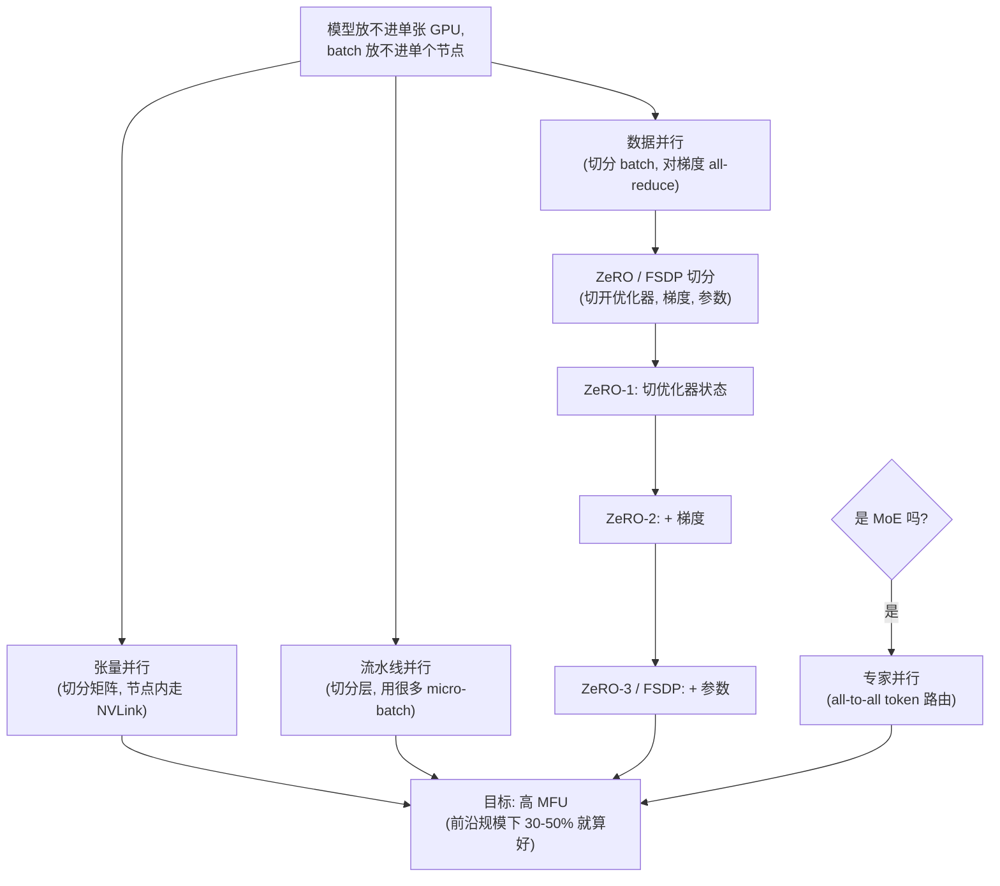

# 5. 系统

一个前沿模型放不进单张 GPU，而在单卡上训练它要花上几百年。训练目标只有一行，系统问题则是：怎么把模型铺到几千张 GPU 上，怎么让它们别闲着（高 MFU，model FLOPs utilization，即 GPU 峰值算力真正被用上的比例），以及怎么在一个每隔几小时就会坏一次的硬件集群上，让任务连续活好几周。

## 为什么瓶颈不是 FLOPs

候选人张口就说的约束几乎总是 FLOPs。真正的瓶颈是**互连和显存带宽**。一次调优良好的前沿训练能拿到 30% 到 50% 的 MFU，离 100% 的那段差距就是通信开销、流水线气泡和访存停顿。堆上你根本喂不饱的算力毫无意义，决定 MFU 的是并行方案和网络。

## 并行的几个维度

训练时最多会同时用上四个并行维度：

**数据并行（DP）。** 把模型复制到多个 worker 上，把 batch 切开，每步对梯度做一次 all-reduce。做法简单，吞吐可以线性扩。问题在于：每个副本都要放一份完整的模型和优化器状态。一个 70B 模型配混合精度 Adam（2 字节 fp16 权重 + 2 字节 fp16 梯度 + 12 字节 fp32 主权重和动量）每个参数要 16 字节，70B 参数就超过 1 TB，任何单张 GPU 都放不下。ZeRO 和 FSDP 就是冲着这堵墙去的。

**张量并行（TP，Megatron-LM）。** 把单个权重矩阵切到多张 GPU 上：每张卡算每个 matmul 的一部分，再用一次 all-reduce 拼出完整结果。这样一层大到单卡显存放不下也能放下了。代价是每一层内部都要做高带宽的 all-reduce，所以 TP 要限制在一个节点内、走 NVLink，不能跨慢得多的节点间网络。

**流水线并行（PP）。** 把层切成若干 stage 放在不同 GPU 上，micro-batch 像流水线一样一批批穿过去。代价是**流水线气泡**：管道注满和排空期间的空转时间。设有 $p$ 个 stage、每步 $m$ 个 micro-batch：

$$\text{bubble fraction} = \frac{p - 1}{m + p - 1}$$

```python
def bubble_fraction(p, m):             # p: pipeline stages, m: micro-batches per step
    return (p - 1) / (m + p - 1)       # idle fraction while the pipe fills and drains
# many micro-batches shrink it; e.g. bubble_fraction(p=8, m=64) -> 0.0986 (approx)
```

用足够多的 micro-batch（$m \gg p$）就能把气泡压小。交错调度（1F1B）能进一步压缩它。

**专家并行（EP，只对 MoE）。** 把不同专家放到不同 GPU 上。路由于是变成一次 all-to-all：把 token 洗到它对应的专家那里，再洗回来。这就是 MoE 为参数效率额外付出的通信代价。

## 显存切分：ZeRO 与 FSDP

朴素的数据并行会在每张 GPU 上复制那份每参数 16 字节的完整优化器占用。**ZeRO**（DeepSpeed）改成把这份占用切开：

- **ZeRO-1：** 把优化器状态（12 字节的 fp32 主权重和 Adam 动量）切到 $N_d$ 个数据并行 rank 上。
- **ZeRO-2：** 在此之上再切梯度（2 字节 fp16）。
- **ZeRO-3：** 再切参数本身（2 字节 fp16），前向和反向时按需把每层的权重 gather 起来，用完就扔。

ZeRO-3 下每张 GPU 的显存趋近于：

$$M_{\text{gpu}} \approx \frac{16\,\Psi}{N_d}$$

```python
def zero3_mem_bytes(psi, n_d):         # psi: total params, n_d: data-parallel ranks
    return 16 * psi / n_d              # 16 B/param (fp16 weights + grads + fp32 master + Adam moments), sharded
# e.g. a 70B model over 64 ranks: zero3_mem_bytes(70e9, 64) -> 1.75e10  (~17.5 GB/GPU)
```

其中 $\Psi$ 是总参数量，$N_d$ 是数据并行 rank 的数量。代价是每步多出来的 all-gather 和 reduce-scatter 通信，要靠在快速链路上和计算重叠起来，才能保住 MFU。

**PyTorch FSDP**（Fully Sharded Data Parallel）是 ZeRO-3 式切分在 PyTorch 里的原生实现。它在用到某个单元的参数之前才 all-gather，用完立刻释放。远大于单卡显存的模型能在普通的数据并行集群上训起来，靠的就是这个。

## 混合精度

全程用 fp32 训练很稳，但浪费显存和带宽。标准的混合精度训练保留 fp32 的主权重和 Adam 动量（为了数值稳定），前向和反向用 fp16 或 bf16。bf16 更受青睐，因为它的指数范围和 fp32 一样（不需要 loss scaling），代价是尾数精度低一些。

**FP8**（DeepSeek-V3 在用）相比 bf16 把激活值和 GPU 间通信的字节数砍掉一半。在瓶颈是互连而不是算力的大规模场景下，这是很可观的吞吐收益。FP8 需要小心管理缩放，否则数值会不稳；当稳定性比吞吐更重要时，就老老实实待在 bf16。

## checkpoint 与故障恢复

一个在几千张 GPU 上跑好几周的任务，一定会撞上硬件故障，也一定会撞上训练不稳定。这个任务是一个容错的分布式系统，不是一次 `.fit()` 调用。

**checkpoint 要勤，而且要便宜。** 按固定间隔把模型、优化器和 data loader 的状态写下来。异步写和分片写能让 checkpoint 不阻塞训练。data loader 的位置很关键：恢复时既不能重复喂同样的 token，也不能跳过 token。checkpoint 间隔的定法是：让故障发生时预期浪费掉的工作量（平均无故障时间乘以损失比例）落在可接受范围内。

**检测 loss 尖峰并从中恢复。** loss 偶尔会因为一个坏 batch、数值不稳定，或者某种不走运的相互作用而尖峰。标准的恢复动作是：回滚到上一个好的 checkpoint，跳过或重新打乱肇事的那些数据 batch，必要时在这段颠簸期把学习率调低、把梯度裁剪收紧。把这套流程做进训练框架里，在这个规模上它是例行操作，不是事故。

**弹性训练与冗余。** 到了集群规模，中断频繁到自动检测和重启必须成为系统的核心部分。Llama 3 的技术报告写的就是这件事：热备节点或者弹性调度器把挂掉的节点摘掉、在剩下的节点上继续跑，这是标准做法，不是事后补丁。

不用提示就主动讲故障恢复，是很强的资深信号。把预训练描述成"调一下训练循环，跑三周"的候选人，一次都没真跑过。

## 把这些维度组合起来：3D / 4D 并行方案

实际方案会把多个维度叠起来，看哪个约束卡得最紧来选：



**它是怎么运作的。** 方案从卡得最紧的那个约束出发：模型放不进单张 GPU，batch 放不进单个节点。这一个问题分叉成三个一起用的并行维度。张量并行在节点内通过快速的 NVLink 切分权重矩阵，流水线并行把层切成 stage、用很多 micro-batch 喂进去以压小气泡，数据并行切分 batch 并对梯度做 all-reduce。数据并行这一支接着交给显存切分：随着显存墙越来越紧，ZeRO / FSDP 从 ZeRO-1（优化器状态）叠到 ZeRO-2（再加梯度），再叠到 ZeRO-3（再加参数）。另有一个开关，只在架构是 MoE 时才加上带 all-to-all token 路由的专家并行。所有分支最后都汇聚到同一个目标：高 MFU（前沿规模下 30% 到 50% 就算不错），整套方案就是照着这个指标调的。

## 什么时候用哪个

| 选择 | 适用场景 | 而不是 |
|---|---|---|
| 张量并行（Megatron） | 单独一层放不进单卡显存 | 跨节点 TP，它需要 NVLink 级别的速度；TP 跨慢网络会毁掉 MFU |
| 流水线并行 | 用了 TP 之后整个模型栈还是放不下；用很多 micro-batch 把气泡压小 | micro-batch 太少（$m$ 接近 $p$），那样气泡会占主导 |
| ZeRO-1 或 ZeRO-2 | 优化器状态是显存墙，但你想尽量少加通信 | ZeRO-3 / FSDP，除非参数分片的通信开销可以接受 |
| ZeRO-3 / FSDP | 就算用了 TP，参数本身还是放不进单张 GPU | ZeRO-1/2，当只有优化器状态是那堵墙、而参数 all-gather 的开销又值得在意时 |
| 专家并行 | MoE 架构逼着你把专家铺到多张卡上 | dense 的并行方案，因为 EP 会带来必须小心重叠的 all-to-all 流量 |
| FP8 精度（DeepSeek-V3） | 前沿规模的训练，把激活和通信字节数砍半能换来吞吐 | bf16 加 fp32 主权重，当数值稳定性比吞吐更重要时 |
| 高频的分片 checkpoint | 跑好几周的任务，预期会有硬件故障（集群规模下永远会有） | 低频 checkpoint；间隔要按平均无故障时间来定 |
| 激活重计算（activation checkpointing） | 所有切分手段都用完之后，显存还是那堵墙 | 重算激活，当延迟比显存更重要时 |

**出处。** 张量并行和流水线并行源自 Megatron-LM（NVIDIA）；优化器、梯度和参数的切分是 ZeRO（Microsoft），其中 ZeRO-3 式的参数切分由 FSDP（Meta）原生实现。

**工具。** 张量并行和流水线并行在 Megatron-LM（NVIDIA）及其 NeMo 封装里有实现，上层很多技术栈直接复用。优化器、梯度和参数的切分来自 DeepSpeed（Microsoft）里的 ZeRO，或者 PyTorch FSDP（Meta），后者是 ZeRO-3 式切分的原生实现。FP8 的激活和通信路径通过 Transformer Engine（NVIDIA）暴露出来，而激活重计算和混合精度 autocast 本来就内置在 PyTorch 里。专家并行就在 Megatron 和 DeepSpeed 同一套 MoE 代码路径里。

**实例。** 一个团队要预训练一个 70B 的 dense 模型，单独一层就已经撑爆了单卡显存。他们先上张量并行，并把它限制在一个 NVLink 节点内，因为把那次 all-reduce 放到慢速的节点间网络上会让 MFU 崩掉。如果整个模型栈还是放不下，就再加流水线并行，并用很多 micro-batch 把气泡比例压住，而不是用少量 micro-batch 让气泡占主导。剩下的那堵墙是优化器状态，于是他们上 ZeRO-3 或 FSDP，把参数也切开，接受多出来的 all-gather 流量，因为光靠 ZeRO-1 或 ZeRO-2 放不下参数。他们继续用 bf16 加 fp32 主权重，因为在这个规模上稳定性比 FP8 能换来的吞吐更重要；同时高频地做 checkpoint，用分片异步写，间隔按集群的平均无故障时间来定。
