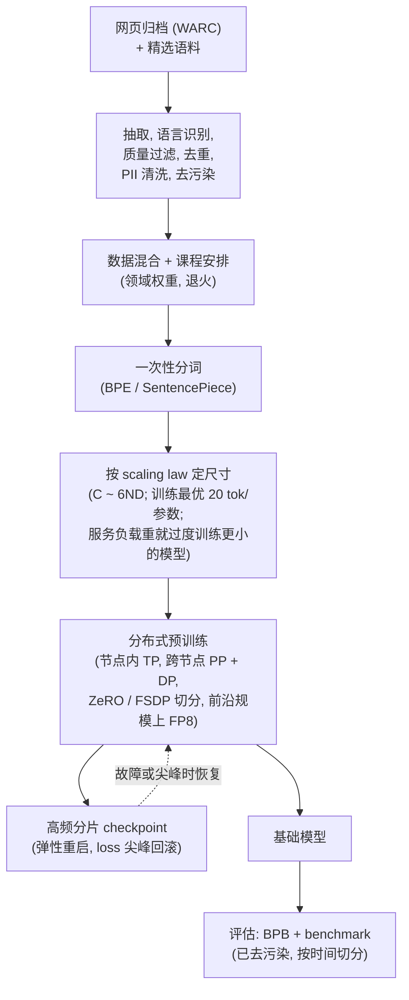

# 9. 小结

## 一页回顾

- **几乎没有人应该从零预训练。** 在一个开放基础模型（Llama 3、OLMo、Mistral）上做继续预训练，能覆盖现实里绝大多数需求。从零预训练只有四个理由说得通：新语言、新模态、新分词器，或者一种所有开放模型都确实不具备的能力。在开始设计任何东西之前，先把这句话说出来。

- **数据是能力的上限。** 模型质量被数据质量卡住，远早于被架构卡住。原始 Common Crawl 大部分是页面模板噪声、垃圾内容和近似重复。流水线只留下很小一部分，往往是个位数百分比，而把算力花在干净的少数上，胜过花在脏的大多数上。抽取、过滤和去重才是正事；训练目标只有一行。

- **流水线的顺序是有讲究的。** 抽取质量在所有过滤器的上游；抽取出垃圾，会毒害后面每一步。去重和质量过滤是杠杆最大的两步。去污染是诚信闸门，必须在第一个训练 token 之前完成。

- **去污染不是可选项。** 任何没有附带去污染说明的头条 benchmark 都该被怀疑。用 n-gram 重叠删掉和评测集重合的训练文档，把比例报出来，并且不用等人问就主动讲这一条。

- **算力预算在聊架构之前就把规模定下来了。** $C \approx 6ND$；Chinchilla 最优给出 $D^{\ast} \approx 20 N^{\ast}$。但 Chinchilla 最小化的是训练算力，不是全生命周期成本。如果要大规模服务，就该把一个更小的模型过度训练到远超每参数 20 个 token，好让推理成本永久保持便宜。

- **分词器是一个 fertility 决策。** 以英文为主的词表会把其他文字切成多得多的 token，每篇文档要花更多算力、占更多上下文。要按语言检查 fertility；比较词表不同的模型时，报 bits-per-byte（BPB），不要报 perplexity。

- **训练是一个分布式系统问题，不是一次 `.fit()` 调用。** 张量并行在节点内（NVLink 速度）切分矩阵；流水线并行跨节点切分层，用很多 micro-batch 把气泡压小；ZeRO / FSDP 把优化器占用切开，而不是逐份复制。瓶颈是互连和显存带宽，不是 FLOPs。高频的分片 checkpoint、弹性重启和 loss 尖峰回滚是核心组成部分，不是事后补丁。

## 一页看完整个系统

## 自测

答案是折叠的。每道题先自己答一遍，再展开看。

1. 一个团队提议为某个新的企业文档领域从零预训练一个 7B 模型。你问的第一个问题是什么，正确答案大概率是什么？

   

答案

   问"我们是真的要从零预训练，还是在一个现成的开放基础模型上做继续预训练？"，而正确答案大概率是**在开放基础模型上做继续预训练**（Llama 3、OLMo、Mistral）。从零预训练只有四件事撑得起来：目标语言没有合适的开放基础模型、模态是全新的、分词器必须和所有现成的都不同，或者需要一种所有开放模型都确实不具备的能力。一个新的企业文档领域一个都不占；它只是领域差距，用几十张 GPU 在大约 30B 领域 token 上做继续预训练就能补上，成本只是零头。不用等人问就说出这一点，然后再顺着面试官的设定往下走，这是整道题里第一个资深信号（见第 [1](01-clarifying-requirements.md) 节，第 [8](08-interview-qa.md) 节还会强化）。第 [10](10-putting-it-together.md) 节左边那一列给出了这套方案具体长什么样：分词器、架构和并行方案都是继承来的，所有精力都投在数据整理上，而去污染是唯一一行永远不缩水的预算。

   

2. 流水线跑完之后，团队发现保留率只有原始 Common Crawl 字节数的 4%。这是个问题吗？为什么？

   

答案

   不是问题：**个位数的保留率是设计如此，不是失败**。原始 Common Crawl 大部分是页面模板噪声、垃圾内容和近似重复，把整个算力预算花在干净的少数上，胜过花在脏的大多数上。第 [10](10-putting-it-together.md) 节那个示意漏斗端到端大约落在 2%（约 20% 熬过抽取，其中 60% 在语言识别后属于目标语言，其中 30% 过了质量过滤，其中 50% 过了去重），所以 4% 稳稳落在预期区间里。真正值得查的是这一跌发生在*哪一步*，而不是跌了多少：如果塌陷集中在抽取环节，通常意味着抽取器在产垃圾，接着它会把重复数量撑大，并误导下游每一个过滤器（见第 [2](02-the-data-pipeline.md) 节）。另外确认这个漏斗还能供上训练所需的 token 预算；如果供不上，修法是加更多来源，或者重复最多大约四个 epoch，而不是把过滤器放松（见第 [4](04-pretraining-choices.md) 节）。

   

3. 你的留出集 perplexity 比竞品公布的数字低。这是否说明你的模型更好？动手下结论之前你要先核实什么？

   

答案

   不能说明。**perplexity 只在共用同一个分词器的模型之间可比。** 词表更大的模型每句话吐的 token 更少，于是同样的总困惑度被摊到更少的位置上，报出来的数字降了，建模能力却没有任何真实提升。下任何结论之前先核实三件事：两个模型用的是不是同一个分词器、是不是在同一份留出集上评的、两边的训练语料是不是都对这份留出集做过去污染，因为污染只会把分数往好看的方向推。与分词器无关的比较指标是 **bits-per-byte**，$\text{BPB} = \frac{\mathcal{L}}{\ln 2} \cdot \frac{n_{\text{tokens}}}{n_{\text{bytes}}}$，它按原始字节归一化，而字节数是任何分词器选择都改变不了的量（见第 [6](06-evaluation-and-scaling.md) 节）。认真的预训练论文两个都会报；同一个 fertility 假象从另一面看过去，也正是词表大小是取舍而非白捡便宜的原因（见第 [4](04-pretraining-choices.md) 节）。

   

4. 规模扩展的同事说："我们这个 7B 模型的 Chinchilla 最优是 140B token，训到那儿就该停了。"而你正在规划一个服务负载很重的生产环境。你怎么回应？

   

答案

   Chinchilla 说得对，但优化的是错的目标：$D^{\ast} \approx 20 N^{\ast}$ 最小化的是达到目标 loss 所需的**训练算力**，而一个每天要被调用几十亿次的模型还有第二笔、更大的全生命周期成本，这条规则不管它。服务负载很重时，部署最优的点是一个更小、并且被过度训练到远超每参数 20 个 token 的模型，因为额外的训练 FLOPs 只付一次，而更低的每 token 推理成本要收一辈子。Llama 3 8B 就是先例，大约 15T token，约每参数 1800 个 token；本章自己的方案也把同样的 $C \approx 6ND = 6 \times 10^{22}$ FLOPs 花在一个 7B 模型、约 1.4T token 上（大约每参数 200 个 token），而不是 Chinchilla 最优的 22B 配 450B token，接受每单位训练 FLOP 的 loss 更差，换来每个服务 token 大约 3 倍的成本优势。诚实的附加条件是 token 供给：过度训练的前提是你真有那么多独立 token，而超过大约四个 epoch 的重复之后，每多重复一次几乎不再带来任何增益。引用任何比率之前，先说清楚你在最小化哪种成本（见第 [4](04-pretraining-choices.md) 节和第 [10](10-putting-it-together.md) 节）。

   

5. 训练进行到第 52K 步，loss 剧烈尖峰，随后开始发散。一步一步讲你的恢复流程。

   

答案

   按顺序来。**第一，回滚到尖峰之前最后一个好的 checkpoint**，而且要连同权重一起恢复优化器状态：只回退权重会再次发散，因为 Adam 的二阶矩估计已经被污染了。**第二，找出并跳过或重新打乱第 52K 步附近的数据 batch**，因为病态 batch 撞上一次很大的自适应优化器更新是常见诱因。**第三，在这段颠簸区间把调度放软**：调低峰值学习率，或者收紧梯度裁剪，后者通常设在全局 L2 范数 1.0，正是针对这种情况的便宜保险。**第四，确认 data loader 从正确的位置续上**，既不重复也不跳过 token。**第五，恢复训练，并在刚刚重放的那段区间盯着 loss 和梯度范数的告警。** 这是开跑之前就做进训练框架里的常规工具链，不是事故响应（见第 [5](05-systems.md) 节和第 [8](08-interview-qa.md) 节）；一个每次尖峰都要人工介入的任务，不可能在每隔几小时就坏一次的硬件上活过好几周。

   

6. 一位同事想把张量并行拉到跨机柜，做成一个 200 rank 的 TP 组。会出什么问题，你会改成怎么做？

   

答案

   张量并行在**每一层内部都要发起一次高带宽 all-reduce**，而这次 all-reduce 就压在关键路径上，藏不到计算后面去，所以 TP 只有在节点内、跑在 NVLink 速度上才成立。拉到跨机柜之后它就跑在慢速的节点间网络上，MFU 会崩掉，而整套并行方案就是照着 MFU 调的（前沿规模下 30% 到 50% 就算不错，离 100% 的那段差距本来就已经是通信开销）。正确的做法是把 TP 限制在节点内，往那些能容忍慢链路的维度上扩：**跨节点用流水线并行**，配很多 micro-batch，让气泡比例 $\frac{p-1}{m+p-1}$ 在 $m \gg p$ 时保持很小；当显存墙是每参数 16 字节的优化器占用、而不是某个超大的单层时，再加上**数据并行配 ZeRO/FSDP 切分**。只有当某一层确实撑爆单卡显存时才动用 TP，而且只在节点内用（见第 [5](05-systems.md) 节和第 [10](10-putting-it-together.md) 节）。在 7B 这个尺度上 TP 和 PP 一个都不需要：光靠 FSDP，64 个 rank 就能把常驻占用压到每张 GPU 大约 1.75 GB。

   

## 延伸阅读

- 本章的收官之作：[完整的方案](10-putting-it-together.md)，本章的每个选择都会在那个场景里一次性拍板、算清成本、在另外两组约束下重搭一遍，最后压缩成一份可运行的单文件 MinHash 去重代码。
- 密集参考版本（全部案例、完整数学、对比图）：[topics/14-data-curation-and-pretraining.md](../../topics/14-data-curation-and-pretraining.md)。
- 数据流水线有完整文档的开放基础模型：[OLMo / Dolma (Ai2)](https://arxiv.org/abs/2402.00838)、[Llama 3 (Meta)](https://ai.meta.com/research/publications/the-llama-3-herd-of-models/)、[Pythia (EleutherAI)](https://arxiv.org/abs/2304.01373)。
- 到 [Model Zoo](https://github.com/neurarch-ai/awesome-llm-model-zoo) 追一下那些在预训练阶段就定下来的架构选择：GPT-2 small（字节级 BPE，dense）、OLMo 7B（完全开放的流水线）、Llama 3 8B（GQA + RoPE + RMSNorm）、DeepSeek-V3（前沿规模的 MoE 路由）。
