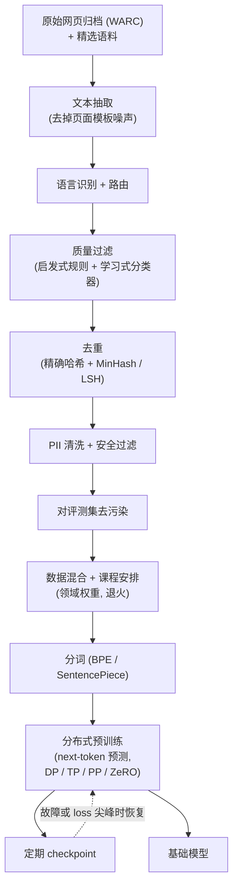

# 数据整理与预训练

> 本章是英文原版的中文译本，原文见 [book/data-and-pretraining/](../../book/data-and-pretraining/)。译文和原文同步维护，发现问题请提 issue。

面试官很少直接说"设计一条预训练流水线"。他们更常这么问：**"某个前沿实验室给了你从零训一个基础模型的预算：几千张 GPU、几个月时间、整个公开互联网外加一些授权语料。讲讲你怎么把一 PB 的原始 Common Crawl 变成一条干净的 token 流，怎么定模型大小和 token 预算，以及怎么真正把训练任务跑在集群上，既不让 loss 发散，也不让任务每六个小时挂一次。"**

这就是本章要讲的内容。它覆盖了弱回答最爱跳过的两件事：**数据是怎么变干净的**，以及**训练任务是怎么活下来的**。训练目标（next-token 交叉熵）只有一行公式，工程活儿全在它周围。

## 各节

1. [澄清需求](01-clarifying-requirements.md)：把问题范围定下来的那段对话，以及紧接着推出的两个结论。
2. [数据流水线](02-the-data-pipeline.md)：来源、文本抽取、语言识别、过滤、去重、去污染、分词、混合。
3. [数据质量](03-data-quality.md)：启发式过滤与学习式过滤、大规模去重、去污染；附一张"什么时候用哪个"的表。
4. [预训练的选择](04-pretraining-choices.md)：dense 与 MoE、注意力变体、位置编码、scaling law、训练最优与推理最优；附"什么时候用哪个"表，关键公式用 KaTeX 写出。
5. [系统](05-systems.md)：分布式训练、精度、并行维度、ZeRO 与 FSDP、checkpoint 与故障恢复；附"什么时候用哪个"表。
6. [评估与规模扩展](06-evaluation-and-scaling.md)：perplexity 与 bits-per-byte、benchmark 去污染，以及瓶颈表。
7. [真实团队在生产环境里怎么做](07-how-teams-do-it-in-production.md)：各家具名系统的差异表，附一手资料链接。
8. [面试问答](08-interview-qa.md)：常问的、有陷阱的、常答错的，配清楚的答案。
9. [小结](09-summary.md)：一页回顾、mermaid 图和自测题。
10. [把它们拼起来：完整的方案](10-putting-it-together.md)：一套默认技术栈，把场景从头到尾搭一遍（含漏斗和算力的算术），同一条流水线在三组不同约束下的样子，以及最小可运行的去重代码。

## 一页看完整条流水线

第一次读请按顺序来，各节层层递进。每一节都从面试官真正会问的那个问题开头，然后回答它。
