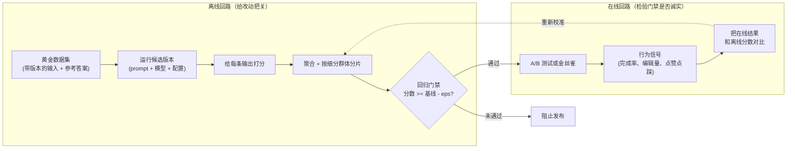

# 2. 搭出评估的骨架

## 对 LLM 的输出来说，"好"到底指什么？

在写下第一行评估代码之前，先说清楚要测的是什么。"好"几乎总能拆成好几个维度，而且它们会各自独立地退化：

- **准确性 / 有据可依（groundedness）。** 答案在事实上对不对？有没有上下文或检索到的证据支撑（有据可依，指的是每一条断言都能追溯到给定的上下文）？
- **相关性。** 答案回应的是不是用户真正问的东西？
- **有用性。** 答案除了技术上正确之外，有没有把用户往目标推进一步？
- **安全性。** 答案是否守在策略范围内（没有有害内容，没有产品不该透露的信息）？
- **效率。** 答案长度是否合适，还是塞了一堆废话？

这些不是同一个指标，而且可能朝相反方向变化。更长的回答可能更有用，但效率更低。一次模型升级可能提高了准确性，同时变得更啰嗦。只评一个维度、忽略其余，得到的是一幅误导性的图景。

## 对比：benchmark 评估 vs LLM-as-judge vs 人工评估

三者都会产出"某条模型输出的质量分"，都会挂在同一个仪表盘上，都会被随口叫作"那个评估"，这就掩盖了三种工具之间的巨大差异。它们的区别在于分数究竟测的是什么，以及背后有哪种"一致性"在撑腰。

| 维度 | Benchmark 评估 | LLM-as-judge | 人工评估 |
|---|---|---|---|
| 产出可比较的质量数字 | 是 | 是 | 是 |
| 需要定义好的任务和输入 | 是 | 是 | 是 |
| 分数测的是什么 | 在公开任务上与固定参考答案的匹配程度 | 一个模型在评分标准下对输出的看法 | 一个人在评分标准下对输出的看法 |
| 一致性结构 | 确定性的：同样的输出，每次跑都是同样的分 | 用人工标注验证（kappa）；不同轮次、不同 judge 版本之间有噪声 | 人与人之间的标注一致性；两个标注员经常意见不合 |
| 能否覆盖每一次改动 | 能，重跑很便宜 | 能，代价是 token 费用 | 不能；这是稀缺资源 |
| 典型失败方式 | 污染：训练数据里已经包含了答案 | 偏差：偏好长回答、位置偏差、偏好自己 | 不一致和疲劳；样本太小会漏掉分片上的回归 |

这些差异之所以会改变设计，是因为三者不是可以互换的分数，而是一条校准链：人类判断定义了"好"的含义；LLM judge 只有在与人工标注一致的程度上才值得信任；而 benchmark 完全在这条链之外，测的是通用能力而不是你的任务。所以，一个靠 benchmark 或者靠没验证过的 judge 来卡发布的系统，测的其实是别的东西，不是它自己的质量。

## 离线 vs 在线：两个回路，不是一个

评估系统不是单一的流水线，而是两个目的不同、都必须接上的回路。

离线回路告诉你某个候选版本*大概*更好。在线回路告诉你它在真实流量上*确实*更好。两个回路意见不合的频率比人们想象的高得多，这恰恰是两者都不可少的原因：离线拿不到任务完成率、用户编辑、会话长度、成本，也拿不到任何需要真实用户才能产生的信号。在线回路最有价值的输出，是那条回到离线回路的"重新校准"边：当两者不一致时，说明离线套件测错了东西，必须改。

## 评估系统的输入和输出

**评估系统的输入：** 一个候选版本，也就是（prompt 模板、模型标识、推理配置）这样一个三元组。换模型和改 prompt 一样都是候选版本，走同一道门禁。

**每次评估运行的输入：** 黄金数据集，一组带版本的（输入，期望输出或参考答案）对。数据集本身纳入版本控制；分数只有相对于某个固定的数据集版本才有意义。

**输出：** 一组按细分群体划分的分数，加上回归门禁的通过/不通过判定。判定是二元的：候选版本要么过了门禁，要么没过。只有分数没有判定，就不叫门禁。

## 评估系统不做什么

有两件事不在范围内，值得明说。

评估系统不是**改进**模型的手段。它只告诉你一个提议的改动是否比当前的生产系统更好。尝试不同 prompt 或微调的迭代循环在评估系统的上游；评估是退出条件，不是引擎。

评估系统也不会在拿不准的情况下取代**人类判断**。它做的是把需要人工审核的改动缩小到那些自动判定过于接近临界、难以定夺的情况。高风险或不可逆的输出（法律、医疗、受监管的场景）仍然需要一道人在环路中的门禁，Thomson Reuters 的做法就是例子。自动化负责处理体量，人负责拿主意。
