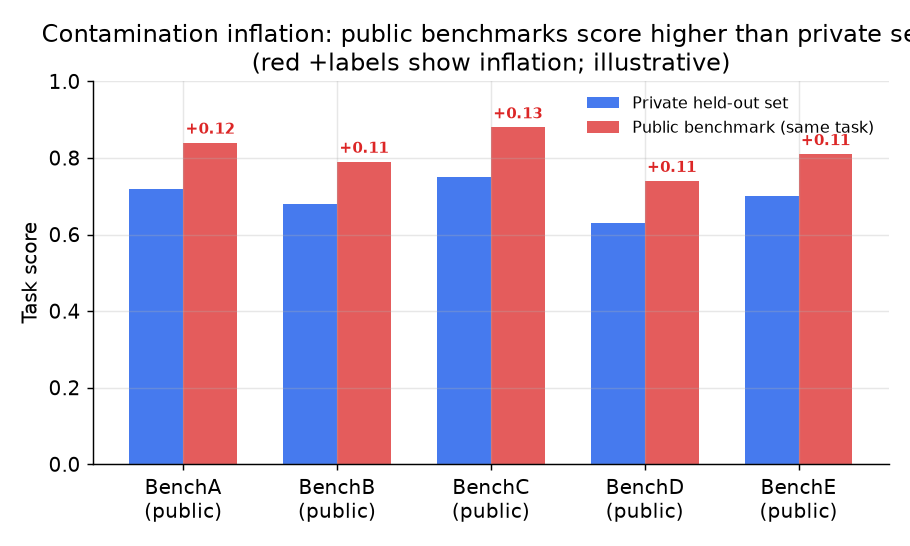
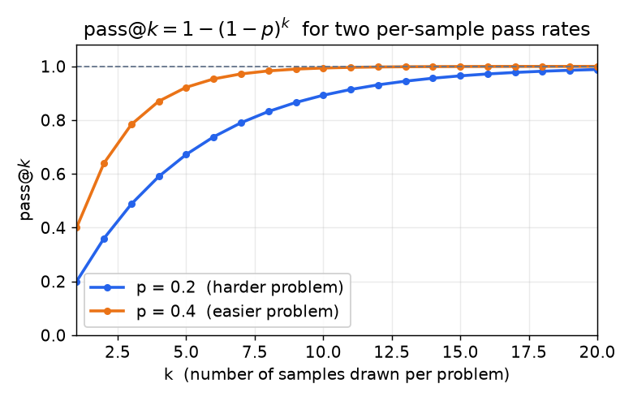

# 3. 离线评估

## 黄金数据集：一切的地基

离线评估系统建立在一组固定的、带版本的输入之上，每条输入配有期望输出或参考答案。这一步做对了，后面一切都省力；做错了，整道门禁都不可靠。

**覆盖面比数量重要。** 几百条精挑细选的用例，胜过一万条随机抽的。你需要的是常见路径（代表大部分生产流量的查询）、已知的难例（把上一个模型弄挂的样本），以及修过的每一个 bug 各留一行（回归用例，保证它不会悄悄回来）。GitHub Copilot 带着 4,000 多条用例上线；但质量门槛比数量更要紧。

**分片。** 单一的平均值会把回归藏起来。按细分群体打分：语言、文档长度、客户层级、查询类型。一个改动拉高了平均分、却把某个群体搞砸了，照样要拦下来。GitLab 每天跨几十个用例场景跑回归，就是为了不让任何一个群体悄悄掉队。

**版本化。** 数据集放进源码仓库。数据集第 3 版上的分数和第 4 版上的分数不可比，除非两者有受控的重叠。一次 prompt 改动如果顺便往黄金集里加了十条新用例，那门禁必须基于一个固定快照来跑，而不是基于更新后的集合。

**留一块 held-out。** 如果拿完整的评估集调 prompt，就会开始拟合它。留一部分在开发期间绝对不看。这就是"测量"和"表演式优化"的分界线。

**定期更新。** 真实流量会漂移。一季度建的黄金集，到三季度可能已经覆盖不了新出现的查询模式。定期从生产流量里抽样、标注、合并新行。Booking.com 就盯着这种漂移，把黄金集的新鲜度当作系统健康信号来看。

## 标签从哪来

黄金数据集的可信度取决于里面的标签，而每个标签的来源决定了它的偏差。对评估系统来说，标签就是参考输出或者正确性判定；下面是每一类的来源。

| 来源 | 能给你什么 | 偏差 / 成本 |
| --- | --- | --- |
| 隐式生产信号（点赞点踩、接受/拒绝、下游任务是否成功） | 量大，而且把评估锚在真实结果上而不是代理指标上 | 受当前模型和自选用户的影响；被拒绝的答案可能是对的，只是不讨喜 |
| 人工标注 / 专家标签（黄金参考答案、偏好对、安全标签） | 质量高；所有自动指标校准时的锚点 | 量少、贵、慢；标注员之间有分歧，所以要公布标注一致性并做仲裁 |
| 合成 / 模型生成（用更强的模型当 judge 或生成参考答案、增广用例） | 能规模化覆盖稀有分片和对抗用例 | 会传播生成器的偏差，还有 judge 循环论证的风险，所以必须过同样的质量和去重关卡，并且校准到人工标签 |

一条凌驾于以上三者之上的规则：评估数据绝不能泄漏进训练集，或者泄漏进系统能看到的检索索引；否则分数测的是记忆，指标就是在撒谎。要把黄金集对训练数据做去污染，并且留一块永远不拿来调参的 held-out。

## 公开 benchmark：能力信号，不是质量门禁

公开 benchmark 只有一个用途：在投入任务专属评估之前，按基础能力筛一遍候选模型。它们不是你自己那个功能的质量门禁。

**说得出当前的格局，而不是已经饱和的那些。** 经典的多选题套件（MMLU、HumanEval、TruthfulQA）已经基本饱和，所以到 2025 至 2026 年，有意义的公开 benchmark 更难、也更偏 agent。要认识这几个家族：推理与知识（GPQA Diamond、MMLU-Pro、SciCode）；真实软件工程（SWE-bench，特别是 SWE-bench Verified，那个经人工验证、筛到只剩确实可解任务的 500 题子集，也是前沿实验室报告的数字）；使用工具的 agent（tau-bench，或写作 $\tau$-bench，覆盖航空和零售工作流）；以及有经济价值的知识型工作（GDPval）。因为没有哪个 benchmark 能单独刻画"智能"，独立聚合机构现在会发布一个**综合指数**，同时由许多 benchmark 构成，最有名的是 [Artificial Analysis Intelligence Index](https://artificialanalysis.ai/)，它还画出了系统设计者真正关心的两组权衡：质量 vs 每 token 价格（token 是模型读取和计费的文本单位，大约几个字符），以及质量 vs 输出速度。他们的报告方式里有三点值得借鉴：

- **跨多个评估的综合指数**比任何单一 benchmark 都稳健，因为刷高一个评估几乎撼动不了总分。
- **服务是提供商的选择，不只是模型的选择。** 同一个开放权重模型，在不同托管提供商那里每秒输出 token 数和价格能差好几倍；独立追踪机构按提供商报告中位数（比如滚动窗口内的 P50），比较服务方案时应该引用这个数字（见 [大规模 LLM 推理服务](../inference-serving/) 和 [成本优化与模型路由](../cost-optimization/) 两章）。
- **报区间，不报点。** benchmark 分数带有采样噪声；两个重叠的 95% 置信区间（在给定样本下真实分数合理落入的范围）之内 1 分的差距，不是真实差距。要把区间说出来。

把这些当作粗粒度的能力筛子和实时数字的参考；然后跑自己的任务专属评估，因为公开数字永远不该给你的功能把关。

自己跑这些 benchmark 本身就是一条流水线，而且它自己也是一个常见的面试话题（"讲讲你怎么在一个 benchmark 上评估一个模型"）。让同一个 benchmark 两次运行结果不一致的协议细节、污染检测、给模型评分器做认证、以及判断差距是否真实的统计方法，都在 [给模型做 Benchmark](../benchmark-eval/) 那一章。

原因在于污染（benchmark 题目或它们的近似副本泄漏进了模型的训练数据）。如果评估用例或近似重复的内容混进了模型的训练数据，它在公开 benchmark 上的分数看起来虚高，到了生产环境面对真实用户查询却掉链子。这种虚高是系统性的、看不见的：光看 benchmark 分数发现不了它。



*同一任务上，公开 benchmark 分数相对私有 held-out 集会虚高。差距就是污染溢价。数值仅作示意；真实差距因模型和 benchmark 而异，跨度很大。*

Thomson Reuters 只把公开 benchmark 当作三级门禁里粗粒度的第一道筛子，之后再做任务专属的半自动评估和人工签字，然后才允许部署。benchmark 筛子又便宜又快，但它不是标准。

## 能力评估 vs 安全评估

这是两个不同的评估问题，通常用不同的数据集、不同的指标、不同的门禁阈值。

**能力评估**问的是：模型有没有把任务做对？指标随任务而定：抽取任务用精确匹配，问答用 F1（F1 是精确率和召回率的调和平均，只有两者都高时才高），代码生成用测试通过率，搜索用相关性分数。

```python
def f1(precision, recall):                 # precision and recall, each in [0, 1]
    if precision + recall == 0:            # model got nothing right -> avoid divide-by-zero
        return 0.0
    return 2 * precision * recall / (precision + recall)   # harmonic mean punishes a lopsided pair
# f1(precision=0.6, recall=1.0) -> ~0.75, sitting below the 0.8 arithmetic mean
```

**安全评估**问的是：模型有没有守在策略范围内？指标通常是二元的（拒绝/照做、违规/干净），跑在一组对抗性或边界 prompt 上：越狱尝试、策略边界用例、敏感查询类别。安全性的回归应该拦下发布，哪怕能力分数提高了。

两者必须分开把关。一个更有能力但更不安全的模型，对生产环境来说不是更好的模型；只按能力把关会把它放过去。

## 任务指标：只要任务允许就用它

只要答案可核对，就用任务指标。它便宜、确定、不会被表面模式骗过。功夫在于把任务重新表述，让它暴露出一个可核对的信号：

- 代码生成任务变成"单元测试有没有通过"，而不是"答案看起来像不像好代码"。
- SQL 生成任务变成"查询在测试数据库上有没有返回正确的行"。
- 抽取任务变成"抽出的字段和标注字段是否完全一致"。
- 信息检索任务变成对标注相关文档的 recall@k 和 precision@k。

GitHub Copilot 的"坏掉的仓库"套件利用的正是这一点：他们故意破坏大约 100 个 CI 本来通过的容器化仓库，然后检查候选模型能不能修好。指标是单元测试通过率，不是 judge 的主观打分。一个骗不了的任务指标，胜过一个你还得去校准的 LLM-as-judge。

**pass@k 怎么算。** 只采一个样本会低估模型的编码能力，因为随机生成有时会失败，哪怕模型"知道"答案。标准做法是每道题独立采 $k$ 个样本，只要至少有一个通过就算这题解出来了：

$$\text{pass@}k = 1 - (1-p)^k$$

其中 $p$ 是单个样本的通过概率（实践中从一批 $n \ge k$ 个样本里不放回地估计；上面这个 i.i.d. 形式是闭式近似）。随着 $k$ 增大，哪怕单样本通过率很低，最终也会给出一个正确解。

HumanEval 的框架并不直接代入 $\hat p = c/n$（那样有偏），而是用无偏的组合估计量：抽了 $n$ 个样本，其中 $c$ 个通过：

```python
from math import comb
def pass_at_k(n, c, k):    # n samples drawn, c correct, budget k
    if n - c < k:          # fewer than k failures -> any k-subset contains a pass
        return 1.0
    return 1.0 - comb(n - c, k) / comb(n, k)   # 1 - P(all k sampled solutions fail)
# unbiased estimate of 1 - (1-p)^k; e.g. pass_at_k(n=200, c=40, k=10)
```



*pass@k 随采样预算的变化：单样本通过率 p = 0.2 时，采 10 个样本得到 pass@10 = 1 - 0.8^10 = 0.89；p = 0.4 时同样 10 个样本得到 0.99。这个指标奖励的是偶尔能答对的模型；k = 1 的精确匹配会把两者都漏掉。仅作示意。*

## 离线评估：什么时候用哪种

| 选用 | 何时 | 而不是 |
|---|---|---|
| 任务指标（精确匹配、F1、通过-失败） | 答案可核对：可抽取的字段、可执行的代码、可检索的文档 | 一个还得去校准和维护的 LLM judge |
| 公开 benchmark | 选基座模型时的第一道能力筛子 | 给你特定功能把关的质量门禁，污染会让分数失真 |
| 私有黄金集 + 任务指标 | 可核对任务（代码、抽取、SQL）的持续回归门禁 | 公开 benchmark，对抗性训练出来的模型能刷它 |
| 私有黄金集 + LLM-as-judge | 开放式输出（摘要、对话、解释）的回归门禁 | 完全不测，或者用一个把分片回归藏起来的单一平均值 |
| held-out 分片，不做调参 | 模型升级前诚实的最终评估 | 用来迭代 prompt 的那个集合，你可能已经过拟合了它 |
| 安全数据集 + 二元门禁 | 任何可能影响策略合规的改动 | 忽略安全维度的单一能力指标 |

**出处。** 开放式输出的 LLM-as-judge 门禁跑在 Ragas（开源）这类框架上；公开 benchmark 和 pass@k 路径的来源已经在正文里标出：lm-evaluation-harness（EleutherAI）、HumanEval 和 SWE-bench。这些是评估工具而不是基础模型方法，所以不涉及架构归属。

**各种方法用什么工具。** 公开 benchmark 和 pass@k 任务指标跑在 lm-evaluation-harness（EleutherAI）以及 SWE-bench 和 HumanEval 的框架上；代码任务在沙箱容器里执行候选解，跑仓库自带的测试。私有黄金集在源码仓库里做版本管理，用 OpenAI Evals、Promptfoo 或者自写的 Vitest 风格套件来打分，数据集和代码一起提交。开放式输出上的 LLM-as-judge 门禁由 Ragas、DeepEval 和 Arize Phoenix 提供，它们还会保存按分片的结果，这样单一平均值就藏不住某个群体的回归。跨数据集版本的实验追踪放在 MLflow 或 Weights and Biases 里。

**一个完整的例子。** 某家做编码助手的公司把每次模型改动都卡在私有黄金集上，而不是公开榜单，因为公开 benchmark 可能被污染，对抗性训练出来的模型也能刷它。既然输出可核对，他们就把每条用例表述成一次单元测试通过与否，报告 pass@k，而不是搭一个还得校准和维护的 LLM judge。对于自然语言解释这个分片，答案是开放式的，他们加了一道 LLM-as-judge 门禁，并按细分群体打分，这样平均分的提升就藏不住某种语言或某个文档长度桶上的回归。他们留了一块永远不拿来调参的 held-out 分片，用于升级前诚实的最终检查；还单独跑一道二元安全门禁，这样一个能力更强但更不安全的候选版本照样会被拦下。公开 benchmark 只在选基座模型时作为粗粒度的第一道筛子留在流程里。

## 实现和训练中的坑

离线门禁的可信度取决于底下那个数据集。反复出现的失败是：一个好得可疑的数字，最后发现是污染或过拟合；一个把某个分片崩盘藏起来的平均值；以及一个给表面特征打分而不是给质量打分的 judge。

| 问题 | 症状 | 修法 |
|---|---|---|
| benchmark 污染 | 公开分数看起来虚高，真实用户查询上模型掉链子 | 用私有 held-out 集把关，并把黄金集对训练数据做去污染 |
| 在评估集上调参 | 离线数字往上爬，泛化却没有 | 留一块开发期间绝不看的 held-out 分片 |
| 平均值藏住了分片回归 | 总分上升，某个群体却崩了 | 按分片打分（语言、长度、层级），任何群体回归都拦下 |
| 黄金集漂移 | 陈旧的集合漏掉了后来出现的查询模式 | 定期从生产流量抽样、标注、合并新行 |
| 数据集没版本化 | 各次运行的分数不可比 | 把数据集放进源码仓库做版本管理，改动基于固定快照把关 |
| k=1 时 pass@k 被低估 | 有能力的模型因为随机失误被判为失败 | 采 k 个样本，用无偏的 pass@k 估计量 |
| 黄金集里的标签错误 | 可测准确率被封了顶，还产生假回归 | 审核并修正错标的行，并为修过的每个 bug 留一条回归用例 |
| judge 偏差（位置、长度、偏好自己） | LLM judge 的分数跟着长度或选项顺序走，而不是质量 | 随机化选项顺序，用人工标签校准，只要答案可核对就优先用任务指标 |

贯穿始终的一条线：一个好得可疑的离线分数，在证明清白之前就当它是污染或过拟合；在 held-out、版本化、按分片的基础上把两者都排除之前，别信这个数字。
