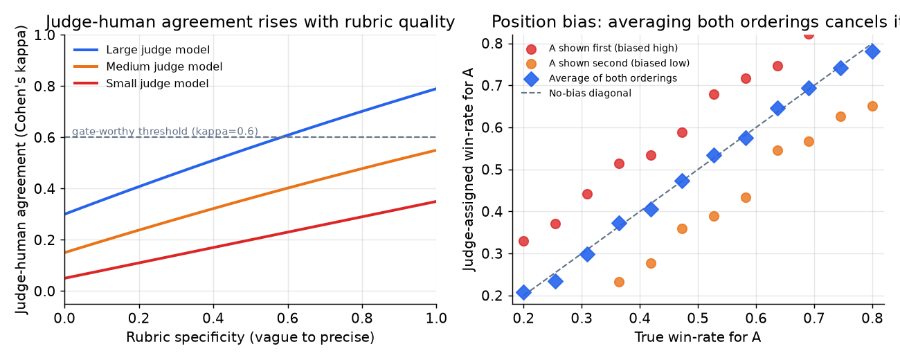

# 4. LLM-as-judge

当输出是真正开放式的、没有任务指标可用时，就让一个能力足够强的模型按照评分标准（rubric）给输出打分或做比较。这就是 LLM-as-judge。它能扩展到成千上万条样本，人工标注做不到这一点。但它有一些尖锐的、文献里记载得很清楚的失败模式，在拿它卡任何发布之前，必须先说出来并处理掉。

## Pairwise vs pointwise

两种基本模式，可靠性不同。

**Pointwise（绝对打分）。** judge 收到一条输出，按一个量表打分（1 到 10 分，或者某个 rubric 维度）。实现简单，但分数会挤在中间，而且绝对值很难解释。一个 judge 在一份 rubric 下打的 7 分，和另一个 judge 或另一版 rubric 下的 7 分，放在一起毫无意义。

**Pairwise（比较打分）。** judge 收到两条输出 A 和 B，选出赢家，或者给出偏好强度。比绝对打分更可靠，因为无论对人还是对模型，相对判断都更容易。风险是位置偏差：judge 偏爱先展示的那条答案（有时是后展示的那条）。

实践中：人类偏好评估、以及候选版本和生产基线之间的主要质量比较，用 pairwise。需要按维度拆分（准确性、有用性、有据可依）而不只是要一个赢家时，用带清晰 rubric 的 pointwise。避免用没验证过的 1 到 10 分量表。

pairwise 更可靠的原因是机制性的：pointwise 分数没有固定锚点，judge 每次都在临时发明一把尺子，它对"7 分是什么意思"的理解会随样本和 rubric 版本漂移；而 pairwise 判定只需要偏好的正负号稳定，这对模型和对人类标注员一样，是容易得多的判断。这个话题的经典文献是 Zheng 等人（2023）的 Judging LLM-as-a-Judge with MT-Bench and Chatbot Arena，它证实了一个强 judge 与人类标注员的一致性可以达到两个人之间的一致性水平，也正是它命名了下一节要处理的位置偏差、长度偏差和自我偏好偏差。

## 偏差类型：judge 会怎么坏

文献里有四种记载充分的偏差。资深的回答会不等提示就把它们说出来。

**位置偏差。** pairwise 比较中，judge 给先展示的答案更高的胜率。偏差的大小随模型和 rubric 而异，但一直都能测出来。修法：两种顺序都跑一遍，取两个分数的平均。

$$s(A,B) = \tfrac{1}{2}\bigl[ j(A \prec B) + \bigl(1 - j(B \prec A)\bigr) \bigr]$$

其中 $j(A \prec B)$ 是 A 先展示时 judge 判 A 赢的概率。取平均可以抵消固定的位置偏好。



*左图：judge 与人类的一致性（Cohen's kappa）随 rubric 的具体程度和 judge 模型的能力上升。虚线标出 kappa = 0.6，这是把 judge 当门禁来信任的常用阈值。右图：位置偏差把先展示答案的胜率估计往上推，后展示时往下压。两种顺序取平均可以恢复无偏估计。仅作示意。*

**长度偏差。** judge 会奖励更长、听起来更自信的答案，哪怕它们并不更好。对着一个有长度偏差的 judge 拼命优化 prompt，产出的就是 judge 喜欢、用户不喜欢的注水输出。修法：在 rubric 里明确要求惩罚注水，或者在打分 prompt 里显式控制长度。怀疑有长度偏差时，用在线行为指标（用户编辑率、任务完成率）来当裁判。

**自我偏好偏差。** judge 模型倾向于偏爱同一模型家族的输出。GPT 家族的 judge 会略微偏向 GPT 家族的输出；Claude 家族的 judge 会偏向 Claude 家族的输出。修法：条件允许的话，judge 用和被评估模型不同的家族。在自己的具体场景里，拿人工标签测一下跨家族一致性，把这个效应量化。

**校准偏移（judge 漂移）。** judge 是一个托管的模型，托管模型可能不打招呼就变了。如果 judge 的 prompt 或模型版本悄悄变了，昨天的分数和今天的就不再可比。修法：钉住 judge 的模型版本，给 judge prompt 做版本管理，并按计划对一个固定的校准集重新打分，以发现漂移。

## 校准 judge：Cohen's kappa

LLM judge 是一台测量仪器。没校准的仪器会撒谎。在拿 judge 卡任何东西之前，先测它和人工标签的一致性，并把一致率报出来。

**Cohen's kappa** 把仅凭标签边缘分布就会碰巧出现的一致性考虑了进去：

$$\kappa = \frac{p_o - p_e}{1 - p_e}$$

其中 $p_o$ 是 judge 与人工标签之间观测到的一致比例，$p_e$ 是在给定标签边缘分布下碰巧一致的期望比例。接近 0 表示 judge 在瞎猜；接近 1 表示几乎完全一致。一般来说 kappa 过了某条线，judge 就可以用来把关（Pinterest 报告的对应指标是：微调过的相关性 judge 在 5 级量表上 73.7% 的精确匹配率）。

```python
def cohens_kappa(judge, human):       # paired categorical labels, equal length
    n = len(judge)
    po = sum(a == b for a, b in zip(judge, human)) / n     # observed agreement fraction
    labels = set(judge) | set(human)
    pe = sum((judge.count(l) / n) * (human.count(l) / n) for l in labels)  # chance agreement from marginals
    return (po - pe) / (1 - pe)       # 0 = chance level, 1 = perfect agreement
# cohens_kappa(['a','a','b','b'], ['a','b','b','b']) -> 0.5  (po=0.75, pe=0.5)
```

如果 kappa 低于阈值，先修 rubric。不要为了迁就一台坏仪器去放宽门禁容差；要修的是仪器。kappa 低意味着 judge 测的东西和人类在乎的东西不是一回事，拿它把关只会带来虚假的信心。

## kappa 之外：认证、集成、修正

kappa 告诉你 judge 和人类有多大比例的分歧。它并不能让你报出来的数字变得无偏，而有三种较新的做法可以补上这个缺口。三者的完整展开都在 [给模型做 Benchmark](../benchmark-eval/05-scoring-and-autoraters.md) 那一章。

**用 rubric 条目取代整体打分。** 把"给这个打 1 到 10 分"换成一份逐条的标准清单，每条几乎是二元的、各带一个权重，让 judge 一条一条地判。模型和人类在小的、可核对的断言上一致性远高于整体评分，而且 rubric 是一个可以版本化、可以交给领域专家的产物。OpenAI 的 HealthBench 是参考设计：每段对话配有医生撰写的标准，评分器本身还经过专家的元评估（[HealthBench](https://arxiv.org/abs/2505.08775)）。

**信任 judge 之前先探测它会不会被刷。** 把退化的输入喂给 rubric：空答案、固定不变的答案、注水的答案、以及包含针对 judge 的指令的答案。任何一个得了高分都是阻断级缺陷；已有研究表明，输出恒定的"空模型"能在自动 judge 面前赢下不可忽视的比例。专门针对 judge 的 benchmark 也是因此而存在：在那些客观可核对、但错误答案听起来更好的题目对上，强通用模型只是平庸的 judge（[JudgeBench](https://arxiv.org/abs/2410.12784)）。

**用统计方法修正残余偏差，而不是假装它不存在。** 让便宜的 judge 跑完全部 $N$ 条样本，在一小部分 $n$ 条上保留人工标签，然后做校正：

$$\hat\theta_{\text{PPI}} = \frac{1}{N}\sum_{i=1}^{N} f(X_i) + \frac{1}{n}\sum_{j=1}^{n}\bigl(Y_j - f(X_j)\bigr)$$

其中 $f$ 是 judge 分数，$Y$ 是人工标签。第二项是对 judge 系统性误差的无偏估计，所以无论 judge 偏得多厉害，结果都是无偏的；更好的 judge 换来的是更窄的区间，而不是不同的答案（[Stratified Prediction-Powered Inference](https://arxiv.org/abs/2406.04291)、[How to Correctly Report LLM-as-a-Judge Evaluations](https://arxiv.org/abs/2511.21140)）。实际效果是，问题从"我们标得起全部数据吗"变成了"多少条标签能买到可接受的区间"，而后者是一个可以写进计划里的规模估算。

## Pairwise vs pointwise：什么时候用哪种

| 选用 | 何时 | 而不是 |
|---|---|---|
| Pairwise（A vs B） | 候选版本和生产版本之间的主要质量比较；人类偏好研究 | 绝对打分，分数挤在中间、难以解释 |
| 带分维度 rubric 的 pointwise | 需要在多个维度（准确性、有用性、语气）上分别打分 | 单一数字的 pairwise 结果，看不出是哪个维度变了 |
| 位置偏差平均（两种顺序） | 任何顺序可能泄漏的 pairwise 比较 | 单一顺序的 judge 分数，把先手偏好烙了进去 |
| 验证过的 judge（kappa 过线） | 拿 judge 的判定卡任何发布 | 没校准的 judge，可能在奖励长度或自我偏好而不是质量 |
| 用不同模型家族当 judge | 评估某个特定模型家族的输出 | 同家族当 judge，会偏向自己 |
| 用任务指标代替 judge | 答案可核对（代码通过测试、字段匹配标签） | 一个要无限期校准和维护下去的 judge |

**出处。** 这里的评判框架包括 Ragas（开源）。pairwise 偏好评判、位置偏差的顺序交换、以及 Cohen's kappa 一致性都是标准的评估方法学技术，而不是基础模型方法，所以不涉及架构归属。

**各种方法用什么工具。** pairwise 和 pointwise 评判、位置偏差的顺序交换、以及分维度 rubric，Ragas、DeepEval、Arize Phoenix 和 Promptfoo 都打包好了，每一个都允许钉住 judge 模型并给 judge prompt 做版本管理。LangSmith 和 Arize Phoenix 把 judge 判定和 trace 存在一起，这样可以按计划对校准集重新打分来发现 judge 漂移。Cohen's kappa 和对人工标签的一致性统计来自 scikit-learn，或者在配对标签上自己写几行代码。对未变化的输出对缓存 judge 结果是这些框架的大多数都有的功能，能把单次调用的预算控制住。

**一个完整的例子。** 一个企业 RAG 团队要给摘要质量把关，他们在候选版本和生产基线之间用 pairwise 的 A vs B，而不是绝对的 1 到 10 分量表，因为相对判断更可靠，也不会挤在中间。他们两种顺序都跑然后取平均来抵消位置偏差，judge 选的是和摘要模型不同的模型家族，以避免自我偏好偏差。在把判定当门禁信任之前，他们在一份人工标注的样本上测 Cohen's kappa，不过线就修 rubric 直到过线，而不是放宽门禁容差。当他们还需要准确性 vs 语气的分维度拆解时，就在这些轴上加一个 pointwise rubric；而对任何答案可核对的分片，比如引用的数字是否与来源一致，他们干脆丢掉 judge，改用一个永远不需要校准的任务指标。

## judge 不是免费的基础设施

每一条被评判的样本都是一次模型调用。一个一千行的套件，pairwise 评判两种顺序都跑，每个候选版本大约就是两千次 judge 调用。在高频改 prompt 的节奏下（每天都有改动，几十个工程师），这种开销会不停地重复。要有意识地给 judge 定规模：用更小、验证过、更便宜的 judge 模型，而不是最贵的那个；对未变化的输出对缓存 judge 结果，同一个（prompt 版本、输出、judge 版本）三元组不重复打分；本地迭代时跑一个小的冒烟子集，只在门禁处跑完整套件。judge 的单次调用成本乘以频率再乘以套件规模，是一笔实实在在的预算。
