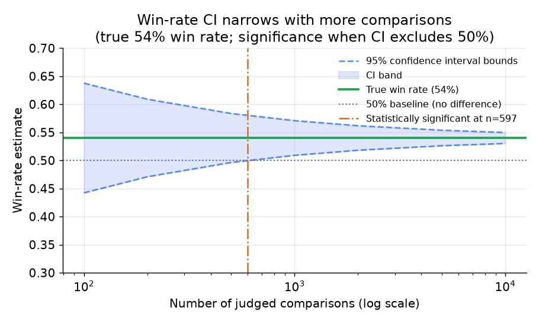

# 5. 在线评估

离线评估告诉你某个候选版本大概更好。在线评估告诉你它在真实用户流量上到底是不是更好。两者不一致的次数比大多数人预想的多。离线看不到任务有没有完成、用户有没有改输出、会话是接着聊下去还是就此结束、以及成本。这些信号只在线上存在。

## A/B 测试

标准的在线评估办法：把一小片线上流量导给候选系统，其余留给对照组（当前的生产版本），然后测那些真正重要的结果指标。

**测什么：** 能反映真实用户价值的行为信号。对一个 LLM 助手来说包括：任务完成率（用户拿到他要的东西了吗？）、输出编辑率（用户是不是还得自己动手改？）、点赞点踩或其他显式反馈、"你答错了"这类追问、会话长度、回访率。这些正是离线在结构上看不见的信号。

**哪些要当护栏盯着：** 延迟（中位数和长尾）、每请求成本、拒答率、错误率。一个提升了质量但把延迟翻倍、成本翻三倍的候选版本，哪怕质量信号是真的，净收益也未必为正。Spotify 明确会把会话长度、崩溃率和留存率跟目标质量指标一起看。

**统计功效。** 偏好度量本质上是一个比例。样本量 $n$ 下胜率 $p$ 的 95% 置信区间是：

$$\hat{p} \pm 1.96 \sqrt{\frac{p(1-p)}{n}}$$

区间要不含 0.5，才能宣称赢得显著。真实胜率是 54% 时，要在 95% 置信度下检出这个效应，大约需要 2,400 次比较。效应更小就要更大的样本。这正是 Spotify 那套漏斗策略的理由：先用便宜的离线评估把弱候选筛掉，A/B 的名额就只留给本来就大概率会赢的候选，A/B 的命中率随之提高。

*54% 胜率周围的 95% 置信区间随样本量增大而收窄。要显著，置信区间下界必须越过 50%。n 很小的时候，即便效应真实存在，区间也会把 50% 包进去。仅作示意。*

## 人类偏好评估

对高风险或受监管的输出，人类专家 A/B 才是最终裁决者。两位评审（或一个评审小组）在给定的量表上对比生产版本和候选版本的输出。Thomson Reuters 在任何法律类输出上线前，都以领域专家评分作为最终放行依据。人工放行既慢又贵，撑不起每天都改 prompt 的节奏；把它留给模型升级、重大能力变更或受监管的领域。

## 把回归门禁焊进发布路径

一个靠人想起来才手动跑一遍的评估，不叫门禁。得把它接进流程。

**把门禁当测试套件对待。** 只要 prompt、模型标识或推理配置有任何改动，离线套件就自动跑一遍，就像改了代码会自动跑单元测试一样。换模型是一次带版本的产物变更，同样要过这道门禁，因为"平替一个更新的模型"恰恰是最容易悄悄让某一种语言或某一档客户变差的那类改动。

**按分片卡，而不只是卡平均值。** 分片门禁的不等式是：

$$\text{ship} \iff \min_{g \in \text{segments}} \bigl( s_g^{\text{cand}} - s_g^{\text{base}} \bigr) \ge -\epsilon$$

其中 $s_g$ 是分片 $g$ 上的分数，$\epsilon$ 是容差。只有当没有任何一个分片跌破基线 $\epsilon$ 时，候选版本才能发布。要卡最差的那个分片。一个抬高了平均分却把某一种语言打穿的改动，照样拦下来。

**容差要从实测的 judge 方差来定，不能靠猜。** 如果你拍脑袋定了 2% 的容差，而 judge 实测的噪声是 4%，那这道门禁会在每次构建上反复横跳。测一下 judge 在相同输入上的分数方差，然后取 $\epsilon \sim \sigma_{\text{judge}}$。

**全量之前先金丝雀。** 就算离线门禁过了，也先发到金丝雀（内部用户，或一小部分流量），让在线回路确认过再全量。GitHub 会先把新模型发给内部 Hubbers 跑一段金丝雀再进生产；Ramp 会让新的 agent 动作先在真实流量上以影子模式运行，之后才对用户开放。

## 离线与在线的反馈闭环

在线回路产出的最有价值的东西，是对离线回路的一次校准检查。如果离线赢了的候选版本在线上输了，那说明离线套件测的根本不是该测的东西。

一旦发现离线和在线的差距很大，正确的反应是回头校准套件：把在线 A/B 暴露出来的真实失败模式补成用例，把 judge 的 rubric 调整到跟用户实际扣分的点对齐，或者补上一个此前根本没打分的维度。长期目标是让离线门禁成为在线结果的可靠预测器，这样大部分改动靠便宜的离线门禁就能发出去，只有真正拿不准的那些才需要完整跑一轮 A/B。

Spotify 把这件事说得很直白："没有离线与在线的信号校准，我们的评估就只是观点，不是证据。"

## 指标矩阵：质量、成本、安全（离线 vs 在线）

发布决策不是一个数字。它落在三条轴上（质量、成本、安全），每条轴都有一个上线前就能测的离线代理指标，和一个要在真实流量上确认的在线信号。按列读这张表，能看清上线前的门禁能看见什么、看不见什么；按行读，能看清一次改动是在拿哪条轴换哪条轴。

| 轴 | 离线 | 在线 |
| --- | --- | --- |
| 质量 | 黄金集上的任务指标（精确匹配、F1、pass@k），在带版本的留出集上按分片算的 LLM-as-judge 分数 | 任务完成率、输出编辑率、点赞点踩、"你答错了"这类追问、人类专家 A/B |
| 成本 | 离线套件上每请求的 token 数和每条用例的估算成本 | 生产环境的每请求成本、长尾延迟、真实负载下的吞吐 |
| 安全 | 在对抗集和边界用例集上的二元合规率（拒答 vs 照做） | 线上观测到的拒答率、错误率和安全事故率 |

一个质量分很高但太贵或不安全的系统是发不出去的，所以卡发布的是三条轴，不只是质量。

## 什么时候用哪种在线手段

| 选用 | 何时 | 而不是 |
|---|---|---|
| 在线 A/B 测试 | 有线上流量可以切分，且想要一个行为层面的真值（Spotify、Pinterest） | 把离线分数当成用户价值的证明 |
| 影子模式 | 这个动作必须静默运行、不能对用户造成风险，先评质量再开放（Ramp） | 在还不能把输出暴露出去的时候直接上 A/B |
| 内部金丝雀（dogfood） | 爆炸半径很大，或者需要一批真实使用模式的安全人群先跑一轮再铺开（GitHub Hubbers） | 从离线通过直接跳到全量生产 |
| 人类专家 A/B | 输出受监管、不可撤销，或者风险高到必须有人来裁决（Thomson Reuters） | 对不可逆或有法律敏感性的输出，只靠自动门禁 |
| 护栏跟踪（延迟、成本、拒答） | 每一次在线评估，都要跟目标指标一起看 | 只看目标指标，从而漏掉那些赢了质量、输了成本的情况 |

**出处。** 这些都是标准的在线实验技术，表里附上了在生产环境用它们的团队（Spotify、Pinterest、Ramp、GitHub、Thomson Reuters）；没有一项属于基础模型方法，所以不涉及架构归属。

**各种方法用什么工具。** A/B 和金丝雀的流量切分跑在 feature flag 与实验平台上，比如 GrowthBook、Statsig、Unleash、LaunchDarkly，内部 dogfood 的人群划分也走同一层。影子模式复用同一层 flag，把流量分叉给候选版本，输出只记录不展示。行为信号和护栏信号（编辑率、延迟、成本、拒答）由 LangSmith、Arize Phoenix 这类 LLM 可观测性工具采集，也可以用 Prometheus、Grafana 这类通用指标栈跑在 OpenTelemetry 的 trace 上。人类专家 A/B 的放行用 Label Studio 之类的标注工具，胜率置信区间那点数学在 statsmodels 或 scipy 上写几行就够了。

**一个完整的例子。** 一个流量稳定的聊天产品要验证新模型，他们切一片流量做在线 A/B，而不是直接相信离线的胜负，因为任务完成率和编辑率只有线上才有。由于这次改动是平替换模型、爆炸半径很大，他们先发给内部金丝雀人群，在真实使用上确认行为没问题再放大，而不是从离线通过一步跳到全量生产。一个可能代表用户去执行的新自主动作，先跑影子模式，静默记录输出直到质量稳住，因为直接上线 A/B 等于把一个还没验证过的动作暴露出去。整个过程中，他们把延迟、成本、拒答这些护栏跟目标指标并排盯着，这样一个赢了质量却让成本翻倍的候选版本照样会被拦下。人类专家 A/B 则留给那些光靠自动门禁不够的受监管分片。
