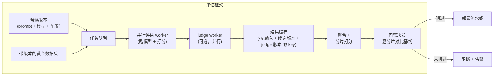

# 6. 评估框架的服务与扩展

## 评估框架是一套系统，不是一个脚本

规模小的时候，评估就是一个脚本：遍历黄金集，调模型，给每条输出打分，打印一个数字。到了生产节奏下，这套就散架了。几十个工程师每天都在改 prompt，每次改动都会触发一整轮套件运行、每一行都要调一次 judge、跟基线做一次对比、再过一遍分片门禁。评估框架于是变成了一个服务，有自己的延迟、成本和可靠性要求。

**它怎么运转。** 有两样东西喂进这套框架：一个候选版本（prompt、模型、配置）和带版本的黄金数据集，两者都落到一条共享的任务队列上。并行的评估 worker 从队列里取任务，在每条黄金输入上跑候选模型并给输出打分，开放式的那些行再交给一组可选的、并行运行的 judge worker。结果流进一个以 输入 + 候选版本 + judge 版本 为 key 的缓存，这样一个没变过的三元组直接走缓存，不必再付一次调用的钱。缓存的分数和新算的分数汇总起来，按 segment 切片，门禁再逐分片跟基线比。通过就交给部署流水线；不通过就拦下这次改动并发出告警，正是这一步让这套框架成为门禁而不是一份报告。

## 把成本控制住

每一条被评判的样本都要花掉一次模型调用加一次 judge 调用（如果两种顺序都跑来抵消位置偏差，就是两次）。一个一千行的套件、两种顺序都评，每个候选版本大约是两千次 judge 调用。按每千 token 一毛钱、每次评判几百 token 算，单次跑还是承受得起的。但一个团队一天几十个候选版本，就累起来了。

有四根杠杆能在不牺牲门禁质量的前提下降成本。

**任务本身允许的地方，一律用任务指标。** 跟一次 judge 调用比，单元测试的通过与否、字段是否精确匹配，成本约等于零。judge 只留给那些确实没有任务指标可用的维度。GitHub Copilot 那套坏仓库套件跑四千个测试，其中大部分给出的是确定性的通过或失败，只有开放式的对话质量才会走到 judge。

**对没变过的输出对缓存 judge 结果。** 如果（黄金输入、候选输出、judge prompt 版本）这个三元组跟上一轮完全一样，judge 的分数不会变。把结果缓存下来，跳过这次调用。在固定黄金集上反复迭代 prompt 的时候这招最管用：那些没有变化的早期输出根本不需要重新评判。

**给 judge 模型选对尺寸。** 对某一份具体的 rubric 来说，最贵的 judge 不一定是最准的 judge。拿几个候选 judge 模型分别测它们跟人工标签的 kappa，挑其中最便宜、又能过 kappa 阈值的那个。Uber 用的评分模型和生成模型是分开的，选组合时看的是准确率加成本。

**本地迭代跑冒烟子集，门禁处跑完整套件。** 工程师在本地改 prompt，不需要把一千行全部打完分才能看出方向。一个固定的、随机抽的五十行冒烟子集就能给出快速反馈；完整套件只在改动准备发布、走到门禁那一刻才跑。

## 并行

黄金集的各行之间互不依赖。并行跑就是了。一千行的套件串行执行、每次调用两秒，要跑三十分钟；三十路并行就是一分钟。在任何合理的套件规模下，门禁这条路径（离线套件、judge、聚合）都应该在几分钟内跑完。做不到的话，这道门禁就慢到没法焊进发布路径，工程师会绕着它走。

## 采样线上流量来做评估

在线评估不会给所有东西都打分。它按 segment（语言、query 类型、客户档次）等比例地从生产流量里采样，再把其中一部分路由给人工评审、给 judge，或者两边都送。采样比例是在测量分辨率和成本之间做取舍。采得太稀，就会漏掉那些罕见但重要的分片回归；采得太密，评估的账单会盖过推理的账单。按 segment 做分层采样（而不是均匀随机采样），能保证罕见分片依然有足够的覆盖量把指标顶起来。

## 瓶颈一览

| 瓶颈 | 最早的征兆 | 修法 | 代价 |
|---|---|---|---|
| 每次改动的 judge 成本 | 评估账单随团队规模和改动频率往上涨 | 能核对的地方用任务指标、换更小但验证过的 judge、缓存没变过的输出对 | 换之前可能得先验证那个更便宜的 judge |
| 门禁太慢 | 跑评估比 PR review 还久，工程师干脆跳过 | 把 worker 并行起来；本地用冒烟子集，门禁处跑完整套件 | 冒烟子集可能漏掉罕见回归 |
| judge 不可信 | 离线一直赢，线上一直输 | 测 kappa、修 rubric，必要时换一个 judge 家族 | 迭代 rubric 需要先收集人工标签 |
| 平均值掩盖了回归 | 某个分片悄无声息地垮掉 | 逐分片卡门禁；告警看最差分片的差值，而不是均值差值 | judge 方差大的分片上告警噪声更多 |
| 黄金集过时 | 真实流量里的 query 覆盖不到，线上意外越来越多 | 采样生产流量、标注，按固定节奏并进黄金集 | 数据集维护的开销 |
| judge 版本漂移 | 候选版本没动，分数却变了 | 钉住 judge 的模型版本；定期在固定校准集上重新打分 | 得同时跟踪两个版本号（候选版本和 judge） |
| 金丝雀规模太小 | 潜藏的分片回归一路混进全量生产 | 按预期效应量做功效分析来定金丝雀的规模 | 金丝雀越大，全量发布越晚 |

**再展开一点。** 有两行藏着统计上的微妙之处。"平均值掩盖回归"那一行是基础比率效应：如果某个分片只占 2% 的流量，哪怕它彻底崩掉，整体均值也只动了 2% 左右，这个幅度落在 judge 的正常方差之内，所以按最差分片卡门禁不是可选项，而是唯一灵敏的检验。"金丝雀太小"那一行受统计功效的约束：在固定的显著性和功效下要检出一个小效应，所需样本量大致随效应量的平方成反比增长，所以想抓住的效应减半，需要的金丝雀流量和出结论的时间大致就要翻两番。
