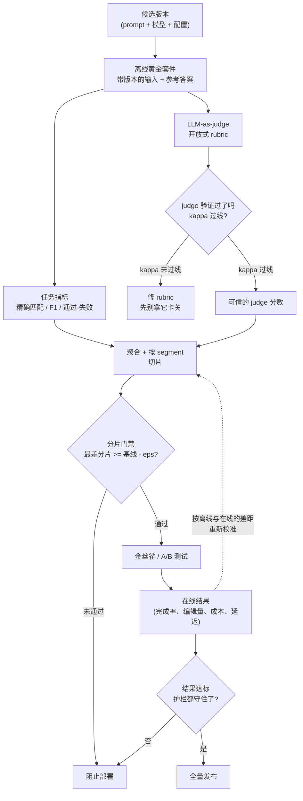

# 9. 小结

## 一页回顾

- **评估是一套双回路系统，不是一个脚本。** 离线回路把候选版本（prompt 加模型加配置）跑在带版本的黄金数据集上，给出逐分片的通过或失败结论，用来卡住改动。在线回路（A/B、影子模式或金丝雀）检验离线回路是否诚实，并反过来校准它。两个回路都是必需的，任何一个单独都不够。

- **任务本身允许的地方，一律用任务指标。** 精确匹配、F1 或者测试通过与否，这类指标便宜、确定、骗不了。judge 只留给那些真正开放的维度。GitHub Copilot 只在开放式的对话质量上才动用 judge；坏仓库那套套件产出的是确定性的单元测试通过率。

- **judge 是一台必须校准的测量仪器。** 没校准的 judge 会撒谎。在拿 LLM-as-judge 卡任何东西之前，先收集人工标签，测 judge 与人类的一致性（Cohen's kappa），一致性没过线就去修 rubric。钉住 judge 的模型版本，并定期在一个校准集上重新打分来发现漂移。位置偏差是真实存在的：两种顺序都跑，取平均把它抵消掉。

- **逐分片卡，绝不只卡平均值。** 一个抬高了均值却把某一种语言、某一档客户或某一类 query 打穿的改动，照样要拦下来。容差要从 judge 实测的噪声来定，不能靠猜。GitLab 每天按功能跑回归，GitHub 每天跟生产版本做对比，两者都在回归触达用户之前把它抓住。

- **公开 benchmark 不是你的质量门禁。** 它们测的是通用能力，而且对用公开数据训练出来的模型来说是受污染的。选基座模型时可以拿它们当粗糙的第一道能力筛子；真正的门禁要用私有的、新采样出来的黄金集。

- **离线与在线的差距就是校准信号。** 离线说候选版本赢、A/B 说它输，那就是套件测错了东西。照着线上的现实把套件重新校准。时间久了，一套校准良好的套件对 A/B 结果的预测足够可靠，大部分改动靠便宜的离线门禁就能发出去，只有拿不准的那些才需要跑完整的线上测试。

## 一页看懂整套系统

## 自测题

答案是折叠的。每道题先自己答一遍再展开。

1. 一次模型升级过了离线门禁，但线上金丝雀显示某一种语言的有用性出现了回归。这说明离线套件有什么问题，你要改什么？

   

答案

   这说明离线套件测错了东西，而**离线与在线的差距正是指出这一点的校准信号**。具体有三个候选原因，按顺序排查：黄金集里那种语言的样本太少，少到动不了任何分数；套件根本没按语言切片，回归藏在了一个上涨的均值背后；或者 judge 奖励了那个更啰嗦的新版本，而这种语言的真实用户恰恰在扣它的分。修法是重新校准套件，而不是放松门禁：把语言加成一条切片轴，把金丝雀暴露出来的真实失败模式并进黄金集，再把 judge 的 rubric 调整到给用户实际扣分的点打分。规模在这里同样重要，一个分片如果远低于大约 50 行，它上面的 judge 噪声会比容差还宽，卡不住任何东西（[10](10-putting-it-together.md)）。第 [5](05-online-eval.md) 节和第 [2](02-frame-the-eval.md) 节描述了从在线回路指回聚合环节的那条校准边；Spotify 说得很直接：没有离线与在线的校准，评估就只是观点，不是证据。

   

2. 你要评估一个摘要功能，没有参考摘要。你用什么评估方法，在把它当门禁信任之前第一件事要做什么？

   

答案

   用 **LLM-as-judge**，具体说是候选版本对生产基线的 pairwise，两种顺序都跑再取平均，因为相对判断比一把 1 到 10 的绝对量表可靠，后者分数会挤在中间，还会随 rubric 版本漂移。在此之前，先把任何可核对的子部分从 judge 的管辖范围里挪出来：如果摘要必须带上原文里的某个数字、某个日期或某个实体，就用精确匹配的任务指标去打分，它免费、确定、骗不了（[3](03-offline-eval.md)）。卡关之前要做的第一件事是**校准 judge**：在一个样本上收集人工标签，测 judge 和人类之间的 Cohen's kappa（$\kappa = (p_o - p_e)/(1 - p_e)$），过线之后才能拿它卡关，常见的线在 0.6 上下。kappa 没过线，就去修 rubric，而不是去改门禁容差，因为一台没校准的仪器给出的只是一个你没理由相信的第二意见。另外，judge 要挑一个和摘要模型不同家族的模型，避免自我偏好偏差，并且把 judge 的模型版本和 prompt 版本都钉住，这样明天的分数才和今天可比（[4](04-llm-as-judge.md)）。

   

3. 你的 pairwise judge 在 A 排在前面时判 A 赢的比例是 65%，A 排在后面时只有 55%。A 经过位置偏差修正后的胜率是多少，这个结果说明什么？

   

答案

   修正后的胜率是 **60%**：把两种顺序取平均，$(0.65 + 0.55)/2 = 0.60$，这就是第 [4](04-llm-as-judge.md) 节的顺序交换修法套在一对实测数字上。两种顺序之间 10 个点的差距就是位置偏差本身，大约 5 个点、朝着排在前面那个答案的固定偏移，取平均能抵消掉它，因为这个偏移在两次展示中是对称的。这个结果说明两件事。第一，A 确实比基线好，而不只是在 prompt 里排得靠前，因为修正后的数字仍然明显高于 50%。第二，天真的单一顺序协议会报出 65%，把提升夸大了 5 个点，而这正是第 [10](10-putting-it-together.md) 节那个可运行实验复现出来的、凭空捏造的胜利。宣布可以发布之前，先确认样本量撑得住：胜率是一个比例，它的 95% 区间必须不含 0.5（[5](05-online-eval.md)）。第 [8](08-interview-qa.md) 节还有一条提醒：取平均只对可加、对称的偏差有效，所以要跟踪交换一致性率，判定会随顺序翻转的那些样本对应记成平局，而不是半场胜利。

   

4. 有工程师提议"门禁就卡所有 segment 的平均分吧，这样简单"。失败模式是什么，怎么修？

   

答案

   失败模式是**均值会掩盖某个分片的崩塌**，而且掩盖它是算术上的必然，不是运气不好。如果某个 segment 只占 2% 的流量，它彻底崩掉也只会把整体均值挪动 2% 左右，这个幅度落在 judge 的正常方差之内，所以均值根本区分不了崩塌和噪声（[6](06-serving-and-scaling.md)）。一个抬高了平均分却把某一种语言、某一档客户或某一类 query 打穿的改动，就是这样照样发了出去。修法是卡最差的那个分片：
   $\text{ship} \iff \min_{g} (s_g^{\text{cand}} - s_g^{\text{base}}) \ge -\epsilon$，
   其中容差 $\epsilon$ 要从 judge 在相同输入上实测的分数方差来定，而不是拍脑袋（[5](05-online-eval.md)）。另有两个配套动作能让最差分片门禁真的跑得起来：黄金集的规模按你必须保护的最小分片来定，而不是按总量，因为一个薄到低于 judge 噪声底线的分片自己就会让门禁反复横跳；安全性要用它自己的二元阈值单独卡，这样一个能力更强但更不安全的候选版本照样被拦下（[3](03-offline-eval.md)）。代价是真实的但不大：方差高的 segment 上告警噪声会多一些，这正是 GitLab 和 GitHub 通过每日按功能回归和对比生产版本所接受的取舍。

   

5. 为什么每改一次 prompt 就用 pairwise judge 两种顺序跑完整的 1000 行套件会撑不下去，哪三根杠杆能在不牺牲门禁质量的前提下降成本？

   

答案

   因为这笔账是单次调用成本乘以套件规模再乘以频率，而这三项同时都很大：1,000 行做 pairwise 且两种顺序都评，大约是**每个候选版本 2,000 次 judge 调用**，按每次评判几百 token、每千 token 一毛钱算，一次门禁跑下来接近 \$80，
   而几十个工程师天天改 prompt，这个数字每天都要乘上去（[6](06-serving-and-scaling.md)、[10](10-putting-it-together.md)）。三根杠杆，按该伸手的先后顺序排。**第一，任务本身允许的地方一律用任务指标**：跟一次 judge 调用比，单元测试通过与否、字段是否精确匹配几乎免费，这也是为什么 GitHub Copilot 只在开放式对话质量上动用 judge，而坏仓库那套套件用确定性的单元测试通过率来打分。**第二，对没变过的（黄金输入、候选输出、judge prompt 版本）三元组缓存 judge 结果**，这样正在迭代的工程师只为自己这次改动真正影响到的那些行付费。**第三，本地跑 50 行的冒烟子集，完整套件只在门禁处跑**，本地一轮大约 100 次调用、\$4。同一节还有第四根杠杆，就是给 judge 选对尺寸：给几个候选 judge 分别测 kappa，挑其中过线且最便宜的那个，Uber 挑评分模型时就是这么做的。这些做法没有一个是在降低标准，它们只是不再为那些不可能改变的测量付钱。

   

6. 你的 judge 对人工标签的 kappa 是 0.45。为了补偿这个不可靠的 judge，你把门禁容差设成了 5%。这个做法错在哪？

   

答案

   你是在用把门禁弄瞎的方式去补偿一台坏掉的仪器，而这恰恰是第 [4](04-llm-as-judge.md) 节告诉你千万别做的那一步：**去修 rubric，不要放宽容差**。0.45 的 kappa 低于把 judge 当门禁来信任的那条大约 0.6 的线，它意味着 judge 测的东西跟人类在乎的东西不是一回事，放宽容差并不会让它的判定变正确，只是让门禁不再对这些判定采取行动而已。5% 这个数字本身也是错的，因为容差 $\epsilon$ 本来应该从 judge 在相同输入上实测的分数方差推出来，通常是一到两个点，而不是挑一个数字来遮掩分歧（[5](05-online-eval.md)）。设成 5%，你就把门禁在两个方向上都弄钝了：任何小于 5 个点的真实分片回归现在都会悄悄发出去，而对一个小 segment 来说，那正是你原本需要抓住的绝大多数回归。正确的顺序是：把 rubric 写得更锋利、收集更多人工标签、换一个 judge 模型或家族试试、重新测 kappa，只有过线之后再从实测的 sigma 去定 $\epsilon$。在那之前，这个 judge 就不是门禁，诚实的做法是把这句话说出来，而不是躲在一个自己都不信的数字后面发布。

   

## 延伸阅读

- 压轴：[完整的方案](10-putting-it-together.md)，本章的每一个选择都在那里为具体场景拍板一次、算清成本、在另外两组约束下重建一遍，最后压缩成一个可运行的单文件 judge 实验。
- 密集参考资料（全部案例、数学、分歧图）：
  [topics/06-evaluation-system.md](../../topics/06-evaluation-system.md)。
- LLM-as-judge 综述：[Judging the Judges: Evaluating Alignment and Vulnerabilities in LLMs-as-Judges](https://arxiv.org/abs/2406.12624)。
- 经过校准的多维 rubric：[LLM-Rubric (Microsoft Research)](https://www.microsoft.com/en-us/research/publication/llm-rubric-a-multidimensional-calibrated-approach-to-automated-evaluation-of-natural-language-texts/)。
- 评估是漏斗不是岔路：[Spotify engineering blog](https://engineering.atspotify.com/2026/5/better-experiments-with-llm-evals-a-funnel-not-a-fork)。
