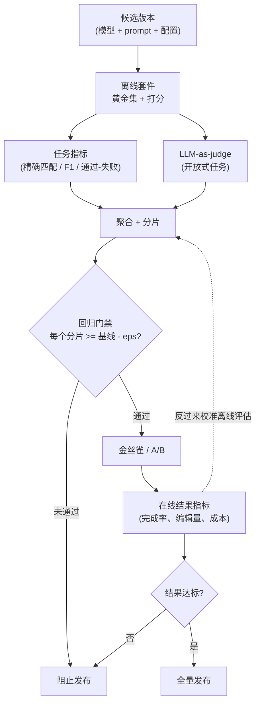

# LLM 系统评估

> 本章是英文原版的中文译本，原文见 [book/evaluation/](../../book/evaluation/)。译文和原文同步维护，发现问题请提 issue。

面试官很少会直接说"设计一个 LLM 评估系统"。他们更可能这样问：**"你上线了一个 LLM 功能。下周有个同事想改一下 prompt，顺便换成更新的模型。你怎么知道这个功能今天是好用的？又怎么防止那次改动悄悄把它弄坏？"**

这才是真正的问题。"能用啊，你看这几个例子"不算答案，那只是一种感觉。整个话题的核心，就是把模糊的"输出好不好"变成可以度量、可以重复、可以拿来卡发布的东西。本章从头到尾搭出这样一套系统，并展示 DoorDash、GitHub、Spotify、Pinterest、Thomson Reuters、Uber、GitLab、Ramp、Booking.com 等公司实际上是怎么跑的。

## 各节内容

1. [澄清需求](01-clarifying-requirements.md)：一段划定问题范围的对话，以及由此推出的两个结论。
2. [搭出评估的骨架](02-frame-the-eval.md)：离线 vs 在线；"好"到底指什么；评估系统的输入和输出。
3. [离线评估](03-offline-eval.md)：benchmark、黄金数据集、污染、能力 vs 安全；什么时候用哪种方法。
4. [LLM-as-judge](04-llm-as-judge.md)：pairwise vs pointwise、偏差类型、校准、Cohen's kappa；什么时候用哪种变体。
5. [在线评估](05-online-eval.md)：A/B 测试、人类偏好、回归门禁、发布路径；什么时候用哪种。
6. [评估框架的服务与扩展](06-serving-and-scaling.md)：成本、采样、并行、瓶颈。
7. [真实团队在生产环境里怎么做](07-how-teams-do-it-in-production.md)：真实设计在哪里分道扬镳；按公司逐一对比；一手资料链接。
8. [面试问答](08-interview-qa.md)：常被问到的、有陷阱的、以及常被答错的问题。
9. [小结](09-summary.md)：一页回顾、mermaid 图、自测题、延伸阅读。
10. [把它们拼起来：完整的方案](10-putting-it-together.md)：一套默认技术栈，把场景从头到尾搭出来并算清成本和统计功效，同一套系统在三组不同约束下的样子，以及最小可运行的 judge 实验。

## 一页看懂双回路系统

第一次读请按顺序来，各节是层层递进的。每一节都从面试官真正会问的问题开头，然后给出回答。

## 配套章节

[给模型做 Benchmark](../benchmark-eval/) 是"评估"的另一半：本章讲的是用自己的黄金集给一个*功能*卡发布，那一章讲的是在公开和内部 benchmark 上给一个*模型*算出一个站得住脚的数字。让公开数字无法复现的框架和协议细节、污染检测、autorater 认证与偏差修正、以及判断差距是否真实的统计方法，都在那边。

经典 ML 的姊妹书从另一个角度覆盖同一片地带：[experimentation](https://github.com/neurarch-ai/awesome-ml-system-design/tree/main/book/experimentation/) 讲的是本章在线那一半底下的 A/B 平台：随机化单元、统计功效与样本量、偷看问题（peeking）、以及交错实验（interleaving）。
