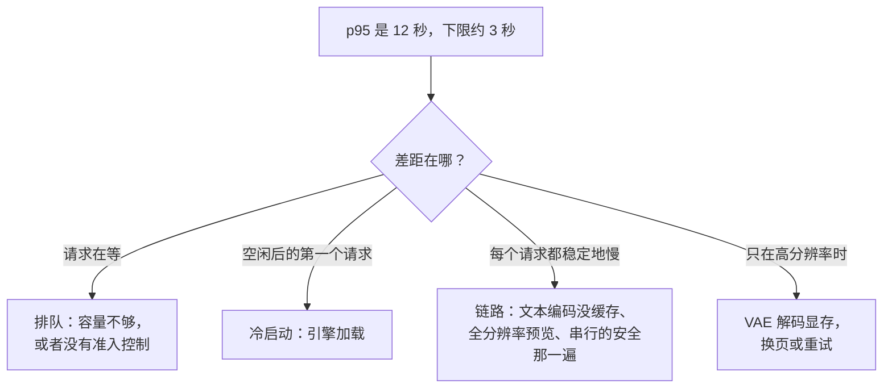

# 2. 成本模型

这一节在面试里要说出口。后面的一切都是它的注脚。

## 单位是一次前向评估，不是一个 token

扩散模型的生成方式是从噪声出发，反复跑一个去噪网络，每一遍去掉一点噪声。你真正买的就是跑了多少遍：

$$
N_{\text{FE}} = S \cdot c, \qquad c = \begin{cases} 2 & \text{有 classifier-free guidance} \\ 1 & \text{没有} \end{cases}
$$

$S$ 是采样器的步数。classifier-free guidance 每一步把网络跑两次，一次以 prompt 为条件、一次无条件，再把两个预测组合起来，把输出往 prompt 的方向推。**开了 guidance，每张图的成本就翻倍**，而相当多的候选人会把步数直接当成成本报出来。

于是一次请求的端到端延迟是：

$$
t \approx t_{\text{text}} + N_{\text{FE}} \cdot t_{\text{step}} + t_{\text{decode}} + t_{\text{safety}}
$$

四项里有三项只付一次。文本编码器每请求跑一次，输出还可以缓存。VAE 解码最后跑一次。安全分类器是第二个模型，也只跑一次。只有中间那一项被乘了起来，所以它是唯一值得先优化的一项。

## latent 才是让这件事负担得起的原因

去噪器不在像素上跑。latent 扩散模型先把图像编码成一个带下采样倍数 $f$（常见是 8）的压缩网格，所有去噪都在那里进行，最后再解码一次：

$$
\text{latent 边长} = \frac{\text{图像边长}}{f}, \qquad 1024 / 8 = 128
$$

一张 1024 乘 1024 的图是一个 128 乘 128 的 latent，位置数少了 64 倍。对卷积去噪器来说，$t_{\text{step}}$ 大致随这个 latent 的面积走。对 transformer 去噪器来说，latent 被切成 patch 当成序列处理，于是你在语言那几章已经熟悉的那套算术可以直接搬过来：

$$
\text{tokens} = \left(\frac{\text{latent 边长}}{\text{patch}}\right)^{2}, \qquad \left(\frac{128}{2}\right)^{2} = 4096
$$

而注意力对这个数量是平方的。这就是为什么 2048px 的生成不止是 1024px 的四倍。

```python
def latent_tokens(image_side, downsample=8, patch=2):
    """Sequence length a transformer denoiser sees for a square image."""
    latent = image_side // downsample
    return (latent // patch) ** 2

# latent_tokens(1024) -> 4096
# latent_tokens(2048) -> 16384   (4x the tokens, more than 4x the attention)
```

## 算一遍真实数字

拿第 1 节那套系统：1024 乘 1024、30 步、guidance 打开、四个变体。

- $N_{\text{FE}} = 30 \times 2 = 60$ 次前向评估。
- 四个变体走的是同一个循环的 batch 维度，所以一格四张的成本大致等于生成一张，而不是四张。这一条就是产品为什么要出一格图，而把一格图按四个请求计价，会算错将近四倍。
- 在当前的数据中心 GPU 上、用编译好的引擎，这 60 次评估大约两秒。加上 VAE 解码、安全那一遍和文本编码，题面里的 p95 十二秒显然不是去噪器本身造成的：别的地方出了问题，最可能是排队。

最后这个观察正是先建成本模型再优化的意义。模型告诉你下限在哪，下限和实测之间的差距告诉你该去哪里找。



## 这个模型对杠杆的说法

把延迟那个式子改写成一张"你被允许改什么"的清单，按能移动多少排序：

| 杠杆 | 改变的是 | 典型效果 |
|---|---|---|
| 采样器 | $S$ | 30 到 50 降到 20 到 30，免费，不用重训 |
| guidance 蒸馏 | $c$ 从 2 变 1 | 循环减半 |
| 步数蒸馏 | $S$ 降到个位数 | 循环上 4 倍到 15 倍 |
| 编译引擎 | $t_{\text{step}}$ | 几十个百分点，代价是冷启动 |
| 分辨率 | token 数，平方级 | 很大，而且用户看得见 |
| 一格图走一个 batch | 每个循环服务多少请求 | 四变体产品上接近 4 倍 |
| 缓存文本编码 | $t_{\text{text}}$ | 小，但在模板化 prompt 上是白捡的 |
| 预览解码 | 感知延迟 | 很大，代价是多一点解码 |

本章后面就是这张表按顺序展开：第 3 节讲采样器和蒸馏，第 4 节讲 latent 和去噪器，第 5 节讲服务侧的决定，第 6 节讲视频多出来的那个轴。
