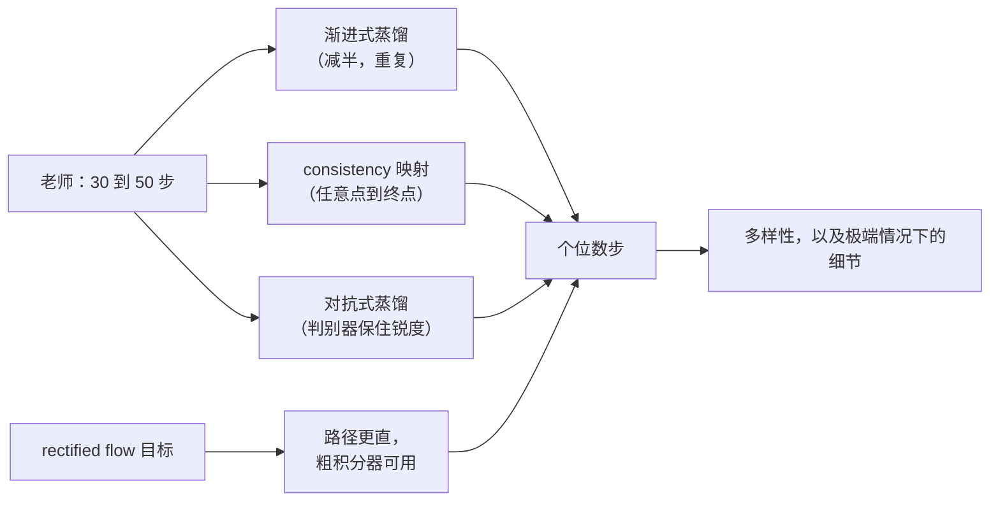

# 3. 步数与蒸馏

降低步数有两条路。一条免费，且完全不动模型。另一条要改权重，而且总要付出代价。就按这个顺序来。

## 采样器是免费的

训练时的形式化需要上千步去噪，因为它老老实实照着噪声表走。服务不必如此。把逆过程当成一个待积分的常微分方程，就可以迈更大、位置更好的步子，用少得多的评估次数到达同一条轨迹的终点。

| 采样器家族 | 典型步数 | 为什么行 |
|---|---|---|
| 照训练表走的 ancestral | 几百 | 忠实、随机，没人这么上线 |
| [DDIM](https://arxiv.org/abs/2010.02502) 及其亲戚 | 30 到 50 | 确定性、非马尔可夫，可以一致地跳步 |
| 高阶 ODE 求解器 | 20 到 30 | 同一条路径上，更少的评估放在更好的位置 |
| 蒸馏过的模型 | 1 到 8 | 减步是训进去的，见下 |

确定性比它看起来更值钱。确定性采样器加固定种子，让用户能复现一张图，也让你能在完全相同的输入上对比两个模型版本。因为调度器或算子的改动把它弄丢，会让此后每一次质量排查都变成没人能了结的争论。

## guidance 是同一个杠杆的另一半

[classifier-free guidance](https://arxiv.org/abs/2207.12598) 是让图跟着 prompt 走的东西。模型被跑两次，有条件和无条件，两个预测按一个 guidance 强度外推开：

$$
\hat\epsilon = \epsilon_{\text{uncond}} + w \cdot (\epsilon_{\text{cond}} - \epsilon_{\text{uncond}})
$$

调高 $w$ 提升 prompt 贴合度、降低多样性，再往上会让颜色饱和、细节崩掉。调低它不是成本杠杆，因为成本在于把模型跑了两次，不在这几步算术里。真正的成本杠杆是 **guidance 蒸馏**：训一个模型，它单次评估的行为就已经等价于那个组合，于是服务时 $c$ 免费地从 2 变回 1。

## 靠改权重把步数买回来

到大约二十步以下，采样器就到头了。想进个位数就得蒸馏，有四个家族值得记住名字。

| 方法 | 步数 | 想法 | 代价 |
|---|---|---|---|
| [渐进式蒸馏](https://arxiv.org/abs/2202.00512) | 每轮减半 | 学生学着一次走完老师的两步，反复做 | 要好几轮训练，低步数端质量会磨损 |
| [consistency 模型](https://arxiv.org/abs/2303.01469) | 1 到 4 | 学一个从轨迹上任意一点直接到终点的映射 | 采样多样性，以及细节 |
| [latent consistency](https://arxiv.org/abs/2310.04378) 和 [LCM-LoRA](https://arxiv.org/abs/2311.05556) | 2 到 8 | 同一件事搬到 latent 空间，并打包成 adapter | 一部分 prompt 贴合度；质量随基座而变 |
| [对抗式扩散蒸馏](https://arxiv.org/abs/2311.17042) | 1 到 4 | 加一个判别器，让单步输出仍然锐利 | 训练复杂度，以及多样性 |
| [rectified flow](https://arxiv.org/abs/2309.06380) 和 [flow matching](https://arxiv.org/abs/2210.02747) | 很少 | 把轨迹拉直，粗的积分器就够用 | 这是训练时的目标函数决定，不是服务侧的开关 |

## 要说出口的那句话

**每一种步数蒸馏都是拿多样性换速度。** 一个四步模型对同一个 prompt 产出的图像范围更窄。对一个风格固定的产品这没问题，对一个用户在探索的创作工具就是错的，而且这个损失出现在 prompt 的长尾上，不在演示集上。

由此得出的设计是路由，不是二选一：蒸馏模型出交互速度的草稿一格图，完整模型渲染用户挑中的那一张。两个模型都常驻，各跑各的循环，用户看不到接缝。

## 什么时候用哪个

| 该拿 | 什么时候 | 而不是 |
|---|---|---|
| 高阶 ODE 采样器 | 永远，在别的之前 | 直接上线训练时的步数 |
| guidance 蒸馏 | guidance 在每次评估上翻倍，而你能改权重 | 调低 guidance 强度，那会改变用户看到的东西 |
| LCM-LoRA | 这周就要在现有微调上得到少步生成 | 为了第一个结果就上一整套蒸馏工程 |
| 对抗式蒸馏 | 个位数步和锐度都要 | 只用 consistency 蒸馏，它在单步会发软 |
| rectified flow 模型 | 你本来就要选基座 | 想把现有模型改成另一个目标函数 |
| 在蒸馏与完整模型之间路由 | 产品既有草稿时刻也有定稿时刻 | 挑一个模型然后永远争论那个取舍 |

## 实现和训练里的坑

| 坑 | 现象 | 修法 |
|---|---|---|
| 蒸馏模型沿用旧的 guidance 强度 | 输出发灰或过饱和 | 为少步区间重新调 guidance，常常是调到零 |
| 用演示 prompt 做验收 | 演示很好，上线后有人抱怨 | 在更宽的集合上做配对偏好测试，含难构图和文字渲染 |
| 风格 adapter 和加速 adapter 叠加 | 风格漂移或出现伪影 | 测你真正要上线的那套 adapter 组合 |
| 假设蒸馏能跨基座迁移 | 质量随 checkpoint 而变 | 每个基座重跑一次验收 |
| 丢掉确定性 | 同一个种子两次结果不同，排查停摆 | 钉死采样器、精度和算子选择，把确定性当成一个功能 |
