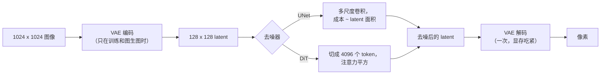

# 4. latent 与去噪器

一次前向评估到底花多少钱，由三个部件决定：定义 latent 空间的自编码器、在里面跑的去噪器，以及把 prompt 送进去的条件路径。

## 自编码器是这件事负担得起的原因，也是显存去处

[latent 扩散](https://arxiv.org/abs/2112.10752)把整个过程搬进压缩空间。编码器把图像映射成一个 latent 网格，所有去噪都在那里发生，解码器最后只把它映射回像素一次。下采样倍数取 8 时，一张 1024 乘 1024 的图变成 128 乘 128 的 latent：位置数少了 64 倍，这才是 1024px 生成能做到交互延迟的原因。

关于这次解码，有两件常被漏算的事：

- **它只跑一次，但激活显存随输出像素增长。** 高分辨率下，把显存峰值顶起来、造成 OOM 的是 VAE 解码，不是去噪循环。分块解码能把它框住，代价是块之间有接缝风险。
- **细节是在这里才被最终落定的。** 一个看起来没问题的 latent 仍然可能解码出伪影，所以只在高分辨率出现的质量回退，往往是解码问题而不是模型问题。

## UNet 还是 transformer

| | 卷积 UNet | transformer 去噪器（DiT） |
|---|---|---|
| 把 latent 看成 | 多尺度的空间网格 | 一串 patch 序列 |
| 成本随什么增长 | latent 面积，大致线性 | token 数，注意力是平方 |
| 扩展行为 | 不好预测 | 可预测，就是语言模型那套 |
| 条件注入 | cross-attention 层 | 在同一序列上做 cross 或 joint attention |
| 用在哪 | Stable Diffusion 1.x 和 XL 这条线 | [DiT](https://arxiv.org/abs/2212.09748)、[SD3](https://arxiv.org/abs/2403.03206)、当前的视频模型 |

transformer 这条线在服务上的后果很方便：成本算术变成你已经会的那套。token 数是 $(\text{latent 边长} / \text{patch})^2$，注意力对 token 数是平方，语言那几章的每一项优化（融合的注意力核、精度选择、编译图）都能原样搬过来。



## 条件：整条链路里最便宜的部分

prompt 由一个文本编码器编码一次（在 SDXL 这条线上是两个），去噪器每一步都对这份编码做注意力。两条实用的说明：

- **文本编码是可缓存的。** 模板化的 prompt、系统前缀和重复请求命中的是同一份编码器输出。收益不大，但它是白捡的。
- **条件不只有文本。** [SDXL](https://arxiv.org/abs/2307.01952) 还以原始图像尺寸和裁剪参数为条件，让模型不再产出莫名其妙被裁掉的构图，这是把一个数据问题变成输入来解决。图生图、局部重绘和各种控制信号也是从同一个口子进来的，所以一条服务链路能同时承载它们。

## 数字长什么样

```python
def denoiser_tokens(image_side, downsample=8, patch=2):
    return ((image_side // downsample) // patch) ** 2

def relative_attention_cost(image_side):
    """Attention work grows with the square of the token count."""
    return denoiser_tokens(image_side) ** 2

# denoiser_tokens(512), denoiser_tokens(1024), denoiser_tokens(2048)
#   -> 1024, 4096, 16384
# relative_attention_cost(2048) / relative_attention_cost(1024) -> 16.0
```

边长翻倍，token 数变四倍，注意力的工作量变十六倍。这就是"我们能不能直接提供 2048px"的诚实答案，也是高分辨率通常单独一档、单独定价的原因。

## 什么时候用哪个

| 该拿 | 什么时候 | 而不是 |
|---|---|---|
| f = 8 的 latent 扩散 | 512px 及以上的任何东西 | 像素空间扩散，在这个尺寸上负担不起 |
| transformer 去噪器 | 你在选基座，而且想要可预测的扩展性 | 默认 UNet 那条线，当前的视频模型已经不是了 |
| 分块 VAE 解码 | 输出大约超过 1024px | 为了扛住一次解码去换更大的机器 |
| 缓存文本编码 | 模板化或重复的 prompt | 每个请求重新编码同一段前缀 |
| 单独的高分辨率档位 | 用户要 2048px | 所有分辨率一个价，算术不支持 |

## 实现和训练里的坑

| 坑 | 现象 | 修法 |
|---|---|---|
| 只按循环算显存 | 只在高分辨率、只在解码时 OOM | 按 VAE 解码来定容量，或者分块 |
| 在模型没被条件化过的分辨率上服务 | 构图奇怪、主体被裁 | 按设计使用模型的尺寸和裁剪条件 |
| 训练和服务的 VAE 版本不一致 | 轻微的偏色和细节损失 | 把自编码器和 checkpoint 钉在一起 |
| 把 2048px 当成 1024px 的两倍 | 容量规划差一个数量级 | 用上面那套 token 和注意力算术 |
| 忽略第二个文本编码器 | prompt 贴合度悄悄不如参考实现 | 先精确对齐参考链路，再谈优化 |
