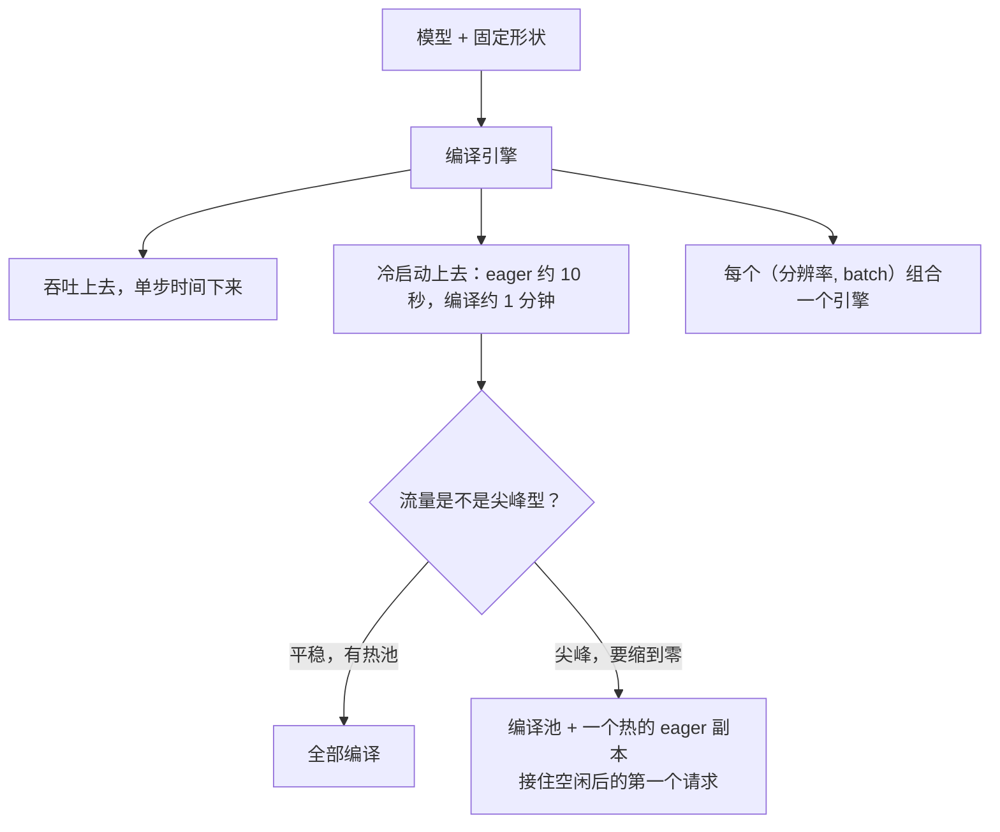
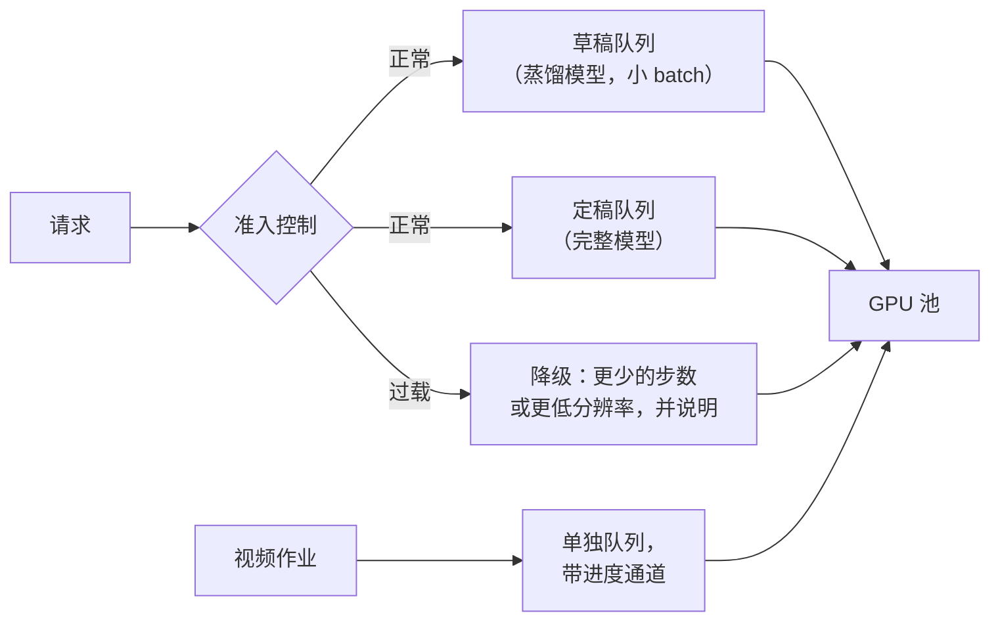

# 5. 服务

这个负载远看像 LLM，行为上完全不是。服务设计要处理的就是这些差别。

## 它不是 LLM

| 性质 | LLM decode | 扩散 |
|---|---|---|
| 形状 | 一个 token 一个 token 地长 | 从第一步就固定 |
| 步与步之间的状态 | 会长大的 KV cache | 一个 latent 张量，全程同样大小 |
| 批处理 | 连续批处理，请求中途进出 | 静态批，整批共用一个步数 |
| 受限于 | 显存带宽 | 主要是算力 |
| 高负载下的失效 | cache 压力与抢占 | 排队，以及解码时的显存尖峰 |
| 编译 | 别扭，形状会变 | 天然合适，形状事先已知 |

两个后果直接掉出来。静态批意味着一个 batch 只能和它的步数一样快，所以把一个 4 步请求和一个 30 步请求塞进同一批，就是在浪费快的那个：按配置分批，不要按到达时间分批。而形状固定让提前编译在这里格外有效，这就引出本节真正要讲的那个决定。

## 编译引擎，以及它换来的冷启动

把去噪器按固定分辨率和 batch 大小编译，融合算子、选定精度，是不动权重能拿到的最大一笔收益。[Baseten 的报告](https://www.baseten.co/blog/40-faster-stable-diffusion-xl-inference-with-nvidia-tensorrt/)给出在 H100 上用 TensorRT 让 SDXL 推理快约 40%、30 步下延迟不到两秒，以及运维上真正要紧的那个数字：**冷启动从大约十秒变成一分钟左右。**

由此有三件面试官会追的事：

- **引擎会成倍增加。** 三种分辨率乘两种 batch 就是六个引擎，每个都是要跟模型一起版本化、在 CI 里重建的构建产物。
- **精度变化藏在编译里。** 编译后的引擎可能量化或融合，从而让输出轻微偏移，所以配对偏好测试属于采纳流程的一部分，不是采纳之后再补。
- **冷启动是一等公民指标。** [Modal 的冷启动指南](https://modal.com/docs/guide/cold-start)是运维那一半：权重从快速卷加载而不是拉取，初始化之后做内存快照让昂贵的准备只发生一次，热池按到达率而不是按峰值来定。

## adapter、预览，以及安全那一遍

**风格 adapter。** LoRA adapter 很小、可热插，所以让一个基座常驻，按请求换 adapter。一个基座加五十个 adapter 和五十个模型是完全不同的显存方案，队列允许时按 adapter 聚批还能把切换成本摊掉。

**渐进式预览。** 每隔几步解码一个中间 latent 并推给前端，对感知延迟的改善比省掉两步大得多。预览用低分辨率解码：全分辨率预览每次都是一次真的 VAE 前向。

**链路里的安全。** 生成前的 prompt 分类和生成后的输出分类，是延迟预算里的另外两个模型。两个值得知道的小技巧：把输出分类器跑在低分辨率预览上，这样被拒的图不必先付全分辨率解码；把 prompt 分类器做成便宜的那个，因为它卡着后面所有东西。

## p95 真正住在队列里

生成时间又长、方差又大，这和[推理那一章](../reasoning-serving/)描述思考模型时的长尾问题是同一个，只是成因不同。控制手段在形状上也是同一套：

- **按类别分开算力，而不只是分开队列。** 草稿一格图、定稿渲染和视频的服务时间差别很大，而在共享硬件上，优先级队列并不能解决这件事：它抢不了一个已经开跑的渲染。[capstone](10-putting-it-together.md) 把数字跑给你看。
- **准入控制要降级，而不是排队。** 过载时降到蒸馏模型或更低分辨率，并在响应里说明，而不是让队列长到超过用户的耐心。
- **每张 GPU 的并发按显存定，不要靠猜。** 决定能同时在飞多少个请求的是解码那个尖峰。

## 什么时候用哪个

| 该拿 | 什么时候 | 而不是 |
|---|---|---|
| 一格图走一个 batch | 产品展示多个选项 | 把每个变体当成独立请求 |
| 按配置分批 | 请求的步数或 adapter 不同 | 按到达时间分批，会浪费快的那些请求 |
| 编译引擎 | 形状固定、流量平稳、有热池 | 在需要跨多种形状缩到零的时候去编译 |
| 一个热的 eager 副本 | 尖峰流量但仍要能缩下去 | 让一个编译实例空转烧钱 |
| 一个基座加 adapter | 风格很多 | 每种风格加载一个模型 |
| 低分辨率预览解码 | 交互式产品，永远 | 全分辨率预览，每次都是一次真解码 |
| 在预览上跑分类器 | 输出分类在链路里 | 全分辨率解码之后再分类，为被拒的图付全款 |
| 过载时降级 | 流量超过容量 | 排队排到用户走人 |

## 实现和训练里的坑

| 坑 | 现象 | 修法 |
|---|---|---|
| 上线才发现冷启动 | 空闲后第一个请求超时 | 从第一次部署起就把冷启动当指标跟踪，并定好热池 |
| 引擎漂移 | 更新后编译引擎和 checkpoint 对不上 | 在 CI 里构建引擎，并和模型一起版本化 |
| 一批里混着不同步数 | 吞吐比任何单一配置都低 | 按配置分批 |
| adapter 组合没测过 | 加上加速 adapter 后风格漂移 | 测你真正要上线的那套组合 |
| 安全那一遍串在全分辨率解码之后 | 被拒的图付了整条链路的钱 | 在预览上分类，尽早拒绝 |
| 按平均显存调并发 | 高分辨率时偶发 OOM | 按解码峰值来定并发 |
