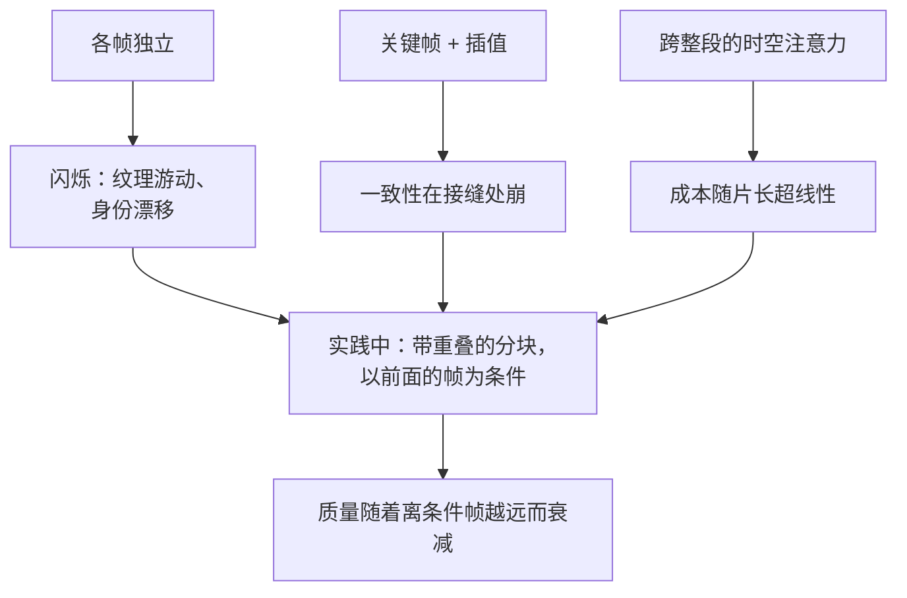

# 6. 视频

视频生成是同一个模型多了一个轴，而这个轴是乘数，不是加项。第 2 节的每一个数字都要乘上帧数，而让帧与帧保持一致的时间注意力，会让增长超过线性。

## 算术

$$
N_{\text{FE}}^{\text{video}} \approx S \cdot c \cdot g(F), \qquad \text{一旦注意力跨越时间，} g(F) \text{ 就是超线性的}
$$

五秒、24 帧每秒是 120 帧。就算 $g(F) = F$，一张图两秒的生成，这段片子也要四分钟，而真实系数比这更差，因为跨时间维度的注意力不是线性的。所以：

- **视频是队列作业，不是请求。** 每一个从请求响应式接口起步的产品，最后还是把队列建了出来。一开始就按作业 id、进度通道和结果回调来设计。
- **指标是每秒输出的成本**，并注明分辨率和帧率。请求本身是变长的片子时，每请求成本没有意义。
- **预览档位是让它负担得起的方式。** 低分辨率、低帧率、更少的步数，只有用户留下的那一段才做完整渲染。

## 时间一致性是全部的难点

各帧独立生成，结果就会闪：纹理游动、物体身份变化、光照跳变。修法是让模型跨时间做注意力，而这恰恰就是贵的原因。三种做法，各自的取舍：

| 做法 | 怎么做 | 取舍 |
|---|---|---|
| 在图像模型上加时间层（[Video LDM](https://arxiv.org/abs/2304.08818)、[Stable Video Diffusion](https://arxiv.org/abs/2311.15127)） | 往预训练的图像骨干里插入时间注意力或卷积，只训这些 | 通往视频最便宜的路，继承图像模型的长处也继承它的限制 |
| 整段时空生成（[Lumiere](https://arxiv.org/abs/2401.12945)） | 一次跑完整个时间跨度，不做关键帧插值 | 消掉插值接缝，代价是算力正比于整段片长 |
| 媒体基础模型（[Movie Gen](https://arxiv.org/abs/2410.13720)） | 一开始就在视频上大规模训练，音频和编辑在同一个家族里 | 门槛是规模；读它是为了知道生产级到底花多少 |

## 长度是分块生成的，而且要说出来

模型有一个原生片长。更长的输出是靠生成相互重叠的分块、每块以上一块最后几帧为条件来做的，所以质量随着离条件帧越远而衰减：颜色、身份和镜头运动都会漂。诚实的产品决定是给出支持的片长，而不是暗示可以无限长，并在界面上把接缝行为暴露出来（比如让用户重掷某一块），而不是假装它不存在。

## 数据链路才是这个系统的大头

[Stable Video Diffusion 那份报告](https://arxiv.org/abs/2311.15127)最有教益的地方在它的篇幅分配：大部分讲的是数据链路，不是架构。用镜头切换检测保证没有训练片段跨越场景切换，多个粒度的字幕标注，用光流过滤掉静止片段和手抖，再加上美学和文字存在性的过滤，最后是图像预训练、在整理好的集合上做视频预训练、高质量微调这三段式配方。

给面试的两条教训。跨着一个切点训练，教会模型凭空造出镜头切换，这是一个有明确成因的可见伪影。而在这个领域，整理数据的决定比架构决定更可复现、也更有后果，这正是那份报告把篇幅花在那里的原因。

## 什么时候用哪个

| 该拿 | 什么时候 | 而不是 |
|---|---|---|
| 带进度的队列作业 | 任何视频生成 | 一个会超时的同步接口 |
| 在图像骨干上加时间层 | 你需要视频，而且已有一个信得过的图像模型 | 从零训练一个视频模型 |
| 整段生成 | 一致性比片长更重要 | 关键帧加插值，接缝是看得见的 |
| 带重叠的分块生成 | 输出长于原生窗口 | 宣称长度不限 |
| 低分辨率预览档 | 用户会反复试 | 每次尝试都做完整质量渲染 |
| 每秒输出成本 | 汇报任何视频经济性 | 每请求成本 |

## 实现和训练里的坑

| 坑 | 现象 | 修法 |
|---|---|---|
| 各帧独立生成 | 闪烁和身份漂移 | 时间注意力，或者用本身带它的图生视频模型 |
| 训练片段跨越切点 | 模型自己造出场景切换 | 在链路最前面做镜头切换检测 |
| 没有运动过滤 | 模型从静止片段里学，产出静止视频 | 整理阶段用光流过滤 |
| 承诺长度不限 | 离条件帧远了质量崩塌 | 给出支持的片长，把重掷暴露出来 |
| 在不同设置下比片子 | 没人能复现这个比较 | 测量前先固定分辨率、帧率和长度 |
| 视频和图像共用队列 | 一个视频作业落下来，图像 p95 就崩 | 分开队列，分开容量 |
