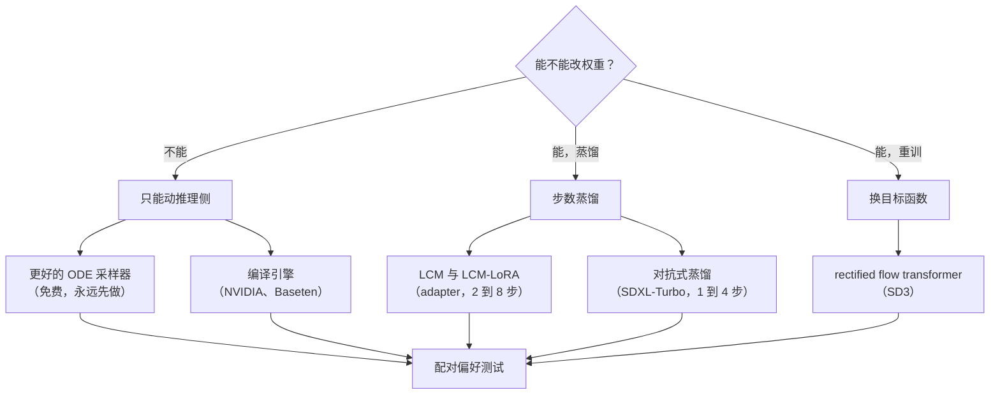

# 7. 真实团队在生产环境里怎么做

下面每个系统跑的都是同一条链路：prompt 编码一次，用尽可能少的评估次数去噪，解码一次，分类，附上溯源。区别在于它们怎么把步数买回来，以及愿意把多少东西冻进一个编译好的引擎。

## 真实设计在哪里分岔

| 团队 | 选了什么 | 因为 | 放弃了什么 |
|---|---|---|---|
| Stability AI（SDXL） | 更大的基座加一个 refiner 阶段 | 1024px 上的质量 | 每张图的成本，以及两个 checkpoint 常驻 |
| Stability AI（SDXL-Turbo） | 对抗式蒸馏到 1 到 4 步 | 接近打字速度的交互式生成 | 多样性，以及一部分 prompt 贴合度 |
| Stability AI（SD3） | rectified flow transformer | 更直的轨迹、可预测的扩展性 | 这是换模型，不是服务侧的开关 |
| LCM 与 LCM-LoRA | 把 consistency 蒸馏做成 adapter | 能直接叠在已有微调上被采纳 | 一部分细节，且质量随基座而变 |
| OpenAI（consistency 模型） | 直接映射到轨迹终点 | 后面所有做法都源于这个形式化 | 单步下的多样性 |
| NVIDIA 与 Baseten | 固定形状的编译引擎 | 同一份权重上几十个百分点 | 冷启动，以及每种形状一个引擎 |
| Modal | 把冷启动当作产品问题 | 缩到零的经济性 | 复杂度在平台侧，不在模型侧 |
| Stability AI（SVD）、Google（Lumiere）、Meta（Movie Gen） | 跨整段的时空注意力 | 时间一致性 | 交互延迟，彻底放弃：这些是批作业 |

## 这些系统（一手链接）

- **Stability AI** [SDXL](https://arxiv.org/abs/2307.01952)：基座加 refiner 的设计，以及把尺寸和裁剪条件化，用输入来修一个数据问题。
- **Stability AI** [对抗式扩散蒸馏](https://arxiv.org/abs/2311.17042)：SDXL-Turbo，也是任何地方关于步数蒸馏在多样性上代价的最清楚的一句陈述。
- **Stability AI** [Scaling rectified flow transformers](https://arxiv.org/abs/2403.03206)：SD3，转向 flow matching 目标和 transformer 去噪器，带上支撑这个选择的消融。
- **Stability AI** [Stable Video Diffusion](https://arxiv.org/abs/2311.15127)：讲视频数据整理的篇幅比讲架构多，而这才是诚实的排序。
- **OpenAI** [consistency 模型](https://arxiv.org/abs/2303.01469)：整条蒸馏线的源头。
- **Meta** [Movie Gen](https://arxiv.org/abs/2410.13720)：一族媒体基础模型，训练和推理规模都写了出来。
- **Meta** [Emu](https://arxiv.org/abs/2309.15807)：在两千来张手挑图片上做质量微调，胜过再爬一批数据。
- **Google** [Lumiere](https://arxiv.org/abs/2401.12945)：整段时空生成，而不是关键帧加插值。
- **Baseten** [用 TensorRT 让 SDXL 快 40%](https://www.baseten.co/blog/40-faster-stable-diffusion-xl-inference-with-nvidia-tensorrt/)：编译引擎的取舍，带数字，冷启动也在内。
- **Baseten** [怎么给图像生成模型做基准](https://www.baseten.co/blog/how-to-benchmark-image-generation-models-like-stable-diffusion-xl/)：为什么这里吞吐和延迟回答的是不同的问题。
- **NVIDIA** [在 NVIDIA AI 推理平台上跑 SDXL](https://developer.nvidia.com/blog/generate-stunning-images-with-stable-diffusion-xl-on-the-nvidia-ai-inference-platform/)：固定形状负载的完整优化栈。
- **NVIDIA** [为视频生成优化基于 transformer 的扩散模型](https://developer.nvidia.com/blog/optimizing-transformer-based-diffusion-models-for-video-generation-with-nvidia-tensorrt/)：同一件事，但注意力跨越了空间和时间。
- **Modal** [冷启动性能](https://modal.com/docs/guide/cold-start)：编译那个决定的运维另一半。
- **Hugging Face** [LCM-LoRA](https://huggingface.co/blog/lcm_lora)：把步数蒸馏打包成 adapter，以及少步生成为什么传播得那么快。

## 从这组里带走什么

三个反复出现的模式，也是被问到真实团队怎么做时该说的：

1. **没人上线训练时的步数。** 第一步永远是换个更好的采样器，而且免费。
2. **步数是用权重买回来的，货币是多样性。** 每一个把步数压到十以下的团队都拿输出多样性换了速度，诚实的那些在论文里写了出来。
3. **运维上的决定是编译还是冷启动。** 它跟模型完全无关，而且是面试官最可能亲身经历过的那一个。
