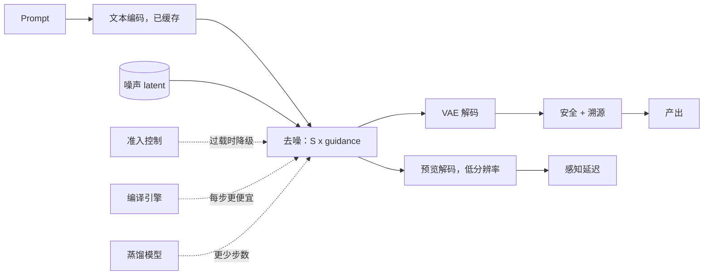

# 9. 小结

## 一页回顾

- **成本单位是去噪器的一次前向评估**，不是一个 token。$N_{\text{FE}} = S \cdot c$，classifier-free guidance 让 $c = 2$。
- **延迟是一个被乘的项加三个固定项**：$t \approx t_{\text{text}} + N_{\text{FE}} \cdot t_{\text{step}} + t_{\text{decode}} + t_{\text{safety}}$。先优化被乘的那个。
- **latent 是这件事负担得起的原因。** 下采样 8 把 1024px 变成 128 乘 128 的网格；patch 取 2 时 transformer 去噪器看到 4096 个 token，注意力对它是平方，所以 2048px 是十六倍的注意力工作量，不是四倍。
- **一格变体是一个 batch**，四张图的成本和一张差不多。
- **采样器免费，蒸馏不免费。** 更好的 ODE 求解器用同样的权重就能到 20 到 30 次评估。再往下就要蒸馏，而每一种蒸馏都是拿多样性换速度。
- **编译是只动推理时最大的一笔收益，代价是冷启动**：eager 大约十秒对编译大约一分钟，而且每种形状一个引擎。
- **显存尖峰在 VAE 解码**，不在循环里。超过 1024px 就分块。
- **视频先乘帧数再多一点**，因为止住闪烁的是时间注意力。它是队列作业，按每秒输出计价。
- **FID 不是那道门。** 固定 prompt 集上的配对人工偏好才是，配一个 prompt 贴合度代理做便宜的检查，再加上带种子的确定性好让版本之间能对比。

## 整个系统一页看完

## 自测

**1.** 一个服务在 1024px 上跑 40 步、开着 guidance。这是多少次前向评估？换成一个把 guidance 也蒸馏进去的四步模型，这个数变成多少？

答案

40 步开 guidance 是 $40 \times 2 = 80$ 次评估。四步、guidance 已蒸馏进去的模型是 $4 \times 1 = 4$ 次。主导项减少了 20 倍，这就是为什么蒸馏改变的是产品而不是毛利。固定项（文本编码、解码、安全）不会缩，所以端到端延迟的改善小于 20 倍，而到那个时候，主导的就是这些固定项了。

**2.** 你们的产品 1024px 和 2048px 一个价。这为什么是个问题？

答案

token 从 $(1024/16)^2 = 4096$ 变成 $(2048/16)^2 = 16384$，四倍；而注意力工作量随 token 数的平方增长，大约十六倍。VAE 解码的显存峰值也随输出像素增长。一个价盖不住两者，除非 1024px 的价格在替 2048px 的成本买单。

**3.** 你们上了一个蒸馏模型。基准没掉，演示 prompt 很好看，两周后用户说这个工具感觉很重复。发生了什么，验收本该测什么？

答案

步数蒸馏让输出分布变窄了。单张图仍然好，所以任何逐图指标都不动，但同一个 prompt 在不同种子下的多样性掉了。验收本该包含一个跨种子的多样性度量，以及在更宽的 prompt 集（含难构图）上的配对偏好测试，而不只是演示集。

**4.** p95 十二秒，成本模型说三秒。按顺序说出四个该看的地方。

答案

排队（到达率对容量，没有准入控制）、流量尖峰时的冷启动、循环周边的链路（没缓存的文本编码、全分辨率预览解码、串在全分辨率解码之后的安全那一遍），以及高分辨率下 VAE 解码的显存压力导致的重试。

**5.** 编译引擎让请求更快，为什么反而会让部署更难？

答案

它把形状冻住，于是每种分辨率和 batch 都需要自己的引擎，要跟模型一起版本化和重建。而且它把冷启动从大约十秒抬到一分钟左右，尖峰流量就没法缩到零。通常的答案是编译池加一个热的 eager 副本接住空闲后的第一个请求。

## 延伸阅读

- [latent 扩散](https://arxiv.org/abs/2112.10752)讲 latent 为什么存在，[SDXL](https://arxiv.org/abs/2307.01952)讲开源生成大多继承的那套设计。
- [DDIM](https://arxiv.org/abs/2010.02502) 和 [classifier-free guidance](https://arxiv.org/abs/2207.12598) 是评估次数的两半。
- [consistency 模型](https://arxiv.org/abs/2303.01469)、[LCM-LoRA](https://arxiv.org/abs/2311.05556) 和[对抗式扩散蒸馏](https://arxiv.org/abs/2311.17042)是步数蒸馏这一族。
- [DiT](https://arxiv.org/abs/2212.09748) 和 [SD3](https://arxiv.org/abs/2403.03206) 是当前系统所建立其上的 transformer 与 flow matching 这条线。
- 视频看 [Stable Video Diffusion](https://arxiv.org/abs/2311.15127)、[Lumiere](https://arxiv.org/abs/2401.12945) 和 [Movie Gen](https://arxiv.org/abs/2410.13720)。
- 完整的阅读清单在 [papers.md](../../papers.md)，生产资料在[第 7 节](07-how-teams-do-it-in-production.md)。
