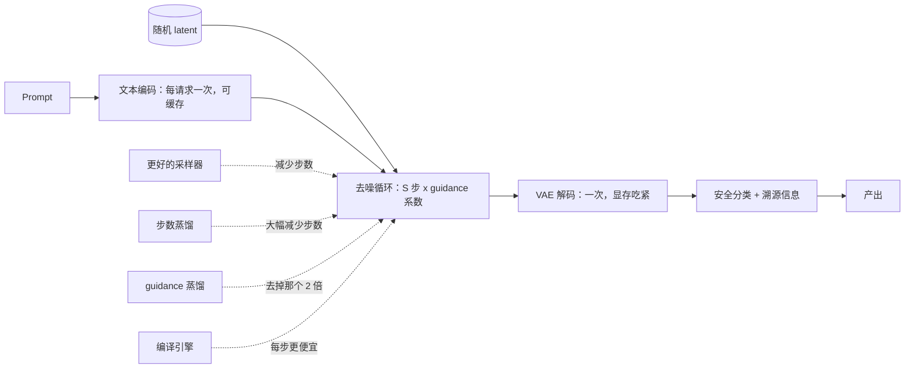

# 图像与视频生成的服务

> 本章是英文原版的中文译本，原文见 [book/generation-serving/](../../book/generation-serving/)。译文和原文同步维护，发现问题请提 issue。

> **写法说明。** 和书里其他章一样：先用一段面试官对话把问题圈定，再给出一个所有后文都从它推导的成本模型，一个想法配一张图，附真实的生产资料，最后以面试问答收尾。它是全书唯一一章成本模型不是 KV cache 的，而这正是它存在的理由。

面试官很少直接说"讲讲扩散模型"。他们会说：**"我们的图像生成功能每张图大约八分钱，p95 是十二秒。把它做便宜、做快，同时输出不能明显变差。"**

这个问题只有一个正确的切入点，而且不是从 LLM 服务那边带过来的那个直觉。

这里没有自回归循环，没有 KV cache，也没有按 token 计费。只有一个数字：**你把去噪器跑了多少次**。本章里的每一个杠杆，要么降低这个数字，要么让每一次评估更便宜，要么让你不再为没人会看的那些评估付钱。

## 各节内容

1. [澄清需求](01-clarifying-requirements.md)：把问题范围定下来的那段对话。
2. [成本模型](02-the-cost-model.md)：前向评估次数、guidance、latent，以及后面一切都挂在上面的那套算术。
3. [步数与蒸馏](03-steps-and-distillation.md)：先换采样器，再靠改权重把步数买回来。
4. [latent 与去噪器](04-latents-and-denoisers.md)：VAE、UNet 与 transformer，以及条件从哪里进来。
5. [服务](05-serving.md)：批处理、编译引擎、冷启动、adapter、预览，以及链路里的安全过滤。
6. [视频](06-video.md)：帧数是个乘数、时间一致性，以及为什么这是队列作业。
7. [真实团队在生产环境里怎么做](07-how-teams-do-it-in-production.md)：点名公司、分歧对比表、一手资料链接。
8. [面试问答](08-interview-qa.md)：常考的、有坑的，以及常被答错的。
9. [小结](09-summary.md)：一页回顾、mermaid 图、自测题、延伸阅读。
10. [把它们拼起来：完整的方案](10-putting-it-together.md)：一套默认技术栈、把本章场景从头到尾算清成本、同一个系统在另外两组约束下的样子，以及一个只用 Python 3 就能跑的成本模型。

## 整个系统一页看完

第一次读请按顺序读。各节层层递进，而且每一节都会回头引用第 2 节的成本模型。

## 配套章节

这里的服务词汇（批处理、编译核、排队、长尾）和[大规模 LLM 推理服务](../inference-serving/)、[推理模型与测试时计算](../reasoning-serving/)是同一套；不同的是这个负载形状固定、没有 KV cache。至于"大家引用的指标不是产品需要的指标"这个评估问题，和[给模型做基准测试](../benchmark-eval/)是同一个。本章的密集版对应 [topic 19](../../topics/19-generation-serving.md)。
