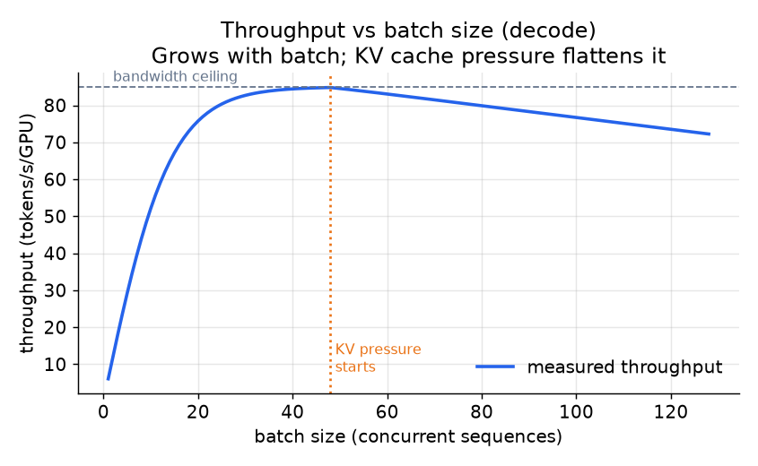
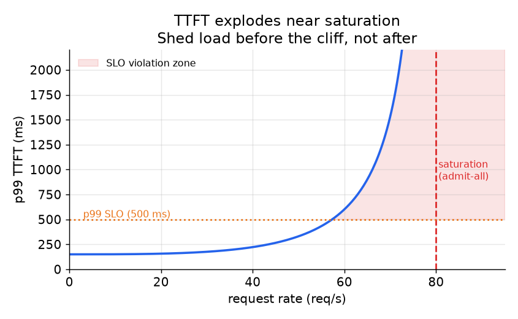

# 2. 吞吐问题

要理解 LLM serving 为什么难，得先理解一个请求有两个截然不同的阶段，它们对硬件的胃口正好相反。把两者随手混在一起，就是吞吐（每秒产出的输出 token 数）崩掉、延迟飙升的地方。

## prefill 与 decode：两个阶段，两个瓶颈

**prefill** 用一趟并行前向处理整个 prompt。每个 prompt token 同时 attend 到其他所有 token，所以 GPU 在整个序列上跑的是一个稠密矩阵乘。这是**受算力限制**的（瓶颈在 GPU 做数学运算的速度，而不是内存速度）：执行的 FLOPs 远多于从 HBM 搬运的字节数。算术强度（数学运算次数与从内存读取字节数之比）很高，GPU 一直在忙，相对于完成的工作量来说这一步结束得很快。开销随 prompt 长度增长，每个请求只付一次。

**decode** 每趟前向生成一个输出 token。每一步模型都要读完整的权重矩阵，外加不断增长的 KV cache（之前每个 token 保存下来的 key 和 value，复用它们就不用每步重算），结果只吐出一个 token。相对于取回的字节数，FLOPs 小得可怜。这是**受显存带宽限制**的（瓶颈在从内存读字节的速度，而不是算力）：算术强度接近 1，也就是从 HBM 每搬一个字节，大约只做一次浮点运算。GPU 大部分时间在等数据，而不是在算。开销随输出长度增长，每个 token step 都要付。

roofline 模型（把峰值算力和内存带宽放在一起看，谁先封顶谁就是上限）把这件事说得很精确：

$$\text{throughput ceiling} = \min\!\left(\frac{\text{peak FLOPs}}{\text{FLOPs per token}},\; \frac{\text{HBM bandwidth}}{\text{bytes per token}}\right)$$

```python
def throughput_ceiling(peak_flops, flops_per_token, hbm_bandwidth, bytes_per_token):
    # roofline: capped by whichever runs out first, compute or memory bandwidth
    compute_limit = peak_flops / flops_per_token       # tokens/s if compute-bound
    bandwidth_limit = hbm_bandwidth / bytes_per_token  # tokens/s if bandwidth-bound
    return min(compute_limit, bandwidth_limit)         # the binding ceiling
# throughput_ceiling(1e15, 2e11, 3e12, 6e5) -> 5000.0
```

prefill 落在 min 里算力那一侧，decode 落在带宽那一侧。再多的算术优化对 decode 都没用，要么少搬字节，要么把搬字节的成本摊到每步更多的 token 上。

## 显存墙：KV cache 的大小

KV cache 是 decode 过程中不断累积的东西，也是高并发下真正卡住的内存约束。每个 token 占的大小是：

$$\text{KV bytes per token} = 2 \cdot L \cdot n_{\text{kv}} \cdot d_{\text{head}} \cdot b_{\text{kv}}$$

```python
def kv_bytes_per_token(num_layers, num_kv_heads, head_dim, bytes_per_elem):
    # the leading 2 counts both tensors cached per layer: keys and values
    return 2 * num_layers * num_kv_heads * head_dim * bytes_per_elem  # bytes per token
# kv_bytes_per_token(80, 8, 128, 2) -> 327680
```

其中 $L$ 是 transformer 层数，$n_{\text{kv}}$ 是 KV head 的数量（MQA/GQA 会把它压低很多），$d_{\text{head}}$ 是 head 维度，$b_{\text{kv}}$ 是每个 KV 元素的字节数（BF16 是 2，INT8 是 1）。

以一个 BF16 的 70B 模型为例，8 个 KV head（GQA）、head 维度 128、80 层，每个 token 大约花 $2 \times 80 \times 8 \times 128 \times 2 = 327\,680$ 字节，约 320 KB。一条 4 000 个输出 token 的序列，光这一个请求就要在 GPU 上占约 1.3 GB 的 KV cache。并发 50 条序列就是 64 GB，还没算模型权重就已经超过了 H100 的 HBM。通常限制能把多少条序列打包到一起的是 KV cache 的大小，而不是权重。

decode 的单步耗时可以直接推出来：

$$\text{decode step time} \approx \frac{P \cdot b_w + N \cdot \text{KV}_{\text{bytes}}}{\text{HBM bandwidth}}$$

```python
def decode_step_time_s(num_params, bytes_per_weight, batch_size, kv_bytes, hbm_bandwidth):
    # decode is bandwidth-bound: time = bytes read from HBM / bandwidth
    bytes_moved = num_params * bytes_per_weight + batch_size * kv_bytes  # weights + all KV
    return bytes_moved / hbm_bandwidth  # seconds per decode step
# decode_step_time_s(7e9, 2, 10, 1e9, 1.2e12) -> 0.02
```

其中 $P$ 是权重参数量，$b_w$ 是每个权重的字节数，$N$ 是同时打包在一个 batch 里的序列数。增大 $N$ 会提高吞吐（读权重的成本摊到更多 token 上），直到 KV 那一项占据主导。



*decode 吞吐随 batch 增大而上升，因为固定的读权重成本被摊到更多序列上。一旦 KV cache 的压力填满 HBM、限制了 batch 能开多大，增长就会趋平。带宽上限就是 roofline 的极限。示意图。*

## TTFT 与 token 间延迟：不同的 SLO，不同的杠杆

**首 token 延迟（TTFT）** 是从请求到达到收到第一个输出 token 的时间。它主要由 prefill 那一趟（prompt 很长时可能很久）和排队等待时间决定。一台忙碌的服务器上有很多请求等着开始 prefill，即使 decode 很快，TTFT 也会很差。

**token 间延迟（TPOT，每个输出 token 的耗时）** 是流式输出时相邻两个输出 token 之间的间隔。它主要由 decode 单步耗时和 prefill 的干扰决定：一个大 prefill 跟正在进行的 decode 跑在同一张 GPU 上，会让那些 decode 停一整个 step，token 流里出现肉眼可见的停顿。

在混合负载下，这两条 SLO 互相拉扯：

- 优先追求 decode 吞吐、把 batch 打得很大：对 TPOT 好（权重成本被摊薄），对 TTFT 坏（新请求要等更久才能开始 prefill）。
- 优先追求快速 prefill、来了就立刻跑：对 TTFT 好，但一次长 prefill 会占住 GPU 一整个 step，让每一个在途请求的 TPOT 都飙升。

正确的杠杆是**分块 prefill（chunked prefill）**：把长 prompt 的 prefill 切成小块，和正在进行的 decode step 交错执行。每一块都足够短，不会明显拖慢 decode step，所以 TPOT 保持平稳；同时 prompt 仍在推进，TTFT 也就有界。这是关键洞察，具体机制在批处理那一节展开。



*低负载时 TTFT 缓慢恶化，接近饱和时则是灾难性恶化。阴影区是 p99 超出 SLO 的地方。临近饱和时正确的应对是有控制地卸载负载，而不是继续放请求进来、让所有人一起错过目标。示意图。*
