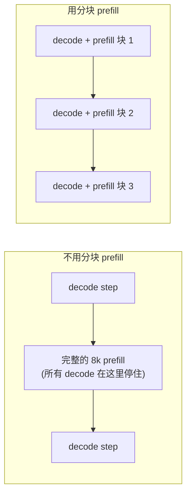

# 3. 批处理

批处理（把多个请求凑到一起让 GPU 同时处理）是 LLM serving 里杠杆最大的一个决策。它决定了读模型权重这笔固定成本能多高效地摊到各个请求上。做错了浪费 GPU 周期；做对了，相对朴素基线的吞吐提升就是 8 倍和 23 倍的差别。

## 静态批处理：问题所在

静态批处理收齐一组固定的请求，把它们作为一个整体跑到结束，再开始下一个 batch。batch 运行期间 GPU 是高效的，但 batch 里每个请求生成的输出 token 数各不相同。一个 10 个 token 就结束的请求，要一直霸着它的 GPU 槽位，直到 batch 里最后那个请求在 800 个 token 之后才完成。最后那些 step 里 GPU 有一部分在空转，等着最长的那个成员跑完。输出长度的方差直接变成了浪费的算力。

## 连续批处理（in-flight batching）：解法

连续批处理，也叫迭代级批处理，调度粒度是 token step 而不是请求。每个 decode step 结束后，调度器检查哪些序列已经吐出了结束符。完成的序列立刻释放槽位，调度器用等待中的请求填上这些槽位，它们在下一个 step 之前开始自己的 prefill。batch 的组成在每次迭代都会变化，GPU 始终保持饱和。

每步吞吐大约是：

$$\text{tokens/s/GPU} \approx \frac{N \cdot \text{step time}^{-1}}{1}$$

```python
def decode_tokens_per_sec(num_live_sequences, step_time_s):
    # each step emits one token per live sequence; throughput = sequences / step time
    return num_live_sequences / step_time_s  # tokens per second per GPU
# decode_tokens_per_sec(50, 0.02) -> 2500.0
```

其中 $N$ 是活跃序列数。静态批处理下，随着请求完成而 batch 不补充，$N$ 一路下降。连续批处理下，$N$ 始终接近 KV cache 允许的上限，利用率保持高位。

Anyscale 的 vLLM 把连续批处理和 **PagedAttention** 结合起来：不再为每条序列预分配一整块连续缓冲区（因为碎片和输出长度未知，这种做法很浪费内存），而是把 KV cache 按固定大小的小块分配，用页表做非连续映射。内存浪费降到 4% 以下。两者叠加起来，相对朴素静态批处理大约有 23 倍的吞吐提升，其中调度上的收益（约 8 倍）主要来自连续批处理，内存上的收益主要来自分页。

## 连续批处理藏起来的边界情况：KV 耗尽与抢占

连续批处理会贪心地放新序列进来，直到 KV cache 装不下为止；但 decode 每一步都会让每条活跃序列的 cache 增长一个 token，所以一个进入时装得下的 batch，跑到一半可能就把内存撑爆了。当池子满了而某条运行中的序列还需要一个新块时，调度器不能干等：它必须抢占一条或多条在途序列来腾出块。vLLM 有两种处理方式：把牺牲者的 KV 块换出到 CPU 内存、等有空间了再换回来；或者直接丢弃，等序列重新调度时重算 prefill。换出付的是 PCIe 带宽，重算付的是一趟多余的 prefill。不管哪种，牺牲者都会停下来；而且抢占落在调度器挑出来的那几条序列上，不是均匀分摊，所以效果表现为尾延迟的断崖，而不是整体均匀变慢。

资深工程师会看到的推论是：入场时的峰值并发不是一个安全的稳态。如果按入场时装得下多少来决定 batch 大小，一个长输出的负载会把池子推进颠簸（thrashing）状态，序列被反复抢占又恢复，GPU 看着很忙，总吞吐却崩了。防护措施是按 KV 预算来决定放行，这个预算要给 batch 还会继续生成的 token 留出余量，而不只看每个请求到达时已有的 token；并且要盯着抢占和换出计数器，把它们当作准入策略过于激进的领先指标。

## 分块 prefill：抹平干扰

新请求到达时，它的 prefill（为整个 prompt 计算 KV）必须先跑完，才能生成第一个输出 token。一个长 prompt（8k token）会占住 GPU 一整个 prefill step，这期间每一条在途 decode 序列都被堵住无法推进。这个停顿表现为一次 TPOT 尖峰，对其他每个用户来说有时就是流里一段肉眼可见的卡顿。

**分块 prefill** 把 prefill 切成更小的块（比如每块 512 个 token），和正在进行的 decode step 交错执行。prefill 的成本被分散到若干次迭代里，而不是砸在一个 step 上。decode 序列不间断地推进，TPOT 保持平稳，新请求的 prefill 也在稳步前进。块大小是一个调节旋钮：块越小对 TPOT 的保护越强，块越大 prefill 完成得越快（TTFT 更好）。把这个方法形式化的研究论文是 Sarathi-Serve。




## prefill 与 decode 分离部署：独立的资源池

对付 prefill 和 decode 互相干扰，一个更激进的答案是把它们放到完全独立的机器上跑。请求先进入 **prefill 池**，在那里跑受算力限制的 prefill、填好 KV cache，然后把 KV cache 传给 **decode 池**，由后者跑受带宽限制的 decode 循环。两个池子可以独立定容、独立扩缩：decode 重的负载（agent、代码生成）可以多加 decode 机器而不会饿死 prefill 池，每个池子也可以用适合自己阶段的张量并行度。

分离的代价是池子之间的 **KV cache 传输**。用上一节的数字，一个 4k token 的 BF16 上下文，在规模化时这种传输每秒每请求可能达到好几 GB。它需要快速互连（NVLink 或高带宽网络），否则自己就成了新瓶颈。NVIDIA Dynamo、Microsoft Splitwise 和 DistServe 都用这种模式。对于中等 QPS 下的单个小模型，单池加分块 prefill 更简单，通常也够用；等两条 SLO 在集群规模上真正冲突了，再分离。

## 对比：分块 prefill 与 prefill/decode 分离部署

这两个很容易混淆，因为它们对付的是同一个症状：长 prefill 卡住在途的 decode 流。但机制正好相反。分块 prefill 保留一个池子、改变调度；分离部署保持调度简单、改变硬件拓扑。

| 维度 | 分块 prefill | prefill/decode 分离部署 |
|---|---|---|
| 解决的问题 | prefill 与 decode 的干扰（两者相同） | prefill 与 decode 的干扰（两者相同） |
| 解法落在哪里 | 调度器：prefill 切块，在同一批 GPU 上和 decode step 交错 | 拓扑：prefill 和 decode 跑在物理上独立的池子里 |
| 修复后剩余的干扰 | 减少但不为零；每个混合 step 里，一个块和 decode batch 仍在共享算力 | 从构造上就是零；decode GPU 永远见不到 prefill step |
| 引入的新成本 | 被分块的那个请求 TTFT 略慢；多一个块大小的调节旋钮 | 池子之间的 KV cache 传输，需要 NVLink 级别的网络，否则它就是瓶颈 |
| 两个阶段能否独立扩缩 | 不能；一个池子按混合负载定容 | 能；每个池子按自己的阶段定容并选择 TP 度 |
| 运维复杂度 | vLLM 或 SGLang 里一个开关 | 两套集群、一条 KV 传输通路，外加跨池路由和健康检查逻辑 |

分水岭在于：prefill 和 decode 的 SLO 是否必须在集群规模上独立调优，并且是否有快速互连。在这条线以下，分块 prefill 拿到了大部分收益而不付任何拓扑成本；在这条线以上，只有分离部署能把干扰彻底消除。

## 什么时候用哪个

| 选用 | 什么时候 | 而不是 |
|---|---|---|
| 连续批处理（永远） | 任何生产环境的 LLM serving | 静态批处理；GPU 空转的问题是普遍存在的 |
| PagedAttention（永远） | 与连续批处理搭配 | 连续预分配；不分页的话碎片浪费在 20-40% |
| 分块 prefill | 单池混合负载下长 prompt 引发 TPOT 尖峰 | 跑完整的 prefill step，让所有在途 decode 暂停 |
| prefill 与 decode 分离部署 | prefill 和 decode 的 SLO 真正冲突，且有快速互连可用 | 分块 prefill，当一个池子够用而 KV 传输成本会占主导时 |
| 按 token 预算打包 | prompt 长度差异很大，想把每步的算力填满 | 按请求数打包，遇到一批短输入会浪费 token 预算 |

**工具。** 连续批处理加 PagedAttention 是 vLLM 的默认配置，SGLang、Hugging Face TGI 和 TensorRT-LLM（NVIDIA）也都做到了同样的事，它们都在 token step 粒度上调度，并按 token 预算而不是请求数打包。分块 prefill（Sarathi-Serve 的方法）在 vLLM 和 SGLang 里是一个可配置的开关。prefill 和 decode 分离的资源池是 NVIDIA Dynamo 以及 DistServe、Splitwise 设计所采用的模型，它们通过高速网络在独立扩缩的池子之间搬运 KV cache。

**出处。** 连续（迭代级）批处理起源于 Orca（OSDI 2022）；PagedAttention 起源于 vLLM（UC Berkeley，2023），它借鉴了操作系统式的分页来消除连续的 KV 预分配。分块 prefill 由 Sarathi-Serve 提出（2024，[arXiv:2403.02310](https://arxiv.org/abs/2403.02310)）。prefill 与 decode 分离由 Splitwise（Microsoft，2024，[arXiv:2311.18677](https://arxiv.org/abs/2311.18677)）和 DistServe（2024，[arXiv:2401.09670](https://arxiv.org/abs/2401.09670)）提出；Mooncake（Moonshot AI，2024，[arXiv:2407.00079](https://arxiv.org/abs/2407.00079)）把 KV cache 当作整个 serving 集群共享的一等分布式对象来对待。

**实例。** 一个以中等 QPS 服务一个中型模型的聊天产品，会无条件打开连续批处理加 PagedAttention，因为静态批处理的 GPU 空转问题是普遍的，而分页能把 KV 碎片浪费压到几个百分点。由于它的流量里长 prompt 和活跃的 decode 流混在一起，它会启用分块 prefill，让一个 8k token 的 prompt 分散到若干次迭代里，而不是在一个 prefill step 里把所有在途流都暂停，从而保持 TPOT 平稳。它不会去碰 prefill 与 decode 分离部署，因为在这个规模下单池已经够用，而没有快速互连的话，池子之间好几 GB 的 KV cache 传输会占据主导。只有当 prefill 和 decode 的 SLO 日后在集群规模上分化，且有 NVLink 级别带宽可用时，它才会拆成独立的池子。
