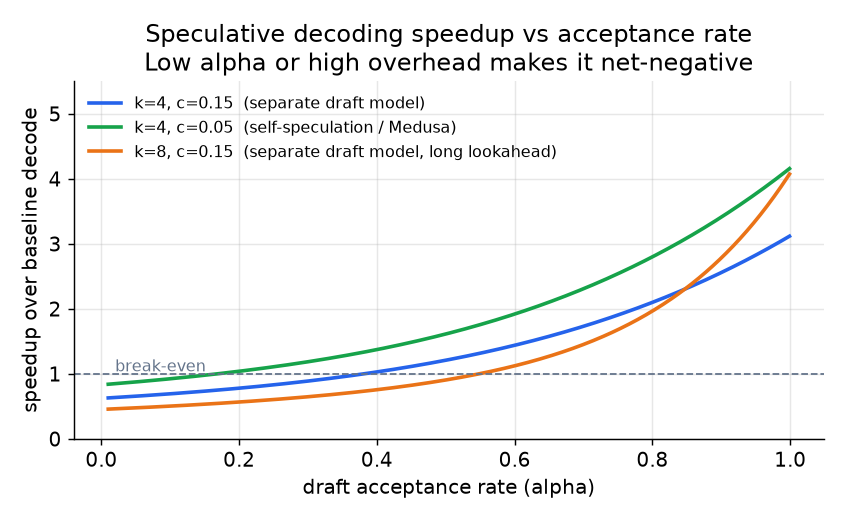

# 4. 投机解码

连续批处理和分块 prefill 把 GPU 利用率推到了最高，但它们没有改变 decode 的根本约束：一趟前向，一个 token。每个 decode step 都要从 HBM 读完整个模型，才产出一个 token。投机解码（speculative decoding，先用一个便宜的模型猜出好几个 token，再用大模型一趟前向检查它们）打破了这个约束：在目标模型的一趟前向里验证多个 token，代价是先跑一个更便宜的草稿模型来提出候选。

## 起草加验证的模式

一个小而快的**草稿模型**自回归地生成 $k$ 个候选 token。这很便宜：草稿模型比目标模型小得多，前向快、占内存少。

然后大的**目标模型**在一趟并行前向里验证全部 $k$ 个草稿 token。验证可以并行，因为 $k$ 个位置都是事先已知的；计算每个草稿 token 的概率只需要在长度为 $k$ 的序列上跑一趟前向，而不是 $k$ 趟串行前向。所以验证的成本大致等于目标模型在 $k$ 个 token 上跑一次，比自回归地跑 $k$ 次便宜得多。

接受规则是**拒绝采样**：对每个草稿 token $x_i$，目标概率为 $p(x_i)$，草稿概率为 $q(x_i)$，以 $\min(1, p(x_i)/q(x_i))$ 的概率接受。被拒绝时，从残差分布里重新采样一个修正 token。这条规则可以证明等价于直接从目标模型采样：输出分布完全一致。投机解码是延迟优化，不是拿质量做交换。

## 加速比公式

设 $\alpha$ 为接受率（单个草稿 token 被接受的概率），$k$ 为草稿 token 数，$c$ 为每个 token 的验证开销（以目标模型一步的比例计）。每趟目标模型前向期望产出的 token 数为：

$$\text{expected tokens per pass} = \frac{1 - \alpha^{k+1}}{1 - \alpha}$$

相对基线 decode（每个 token 一趟目标模型前向）的加速比为：

$$\text{speedup} = \frac{1 - \alpha^{k+1}}{(1 - \alpha)(1 + ck)}$$

```python
def spec_speedup(alpha, k, c):
    # alpha: per-token accept rate; k: draft tokens; c: verify overhead per draft token
    tokens_per_pass = (1 - alpha ** (k + 1)) / (1 - alpha)  # expected tokens each target pass
    return tokens_per_pass / (1 + c * k)                    # divide by relative pass cost
# spec_speedup(0.8, 4, 0.1) -> ~2.40   (a high-acceptance draft, >1 means faster)
# spec_speedup(0.2, 4, 0.1) -> ~0.89   (a low-acceptance draft, <1 means slower than baseline)
```

分子是每趟目标模型前向平均产出多少 token，分母算的是 $k$ 个草稿步骤的开销。$\alpha$ 高且 $c$ 小时，加速很明显。$\alpha$ 低或者 $c$ 大（草稿模型太贵）时，公式预测的加速比小于 1，也就是说投机解码反而拖慢了推理。Fireworks 测过一个通用草稿模型，$\alpha \approx 0.29$，结果慢了 $1.5\times$；换成针对负载专门训练的草稿模型后，$\alpha$ 升到 0.76，拿到了 $2\times$ 的加速。



*三种配置下加速比随接受率 $\alpha$ 的变化。$\alpha$ 低时草稿 token 的开销占主导，加速比跌破 1。自投机（$c$ 更低）在比独立草稿模型更低的 $\alpha$ 处就能打平。用上面的公式画出的示意图。*

## 变体

**独立草稿模型：** 一个小模型（比如 7B 给 70B 目标模型起草），训练来模仿目标模型的分布。最通用，任何负载都能用。多托管一个模型会增加内存占用和部署复杂度。

**n-gram / prompt-lookup 起草：** 草稿 token 直接从输入里已有的模式复制过来（引用职位描述、代码模板）。不用额外托管模型；输出在复述输入时接受率非常高。LinkedIn 的 Hiring Assistant 用这种方式做到了接近 $4\times$ 的吞吐和低 66% 的 P90 延迟。在自由发挥的创意生成上接受率会崩。

**自投机（Medusa 式的预测头）：** 在目标模型上挂几个额外的预测头，用它自己的隐状态向前预测多个 token。不用托管独立模型；开销 $c$ 更低。草稿质量取决于分布；训练这些头是额外的工作。

**在线自适应草稿：** Together AI 的 ATLAS 在线上流量上实时训练一个轻量的 speculator，并和一个静态基线混合使用。接受率会跟随负载漂移，而不是随着流量模式变化而衰减。

## 什么时候用哪个

| 选用 | 什么时候 | 而不是 |
|---|---|---|
| 投机解码（泛指） | decode 是瓶颈；batch 小到中等；能按负载测量接受率 $\alpha$ | batch 已经大到足以打满 GPU 时；验证开销会吃掉收益 |
| n-gram / prompt-lookup | 输出经常复述输入（检索、模板化生成、代码补全）；没有预算跑草稿模型 | 独立草稿模型，当输入输出重叠度高且想要简单时 |
| 独立草稿模型 | 通用流量；养得起第二个小模型并且能微调它 | 自投机，当无法修改目标模型时 |
| 自投机预测头 | 想要低开销 $c$，并且可以重新训练目标模型 | 独立模型，当目标模型的重训不在考虑范围内时 |
| 负载自适应草稿（ATLAS） | 流量分布随时间变化；需要接受率跟上线上会话 | 静态草稿，当流量稳定、一次性训练的 speculator 长期有效时 |

**工具。** vLLM、SGLang 和 TensorRT-LLM（NVIDIA）都内置了投机解码，每一个都支持独立草稿模型、prompt-lookup 的 n-gram 起草和自投机预测头。Medusa 是自投机预测头的参考实现，EAGLE 是广泛使用的 draft-head 方法，两者都能集成进这些引擎。prompt-lookup 解码完全不需要额外模型，以一个开关的形式提供；负载自适应的在线草稿则遵循 ATLAS 的设计。

**出处。** 投机解码由 Google 和 DeepMind（2023）各自独立提出，带有保证输出与目标分布一致的拒绝采样接受规则；Medusa（2024）是自投机预测头变体的起点，用挂在目标模型上的额外预测头取代了独立草稿模型。

**实例。** 一家做代码助手的公司服务一个大目标模型，补全内容经常复述周围的文件和 prompt，所以它从 prompt-lookup 的 n-gram 起草开始：草稿 token 直接从输入复制，接受率非常高，也不用托管第二个模型。对于它更自由的聊天流量，输出很少复述输入，n-gram 的接受率会崩，它改为托管一个在该负载上微调过的小草稿模型来拉高接受率，因为通用草稿模型测出来接受率太低，会把 decode 拖到比基线还慢。如果第二个模型的内存占用负担不起，它就在目标模型上挂自投机预测头换取更低的每 token 开销，接受额外的训练工作。只有当流量分布持续漂移、静态 speculator 的接受率随时间衰减时，它才会去用负载自适应的在线草稿。
