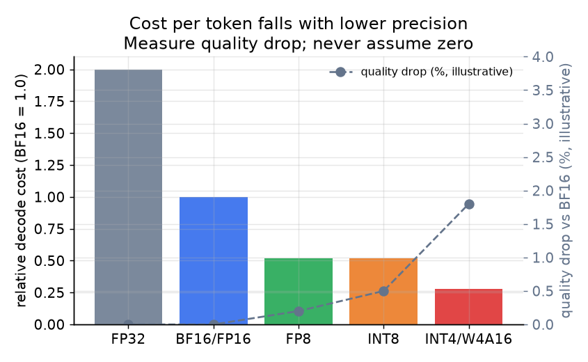

# 5. 并行与量化

模型放不进一张 GPU 时，必须先切分才谈得上 serving。放得进时，还有两个额外的杠杆：复制多份换更高吞吐，或者压缩每个参数的字节数让 decode 更快。本节讲三个切分轴，以及能降低前几节里内存和带宽成本的量化策略（用更少的比特存每个权重，每步搬的字节就更少）。

## 张量并行（TP）

张量并行把每一层的权重矩阵切到多张 GPU 上。对一个线性层 $Y = XW$，把 $W$ 的列分给 $T$ 张 GPU；每张 GPU 持有 $W_{\text{local}} \in \mathbb{R}^{d \times (d/T)}$ 并计算自己那部分输出。在每一层的边界做一次 all-reduce，把 $T$ 张 GPU 上的部分结果合并后，再把激活传给下一层。

因为每一层、每一个 token 都要 all-reduce，TP 需要非常快的互连。在单个 NVLink 互联的节点内（8 张 H100），带宽足够高，通信成本相对省下的算力来说很小。跨节点，或者走更慢的链路，all-reduce 就成了瓶颈。把 TP 限制在单节点内。

TP 的好处：降低每张 GPU 的内存占用（模型被切开了），还能缩短单请求延迟，因为每张 GPU 每层只处理一小片计算。

## 流水线并行（PP）

流水线并行按层的分组（stage）把模型切到多张 GPU 或多个节点上。GPU 0 持有第 1 到第 $L/S$ 层，GPU 1 持有接下来的 $L/S$ 层，依此类推共 $S$ 个 stage。激活通过网络链路从一个 stage 传给下一个。通信只发生在 stage 边界，所以 PP 对跨节点慢链路的容忍度比 TP 高。

PP 的代价是**流水线气泡**：最朴素的做法下，后面的 stage 要闲着等前面的 stage 跑完。把气泡藏起来的办法是同时保持很多个 micro-batch 在途（一个 stage 处理第 $b+1$ 批的同时，下一个 stage 在处理第 $b$ 批）。这对追求吞吐的 serving 没问题，但对单请求延迟没帮助：那个请求仍然要依次等每个 stage。

经验法则：节点内用 TP（链路快，帮延迟，也能装下模型）；跨节点用 PP（能容忍慢链路，可以横向扩展，但有气泡）。一旦单份副本能装进它的那组 GPU，就靠整份复制来换吞吐。

## MoE 模型的专家并行（EP）

混合专家模型把每个 token 路由到一小部分专家上（通常是 8 个、64 个或更多专家里选 2 个）。专家就是标准的前馈块，数量可能多到一张 GPU 装不下。专家并行把不同专家放到不同 GPU 上，每个 token 被路由到持有它所选专家的那张 GPU。这需要一次 all-to-all 通信（token 飞向各自的专家 GPU，结果再飞回来），开销很大，而且路由一旦倾斜（某些专家 GPU 很热，其他的闲着）就会负载不均。EP 是 MoE 专属的；稠密模型只有 TP 和 PP 两个轴。

## 量化：每个 decode step 更少的字节

decode 受带宽限制：每个 token 都要从 HBM 读一遍完整模型。每个权重的字节数更少，每步搬的字节就更少，直接换来每秒更多的 token。

$$\text{decode bytes per step} = P \cdot b_w + N \cdot \text{KV}_{\text{bytes}}$$

```python
def decode_bytes_per_step(num_params, bytes_per_weight, batch_size, kv_bytes):
    # bytes read from HBM each step: the weights plus every sequence's KV cache
    return num_params * bytes_per_weight + batch_size * kv_bytes  # total bytes moved
# decode_bytes_per_step(70e9, 1, 50, 3.3e8) -> 86500000000.0
```

把 $b_w$（每个权重参数的字节数）从 2（BF16）降到 1（INT8），读权重的成本大致减半，直到触及带宽上限。

**INT8 权重量化：** 权重以 8 位整数存储，运行时反量化或者直接用 8 位 kernel 计算。现代硬件普遍支持。Character.AI 用 INT8 加自定义 kernel，报告了 serving 成本的大幅下降。上线前需要做质量评估。

**FP8 权重量化：** H100 GPU 原生支持，有硬件 FP8 tensor core。Baseten 报告他们的模型输出与 BF16 相比余弦相似度在 99% 以上，吞吐高出 50% 以上。在 H100 或更新的硬件上，推荐作为降精度的首选。

**4 位权重量化（W4A16、GPTQ、AWQ）：** 权重以 4 位存储，矩阵乘之前反量化到 BF16。适合用更少的 GPU 装下更大的模型，也能加速冷启动（要加载的字节更少）。质量损失比 FP8 大，必须逐个模型评估。

**KV cache 量化：** 量化的是 KV cache 里的条目，而不是权重。高并发下内存瓶颈往往是 KV cache（不是权重），量化它能提高连续批处理可以维持的最大 batch，于是吞吐再上一个台阶。INT8 KV 配 BF16 权重是常见搭配。



*精度越低，decode 的相对成本越低，因为每步从 HBM 读的字节更少。质量损失只是示意；上线前要按模型和负载逐个测量。H100 上 FP8 是推荐的第一步：成本显著下降，实践中质量影响可以忽略。*

## 什么时候用哪个

| 选用 | 什么时候 | 而不是 |
|---|---|---|
| 张量并行（节点内） | 模型放不进一张 GPU，或者单请求延迟必须降下来；有快速 NVLink | 跨慢速的节点间链路；TP 的 all-reduce 会成为瓶颈 |
| 流水线并行（跨节点） | 需要的 GPU 比一个节点能装的多；目标是吞吐 | 单请求延迟是首要 SLO 时；PP 会增加流水线气泡延迟 |
| 复制 | 模型能装进一组 GPU；吞吐随副本数线性增长 | 一份副本已经占满全部可用 GPU 时 |
| 专家并行 | 大型 MoE，专家超出单 GPU 容量 | 稠密模型；EP 只会增加 all-to-all 成本，没有 MoE 稀疏的收益 |
| FP8 量化（H100 及以上） | 降精度的第一步；硬件支持；余弦相似度守得住 | 拿 W4A16 当第一步；FP8 的质量风险更小 |
| INT8 权重量化 | 没有 FP8 可用；对质量有中等程度的容忍 | 有 FP8 就用 FP8；INT8 矩阵乘 kernel 在不同硬件上的表现差异更大 |
| 4 位权重量化 | 要装下大模型；冷启动加载权重的时间很重要 | 质量评估不过关时；4 位的每步质量风险最高 |
| KV cache 量化 | 卡住的内存限制是并发（而不是权重带宽） | 只做权重量化，当目标 batch 下填满 HBM 的是 KV cache 时 |

**提供这些能力的工具。** 张量并行和流水线并行内置于 vLLM、TensorRT-LLM（NVIDIA）和 DeepSpeed-Inference；面向 MoE 的专家并行内置于 vLLM 和 SGLang。量化这边：GPTQ 和 AWQ 是常见的仅权重量化方法，bitsandbytes 提供训练期和轻量 serving 用的 INT8/4 位，llama.cpp 的 GGUF 面向 CPU 和端侧，FP8 则通过 TensorRT-LLM 和 vLLM 在 H100 级别硬件上提供。KV cache 量化（FP8/INT8 KV）在 vLLM 和 TensorRT-LLM 里是一个开关。

**出处。** 张量并行和流水线并行起源于 Megatron-LM（NVIDIA）；它们所依托的内存切分脉络可以追溯到 ZeRO（Microsoft）。专家并行沿袭 GShard 和 Switch Transformer（Google）的稀疏 MoE 路由。量化方面，GPTQ（2022）和 AWQ（MIT，2023）是仅权重训练后量化的参考方法。

**实例。** 在一台 8xH100 节点上为交互式聊天服务一个 70B 模型：模型放不进单张 GPU，八张卡之间的 NVLink 很快，而且单请求延迟是 SLO，所以在节点内用张量并行（TP=8），而不是流水线并行，后者在这个规模下只会增加流水线气泡延迟而没有吞吐收益。先做 FP8 权重加激活量化（H100 支持，质量风险最小），只有 HBM 仍然是卡住的约束时才降到 4 位权重。如果之后需求要 5 倍吞吐，就在负载均衡器后面整份复制 TP=8 的单元，而不是把 TP 扩到跨节点，那里慢速节点间链路上的 all-reduce 会占据主导。如果撞上的不是权重带宽墙而是并发墙（大量长上下文会话），那 KV cache 量化腾出的余量会比继续压缩权重更多。
