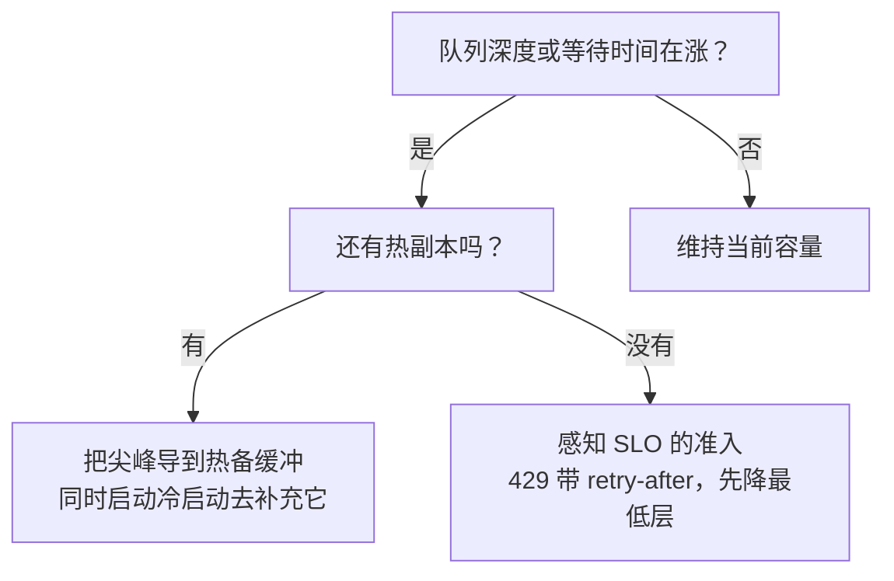

# 6. 自动扩缩容与成本

把每张 GPU 的吞吐做到极致，前提是负载低的时候没在为闲置 GPU 付钱，负载冲高的时候请求也没有跌出 SLO。自动扩缩容（随负载变化自动增删 GPU 副本）就是这两者之间的桥。它也是 LLM serving 相比 CPU 服务多出来的一道坎：这里的冷启动是以分钟计的，不是毫秒。

## 冷启动问题

拉起一个新的 GPU 副本，要先调度到一个 GPU 节点（这类资源池往往很紧张），拉取模型镜像（可能有几百 GB），把权重加载进 HBM，再预热引擎（编译 CUDA graph、建好 attention 相关的缓存）。整套下来要两到五分钟。而一次让 QPS 翻倍的流量尖峰，几秒钟就到了。等新副本就绪，尖峰可能已经过去，SLO 却在最要命的时刻被打破了。

CPU 服务里那套标准的扩缩容循环，是在 CPU 利用率或者请求延迟已经涨上去之后才做出反应。放到 GPU 上做 LLM serving，这些都是滞后信号：等 p99 TTFT 涨起来，几十个请求的 SLO 已经错过了，新副本还在启动中。

## 用领先信号扩缩容

要基于**领先信号**扩容，也就是能在 SLO 被违反之前就预示它的信号：

- **队列深度：** 等待开始 prefill 的请求数，是首 token 延迟劣化最直接的预测量。队列增长比服务端消化得快，TTFT 就一定会涨。该在队列超过阈值时扩容，而不是等 TTFT 已经涨了才动。
- **队列等待时间：** 一个请求还没开始 prefill 就已经等掉的时间，直接对应它的 TTFT。当平均等待时间越过 TTFT 预算的某个比例（比如 500 ms 的 SLO 里已经等了 200 ms），就触发扩容。
- **GPU 显存利用率：** KV cache 的占用率是吞吐饱和的领先指标。KV 占用高，说明调度器已经在拒绝新序列或者抢占已有序列，很快就会表现为 TTFT 尖峰。

CPU 或 GPU 利用率可以作为辅助校验，但不该当主信号。

## 热备缓冲（warm buffer）模式

任何时候都保留少量**已经预热好的空闲副本**。新副本启动的这几分钟里，由它们来吃掉流量尖峰。代价是低峰时段要为闲置的 GPU 时间付钱。缓冲该留多大，取决于尖峰幅度、冷启动时长和 SLO 的容忍度。如果尖峰是平均值的 3 倍、冷启动要 3 分钟，那就需要足够的热容量顶住这 3 分钟的缺口。不少团队会常备一到两个热副本，接受这点适度的闲置成本。

```python
import numpy as np
def warm_replicas_needed(spike_qps, steady_qps, qps_per_replica):
    # pre-warmed replicas to cover the spike load above steady capacity while cold starts finish
    gap_qps = max(spike_qps - steady_qps, 0)         # extra load a spike adds
    return int(np.ceil(gap_qps / qps_per_replica))   # round up to whole replicas
# warm_replicas_needed(1500, 500, 400) -> 3
```


**把冷启动做快**，需要的热备缓冲就能小一些：

- 把模型镜像缓存到离 GPU 更近的地方（本地 NVMe、区域内的模型仓库）。
- 预热阶段把权重流式送进 HBM，而不是等整份拷完再开始。
- 对预热完成的进程做快照，下次启动直接从 checkpoint 恢复，不必从头初始化。Modal 的 Memory Snapshots 宣称冷启动能缩短到十分之一。
- 只在冷启动的加载路径上用激进量化（INT4）：要取的字节更少，进入可服务状态更快。

只有那些第一个请求慢一点也能接受的冷路径，才适合缩容到零。热路径上绝不要这么做。

## 感知 SLO 的准入与主动降载

系统饱和时，来者不拒的结果是所有请求一起错过 SLO。正确的做法是**受控降载**：服务端饱和时，用明确的 429 式信号加上重试提示直接拒绝新请求，而不是把它们无限期地堆在队列里。已经被放行的请求保住自己的位置和预留的 KV cache 预算，在途请求的 SLO 因此得到保护。

要让这套做法安全，有两件事必须配合起来：

**按序列预留 KV：** 请求被准入的那一刻，就立即为它预留最大的 KV cache 预算。这样才不会因为放进一个新请求，触发 OOM 把正在 decode 的请求打死。vLLM 的 PagedAttention 用基于 block 的分配解决了这个问题；朴素的连续分配则可能在流式输出到一半时 OOM。

**优先级队列：** 在付费和免费的两层体系里，维护各自独立的队列或者 token 预算。付费请求优先准入，看到的有效利用率上限更低；要降载时先降免费层。先把保底的容量切片分配出去，再考虑接受低优先层的请求。

## 每百万输出 token 的成本

每张 GPU 的吞吐直接决定成本。公式是：

$$\text{cost per million tokens} = \frac{\text{GPU hourly rate} \times 10^6}{\text{tokens/s/GPU} \times 3600}$$

以每 GPU 小时 \$3 的 H100、每张 GPU 每秒 80 token 的吞吐来算：

$$\text{cost} = \frac{3 \times 10^6}{80 \times 3600} \approx 10.4 \text{ USD per million tokens}$$

```python
def cost_per_million_tokens(gpu_hourly_rate, tokens_per_sec_per_gpu):
    # tokens/hour per GPU = tokens/s * 3600; cost = rate per that many tokens, scaled to 1e6
    tokens_per_hour = tokens_per_sec_per_gpu * 3600
    return gpu_hourly_rate * 1e6 / tokens_per_hour  # USD per million output tokens
# cost_per_million_tokens(3, 80) -> 10.416666666666666
```

每张 GPU 的吞吐翻一倍，成本就砍一半。这也是连续批处理、量化和投机解码在商业上影响格外大的原因：它们抬的都是上面这个公式的分母。

## serving 是选供应商的问题，不只是选模型的问题

对于自己不托管的模型，同一份权重会有很多家在提供服务，而它们并不等价：同一个开源模型在不同家手上，每秒输出 token 数和每 token 价格能差好几倍，因为各家用的引擎、批处理策略、量化方案和硬件都不一样。不要笼统地说"这个模型的成本是 X"；要在一个滚动窗口上，按供应商分别测**中位（p50）速度和价格**，单次测量的噪声太大。[Artificial Analysis](https://artificialanalysis.ai/) 这类独立测评方发布的正是这个数据：每个模型在每家供应商上的 p50 输出速度和价格，做自建还是外购、选哪家的决策时，该看的就是它。实操上的规则是：在速度和价格的前沿上，挑一个满足你延迟 SLO 的供应商，并且定期复查，因为这条前沿是会动的。

## 指标矩阵：质量、成本、安全（离线与在线）

一次 serving 侧的改动，不能只看吞吐来判断好坏。它落在三个轴上（质量、成本、安全），每个轴都有一个上线前测的离线代理指标，和一个在真实流量上确认的在线信号。所以一次抬高了每秒 token 数的量化收益，仍然得先过质量闸门才能发出去。

| 轴 | 离线 | 在线 |
| --- | --- | --- |
| 质量 | 在 golden set 上，改精度或换引擎之后的任务评测分（比如降到 INT8 或 INT4 后准确率是否守得住） | 线上流量的输出改写率、点赞点踩，以及质量回退告警 |
| 成本 | 目标 batch 下的 tokens/s/GPU，以及每百万 token 成本 $= \frac{\text{GPU hourly rate} \times 10^6}{\text{tokens/s/GPU} \times 3600}$ | 真实负载下的 p99 TTFT 和 TPOT、计费的 GPU 小时数、各供应商的 p50 速度与价格 |
| 安全 | 在模拟饱和下验证降载与准入行为；不出现 OOM 打死在途请求 | 真实尖峰下观察到的 429 比例、SLO 违反率，以及抢占或 OOM 事件 |

一套又便宜又快、但会悄悄让质量回退或者在高负载下丢请求的 serving 配置，是不能上线的，所以放行一次发布要看的是三个轴，不是只看成本。

## 瓶颈对照表

| 瓶颈 | 最早的征兆 | 根因 | 解法 |
|---|---|---|---|
| GPU 利用率低 | tokens/s/GPU 远低于 roofline | 静态批处理，或者有效 batch 太小 | 连续批处理（迭代级） |
| 混合负载下 TPOT 尖峰 | 新请求到达时 token 间延迟出现尖峰 | 长 prefill 挡住了在途的 decode step | 分块 prefill 或 prefill/decode 分离部署 |
| 高并发下 KV cache OOM | 请求在 decode 中途被抢占或拒绝 | 算力还没跑满，KV cache 先把 HBM 填满了 | 分页 KV、KV 量化、调小最大序列预算 |
| 模型装不下一张 GPU | 不切分就根本起不来 | 权重加激活显存超过 HBM | 节点内张量并行 |
| decode 的延迟地板 | 即使 batch 为 1，单 token 延迟也降不下去 | 一次昂贵的目标模型前向只出一个 token | 投机解码；启用前先验证接受率 |
| 过载下的尾延迟 | 高 QPS 时 p99 TTFT 爆炸 | 把所有请求都放进已经饱和的队列 | 感知 SLO 的准入，用 429 做背压 |
| 尖峰期延迟 | QPS 冲高时新副本还没就绪 | 冷启动时长超过尖峰的上升时间 | 热备缓冲、领先信号扩容、快速加载权重 |
| decode 的显存带宽 | batch 已经很大，吞吐仍低于带宽 roofline | 每步都按全精度读权重 | 权重与 KV 量化（FP8、INT8） |

这张表里有两处值得记牢。第一，"GPU 利用率低"和"KV cache OOM"这两行是往相反方向拉的：修好前者的迭代级批处理（连续批处理，出自 Orca，OSDI 2022）会放进更多并发序列，而这正是把 HBM 填满 KV cache、进而触发后者的原因。分页 KV 这个解法（PagedAttention，出自 UC Berkeley 的 vLLM，2023）的作用，是让你能把 batch 继续往上推，而不用承受本来会更早逼出 OOM 的碎片浪费，所以这两个解法是设计成一起上的，不是二选一。第二，"decode 的延迟地板"那一行有个常被跳过的前提：投机解码（Google 和 DeepMind，2023）只有在具体负载上的接受率足够高、验证通过的 token 收益盖过起草开销时，才会把地板降下来；在接受率低的自由生成流量上，它反而会把地板抬高，所以启用前要先测接受率，别当成白捡的收益。

## 落地与训练中的坑

上面那张瓶颈表讲的是稳态 serving；下面这些则是真实流量第一次大幅波动时冒出来的运维问题。它们大多可以追溯到同一个根子上：把 GPU 集群当成了无状态的 CPU 服务。

| 问题 | 症状 | 解法 |
|---|---|---|
| 用滞后信号扩容 | p99 TTFT 已经击穿 SLO，副本才开始启动 | 改用领先信号扩容（队列深度、队列平均等待时间、KV 占用率），而不是事后看 CPU 或延迟 |
| 热路径上缩容到零 | 空闲一段时间后的第一个请求，要吃掉好几分钟的完整冷启动 | 交互路径上保留热备缓冲；只对第一个请求慢一点也能接受的冷路径缩容到零 |
| 扩缩容抖动 | 副本被反复增删，一次次付冷启动的代价，容量始终震荡 | 加上缩容冷却期和稳定观察窗口，并引入迟滞（扩得比缩得快） |
| 过载下的重试风暴 | 已经饱和的集群又被客户端重试打一遍，负载被放大，故障加深 | 返回 429 并带上 retry-after 提示，要求客户端做带 jitter 的指数退避，再加熔断 |
| 没有按序列预留 KV | 放进一个新请求就触发 OOM，把正在 decode 的请求打死 | 准入时就用分页（基于 block）的分配，为每个请求预留最大 KV 预算 |
| 靠盲目量化去凑成本目标 | 每 token 成本降下来了，线上输出质量却在悄悄回退 | 每一次降精度都要过评测闸门；降到 INT4 之前，先把 INT8 留作退路 |
| 冷启动被镜像和权重加载拖住 | 新副本要好几分钟才好，逼得热备缓冲开得过大 | 把模型镜像缓存到本地 NVMe，预热时把权重流式送进 HBM，从预热好的进程快照恢复 |
| 拿单一供应商的报价当"模型成本" | 同一个开源模型在不同家的真实速度和价格能差好几倍，而且会随时间漂移 | 在滚动窗口上按供应商测 p50 输出速度和价格，并定期复查 |

扩容那一刻的决策流大致如下，领先信号和热备缓冲正是在这里必须配合起来：



贯穿这一节的那条线是：在 SLO 信号动起来之前就做出反应，保住在途请求优先于放进新请求，以及绝不让一个成本目标在没有评测闸门把关的情况下带着质量回退上线。
