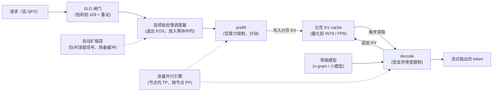

# 9. 小结

## 一页回顾

- **decode 受显存带宽限制，prefill 受算力限制。** 任何优化都要从 roofline 出发。decode 吞吐随 batch 增大而上升，因为固定的权重读取成本被摊到了每步更多的 token 上；它会在带宽天花板处、或者 KV cache 填满 HBM 时见顶。prefill 本来就已经算力饱和，从批处理里得到的好处要少得多。

- **连续批处理是基线，不是优化项。** 每个 token step 都重组 batch，GPU 就不必等最长的那条序列跑完，始终保持满载。PagedAttention 则消除了 KV cache 的碎片。这两者合起来是地板；其他所有杠杆都建在它们之上。

- **TTFT 和 TPOT 是两个不同的 SLO，对应不同的杠杆。** 共享资源池上跑一个长 prefill，会让在途 decode 的 TPOT 出现尖峰。分块 prefill 把这份成本摊到若干步里。分块 prefill 还不够时，分离式 serving 把两个阶段隔离到各自的资源池里。

- **投机解码打破了一次前向只出一个 token 的限制，但前提是接受率足够高。** 加速比服从
  $(1-\alpha^{k+1})/((1-\alpha)(1+ck))$；
  $\alpha$ 低的时候它是净亏的。启用前先按各自的负载测接受率；输出会复述输入时，n-gram 起草表现极好。

- **并行是大模型能跑起来的前提，不是一个提吞吐的选项。** 一个 BF16 的 70B 模型，至少要在两张 H100 上做张量并行。节点内用 TP，为了延迟也为了装下模型；跨节点用 PP，为了继续扩展；一旦单份副本装得下，就整份复制。

- **量化划算，正是因为 decode 受带宽限制。** 每个权重的字节数更少，意味着每步读的字节更少，直接换成每秒更多的 token。H100 上推荐 FP8 作为第一步；任何一次降精度都必须有质量评测把关。

- **用领先信号做自动扩缩容。** 队列深度或等待时间能在 TTFT 违约发生之前就预示它。留一份热备缓冲。饱和时主动降载，而不是把注定要错过 SLO 的请求放进来。

## 一页看完整个系统

**它是怎么运转的。** 请求首先撞上 SLO 闸门：系统已经饱和时，闸门用 429 加重试提示把它降掉，而不是让队列无限增长，从而保住尾延迟。放行的工作流进连续批处理调度器，它每一步都让触发 EOS 的序列退出、把等待中的序列放进来，于是 batch 一直是满的，不必等最慢的那个成员。prefill 受算力限制、分块执行，把 prompt 的 key 和 value 写进分页 KV cache；decode 受带宽限制，每步读一次这个 cache，并把新 token 的 KV 追加回去，这就是 decode 和 cache 之间箭头是双向的原因。可选的草稿模型给 decode 供料，用于投机解码；虚线箭头表示的是控制面和切分层面的事：自动扩缩容盯着队列深度，在延迟炸掉之前就加副本，张量并行引擎则把 prefill 和 decode 都切到节点内的多张 GPU 上。输出是一串流式 token，而不是一次阻塞式的整体返回，所以 prefill 一完成，用户就能看到第一个 token。

## 自测

答案是折叠的。每题先自己答一遍再展开。

1. 为什么 decode 吞吐随 batch 增大而上升，prefill 吞吐却不会？decode 的这种增长又会在哪里停下？

   

答案

   这两个阶段落在 roofline 的两侧。**decode 受带宽限制**：每一步都要把完整的权重矩阵从 HBM 读出来，就为了吐一个 token，算术强度接近 1，所以加序列等于把这次固定的权重读取摊到每步更多的 token 上，几乎是白捡的吞吐。**prefill 本来就受算力限制**：它在一次并行前向里处理完所有 prompt token，GPU 已经在满负荷做运算，加大 batch 只是增加工作量，并没有解锁任何闲置算力。增长会停在两道天花板里先到的那一道。**带宽天花板**：HBM 带宽一旦用尽，再加序列也不会抬高 tokens/s/GPU。**KV cache 天花板**：每步的成本是 $P \cdot b_w + N \cdot \text{KV}_{\text{bytes}}$，$N$ 一大，KV 那一项就把 HBM 填满，直到调度器开始抢占；到那个点之后吞吐是往下掉，而不是走平，因为每个被抢占的序列要么走 PCIe 换出，要么用一次多余的 prefill 重算（见第 [2](02-the-throughput-problem.md) 节和第 [3](03-batching.md) 节）。

   

2. 一个 32k token 的 prompt 请求到达时，另有 40 个更短的请求正在 decode 中途。在静态批处理下，和在连续批处理加分块 prefill 下，这 40 个请求分别会怎样？

   

答案

   在**静态批处理**下，这 40 个请求要一直占着槽位，直到整批退出，所以一条 10 个 token 就结束的序列会一直霸着槽位，而最长的那个成员还要再跑 800 步，GPU 就把这些步耗在了"占着但已完成"的槽位上。那个 32k 的请求在整批换掉之前根本没法开始 prefill，所以它的 TTFT 由最慢的成员决定；等它终于跑起来，整个 32k 的 prefill 会砸在一步里。在**连续批处理加分块 prefill** 下，调度器在下一个 token step 就放它进来，并把 prefill 切成若干块（本章例子里是 512 个 token 一块，所以大约 64 块），与正在进行的 decode step 交错着跑。这 40 个在途请求于是承受的是摊在很多次迭代上的一点点变慢，而不是一次完整的停顿；不分块的话，第 [8](08-interview-qa.md) 节给出的数字是一个 32k prefill 接近 400 ms，其他每个用户在自己的 token 流里都会看到 400 ms 的空档。代价是那个 32k 请求自己的 TTFT 稍差，外加实打实的 KV 压力：BF16 下每个 token 约 320 KB，这条 prompt 大约就是 10 GB 的 cache，所以准入时必须预留余量，否则整个池子会滑向抢占（见第 [2](02-the-throughput-problem.md) 节和第 [3](03-batching.md) 节）。

   

3. 你启用了 $k=4$ 的投机解码，测得接受率 $\alpha=0.35$。按加速比公式、取开销 $c=0.12$，这笔买卖净赚吗？

   

答案

   严格说是赚的，但赚得太少，不值得上线。代入
   $\text{speedup} = \frac{1 - \alpha^{k+1}}{(1 - \alpha)(1 + ck)}$：分子是 $1 - 0.35^5 \approx 0.995$，除以 $1 - 0.35 = 0.65$，得到**每次目标模型前向期望产出约 1.53 个 token**；分母是 $1 + 0.12 \times 4 = 1.48$，所以加速比约为 **1.03 倍**。为了 3% 的收益，要额外托管、调优和监控第二个模型，而且这个位置紧挨着 Fireworks 测到的那个区间：通用草稿在 $\alpha \approx 0.29$ 时反而慢了 1.5 倍。解法是把接受率提上去，而不是把 $k$ 加大：$\alpha$ 低的时候增大 $k$，只会增加起草成本 $ck$，换不来更多被接受的 token。要么用按负载定制的草稿模型（Fireworks 做到 $\alpha = 0.76$，加速 2 倍），要么在输出复述输入时用 n-gram 的 prompt lookup 起草（LinkedIn 这样做到了接近 4 倍）。另外先看清楚 batch 所处的区间，因为在算力已经饱和的密集 batch 下，验证所依赖的那份富余算力根本不存在（见第 [4](04-speculative-decoding.md) 节和第 [8](08-interview-qa.md) 节）。

   

4. 一个团队要在 H100 上 serving 一个 70B 的稠密模型。在能接任何流量之前，最少需要几张 GPU，先上哪种并行方式？

   

答案

   **两张 H100，先上张量并行。** BF16 的 70B 稠密模型权重约 140 GB，而每张 H100 只有 80 GB HBM，所以切分是能不能开始 serving 的前提，不是一个提吞吐的可选项。之所以先上 TP，是因为它把每一层的矩阵切到多张 GPU 上，同时降低每张 GPU 的显存占用和每 token 的延迟，而 50 ms 的 TPOT SLO 正需要后者；把它限制在一个 NVLink 节点内，因为每个 token 在每一层都要触发 all-reduce。PP 在这里是错误的第一步：它只能让你用上超过单节点容量的 GPU，还会引入损害单请求延迟的流水线气泡。两张卡要当成下限而不是方案，因为 140 GB 挤在 160 GB 里，几乎没有余量留给 KV cache；capstone 里的方案定的是**单节点内 TP=8**，FP8 权重约 70 GB（每张 GPU 大约 9 GB），把节点上 640 GB 里的绝大部分留给了 KV。再往上扩，是在负载均衡器后面整份复制这个 TP 单元，而不是把 TP 拉宽到跨节点（见第 [1](01-clarifying-requirements.md) 节、第 [5](05-parallelism-and-quantization.md) 节和第 [10](10-putting-it-together.md) 节）。

   

5. 稳态下你的 p99 TTFT 没问题，一到早高峰就炸。请把你会落地的领先信号扩容方案讲一遍，并说明如果尖峰比新副本更快到来，你会降掉什么。

   

答案

   这个症状说明你是在用**滞后信号**扩容：p99 TTFT 要等队列已经堆了好几秒才会动，而冷启动要两到五分钟，尖峰却是几秒钟就到。改用**队列深度和队列平均等待时间**：在 500 ms 的 TTFT 预算里等待时间越过 200 ms 就触发，KV 占用率作为次要指标，CPU 或 GPU 利用率只用来做常识性校验。为冷启动补不上的那段缺口配一份**热备缓冲**：稳态 500 QPS、尖峰 3 倍、每副本约 400 QPS，那就是 $\lceil (1500 - 500)/400 \rceil = 3$ 个热副本。同时把冷启动本身压短：模型镜像缓存到本地 NVMe，预热时把权重流式送进 HBM，从预热好的进程快照恢复（Modal 宣称能缩短到十分之一），并加上缩容冷却期和迟滞，免得扩缩容抖动、反复付启动的代价。如果尖峰还是快过启动，就有意识地降载：返回 429 并带上 retry-after 提示，要求客户端做带 jitter 的指数退避，别让它变成重试风暴；**先降免费层**，付费层保住自己预留的容量切片；并且绝不降掉已经在途的请求，因为每个在途请求都占着预留的 KV 预算，杀掉它等于把已经做完的工作白白扔掉（见第 [6](06-autoscaling-and-cost.md) 节和第 [8](08-interview-qa.md) 节）。

   

6. 你把 KV cache 从 BF16 量化到 INT8。这对 serving 有哪两个影响，上线前必须验证什么？

   

答案

   两个影响都来自搬的 KV 字节变少了。第一是**并发**：每个 token 的 KV 字节减半，一个 80 层、8 个 GQA KV head、head 维度 128 的 70B 模型，每 token 从约 320 KB 降到约 160 KB，同样的 HBM 能装下大约两倍的活跃序列，于是连续批处理能维持更大的 batch，抬高 tokens/s/GPU（也因此拉低每百万输出 token 的成本，因为吞吐就在分母上）。第二是**每步带宽**：decode 每步除了读权重，还要读 $N \cdot \text{KV}_{\text{bytes}}$，KV 那一项减半，这一步就更短，直接换来更好的 TPOT。这两点在长上下文的场景下最要紧，比如本章场景里 8k token 的 RAG prompt，那时候卡住 HBM 的是 cache 而不是权重。上线前要用质量把关：在 golden set 上跑任务评测，确认分数守得住，放量后盯住在线信号（输出改写率、点赞点踩、回退告警），跟任何一次降精度的做法完全一样。另外要确认你只量化了 cache：MQA、GQA、跨层 KV 共享这类对 attention 结构的改动必须训进模型，因为从没被优化过去读共享或平均 KV 子空间的 query head 会 attend 到错误的 token（见第 [5](05-parallelism-and-quantization.md) 节、第 [6](06-autoscaling-and-cost.md) 节和第 [8](08-interview-qa.md) 节）。

   

## 延伸阅读

- capstone：[完整的方案](10-putting-it-together.md)，本章的每一个选择都在那里针对场景做一次拍板、算出成本、在另外两组约束下重建一遍，最后压缩成一个可运行的单文件批处理调度器。
- 包含全部数学、案例研究和"什么时候用哪个"表格的密集参考：[topics/04-inference-serving-at-scale.md](../../topics/04-inference-serving-at-scale.md)。
- 逐个系统的拆解（Anyscale、Character.AI、LinkedIn、NVIDIA、Together、Fireworks、Modal）：[tools/teardowns/04.md](../../tools/teardowns/04.md)。
- 所有 serving 系统的并排对比，以及把它们区分开的那些数学：[tools/comparisons/04.md](../../tools/comparisons/04.md)。
