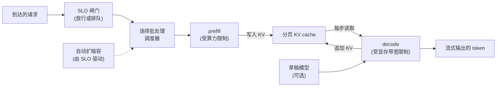

# 大规模 LLM 推理服务

> 本章是英文原版的中文译本，原文见 [book/inference-serving/](../../book/inference-serving/)。译文和原文同步维护，发现问题请提 issue。

面试官很少直接说"实现一下 continuous batching"。他们会说：**"我们在高 QPS 下对外提供 LLM API，GPU 成本一直在涨。给我讲讲你的 serving 栈。"** 这个问题考的是吞吐工程，不是模型设计。整个游戏的核心，是把尽可能多的 token 塞进每一个 GPU step，同时不让尾延迟越过 SLO。这两个目标互相拉扯，而正是这种拉扯决定了本章里的每一个架构选择。

本章从头到尾把整个 serving 系统搭起来，并展示 Anyscale、Character.AI、LinkedIn、NVIDIA、Together AI、Fireworks、Moonshot 等团队实际是怎么上线的。

## 各节

1. [澄清需求](01-clarifying-requirements.md)：一段划定问题边界的对话，以及随之而来的两个推论。
2. [吞吐问题](02-the-throughput-problem.md)：prefill 与 decode、显存墙、首 token 延迟与 token 间延迟。
3. [批处理](03-batching.md)：连续批处理、分块 prefill、prefill/decode 分离部署。
4. [投机解码](04-speculative-decoding.md)：起草加验证、加速比公式、什么时候有用。
5. [并行与量化](05-parallelism-and-quantization.md)：张量并行、流水线并行、专家并行；权重与 KV 的精度。
6. [自动扩缩容与成本](06-autoscaling-and-cost.md)：用领先信号做扩缩容、冷启动、每百万 token 的成本。
7. [真实团队在生产环境里怎么做](07-how-teams-do-it-in-production.md)：点名的公司、它们在哪里分道扬镳、第一手的技术文章。
8. [面试问答](08-interview-qa.md)：常考的、有坑的、经常答错的。
9. [小结](09-summary.md)：一页回顾、一页系统全景、自测题。
10. [把它们拼起来：完整的方案](10-putting-it-together.md)：一套默认技术栈，把场景连同容量和成本的计算从头到尾做一遍，同一个系统在三组不同约束下的样子，以及一个最小可运行的调度器。

## 一页看完整个系统

第一次读请按顺序来，各节层层递进。每一节都以面试官真正会问的那个问题开头，然后回答它。

## 配套章节

[模型压缩](../model-compression/)会更深入地讲本章所服务的那个产物：量化格式与离群值问题、硬件真正能跳过计算的剪枝形态、蒸馏，以及压缩后的模型在替换原模型之前必须通过的验收测试。

经典 ML 的姊妹书从另一侧覆盖了同一块地盘：[realtime-serving](https://github.com/neurarch-ai/awesome-ml-system-design/tree/main/book/realtime-serving/) 讲的是经典 ML 的 serving 问题，那里的请求便宜又均匀，决定 p99 的是排队，而不是 KV cache。
